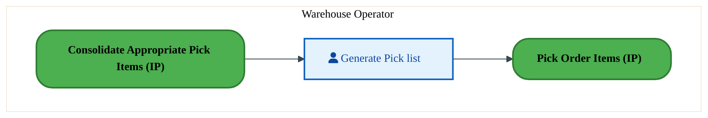
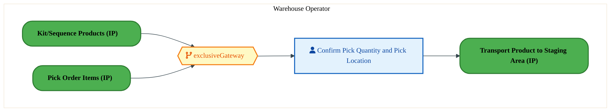

  
  <h1 style="font-size:36px; margin-top:24px;">LO-160 — Pick Orders - OTC (IP)</h1>
  <h2 style="font-size:24px;">Architecture Document (TOGAF BDAT)</h2>
  
Order To Cash (IP) (OTC-IP) Tower 
  Capability LO-160 · LO Logistics Management Outbound - OTC (IP)

  
IAO Program · Release 3 
  Generated: March 2026 
  Sajiv Francis

  
IAO Architecture Pipeline — Intel Confidential

Page 1<a href="#toc">↑ Back to TOC</a>LO-160 — Pick Orders - OTC (IP)

## Table of Contents

1. [Executive Summary](#1-executive-summary)
2. [Business Context & Objectives](#2-business-context--objectives)
   - 2.1 [Classification](#21-classification)
   - 2.2 [Business Drivers](#22-business-drivers)
   - 2.3 [Success Criteria](#23-success-criteria)
   - 2.4 [Companion Documents](#24-companion-documents)
3. [Business Architecture (TOGAF "B")](#3-business-architecture-togaf-b)
   - 3.1 [Business Process Overview](#31-business-process-overview)
   - 3.2 [Business Process Diagrams](#32-business-process-diagrams)
   - 3.3 [Business Roles & Responsibilities](#33-business-roles--responsibilities)
4. [Data Architecture (TOGAF "D")](#4-data-architecture-togaf-d)
   - 4.1 [Data Entities & Ownership](#41-data-entities--ownership)
   - 4.2 [Data Flow Diagrams](#42-data-flow-diagrams)
   - 4.3 [Data Lineage](#43-data-lineage)
   - 4.4 [RICEFW Data Objects](#44-ricefw-data-objects)
   - 4.5 [Data Governance & Quality](#45-data-governance--quality)
5. [Application Architecture (TOGAF "A")](#5-application-architecture-togaf-a)
   - 5.1 [Current-State Application Landscape](#51-current-state--current-state-application-landscape)
   - 5.2 [Future-State Application Landscape](#52-future-state--future-state-application-landscape)
   - 5.3 [Change Impact Summary](#53-change-impact-summary)
   - 5.4 [Component Overview](#54-component-overview)
   - 5.5 [RICEFW Inventory](#55-ricefw-inventory)
   - 5.6 [Integration Patterns](#56-integration-patterns)
6. [Technology Architecture (TOGAF "T")](#6-technology-architecture-togaf-t)
   - 6.1 [Platform & Infrastructure](#61-platform--infrastructure)
   - 6.2 [SAP Development Object Status](#62-sap-development-object-status)
   - 6.3 [NFRs & Design Principles](#63-nfrs--design-principles)
   - 6.4 [Security & Governance](#64-security--governance)
7. [Project Context](#7-project-context)
   - 7.1 [Project Roadmap & Go-Live Plan](#71-project-roadmap--go-live-plan)
   - 7.2 [RAID Log](#72-raid-log)
   - 7.3 [Recommendations & Next Steps](#73-recommendations--next-steps)

Page 2<a href="#toc">↑ Back to TOC</a>LO-160 — Pick Orders - OTC (IP)

## 1. Executive Summary

This Architecture Document defines the **Business, Data, Application, and Technology** (BDAT) architecture for **LO-160 Pick Orders - OTC (IP)** within the IAO program. It includes 7 BPMN process diagram(s) in Section 3.
| Dimension | Value |
|-----------|-------|
| **Tower** | Order To Cash (IP) (OTC-IP) |
| **Process Group** | LO Logistics Management Outbound - OTC (IP) |
| **Capability** | LO-160 - Pick Orders - OTC (IP) |
| **Release** | Release 3 |
| **Total Systems** | 0 |
| **System Status** | 0 Deployed, 0 Developing, 0 EOL, 0 Pending IAPM |
| **RICEFW Objects** | 6 Conversions, 3 Enhancements, 1 Workflows |
**Change Summary**: 0 new flow chains, 0 removed, 0 modified, 0 unchanged between Current-State and Future-State states.

> All system nodes in architecture diagrams are **IAPM-linked** — click any node to open its IAPM page. Diagrams require `securityLevel: 'loose'` for click events.

Page 3<a href="#toc">↑ Back to TOC</a>LO-160 — Pick Orders - OTC (IP)

## 2. Business Context & Objectives

### 2.1 Classification

| Level | Value |
|-------|-------|
| **L0 Tower** | Order To Cash (IP) |
| **L1 Process** | LO Logistics Management Outbound - OTC (IP) |
| **L2 Capability** | LO-160 - Pick Orders - OTC (IP) |

### 2.2 Business Drivers

| # | Driver | Description | Strategic Alignment | Priority |
|---|--------|-------------|---------------------|----------|
| 1 | IP Order Management Transformation | Transform Intel Products order management onto S/4 HANA with integrated pricing and ATP | IDM 2.0 Products Revenue | High |
| 2 | Customer Experience Improvement | Reduce order processing time and improve order visibility for IP customers | Customer Centricity | High |
| 3 | Returns & Rebate Automation | Automate returns processing, rebate management, and chargeback handling | Revenue Assurance | Medium |
| 4 | LO-160 Process Migration | Migrate Pick Orders - OTC (IP) business processes and 0 integrated systems from legacy to S/4 HANA target architecture | IDM 2.0 Order Management (Intel Products) | High |

Page 4<a href="#toc">↑ Back to TOC</a>LO-160 — Pick Orders - OTC (IP)

### 2.3 Success Criteria

| Metric | Target | Measure | Baseline | Owner |
|--------|--------|---------|----------|-------|
| Order Processing Time | < 2 hours | Time from order receipt to order confirmation | 6 hours (current) | Order Management Lead |
| Customer Credit Decision Time | < 15 minutes | Automated credit check and approval for standard orders | 2 hours (manual) | Credit Manager |
| Returns Processing Cycle | < 3 business days | End-to-end returns receipt to credit memo issuance | 7 business days (current) | Returns Manager |
| LO-160 Migration Completeness | 100% flow chains validated | All 0 flow chains verified in target state | 0% (pre-migration) | Tower Architect |

### 2.4 Companion Documents

| Document | Description |
|----------|-------------|
| **Business Architecture** | Included in this document (Section 3) — process flows from BPMN diagrams |
| **This Document** | Full BDAT Architecture — Business + Data + Application + Technology |

Page 5<a href="#toc">↑ Back to TOC</a>LO-160 — Pick Orders - OTC (IP)

## 3. Business Architecture (TOGAF "B")

### 3.1 Business Process Overview

This capability includes **7 business process(es)** modeled in BPMN 2.0, covering the end-to-end workflow for LO-160 Pick Orders - OTC (IP).

| # | Step ID | Process Name | Lanes | Tasks | Gateways |
|---|---------|--------------|-------|-------|----------|
| 1 | LO-160-020_Plan_Daily_Pick_Flow_-_OTC_(IP) | LO-160-020_Plan_Daily_Pick_Flow_-_OTC_(IP) | Warehouse Operator | 3 | 0 |
| 2 | LO-160-030_Consolidate_Appropriate_Pick_Items_-_OTC_(IP) | LO-160-030_Consolidate_Appropriate_Pick_Items_-_OTC_(IP) | Warehouse Operator | 1 | 0 |
| 3 | LO-160-040_Generate_Pick_Tickets_-_OTC_(IP) | LO-160-040_Generate_Pick_Tickets_-_OTC_(IP) | Warehouse Operator | 1 | 0 |
| 4 | LO-160-050_Pick_Order_Items_-_OTC_(IP) | LO-160-050_Pick_Order_Items_-_OTC_(IP) | Warehouse Operator | 2 | 2 |
| 5 | LO-160-070_Note_and_Record_Exceptions_-_OTC_(IP) | LO-160-070_Note_and_Record_Exceptions_-_OTC_(IP) | Warehouse Operator | 3 | 3 |
| 6 | LO-160-080_Confirm_Quantity_and_Location_Picked_-_OTC_(IP) | LO-160-080_Confirm_Quantity_and_Location_Picked_-_OTC_(IP) | Warehouse Operator | 1 | 1 |
| 7 | LO-160-090_Transport_Product_to_Staging_Area_-_OTC_(IP) | LO-160-090_Transport_Product_to_Staging_Area_-_OTC_(IP) | Warehouse Operator | 2 | 0 |

### 3.2 Business Process Diagrams

Page 6<a href="#toc">↑ Back to TOC</a>LO-160 — Pick Orders - OTC (IP)

#### BUSINESS ARCHITECTURE — 3.2.1 LO-160-020_Plan_Daily_Pick_Flow_-_OTC_(IP) — LO-160-020_Plan_Daily_Pick_Flow_-_OTC_(IP)

**Swim Lanes**: Warehouse Operator | **Tasks**: 3 | **Gateways**: 0

```mermaid
%%{init: {'theme': 'base', 'themeVariables': {'fontSize': '14px', 'fontFamily': 'Segoe UI, Arial, sans-serif','primaryColor': '#e8f0fe', 'primaryBorderColor': '#0071c5','lineColor': '#37474F', 'secondaryColor': '#f5f8fc'}, 'flowchart': {'useMaxWidth': false, 'htmlLabels': true, 'curve': 'basis', 'nodeSpacing': 40, 'rankSpacing': 50}} }%%
flowchart TD
    classDef startEvt fill:#4CAF50,stroke:#2E7D32,color:#000,font-weight:bold,stroke-width:2px,rx:20,ry:20
    classDef endEvt fill:#C62828,stroke:#B71C1C,color:#fff,font-weight:bold,stroke-width:2px,rx:20,ry:20
    classDef userTask fill:#E3F2FD,stroke:#1565C0,stroke-width:2px,color:#0D47A1
    classDef serviceTask fill:#FFF3E0,stroke:#E65100,stroke-width:2px,color:#BF360C
    classDef gateway fill:#FFF9C4,stroke:#F57F17,stroke-width:2px,color:#E65100
    classDef subProc fill:#F3E5F5,stroke:#7B1FA2,stroke-width:2px,color:#4A148C
    subgraph Warehouse Operator
        n1["fa:fa-user Get Pick Requirements"]
        n2["fa:fa-user Update Pick Plan"]
        n3["fa:fa-user Plan Daily Pick Flow"]
        n4["Consolidate Appropriate Pick Items (IP)"]
        n5["Allocate Inventory to Shipments/Deliveries (IP)"]
    end
    n3 --> n2
    n1 --> n3
    n2 --> n4
    n5 --> n1
    class n1 userTask
    class n2 userTask
    class n3 userTask
    class n4 startEvt
    class n5 startEvt
```

> **Legend**: ● Start · ● End · User Task · Service Task · ◇ Gateway · Sub-Process

<a href="https://mermaid.live/edit#pako:eNqlVMuO2jAU_RUrI0QrBTVPQrOoBAmpkFoVlZnOonRhEhssHDu1HR5F_HttwmNCZ1bNAuUezsP3xvbBynmBrNjqdA6EERWDQ1etUIm6MeguoERdGzTADygIXFAku4aDOVMz8udEc4NqZ2gGy2BJ6N6gM7TkCDxNbDDUQmoDCZnsSSQI7trdSpASin3CKReG_YAG2MGntPNfIy4KJG4Ex4ncPNRSShi6wX4UREFmdBLlnBUtUxziAc67R7M4yrf5Cgp1Wn4t0Ve4eyaFWukaQyqR5qxUSb_ABaKmRyVqg-W12FyGQaTJYXpgswrmhC01HjgaEpCtb1DoHI_g2OnM2TUUPKZzBvSTUyhlijCQSsPjjQKYUBo_BMkwCx1bKsHXKH7wxlHqe3ZuOol1645thtvbIrJcqXjBaXGm9ramh9irdrbYxZ5ji73-vctCrLglJX1v4A2uSaPITdzkkoQx_q8kPVfxCOX6nDX2My9Lr1lu2A8T51-_S5tpEA3d-zkhsSE5emGaZZk_vo1q3A9d523TUeb3neTOdAkV2sL9zfBjElwNszDK3OhNwybvfpX1Yip4fjH0x2EWXg2jkZsNvTcNg6EbDM4r1D5LAasVeIYCrbgeJ_hWIQEVFw3BPMz9ObcwjDHsmXmDz0iBKcnX4Dv6XROhzypTcm79eqHw2oqnqtATaERTClmb7LfJhgBSqI91I8j0pm4LAi1IOJOckpPvsKoE18f4mjFRqJTg3WT6vi0MtXBIKc8Nc8I2euFc7IHiYLYi1amPDymiZKNvDXRnoDd188J80Ot90j2eS7cp_XPpNWVwLsOmfLnNjOSycVuw9zrsvw4H1zPdgsMrbNlWiUQJSWHFB-t0qeqLt0AY1lRZR9uCteKzPcut-HT5WPXpM6UE6j1RNuDxL3Ew0Y0=" title="Edit in Mermaid Live">&#9998; Edit in Mermaid Live</a>

#### BUSINESS ARCHITECTURE — 3.2.2 LO-160-030_Consolidate_Appropriate_Pick_Items_-_OTC_(IP) — LO-160-030_Consolidate_Appropriate_Pick_Items_-_OTC_(IP)

**Swim Lanes**: Warehouse Operator | **Tasks**: 1 | **Gateways**: 0

> **Legend**: ● Start · ● End · User Task · Service Task · ◇ Gateway · Sub-Process

<a href="https://mermaid.live/edit#pako:eNqlVE2P2jAU_CtWViitFKR8EppDJQikWqlVkaDdQ-nBJM_EwrGR7SxQxH-vzedCtafmEMWTeTPvjWzvnVJU4GROp7OnnOoM7V1dQwNuhtwFVuB66AT8xJLiBQPlWg4RXE_pnyMtiNdbS7NYgRvKdhadwlIA-vHsoYEpZB5SmKuuAkmJ67lrSRssd7lgQlr2E_SJT45u519DISuQN4Lvp0GZmFJGOdzgKI3TuLB1CkrBqztRkpA-Kd2DbY6JTVljqY_ttwq-4e0LrXRt1gQzBYZT64Z9xQtgdkYtW4uVrXy9hEGV9eEmsOkal5QvDR77BpKYr25Q4h8O6NDpzPnVFM1Gc47MUzKs1AgIUtrA41eNCGUse4rzQZH4ntJSrCB7CsfpKAq90k6SmdF9z4bb3QBd1jpbCFadqd2NnSEL11tPbrPQ9-TOvB-8gFc3p7wX9sP-1WmYBnmQX5wIIf_lZHKVM6xWZ69xVITF6OoVJL0k9__Vu4w5itNB8JgTyFdawhvRoiii8S2qcS8J_PdFh0XU8_MH0SXWsMG7m-CnPL4KFklaBOm7gie_xy7bxUSK8iIYjZMiuQqmw6AYhO8KxoMg7p87NDpLidc1esESamHiRN_XILEW8kSwDw9-zR2CM4K7Nm-UC64Eo5UZCk1ouULPGho1d36_KQlNyRfgVupMmpkXaIU-PE8-3nMjw50wzNEIm7N8YhdmJ99TzaY6ffAIdbufTVfnZXBahm8isuBla9zB4fUc3MHRFXY8pwHZYFo52d45XkTmsqqA4JZp5-A5uNViuuOlkx0PrNOubQ4jik2OzQk8_AVL9JEH" title="Edit in Mermaid Live">&#9998; Edit in Mermaid Live</a>

#### BUSINESS ARCHITECTURE — 3.2.3 LO-160-040_Generate_Pick_Tickets_-_OTC_(IP) — LO-160-040_Generate_Pick_Tickets_-_OTC_(IP)

**Swim Lanes**: Warehouse Operator | **Tasks**: 1 | **Gateways**: 0

> **Legend**: ● Start · ● End · User Task · Service Task · ◇ Gateway · Sub-Process

<a href="https://mermaid.live/edit#pako:eNqlVE2P2jAU_CtWViitFKR8EppDJQikWqnVIrHtHkoPJnkGC8eObLNAEf-9Nh9hod1TfYji8XjmvZHtvVOKCpzM6XT2lFOdob2rl1CDmyF3jhW4HjoBP7CkeM5AuZZDBNdT-vtIC-Jma2kWK3BN2c6iU1gIQN8fPTQwG5mHFOaqq0BS4npuI2mN5S4XTEjLfoA-8cnR7bw0FLICeSX4fhqUidnKKIcrHKVxGhd2n4JS8OpGlCSkT0r3YItjYlMusdTH8tcKvuHtC6300swJZgoMZ6lr9hXPgdketVxbrFzL10sYVFkfbgKbNrikfGHw2DeQxHx1hRL_cECHTmfGW1P0PJpxZEbJsFIjIEhpA49fNSKUsewhzgdF4ntKS7GC7CEcp6Mo9ErbSWZa9z0bbncDdLHU2Vyw6kztbmwPWdhsPbnNQt-TO_O98wJeXZ3yXtgP-63TMA3yIL84EUL-y8nkKp-xWp29xlERFqPWK0h6Se7_rXdpcxSng-A-J5CvtIQ3okVRRONrVONeEvjviw6LqOfnd6ILrGGDd1fBT3ncChZJWgTpu4Inv_sq1_OJFOVFMBonRdIKpsOgGITvCsaDIO6fKzQ6C4mbJXrBEpbCxImeGpBYC3ki2MGDnzOH4Izgrs0bfQFuKYAmtFwhRpWeOb_e0ENDPy492RuFHjXUCn14nHy8pUWGlguuBKOVVRs0jRTmMrbK_9hoTtbph0eo2_1sSjtPg9M0fJOTBS_n4wYO28twA0ct7HhODbLGtHKyvXN8jcyLVQHBa6adg-fgtRbTHS-d7HhrnXVjOxhRbMKsT-DhD4W5k1s=" title="Edit in Mermaid Live">&#9998; Edit in Mermaid Live</a>

#### BUSINESS ARCHITECTURE — 3.2.4 LO-160-050_Pick_Order_Items_-_OTC_(IP) — LO-160-050_Pick_Order_Items_-_OTC_(IP)

**Swim Lanes**: Warehouse Operator | **Tasks**: 2 | **Gateways**: 2

```mermaid
%%{init: {'theme': 'base', 'themeVariables': {'fontSize': '14px', 'fontFamily': 'Segoe UI, Arial, sans-serif','primaryColor': '#e8f0fe', 'primaryBorderColor': '#0071c5','lineColor': '#37474F', 'secondaryColor': '#f5f8fc'}, 'flowchart': {'useMaxWidth': false, 'htmlLabels': true, 'curve': 'basis', 'nodeSpacing': 40, 'rankSpacing': 50}} }%%
flowchart TD
    classDef startEvt fill:#4CAF50,stroke:#2E7D32,color:#000,font-weight:bold,stroke-width:2px,rx:20,ry:20
    classDef endEvt fill:#C62828,stroke:#B71C1C,color:#fff,font-weight:bold,stroke-width:2px,rx:20,ry:20
    classDef userTask fill:#E3F2FD,stroke:#1565C0,stroke-width:2px,color:#0D47A1
    classDef serviceTask fill:#FFF3E0,stroke:#E65100,stroke-width:2px,color:#BF360C
    classDef gateway fill:#FFF9C4,stroke:#F57F17,stroke-width:2px,color:#E65100
    classDef subProc fill:#F3E5F5,stroke:#7B1FA2,stroke-width:2px,color:#4A148C
    subgraph Warehouse Operator
        n1["fa:fa-user Scan Box ID / Lot No / Batch No Based on Pick List"]
        n2["Check Products and Handling Units in Storage Bin"]
        n3["Kit/Sequence Products (IP)"]
        n4["Note and Record Exceptions (IP)"]
        n5["Confirm Quantity and Location Picked (IP)"]
        n6["Generate Pick Tickets"]
        n7{{"fa:fa-code-branch Is Type of Product Kit/Sequence?"}}
        n8{{"fa:fa-code-branch Any Exceptions with Picked Products?"}}
    end
    n2 --> n8
    n6 --> n1
    n1 --> n7
    n7 -->|"Yes"| n3
    n8 -->|"No"| n5
    n7 -->|"No"| n2
    n8 -->|"Yes"| n4
    class n1 userTask
    class n3 startEvt
    class n4 startEvt
    class n5 startEvt
    class n6 startEvt
    class n7 gateway
    class n8 gateway
```

> **Legend**: ● Start · ● End · User Task · Service Task · ◇ Gateway · Sub-Process

<a href="https://mermaid.live/edit#pako:eNqlVduO4kYQ_ZWWRyMSyWhtY2Pih0TcnIwymZ2E2ayikIemXcatMd2kuz1AWP59q8HmtsxT_GC5jk-dqlNQ7a3DZAZO4tzfb7ngJiHblilgAa2EtGZUQ8slB-BPqjidlaBblpNLYSb8vz3ND5drS7NYShe83Fh0AnMJ5NODS_qYWLpEU6HbGhTPW25rqfiCqs1QllJZ9h30ci_fV6tfDaTKQJ0Inhf7LMLUkgs4wZ04jMPU5mlgUmQXonmU93LW2tnmSrliBVVm336l4Te6_swzU2Cc01IDcgqzKB_pDErr0ajKYqxSb80wuLZ1BA5ssqSMiznioYeQouL1BEXebkd29_dTcSxKXkZTQfBiJdV6BDnRBuHxmyE5L8vkLhz208hztVHyFZK7YByPOoHLrJMErXuuHW57BXxemGQmy6ymtlfWQxIs165aJ4Hnqg3er2qByE6Vht2gF_SOlQaxP_SHTaU8z_9XJZyreqH6ta417qRBOjrW8qNuNPS-1WtsjsK471_PCdQbZ3AmmqZpZ3wa1bgb-d77ooO00_WGV6JzamBFNyfBH4bhUTCN4tSP3xU81Lvuspo9K8kawc44SqOjYDzw037wrmDY98Ne3SHqzBVdFuQzVVBIHCf5uARFjVQHgr2E__fUyWmS07adN5kwKshArsnDiHwgj9KQJ4kPA2pYYR8HuMYZkYI8c_ZKHrk2U-efM7kA5YYF4Dv0kFXMaEJFRn7BG-7anHzCc0ETLsgE26BzIAMuLhU6qPArNx8m8G8FgsFJ6LuH5-8vuSFyn6SBfY0_cGdVRsZrBkvDpbiVENn2pMi5WpDfKyoMN5t98qNk1CbtfaHDb1O7mPozCDtAOLh_sVSjL2nxdtsM1J6G7RnuM47uQZOXzRKIzBs_5NzkT1NntztT6d1W6YvNub8VN0XTcDOlMyVc1cODCEi7_SOq1mH3ENbrIfxDGNdhbMMvU-cvQGtf8Aep8V6NP8k9HF3Razi4Yjcq4dm_3JZstvsC7hyPsgs4vA1Ht-HubThuNvUC7TWo4zoLUAvKMyfZOvuvFH7JMshpVRpn5zq0MnKyEcxJ9qe5Uy0zzBxxiku2OIC7r3-6Oa8=" title="Edit in Mermaid Live">&#9998; Edit in Mermaid Live</a>

Page 7<a href="#toc">↑ Back to TOC</a>LO-160 — Pick Orders - OTC (IP)

#### BUSINESS ARCHITECTURE — 3.2.5 LO-160-070_Note_and_Record_Exceptions_-_OTC_(IP) — LO-160-070_Note_and_Record_Exceptions_-_OTC_(IP)

**Swim Lanes**: Warehouse Operator | **Tasks**: 3 | **Gateways**: 3

```mermaid
%%{init: {'theme': 'base', 'themeVariables': {'fontSize': '14px', 'fontFamily': 'Segoe UI, Arial, sans-serif','primaryColor': '#e8f0fe', 'primaryBorderColor': '#0071c5','lineColor': '#37474F', 'secondaryColor': '#f5f8fc'}, 'flowchart': {'useMaxWidth': false, 'htmlLabels': true, 'curve': 'basis', 'nodeSpacing': 40, 'rankSpacing': 50}} }%%
flowchart TD
    classDef startEvt fill:#4CAF50,stroke:#2E7D32,color:#000,font-weight:bold,stroke-width:2px,rx:20,ry:20
    classDef endEvt fill:#C62828,stroke:#B71C1C,color:#fff,font-weight:bold,stroke-width:2px,rx:20,ry:20
    classDef userTask fill:#E3F2FD,stroke:#1565C0,stroke-width:2px,color:#0D47A1
    classDef serviceTask fill:#FFF3E0,stroke:#E65100,stroke-width:2px,color:#BF360C
    classDef gateway fill:#FFF9C4,stroke:#F57F17,stroke-width:2px,color:#E65100
    classDef subProc fill:#F3E5F5,stroke:#7B1FA2,stroke-width:2px,color:#4A148C
    subgraph Warehouse Operator
        n1["fa:fa-user Note and Record Exceptions"]
        n2["fa:fa-user Change Batch / Handling Unit"]
        n3["Check Products and Handling Units in Storage Bin"]
        n4["Confirm Quantity and Location Picked (IP)"]
        n5["Pick Order Items (IP)"]
        n6["Kit/Sequence Products (IP)"]
        n7{{"fa:fa-code-branch Any Exceptions with Picked Products?"}}
        n8{{"fa:fa-code-branch exclusiveGateway"}}
        n9{{"fa:fa-code-branch exclusiveGateway"}}
    end
    n3 --> n7
    n6 --> n8
    n5 --> n8
    n8 --> n3
    n1 --> n2
    n9 --> n4
    n2 --> n9
    n7 -->|"No"| n9
    n7 -->|"Yes"| n1
    class n1 userTask
    class n2 userTask
    class n4 startEvt
    class n5 startEvt
    class n6 startEvt
    class n7 gateway
    class n8 gateway
    class n9 gateway
```

> **Legend**: ● Start · ● End · User Task · Service Task · ◇ Gateway · Sub-Process

<a href="https://mermaid.live/edit#pako:eNqlVV2P4jYU_StWRiNaKWiTkBDIQysIpB11uzstu11VpQ_GuSEWwWZtZ4Cy_PfaJAHCMA9V8xBxTu4590Nc-2ARnoIVWY-PB8qoitCho3JYQydCnQWW0LFRRfyBBcWLAmTHxGScqRn95xTm-pudCTNcgte02Bt2BksO6POTjUZaWNhIYia7EgTNOnZnI-gai33MCy5M9AMMMic7Zas_jblIQVwCHCd0SaClBWVwoXuhH_qJ0UkgnKUt0yzIBhnpHE1xBd-SHAt1Kr-U8CvefaGpyjXOcCFBx-RqXbzHCyhMj0qUhiOleGmGQaXJw_TAZhtMKFtq3nc0JTBbXajAOR7R8fFxzs5J0afJnCH9kAJLOYEMSaXp6YtCGS2K6MGPR0ng2FIJvoLowZuGk55nE9NJpFt3bDPc7hboMlfRghdpHdrdmh4ib7OzxS7yHFvs9fsmF7D0kinuewNvcM40Dt3YjZtMWZb9r0x6ruITlqs617SXeMnknMsN-kHsvPZr2pz44ci9nROIF0rgyjRJkt70MqppP3Cdt03HSa_vxDemS6xgi_cXw2Hsnw2TIEzc8E3DKt9tleXiWXDSGPamQRKcDcOxm4y8Nw39kesP6gq1z1LgTY6-YAE51-NEHzcgsOKiCjAPc_-aWxmOMtw180YfuAKEWYp-1xsgUjTdEdgoypmcW39fyby2LM4xWwIaY0Vy9A79rB30ai3RZ30MtIU9LYxzICukm0xLouQpXUshEWVopuvExpOytoNvHDjLqFij30rMFFX7k8d7TrApFT1TsoIUfff0_H1bGmip-Yg-mvMAPSlYyzthfR32C1XvZvC1BEbgUurr2PBwaCZhTr_uQu-vnsGI7a9mh7ZU5U1ZjdmPc-t4vHIa3HeCHSlKSV_gp-qPdqMa_leVXuDqB-uhbvcH3UEN-xUc1DBow0EFezV0K-jVcFhBv4ZeBYc1DA38Nrc-8Ln17TX9J8gTf72uJkNzALRo7z7tnw_BFh3cp_v36bBZ5hY7uMsOG9ayrTWINaapFR2s0_Wmr8AUMlwWyjraFi4Vn-0ZsaLTNWCVm1QrJxTr7VxX5PFfgu1LYg==" title="Edit in Mermaid Live">&#9998; Edit in Mermaid Live</a>

#### BUSINESS ARCHITECTURE — 3.2.6 LO-160-080_Confirm_Quantity_and_Location_Picked_-_OTC_(IP) — LO-160-080_Confirm_Quantity_and_Location_Picked_-_OTC_(IP)

**Swim Lanes**: Warehouse Operator | **Tasks**: 1 | **Gateways**: 1

> **Legend**: ● Start · ● End · User Task · Service Task · ◇ Gateway · Sub-Process

<a href="https://mermaid.live/edit#pako:eNqlVE2P2jAQ_StWVohWCmo-Cc2hEgRSrbrVbsW2eyg9GGcMFolNbWcXivjvtQkfC2VPzQFlHm_em5mMvXGIKMBJnVZrwzjTKdq09RwqaKeoPcUK2i5qgB9YMjwtQbUthwqux-zPjuZHy5WlWSzHFSvXFh3DTAD6fuuivkksXaQwVx0FktG2215KVmG5zkQppGXfQI96dOe2_2sgZAHyRPC8xCexSS0ZhxMcJlES5TZPARG8OBOlMe1R0t7a4krxQuZY6l35tYKvePXECj03McWlAsOZ66q8w1MobY9a1hYjtXw-DIMp68PNwMZLTBifGTzyDCQxX5yg2Ntu0bbVmvCjKXocTjgyDymxUkOgSGkDj541oqws05so6-ex5yotxQLSm2CUDMPAJbaT1LTuuXa4nRdgs7lOp6Is9tTOi-0hDZYrV67SwHPl2vxeeAEvTk5ZN-gFvaPTIPEzPzs4UUr_y8nMVT5itdh7jcI8yIdHLz_uxpn3r96hzWGU9P3LOYF8ZgReieZ5Ho5Ooxp1Y997W3SQh10vuxCdYQ0veH0S_JhFR8E8TnI_eVOw8bussp4-SEEOguEozuOjYDLw837wpmDU96PevkKjM5N4OUdPWMJcmHGi-yVIrIVsCPbh_s-JQ3FKccfOG2WCUyYr9MDIAn2rMddMrxHmRYPcCYI1E3zi_HqlERiNR7O3ainMeprii5popAUaazwze2xOLWD07vbh_XleaPJ2svf2eKJbDZW6QosM7QvTH8bwuwZO4OBwjRtvNod-7GXUmZqyyBzBipS1Ys_wuflaE2e7bbLMPjcvPEKdziejsA_D89BvwmAfxk34esMs57CzZ3BwPKBncHgdjq7D8WHRHNepQFaYFU66cXbXqblyC6C4LrWzdR1cazFec-Kku2vHqZeFyRwybLahasDtX8UFz4U=" title="Edit in Mermaid Live">&#9998; Edit in Mermaid Live</a>

#### BUSINESS ARCHITECTURE — 3.2.7 LO-160-090_Transport_Product_to_Staging_Area_-_OTC_(IP) — LO-160-090_Transport_Product_to_Staging_Area_-_OTC_(IP)

**Swim Lanes**: Warehouse Operator | **Tasks**: 2 | **Gateways**: 0

> **Legend**: ● Start · ● End · User Task · Service Task · ◇ Gateway · Sub-Process

<a href="https://mermaid.live/edit#pako:eNqlVNuO2jAQ_RUrK5RdKUi5EpqHShCItNKuSsW2-1D6YBwbLBwb2Q6XIv69Npdw6e5T84AyhznnzEzG3jlIlNjJnFZrRznVGdi5eo4r7GbAnUKFXQ8cgZ9QUjhlWLk2hwiux_TPIS2IlxubZrECVpRtLTrGM4HBj2cP9AyReUBBrtoKS0pcz11KWkG5zQUT0mY_4C7xycHt9FdfyBLLS4LvpwFKDJVRji9wlMZpXFiewkjw8kaUJKRLkLu3xTGxRnMo9aH8WuFXuHmnpZ6bmECmsMmZ64q9wClmtkcta4uhWq7Ow6DK-nAzsPESIspnBo99A0nIFxco8fd7sG-1JrwxBW-DCQfmQQwqNcAEKG3g4UoDQhnLHuK8VyS-p7QUC5w9hMN0EIUesp1kpnXfs8NtrzGdzXU2Faw8pbbXtocsXG48uclC35Nb83vnhXl5cco7YTfsNk79NMiD_OxECPkvJzNX-QbV4uQ1jIqwGDReQdJJcv9fvXObgzjtBfdzwnJFEb4SLYoiGl5GNewkgf-5aL-IOn5-JzqDGq_h9iL4JY8bwSJJiyD9VPDod19lPR1Jgc6C0TApkkYw7QdFL_xUMO4FcfdUodGZSbicg3co8VyYcYJvSyyhFvKYYB8e_Jo4BGYEtu28wZtZP0XMiymhrJEGWoCxhjOzjebsYThxfl-Rw1vyq1hhMIKMYa0scQTRwhKNgKaC33Kjx4astFg2PCtSfsx-uqLHhp0LTqiswPcack31FkBegheBDvlgRNHCKD0-j54aZ7O9xxceg3b7q2n_FIbHMDqFwTEMrz6NBc8reQOHH8PR6ajcgHFzVh3PqbCsIC2dbOccbkVzc5aYwJppZ-85sNZivOXIyQ63h1MvS7NpAwrNR62O4P4vewq_kg==" title="Edit in Mermaid Live">&#9998; Edit in Mermaid Live</a>

Page 8<a href="#toc">↑ Back to TOC</a>LO-160 — Pick Orders - OTC (IP)

### 3.3 Business Roles & Responsibilities

| Role / Lane | Processes Involved | Description |
|------------|-------------------|-------------|
| Warehouse Operator | LO-160-020_Plan_Daily_Pick_Flow_-_OTC_(IP), LO-160-030_Consolidate_Appropriate_Pick_Items_-_OTC_(IP), LO-160-040_Generate_Pick_Tickets_-_OTC_(IP), LO-160-050_Pick_Order_Items_-_OTC_(IP), LO-160-070_Note_and_Record_Exceptions_-_OTC_(IP), LO-160-080_Confirm_Quantity_and_Location_Picked_-_OTC_(IP), LO-160-090_Transport_Product_to_Staging_Area_-_OTC_(IP) | |

Page 9<a href="#toc">↑ Back to TOC</a>LO-160 — Pick Orders - OTC (IP)

## 4. Data Architecture (TOGAF "D")

### 4.1 Data Entities & Ownership

The following data entities are derived from the system integration flows for LO-160. Tower architects should validate ownership and classification.

| # | Data Entity | Source System | Target System | Data Owner | Classification | Volume | Master/Transaction |
|---|-------------|---------------|---------------|------------|----------------|--------|-------------------|

Page 10<a href="#toc">↑ Back to TOC</a>LO-160 — Pick Orders - OTC (IP)

### 4.2 Data Flow Diagrams

> **DATA ARCHITECTURE** — Database-to-database data flows. Applications (blue) sit above their hosting databases (green cylinders). Thick arrows show data movement between databases.

### 4.3 Data Lineage

Data lineage traces the origin and transformation path of key data objects across integrated systems.

| # | Source System | Source Schema/Object | Target System | Target Schema/Object | Transformation |
|---|-------------|---------------------|---------------|---------------------|---------------|

> *Lineage detail will be refined when tower architects validate source/target schema object mappings.*

### 4.4 RICEFW Data Objects

Data-centric RICEFW objects (Reports and Conversions) from the Object Tracker:

| Object ID | Type | Description | Status | Source | Target | Complexity |
|-----------|------|-------------|--------|--------|--------|-----------|
| OTCC1341 | Conversion | Payer Profile Data Conversion | 10. Object Complete |  |  | 03.Medium |
| OTCC1340 | Conversion | Payer Segment Data Conversion | 10. Object Complete |  |  | 03.Medium |
| OTCC1339 | Conversion | Payer Relationship Data Conversion | 10. Object Complete |  |  | 03.Medium |
| OTCC0803 | Conversion | Open Credit Case Conversion | 10. Object Complete |  |  | 02.High |
| OTCC0679 | Conversion | Open Dispute Case Conversion | 10. Object Complete |  |  | 02.High |
| OTCC0678 | Conversion | Collection Master Conversion | 10. Object Complete |  |  | 02.High |

### 4.5 Data Governance & Quality

| Concern | Approach |
|---------|----------|
| Data Ownership | Per-entity owners listed in Section 3.1 |
| Data Classification | Financial data classified as Intel Confidential |
| Data Retention | Per Intel corporate retention policies |
| Data Quality | Validated at source; reconciliation at target |

Page 11<a href="#toc">↑ Back to TOC</a>LO-160 — Pick Orders - OTC (IP)

## 5. Application Architecture (TOGAF "A")

### 5.1 Current-State — Current-State Application Landscape

#### Overview

The Current-State architecture represents the **current / legacy** landscape for LO-160.

#### Current-State Flow Narrative

*(No current-state flows defined.)*

### 5.2 Future-State — Future-State Application Landscape

#### Overview

The Future-State architecture represents the **target** landscape for LO-160.

#### Future-State Flow Narrative

*(No future-state flows defined.)*

### 5.3 Change Impact Summary

| Change Type | Flow Chain | Detail |
|-------------|-----------|--------|

**Totals**: 0 new - 0 removed - 0 modified - 0 unchanged

### 5.4 Component Overview

#### System Inventory

| System | IAPM ID | Status |
|--------|---------|--------|

Page 12<a href="#toc">↑ Back to TOC</a>LO-160 — Pick Orders - OTC (IP)

### 5.5 RICEFW Inventory

| Object ID | Type | Description | Status | Source → Target | Middleware | Complexity |
|-----------|------|-------------|--------|----------------|-----------|-----------|
| OTCW1683 | Workflow | Additional WRICEF for Credit Limit Request Workflow | 10. Object Complete |  | NA | 03.Medium |
| OTCE0737 | Enhancement | Implement Standard BADI to activate Credit Limit Request Workflow | 10. Object Complete |  | NA | 04.Low |
| OTCE0614_IP | Enhancement | Implement Standard Credit/Collection BADI | 10. Object Complete |  | NA | 03.Medium |
| OTCE0021 | Enhancement | Credit hold release dashboard at line-item level | 10. Object Complete | NA → NA | NA | 01.Very High |
| OTCC1341 | Conversion | Payer Profile Data Conversion | 10. Object Complete |  | NA | 03.Medium |
| OTCC1340 | Conversion | Payer Segment Data Conversion | 10. Object Complete |  | NA | 03.Medium |
| OTCC1339 | Conversion | Payer Relationship Data Conversion | 10. Object Complete |  | NA | 03.Medium |
| OTCC0803 | Conversion | Open Credit Case Conversion | 10. Object Complete |  | NA | 02.High |
| OTCC0679 | Conversion | Open Dispute Case Conversion | 10. Object Complete |  | NA | 02.High |
| OTCC0678 | Conversion | Collection Master Conversion | 10. Object Complete |  | NA | 02.High |

**Summary**: 6 Conversions, 3 Enhancements, 1 Workflows

Page 13<a href="#toc">↑ Back to TOC</a>LO-160 — Pick Orders - OTC (IP)

### 5.6 Integration Patterns

Integration patterns identified from the system flow analysis for LO-160:

| # | Pattern | Flow Chain | Middleware | Protocol | Auth |
|---|---------|-----------|-----------|----------|------|

> *Integration pattern details will be refined when tower architects validate middleware assignments.*

Page 14<a href="#toc">↑ Back to TOC</a>LO-160 — Pick Orders - OTC (IP)

## 6. Technology Architecture (TOGAF "T")

### 6.1 Platform & Infrastructure

> **TECHNOLOGY / PLATFORM ARCHITECTURE** — Platforms (green) host applications (blue). Thick arrows show platform-to-platform integration flows.

#### Platform Inventory

Platform landscape inferred from integrated systems for LO-160:

| # | Platform | Type | Systems Using | Environment |
|---|----------|------|--------------|-------------|
| 1 | SAP S/4HANA | On-Premise (HEC) | SAP S/4 modules | DEV, QAS, PRD |
| 2 | SAP BTP (Integration Suite) | Cloud / PaaS | CPI, API Management | DEV, QAS, PRD |
| 3 | MuleSoft Anypoint | Cloud / iPaaS | API-led integrations | DEV, QAS, PRD |

> *Platform assignments will be validated when tower architects populate technology platform columns.*

Page 15<a href="#toc">↑ Back to TOC</a>LO-160 — Pick Orders - OTC (IP)

### 6.2 SAP Development Object Status

**Capability RICEFW Status** (10 objects)
*Data source: Smartsheet Object Tracker (cached 2026-03-26)*

| Status | Count | % |
|--------|------:|----:|
| 10. Object Complete | 10 | 100.0% |
| **Total** | **10** | **100%** |

**RICEFW by Type:**

| Type | Count |
|------|------:|
| Conversion (C) | 6 |
| Enhancement (E) | 3 |
| Workflow (W) | 1 |
| **Total** | **10** |

**Technical Complexity:**

| Complexity | Count |
|------------|------:|
| 01.Very High | 1 |
| 02.High | 3 |
| 03.Medium | 5 |
| 04.Low | 1 |

**Tower Context:** OTC-IP has 292 total RICEFW objects (282 complete, 10 active/other)

### 6.3 NFRs & Design Principles

| Category | Requirement | Target / SLA | Priority |
|----------|-------------|-------------|----------|
| Performance | Order/transaction processing within interactive SLA | < 3 seconds for online transactions | High |
| Availability | Business-critical systems available during extended hours | 99.9% (06:00-22:00 all time zones) | High |
| Scalability | Support seasonal and promotional volume spikes | Handle 2x baseline transaction volume | Medium |
| Recoverability | Customer-facing systems recover within business impact window | RPO < 30 min, RTO < 2 hours | High |
| Data Volume | Support transactional data growth from business expansion | 10M+ documents/year | Medium |
| Latency | Near-real-time integration for order status updates | < 30 seconds for status propagation | Medium |
| Concurrency | Support global user base across business functions | 300+ concurrent users | Medium |

### 6.4 Security & Governance

| Concern | Approach | Standard / Policy | Owner |
|---------|----------|--------------------|-------|
| Authentication | Single Sign-On (SSO) via Intel corporate Azure AD identity | Intel IT Security Policy - Identity Management | IT Security |
| Authorization | Role-based access control (RBAC) with SAP authorization objects | Intel SAP Security Standards - Role Design | SAP Security Team |
| Data Classification | All financial/operational data classified per Intel Data Classification Standard | Intel Data Classification Policy | Data Governance |
| Data Encryption (at rest) | AES-256 encryption for SAP HANA database and file storage | Intel Encryption Standard | Infrastructure Security |
| Data Encryption (in transit) | TLS 1.3 for all system-to-system and user-to-system communication | Intel Network Security Policy | Network Engineering |
| Network Segmentation | SAP systems in dedicated network zones with firewall controls | Intel Network Architecture Standard | Network Security |
| API Security | OAuth 2.0 / certificate-based authentication for all API integrations | Intel API Security Guidelines | Integration Architecture |
| Audit Logging | Comprehensive audit trail for all data changes and user actions (SAP Security Audit Log) | SOX Compliance / Intel Audit Policy | Internal Audit |
| Certificate Management | Automated certificate lifecycle management for system-to-system trust | Intel PKI Standard | Certificate Authority Team |
| Compliance | SOX controls, export control (EAR/ITAR) screening, data privacy (GDPR) | Intel Corporate Compliance Framework | Compliance Office |

Page 16<a href="#toc">↑ Back to TOC</a>LO-160 — Pick Orders - OTC (IP)

## 7. Project Context

### 7.1 Project Roadmap & Go-Live Plan

*10 objects with timeline data (source: Object Tracker)*

| ID | Description | FS | TDD | Build | FUT | Status |
|----|-------------|----|-----|-------|-----|--------|
| OTCW1683 | Additional WRICEF for Credit Limit Request Workflow | Dec-25 (100%) | Feb-26 (100%) | Feb-26 (100%) | Mar-26 (100%) | 1. On Track |
| OTCE0737 | Implement Standard BADI to activate Credit Limit Request Workflow | Jul-25 (100%) | Dec-25 (100%) | Dec-25 (100%) | Mar-26 (100%) | 1. On Track |
| OTCE0614_IP | Implement Standard Credit/Collection BADI | Mar-25 (100%) | Aug-25 (100%) | Apr-25 (100%) | Sep-25 (100%) |  |
| OTCE0021 | Credit hold release dashboard at line-item level | Jul-24 (100%) | Sep-25 (100%) | Sep-25 (100%) | Feb-26 (100%) | 1. On Track |
| OTCC1341 | Payer Profile Data Conversion | May-25 (100%) | Jun-25 (100%) | Aug-25 (100%) | Sep-25 (100%) |  |
| OTCC1340 | Payer Segment Data Conversion | May-25 (100%) | Jun-25 (100%) | Aug-25 (100%) | Sep-25 (100%) | 1. On Track |
| OTCC1339 | Payer Relationship Data Conversion | Jun-25 (100%) | Oct-25 (100%) | Nov-25 (100%) | Nov-25 (100%) | 4. Completed |
| OTCC0803 | Open Credit Case Conversion | Jun-25 (100%) | Oct-25 (100%) | Nov-25 (100%) | Nov-25 (100%) | 4. Completed |
| OTCC0679 | Open Dispute Case Conversion | Jun-25 (100%) | Jul-25 (100%) | Aug-25 (100%) | Oct-25 (100%) | 4. Completed |
| OTCC0678 | Collection Master Conversion | Mar-25 (100%) | May-25 (100%) | Jun-25 (100%) | Aug-25 (100%) |  |

### 7.2 RAID Log

*Live data from Smartsheet Master RAID Log — extracted 2026-03-26*

**Mapped sub-tower(s):** 5.6 OTC IP - Credit and Collections

**RAID Summary:** 19 open items (0 capability-specific, 19 tower-level), 220 closed

| Severity | Capability | Tower-Wide | Total Open |
|----------|----------:|-----------:|-----------:|
| P1 - High | 0 | 3 | 3 |
| P2 - Medium | 0 | 12 | 12 |
| P3 - Low | 0 | 4 | 4 |
| **Total** | **0** | **19** | **19** |

**Other OTC-IP Tower RAID Items** (19 open):

| RAID ID | Type | Severity | Title | Status | Assigned To | Due Date |
|---------|------|----------|-------|--------|-------------|----------|
| 03591 | Risk | P1 - High | R3 E2E scenario execution | In Progress | Test Management | 2026-04-03 |
| 03755 | Risk | P1 - High | Coding for 2DN and AIF enhancements. | In Progress | Technology | 2026-03-27 |
| 03767 | Risk | P1 - High | Day 1 OTC Execution - APOP production cutover for allocation... | In Progress | OTC IP | 2026-04-24 |
| 01733 | Risk | P2 - Medium | Tariffs impacts Item/BOM design which is impacting ERP/SCP (... | In Progress | E2E | 2026-03-06 |
| 03060 |  | P2 - Medium | Resource shift across Intel / Accenture Managed Services | In Progress | CM & Comms | 2026-03-27 |
| 03712 | Risk | P2 - Medium | LOGE0627, LOGE0690 | In Progress | OTC IP | 2026-04-03 |
| 03625 | Risk | P2 - Medium | Item/ BOM MC1 delta load | In Progress | Cutover | 2026-04-10 |
| 03635 | Risk | P2 - Medium | Gaps in mapping of ITC test cases to automated controls and ... | Not Started | OTC IP | 2026-03-27 |
| 02456 | Action | P2 - Medium | clarify who is D for the R3 org design between SMG and CPG a... | In Progress | OTC IP | 2026-03-27 |
| 02486 | Action | P2 - Medium | Tier 1/Tier 2 customer support | Not Started | OTC IP | 2026-03-31 |
| 02491 | Action | P2 - Medium | Clearly defined demand and sales ops roles (especially in BM... | In Progress | OTC IP | 2026-03-27 |
| 03736 | Action | P2 - Medium | Golden Data/Test Data Readiness | In Progress | Master Data | 2026-04-22 |
| 03743 | Issue | P2 - Medium | FD-Share with Entitlements -  Interface File Paths for MC1 | Roadblock / At Risk | PMO | 2026-03-20 |
| 03749 | Action | P2 - Medium | Logistics Data Intake and Creation Process Definition | In Progress | Test Management | 2026-03-27 |
| 03760 | Risk | P2 - Medium | Require confirmation from OT/B2B team to confirm on 3B2 ASN | Roadblock / At Risk | B-Apps |  |
| 03315 | Risk | P3 - Low | BPMG – SCP L3/L4 flow standards | In Progress | Business Process Mgmt | 2026-03-27 |
| 03317 | Risk | P3 - Low | BPMG – E2E L3/L4 flow standards | In Progress | Business Process Mgmt | 2026-05-29 |
| 03627 | Risk | P3 - Low | Inconsistency Response from EH -API B-App | Not Started | B-Apps |  |
| 02488 | Action | P3 - Low | contractual demand policy (including cloud customers) | In Progress | OTC IP | 2026-04-17 |

### 7.3 Recommendations & Next Steps

| # | Category | Recommendation | Priority | Owner | Target Date | Status |
|---|----------|---------------|----------|-------|-------------|--------|
| 1 | Architecture | Complete extended flow attributes (Data Entity, Integration Pattern, Tech Platform) in Flows tab for full BDAT coverage | High | Tower Architect | 2026-Q2 | Open |
| 2 | Data | Define data ownership and classification for all 0 flow chains to satisfy Data Architecture (TOGAF D) requirements | Medium | Data Architect | 2026-Q3 | Open |
| 3 | Testing | Develop integration test scenarios covering all 0 flow chains for FUT/SIT readiness | High | Test Lead | 2026-Q3 | Open |
| 4 | Business Architecture | Review and validate Business Architecture process steps against latest Signavio/BIC process models | Medium | Business Analyst | 2026-Q2 | Open |
| 5 | Security | Complete security review for API integrations and data flows per Intel Security Architecture standards | Medium | Security Architect | 2026-Q3 | Open |

---
*LO-160 — Architecture Document (TOGAF BDAT) · Order To Cash (IP) · Generated: March 2026*

