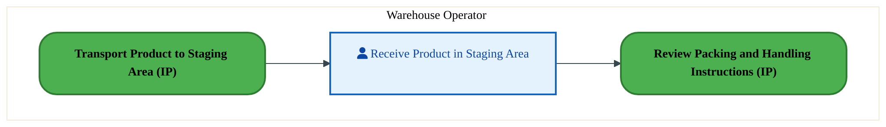
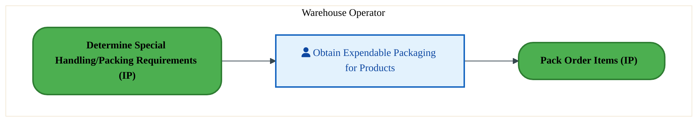
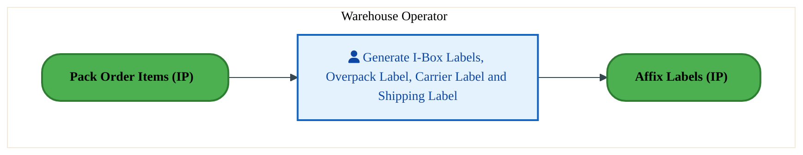
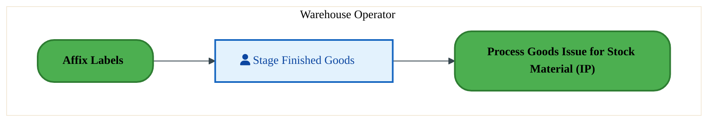

  
  <h1 style="font-size:36px; margin-top:24px;">LO-170 — Pack Orders - OTC (IP)</h1>
  <h2 style="font-size:24px;">Architecture Document (TOGAF BDAT)</h2>
  
Order To Cash (IP) (OTC-IP) Tower 
  Capability LO-170 · LO Logistics Management Outbound - OTC (IP)

  
IAO Program · Release 3 
  Generated: March 2026 
  Sajiv Francis

  
IAO Architecture Pipeline — Intel Confidential

Page 1<a href="#toc">↑ Back to TOC</a>LO-170 — Pack Orders - OTC (IP)

## Table of Contents

1. [Executive Summary](#1-executive-summary)
2. [Business Context & Objectives](#2-business-context--objectives)
   - 2.1 [Classification](#21-classification)
   - 2.2 [Business Drivers](#22-business-drivers)
   - 2.3 [Success Criteria](#23-success-criteria)
   - 2.4 [Companion Documents](#24-companion-documents)
3. [Business Architecture (TOGAF "B")](#3-business-architecture-togaf-b)
   - 3.1 [Business Process Overview](#31-business-process-overview)
   - 3.2 [Business Process Diagrams](#32-business-process-diagrams)
   - 3.3 [Business Roles & Responsibilities](#33-business-roles--responsibilities)
4. [Data Architecture (TOGAF "D")](#4-data-architecture-togaf-d)
   - 4.1 [Data Entities & Ownership](#41-data-entities--ownership)
   - 4.2 [Data Flow Diagrams](#42-data-flow-diagrams)
   - 4.3 [Data Lineage](#43-data-lineage)
   - 4.4 [RICEFW Data Objects](#44-ricefw-data-objects)
   - 4.5 [Data Governance & Quality](#45-data-governance--quality)
5. [Application Architecture (TOGAF "A")](#5-application-architecture-togaf-a)
   - 5.1 [Current-State Application Landscape](#51-current-state--current-state-application-landscape)
   - 5.2 [Future-State Application Landscape](#52-future-state--future-state-application-landscape)
   - 5.3 [Change Impact Summary](#53-change-impact-summary)
   - 5.4 [Component Overview](#54-component-overview)
   - 5.5 [RICEFW Inventory](#55-ricefw-inventory)
   - 5.6 [Integration Patterns](#56-integration-patterns)
6. [Technology Architecture (TOGAF "T")](#6-technology-architecture-togaf-t)
   - 6.1 [Platform & Infrastructure](#61-platform--infrastructure)
   - 6.2 [SAP Development Object Status](#62-sap-development-object-status)
   - 6.3 [NFRs & Design Principles](#63-nfrs--design-principles)
   - 6.4 [Security & Governance](#64-security--governance)
7. [Project Context](#7-project-context)
   - 7.1 [Project Roadmap & Go-Live Plan](#71-project-roadmap--go-live-plan)
   - 7.2 [RAID Log](#72-raid-log)
   - 7.3 [Recommendations & Next Steps](#73-recommendations--next-steps)

Page 2<a href="#toc">↑ Back to TOC</a>LO-170 — Pack Orders - OTC (IP)

## 1. Executive Summary

This Architecture Document defines the **Business, Data, Application, and Technology** (BDAT) architecture for **LO-170 Pack Orders - OTC (IP)** within the IAO program. It includes 10 BPMN process diagram(s) in Section 3.
| Dimension | Value |
|-----------|-------|
| **Tower** | Order To Cash (IP) (OTC-IP) |
| **Process Group** | LO Logistics Management Outbound - OTC (IP) |
| **Capability** | LO-170 - Pack Orders - OTC (IP) |
| **Release** | Release 3 |
| **Total Systems** | 0 |
| **System Status** | 0 Deployed, 0 Developing, 0 EOL, 0 Pending IAPM |
| **RICEFW Objects** | 6 Conversions, 3 Enhancements, 1 Workflows |
**Change Summary**: 0 new flow chains, 0 removed, 0 modified, 0 unchanged between Current-State and Future-State states.

> All system nodes in architecture diagrams are **IAPM-linked** — click any node to open its IAPM page. Diagrams require `securityLevel: 'loose'` for click events.

Page 3<a href="#toc">↑ Back to TOC</a>LO-170 — Pack Orders - OTC (IP)

## 2. Business Context & Objectives

### 2.1 Classification

| Level | Value |
|-------|-------|
| **L0 Tower** | Order To Cash (IP) |
| **L1 Process** | LO Logistics Management Outbound - OTC (IP) |
| **L2 Capability** | LO-170 - Pack Orders - OTC (IP) |

### 2.2 Business Drivers

| # | Driver | Description | Strategic Alignment | Priority |
|---|--------|-------------|---------------------|----------|
| 1 | IP Order Management Transformation | Transform Intel Products order management onto S/4 HANA with integrated pricing and ATP | IDM 2.0 Products Revenue | High |
| 2 | Customer Experience Improvement | Reduce order processing time and improve order visibility for IP customers | Customer Centricity | High |
| 3 | Returns & Rebate Automation | Automate returns processing, rebate management, and chargeback handling | Revenue Assurance | Medium |
| 4 | LO-170 Process Migration | Migrate Pack Orders - OTC (IP) business processes and 0 integrated systems from legacy to S/4 HANA target architecture | IDM 2.0 Order Management (Intel Products) | High |

Page 4<a href="#toc">↑ Back to TOC</a>LO-170 — Pack Orders - OTC (IP)

### 2.3 Success Criteria

| Metric | Target | Measure | Baseline | Owner |
|--------|--------|---------|----------|-------|
| Order Processing Time | < 2 hours | Time from order receipt to order confirmation | 6 hours (current) | Order Management Lead |
| Customer Credit Decision Time | < 15 minutes | Automated credit check and approval for standard orders | 2 hours (manual) | Credit Manager |
| Returns Processing Cycle | < 3 business days | End-to-end returns receipt to credit memo issuance | 7 business days (current) | Returns Manager |
| LO-170 Migration Completeness | 100% flow chains validated | All 0 flow chains verified in target state | 0% (pre-migration) | Tower Architect |

### 2.4 Companion Documents

| Document | Description |
|----------|-------------|
| **Business Architecture** | Included in this document (Section 3) — process flows from BPMN diagrams |
| **This Document** | Full BDAT Architecture — Business + Data + Application + Technology |

Page 5<a href="#toc">↑ Back to TOC</a>LO-170 — Pack Orders - OTC (IP)

## 3. Business Architecture (TOGAF "B")

### 3.1 Business Process Overview

This capability includes **10 business process(es)** modeled in BPMN 2.0, covering the end-to-end workflow for LO-170 Pack Orders - OTC (IP).

| # | Step ID | Process Name | Lanes | Tasks | Gateways |
|---|---------|--------------|-------|-------|----------|
| 1 | LO-170-010_Receive_Product_in_Staging_Area_-_OTC_(IP) | LO-170-010_Receive_Product_in_Staging_Area_-_OTC_(IP) | Warehouse Operator | 1 | 0 |
| 2 | LO-170-020_Review_Packing_and_Handling_Instructions_-_OTC_(IP) | LO-170-020_Review_Packing_and_Handling_Instructions_-_OTC_(IP) | Warehouse Operator | 3 | 1 |
| 3 | LO-170-050_Obtain_Expendable_Packaging_-_OTC_(IP) | LO-170-050_Obtain_Expendable_Packaging_-_OTC_(IP) | Warehouse Operator | 1 | 0 |
| 4 | LO-170-070_Pack_Order_Items_-_OTC_(IP) | LO-170-070_Pack_Order_Items_-_OTC_(IP) | Warehouse Operator | 11 | 8 |
| 5 | LO-170-080_Process_Packing_and_Regulatory_Export_Reports_-_OTC_(IP) | LO-170-080_Process_Packing_and_Regulatory_Export_Reports_-_OTC_(IP) | Warehouse Operator | 5 | 5 |
| 6 | LO-170-090_Generate_Labels_-_OTC_(IP) | LO-170-090_Generate_Labels_-_OTC_(IP) | Warehouse Operator | 1 | 0 |
| 7 | LO-170-100_Affix_Labels_-_OTC_(IP) | LO-170-100_Affix_Labels_-_OTC_(IP) | Warehouse Clerk | 2 | 0 |
| 8 | LO-170-120_Stage_Finished_Goods_-_OTC_(IP) | LO-170-120_Stage_Finished_Goods_-_OTC_(IP) | Warehouse Operator | 1 | 0 |
| 9 | LO-170-130_Process_Goods_Issue_for_Stock_Material_-_OTC_(IP) | LO-170-130_Process_Goods_Issue_for_Stock_Material_-_OTC_(IP) | Warehouse Operator | 7 | 4 |
| 10 | LO-170-140_Process_Goods_Issue_for_Consignment_-_OTC_(IP) | LO-170-140_Process_Goods_Issue_for_Consignment_-_OTC_(IP) | Warehouse Operator | 6 | 4 |

### 3.2 Business Process Diagrams

Page 6<a href="#toc">↑ Back to TOC</a>LO-170 — Pack Orders - OTC (IP)

#### BUSINESS ARCHITECTURE — 3.2.1 LO-170-010_Receive_Product_in_Staging_Area_-_OTC_(IP) — LO-170-010_Receive_Product_in_Staging_Area_-_OTC_(IP)

**Swim Lanes**: Warehouse Operator | **Tasks**: 1 | **Gateways**: 0

> **Legend**: ● Start · ● End · User Task · Service Task · ◇ Gateway · Sub-Process

<a href="https://mermaid.live/edit#pako:eNqlVMuO2jAU_RUrI5RWClKehGZRCQJRR2rV0TDtLEoXJrkmFsaObIdHEf9em-dANatmEeHDuefce3SdnVOKCpzM6XR2lFOdoZ2ra1iCmyF3hhW4HjoCP7GkeMZAuZZDBNcT-udAC-JmY2kWK_CSsq1FJzAXgH48emhgCpmHFOaqq0BS4npuI-kSy20umJCW_QB94pOD2-mvoZAVyCvB99OgTEwpoxyucJTGaVzYOgWl4NWNKElIn5Tu3jbHxLqssdSH9lsF3_DmlVa6NmeCmQLDqfWSfcUzYHZGLVuLla1cncOgyvpwE9ikwSXlc4PHvoEk5osrlPj7Pdp3OlN-MUUvoylH5ikZVmoEBClt4PFKI0IZyx7ifFAkvqe0FAvIHsJxOopCr7STZGZ037PhdtdA57XOZoJVJ2p3bWfIwmbjyU0W-p7cmvedF_Dq6pT3wn7YvzgN0yAP8rMTIeS_nEyu8gWrxclrHBVhMbp4BUkvyf1_9c5jjuJ0ENznBHJFS3gjWhRFNL5GNe4lgf--6LCIen5-JzrHGtZ4exX8lMcXwSJJiyB9V_Dod99lO3uSojwLRuOkSC6C6TAoBuG7gvEgiPunDo3OXOKmRq9YQi1MnOh7AxJrIY8E-_Dg19QhOCO4a_NGz1ACXQEyHVRtqRHlaKLx3CyjuXqAp87vN7WhqX2GFYU1esLlwpIwr9AX82L28MhNn0aFCq7Qh8enj7flkSl_MeuuGmG2-uyoxY3jbZ3ZvuMPHqFu97Np_3QMjsfwTZYWPO_QDRxeLswNHF1gx3OWIJeYVk62cw5fLPNVq4Dglmln7zm41WKy5aWTHW620zaV2YIRxSbw5RHc_wVC8KC3" title="Edit in Mermaid Live">&#9998; Edit in Mermaid Live</a>

#### BUSINESS ARCHITECTURE — 3.2.2 LO-170-020_Review_Packing_and_Handling_Instructions_-_OTC_(IP) — LO-170-020_Review_Packing_and_Handling_Instructions_-_OTC_(IP)

**Swim Lanes**: Warehouse Operator | **Tasks**: 3 | **Gateways**: 1

```mermaid
%%{init: {'theme': 'base', 'themeVariables': {'fontSize': '14px', 'fontFamily': 'Segoe UI, Arial, sans-serif','primaryColor': '#e8f0fe', 'primaryBorderColor': '#0071c5','lineColor': '#37474F', 'secondaryColor': '#f5f8fc'}, 'flowchart': {'useMaxWidth': false, 'htmlLabels': true, 'curve': 'basis', 'nodeSpacing': 40, 'rankSpacing': 50}} }%%
flowchart TD
    classDef startEvt fill:#4CAF50,stroke:#2E7D32,color:#000,font-weight:bold,stroke-width:2px,rx:20,ry:20
    classDef endEvt fill:#C62828,stroke:#B71C1C,color:#fff,font-weight:bold,stroke-width:2px,rx:20,ry:20
    classDef userTask fill:#E3F2FD,stroke:#1565C0,stroke-width:2px,color:#0D47A1
    classDef serviceTask fill:#FFF3E0,stroke:#E65100,stroke-width:2px,color:#BF360C
    classDef gateway fill:#FFF9C4,stroke:#F57F17,stroke-width:2px,color:#E65100
    classDef subProc fill:#F3E5F5,stroke:#7B1FA2,stroke-width:2px,color:#4A148C
    subgraph Warehouse Operator
        n1["fa:fa-user Check Packing/Handling Instructions"]
        n2[["fa:fa-cog Send Shipping Instruction from 3B12R"]]
        n3[["fa:fa-cog Update Delivery Note"]]
        n4["Determine Special Handling/Packing Requirements (IP)"]
        n5["Receive Product in Staging Area"]
        n6["Create Delivery Note (IP)"]
        n7{{"fa:fa-code-branch exclusiveGateway"}}
    end
    n1 --> n4
    n5 --> n7
    n7 --> n1
    n2 --> n7
    n6 --> n3
    n3 --> n2
    class n1 userTask
    class n2 serviceTask
    class n3 serviceTask
    class n4 startEvt
    class n5 startEvt
    class n6 startEvt
    class n7 gateway
```

> **Legend**: ● Start · ● End · User Task · Service Task · ◇ Gateway · Sub-Process

<a href="https://mermaid.live/edit#pako:eNqlVduO2kgQ_ZWWRyM2klF8xcQPK4HByUjZ3dGQy0PYh6Zdxi1Mt9Nuz8Ai_j3V2Fwz87R-sKjTVedUFVXtncVkBlZs3d_vuOA6JrueLmANvZj0FrSGnk1a4BtVnC5KqHvGJ5dCz_h_Bzc3qDbGzWApXfNya9AZLCWQrw82GWFgaZOairpfg-J5z-5Viq-p2iaylMp438Ewd_KDWnc0lioDdXZwnMhlIYaWXMAZ9qMgClITVwOTIrsizcN8mLPe3iRXyhdWUKUP6Tc1_EU333mmC7RzWtaAPoVel5_pAkpTo1aNwVijno_N4LXREdiwWUUZF0vEAwchRcXqDIXOfk_29_dzcRIlXyZzQfBhJa3rCeSk1ghPnzXJeVnGd0EySkPHrrWSK4jvvGk08T2bmUpiLN2xTXP7L8CXhY4Xssw61_6LqSH2qo2tNrHn2GqL7xstENlZKRl4Q294UhpHbuImR6U8z_-XEvZVfaH1qtOa-qmXTk5abjgIE-d3vmOZkyAaubd9AvXMGVyQpmnqT8-tmg5C13mbdJz6Aye5IV1SDS90eyb8kAQnwjSMUjd6k7DVu82yWTwqyY6E_jRMwxNhNHbTkfcmYTByg2GXIfIsFa0K8p0qKCS2k_xTgaJaqtbBPML9MbdyGue0b_pNkgLYijxStsL5e_-JigxXZEkeBCo2THMp6rn170W89-NEwOSSzHA-yKzgVXUTRnIl18Qfu94TElwy-NcMX6sMO0omUPJnUFvyt9RwExFgwAQ0qDWuL5lVwPBSIMdk33fZkyf42XCF143QNfnj4fHddeYhsjwBA5Qh2PAM8yRckJmmSxM9UkCvAwYYkCB6m90r3NFud64pg_4Ct5oVBDasbGqM_NgOzdza79sobFv7Q7ik3_8Ta-zMsDWjzoxas5ts4V2fDlrT70y_Nb2LATP8x8W6gr3L7bg68d88CU43zxUcvg4PXoej4wZZtrXGv5TyzIp31uE7gd-SDHLalNra2xZttJxtBbPiw31qNYdJmXCKY75uwf0vWq4U5g==" title="Edit in Mermaid Live">&#9998; Edit in Mermaid Live</a>

#### BUSINESS ARCHITECTURE — 3.2.3 LO-170-050_Obtain_Expendable_Packaging_-_OTC_(IP) — LO-170-050_Obtain_Expendable_Packaging_-_OTC_(IP)

**Swim Lanes**: Warehouse Operator | **Tasks**: 1 | **Gateways**: 0

> **Legend**: ● Start · ● End · User Task · Service Task · ◇ Gateway · Sub-Process

<a href="https://mermaid.live/edit#pako:eNqlVE2P2jAU_CtWViitFNR8EppDJQhEXanVrsq2eyg9GOcZLBI7tZ0FivjvtflcqPbUHFA8jGfem_h56xBRgpM5nc6WcaYztHX1AmpwM-TOsALXQwfgB5YMzypQruVQwfWE_dnTgrhZW5rFClyzamPRCcwFoO_3HhqYjZWHFOaqq0Ay6npuI1mN5SYXlZCWfQd96tO92_GvoZAlyAvB99OAJGZrxThc4CiN07iw-xQQwcsrUZrQPiXuzhZXiRVZYKn35bcKvuL1Myv1wqwprhQYzkLX1Rc8g8r2qGVrMdLKl1MYTFkfbgKbNJgwPjd47BtIYr68QIm_26FdpzPlZ1P0NJpyZB5SYaVGQJHSBh6_aERZVWV3cT4oEt9TWoolZHfhOB1FoUdsJ5lp3fdsuN0VsPlCZzNRlUdqd2V7yMJm7cl1Fvqe3JjfGy_g5cUp74X9sH92GqZBHuQnJ0rpfzmZXOUTVsuj1zgqwmJ09gqSXpL7_-qd2hzF6SC4zQnkCyPwSrQoimh8iWrcSwL_bdFhEfX8_EZ0jjWs8OYi-DGPz4JFkhZB-qbgwe-2ynb2KAU5CUbjpEjOgukwKAbhm4LxIIj7xwqNzlziZoGesYSFMHGihwYk1kIeCPbhwc-pQ3FGcdfmjR5mGjOOxuvGfGg7ougRkyWem9OIqJDIVFa2RKup8-uVSGhELA892DlD9xpqhd7dP76_pkWGNgINsjZjhyYNEDPM6DPmpZnD-QerYH2-we-WSXNNcH2jYmo6vPAIdbufTPXHZXBYhq-itODpCF3B4XleruDoDDueU5saMSudbOvsLyxzqZVAcVtpZ-c5uNVisuHEyfaD7bRNaQ7BiGGTd30Ad38BpNGgiA==" title="Edit in Mermaid Live">&#9998; Edit in Mermaid Live</a>

Page 7<a href="#toc">↑ Back to TOC</a>LO-170 — Pack Orders - OTC (IP)

#### BUSINESS ARCHITECTURE — 3.2.4 LO-170-070_Pack_Order_Items_-_OTC_(IP) — LO-170-070_Pack_Order_Items_-_OTC_(IP)

**Swim Lanes**: Warehouse Operator | **Tasks**: 11 | **Gateways**: 8

```mermaid
%%{init: {'theme': 'base', 'themeVariables': {'fontSize': '14px', 'fontFamily': 'Segoe UI, Arial, sans-serif','primaryColor': '#e8f0fe', 'primaryBorderColor': '#0071c5','lineColor': '#37474F', 'secondaryColor': '#f5f8fc'}, 'flowchart': {'useMaxWidth': false, 'htmlLabels': true, 'curve': 'basis', 'nodeSpacing': 40, 'rankSpacing': 50}} }%%
flowchart TD
    classDef startEvt fill:#4CAF50,stroke:#2E7D32,color:#000,font-weight:bold,stroke-width:2px,rx:20,ry:20
    classDef endEvt fill:#C62828,stroke:#B71C1C,color:#fff,font-weight:bold,stroke-width:2px,rx:20,ry:20
    classDef userTask fill:#E3F2FD,stroke:#1565C0,stroke-width:2px,color:#0D47A1
    classDef serviceTask fill:#FFF3E0,stroke:#E65100,stroke-width:2px,color:#BF360C
    classDef gateway fill:#FFF9C4,stroke:#F57F17,stroke-width:2px,color:#E65100
    classDef subProc fill:#F3E5F5,stroke:#7B1FA2,stroke-width:2px,color:#4A148C
    subgraph Warehouse Operator
        n1["fa:fa-user Pack Product into I-Boxes"]
        n2["fa:fa-user Pack Order Item"]
        n3["fa:fa-user Overpack Item"]
        n4["fa:fa-user Pack Products in Pallets"]
        n5["fa:fa-user Check and Verify HAWB Number"]
        n6["fa:fa-user Proceed with BCP Steps"]
        n7["fa:fa-user Upload File to Update Pick / Pack Details"]
        n8[["fa:fa-cog Trigger 3B13"]]
        n9[["fa:fa-cog Send E-Mail Alert to Customer Service"]]
        n10[["fa:fa-cog Update Pick / Pack Details in DN"]]
        n11[["fa:fa-cog Perform Unit Level Traceability"]]
        n12["Process Packing and Regulatory Export Reports (IP)"]
        n13["Review Packing and Handling Instructions (IP)"]
        n14{{"fa:fa-code-branch Packing in Partial or Full Box?"}}
        n15{{"fa:fa-code-branch exclusiveGateway"}}
        n16{{"fa:fa-code-branch Is Palletization Required?"}}
        n17{{"fa:fa-code-branch exclusiveGateway"}}
        n18{{"fa:fa-code-branch Validation?"}}
        n19{{"fa:fa-code-branch Status Updated Successfully?"}}
        n20{{"fa:fa-code-branch exclusiveGateway"}}
        n21{{"fa:fa-code-branch exclusiveGateway"}}
    end
    n13 --> n14
    n1 --> n15
    n2 --> n15
    n15 --> n3
    n3 --> n16
    n17 --> n5
    n16 -->|"No"| n17
    n5 --> n8
    n9 --> n20
    n6 --> n7
    n10 --> n19
    n20 --> n6
    n7 --> n21
    n21 --> n12
    n16 -->|"Yes"| n4
    n4 --> n17
    n8 --> n18
    n19 -->|"No"| n20
    n18 -->|"Fail"| n9
    n18 -->|"Pass"| n10
    n14 -->|"Partial"| n11
    n14 -->|"Full Box"| n2
    n11 --> n1
    n19 -->|"Yes"| n21
    class n1 userTask
    class n2 userTask
    class n3 userTask
    class n4 userTask
    class n5 userTask
    class n6 userTask
    class n7 userTask
    class n8 serviceTask
    class n9 serviceTask
    class n10 serviceTask
    class n11 serviceTask
    class n12 startEvt
    class n13 startEvt
    class n14 gateway
    class n15 gateway
    class n16 gateway
    class n17 gateway
    class n18 gateway
    class n19 gateway
    class n20 gateway
    class n21 gateway
```

> **Legend**: ● Start · ● End · User Task · Service Task · ◇ Gateway · Sub-Process

<a href="https://mermaid.live/edit#pako:eNqlV9uO4kYQ_ZWWVyMSCRTb2Bh4SMTNWaTdGTTMRdGSh8YuQ2sam7TbXJbl31PtC4w95iEbHpjpU1XnVJWr281J8yIftL52d3diIZN9cmrINWyg0SeNJY2h0SQZ8EIFo0sOcUP5BFEo5-x76mZY24NyU5hLN4wfFTqHVQTkedokAwzkTRLTMG7FIFjQaDa2gm2oOI4iHgnl_Qm6gR6karlpGAkfxNVB1x3DszGUsxCucNuxHMtVcTF4UeiXSAM76AZe46yS49HeW1Mh0_STGL7Swyvz5RrXAeUxoM9abvgXugSuapQiUZiXiF3RDBYrnRAbNt9Sj4UrxC0dIUHDtytk6-czOd_dLcKLKHkaL0KCH4_TOB5DQGKJ8GQnScA473-yRgPX1puxFNEb9D-ZE2fcNpueqqSPpetN1dzWHthqLfvLiPu5a2uvauib20NTHPqm3hRH_K5oQehflUYds2t2L0pDxxgZo0IpCIL_pYR9FU80fsu1Jm3XdMcXLcPu2CP9I19R5thyBka1TyB2zIN3pK7rtifXVk06tqHfJh267Y4-qpCuqIQ9PV4JeyPrQujajms4NwkzvWqWyXImIq8gbE9s174QOkPDHZg3Ca2BYXXzDJFnJeh2TV6pgHWE7SQPWxBURiJzUJ_Q-LbQAtoPaEv1m8yo90ZQ3k88SVgoIzJtDaMDxAvt73dRZk3Ug9pjZCphU_Ztl30fdiC2yv-jp3U7lxiTQYBzkJVU7HLQaA0YRUOfvKjj4Ug-D16H5D7ZLEGUAzsVNew5gE_2TK7JcDQjcwnbipZTDnne8oj6xGUcCHbqeevjLJAZwwR-y7Ifg6SMV1i63y40XrQiT4KtVsjWHhptdHzv2St7znHzkUnrK1KSAQc8ClB1lMQy2mD8PJvuCoWhlzluJ6k6PL6vhhvl8BmIIBIb8oznO_kCO-CYP_WALhln8liNVnOSNjaOUy081NJn8wirhKtJPJLJYRthJY-g_sTkl-ns13K7DDVAj7BjsC9xfMYvrhbTELcDzgiLwtp463S6luBDa4lHrLe-cKWDJSS-V0gkiJtwTnDi_1ho5_N7FrueBQ4eT2K2gz-zc6Aa1qkPm8b5NLPvVCWO9f-TMAH-B13n53S79WEvlDM_Vfwg1KuPmEsqkzifG5_ME089zQDbdKxSmPpP5Woa_zUM90H2Dw4HabV-Vw-5APK1na_NytqwM6Cdr4v4TmF3MuDi31HrHwvtPlpoP5Q9N-Q83XzZy5bFWyzsZOvC29BznV6RVw4UurmsaRT2ohCzmshf6jDGTIqKrdyxkOrm6yIzo1eu4JKi0c0NLm7_1NSrWmb4TsrKvgRZF1O6ZzKrUbUW2yhTLKxFTdXMipLM929s9SyLO0AJNuvhdj1s1cN2Pdyph516uPv-SlGy9G5acBJumozbJvNyyyvj7Ru4VVxMyrBdD3fqYace7tbDvVoYB70WNgpYa2r4-tpQ5mv9k5b-PsDfED4ENOFSOzc1mshofgw9rZ_eo7UkPYrGjOL1ZpOB538BGkTkcw==" title="Edit in Mermaid Live">&#9998; Edit in Mermaid Live</a>

Page 8<a href="#toc">↑ Back to TOC</a>LO-170 — Pack Orders - OTC (IP)

#### BUSINESS ARCHITECTURE — 3.2.5 LO-170-080_Process_Packing_and_Regulatory_Export_Reports_-_OTC_(IP) — LO-170-080_Process_Packing_and_Regulatory_Export_Reports_-_OTC_(IP)

**Swim Lanes**: Warehouse Operator | **Tasks**: 5 | **Gateways**: 5

```mermaid
%%{init: {'theme': 'base', 'themeVariables': {'fontSize': '14px', 'fontFamily': 'Segoe UI, Arial, sans-serif','primaryColor': '#e8f0fe', 'primaryBorderColor': '#0071c5','lineColor': '#37474F', 'secondaryColor': '#f5f8fc'}, 'flowchart': {'useMaxWidth': false, 'htmlLabels': true, 'curve': 'basis', 'nodeSpacing': 40, 'rankSpacing': 50}} }%%
flowchart TD
    classDef startEvt fill:#4CAF50,stroke:#2E7D32,color:#000,font-weight:bold,stroke-width:2px,rx:20,ry:20
    classDef endEvt fill:#C62828,stroke:#B71C1C,color:#fff,font-weight:bold,stroke-width:2px,rx:20,ry:20
    classDef userTask fill:#E3F2FD,stroke:#1565C0,stroke-width:2px,color:#0D47A1
    classDef serviceTask fill:#FFF3E0,stroke:#E65100,stroke-width:2px,color:#BF360C
    classDef gateway fill:#FFF9C4,stroke:#F57F17,stroke-width:2px,color:#E65100
    classDef subProc fill:#F3E5F5,stroke:#7B1FA2,stroke-width:2px,color:#4A148C
    subgraph Warehouse Operator
        n1[["fa:fa-cog Print Commercial Invoice and Packing List"]]
        n2[["fa:fa-cog Access the Data Container to Get COF Country Information"]]
        n3[["fa:fa-cog Print Itemized Packing List"]]
        n4[["fa:fa-cog Print Shipper Letter of Instructions"]]
        n5[["fa:fa-cog Upload Documents in Hubspan"]]
        n6(["fa:fa-stop COF Country Information Fetched"])
        n7["Stage Finished Goods (IP)"]
        n8["Pack Order Items (IP)"]
        n9{{"fa:fa-code-branch FVR Exists?"}}
        n10{{"fa:fa-code-branch Is IPLA Indicator is Equal to 'X' ?"}}
        n11{{"fa:fa-code-branch exclusiveGateway"}}
        n12{{"fa:fa-code-branch Are the Shipments from US?"}}
        n13{{"fa:fa-code-branch exclusiveGateway"}}
    end
    n8 --> n9
    n11 --> n5
    n2 --> n6
    n5 --> n7
    n3 --> n13
    n9 -->|"No"| n1
    n1 --> n10
    n13 --> n12
    n4 --> n11
    n9 -->|"Yes"| n2
    n10 -->|"No"| n13
    n12 -->|"No"| n11
    n10 -->|"Yes"| n3
    n12 -->|"Yes"| n4
    class n1 serviceTask
    class n2 serviceTask
    class n3 serviceTask
    class n4 serviceTask
    class n5 serviceTask
    class n6 endEvt
    class n7 startEvt
    class n8 startEvt
    class n9 gateway
    class n10 gateway
    class n11 gateway
    class n12 gateway
    class n13 gateway
```

> **Legend**: ● Start · ● End · User Task · Service Task · ◇ Gateway · Sub-Process

<a href="https://mermaid.live/edit#pako:eNqlVm1v4kYQ_isrRxF3kpH8iok_tCKAU6S0icrl7qrjPizrNaxi77q7awLl-O83xjYvDlSqygdgnpl5npnxeuytQURMjdC4vd0yznSIth29pBnthKgzx4p2TFQBn7FkeJ5S1SljEsH1lP2zD7O9fF2GlViEM5ZuSnRKF4Kil4mJBpCYmkhhrrqKSpZ0zE4uWYblZihSIcvoG9pPrGSvVrvuhYypPAZYVmATH1JTxukRdgMv8KIyT1EieHxGmvhJPyGdXVlcKt7IEku9L79Q9He8_sJivQQ7wamiELPUWfqI5zQte9SyKDFSyFUzDKZKHQ4Dm-aYML4A3LMAkpi_HiHf2u3Q7vZ2xg-i6NNoxhF8SIqVGtEEKQ3weKVRwtI0vPGGg8i3TKWleKXhjTMORq5jkrKTEFq3zHK43TfKFksdzkUa16Hdt7KH0MnXplyHjmXKDXy3tCiPj0rDntN3-gel-8Ae2sNGKUmS_6UEc5WfsHqttcZu5ESjg5bt9_yh9Z6vaXPkBQO7PScqV4zQE9IoitzxcVTjnm9b10nvI7dnDVukC6zpG94cCe-G3oEw8oPIDq4SVnrtKov5sxSkIXTHfuQfCIN7Oxo4Vwm9ge316wqBZyFxvkRfsKRLAeNETzmVWAtZBZQfbn_7NjMSHCa4S8QCPUvGNRqKLKOSwK2GJnwlYGYI8xg9Y_IKxxI9MqVnxvfvJzTOOc2AEKoUgpsdjbDGQMg1hntNIi3QAwWFpwjAgmu5AYlEyAxrJniL1b1U3ETTDLbFv5bjXUqcLlkOA0CPVGv4EQkowyALUiqrFoN_zvCSpwLHaCRIkVGuFWIc_VbMVY7bNfc-HBKVFvm1TlFENVnSGLI_nmQHkDzVeEFRBCtUQQB6ECJW6MPk-SPEnoT2IbQcAXoql9t-LJfC7rbbYyMx7c5hwZAlij7_icZrmJz6dWbsdqcnwrqcMVFo8vw4gCZiRspThJhC478LOCRwUTtfO-gdk32Zia5JWii2og_VvdNOcy6nDSTdn6jyOlYXIZEiQy_Td7ruf9WFrVb94X3U7f4CU6tN265sv7adyuzVpl-ZQW26lWm7tX1X2j9mxh9iZvwAvCGtw6zGbvKcGvBq227x_EXVnqiJs62WQCNsOy2H3c5oqN5lNA7vZC2VJZ8szzOPc9XjXvV4Vz3-VU-vfvScgcHh2XcG9y_Dd82yPm_Nugzbl2HnMuw2sGEasDszzGIj3Br71x14JYppgotUGzvTwIUW0w0nRrh_LTCKPIbMEcOwrbMK3P0EjvftHg==" title="Edit in Mermaid Live">&#9998; Edit in Mermaid Live</a>

#### BUSINESS ARCHITECTURE — 3.2.6 LO-170-090_Generate_Labels_-_OTC_(IP) — LO-170-090_Generate_Labels_-_OTC_(IP)

**Swim Lanes**: Warehouse Operator | **Tasks**: 1 | **Gateways**: 0

> **Legend**: ● Start · ● End · User Task · Service Task · ◇ Gateway · Sub-Process

<a href="https://mermaid.live/edit#pako:eNqlVE2PmzAU_CsWq4hWAonPkHKolJBQRWq1K2XbHpoeHHgOVsBGxuSjUf577ZCQTao9lQPCw3jmvdGzj0bGczBiYzA4UkZljI6mLKACM0bmCjdgWqgDfmBB8aqExtQcwplc0D9nmhvUe03TWIorWh40uoA1B_R9bqGx2lhaqMGssRsQlJiWWQtaYXFIeMmFZj_BiDjk7Hb5NeEiB3EjOE7kZqHaWlIGN9iPgihI9b4GMs7yO1ESkhHJzJMuruS7rMBCnstvG_iG9z9pLgu1JrhsQHEKWZVf8QpK3aMUrcayVmyvYdBG-zAV2KLGGWVrhQeOggRmmxsUOqcTOg0GS9abotfpkiH1ZCVumikQ1EgFz7YSEVqW8VOQjNPQsRop-AbiJ28WTX3PynQnsWrdsXS49g7oupDxipf5hWrvdA-xV-8tsY89xxIH9X7wApbfnJKhN_JGvdMkchM3uToRQv7LSeUqXnGzuXjN_NRLp72XGw7DxPlX79rmNIjG7mNOILY0gzeiaZr6s1tUs2HoOu-LTlJ_6CQPomssYYcPN8FPSdALpmGUutG7gp3fY5Xt6kXw7Croz8I07AWjiZuOvXcFg7EbjC4VKp21wHWBfmIBBVdxoucaBJZcdAT9MPfX0iA4JtjWeaMvwDQF0Nye8D3qJthCz1sQaiY3HWChBAtBFf28RJjlaFHQulYz20FL4_cbD095jAmhVz30Yf7y8Z7iK8qLNnjWJxXNJVQPNDV43QfzkW1_VpVflm639N7EqMHr-NzBXn9W7mC_hw3LqEBUmOZGfDTOl5W60HIguC2lcbIM3Eq-OLDMiM-H2mjrXMU1pVhlXXXg6S9OWZzO" title="Edit in Mermaid Live">&#9998; Edit in Mermaid Live</a>

#### BUSINESS ARCHITECTURE — 3.2.7 LO-170-100_Affix_Labels_-_OTC_(IP) — LO-170-100_Affix_Labels_-_OTC_(IP)

**Swim Lanes**: Warehouse Clerk | **Tasks**: 2 | **Gateways**: 0

```mermaid
%%{init: {'theme': 'base', 'themeVariables': {'fontSize': '14px', 'fontFamily': 'Segoe UI, Arial, sans-serif','primaryColor': '#e8f0fe', 'primaryBorderColor': '#0071c5','lineColor': '#37474F', 'secondaryColor': '#f5f8fc'}, 'flowchart': {'useMaxWidth': false, 'htmlLabels': true, 'curve': 'basis', 'nodeSpacing': 40, 'rankSpacing': 50}} }%%
flowchart TD
    classDef startEvt fill:#4CAF50,stroke:#2E7D32,color:#000,font-weight:bold,stroke-width:2px,rx:20,ry:20
    classDef endEvt fill:#C62828,stroke:#B71C1C,color:#fff,font-weight:bold,stroke-width:2px,rx:20,ry:20
    classDef userTask fill:#E3F2FD,stroke:#1565C0,stroke-width:2px,color:#0D47A1
    classDef serviceTask fill:#FFF3E0,stroke:#E65100,stroke-width:2px,color:#BF360C
    classDef gateway fill:#FFF9C4,stroke:#F57F17,stroke-width:2px,color:#E65100
    classDef subProc fill:#F3E5F5,stroke:#7B1FA2,stroke-width:2px,color:#4A148C
    subgraph Warehouse Clerk
        n1["fa:fa-user Verify Products with Labels"]
        n2["fa:fa-user Affix Labels / Documents"]
        n3["Record Returnable Container Shipment (IP)"]
        n4["Generate Labels (IP)"]
    end
    n4 --> n1
    n1 --> n2
    n2 --> n3
    class n1 userTask
    class n2 userTask
    class n3 startEvt
    class n4 startEvt
```

> **Legend**: ● Start · ● End · User Task · Service Task · ◇ Gateway · Sub-Process

<a href="https://mermaid.live/edit#pako:eNqlVE2P2jAU_CtWViitFNR8EppDJQikWqmVVst291B6MMkzsXAcZDsLFPHfaxMIC-2emkPEm8yb8Rts7628LsBKrF5vTzlVCdrbqoQK7ATZCyzBdlALPGNB8YKBtA2H1FzN6O8jzQvXW0MzWIYrynYGncGyBvTj3kEj3cgcJDGXfQmCEtux14JWWOzSmtXCsO9gSFxydDt9GteiAHEhuG7s5ZFuZZTDBQ7iMA4z0ychr3lxJUoiMiS5fTCLY_UmL7FQx-U3Er7j7QstVKlrgpkEzSlVxb7hBTAzoxKNwfJGvJ7DoNL4cB3YbI1zypcaD10NCcxXFyhyDwd06PXmvDNFT5M5R_rJGZZyAgRJpeHpq0KEMpbchekoi1xHKlGvILnzp_Ek8J3cTJLo0V3HhNvfAF2WKlnUrDhR-xszQ-Kvt47YJr7riJ1-33gBLy5O6cAf-sPOaRx7qZeenQgh_-WkcxVPWK5OXtMg87NJ5-VFgyh1_9Y7jzkJ45F3mxOIV5rDG9Esy4LpJarpIPLc90XHWTBw0xvRJVawwbuL4Oc07ASzKM68-F3B1u92lc3iQdT5WTCYRlnUCcZjLxv57wqGIy8cnlaodZYCr0v0ggWUtY4TpQzEqv1qHu79nFsEJwT3Tdjo2RyoHdLuRZMriTZUlajdxHPr15s-_7pvRAjdnojoE5rUeVMBVzdNgW561OdKFOgRVCO4uQFQqncI1qdQoFlJ16YNfbh_-HjdGurWr6BJOuuzzxVL78r2Bw9Rv_9FT3Yqvbb0T6XflsGbyA3nvNWuYP_fcNAdtys47GDLsSoQFaaFleyt432n78QCCG6Ysg6OhRtVz3Y8t5LjvWA160LPNaFY_11VCx7-AGwpsao=" title="Edit in Mermaid Live">&#9998; Edit in Mermaid Live</a>

Page 9<a href="#toc">↑ Back to TOC</a>LO-170 — Pack Orders - OTC (IP)

#### BUSINESS ARCHITECTURE — 3.2.8 LO-170-120_Stage_Finished_Goods_-_OTC_(IP) — LO-170-120_Stage_Finished_Goods_-_OTC_(IP)

**Swim Lanes**: Warehouse Operator | **Tasks**: 1 | **Gateways**: 0

> **Legend**: ● Start · ● End · User Task · Service Task · ◇ Gateway · Sub-Process

<a href="https://mermaid.live/edit#pako:eNqlVE2P2jAQ_StWViitFKR8EppDJQikWqlVV2LbPZQeTDImFk4c2c4CRfz32gTCQrWn5hDFzzPvzbx4fLByXoCVWIPBgdZUJehgqxIqsBNkr7AE20Ed8BMLilcMpG1iCK_Vgv45hXlhszNhBstwRdneoAtYc0A_Hh000YnMQRLXcihBUGI7diNohcU-5YwLE_0AY-KSk9p5a8pFAeIa4Lqxl0c6ldEarnAQh3GYmTwJOa-LG1ISkTHJ7aMpjvFtXmKhTuW3Er7h3QstVKnXBDMJOqZUFfuKV8BMj0q0Bstb8Xoxg0qjU2vDFg3Oab3WeOhqSOB6c4Ui93hEx8FgWfei6Hm2rJF-coalnAFBUml4_qoQoYwlD2E6ySLXkUrwDSQP_jyeBb6Tm04S3brrGHOHW6DrUiUrzopz6HBrekj8ZueIXeK7jtjr950W1MVVKR35Y3_cK01jL_XSixIh5L-UtK_iGcvNWWseZH4267W8aBSl7r98lzZnYTzx7n0C8UpzeEOaZVkwv1o1H0We-z7pNAtGbnpHusYKtnh_JfyUhj1hFsWZF79L2OndV9mungTPL4TBPMqinjCeetnEf5cwnHjh-Fyh5lkL3JToBQsoubYTfW9AYMVFF2Ce2vu1tAhOCB4av9FC4TWgTI-vLKFAXzgv5NL6_SbB1wmmPpCy20aPUraACDfZPN-gb9oRM6bow-PTx9vkQCdPCKE71M1Gv6uPVfdRe2g4_KxlzsugW779lSbmcjhuYL-fhBs46GHLsSoQFaaFlRys01Wkr6sCCG6Zso6OhVvFF_s6t5LTyFptU-hmZhRrJ6sOPP4FS_CSsg==" title="Edit in Mermaid Live">&#9998; Edit in Mermaid Live</a>

Page 10<a href="#toc">↑ Back to TOC</a>LO-170 — Pack Orders - OTC (IP)

#### BUSINESS ARCHITECTURE — 3.2.9 LO-170-130_Process_Goods_Issue_for_Stock_Material_-_OTC_(IP) — LO-170-130_Process_Goods_Issue_for_Stock_Material_-_OTC_(IP)

**Swim Lanes**: Warehouse Operator | **Tasks**: 7 | **Gateways**: 4

> **Legend**: ● Start · ● End · User Task · Service Task · ◇ Gateway · Sub-Process

<a href="https://mermaid.live/edit#pako:eNqlVl1v4jgU_StWRhUzUpDySWgedgWBVJW2nWrpzGg17INJHLBqbGQ7bRmG_77X-QBC4WnzgLjn3nPu9YnjZGdlIidWbN3c7CinOka7nl6RNenFqLfAivRsVAPfsaR4wYjqmZpCcD2jv6oyN9i8mzKDpXhN2dagM7IUBH27t9EIiMxGCnPVV0TSomf3NpKusdwmgglpqj-RYeEUVbcmNRYyJ_JY4DiRm4VAZZSTI-xHQRSkhqdIJnjeES3CYlhkvb0Zjom3bIWlrsYvFXnA7z9orlcQF5gpAjUrvWZ_4QVhZo1algbLSvnamkGV6cPBsNkGZ5QvAQ8cgCTmL0codPZ7tL-5mfNDU_Q8mXMEV8awUhNSIKUBnr5qVFDG4k9BMkpDx1ZaihcSf_Km0cT37MysJIalO7Yxt_9G6HKl44VgeVPafzNriL3Nuy3fY8-x5RZ-z3oRnh87JQNv6A0PncaRm7hJ26koiv_VCXyVz1i9NL2mfuqlk0MvNxyEifNRr13mJIhG7rlPRL7SjJyIpmnqT49WTQeh61wXHaf-wEnORJdYkze8PQreJsFBMA2j1I2uCtb9zqcsF09SZK2gPw3T8CAYjd105F0VDEZuMGwmBJ2lxJsV-oElWQmwE33dEIm1kHWBubj7c24VOC5w3_iNTGdCcvRG9QqNkyc002Sj5ta_JxTvjEJkIeQaPWBeYoaehNLoTohcoXulSoJEgSaE0Vcit10d_-dBKBPLj0RQhfYiewFpTcyDD_xTgaAr8CzpcgkD-WPvrDDsFs5gE6Np_wFThkaMwCOlBUpKpcUa6LN6l5xJDLoS3zY5zPRxZspPF3sqEHUFEkmMwD1fiBKmuUIafj6QYLrNweu7v6Hwy0nhLdQ1M93zV8LhJm_BPKxLhT7fP33pOu86UA7ZJUEpnNRqBXe8XsWFWne3Ow6ek_4CTqhshb5jRqEfFRx9LXUG1v05t_b7U6Z3mdmMVY-bo1mZZUSpomRs-0HCvyxB3jNWKnDsrn76zmnBZZoLd2vyiGBfTagkmQls5Bn7H086w-6o_4BPqN__A3ZqE_t1GDRhWIdum3br2GvCQZNuY7ehN8cS95qwlQuauM27ld7vuZXCRp1bv6HheeYJzowqM2gzXpN5FBV-nK1N_ENqxqGtGzSZ2p0qGV3OGefm_IN3FeW2oUT1KoYnp5pxpj3NO7B3GfZPT-pOJriaCa9mBlcz0dXMsHnPdcDbw4u2uzbnCu6274Yu7F2G_ctw0MKWbcHptMY0t-KdVX1GwadWTgpcMm3tbQuXWsy2PLPi6nPDKqvna0IxvAXWNbj_D2GKA-8=" title="Edit in Mermaid Live">&#9998; Edit in Mermaid Live</a>

Page 11<a href="#toc">↑ Back to TOC</a>LO-170 — Pack Orders - OTC (IP)

#### BUSINESS ARCHITECTURE — 3.2.10 LO-170-140_Process_Goods_Issue_for_Consignment_-_OTC_(IP) — LO-170-140_Process_Goods_Issue_for_Consignment_-_OTC_(IP)

**Swim Lanes**: Warehouse Operator | **Tasks**: 6 | **Gateways**: 4

```mermaid
%%{init: {'theme': 'base', 'themeVariables': {'fontSize': '14px', 'fontFamily': 'Segoe UI, Arial, sans-serif','primaryColor': '#e8f0fe', 'primaryBorderColor': '#0071c5','lineColor': '#37474F', 'secondaryColor': '#f5f8fc'}, 'flowchart': {'useMaxWidth': false, 'htmlLabels': true, 'curve': 'basis', 'nodeSpacing': 40, 'rankSpacing': 50}} }%%
flowchart TD
    classDef startEvt fill:#4CAF50,stroke:#2E7D32,color:#000,font-weight:bold,stroke-width:2px,rx:20,ry:20
    classDef endEvt fill:#C62828,stroke:#B71C1C,color:#fff,font-weight:bold,stroke-width:2px,rx:20,ry:20
    classDef userTask fill:#E3F2FD,stroke:#1565C0,stroke-width:2px,color:#0D47A1
    classDef serviceTask fill:#FFF3E0,stroke:#E65100,stroke-width:2px,color:#BF360C
    classDef gateway fill:#FFF9C4,stroke:#F57F17,stroke-width:2px,color:#E65100
    classDef subProc fill:#F3E5F5,stroke:#7B1FA2,stroke-width:2px,color:#4A148C
    subgraph Warehouse Operator
        n1["fa:fa-user Proceed with BCP Steps"]
        n2["fa:fa-user Perform Manual Post Goods Issue of Delivery"]
        n3[["fa:fa-cog Post Goods Issue for Consignment Stock"]]
        n4[["fa:fa-cog Trigger 3B2"]]
        n5[["fa:fa-cog Send E-Mail Alert to Customer Service"]]
        n6[["fa:fa-cog Update Post Goods Issue in Delivery"]]
        n7["Update Inventory Status (IP)"]
        n8["Stage Finished Goods (IP)"]
        n9{{"fa:fa-code-branch Validation Outcome?"}}
        n10{{"fa:fa-code-branch Status Updated Successfully?"}}
        n11{{"fa:fa-code-branch exclusiveGateway"}}
        n12{{"fa:fa-code-branch exclusiveGateway"}}
    end
    n8 --> n3
    n3 --> n4
    n5 --> n11
    n1 --> n2
    n6 --> n10
    n11 --> n1
    n2 --> n12
    n12 --> n7
    n4 --> n9
    n9 -->|"Fail"| n5
    n10 -->|"No"| n11
    n9 -->|"Pass"| n6
    n10 -->|"Yes"| n12
    class n1 userTask
    class n2 userTask
    class n3 serviceTask
    class n4 serviceTask
    class n5 serviceTask
    class n6 serviceTask
    class n7 startEvt
    class n8 startEvt
    class n9 gateway
    class n10 gateway
    class n11 gateway
    class n12 gateway
```

> **Legend**: ● Start · ● End · User Task · Service Task · ◇ Gateway · Sub-Process

<a href="https://mermaid.live/edit#pako:eNqlVluPokgU_isVOh13E0wAQWweZqMok062d0zsmclm3IcSCqh0WWWqCi_r-N_3IKDi5WGyPBjPd873nUtdYG_EIiFGYDw_7ymnOkD7js7JknQC1FlgRTomqoBvWFK8YER1yphUcD2j_x7DbHe1LcNKLMJLynYlOiOZIOjrq4mGQGQmUpirriKSph2zs5J0ieUuFEzIMvqJDFIrPWarXSMhEyLPAZbl27EHVEY5OcM93_XdqOQpEguetERTLx2kcedQFsfEJs6x1MfyC0Xe8PY7TXQOdoqZIhCT6yX7Ey8IK3vUsiixuJDrZhhUlXk4DGy2wjHlGeCuBZDE_OMMedbhgA7Pz3N-Sorex3OO4IkZVmpMUqQ0wJO1RillLHhyw2HkWabSUnyQ4MmZ-OOeY8ZlJwG0bpnlcLsbQrNcBwvBkjq0uyl7CJzV1pTbwLFMuYPfq1yEJ-dMYd8ZOINTppFvh3bYZErT9H9lgrnKd6w-6lyTXuRE41Mu2-t7oXWr17Q5dv2hfT0nItc0JheiURT1JudRTfqebT0WHUW9vhVeiWZYkw3enQVfQvckGHl-ZPsPBat811UWi6kUcSPYm3iRdxL0R3Y0dB4KukPbHdQVgk4m8SpH37EkuYBxoi8rIrEWsgooH27_mBspDlLcLeeNysyEJGhDdY5G4RTNNFmpufHPBcW5ohCZCrlEb5gXmKGpUBp9FiJR6FWpgiCRojFhdE3krq3T-3ESikV2SwRVFAquaMaXhGsoRcQfIHGp4bY13iXNMqipN3KuAr124Az2MZp03zBlaMgInCotUFgoLZZAn1Ub5Uqi35b4ukpg6W_Lpvyy30sBH_g165WvoSUhd9AV1oVCv71Of2-PZwDR4MwIiuA2VTmsSpXmNvRlvz9XlpDuAi6ROEffMKOQjQqOvhQ6htb-mBuHw-XqW_eZdVFVsQmaFXFMlEoLxnY3EvZ9CbKNWaFgDJ-rA3JNc36VBitW_eED1O1-gv1Tm73KdGvTq0y7Pv3crmynNvu122rctb8Jd2qzibdrwK9ttzJfavOlNH_OjQh20tz4CekbnlV7_hJH_FRPw5jCeT96-teMv0nlaGo4Xg1lI82V2IKd-3Dv8rpredyHHu-hp__Q459ePy14cB9-ae7LdmfWfdi-DzsNbJgGHNclpokR7I3jpwV8fiQkxQXTxsE0cKHFbMdjIzi-go3iuKHHFMPNuKzAw3_lIsCV" title="Edit in Mermaid Live">&#9998; Edit in Mermaid Live</a>

Page 12<a href="#toc">↑ Back to TOC</a>LO-170 — Pack Orders - OTC (IP)

### 3.3 Business Roles & Responsibilities

| Role / Lane | Processes Involved | Description |
|------------|-------------------|-------------|
| Warehouse Operator | LO-170-010_Receive_Product_in_Staging_Area_-_OTC_(IP), LO-170-020_Review_Packing_and_Handling_Instructions_-_OTC_(IP), LO-170-050_Obtain_Expendable_Packaging_-_OTC_(IP), LO-170-070_Pack_Order_Items_-_OTC_(IP), LO-170-080_Process_Packing_and_Regulatory_Export_Reports_-_OTC_(IP), LO-170-090_Generate_Labels_-_OTC_(IP), LO-170-120_Stage_Finished_Goods_-_OTC_(IP), LO-170-130_Process_Goods_Issue_for_Stock_Material_-_OTC_(IP), LO-170-140_Process_Goods_Issue_for_Consignment_-_OTC_(IP) | |
| Warehouse Clerk | LO-170-100_Affix_Labels_-_OTC_(IP),  | |

Page 13<a href="#toc">↑ Back to TOC</a>LO-170 — Pack Orders - OTC (IP)

## 4. Data Architecture (TOGAF "D")

### 4.1 Data Entities & Ownership

The following data entities are derived from the system integration flows for LO-170. Tower architects should validate ownership and classification.

| # | Data Entity | Source System | Target System | Data Owner | Classification | Volume | Master/Transaction |
|---|-------------|---------------|---------------|------------|----------------|--------|-------------------|

Page 14<a href="#toc">↑ Back to TOC</a>LO-170 — Pack Orders - OTC (IP)

### 4.2 Data Flow Diagrams

> **DATA ARCHITECTURE** — Database-to-database data flows. Applications (blue) sit above their hosting databases (green cylinders). Thick arrows show data movement between databases.

### 4.3 Data Lineage

Data lineage traces the origin and transformation path of key data objects across integrated systems.

| # | Source System | Source Schema/Object | Target System | Target Schema/Object | Transformation |
|---|-------------|---------------------|---------------|---------------------|---------------|

> *Lineage detail will be refined when tower architects validate source/target schema object mappings.*

### 4.4 RICEFW Data Objects

Data-centric RICEFW objects (Reports and Conversions) from the Object Tracker:

| Object ID | Type | Description | Status | Source | Target | Complexity |
|-----------|------|-------------|--------|--------|--------|-----------|
| OTCC1341 | Conversion | Payer Profile Data Conversion | 10. Object Complete |  |  | 03.Medium |
| OTCC1340 | Conversion | Payer Segment Data Conversion | 10. Object Complete |  |  | 03.Medium |
| OTCC1339 | Conversion | Payer Relationship Data Conversion | 10. Object Complete |  |  | 03.Medium |
| OTCC0803 | Conversion | Open Credit Case Conversion | 10. Object Complete |  |  | 02.High |
| OTCC0679 | Conversion | Open Dispute Case Conversion | 10. Object Complete |  |  | 02.High |
| OTCC0678 | Conversion | Collection Master Conversion | 10. Object Complete |  |  | 02.High |

### 4.5 Data Governance & Quality

| Concern | Approach |
|---------|----------|
| Data Ownership | Per-entity owners listed in Section 3.1 |
| Data Classification | Financial data classified as Intel Confidential |
| Data Retention | Per Intel corporate retention policies |
| Data Quality | Validated at source; reconciliation at target |

Page 15<a href="#toc">↑ Back to TOC</a>LO-170 — Pack Orders - OTC (IP)

## 5. Application Architecture (TOGAF "A")

### 5.1 Current-State — Current-State Application Landscape

#### Overview

The Current-State architecture represents the **current / legacy** landscape for LO-170.

#### Current-State Flow Narrative

*(No current-state flows defined.)*

### 5.2 Future-State — Future-State Application Landscape

#### Overview

The Future-State architecture represents the **target** landscape for LO-170.

#### Future-State Flow Narrative

*(No future-state flows defined.)*

### 5.3 Change Impact Summary

| Change Type | Flow Chain | Detail |
|-------------|-----------|--------|

**Totals**: 0 new - 0 removed - 0 modified - 0 unchanged

### 5.4 Component Overview

#### System Inventory

| System | IAPM ID | Status |
|--------|---------|--------|

Page 16<a href="#toc">↑ Back to TOC</a>LO-170 — Pack Orders - OTC (IP)

### 5.5 RICEFW Inventory

| Object ID | Type | Description | Status | Source → Target | Middleware | Complexity |
|-----------|------|-------------|--------|----------------|-----------|-----------|
| OTCW1683 | Workflow | Additional WRICEF for Credit Limit Request Workflow | 10. Object Complete |  | NA | 03.Medium |
| OTCE0737 | Enhancement | Implement Standard BADI to activate Credit Limit Request Workflow | 10. Object Complete |  | NA | 04.Low |
| OTCE0614_IP | Enhancement | Implement Standard Credit/Collection BADI | 10. Object Complete |  | NA | 03.Medium |
| OTCE0021 | Enhancement | Credit hold release dashboard at line-item level | 10. Object Complete | NA → NA | NA | 01.Very High |
| OTCC1341 | Conversion | Payer Profile Data Conversion | 10. Object Complete |  | NA | 03.Medium |
| OTCC1340 | Conversion | Payer Segment Data Conversion | 10. Object Complete |  | NA | 03.Medium |
| OTCC1339 | Conversion | Payer Relationship Data Conversion | 10. Object Complete |  | NA | 03.Medium |
| OTCC0803 | Conversion | Open Credit Case Conversion | 10. Object Complete |  | NA | 02.High |
| OTCC0679 | Conversion | Open Dispute Case Conversion | 10. Object Complete |  | NA | 02.High |
| OTCC0678 | Conversion | Collection Master Conversion | 10. Object Complete |  | NA | 02.High |

**Summary**: 6 Conversions, 3 Enhancements, 1 Workflows

Page 17<a href="#toc">↑ Back to TOC</a>LO-170 — Pack Orders - OTC (IP)

### 5.6 Integration Patterns

Integration patterns identified from the system flow analysis for LO-170:

| # | Pattern | Flow Chain | Middleware | Protocol | Auth |
|---|---------|-----------|-----------|----------|------|

> *Integration pattern details will be refined when tower architects validate middleware assignments.*

Page 18<a href="#toc">↑ Back to TOC</a>LO-170 — Pack Orders - OTC (IP)

## 6. Technology Architecture (TOGAF "T")

### 6.1 Platform & Infrastructure

> **TECHNOLOGY / PLATFORM ARCHITECTURE** — Platforms (green) host applications (blue). Thick arrows show platform-to-platform integration flows.

#### Platform Inventory

Platform landscape inferred from integrated systems for LO-170:

| # | Platform | Type | Systems Using | Environment |
|---|----------|------|--------------|-------------|
| 1 | SAP S/4HANA | On-Premise (HEC) | SAP S/4 modules | DEV, QAS, PRD |
| 2 | SAP BTP (Integration Suite) | Cloud / PaaS | CPI, API Management | DEV, QAS, PRD |
| 3 | MuleSoft Anypoint | Cloud / iPaaS | API-led integrations | DEV, QAS, PRD |

> *Platform assignments will be validated when tower architects populate technology platform columns.*

Page 19<a href="#toc">↑ Back to TOC</a>LO-170 — Pack Orders - OTC (IP)

### 6.2 SAP Development Object Status

**Capability RICEFW Status** (10 objects)
*Data source: Smartsheet Object Tracker (cached 2026-03-26)*

| Status | Count | % |
|--------|------:|----:|
| 10. Object Complete | 10 | 100.0% |
| **Total** | **10** | **100%** |

**RICEFW by Type:**

| Type | Count |
|------|------:|
| Conversion (C) | 6 |
| Enhancement (E) | 3 |
| Workflow (W) | 1 |
| **Total** | **10** |

**Technical Complexity:**

| Complexity | Count |
|------------|------:|
| 01.Very High | 1 |
| 02.High | 3 |
| 03.Medium | 5 |
| 04.Low | 1 |

**Tower Context:** OTC-IP has 292 total RICEFW objects (282 complete, 10 active/other)

### 6.3 NFRs & Design Principles

| Category | Requirement | Target / SLA | Priority |
|----------|-------------|-------------|----------|
| Performance | Order/transaction processing within interactive SLA | < 3 seconds for online transactions | High |
| Availability | Business-critical systems available during extended hours | 99.9% (06:00-22:00 all time zones) | High |
| Scalability | Support seasonal and promotional volume spikes | Handle 2x baseline transaction volume | Medium |
| Recoverability | Customer-facing systems recover within business impact window | RPO < 30 min, RTO < 2 hours | High |
| Data Volume | Support transactional data growth from business expansion | 10M+ documents/year | Medium |
| Latency | Near-real-time integration for order status updates | < 30 seconds for status propagation | Medium |
| Concurrency | Support global user base across business functions | 300+ concurrent users | Medium |

### 6.4 Security & Governance

| Concern | Approach | Standard / Policy | Owner |
|---------|----------|--------------------|-------|
| Authentication | Single Sign-On (SSO) via Intel corporate Azure AD identity | Intel IT Security Policy - Identity Management | IT Security |
| Authorization | Role-based access control (RBAC) with SAP authorization objects | Intel SAP Security Standards - Role Design | SAP Security Team |
| Data Classification | All financial/operational data classified per Intel Data Classification Standard | Intel Data Classification Policy | Data Governance |
| Data Encryption (at rest) | AES-256 encryption for SAP HANA database and file storage | Intel Encryption Standard | Infrastructure Security |
| Data Encryption (in transit) | TLS 1.3 for all system-to-system and user-to-system communication | Intel Network Security Policy | Network Engineering |
| Network Segmentation | SAP systems in dedicated network zones with firewall controls | Intel Network Architecture Standard | Network Security |
| API Security | OAuth 2.0 / certificate-based authentication for all API integrations | Intel API Security Guidelines | Integration Architecture |
| Audit Logging | Comprehensive audit trail for all data changes and user actions (SAP Security Audit Log) | SOX Compliance / Intel Audit Policy | Internal Audit |
| Certificate Management | Automated certificate lifecycle management for system-to-system trust | Intel PKI Standard | Certificate Authority Team |
| Compliance | SOX controls, export control (EAR/ITAR) screening, data privacy (GDPR) | Intel Corporate Compliance Framework | Compliance Office |

Page 20<a href="#toc">↑ Back to TOC</a>LO-170 — Pack Orders - OTC (IP)

## 7. Project Context

### 7.1 Project Roadmap & Go-Live Plan

*10 objects with timeline data (source: Object Tracker)*

| ID | Description | FS | TDD | Build | FUT | Status |
|----|-------------|----|-----|-------|-----|--------|
| OTCW1683 | Additional WRICEF for Credit Limit Request Workflow | Dec-25 (100%) | Feb-26 (100%) | Feb-26 (100%) | Mar-26 (100%) | 1. On Track |
| OTCE0737 | Implement Standard BADI to activate Credit Limit Request Workflow | Jul-25 (100%) | Dec-25 (100%) | Dec-25 (100%) | Mar-26 (100%) | 1. On Track |
| OTCE0614_IP | Implement Standard Credit/Collection BADI | Mar-25 (100%) | Aug-25 (100%) | Apr-25 (100%) | Sep-25 (100%) |  |
| OTCE0021 | Credit hold release dashboard at line-item level | Jul-24 (100%) | Sep-25 (100%) | Sep-25 (100%) | Feb-26 (100%) | 1. On Track |
| OTCC1341 | Payer Profile Data Conversion | May-25 (100%) | Jun-25 (100%) | Aug-25 (100%) | Sep-25 (100%) |  |
| OTCC1340 | Payer Segment Data Conversion | May-25 (100%) | Jun-25 (100%) | Aug-25 (100%) | Sep-25 (100%) | 1. On Track |
| OTCC1339 | Payer Relationship Data Conversion | Jun-25 (100%) | Oct-25 (100%) | Nov-25 (100%) | Nov-25 (100%) | 4. Completed |
| OTCC0803 | Open Credit Case Conversion | Jun-25 (100%) | Oct-25 (100%) | Nov-25 (100%) | Nov-25 (100%) | 4. Completed |
| OTCC0679 | Open Dispute Case Conversion | Jun-25 (100%) | Jul-25 (100%) | Aug-25 (100%) | Oct-25 (100%) | 4. Completed |
| OTCC0678 | Collection Master Conversion | Mar-25 (100%) | May-25 (100%) | Jun-25 (100%) | Aug-25 (100%) |  |

### 7.2 RAID Log

*Live data from Smartsheet Master RAID Log — extracted 2026-03-26*

**Mapped sub-tower(s):** 5.6 OTC IP - Credit and Collections

**RAID Summary:** 19 open items (0 capability-specific, 19 tower-level), 220 closed

| Severity | Capability | Tower-Wide | Total Open |
|----------|----------:|-----------:|-----------:|
| P1 - High | 0 | 3 | 3 |
| P2 - Medium | 0 | 12 | 12 |
| P3 - Low | 0 | 4 | 4 |
| **Total** | **0** | **19** | **19** |

**Other OTC-IP Tower RAID Items** (19 open):

| RAID ID | Type | Severity | Title | Status | Assigned To | Due Date |
|---------|------|----------|-------|--------|-------------|----------|
| 03591 | Risk | P1 - High | R3 E2E scenario execution | In Progress | Test Management | 2026-04-03 |
| 03755 | Risk | P1 - High | Coding for 2DN and AIF enhancements. | In Progress | Technology | 2026-03-27 |
| 03767 | Risk | P1 - High | Day 1 OTC Execution - APOP production cutover for allocation... | In Progress | OTC IP | 2026-04-24 |
| 01733 | Risk | P2 - Medium | Tariffs impacts Item/BOM design which is impacting ERP/SCP (... | In Progress | E2E | 2026-03-06 |
| 03060 |  | P2 - Medium | Resource shift across Intel / Accenture Managed Services | In Progress | CM & Comms | 2026-03-27 |
| 03712 | Risk | P2 - Medium | LOGE0627, LOGE0690 | In Progress | OTC IP | 2026-04-03 |
| 03625 | Risk | P2 - Medium | Item/ BOM MC1 delta load | In Progress | Cutover | 2026-04-10 |
| 03635 | Risk | P2 - Medium | Gaps in mapping of ITC test cases to automated controls and ... | Not Started | OTC IP | 2026-03-27 |
| 02456 | Action | P2 - Medium | clarify who is D for the R3 org design between SMG and CPG a... | In Progress | OTC IP | 2026-03-27 |
| 02486 | Action | P2 - Medium | Tier 1/Tier 2 customer support | Not Started | OTC IP | 2026-03-31 |
| 02491 | Action | P2 - Medium | Clearly defined demand and sales ops roles (especially in BM... | In Progress | OTC IP | 2026-03-27 |
| 03736 | Action | P2 - Medium | Golden Data/Test Data Readiness | In Progress | Master Data | 2026-04-22 |
| 03743 | Issue | P2 - Medium | FD-Share with Entitlements -  Interface File Paths for MC1 | Roadblock / At Risk | PMO | 2026-03-20 |
| 03749 | Action | P2 - Medium | Logistics Data Intake and Creation Process Definition | In Progress | Test Management | 2026-03-27 |
| 03760 | Risk | P2 - Medium | Require confirmation from OT/B2B team to confirm on 3B2 ASN | Roadblock / At Risk | B-Apps |  |
| 03315 | Risk | P3 - Low | BPMG – SCP L3/L4 flow standards | In Progress | Business Process Mgmt | 2026-03-27 |
| 03317 | Risk | P3 - Low | BPMG – E2E L3/L4 flow standards | In Progress | Business Process Mgmt | 2026-05-29 |
| 03627 | Risk | P3 - Low | Inconsistency Response from EH -API B-App | Not Started | B-Apps |  |
| 02488 | Action | P3 - Low | contractual demand policy (including cloud customers) | In Progress | OTC IP | 2026-04-17 |

### 7.3 Recommendations & Next Steps

| # | Category | Recommendation | Priority | Owner | Target Date | Status |
|---|----------|---------------|----------|-------|-------------|--------|
| 1 | Architecture | Complete extended flow attributes (Data Entity, Integration Pattern, Tech Platform) in Flows tab for full BDAT coverage | High | Tower Architect | 2026-Q2 | Open |
| 2 | Data | Define data ownership and classification for all 0 flow chains to satisfy Data Architecture (TOGAF D) requirements | Medium | Data Architect | 2026-Q3 | Open |
| 3 | Testing | Develop integration test scenarios covering all 0 flow chains for FUT/SIT readiness | High | Test Lead | 2026-Q3 | Open |
| 4 | Business Architecture | Review and validate Business Architecture process steps against latest Signavio/BIC process models | Medium | Business Analyst | 2026-Q2 | Open |
| 5 | Security | Complete security review for API integrations and data flows per Intel Security Architecture standards | Medium | Security Architect | 2026-Q3 | Open |

---
*LO-170 — Architecture Document (TOGAF BDAT) · Order To Cash (IP) · Generated: March 2026*

