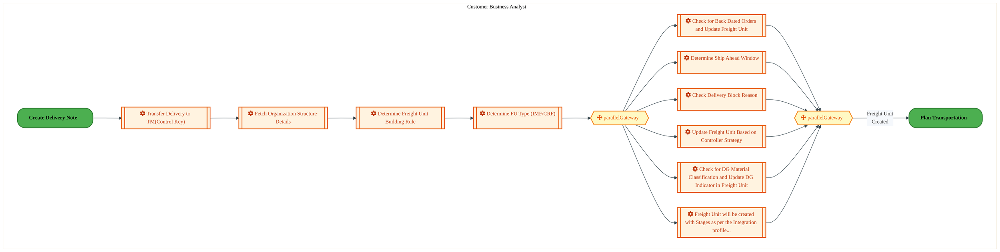
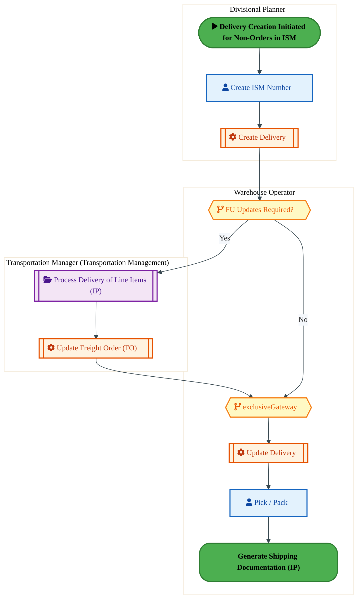
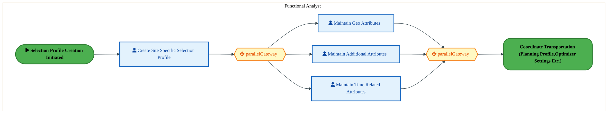
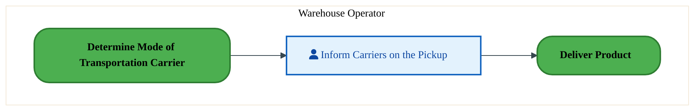
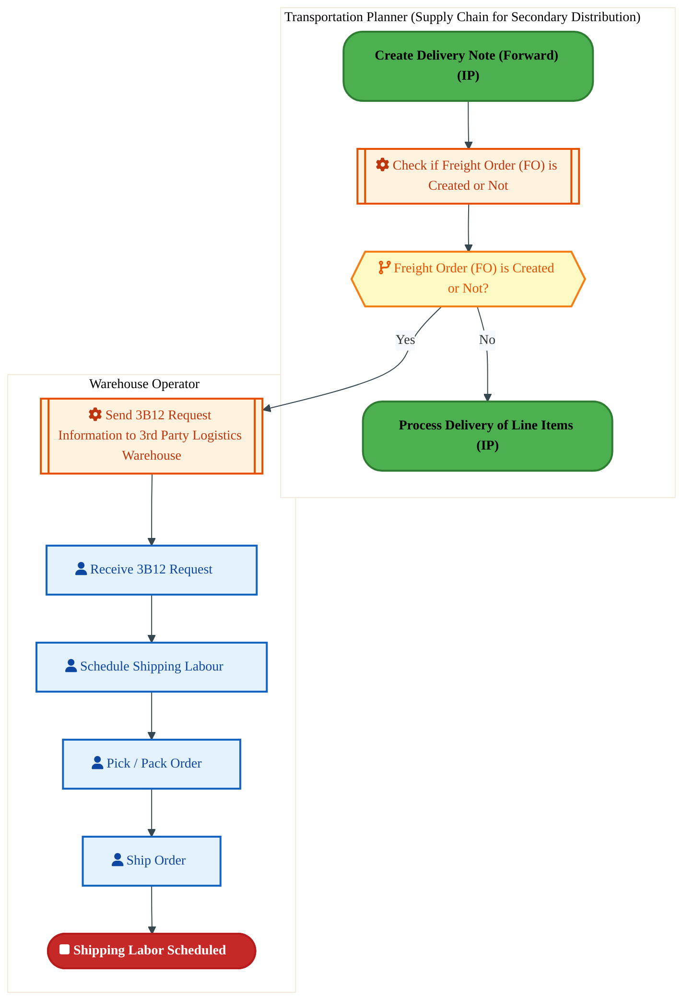
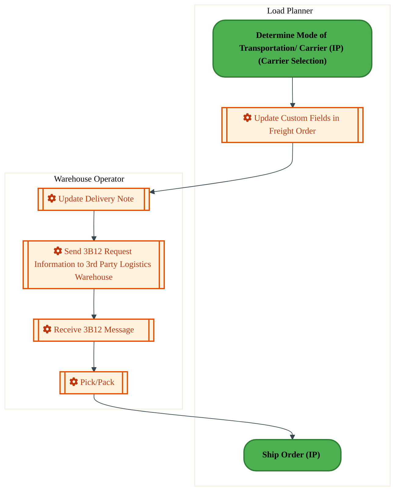

  <img src="data:image/svg+xml;base64,PHN2ZyB4bWxucz0iaHR0cDovL3d3dy53My5vcmcvMjAwMC9zdmciIHZpZXdCb3g9IjAgMCA4MDAgNDgwIiB3aWR0aD0iODAwIiBoZWlnaHQ9IjQ4MCI+DQogIDxkZWZzPg0KICAgIDxsaW5lYXJHcmFkaWVudCBpZD0iYmciIHgxPSIwJSIgeTE9IjAlIiB4Mj0iMTAwJSIgeTI9IjEwMCUiPg0KICAgICAgPHN0b3Agb2Zmc2V0PSIwJSIgc3R5bGU9InN0b3AtY29sb3I6IzAwNzFjNTtzdG9wLW9wYWNpdHk6MSIvPg0KICAgICAgPHN0b3Agb2Zmc2V0PSIxMDAlIiBzdHlsZT0ic3RvcC1jb2xvcjojMDBhZWVmO3N0b3Atb3BhY2l0eToxIi8+DQogICAgPC9saW5lYXJHcmFkaWVudD4NCiAgICA8bGluZWFyR3JhZGllbnQgaWQ9ImFjY2VudCIgeDE9IjAlIiB5MT0iMCUiIHgyPSIwJSIgeTI9IjEwMCUiPg0KICAgICAgPHN0b3Agb2Zmc2V0PSIwJSIgc3R5bGU9InN0b3AtY29sb3I6I2ZmZmZmZjtzdG9wLW9wYWNpdHk6MC4xNSIvPg0KICAgICAgPHN0b3Agb2Zmc2V0PSIxMDAlIiBzdHlsZT0ic3RvcC1jb2xvcjojZmZmZmZmO3N0b3Atb3BhY2l0eTowLjAyIi8+DQogICAgPC9saW5lYXJHcmFkaWVudD4NCiAgICA8cGF0dGVybiBpZD0iZ3JpZCIgd2lkdGg9IjQwIiBoZWlnaHQ9IjQwIiBwYXR0ZXJuVW5pdHM9InVzZXJTcGFjZU9uVXNlIj4NCiAgICAgIDxwYXRoIGQ9Ik0gNDAgMCBMIDAgMCAwIDQwIiBmaWxsPSJub25lIiBzdHJva2U9InJnYmEoMjU1LDI1NSwyNTUsMC4wNykiIHN0cm9rZS13aWR0aD0iMC41Ii8+DQogICAgPC9wYXR0ZXJuPg0KICA8L2RlZnM+DQoNCiAgPCEtLSBCYWNrZ3JvdW5kIC0tPg0KICA8cmVjdCB3aWR0aD0iODAwIiBoZWlnaHQ9IjQ4MCIgZmlsbD0idXJsKCNiZykiIHJ4PSI4Ii8+DQogIDxyZWN0IHdpZHRoPSI4MDAiIGhlaWdodD0iNDgwIiBmaWxsPSJ1cmwoI2dyaWQpIiByeD0iOCIvPg0KICA8cmVjdCB3aWR0aD0iODAwIiBoZWlnaHQ9IjQ4MCIgZmlsbD0idXJsKCNhY2NlbnQpIiByeD0iOCIvPg0KDQogIDwhLS0gRGVjb3JhdGl2ZSBjaXJjdWl0L2FyY2hpdGVjdHVyZSBsaW5lcyAtLT4NCiAgPGcgc3Ryb2tlPSJyZ2JhKDI1NSwyNTUsMjU1LDAuMTIpIiBzdHJva2Utd2lkdGg9IjEuNSIgZmlsbD0ibm9uZSI+DQogICAgPHBhdGggZD0iTSAwIDEwMCBMIDEyMCAxMDAgTCAxNjAgMTQwIEwgMjgwIDE0MCIvPg0KICAgIDxwYXRoIGQ9Ik0gMCAyNjAgTCA4MCAyNjAgTCAxMjAgMjIwIEwgMjAwIDIyMCBMIDI0MCAyNjAgTCAzNjAgMjYwIi8+DQogICAgPHBhdGggZD0iTSA1MjAgMTAwIEwgNjAwIDEwMCBMIDY0MCA2MCBMIDgwMCA2MCIvPg0KICAgIDxwYXRoIGQ9Ik0gNDQwIDM0MCBMIDU2MCAzNDAgTCA2MDAgMzAwIEwgNzIwIDMwMCBMIDc2MCAzNDAgTCA4MDAgMzQwIi8+DQogICAgPHBhdGggZD0iTSA2MDAgNDAwIEwgNjgwIDQwMCBMIDcyMCA0NDAiLz4NCiAgICA8cGF0aCBkPSJNIDAgNDAwIEwgNDAgNDAwIEwgODAgMzYwIi8+DQogICAgPHBhdGggZD0iTSAyMDAgNDIwIEwgMzIwIDQyMCBMIDM2MCAzODAgTCA0ODAgMzgwIi8+DQogICAgPHBhdGggZD0iTSA2NTAgNDQwIEwgNzUwIDQ0MCBMIDgwMCA0ODAiLz4NCiAgPC9nPg0KDQogIDwhLS0gRGVjb3JhdGl2ZSBub2RlcyAtLT4NCiAgPGcgZmlsbD0icmdiYSgyNTUsMjU1LDI1NSwwLjE4KSI+DQogICAgPGNpcmNsZSBjeD0iMTIwIiBjeT0iMTAwIiByPSI0Ii8+DQogICAgPGNpcmNsZSBjeD0iMjgwIiBjeT0iMTQwIiByPSI0Ii8+DQogICAgPGNpcmNsZSBjeD0iMjAwIiBjeT0iMjIwIiByPSI0Ii8+DQogICAgPGNpcmNsZSBjeD0iMzYwIiBjeT0iMjYwIiByPSI0Ii8+DQogICAgPGNpcmNsZSBjeD0iNjAwIiBjeT0iMTAwIiByPSI0Ii8+DQogICAgPGNpcmNsZSBjeD0iNzIwIiBjeT0iMzAwIiByPSI0Ii8+DQogICAgPGNpcmNsZSBjeD0iNTYwIiBjeT0iMzQwIiByPSI0Ii8+DQogICAgPGNpcmNsZSBjeD0iODAiIGN5PSIzNjAiIHI9IjQiLz4NCiAgICA8Y2lyY2xlIGN4PSI0ODAiIGN5PSIzODAiIHI9IjQiLz4NCiAgICA8Y2lyY2xlIGN4PSIzMjAiIGN5PSI0MjAiIHI9IjQiLz4NCiAgPC9nPg0KDQogIDwhLS0gVE9HQUYgQkRBVCBib3hlcyAtLT4NCiAgPGcgZm9udC1mYW1pbHk9IlNlZ29lIFVJLCBBcmlhbCwgc2Fucy1zZXJpZiIgZm9udC1zaXplPSIxNCIgZm9udC13ZWlnaHQ9IjYwMCI+DQogICAgPCEtLSBCIC0tPg0KICAgIDxyZWN0IHg9IjE1MCIgeT0iMTQwIiB3aWR0aD0iMTIwIiBoZWlnaHQ9IjQwIiByeD0iNSIgZmlsbD0icmdiYSgyNTUsMjU1LDI1NSwwLjE4KSIgc3Ryb2tlPSJyZ2JhKDI1NSwyNTUsMjU1LDAuMykiIHN0cm9rZS13aWR0aD0iMSIvPg0KICAgIDx0ZXh0IHg9IjIxMCIgeT0iMTY1IiB0ZXh0LWFuY2hvcj0ibWlkZGxlIiBmaWxsPSIjZmZmIj5CdXNpbmVzczwvdGV4dD4NCiAgICA8IS0tIEQgLS0+DQogICAgPHJlY3QgeD0iMjkwIiB5PSIxNDAiIHdpZHRoPSIxMjAiIGhlaWdodD0iNDAiIHJ4PSI1IiBmaWxsPSJyZ2JhKDI1NSwyNTUsMjU1LDAuMTgpIiBzdHJva2U9InJnYmEoMjU1LDI1NSwyNTUsMC4zKSIgc3Ryb2tlLXdpZHRoPSIxIi8+DQogICAgPHRleHQgeD0iMzUwIiB5PSIxNjUiIHRleHQtYW5jaG9yPSJtaWRkbGUiIGZpbGw9IiNmZmYiPkRhdGE8L3RleHQ+DQogICAgPCEtLSBBIC0tPg0KICAgIDxyZWN0IHg9IjQzMCIgeT0iMTQwIiB3aWR0aD0iMTIwIiBoZWlnaHQ9IjQwIiByeD0iNSIgZmlsbD0icmdiYSgyNTUsMjU1LDI1NSwwLjE4KSIgc3Ryb2tlPSJyZ2JhKDI1NSwyNTUsMjU1LDAuMykiIHN0cm9rZS13aWR0aD0iMSIvPg0KICAgIDx0ZXh0IHg9IjQ5MCIgeT0iMTY1IiB0ZXh0LWFuY2hvcj0ibWlkZGxlIiBmaWxsPSIjZmZmIj5BcHBsaWNhdGlvbjwvdGV4dD4NCiAgICA8IS0tIFQgLS0+DQogICAgPHJlY3QgeD0iNTcwIiB5PSIxNDAiIHdpZHRoPSIxMjAiIGhlaWdodD0iNDAiIHJ4PSI1IiBmaWxsPSJyZ2JhKDI1NSwyNTUsMjU1LDAuMTgpIiBzdHJva2U9InJnYmEoMjU1LDI1NSwyNTUsMC4zKSIgc3Ryb2tlLXdpZHRoPSIxIi8+DQogICAgPHRleHQgeD0iNjMwIiB5PSIxNjUiIHRleHQtYW5jaG9yPSJtaWRkbGUiIGZpbGw9IiNmZmYiPlRlY2hub2xvZ3k8L3RleHQ+DQogIDwvZz4NCg0KICA8IS0tIENvbm5lY3RpbmcgbGluZXMgYmV0d2VlbiBCREFUIGJveGVzIC0tPg0KICA8ZyBzdHJva2U9InJnYmEoMjU1LDI1NSwyNTUsMC4yNSkiIHN0cm9rZS13aWR0aD0iMSI+DQogICAgPGxpbmUgeDE9IjI3MCIgeTE9IjE2MCIgeDI9IjI5MCIgeTI9IjE2MCIvPg0KICAgIDxsaW5lIHgxPSI0MTAiIHkxPSIxNjAiIHgyPSI0MzAiIHkyPSIxNjAiLz4NCiAgICA8bGluZSB4MT0iNTUwIiB5MT0iMTYwIiB4Mj0iNTcwIiB5Mj0iMTYwIi8+DQogIDwvZz4NCg0KICA8IS0tIE1haW4gdGl0bGUgLS0+DQogIDx0ZXh0IHg9IjQwMCIgeT0iMjYwIiB0ZXh0LWFuY2hvcj0ibWlkZGxlIiBmb250LWZhbWlseT0iU2Vnb2UgVUksIEFyaWFsLCBzYW5zLXNlcmlmIiBmb250LXNpemU9IjM2IiBmb250LXdlaWdodD0iNzAwIiBmaWxsPSIjZmZmZmZmIiBsZXR0ZXItc3BhY2luZz0iMSI+DQogICAgSUFPIEFyY2hpdGVjdHVyZQ0KICA8L3RleHQ+DQogIDx0ZXh0IHg9IjQwMCIgeT0iMzAwIiB0ZXh0LWFuY2hvcj0ibWlkZGxlIiBmb250LWZhbWlseT0iU2Vnb2UgVUksIEFyaWFsLCBzYW5zLXNlcmlmIiBmb250LXNpemU9IjE4IiBmb250LXdlaWdodD0iNDAwIiBmaWxsPSJyZ2JhKDI1NSwyNTUsMjU1LDAuOCkiIGxldHRlci1zcGFjaW5nPSIyIj4NCiAgICBUT0dBRiBCREFUIMK3IElBTyBQcm9ncmFtIMK3IElETSAyLjANCiAgPC90ZXh0Pg0KDQogIDwhLS0gQm90dG9tIGFjY2VudCBiYXIgLS0+DQogIDxyZWN0IHg9IjI4MCIgeT0iMzQwIiB3aWR0aD0iMjQwIiBoZWlnaHQ9IjMiIHJ4PSIxLjUiIGZpbGw9InJnYmEoMjU1LDI1NSwyNTUsMC40KSIvPg0KDQogIDwhLS0gSW50ZWwgdGV4dCAtLT4NCiAgPHRleHQgeD0iNDAwIiB5PSIzODAiIHRleHQtYW5jaG9yPSJtaWRkbGUiIGZvbnQtZmFtaWx5PSJTZWdvZSBVSSwgQXJpYWwsIHNhbnMtc2VyaWYiIGZvbnQtc2l6ZT0iMTMiIGZpbGw9InJnYmEoMjU1LDI1NSwyNTUsMC41KSIgbGV0dGVyLXNwYWNpbmc9IjMiPg0KICAgIElOVEVMIENPTkZJREVOVElBTA0KICA8L3RleHQ+DQo8L3N2Zz4NCg==" alt="IAO Architecture" style="width:100%; border-radius:8px;" />
  <h1 style="font-size:36px; margin-top:24px;">LO-180 — Manage Outbound Transportation - OTC (IP)</h1>
  <h2 style="font-size:24px;">Architecture Document (TOGAF BDAT)</h2>
  
Order To Cash (IP) (OTC-IP) Tower 
  Capability LO-180 · LO Logistics Management Outbound - OTC (IP)

  
IAO Program · R1 – R5 
  Generated: April 2026 
  Sajiv Francis

  
IAO Architecture Pipeline — Intel Confidential

Page 1<a href="#toc">↑ Back to TOC</a>LO-180 — Manage Outbound Transportation - OTC (IP)

## Table of Contents

<nav class="toc">
<ol>
  <li><a href="#1-executive-summary">1. Executive Summary</a></li>
  <li><a href="#2-business-context-objectives">2. Business Context &amp; Objectives</a>
    <ul>
      <li><a href="#21-classification">2.1 Classification</a></li>
      <li><a href="#22-business-drivers">2.2 Business Drivers</a></li>
      <li><a href="#23-success-criteria">2.3 Success Criteria</a></li>
      <li><a href="#24-companion-documents">2.4 Companion Documents</a></li>
    </ul>
  </li>
  <li><a href="#3-business-architecture-togaf-b">3. Business Architecture (TOGAF &ldquo;B&rdquo;)</a>
    <ul>
      <li><a href="#31-business-process-overview">3.1 Business Process Overview</a></li>
      <li><a href="#32-business-process-diagrams">3.2 Business Process Diagrams</a></li>
      <li><a href="#33-business-roles-responsibilities">3.3 Business Roles &amp; Responsibilities</a></li>
    </ul>
  </li>
  <li><a href="#4-data-architecture-togaf-d">4. Data Architecture (TOGAF &ldquo;D&rdquo;)</a>
    <ul>
      <li><a href="#41-data-entities-ownership">4.1 Data Entities &amp; Ownership</a></li>
      <li><a href="#42-data-flow-diagrams">4.2 Data Flow Diagrams</a></li>
      <li><a href="#43-data-lineage">4.3 Data Lineage</a></li>
      <li><a href="#44-ricefw-data-objects">4.4 RICEFW Data Objects</a></li>
      <li><a href="#45-data-governance-quality">4.5 Data Governance &amp; Quality</a></li>
    </ul>
  </li>
  <li><a href="#5-application-architecture-togaf-a">5. Application Architecture (TOGAF &ldquo;A&rdquo;)</a>
    <ul>
      <li><a href="#54-component-overview">5.4 Component Overview</a></li>
      <li><a href="#55-ricefw-inventory">5.5 RICEFW Inventory</a>
        <ul>
          <li><a href="#551-eca-dependencies">5.5.1 ECA Dependencies</a></li>
          <li><a href="#552-boundary-application-dependencies">5.5.2 Boundary Application Dependencies</a></li>
        </ul>
      </li>
      <li><a href="#56-integration-patterns">5.6 Integration Patterns</a></li>
    </ul>
  </li>
  <li><a href="#6-technology-architecture-togaf-t">6. Technology Architecture (TOGAF &ldquo;T&rdquo;)</a>
    <ul>
      <li><a href="#61-platform-infrastructure">6.1 Platform &amp; Infrastructure</a></li>
      <li><a href="#62-sap-development-object-status">6.2 SAP Development Object Status</a></li>
      <li><a href="#63-nfrs-design-principles">6.3 NFRs &amp; Design Principles</a></li>
      <li><a href="#64-security-governance">6.4 Security &amp; Governance</a></li>
    </ul>
  </li>
  <li><a href="#7-project-context">7. Project Context</a>
    <ul>
      <li><a href="#71-project-roadmap-go-live-plan">7.1 Project Roadmap &amp; Go-Live Plan</a></li>
      <li><a href="#72-raid-log">7.2 RAID Log</a></li>
      <li><a href="#73-recommendations-next-steps">7.3 Recommendations &amp; Next Steps</a></li>
    </ul>
  </li>
</ol>
</nav>

Page 2<a href="#toc">↑ Back to TOC</a>LO-180 — Manage Outbound Transportation - OTC (IP)

## 1. Executive Summary

This Architecture Document defines the **Business, Data, Application, and Technology** (BDAT) architecture for **LO-180 Manage Outbound Transportation - OTC (IP)** within the IAO program. It includes 10 BPMN process diagram(s) in Section 3.

| Dimension | Value |
|-----------|-------|
| **Tower** | Order To Cash (IP) (OTC-IP) |
| **Process Group** | LO Logistics Management Outbound - OTC (IP) |
| **Capability** | LO-180 - Manage Outbound Transportation - OTC (IP) |
| **Release** | R1 – R5 |
| **Total Systems** | 0 |
| **System Status** | 0 Deployed, 0 Developing, 0 EOL, 0 Pending IAPM |
| **RICEFW Objects** | 4 Reports, 12 Interfaces, 18 Enhancements, 9 Forms |

> All system nodes in architecture diagrams are **IAPM-linked** — click any node to open its IAPM page. Diagrams require `securityLevel: 'loose'` for click events.

Page 3<a href="#toc">↑ Back to TOC</a>LO-180 — Manage Outbound Transportation - OTC (IP)

## 2. Business Context & Objectives

### 2.1 Classification

| Level | Value |
|-------|-------|
| **L0 Tower** | Order To Cash (IP) |
| **L1 Process** | LO Logistics Management Outbound - OTC (IP) |
| **L2 Capability** | LO-180 - Manage Outbound Transportation - OTC (IP) |

### 2.2 Business Drivers

| # | Driver | Description | Strategic Alignment | Priority |
|---|--------|-------------|---------------------|----------|
| 1 | IP Order Management Transformation | Transform Intel Products order management onto S/4 HANA with integrated pricing and ATP | IDM 2.0 Products Revenue | High |
| 2 | Customer Experience Improvement | Reduce order processing time and improve order visibility for IP customers | Customer Centricity | High |
| 3 | Returns & Rebate Automation | Automate returns processing, rebate management, and chargeback handling | Revenue Assurance | Medium |
| 4 | LO-180 Process Migration | Migrate Manage Outbound Transportation - OTC (IP) business processes and 0 integrated systems from legacy to S/4 HANA target architecture | IDM 2.0 Order Management (Intel Products) | High |

Page 4<a href="#toc">↑ Back to TOC</a>LO-180 — Manage Outbound Transportation - OTC (IP)

### 2.3 Success Criteria

| Metric | Target | Measure | Baseline | Owner |
|--------|--------|---------|----------|-------|
| Order Processing Time | < 2 hours | Time from order receipt to order confirmation | 6 hours (current) | Order Management Lead |
| Customer Credit Decision Time | < 15 minutes | Automated credit check and approval for standard orders | 2 hours (manual) | Credit Manager |
| Returns Processing Cycle | < 3 business days | End-to-end returns receipt to credit memo issuance | 7 business days (current) | Returns Manager |
| LO-180 Migration Completeness | 100% flow chains validated | All 0 flow chains verified in target state | 0% (pre-migration) | Tower Architect |

### 2.4 Companion Documents

| Document | Description |
|----------|-------------|
| **Business Architecture** | Included in this document (Section 3) — process flows from BPMN diagrams |
| **This Document** | Full BDAT Architecture — Business + Data + Application + Technology |

Page 5<a href="#toc">↑ Back to TOC</a>LO-180 — Manage Outbound Transportation - OTC (IP)

## 3. Business Architecture (TOGAF "B")

### 3.1 Business Process Overview

This capability includes **10 business process(es)** modeled in BPMN 2.0, covering the end-to-end workflow for LO-180 Manage Outbound Transportation - OTC (IP).

| # | Step ID | Process Name | Lanes | Tasks | Gateways |
|---|---------|--------------|-------|-------|----------|
| 1 | LO-180-010_Process_Delivery_of_Line_Items_-_OTC_(IP) | LO-180-010_Process_Delivery_of_Line_Items_-_OTC_(IP) | Customer Business Analyst | 10 | 2 |
| 2 | LO-180-050_Prepare_Delivery_Schedule_for_Non-orders_-_OTC_(IP) | LO-180-050_Prepare_Delivery_Schedule_for_Non-orders_-_OTC_(IP) | Divisional Planner, Transportation Manager (Transportation Management), Warehouse Operator | 5 | 2 |
| 3 | LO-180-060_Assign_Warranty_-_OTC_(IP) | LO-180-060_Assign_Warranty_-_OTC_(IP) | Warehouse Operator | 2 | 1 |
| 4 | LO-180-070_Plan_Transportation_-_OTC_(IP) | LO-180-070_Plan_Transportation_-_OTC_(IP) | Functional Analyst | 4 | 2 |
| 5 | LO-180-110_Schedule_Carrier_for_Product_Shipping_-_OTC_(IP) | LO-180-110_Schedule_Carrier_for_Product_Shipping_-_OTC_(IP) | Warehouse Operator | 1 | 0 |
| 6 | LO-180-120_Schedule_Shipping_Labor_-_OTC_(IP) | LO-180-120_Schedule_Shipping_Labor_-_OTC_(IP) | Transportation Planner (Supply Chain for Secondary Distribution), Warehouse Operator | 6 | 1 |
| 7 | LO-180-130_Coordinate_Transportation_-_OTC_(IP) | LO-180-130_Coordinate_Transportation_-_OTC_(IP) | Functional Analyst, Load Planner | 14 | 4 |
| 8 | LO-180-140_Record_Transportation_Information_-_OTC_(IP) | LO-180-140_Record_Transportation_Information_-_OTC_(IP) | Load Planner, Warehouse Operator | 5 | 0 |
| 9 | LO-180-150_Generate_Shipping_Documentation_-_OTC_(IP) | LO-180-150_Generate_Shipping_Documentation_-_OTC_(IP) | Load Planner, Warehouse Operator | 8 | 5 |
| 10 | LO-180-170_Create_Delivery_Note_-_OTC_(IP) | LO-180-170_Create_Delivery_Note_-_OTC_(IP) | CBA Business Manager, Transportation Manager (Transportation Management), Warehouse Operator | 14 | 12 |

Page 6<a href="#toc">↑ Back to TOC</a>LO-180 — Manage Outbound Transportation - OTC (IP)

### 3.2 Business Process Diagrams

#### BUSINESS ARCHITECTURE — 3.2.1 LO-180-010_Process_Delivery_of_Line_Items_-_OTC_(IP) — LO-180-010_Process_Delivery_of_Line_Items_-_OTC_(IP)

**Swim Lanes**: Customer Business Analyst | **Tasks**: 10 | **Gateways**: 2

> **Legend**: ● Start · ● End · User Task · Service Task · ◇ Gateway · Sub-Process

<a href="https://mermaid.live/view#pako:eNqlVluP4jYU_itWRiO2EkxzJUweKkEgq9F22tUw031YqsokDlhj7Mh2hmFZ_ntPLtzcTaWqeUB85_Kdm4-TvZWKjFiRdXu7p5zqCO17ek02pBeh3hIr0uujRvAHlhQvGVG9yiYXXM_pt9rM8Yv3yqySJXhD2a6SzslKEPTy0EdjcGR9pDBXA0UkzXv9XiHpBstdLJiQlfUNGeV2XkdrVRMhMyLPBrYdOmkAroxychZ7oR_6SeWnSCp4dkWaB_koT3uHKjkmtukaS12nXyryiN-_0EyvAeeYKQI2a71hv-IlYVWNWpaVLC3l27EZVFVxODRsXuCU8hXIfRtEEvPXsyiwDwd0uL1d8FNQ9DxdcARPyrBSU5IjpUE8e9Mop4xFN348TgK7r7QUryS6cWfh1HP7aVVJBKXb_aq5gy2hq7WOloJlrelgW9UQucV7X75Hrt2XO_g1YhGenSPFQ3fkjk6RJqETO_ExUp7n_ysS9FU-Y_Xaxpp5iZtMT7GcYBjE9j_5jmVO_XDsmH0i8o2m5II0SRJvdm7VbBg4djfpJPGGdmyQrrAmW7w7E97H_okwCcLECTsJm3hmluXysxTpkdCbBUlwIgwnTjJ2Own9seOP2gyBZyVxsUYMc_KX_XVhxaXSYkMkmpQKDr5SaMwx2ym9sP5sfKqHO1_BNsdRjgepWKFnOJEqB68pYfSNyB3SAj0_fohhtlIw9InsfgKCSwb3miEhOl2j3-UKc_oNayo4msNKpLqUBFg1pkwZDN41AxgRuYGcUSLr04Re4IKBOijLYFHQU8mIweB3Mryg511B0IeHx-Tn-Ckxkw-uHeM1SeG4COgahj9TGHcGtcB9ohDmGXopMhBd5WUQDrsyma9pgcZrgjP0hfJMbA3H8EeZnKYwYQLgE8FKcMNxdO34gxShGAV1wCTaMTIYMAwF7FY7g-2-qyHTj-gRHKorGcXV8aU5TZv5XnQGrB54VinAhfJ_65RjGwfnMuMt7ANaEpRKUs9gS_UaUsYrAoNQqIAC4OUCsaAE2WRRSAFbRO7u7sxADsT5DIvRnO5CSF17GIvgVktThzu3_TehiWHm7ffHrLGUYqsGmGlUYImhrexjc0EsrMPh0sn_b05w7zZ_uIMGg19gx1roNtBroddA_2jc4qGBQwMHLQ4a6Bz9hwYODTwysNOm01693G-hZ8S7b_G96V87fF9YV6eEN0PIFtb3anYG18jAjn0U2Nfs9RVbNfDiRXClcTs1XqfG79QEnZphpybs1Iw6NfedGmhAp8o5fTZcy90OuXd8012L_aPY6lvwatlgmlnR3qo_8-BTMCM5Lpm2Dn0Ll1rMdzy1ovpzyCrr62FKMWzrphEe_gYbyzv4" title="View full diagram">&#128065; View Diagram</a>

Page 7<a href="#toc">↑ Back to TOC</a>LO-180 — Manage Outbound Transportation - OTC (IP)

#### BUSINESS ARCHITECTURE — 3.2.2 LO-180-050_Prepare_Delivery_Schedule_for_Non-orders_-_OTC_(IP) — LO-180-050_Prepare_Delivery_Schedule_for_Non-orders_-_OTC_(IP)

**Swim Lanes**: Divisional Planner · Transportation Manager (Transportation Management) · Warehouse Operator | **Tasks**: 5 | **Gateways**: 2

> **Legend**: ● Start · ● End · User Task · Service Task · ◇ Gateway · Sub-Process

<a href="https://mermaid.live/view#pako:eNqlVl2P4jYU_StWRiNmpKDmk0AeWjFAViPtzKAy01W1VJVJrsEisVM7YWBZ_nttEghQeGoekO7xuefec-04bI2YJ2CExv39ljJahGjbKhaQQStErRmW0DJRBfyBBcWzFGRLcwhnxYT-2NNsL19rmsYinNF0o9EJzDmgj2cT9VViaiKJmWxLEJS0zFYuaIbFZsBTLjT7DrrEIvtq9dITFwmIhmBZgR37KjWlDBrYDbzAi3SehJiz5EyU-KRL4tZON5fyz3iBRbFvv5TwgtffaFIsVExwKkFxFkWWfsUzSLXHQpQai0uxOgyDSl2HqYFNchxTNle4ZylIYLZsIN_a7dDu_n7KjkXR-3DKkHriFEs5BIJkoeDRqkCEpml45w36kW-ZshB8CeGdMwqGrmPG2kmorFumHm77E-h8UYQzniY1tf2pPYROvjbFOnQsU2zU70UtYElTadBxuk73WOkpsAf24FCJEPK_Kqm5incsl3WtkRs50fBYy_Y7_sD6r97B5tAL-vblnECsaAwnolEUuaNmVKOOb1u3RZ8it2MNLkTnuIBPvGkEewPvKBj5QWQHNwWrepddlrOx4PFB0B35kX8UDJ7sqO_cFPT6ttetO1Q6c4HzBUoxg7-t71NjSFdUUs5wisYKZCCmxl8VWT_MVhyCQ4LbevZoIEB5Q8-TF_RaZrNLtvv9SI_5_MAeQkpXIDaKe0ruPBzJeaqmdaBVaaon9KxuDKoUEkS4QK-ctd_0SysRZboFpfdY6akTeM2gbv5dvTwy56KoJF8ww3Nl5OEqngErHs8t-eeWPvJEW4rE_gCjfT_oIXp7vDBnW00eUaccRJvnwJDeRpCyMcsJ-qpuHPRcQCbRw_P4ROmGLUcpf8MCFlztCXrLQeCCX-yEc75vYxov0S9ojOPlOc-7au_GjgWK-wWYrgdosqB5rm4kNORxqQdXDbJ2cJLV3W6bEgm0Z2ry8QLBOk5Lqcp8qd6WqbHbnWT1rmdFH3WPEv0O_5RUQPJbk3kcGOuidvtXZa8OnSoM6rBThfVlwPwq7NahbVWxf4ir0K1Dtwp7ddjT4c-p8cqnxs9GxKtYzgXrT5B7mn36iusSh6vtDHauw-7ptXW24t1c8W-udI4fizM4uA53D7fbGdq7iqpB1jeXYRoZiAzTxAi3xv6Dr_4UJEBwmRbGzjRwWfDJhsVGuP8wGuV-k4cUq3OfVeDuX2xooso=" title="View full diagram">&#128065; View Diagram</a>

#### BUSINESS ARCHITECTURE — 3.2.3 LO-180-060_Assign_Warranty_-_OTC_(IP) — LO-180-060_Assign_Warranty_-_OTC_(IP)

**Swim Lanes**: Warehouse Operator | **Tasks**: 2 | **Gateways**: 1

> **Legend**: ● Start · ● End · User Task · Service Task · ◇ Gateway · Sub-Process

<a href="https://mermaid.live/view#pako:eNqlVFtv2jAU_itWqopNClKuhOVhEgRSIW1rJbrtYUyTSY7BqrEj2ylliP8-m4TrxtPygDifv8vxieOtU4gSnNS5v99STnWKth29hBV0UtSZYwUdFzXANywpnjNQHcshgusp_b2n-VH1ZmkWy_GKso1Fp7AQgL5OXDQwQuYihbnqKpCUdNxOJekKy00mmJCWfQd94pF9Wrs0FLIEeSJ4XuIXsZEyyuEEh0mURLnVKSgELy9MSUz6pOjsbHNMrIsllnrffq3gM377Tku9NDXBTIHhLPWKfcJzYHaPWtYWK2r5ehgGVTaHm4FNK1xQvjB45BlIYv5ygmJvt0O7-_sZP4ai59GMI_MUDCs1AoKUNvD4VSNCGUvvomyQx56rtBQvkN4F42QUBm5hd5KarXuuHW53DXSx1OlcsLKldtd2D2lQvbnyLQ08V27M71UW8PKUlPWCftA_Jg0TP_OzQxIh5L-SzFzlM1YvbdY4zIN8dMzy416ceX_7HbY5ipKBfz0nkK-0gDPTPM_D8WlU417se7dNh3nY87Ir0wXWsMabk-GHLDoa5nGS-8lNwybvust6_iRFcTAMx3EeHw2ToZ8PgpuG0cCP-m2HxmchcbVEDHP45f2YOd-xhKUwc0WPFUishZw5Pxuyfbj_w5AITgnuFmKBpuZdo3AYoKeHCZrSBcfM8M8FwaVgoJRhGZ39SNGXejUHeaUI3x0VSovqktsaQGlE789EkdF8rUozaDThr8BN4xs01VjXCnXR43OG3k2e3l_uJTYaO0ZQCj0IUSo0UaoGRIQ0UlG8oM_Gbx9-y6K33R56xVKKtepiplGFJWYM2EPz3mfObtdozLSaPzxG3e5HM8629Juy15a9powuy6Atg6YMzw6FdTg7uhcrwc2VsP1UL8DoeFdcwPG_4d7hcDuuswK5wrR00q2zv8LNNV8CwTXTzs51cK3FdMMLJ91fdU69f1sjis0JXDXg7g9fg_FA" title="View full diagram">&#128065; View Diagram</a>

Page 8<a href="#toc">↑ Back to TOC</a>LO-180 — Manage Outbound Transportation - OTC (IP)

#### BUSINESS ARCHITECTURE — 3.2.4 LO-180-070_Plan_Transportation_-_OTC_(IP) — LO-180-070_Plan_Transportation_-_OTC_(IP)

**Swim Lanes**: Functional Analyst | **Tasks**: 4 | **Gateways**: 2

> **Legend**: ● Start · ● End · User Task · Service Task · ◇ Gateway · Sub-Process

<a href="https://mermaid.live/view#pako:eNqlVV2PozYU_SsWo1F2JVLxGSgPlTIkrFbqqqtmdvvQVJUDl8QaY5BtJpNG-e-9DpAMs5OHqkhBOcf3nPsBNkcrrwuwEuv-_sgE0wk5TvQOKpgkZLKhCiY26YjvVDK64aAmJqashV6xf85hbtC8mDDDZbRi_GDYFWxrIN8-22SOQm4TRYWaKpCsnNiTRrKKykNa81qa6DuIS6c8Z-uXHmpZgLwGOE7k5iFKORNwpf0oiILM6BTktShGpmVYxmU-OZnieL3Pd1Tqc_mtgi_05Q9W6B3iknIFGLPTFf-VboCbHrVsDZe38nkYBlMmj8CBrRqaM7FFPnCQklQ8XanQOZ3I6f5-LS5JyeNiLQheOadKLaAkSiO9fNakZJwnd0E6z0LHVlrWT5Dcecto4Xt2bjpJsHXHNsOd7oFtdzrZ1LzoQ6d700PiNS-2fEk8x5YHvL_JBaK4ZkpnXuzFl0wPkZu66ZCpLMv_lQnnKh-peupzLf3MyxaXXG44C1PnR7-hzUUQzd23cwL5zHJ4ZZplmb-8jmo5C13ntulD5s-c9I3plmrY08PV8Oc0uBhmYZS50U3DLt_bKtvNV1nng6G_DLPwYhg9uNncu2kYzN0g7itEn62kzY5wKuBv58-1lbUi16wWlJM53g5Kr62_umBzCRdjSpqUdGpmT1IJ2BtZMXNrIGcly8kKOJxNCBaJJcLYwhtbfKFMaPyRT1CTudaSbVoNaqzxb2geWQXkd-BYRHFTHNwQz4uCDb3ekIYfLtqG4xP8obVuAob4jMcZM3Wgw8dXFjN0SGs8XZgwo3rEzauaWupO9eErjl7gRh4M7d8azSo86iQm0xpXFFnq_KeP48Ki43EojEpZ79WUck0aKinnwD91L9zaOp1eaeL_psFt3P0RIZlOf8Fn30O3g1EPow76Y-iNYdBDr4NxD4MxjDs466E_Wj2__Sb7sOtHtPc-7b9PB-_T4eWcHNGz9-lo2NgjNh5Yy7YqkBVlhZUcrfNHDT98BZS05do62RZtdb06iNxKzoe_1TYFKheM4p6sOvL0L4XFTYM=" title="View full diagram">&#128065; View Diagram</a>

#### BUSINESS ARCHITECTURE — 3.2.5 LO-180-110_Schedule_Carrier_for_Product_Shipping_-_OTC_(IP) — LO-180-110_Schedule_Carrier_for_Product_Shipping_-_OTC_(IP)

**Swim Lanes**: Warehouse Operator | **Tasks**: 1 | **Gateways**: 0

> **Legend**: ● Start · ● End · User Task · Service Task · ◇ Gateway · Sub-Process

<a href="https://mermaid.live/view#pako:eNqlVMuK2zAU_RXhIXjjgJ9x6kUhcWIY6NBCpp1FU4piS4mILBlJzqMh_96rPJxJyqzqhbGOzz3n3mPJB6eUFXEyp9c7MMFMhg6uWZGauBlyF1gT10Nn4AdWDC840a7lUCnMjP050YK42VmaxQpcM7636IwsJUHfnz00gkLuIY2F7muiGHU9t1GsxmqfSy6VZT-RIfXpye3yaixVRdSN4PtpUCZQypkgNzhK4zQubJ0mpRTVnShN6JCW7tE2x-W2XGFlTu23mrzg3RurzArWFHNNgLMyNf-CF4TbGY1qLVa2anMNg2nrIyCwWYNLJpaAxz5ACov1DUr84xEde7256EzR62QuEFwlx1pPCEXaADzdGEQZ59lTnI-KxPe0UXJNsqdwmk6i0CvtJBmM7ns23P6WsOXKZAvJqwu1v7UzZGGz89QuC31P7eH-4EVEdXPKB-EwHHZO4zTIg_zqRCn9LyfIVb1ivb54TaMiLCadV5AMktz_V-865iROR8FjTkRtWEneiRZFEU1vUU0HSeB_LDouooGfP4gusSFbvL8JfsrjTrBI0iJIPxQ8-z122S6-KVleBaNpUiSdYDoOilH4oWA8CuLhpUPQWSrcrBDHgvz2f86dN6zISkKu6GtDFDZSzZ1fZ7K9RAAcijOK-zZ79CyoVDXKsVKMKI2kQHB60TdWrtvmvjKEygnhbANl0HzVluaeEJ0IhqgaThx6gW2PJEWvsNl1I5XBhoH6xamrhL12fhAR6vc_Q4OXZXBehu-Ss-B1x9zBYXc87uCogx3PqaEvzConOzin_xP8wypCccuNc_Qc3Bo524vSyU7n2GmbCr75hGGItz6Dx79SC5t1" title="View full diagram">&#128065; View Diagram</a>

Page 9<a href="#toc">↑ Back to TOC</a>LO-180 — Manage Outbound Transportation - OTC (IP)

#### BUSINESS ARCHITECTURE — 3.2.6 LO-180-120_Schedule_Shipping_Labor_-_OTC_(IP) — LO-180-120_Schedule_Shipping_Labor_-_OTC_(IP)

**Swim Lanes**: Transportation Planner (Supply Chain for Secondary Distribution) · Warehouse Operator | **Tasks**: 6 | **Gateways**: 1

> **Legend**: ● Start · ● End · User Task · Service Task · ◇ Gateway · Sub-Process

<a href="https://mermaid.live/view#pako:eNqlVmtr60YQ_SuLQnACMtXTcvShxS9BIL0xddpLuS5lLY2sJbJW3V3FcX393ztryXakOlCoPtjM2ZlzZmZnV9obMU_ACI3b2z0rmArJvqcy2EAvJL0VldAzSQ38RgWjqxxkT_ukvFAL9vfRzfbKd-2msYhuWL7T6ALWHMivjyYZYWBuEkkL2ZcgWNoze6VgGyp2E55zob1vYJha6VGtWRpzkYC4OFhWYMc-huasgAvsBl7gRTpOQsyLpEWa-ukwjXsHnVzOt3FGhTqmX0n4mb5_ZYnK0E5pLgF9MrXJn-gKcl2jEpXG4kq8nZrBpNYpsGGLksasWCPuWQgJWrxeIN86HMjh9nZZnEXJy3RZEHzinEo5hZRIhfDsTZGU5Xl4401GkW-ZUgn-CuGNMwumrmPGupIQS7dM3dz-Ftg6U-GK50nj2t_qGkKnfDfFe-hYptjhb0cLiuSiNBk4Q2d4VhoH9sSenJTSNP1fSthX8ULla6M1cyMnmp61bH_gT6x_853KnHrByO72CcQbi-EDaRRF7uzSqtnAt63PSceRO7AmHdI1VbCluwvhw8Q7E0Z-ENnBp4S1XjfLajUXPD4RujM_8s-EwdiORs6nhN7I9oZNhsizFrTMSE4L-NP6tjRecLZkyYWiivGCzHGhAEHuFlVZ5jsyySgrSMoFWZzGn0wZSrFVpQPul8YfNbV-Cv8bUqY0TGk_5muMhviVsJRE4rjf5FmfOXIXPd8TJslEADYqIcj-hStk-kg1RCZdM0hJppCzN0BpnpInPJ7kUcFGkrvHeUf_AYNq1ksMUgNKcrGlIrm_EmRb-_0l6wT6K-xJnP2npH9aGodDzYWn4FqTbUzpKxWQcRxe8lyCoIqLTgbnrukBJ79ADJg7cce2g8ZfFUjVDnDaAYs4g6TKgSwyVpZ4SxC8ZnjVUXE7Qehb19Z289puc4Zb-AOZU_y74j1o7_gCu9DKmzwWOD2beroUJ65IkEuoHXniaxwkFktybk9nBIK7M7dUvGxXd6k6wbD7zh4UPun3f9R729i2pYHvS-N3kEvjOybeLAwax8Z0atM7hdWm05hubQaN-VCbflfjCz9KDBvcq93cD4daM58usxbsXIfd67B3HfY_XmutlcGnK0FzjbfA4fk90oIfrsNYf3PzGaaxAdx1lhjh3ji-3_EbIIGUVrkyDqZBK8UXuyI2wuN70KjKBCOnjOLJ2dTg4R_FRZuC" title="View full diagram">&#128065; View Diagram</a>

Page 10<a href="#toc">↑ Back to TOC</a>LO-180 — Manage Outbound Transportation - OTC (IP)

#### BUSINESS ARCHITECTURE — 3.2.7 LO-180-130_Coordinate_Transportation_-_OTC_(IP) — LO-180-130_Coordinate_Transportation_-_OTC_(IP)

**Swim Lanes**: Functional Analyst · Load Planner | **Tasks**: 14 | **Gateways**: 4

```mermaid
%%{init: {'theme': 'base', 'themeVariables': {'fontSize': '14px', 'fontFamily': 'Segoe UI, Arial, sans-serif','primaryColor': '#e8f0fe', 'primaryBorderColor': '#0071c5','lineColor': '#37474F', 'secondaryColor': '#f5f8fc'}, 'flowchart': {'useMaxWidth': false, 'htmlLabels': true, 'curve': 'basis', 'nodeSpacing': 40, 'rankSpacing': 50}} }%%
flowchart LR
    classDef startEvt fill:#4CAF50,stroke:#2E7D32,color:#000,font-weight:bold,stroke-width:2px,rx:20,ry:20
    classDef endEvt fill:#C62828,stroke:#B71C1C,color:#fff,font-weight:bold,stroke-width:2px,rx:20,ry:20
    classDef userTask fill:#E3F2FD,stroke:#1565C0,stroke-width:2px,color:#0D47A1
    classDef serviceTask fill:#FFF3E0,stroke:#E65100,stroke-width:2px,color:#BF360C
    classDef gateway fill:#FFF9C4,stroke:#F57F17,stroke-width:2px,color:#E65100
    classDef subProc fill:#F3E5F5,stroke:#7B1FA2,stroke-width:2px,color:#4A148C
    subgraph Functional Analyst
        n1["fa:fa-user Create Planning Profile"]
        n2["fa:fa-user Maintain Planning Profile Parameters"]
        n3["fa:fa-user Maintain Capacity Selection Profile"]
        n4["fa:fa-user Maintain Planning Cost settings"]
        n5["fa:fa-user Maintain Optimizer Settings"]
        n6["fa:fa-user Maintain Incompatibilities"]
        n7["fa:fa-user Maintain Carrier Selection Settings"]
        n8["fa:fa-user Update Purchase Organization"]
        n9["fa:fa-user Destination stage will be updated with Z3 Consignee"]
        n10["fa:fa-user Update Freight Order Based on Change Controller Strategy"]
        n11["fa:fa-user Determine Freight Order Type (IMF/CRF)"]
        n15["Determine Mode of Transportation Carrier (Carrier Selection)"]
        n16["Plan Transportation ( Selection Profile Settings)"]
        n17{{"fa:fa-arrows-alt parallelGateway"}}
        n18{{"fa:fa-arrows-alt parallelGateway"}}
        n19{{"fa:fa-arrows-alt parallelGateway"}}
        n20{{"fa:fa-arrows-alt parallelGateway"}}
    end
    subgraph Load Planner
        n12["fa:fa-user Manage Transportation Cockpit"]
        n13["fa:fa-user Check for Back Dated order and Customer Window in Freight Units for..."]
        n14["fa:fa-user Perform Consolidation"]
    end
    n17 --> n2
    n17 --> n3
    n17 --> n4
    n17 --> n6
    n17 --> n7
    n2 --> n18
    n3 --> n18
    n4 --> n18
    n6 --> n18
    n7 --> n18
    n16 --> n1
    n1 --> n17
    n18 --> n12
    n12 --> n13
    n19 --> n8
    n19 --> n10
    n10 --> n20
    n19 --> n9
    n8 --> n20
    n9 --> n20
    n20 --> n15
    n17 --> n5
    n5 --> n18
    n13 --> n14
    n11 --> n19
    n14 --> n11
    class n1 userTask
    class n2 userTask
    class n3 userTask
    class n4 userTask
    class n5 userTask
    class n6 userTask
    class n7 userTask
    class n8 userTask
    class n9 userTask
    class n10 userTask
    class n11 userTask
    class n12 userTask
    class n13 userTask
    class n14 userTask
    class n15 startEvt
    class n16 startEvt
    class n17 gateway
    class n18 gateway
    class n19 gateway
    class n20 gateway
```

> **Legend**: ● Start · ● End · User Task · Service Task · ◇ Gateway · Sub-Process

<a href="https://mermaid.live/view#pako:eNqlV2Fv4jgQ_StWqoqeBL0kJCTw4SQayKlSq6227a1019PJJA5YTezINqUs4r_vOCRQ3ESn20Mq6jxm3psZj4ewsxKeEmtiXV7uKKNqgnY9tSIF6U1Qb4El6fXRAfgDC4oXOZE97ZNxph7p98rN8cp37aaxGBc032r0kSw5Qc-3fTSFwLyPJGZyIImgWa_fKwUtsNhGPOdCe1-QMLOzSq3-6IaLlIiTg20HTuJDaE4ZOcHDwAu8WMdJknCWnpFmfhZmSW-vk8v5Jllhoar015Lc4_dvNFUrsDOcSwI-K1Xkd3hBcl2jEmuNJWvx1jSDSq3DoGGPJU4oWwLu2QAJzF5PkG_v92h_efnCjqLo7usLQ_BKcizljGRIKoDnbwplNM8nF140jX27L5Xgr2Ry4c6D2dDtJ7qSCZRu93VzBxtClys1WfA8rV0HG13DxC3f--J94tp9sYV3Q4uw9KQUjdzQDY9KN4ETOVGjlGXZ_1KCvoonLF9rrfkwduPZUcvxR35kf-Zrypx5wdQx-0TEG03IB9I4jofzU6vmI9-xu0lv4uHIjgzSJVZkg7cnwnHkHQljP4idoJPwoGdmuV48CJ40hMO5H_tHwuDGiaduJ6E3dbywzhB4lgKXK5RjRv6x_3qx4jVLFOUM52gKb1upXqy_D876xRzwyfAkwwPdexQJArWhB4hnMI0IsoKcyHmMex5zjylT8PcpCj1ggQuiiJDnBMMOggjrS6C26JHkpEq7PQHv3xKIuFRw9EqBYWj7HbFfSkUL2EgCxNviRh1xtyzhRYkVXdCcKkqMsKCzVCFoJdZU2i4bnsc_l2l1PmsBe0ES9EUsMaPfsWY4DxyfB86IBPbKT--OJUEbmDW0IGhdUaZgqxX6cwi9Y5IuGTF67titmcSiuumQCGxbdAM5pQgkohVmoAFcMLV5rgtVAvyXW4PVMdOEaSlgQxvET9uSoKvb-_jX6Gv8i8Ghj_QUeA_7FfEMPcFWlSUX6lB00_CrT5036fRJ60kyGa4-j-Xx0EyOYLdr6gI5vpEDnCtUwn2AZuS_H_bHi7XffwwKfyZo_BNBrv3fguALoG2_6LO74zg93DsijB58WhNMj515LDx5Lam5lIwFEa1IAuub6wGDf2bVvFbf7wizFEVrqXgBxjfKUr5BcL2a6XmGZxKpI6-vrw0NY4k8EAFuRTX-PKfp-ZU6dgCOFg0Gv0EPDXto2J5hjww7qG33YDphbQ8N2zPskWEHhu00Do1dm42eE9bAsYAmg2MF4wMQGrZjN4Bdt8A2PMa1HRqfjw3brQkc32hKY_tmUU1Xjl1tymoknaZPHx8AdPXNI8UZ7LbDw3bYa4f9dnjUDgftcNgOj9th6Hw73lGn01Go01Gp01Gq4x8fOM_xUQceNM9I53DYDo9bYZiSGrb6FlzvAtPUmuys6ucE_ORISYbXubL2fQuvFX_cssSaVI_d1uE7bUYxbKviAO5_AHa4-ds=" title="View full diagram">&#128065; View Diagram</a>

Page 11<a href="#toc">↑ Back to TOC</a>LO-180 — Manage Outbound Transportation - OTC (IP)

#### BUSINESS ARCHITECTURE — 3.2.8 LO-180-140_Record_Transportation_Information_-_OTC_(IP) — LO-180-140_Record_Transportation_Information_-_OTC_(IP)

**Swim Lanes**: Load Planner · Warehouse Operator | **Tasks**: 5 | **Gateways**: 0

> **Legend**: ● Start · ● End · User Task · Service Task · ◇ Gateway · Sub-Process

<a href="https://mermaid.live/view#pako:eNqlVdtu4zYQ_RVCQeAtIGN1tVw9FLBlCwiQdI11tvuwKQqaGtqEKVIlqSRu4H8vZcnypeun6kHAzJw5Z2Y4lD4cIgtwUuf-_oMJZlL0MTAbKGGQosEKaxi4qHX8gRXDKw560GCoFGbJ_jnA_Kh6b2CNL8cl47vGu4S1BPTtwUUTm8hdpLHQQw2K0YE7qBQrsdplkkvVoO9gTD16UOtCU6kKUCeA5yU-iW0qZwJO7jCJkihv8jQQKYoLUhrTMSWDfVMcl29kg5U5lF9reMLv31lhNtammGuwmI0p-SNeAW96NKpufKRWr8dhMN3oCDuwZYUJE2vrjzzrUlhsT67Y2-_R_v7-RfSi6Hn2IpB9CMdaz4Aibax7_moQZZynd1E2yWPP1UbJLaR3wTyZhYFLmk5S27rnNsMdvgFbb0y6krzooMO3poc0qN5d9Z4Gnqt29n2lBaI4KWWjYByMe6Vp4md-dlSilP4vJTtX9Yz1ttOah3mQz3otPx7FmfdfvmObsyiZ-NdzAvXKCJyR5nkezk-jmo9i37tNOs3DkZddka6xgTe8OxH-mkU9YR4nuZ_cJGz1rqusVwslyZEwnMd53BMmUz-fBDcJo4kfjbsKLc9a4WqDOBbwl_fjxXmUuEALawpQL86fLax5hP_DhilOKR4SuUbfqsJ2hbJaG1minAEvNGIC5epwlOhLc50swznFyDIsN6xqg-jTw-KXS43EAmZgQJX20qEnu_lIUvRs911XUhlsmBSfUYaVYl0--nS0lsCBNIATp13En_XpW5XvWMFG2v1BXypQ2MirboPLbr8CAfYKKJz6AXoCrfEarpoLLzMWjGw_LzDZXsGiS9jS1tiyfoW_a9AGPQgqVXloFRmJQmXPw97dHXqUa6YNIxr1xV9xxz89ohlwW7raod-lOcvohyMCNBz-ZhvozKQ1u5shotYMOjNszVFn-q0Zd2bcmtHZvjaYs1t1EQluRsKbkehmJL4ZGfXfvwt30rsd1ynt1mFWOOmHc_gB2Z9UARTX3Dh718G1kcudIE56-FA79WG2M4btXpWtc_8vb50vRQ==" title="View full diagram">&#128065; View Diagram</a>

Page 12<a href="#toc">↑ Back to TOC</a>LO-180 — Manage Outbound Transportation - OTC (IP)

#### BUSINESS ARCHITECTURE — 3.2.9 LO-180-150_Generate_Shipping_Documentation_-_OTC_(IP) — LO-180-150_Generate_Shipping_Documentation_-_OTC_(IP)

**Swim Lanes**: Load Planner · Warehouse Operator | **Tasks**: 8 | **Gateways**: 5

```mermaid
%%{init: {'theme': 'base', 'themeVariables': {'fontSize': '14px', 'fontFamily': 'Segoe UI, Arial, sans-serif','primaryColor': '#e8f0fe', 'primaryBorderColor': '#0071c5','lineColor': '#37474F', 'secondaryColor': '#f5f8fc'}, 'flowchart': {'useMaxWidth': false, 'htmlLabels': true, 'curve': 'basis', 'nodeSpacing': 40, 'rankSpacing': 50}} }%%
flowchart LR
    classDef startEvt fill:#4CAF50,stroke:#2E7D32,color:#000,font-weight:bold,stroke-width:2px,rx:20,ry:20
    classDef endEvt fill:#C62828,stroke:#B71C1C,color:#fff,font-weight:bold,stroke-width:2px,rx:20,ry:20
    classDef userTask fill:#E3F2FD,stroke:#1565C0,stroke-width:2px,color:#0D47A1
    classDef serviceTask fill:#FFF3E0,stroke:#E65100,stroke-width:2px,color:#BF360C
    classDef gateway fill:#FFF9C4,stroke:#F57F17,stroke-width:2px,color:#E65100
    classDef subProc fill:#F3E5F5,stroke:#7B1FA2,stroke-width:2px,color:#4A148C
    subgraph lane_0["Load Planner"]
        n1[["fa:fa-cog Create Freight Order"]]
        n2[["fa:fa-cog Generate ZCUS"]]
        n3[["fa:fa-cog Generate Carrier Pre Alert"]]
        n4[["fa:fa-cog Generate Consolidated Export CI for FG (ZSIS)"]]
        n5[["fa:fa-cog Generate Customer Pre Alert"]]
        n6[["fa:fa-cog Generate ZXCI"]]
        n9(["fa:fa-stop Output Message Status Updated (Success or Failure)"])
        n10["Coordinate Transportation (Planning profiles, Optimizer settings Etc.)"]
        n11{{"fa:fa-code-branch exclusiveGateway"}}
        n12{{"fa:fa-code-branch Country?"}}
        n13{{"fa:fa-code-branch exclusiveGateway"}}
    end
    subgraph lane_1["Warehouse Operator"]
        n7[["fa:fa-cog Complete Pick Pack of all the deliveries"]]
        n8[["fa:fa-cog Complete PGI of all the Deliveries"]]
        n14{{"fa:fa-code-branch Country?"}}
        n15{{"fa:fa-code-branch exclusiveGateway"}}
    end
    n10 --> n1
    n11 --> n9
    n1 --> n7
    n7 --> n14
    n4 --> n12
    n5 --> n11
    n3 --> n11
    n2 --> n15
    n13 -->|"ZPRC"| n3
    n12 -->|"MY,VN"| n2
    n14 -->|"(MY,VN,CD)"| n4
    n13 -->|"ZPRE"| n5
    n12 -->|"AMS"| n6
    n6 --> n15
    n15 --> n8
    n8 --> n13
    n12 -->|"CD"| n15
    n14 -->|"Others"| n15
    class n1 serviceTask
    class n2 serviceTask
    class n3 serviceTask
    class n4 serviceTask
    class n5 serviceTask
    class n6 serviceTask
    class n7 serviceTask
    class n8 serviceTask
    class n9 endEvt
    class n10 startEvt
    class n11 gateway
    class n12 gateway
    class n13 gateway
    class n14 gateway
    class n15 gateway
```

> **Legend**: ● Start · ● End · User Task · Service Task · ◇ Gateway · Sub-Process

<a href="https://mermaid.live/view#pako:eNqlVm1vozgQ_isWqyqtRE5AIKR8uFNKQlWp3Uab7e5dN6eTCyax6mBkmza5bP77jQnkhQ0n7R0fSGaemWdebMbeGDFPiBEYFxcbmlEVoE1HLciSdALUecGSdEy0U3zBguIXRmRH26Q8U1P6d2lmu_lKm2ldhJeUrbV2SuacoKc7Ew3BkZlI4kx2JRE07ZidXNAlFuuQMy609QcySK20jFZBN1wkRBwMLMu3Yw9cGc3IQd3zXd-NtJ8kMc-SE9LUSwdp3Nnq5Bh_jxdYqDL9QpIHvPpKE7UAOcVMErBZqCW7xy-E6RqVKLQuLsRb3QwqdZwMGjbNcUyzOehdC1QCZ68HlWdtt2h7cTHL9kHR_adZhuCJGZZyRFIkFajHbwqllLHggxsOI88ypRL8lQQfnLE_6jlmrCsJoHTL1M3tvhM6X6jghbOkMu2-6xoCJ1-ZYhU4linW8G7EIllyiBT2nYEz2Ee68e3QDutIaZr-r0jQV_EZy9cq1rgXOdFoH8v2-l5o_chXlzly_aHd7BMRbzQmR6RRFPXGh1aN-55ttZPeRL2-FTZI51iRd7w-EF6H7p4w8vzI9lsJd_GaWRYvE8HjmrA39iJvT-jf2NHQaSV0h7Y7qDIEnrnA-QIxnJG_rG8z457jBE1AzIiYGX_uzPST2d8ATnGQ4m7M5ygUBKpCkShXDj3qrwccjj2cU49bApza5zl8mjZMey2mIRaCEoEmgqAhI0I1_Nw2P55JzmgC_xM0XuUcvonwDqVcoOgWXT5P76ZXDSqvjaqQii__JYd-W5m_h3cN0-vLvSmQ5uixUHmh0AOREs8JmiqsCome8l3el9MijgFCOmtMWSGITvrqeFH0moUcZhfNdMzPMBqkrhYryjN0Wa4kjAmUCw6bhUgTPeaKLmGUCtjrSgEm0VjFv1w1VtvebA5VJaT7AszxApFVzApJ38jtbk_PjO322M057xbyIlNi_VvTvPezUWC2nNu6NrThKxZkwWEkQIl6BXhjA_uNDcyXOSPQswmNX9EEw4unCDOG4PxBCWEQHvaebCzhoI3l9u7Yf9Tmb7s_1yHvP3cINgfqdn-F31q2d_J1Le9EvxL9ytqtZLeSnUr2Krmm6zVkp5K9mr40-D4zniefwpnxHTxqxKmQhz_MLx9LqA5iuxV0WWJmOLoqcfcM6bhEvCbp8GFaAv0K6DfzqgoZVPKgwn_ILhyVPAfHOrdHWGEhT8ByNOuWHh0gJ4jTivRaEbcV8VqRfivityKDVuS6OsxPi7T214lTvV2fdKdq57y6d17tnld7tdowDZjGS0wTI9gY5V0R7pMJSXHBlLE1DVwoPl1nsRGUdyqjKMfpiGKYF8udcvsPk0dNtA==" title="View full diagram">&#128065; View Diagram</a>

Page 13<a href="#toc">↑ Back to TOC</a>LO-180 — Manage Outbound Transportation - OTC (IP)

#### BUSINESS ARCHITECTURE — 3.2.10 LO-180-170_Create_Delivery_Note_-_OTC_(IP) — LO-180-170_Create_Delivery_Note_-_OTC_(IP)

**Swim Lanes**: CBA Business Manager · Transportation Manager (Transportation Management) · Warehouse Operator | **Tasks**: 14 | **Gateways**: 12

```mermaid
%%{init: {'theme': 'base', 'themeVariables': {'fontSize': '14px', 'fontFamily': 'Segoe UI, Arial, sans-serif','primaryColor': '#e8f0fe', 'primaryBorderColor': '#0071c5','lineColor': '#37474F', 'secondaryColor': '#f5f8fc'}, 'flowchart': {'useMaxWidth': false, 'htmlLabels': true, 'curve': 'basis', 'nodeSpacing': 40, 'rankSpacing': 50}} }%%
flowchart LR
    classDef startEvt fill:#4CAF50,stroke:#2E7D32,color:#000,font-weight:bold,stroke-width:2px,rx:20,ry:20
    classDef endEvt fill:#C62828,stroke:#B71C1C,color:#fff,font-weight:bold,stroke-width:2px,rx:20,ry:20
    classDef userTask fill:#E3F2FD,stroke:#1565C0,stroke-width:2px,color:#0D47A1
    classDef serviceTask fill:#FFF3E0,stroke:#E65100,stroke-width:2px,color:#BF360C
    classDef gateway fill:#FFF9C4,stroke:#F57F17,stroke-width:2px,color:#E65100
    classDef subProc fill:#F3E5F5,stroke:#7B1FA2,stroke-width:2px,color:#4A148C
    subgraph lane_0["CBA Business Manager"]
        n1["fa:fa-user Create Delivery Manually"]
        n2["fa:fa-user Identify Error"]
        n3["fa:fa-user Release Hold/ Block"]
        n4["fa:fa-user Process Sales Order"]
        n5["fa:fa-user Block Delivery for Further Processing"]
        n7[["fa:fa-cog Create Delivery Automatically"]]
        n8[["fa:fa-cog Create Delivery by Wrapper Program"]]
        n15(["fa:fa-play Delivery Note Creation Initiated"])
        n16(["fa:fa-stop Delivery Blocked"])
        n19["Proceed to TOPHAT"]
        n20{{"fa:fa-code-branch Delivery / GTS Hold?"}}
        n21{{"fa:fa-code-branch exclusiveGateway"}}
        n22{{"fa:fa-code-branch Delivery Note Creation from Batch Job Required?"}}
        n23{{"fa:fa-code-branch exclusiveGateway"}}
        n24{{"fa:fa-code-branch Check MM ID is in Exclusion List?"}}
        n25{{"fa:fa-code-branch Check if Delivery Note to be Blocked?"}}
        n26{{"fa:fa-code-branch exclusiveGateway"}}
        n27{{"fa:fa-code-branch exclusiveGateway"}}
        n28{{"fa:fa-code-branch 1st DN, Direct or 2nd DN"}}
        n31{{"fa:fa-arrows-alt parallelGateway"}}
        n32[["fa:fa-folder-open Process Delivery of Line Items (IP)"]]
    end
    subgraph lane_1["Transportation Manager (Transportation Management)"]
        n6["fa:fa-user Link Delivery to Freight Order (FO)"]
        n14[["fa:fa-cog Send FO Updates"]]
    end
    subgraph lane_2["Warehouse Operator"]
        n9[["fa:fa-cog Receive 3B12 Message"]]
        n10[["fa:fa-cog Send 3B12 Confirmation to OpenText"]]
        n11[["fa:fa-cog Send Email Alert"]]
        n12[["fa:fa-cog Update Delivery"]]
        n13[["fa:fa-cog Send 3B12 Request Information to 3rd Party Logistics Warehouse"]]
        n17(["fa:fa-stop Delivery Information Confirmed"])
        n18(["fa:fa-stop Email Alert Sent Successfully"])
        n29{{"fa:fa-code-branch Confirmation Status?"}}
        n30{{"fa:fa-code-branch Check if Freight Order (FO) is Created or Not?"}}
    end
    n4 --> n20
    n21 --> n4
    n1 --> n23
    n2 --> n3
    n7 --> n23
    n15 --> n21
    n22 -->|"Yes"| n24
    n24 -->|"No"| n7
    n12 --> n30
    n9 --> n10
    n32 --> n14
    n5 --> n16
    n27 --> n1
    n10 --> n29
    n11 --> n18
    n23 --> n25
    n31 --> n26
    n14 --> n12
    n25 -->|"No"| n31
    n25 -->|"Yes"| n5
    n24 -->|"Yes"| n27
    n13 --> n9
    n30 -->|"Yes"| n13
    n31 -->|"Distribute to TOPHAT"| n19
    n20 -->|"Yes"| n2
    n20 -->|"No"| n28
    n22 -->|"No"| n27
    n3 --> n21
    n30 -->|"No"| n6
    n29 -->|"Rejected"| n11
    n29 -->|"Accepted"| n17
    n26 --> n32
    n6 --> n26
    n28 -->|"2DN"| n8
    n28 -->|"1st DN, Direct"| n22
    n8 --> n23
    class n1 userTask
    class n2 userTask
    class n3 userTask
    class n4 userTask
    class n5 userTask
    class n6 userTask
    class n7 serviceTask
    class n8 serviceTask
    class n9 serviceTask
    class n10 serviceTask
    class n11 serviceTask
    class n12 serviceTask
    class n13 serviceTask
    class n14 serviceTask
    class n15 startEvt
    class n16 endEvt
    class n17 endEvt
    class n18 endEvt
    class n19 startEvt
    class n20 gateway
    class n21 gateway
    class n22 gateway
    class n23 gateway
    class n24 gateway
    class n25 gateway
    class n26 gateway
    class n27 gateway
    class n28 gateway
    class n29 gateway
    class n30 gateway
    class n31 gateway
    class n32 subProc
```

> **Legend**: ● Start · ● End · User Task · Service Task · ◇ Gateway · Sub-Process

<a href="https://mermaid.live/view#pako:eNqlWG2P2jgQ_itWqhVbCdQ4LyTw4U68peW0b1q2V526p5NJHPBtSDgn2V1uy3-_cRIHYkIr9fiA5GdmnnnxeIx50_wkoNpQu7h4YzHLhuitk63phnaGqLMkKe10UQn8Tjgjy4imHaETJnG2YP8Watjavgo1gXlkw6KdQBd0lVD0ed5FIzCMuiglcdpLKWdhp9vZcrYhfDdJooQL7XfUDfWw8FaJxgkPKD8o6LqDfRtMIxbTA2w6lmN5wi6lfhIHDdLQDt3Q7-xFcFHy4q8Jz4rw85Rek9cvLMjWsA5JlFLQWWeb6IosaSRyzHguMD_nz7IYLBV-YijYYkt8Fq8At3SAOImfDpCt7_dof3HxGNdO0dX9Y4zg40ckTac0RGkG8Ow5QyGLouE7azLybL2bZjx5osN3xsyZmkbXF5kMIXW9K4rbe6Fstc6GyyQKKtXei8hhaGxfu_x1aOhdvoNvxReNg4OnSd9wDbf2NHbwBE-kpzAM_5cnqCt_IOlT5WtmeoY3rX1hu29P9FM-mebUckZYrRPlz8ynR6Se55mzQ6lmfRvr50nHntnXJwrpimT0hewOhIOJVRN6tuNh5yxh6U-NMl_e8cSXhObM9uya0Bljb2ScJbRG2HKrCIFnxcl2jSIS07_0r4_aZDxC4zyFnk9TdE1isqL8UfuzVBefGINWSIYh6YnqowmnkB2a0og9U74TNjmJol3TyGgazQMaZyzcoRnnicJvNlXvaURhLqBP0Bof0DhK_KemvtXUF3URsS8IzA50Kw51U99u6heMh_DDhCMv5zCCaio4ZU0G52tN4SerkwqM8izZkIz5VRmOTd3vmy536Avsx7Z0DluzUeyxfVkTbCNoqdr0JgGigo8lMZrDbGVAHYD9-2P7_sE-zZLtwb6ow6n-ANSLOtAAZQl6uL37NHpQ9lZ_ezskFdDeEuaTvz5Qf0AfHxbFBv76qO33x6a43ZS--hE04TP9WJ4c1cz4gcdmMUKebNCYZKDxW7KEjvonZ5yeBmP-XDBWu9lkTaGxrq_RfIpYiliMZiURRHTF0uzEvf09HhYq2cFmLKnctROu_s-l4vycmdtuhtMMTW-6aArV9jMEJ8uIA0AUc_OoCQjMg5e0R6IMbQmHA0Sjdp-mcThJIXQW5b1kS-P6-NfFSkKodkzRPKObFF3O794fjhRcVG1zUEy4B0gh3SY8K1uomoToshXfwDR73zwU_eaUgRCOhgzsnceLG68cUOjSu1XssdWcFAuIFXm36PM2gHqkP8xBDNwvhNN1Av7RLUwUkqmTdtB0cU99CvEhc4wNdA1FhMzU8aO3RFXoT5I4ZHxTVgXyA4_xA33NVALcQjDbEBahUUT5ibrRVC-zrwupapvnohNHnkI3zmOY74cgTR6gO_hdtENXyQqOJPNTVBdNJXfOTc5j0qoMp3PUVayPchZxwlfui8YN8_LSODY2Bmcmw3HNF9CReaoOAlP_wVA57UMxrMp7KRBHFobNEWndbbGFer1fxPCv1gYuAataV0vDlPJyLZeOIsZ2BWCpXxh8e9T-EN3-TcxZKbEqyU1SCBxJIV3IkAblGsu1WSlgyVT5xH3JXEUlY8B6FdRAAlVW2JUWZqVhSx8yb8mJq0JhQ5rYzfBNrApkxraacF2KOuXKvYzP1BVNbDbiAskU-pyzZV5eIfI-F6qSxFBJDFVQRW646l5JgYzPVDbVVBjqwg8q_J7-DVeFOD4iIqyKR3BGtrVYejH61cbLQPvKHhhuZW-IywdMXVXQvKrKJCSb22zV4ke46G_5-GjARjtstsNWO2y3w_122Dl-tDQk7lnJ4KwEev6sCJ8XGedF5nmRdV5k10_WJt6vnpdN1GlF3VZ00M4M3V2905owboeNdthsh6122G6H--2w0w677fCgFTbbszTbs4SJWT01ta62oXDXsEAbvmnFPzTwL05AQ5JHmbbvagRePYtd7GvD4p8MLS-u6ikj4hVTgvv_AEuTl_o=" title="View full diagram">&#128065; View Diagram</a>

Page 14<a href="#toc">↑ Back to TOC</a>LO-180 — Manage Outbound Transportation - OTC (IP)

### 3.3 Business Roles & Responsibilities

| Role / Lane | Processes Involved | Description |
|------------|-------------------|-------------|
| Customer Business Analyst | LO-180-010_Process_Delivery_of_Line_Items_-_OTC_(IP),  | |
| Divisional Planner | LO-180-050_Prepare_Delivery_Schedule_for_Non-orders_-_OTC_(IP),  | |
| Transportation Manager (Transportation Management) | LO-180-050_Prepare_Delivery_Schedule_for_Non-orders_-_OTC_(IP), LO-180-170_Create_Delivery_Note_-_OTC_(IP) | |
| Warehouse Operator | LO-180-050_Prepare_Delivery_Schedule_for_Non-orders_-_OTC_(IP), LO-180-060_Assign_Warranty_-_OTC_(IP), LO-180-110_Schedule_Carrier_for_Product_Shipping_-_OTC_(IP), LO-180-120_Schedule_Shipping_Labor_-_OTC_(IP), LO-180-140_Record_Transportation_Information_-_OTC_(IP), LO-180-150_Generate_Shipping_Documentation_-_OTC_(IP), LO-180-170_Create_Delivery_Note_-_OTC_(IP) | |
| Functional Analyst | LO-180-070_Plan_Transportation_-_OTC_(IP), LO-180-130_Coordinate_Transportation_-_OTC_(IP),  | |
| Transportation Planner (Supply Chain for Secondary Distribution) | LO-180-120_Schedule_Shipping_Labor_-_OTC_(IP),  | |
| Load Planner | LO-180-130_Coordinate_Transportation_-_OTC_(IP), LO-180-140_Record_Transportation_Information_-_OTC_(IP), LO-180-150_Generate_Shipping_Documentation_-_OTC_(IP),  | |
| CBA Business Manager | LO-180-170_Create_Delivery_Note_-_OTC_(IP) | |

Page 15<a href="#toc">↑ Back to TOC</a>LO-180 — Manage Outbound Transportation - OTC (IP)

## 4. Data Architecture (TOGAF "D")

### 4.1 Data Flows — Source to Target

*Data flows with DB platform details will be populated when tower architects complete the extended flow template columns (42-47) via the Input Portal.*

### 4.2 Data Flow Diagrams

> **DATA ARCHITECTURE** — Database-to-database data flows. Applications (blue) sit above their hosting databases (green cylinders). Thick arrows show data movement between databases.

### 4.3 Data Lineage

*Data lineage (source schema/object → target schema/object mappings) will be populated when tower architects provide validated schema details via the Input Portal.*

### 4.4 RICEFW Data Objects

Data-centric RICEFW objects (Reports and Conversions) from the Object Tracker:

| Object ID | Type | Description | Status | Source → Target | Complexity |
|-----------|------|-------------|--------|----------------|----------|
| LOGR1252 | Report | 2DN - Inbound Escort Report | 10. Object Complete |  | 02.High |
| LOGR1236 | Report | 2DN - Outbound Escort Report | 06. Dev In Progress |  | 02.High |
| LOGR1173 | Report | 2DN - Outbound Manifest Report | 10. Object Complete |  | 03.Medium |
| LOGR1172 | Report | 2DN - Inbound Manifest Report | 10. Object Complete |  | 03.Medium |

### 4.5 Data Governance & Quality

| Concern | Approach |
|---------|----------|
| Data Ownership | Per-entity owners listed in Section 3.1 |
| Data Classification | Financial data classified as Intel Confidential |
| Data Retention | Per Intel corporate retention policies |
| Data Quality | Validated at source; reconciliation at target |

Page 16<a href="#toc">↑ Back to TOC</a>LO-180 — Manage Outbound Transportation - OTC (IP)

## 5. Application Architecture (TOGAF "A")

### 5.4 Component Overview

#### System Inventory

| System | IAPM ID | Status |
|--------|---------|--------|

### 5.5 RICEFW Inventory

| Object ID | Type | Description | Status | Source → Target | Boundary App | Complexity |
|-----------|------|-------------|--------|----------------|-------------|----------|
| LOGR1252 | Report | 2DN - Inbound Escort Report | 10. Object Complete |  |  | 02.High |
| LOGR1236 | Report | 2DN - Outbound Escort Report | 06. Dev In Progress |  |  | 02.High |
| LOGR1173 | Report | 2DN - Outbound Manifest Report | 10. Object Complete |  |  | 03.Medium |
| LOGR1172 | Report | 2DN - Inbound Manifest Report | 10. Object Complete |  |  | 03.Medium |
| LOGI1067 | Interface | 2DN - S4 – Interface from S/4 to MPL for packing list. | 10. Object Complete | S/4 → MPL | Mark Pack Label Suite (IP) | 03.Medium |
| LOGI1066 | Interface | 2DN - Interface to capture Data for 1st Delivery in 2DN X-Dock Model | 10. Object Complete |  | OpenText | 03.Medium |
| LOGI0875 | Interface | Interface from WOM to S4 HANA to fetch the list of Deliveries for a particula... | 10. Object Complete | WOM → S/4 | SAP Commerce Cloud | 03.Medium |
| LOGI0874 | Interface | Interface from WOM to S4 HANA to fetch the ASN information of delivery. | 10. Object Complete | WOM → S/4 | SAP Commerce Cloud | 02.High |
| LOGI0842_IP | Interface | Interface from SAP S4 to DBaaS to Fetch Actual COF for FVR batch and COA for ... | 10. Object Complete | S/4 → DBaaS | Supply Chain Trade Re-engineering Data Container for Intel Products | 03.Medium |
| LOGI0800_IP | Interface | Interface to send shipment information to custom broker | 10. Object Complete | S/4 → OpenText | OpenText | 03.Medium |
| LOGI0612_IP | Interface | Customer ASN interface from outbound delivery | 10. Object Complete | S/4 → OpenText | OpenText | 03.Medium |
| LOGI0610 | Interface | 3B2 Post goods issue interface for Outbound delivery to SAP | 10. Object Complete | S/4 → OpenText | OpenText | 03.Medium |
| LOGI0609 | Interface | 3B13 interface for pick/pack updates for outbound delivery to SAP | 10. Object Complete | S/4 → OpenText | OpenText | 03.Medium |
| LOGI0607 | Interface | 3B14R Cancellation Request from S/4 to 3PL | 10. Object Complete | S/4 → 3PL | Logistics Customers Service Request; OpenText; Customer Master Database | 03.Medium |
| LOGI0418 | Interface | 3B12 Request to 3PL on FO creation | 10. Object Complete | 3PL → S/4 | OpenText | 02.High |
| LOGI0415 | Interface | 3B14C Cancellation Confirmation from 3PL to S/4 | 10. Object Complete | 3PL → S/4 | OpenText | 03.Medium |
| LOGF1583 | Form | Consolidated Export Commercial Invoice – Finished Goods (IP) | 10. Object Complete | NA → NA |  | 03.Medium |
| LOGF1149_IP | Form | Consolidated Packing list for Chengdu | 10. Object Complete |  |  | 02.High |
| LOGF0805 | Form | EIAJ form to be generated for OEM customers (Japan) | 10. Object Complete |  |  | 02.High |
| LOGF0353_IP | Form | Generate Consolidated Export Commercial Invoice - Finished Goods (IF and IP) | 10. Object Complete | NA → NA |  | 03.Medium |
| LOGF0348_IP | Form | Shipper Letter of instruction (Localization requirement for US) | 10. Object Complete | NA → NA |  | 02.High |
| LOGF0345_IP | Form | Bailment CI and End-Customer CI for IF/IP | 10. Object Complete | NA → NA |  | 03.Medium |
| LOGF0344_IP | Form | Generate Export CI for IF/IP | 10. Object Complete | NA → NA |  | 02.High |
| LOGF0343_IP | Form | Generate Itemised Packing Lists | 10. Object Complete | NA → NA |  | 03.Medium |
| LOGF0342_IP | Form | Generate Packing Lists for Finished Goods - IP and IF | 10. Object Complete | NA → NA |  | 02.High |
| LOGE1713 | Enhancement | Copy Control Routine for Customer Master Special Instructions | 10. Object Complete |  |  | 03.Medium |
| LOGE1148 | Enhancement | 2DN - Trigger Auto packing in 2nd DN of 2DN X-Dock Model | 10. Object Complete |  |  | 03.Medium |
| LOGE1147 | Enhancement | 2DN - S4 – Error Handling program in 2DN X-Dock Model | 10. Object Complete |  |  | 02.High |
| LOGE1116 | Enhancement | 2DN - Enhancement to capture required fields of 1st Delivery in 2DN X-Dock Model | 10. Object Complete |  |  | 03.Medium |
| LOGE1114 | Enhancement | 2DN - Post 3PL 3B2 or manual Goods Issue from CW or IW - Wrapper Program to c... | 10. Object Complete |  |  | 03.Medium |
| LOGE0979 | Enhancement | Pre-alert summary report for the EMEA customer | 10. Object Complete |  |  | 03.Medium |
| LOGE0797_IP | Enhancement | Pre alert notification to Customer | 10. Object Complete |  |  | 03.Medium |
| LOGE0796_IP | Enhancement | Custom transaction to trigger CUSDEC | 10. Object Complete |  |  | 02.High |
| LOGE0793 | Enhancement | Upload program to update pick/pack information in sap in case of 3B13 PIP fai... | 10. Object Complete |  |  | 03.Medium |
| LOGE0792_IP | Enhancement | Enhancement to Update Custom Table form Master data and Manage SOP Data Commu... | 10. Object Complete |  |  | 03.Medium |
| LOGE0791_IP | Enhancement | Creation of Proforma Invoice ZF8 from Freight Order and Save ITN Number in De... | 10. Object Complete |  |  | 03.Medium |
| LOGE0772_IP | Enhancement | Develop Fiori app to View/Edit/Add SOP data(CMDB). | 10. Object Complete |  |  | 02.High |
| LOGE0613 | Enhancement | Development of LCSR tool in Fiori | 10. Object Complete |  | Logistics Customers Service Request | 01.Very High |
| LOGE0611 | Enhancement | 1. Custom fields in Delivery to store Number of Pallets & IPLA indicator fiel... | 10. Object Complete |  |  | 03.Medium |
| LOGE0608 | Enhancement | Custom logic to fetch the details from different source and save in the custo... | 10. Object Complete |  |  | 03.Medium |
| LOGE0581 | Enhancement | Incoterm Location 1 ID field update for Outbound delivery | 10. Object Complete |  |  | 04.Low |
| LOGE0341_IP | Enhancement | Billing document creation to be triggered from the Output of outbound delivery | 10. Object Complete | NA → NA | NA | 03.Medium |
| LOGE0065_IP | Enhancement | Create single line delivery for a confirmed sales order confirmed schedule line | 10. Object Complete | NA → NA | NA | 04.Low |

**Summary**: 4 Reports, 12 Interfaces, 18 Enhancements, 9 Forms

#### 5.5.2 Boundary Application Dependencies

The following RICEFW objects integrate with **boundary applications** (external systems outside the S/4 HANA core):

| RICEFW ID | Description | Boundary Application | Source → Target |
|-----------|------------|---------------------|----------------|
| LOGI1067 | 2DN - S4 – Interface from S/4 to MPL for packing list. | Mark Pack Label Suite (IP) | S/4 → MPL |
| LOGI1066 | 2DN - Interface to capture Data for 1st Delivery in 2DN X-Dock Model | OpenText |  |
| LOGI0875 | Interface from WOM to S4 HANA to fetch the list of Deliveries for a particula... | SAP Commerce Cloud | WOM → S/4 |
| LOGI0874 | Interface from WOM to S4 HANA to fetch the ASN information of delivery. | SAP Commerce Cloud | WOM → S/4 |
| LOGI0842_IP | Interface from SAP S4 to DBaaS to Fetch Actual COF for FVR batch and COA for ... | Supply Chain Trade Re-engineering Data Container for Intel Products | S/4 → DBaaS |
| LOGI0800_IP | Interface to send shipment information to custom broker | OpenText | S/4 → OpenText |
| LOGI0612_IP | Customer ASN interface from outbound delivery | OpenText | S/4 → OpenText |
| LOGI0610 | 3B2 Post goods issue interface for Outbound delivery to SAP | OpenText | S/4 → OpenText |
| LOGI0609 | 3B13 interface for pick/pack updates for outbound delivery to SAP | OpenText | S/4 → OpenText |
| LOGI0607 | 3B14R Cancellation Request from S/4 to 3PL | Logistics Customers Service Request; OpenText; Customer Master Database | S/4 → 3PL |
| LOGI0418 | 3B12 Request to 3PL on FO creation | OpenText | 3PL → S/4 |
| LOGI0415 | 3B14C Cancellation Confirmation from 3PL to S/4 | OpenText | 3PL → S/4 |
| LOGE0613 | Development of LCSR tool in Fiori | Logistics Customers Service Request |  |

Page 17<a href="#toc">↑ Back to TOC</a>LO-180 — Manage Outbound Transportation - OTC (IP)

### 5.6 Integration Patterns

*Integration patterns will be populated when tower architects provide validated middleware and protocol details via the extended flow template.*

## 6. Technology Architecture (TOGAF "T")

### 6.1 Platform & Infrastructure

> **TECHNOLOGY / PLATFORM ARCHITECTURE** — Platforms (green) host applications (blue). Thick arrows show platform-to-platform integration flows.

#### Platform Inventory

*Platform inventory will be populated when tower architects provide validated technology platform details via the extended flow template.*

### 6.2 SAP Development Object Status

| Metric | DEV | QAS | PRD |
|--------|-----|-----|-----|
| Transport Requests | — | — | — |
| Custom Code Objects | — | — | — |
| CDS Views | — | — | — |
| Fiori Apps | — | — | — |
| BAdIs / Enhancements | — | — | — |

### 6.3 NFRs & Design Principles

| Category | Requirement | Target / SLA | Priority |
|----------|-------------|-------------|----------|
| Performance | Order/transaction processing within interactive SLA | < 3 seconds for online transactions | High |
| Availability | Business-critical systems available during extended hours | 99.9% (06:00-22:00 all time zones) | High |
| Scalability | Support seasonal and promotional volume spikes | Handle 2x baseline transaction volume | Medium |
| Recoverability | Customer-facing systems recover within business impact window | RPO < 30 min, RTO < 2 hours | High |
| Data Volume | Support transactional data growth from business expansion | 10M+ documents/year | Medium |
| Latency | Near-real-time integration for order status updates | < 30 seconds for status propagation | Medium |
| Concurrency | Support global user base across business functions | 300+ concurrent users | Medium |

### 6.4 Security & Governance

| Concern | Approach | Standard / Policy | Owner |
|---------|----------|--------------------|-------|
| Authentication | Single Sign-On (SSO) via Intel corporate Azure AD identity | Intel IT Security Policy - Identity Management | IT Security |
| Authorization | Role-based access control (RBAC) with SAP authorization objects | Intel SAP Security Standards - Role Design | SAP Security Team |
| Data Classification | All financial/operational data classified per Intel Data Classification Standard | Intel Data Classification Policy | Data Governance |
| Data Encryption (at rest) | AES-256 encryption for SAP HANA database and file storage | Intel Encryption Standard | Infrastructure Security |
| Data Encryption (in transit) | TLS 1.3 for all system-to-system and user-to-system communication | Intel Network Security Policy | Network Engineering |
| Network Segmentation | SAP systems in dedicated network zones with firewall controls | Intel Network Architecture Standard | Network Security |
| API Security | OAuth 2.0 / certificate-based authentication for all API integrations | Intel API Security Guidelines | Integration Architecture |
| Audit Logging | Comprehensive audit trail for all data changes and user actions (SAP Security Audit Log) | SOX Compliance / Intel Audit Policy | Internal Audit |
| Certificate Management | Automated certificate lifecycle management for system-to-system trust | Intel PKI Standard | Certificate Authority Team |
| Compliance | SOX controls, export control (EAR/ITAR) screening, data privacy (GDPR) | Intel Corporate Compliance Framework | Compliance Office |

Page 18<a href="#toc">↑ Back to TOC</a>LO-180 — Manage Outbound Transportation - OTC (IP)

## 7. Project Context

### 7.1 Project Roadmap & Go-Live Plan

| ID | Description | FS | TDD | Build | FUT | Status |
|----|-------------|----|-----|-------|-----|--------|
| LOGR1252 | 2DN - Inbound Escort Report | 2025-07-16 00:00:00 (100%) | 2026-01-07 00:00:00 (100%) | 2026-01-07 00:00:00 (100%) | 2026-03-04 00:00:00 (100%) | 1. On Track |
| LOGR1236 | 2DN - Outbound Escort Report | 2025-07-16 00:00:00 (100%) | 2026-01-07 00:00:00 (75%) | 2026-01-07 00:00:00 (95%) | 2026-03-04 00:00:00 (100%) | 3. Off Track |
| LOGR1173 | 2DN - Outbound Manifest Report | 2025-05-23 00:00:00 (100%) | 2025-09-05 00:00:00 (100%) | 2025-09-05 00:00:00 (100%) | 2026-01-23 00:00:00 (100%) | 1. On Track |
| LOGR1172 | 2DN - Inbound Manifest Report | 2025-05-23 00:00:00 (100%) | 2025-09-05 00:00:00 (100%) | 2025-09-05 00:00:00 (100%) | 2026-01-23 00:00:00 (100%) | 3. Off Track |
| LOGI1067 | 2DN - S4 – Interface from S/4 to MPL for packing list. | 2025-03-21 00:00:00 (100%) | 2025-05-15 00:00:00 (100%) | 2025-05-15 00:00:00 (100%) | 2026-01-23 00:00:00 (100%) | 3. Off Track |
| LOGI1066 | 2DN - Interface to capture Data for 1st Delivery in 2DN X-Dock Model | 2025-02-28 00:00:00 (100%) | 2025-04-11 00:00:00 (100%) | 2025-04-11 00:00:00 (100%) | 2025-11-05 00:00:00 (100%) | 4. Completed |
| LOGI0875 | Interface from WOM to S4 HANA to fetch the list of Deliveries for a particula... | 2025-04-18 00:00:00 (100%) | 2025-05-30 00:00:00 (100%) | 2025-05-30 00:00:00 (100%) | 2025-10-03 00:00:00 (100%) |  |
| LOGI0874 | Interface from WOM to S4 HANA to fetch the ASN information of delivery. | 2025-04-18 00:00:00 (100%) | 2025-08-08 00:00:00 (100%) | 2025-08-08 00:00:00 (100%) | 2025-11-05 00:00:00 (100%) | 1. On Track |
| LOGI0842_IP | Interface from SAP S4 to DBaaS to Fetch Actual COF for FVR batch and COA for ... | 2025-03-28 00:00:00 (100%) | 2025-07-11 00:00:00 (100%) | 2025-07-11 00:00:00 (100%) | 2026-02-04 00:00:00 (100%) | 3. Off Track |
| LOGI0800_IP | Interface to send shipment information to custom broker | 2025-02-21 00:00:00 (100%) | 2025-04-11 00:00:00 (100%) | 2025-04-11 00:00:00 (100%) | 2025-10-09 00:00:00 (100%) | 1. On Track |
| LOGI0612_IP | Customer ASN interface from outbound delivery | 2025-01-31 00:00:00 (100%) | 2025-04-23 00:00:00 (100%) | 2025-04-23 00:00:00 (100%) | 2025-10-09 00:00:00 (100%) | 3. Off Track |
| LOGI0610 | 3B2 Post goods issue interface for Outbound delivery to SAP | 2025-01-31 00:00:00 (100%) | 2025-04-23 00:00:00 (100%) | 2025-04-23 00:00:00 (100%) | 2025-11-21 00:00:00 (100%) | 4. Completed |
| LOGI0609 | 3B13 interface for pick/pack updates for outbound delivery to SAP | 2025-02-21 00:00:00 (100%) | 2025-04-11 00:00:00 (100%) | 2025-04-11 00:00:00 (100%) | 2025-11-21 00:00:00 (100%) | 1. On Track |
| LOGI0607 | 3B14R Cancellation Request from S/4 to 3PL | 2025-01-10 00:00:00 (100%) | 2025-03-14 00:00:00 (100%) | 2025-03-14 00:00:00 (100%) | 2025-11-21 00:00:00 (100%) | 4. Completed |
| LOGI0418 | 3B12 Request to 3PL on FO creation | 2024-09-20 00:00:00 (100%) | 2025-02-28 00:00:00 (100%) | 2025-02-28 00:00:00 (100%) | 2025-11-21 00:00:00 (100%) | 4. Completed |
| LOGI0415 | 3B14C Cancellation Confirmation from 3PL to S/4 | 2024-08-30 00:00:00 (100%) | 2025-01-17 00:00:00 (100%) | 2025-01-17 00:00:00 (100%) | 2025-11-21 00:00:00 (100%) | 4. Completed |
| LOGF1583 | Consolidated Export Commercial Invoice – Finished Goods (IP) | 2025-11-21 00:00:00 (100%) | 2025-12-19 00:00:00 (100%) | 2025-12-19 00:00:00 (100%) | 2026-01-30 00:00:00 (100%) | 1. On Track |
| LOGF1149_IP | Consolidated Packing list for Chengdu | 2025-05-16 00:00:00 (100%) | 2025-08-13 00:00:00 (100%) | 2025-08-13 00:00:00 (100%) | 2025-10-31 00:00:00 (100%) | 4. Completed |
| LOGF0805 | EIAJ form to be generated for OEM customers (Japan) | 2025-06-20 00:00:00 (100%) | 2025-09-05 00:00:00 (100%) | 2025-09-05 00:00:00 (100%) | 2025-11-05 00:00:00 (100%) | 1. On Track |
| LOGF0353_IP | Generate Consolidated Export Commercial Invoice - Finished Goods (IF and IP) | 2024-08-16 00:00:00 (100%) | 2025-08-13 00:00:00 (100%) | 2025-08-13 00:00:00 (100%) | 2026-01-30 00:00:00 (100%) | 1. On Track |

*... and 23 more objects (see full Object Tracker)*

Page 19<a href="#toc">↑ Back to TOC</a>LO-180 — Manage Outbound Transportation - OTC (IP)

### 7.2 RAID Log

*RAID items will be auto-populated from the Smartsheet RAID log when matched to this capability.*

### 7.3 Recommendations & Next Steps

| # | Category | Recommendation | Priority | Owner | Target Date | Status |
|---|----------|---------------|----------|-------|-------------|--------|
| 1 | Architecture | Complete extended flow attributes (Data Entity, Integration Pattern, Tech Platform) in Flows tab for full BDAT coverage | High | Tower Architect | 2026-Q2 | Open |
| 2 | Data | Define data ownership and classification for all 0 flow chains to satisfy Data Architecture (TOGAF D) requirements | Medium | Data Architect | 2026-Q3 | Open |
| 3 | Testing | Develop integration test scenarios covering all 0 flow chains for FUT/SIT readiness | High | Test Lead | 2026-Q3 | Open |
| 4 | Business Architecture | Review and validate Business Architecture process steps against latest Signavio/BIC process models | Medium | Business Analyst | 2026-Q2 | Open |
| 5 | Security | Complete security review for API integrations and data flows per Intel Security Architecture standards | Medium | Security Architect | 2026-Q3 | Open |

---
*LO-180 — Architecture Document (TOGAF BDAT) · Order To Cash (IP) · Generated: April 2026*

Page 20<a href="#toc">↑ Back to TOC</a>LO-180 — Manage Outbound Transportation - OTC (IP)

