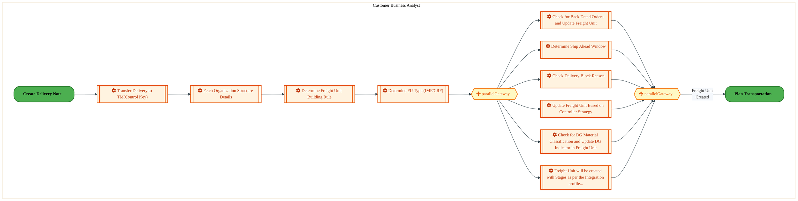
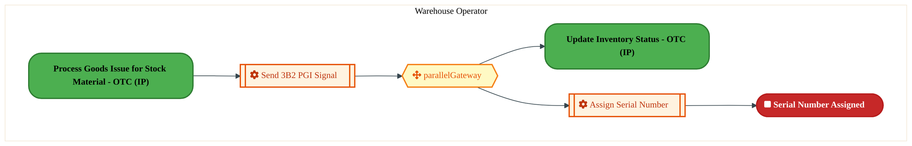
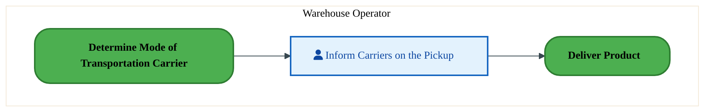
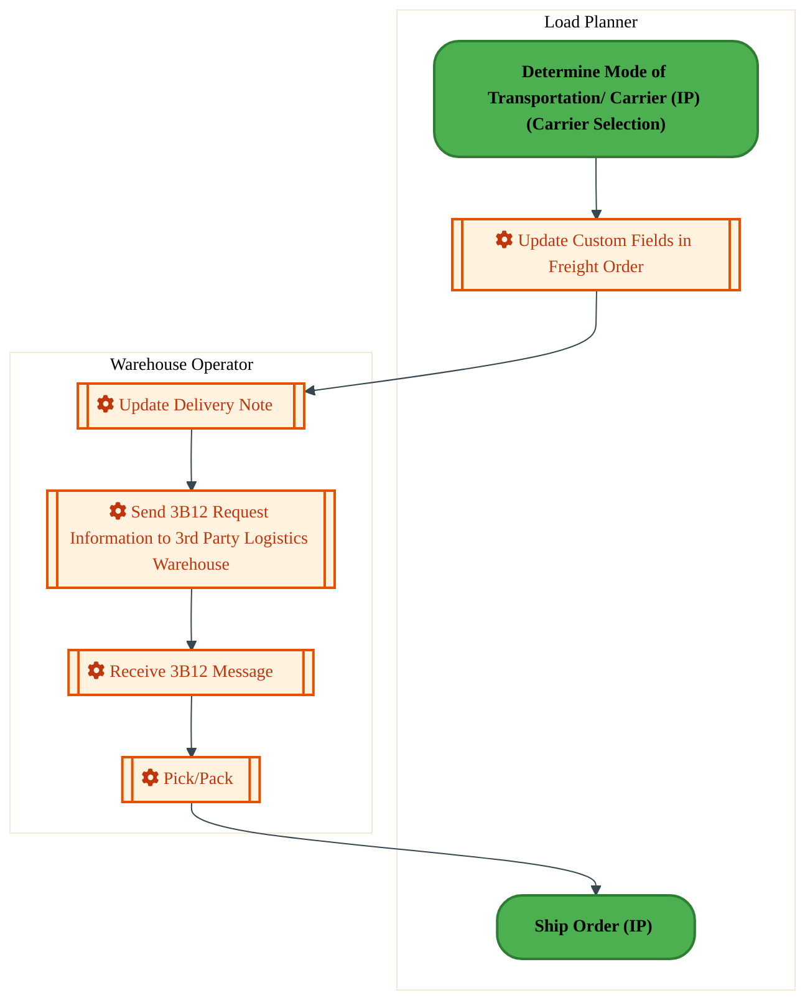

<div style="text-align:center; padding-top:20px;">
  
  <h1 style="font-size:36px; margin-top:24px;">LO-180 — Manage Outbound Transportation - OTC (IP)</h1>
  <h2 style="font-size:24px;">Architecture Document (TOGAF BDAT)</h2>
  <p style="font-size:18px; color:#555;">Order To Cash (IP) (OTC-IP) Tower<br/>
  Capability LO-180 · LO Logistics Management Outbound - OTC (IP)</p>
  <p style="font-size:14px; color:#888;">IAO Program · Release 3<br/>
  Generated: March 2026<br/>
  Sajiv Francis</p>
  <p style="font-size:12px; color:#aaa;">IAO Architecture Pipeline — Intel Confidential</p>
</div>

<style>
@media print {
  @page { margin: 0.75in; }
  .mermaid { page-break-inside: avoid; overflow: visible; }
  pre, table { page-break-inside: avoid; }
  h2, h3, h4 { page-break-after: avoid; }
}
.mermaid { overflow: visible; }
.mermaid svg { max-width: 100%; height: auto !important; }
.page-footer {
  padding-top: 8px;
  border-top: 1px solid #ddd;
  display: flex;
  justify-content: space-between;
  align-items: center;
  font-size: 11px;
  color: #888;
  position: fixed;
  bottom: 0;
  left: 0;
  right: 0;
  padding: 6px 20px;
  background: #fff;
}
@media print {
  .page-footer { position: fixed; bottom: 0; left: 0.75in; right: 0.75in; }
}
.page-footer a { color: #00aeef; text-decoration: none; font-weight: 500; }
.page-footer a:hover { color: #0071c5; text-decoration: underline; }
</style>

<div class="page-footer"><span>Page 1</span><span><a href="#toc">↑ Back to TOC</a></span><span>LO-180 — Manage Outbound Transportation - OTC (IP)</span></div>
<div style="page-break-before: always;"></div>

<a id="toc"></a>

## Table of Contents

1. [Executive Summary](#1-executive-summary)
2. [Business Context & Objectives](#2-business-context--objectives)
   - 2.1 [Classification](#21-classification)
   - 2.2 [Business Drivers](#22-business-drivers)
   - 2.3 [Success Criteria](#23-success-criteria)
   - 2.4 [Companion Documents](#24-companion-documents)
3. [Business Architecture (TOGAF "B")](#3-business-architecture-togaf-b)
   - 3.1 [Business Process Overview](#31-business-process-overview)
   - 3.2 [Business Process Diagrams](#32-business-process-diagrams)
   - 3.3 [Business Roles & Responsibilities](#33-business-roles--responsibilities)
4. [Data Architecture (TOGAF "D")](#4-data-architecture-togaf-d)
   - 4.1 [Data Entities & Ownership](#41-data-entities--ownership)
   - 4.2 [Data Flow Diagrams](#42-data-flow-diagrams)
   - 4.3 [Data Lineage](#43-data-lineage)
   - 4.4 [RICEFW Data Objects](#44-ricefw-data-objects)
   - 4.5 [Data Governance & Quality](#45-data-governance--quality)
5. [Application Architecture (TOGAF "A")](#5-application-architecture-togaf-a)
   - 5.1 [Current-State Application Landscape](#51-current-state--current-state-application-landscape)
   - 5.2 [Future-State Application Landscape](#52-future-state--future-state-application-landscape)
   - 5.3 [Change Impact Summary](#53-change-impact-summary)
   - 5.4 [Component Overview](#54-component-overview)
   - 5.5 [RICEFW Inventory](#55-ricefw-inventory)
   - 5.6 [Integration Patterns](#56-integration-patterns)
6. [Technology Architecture (TOGAF "T")](#6-technology-architecture-togaf-t)
   - 6.1 [Platform & Infrastructure](#61-platform--infrastructure)
   - 6.2 [SAP Development Object Status](#62-sap-development-object-status)
   - 6.3 [NFRs & Design Principles](#63-nfrs--design-principles)
   - 6.4 [Security & Governance](#64-security--governance)
7. [Project Context](#7-project-context)
   - 7.1 [Project Roadmap & Go-Live Plan](#71-project-roadmap--go-live-plan)
   - 7.2 [RAID Log](#72-raid-log)
   - 7.3 [Recommendations & Next Steps](#73-recommendations--next-steps)

<div class="page-footer"><span>Page 2</span><span><a href="#toc">↑ Back to TOC</a></span><span>LO-180 — Manage Outbound Transportation - OTC (IP)</span></div>
<div style="page-break-before: always;"></div>

## 1. Executive Summary

This Architecture Document defines the **Business, Data, Application, and Technology** (BDAT) architecture for **LO-180 Manage Outbound Transportation - OTC (IP)** within the IAO program. It includes 10 BPMN process diagram(s) in Section 3.
| Dimension | Value |
|-----------|-------|
| **Tower** | Order To Cash (IP) (OTC-IP) |
| **Process Group** | LO Logistics Management Outbound - OTC (IP) |
| **Capability** | LO-180 - Manage Outbound Transportation - OTC (IP) |
| **Release** | Release 3 |
| **Total Systems** | 0 |
| **System Status** | 0 Deployed, 0 Developing, 0 EOL, 0 Pending IAPM |
| **RICEFW Objects** | 4 Reports, 12 Interfaces, 18 Enhancements, 9 Forms |
**Change Summary**: 0 new flow chains, 0 removed, 0 modified, 0 unchanged between Current-State and Future-State states.

> All system nodes in architecture diagrams are **IAPM-linked** — click any node to open its IAPM page. Diagrams require `securityLevel: 'loose'` for click events.

<div class="page-footer"><span>Page 3</span><span><a href="#toc">↑ Back to TOC</a></span><span>LO-180 — Manage Outbound Transportation - OTC (IP)</span></div>
<div style="page-break-before: always;"></div>

## 2. Business Context & Objectives

### 2.1 Classification

| Level | Value |
|-------|-------|
| **L0 Tower** | Order To Cash (IP) |
| **L1 Process** | LO Logistics Management Outbound - OTC (IP) |
| **L2 Capability** | LO-180 - Manage Outbound Transportation - OTC (IP) |

### 2.2 Business Drivers

| # | Driver | Description | Strategic Alignment | Priority |
|---|--------|-------------|---------------------|----------|
| 1 | IP Order Management Transformation | Transform Intel Products order management onto S/4 HANA with integrated pricing and ATP | IDM 2.0 Products Revenue | High |
| 2 | Customer Experience Improvement | Reduce order processing time and improve order visibility for IP customers | Customer Centricity | High |
| 3 | Returns & Rebate Automation | Automate returns processing, rebate management, and chargeback handling | Revenue Assurance | Medium |
| 4 | LO-180 Process Migration | Migrate Manage Outbound Transportation - OTC (IP) business processes and 0 integrated systems from legacy to S/4 HANA target architecture | IDM 2.0 Order Management (Intel Products) | High |

<div class="page-footer"><span>Page 4</span><span><a href="#toc">↑ Back to TOC</a></span><span>LO-180 — Manage Outbound Transportation - OTC (IP)</span></div>
<div style="page-break-before: always;"></div>

### 2.3 Success Criteria

| Metric | Target | Measure | Baseline | Owner |
|--------|--------|---------|----------|-------|
| Order Processing Time | < 2 hours | Time from order receipt to order confirmation | 6 hours (current) | Order Management Lead |
| Customer Credit Decision Time | < 15 minutes | Automated credit check and approval for standard orders | 2 hours (manual) | Credit Manager |
| Returns Processing Cycle | < 3 business days | End-to-end returns receipt to credit memo issuance | 7 business days (current) | Returns Manager |
| LO-180 Migration Completeness | 100% flow chains validated | All 0 flow chains verified in target state | 0% (pre-migration) | Tower Architect |

### 2.4 Companion Documents

| Document | Description |
|----------|-------------|
| **Business Architecture** | Included in this document (Section 3) — process flows from BPMN diagrams |
| **This Document** | Full BDAT Architecture — Business + Data + Application + Technology |

<div class="page-footer"><span>Page 5</span><span><a href="#toc">↑ Back to TOC</a></span><span>LO-180 — Manage Outbound Transportation - OTC (IP)</span></div>
<div style="page-break-before: always;"></div>

## 3. Business Architecture (TOGAF "B")

### 3.1 Business Process Overview

This capability includes **10 business process(es)** modeled in BPMN 2.0, covering the end-to-end workflow for LO-180 Manage Outbound Transportation - OTC (IP).

| # | Step ID | Process Name | Lanes | Tasks | Gateways |
|---|---------|--------------|-------|-------|----------|
| 1 | LO-180-010_Process_Delivery_of_Line_Items_-_OTC_(IP) | LO-180-010_Process_Delivery_of_Line_Items_-_OTC_(IP) | Customer Business Analyst | 10 | 2 |
| 2 | LO-180-050_Prepare_Delivery_Schedule_for_Non-orders_-_OTC_(IP) | LO-180-050_Prepare_Delivery_Schedule_for_Non-orders_-_OTC_(IP) | Divisional Planner, Transportation Manager (Transportation Management), Warehouse Operator | 5 | 2 |
| 3 | LO-180-060_Assign_Warranty_-_OTC_(IP) | LO-180-060_Assign_Warranty_-_OTC_(IP) | Warehouse Operator | 2 | 1 |
| 4 | LO-180-070_Plan_Transportation_-_OTC_(IP) | LO-180-070_Plan_Transportation_-_OTC_(IP) | Functional Analyst | 4 | 2 |
| 5 | LO-180-110_Schedule_Carrier_for_Product_Shipping_-_OTC_(IP) | LO-180-110_Schedule_Carrier_for_Product_Shipping_-_OTC_(IP) | Warehouse Operator | 1 | 0 |
| 6 | LO-180-120_Schedule_Shipping_Labor_-_OTC_(IP) | LO-180-120_Schedule_Shipping_Labor_-_OTC_(IP) | Transportation Planner (Supply Chain for Secondary Distribution), Warehouse Operator | 6 | 1 |
| 7 | LO-180-130_Coordinate_Transportation_-_OTC_(IP) | LO-180-130_Coordinate_Transportation_-_OTC_(IP) | Functional Analyst, Load Planner | 14 | 4 |
| 8 | LO-180-140_Record_Transportation_Information_-_OTC_(IP) | LO-180-140_Record_Transportation_Information_-_OTC_(IP) | Load Planner, Warehouse Operator | 5 | 0 |
| 9 | LO-180-150_Generate_Shipping_Documentation_-_OTC_(IP) | LO-180-150_Generate_Shipping_Documentation_-_OTC_(IP) | Load Planner, Warehouse Operator | 8 | 5 |
| 10 | LO-180-170_Create_Delivery_Note_-_OTC_(IP) | LO-180-170_Create_Delivery_Note_-_OTC_(IP) | CBA Business Manager, Transportation Manager (Transportation Management), Warehouse Operator | 14 | 12 |

### 3.2 Business Process Diagrams

<div class="page-footer"><span>Page 6</span><span><a href="#toc">↑ Back to TOC</a></span><span>LO-180 — Manage Outbound Transportation - OTC (IP)</span></div>
<div style="page-break-before: always;"></div>

#### BUSINESS ARCHITECTURE — 3.2.1 LO-180-010_Process_Delivery_of_Line_Items_-_OTC_(IP) — LO-180-010_Process_Delivery_of_Line_Items_-_OTC_(IP)

**Swim Lanes**: Customer Business Analyst | **Tasks**: 10 | **Gateways**: 2

> **Legend**: <span style="color:#000;background:#4CAF50;padding:2px 6px;border-radius:10px;font-weight:bold;font-size:9pt">● Start</span> · <span style="color:#fff;background:#C62828;padding:2px 6px;border-radius:10px;font-weight:bold;font-size:9pt">● End</span> · <span style="background:#E3F2FD;padding:2px 6px;border:1px solid #1565C0;font-size:9pt">User Task</span> · <span style="background:#FFF3E0;padding:2px 6px;border:1px solid #E65100;font-size:9pt">Service Task</span> · <span style="background:#FFF9C4;padding:2px 6px;border:1px solid #F57F17;font-size:9pt">◇ Gateway</span> · <span style="background:#F3E5F5;padding:2px 6px;border:1px solid #7B1FA2;font-size:9pt">Sub-Process</span>



<div style="text-align:center; margin:4px 0 8px 0; font-size:11px;"><a href="https://mermaid.live/view#pako:eNqlVltv2zYU_iuEgsAdIGe6Wo4eBtiyVQRdtiJO1oe6D7RE2URoUiDpOK7r_76ji29cNWCYHgx_5_KdG3mkvZWJnFixdXu7p5zqGO17ekXWpBej3gIr0rNRI_gLS4oXjKheZVMIrmf0e23mBuV7ZVbJUrymbFdJZ2QpCHp5sNEIHJmNFOaqr4ikRc_ulZKusdwlgglZWd-QYeEUdbRWNRYyJ_Js4DiRm4XgyignZ7EfBVGQVn6KZILnV6RFWAyLrHeokmNim62w1HX6G0Ue8fsXmusV4AIzRcBmpdfsd7wgrKpRy00lyzby7dgMqqo4HBo2K3FG-RLkgQMiifnrWRQ6hwM63N7O-Skoep7MOYInY1ipCSmQ0iCevmlUUMbimyAZpaFjKy3FK4lvvGk08T07qyqJoXTHrprb3xK6XOl4IVjemva3VQ2xV77b8j32HFvu4NeIRXh-jpQMvKE3PEUaR27iJsdIRVH8r0jQV_mM1Wsba-qnXjo5xXLDQZg4_-Q7ljkJopFr9onIN5qRC9I0Tf3puVXTQeg63aTj1B84iUG6xJps8e5MeJ8EJ8I0jFI36iRs4plZbhafpciOhP40TMMTYTR205HXSRiM3GDYZgg8S4nLFUo2Sos1kWi8UXDelUIjjtlO6cauerj79evcKnBc4H4mlugZTqEqwGVCGH0jcoe0QM-PHxKYpxQMfSK7X-bWt28XDN41Q0p0tkJ_yiXm9DvWVHA0g2uQ6Y0kwKoxZcpg8K8ZwIjINSSMUlmfIPQCSwWKoCyHy4GeNowYDEEnwwt63pUEfXh4TH9NnlIz-fDaMVmRDI6IgJZh-DOBEedQC-wQhTDP0UuZg-gqL4Nw0JXJbEVLNFoRnKMvlOdiazhGP8vkNIUxEwCfCFaCG47Da8efpAjFKKgDJtGOkcGAYShgt9wZbPddDZl8RI_gUK1hlFRHlhY0a-Z70RmweuB5pQAXyv-tU65jHJzLjLdwB9CCoEySegZbqleQMl4SGIRCJRQALxSIBSXIJotSCrg55O7uzgzkQpzPDPPmdJdC6toDzC6tPLBK6nDntv8hNDHM_P3-mDWWUmxVHzONSiwxtJV9bJbC3DocLp2C_-YEu7b5w13U7_8Gd6yFXgP9FvoNDI7GLR4YODJw2OKwge7Rf2DgyMBDA7ttOu265UELfSPefYvvTf_a4cfcujolvBlCPrd-VLMzuIYGdp2jwLlmr9dq1cCL5X-l8To1fqcm6NSEnZpBpybq1Aw7NfedGmhAp8o9fSpcy70OuX98u12Lg6PYsi14r6wxza14b9WfdvD5l5MCb5i2DraFN1rMdjyz4voTyNrU62FCMdzWdSM8_A1W0DgV" title="View Full Diagram">&#128065; View Full Diagram</a></div>

<div class="page-footer"><span>Page 7</span><span><a href="#toc">↑ Back to TOC</a></span><span>LO-180 — Manage Outbound Transportation - OTC (IP)</span></div>
<div style="page-break-before: always;"></div>

#### BUSINESS ARCHITECTURE — 3.2.2 LO-180-050_Prepare_Delivery_Schedule_for_Non-orders_-_OTC_(IP) — LO-180-050_Prepare_Delivery_Schedule_for_Non-orders_-_OTC_(IP)

**Swim Lanes**: Divisional Planner · Transportation Manager (Transportation Management) · Warehouse Operator | **Tasks**: 5 | **Gateways**: 2

> **Legend**: <span style="color:#000;background:#4CAF50;padding:2px 6px;border-radius:10px;font-weight:bold;font-size:9pt">● Start</span> · <span style="color:#fff;background:#C62828;padding:2px 6px;border-radius:10px;font-weight:bold;font-size:9pt">● End</span> · <span style="background:#E3F2FD;padding:2px 6px;border:1px solid #1565C0;font-size:9pt">User Task</span> · <span style="background:#FFF3E0;padding:2px 6px;border:1px solid #E65100;font-size:9pt">Service Task</span> · <span style="background:#FFF9C4;padding:2px 6px;border:1px solid #F57F17;font-size:9pt">◇ Gateway</span> · <span style="background:#F3E5F5;padding:2px 6px;border:1px solid #7B1FA2;font-size:9pt">Sub-Process</span>

```mermaid
%%{init: {'theme': 'base', 'themeVariables': {'fontSize': '14px', 'fontFamily': 'Segoe UI, Arial, sans-serif','primaryColor': '#e8f0fe', 'primaryBorderColor': '#0071c5','lineColor': '#37474F', 'secondaryColor': '#f5f8fc'}, 'flowchart': {'useMaxWidth': false, 'htmlLabels': true, 'curve': 'basis', 'nodeSpacing': 40, 'rankSpacing': 50}} }%%
flowchart TD
    classDef startEvt fill:#4CAF50,stroke:#2E7D32,color:#000,font-weight:bold,stroke-width:2px,rx:20,ry:20
    classDef endEvt fill:#C62828,stroke:#B71C1C,color:#fff,font-weight:bold,stroke-width:2px,rx:20,ry:20
    classDef userTask fill:#E3F2FD,stroke:#1565C0,stroke-width:2px,color:#0D47A1
    classDef serviceTask fill:#FFF3E0,stroke:#E65100,stroke-width:2px,color:#BF360C
    classDef gateway fill:#FFF9C4,stroke:#F57F17,stroke-width:2px,color:#E65100
    classDef subProc fill:#F3E5F5,stroke:#7B1FA2,stroke-width:2px,color:#4A148C
    subgraph Divisional Planner
        n1["fa:fa-user Create ISM Number"]
        n3[["fa:fa-cog Create Delivery"]]
        n6(["fa:fa-play Delivery Creation Initiated for Non-Orders in ISM"])
    end
    subgraph Transportation Manager (Transportation Management)
        n5[["fa:fa-cog Update Freight Order (FO)"]]
        n10[["fa:fa-folder-open Process Delivery of Line Items (IP)"]]
    end
    subgraph Warehouse Operator
        n2["fa:fa-user Pick / Pack"]
        n4[["fa:fa-cog Update Delivery"]]
        n7["Generate Shipping Documentation (IP)"]
        n8{{"fa:fa-code-branch exclusiveGateway"}}
        n9{{"fa:fa-code-branch FU Updates Required?"}}
    end
    n8 --> n4
    n2 --> n7
    n6 --> n1
    n5 --> n8
    n10 --> n5
    n1 --> n3
    n3 --> n9
    n9 -->|"No"| n8
    n4 --> n2
    n9 -->|"Yes"| n10
    class n1 userTask
    class n2 userTask
    class n3 serviceTask
    class n4 serviceTask
    class n5 serviceTask
    class n6 startEvt
    class n7 startEvt
    class n8 gateway
    class n9 gateway
    class n10 subProc
```

<div style="text-align:center; margin:4px 0 8px 0; font-size:11px;"><a href="https://mermaid.live/view#pako:eNqlVV2P2jgU_StWRiNmpKDNJ4E8bMUAqZA6M6jMbLUq-2CSG7BI7NROGCjlv9cmgQQKT8sD0j0-95x7r2N7p4UsAs3X7u93hJLcR7tWvoQUWj5qzbGAlo5K4B_MCZ4nIFqKEzOaT8nPA810so2iKSzAKUm2Cp3CggF6H-uoLxMTHQlMRVsAJ3FLb2WcpJhvByxhXLHvoBsb8cGtWnpiPAJeEwzDM0NXpiaEQg3bnuM5gcoTEDIanYnGbtyNw9ZeFZewj3CJeX4ovxDwjDffSJQvZRzjRIDkLPM0-YLnkKgec14oLCz4-jgMIpQPlQObZjgkdCFxx5AQx3RVQ66x36P9_f2MnkzR23BGkfyFCRZiCDESuYRH6xzFJEn8O2fQD1xDFzlnK_DvrJE3tC09VJ34snVDV8NtfwBZLHN_zpKoorY_VA--lW10vvEtQ-db-X_hBTSqnQYdq2t1T05PnjkwB0enOI7_l5OcK3_DYlV5jezACoYnL9PtuAPjT71jm0PH65uXcwK-JiE0RIMgsEf1qEYd1zRuiz4FdscYXIgucA4feFsL9gbOSTBwvcD0bgqWfpdVFvMJZ-FR0B65gXsS9J7MoG_dFHT6ptOtKpQ6C46zJRqSNRGEUZygSYIpBV4S1I-a32dajP0Yt9W80YCD7AeNp8_opUjnkqr912Db30_0kC2O7CEkZA18K7lNcufhRM4SOaEjrUyTBaGxvCWIVIhQzDh6YbT9qg6qQISqEqTeY6knv7qLpt7kOREZ43mp9IwpXsj6H67iKdD8sVGZe97GexapNgJ--FDRoQb0ELw-XjRkGnVeLL9m4G2WAUVqu0CIukEWoy_yZkHjHFKBHsaThtKfrXzDHJZMjh-9ZsBxzpr7Y53vz4SEK_QXmuBwdb4zztWWbuyMJ7mfgSozQNMlyTJ526AhCws1qXJyVdWNrO5uV1tE0J7LUYdLBJswKYS0-VyehJm23zeyetezgveqRoG-wo-CcIg-1ZmnIdEuarf_lu1VoVWGXhV2yrA66NQtw24VmkYZu8e4DO0qtMuwV4U9Ff6aaS9spv2qRZySZV2w_gVxoJnN46ssjtfWGWxdh-3mlXS24txccW-udE4PwRnsXYe7x5vrDO1dReUgq1tJ07UUeIpJpPk77fCYywc_ghgXSa7tdQ0XOZtuaaj5h0dPKw6bPCRYfutpCe5_A4xWlx4=" title="View Full Diagram">&#128065; View Full Diagram</a></div>

#### BUSINESS ARCHITECTURE — 3.2.3 LO-180-060_Assign_Warranty_-_OTC_(IP) — LO-180-060_Assign_Warranty_-_OTC_(IP)

**Swim Lanes**: Warehouse Operator | **Tasks**: 2 | **Gateways**: 1

> **Legend**: <span style="color:#000;background:#4CAF50;padding:2px 6px;border-radius:10px;font-weight:bold;font-size:9pt">● Start</span> · <span style="color:#fff;background:#C62828;padding:2px 6px;border-radius:10px;font-weight:bold;font-size:9pt">● End</span> · <span style="background:#E3F2FD;padding:2px 6px;border:1px solid #1565C0;font-size:9pt">User Task</span> · <span style="background:#FFF3E0;padding:2px 6px;border:1px solid #E65100;font-size:9pt">Service Task</span> · <span style="background:#FFF9C4;padding:2px 6px;border:1px solid #F57F17;font-size:9pt">◇ Gateway</span> · <span style="background:#F3E5F5;padding:2px 6px;border:1px solid #7B1FA2;font-size:9pt">Sub-Process</span>



<div style="text-align:center; margin:4px 0 8px 0; font-size:11px;"><a href="https://mermaid.live/view#pako:eNqlVE1v4jAU_CtWKkQrJVI-CZvDShBIhbTdVqLdHkoPJrHBwtiR7RRYxH9fm4TPXU6bA-KN38w8TxxvrZwXyEqsVmtLGFEJ2LbVHC1ROwHtKZSobYMa-AUFgVOKZNv0YM7UmPzet3lhuTZtBsvgktCNQcdoxhF4G9mgp4nUBhIy6UgkCG7b7VKQJRSblFMuTPcd6mIX792apT4XBRKnBteNvTzSVEoYOsFBHMZhZngS5ZwVF6I4wl2ct3dmOMpX-RwKtR-_kugJrt9Joea6xpBKpHvmakl_wCmiZo9KVAbLK_F1CINI48N0YOMS5oTNNB66GhKQLU5Q5O52YNdqTdjRFLwOJgzoJ6dQygHCQCoND78UwITS5C5Me1nk2lIJvkDJnT-MB4Fv52Ynid66a5twnRUis7lKppwWTauzMntI_HJti3Xiu7bY6N8rL8SKk1Pa8bt-9-jUj73USw9OGOP_ctK5ilcoF43XMMj8bHD08qJOlLp_6x22OQjjnnedExJfJEdnolmWBcNTVMNO5Lm3RftZ0HHTK9EZVGgFNyfBb2l4FMyiOPPim4K13_WU1fRF8PwgGAyjLDoKxn0v6_k3BcOeF3abCbXOTMByDt6hQHOu4wTPJRJQcVE3mId5Hx8TC8MEQyfnMzDW7xcEfR-8PI7AmMwYpBPr8_OM4F8SelLqLs0zHyb4WS2nSFwxgvsjQypeXvY2AqjQpIczUqg5b2WhwwUj9oWYnnoDxgqqSgIHPL-m4H708qBJZ5xIc0x0SErwyHkhwUjKCgHMhabyfAGetN7e_JZEZ7s9zAqF4CvpQKpACQWkFNHH-l1PrN2u5ui06j8sAo7zXcfZlF5ddpqyU5fhZek3pV-XwdlBMApnx_Vixb-5EjSf5wUYHu-HCzj6N9w5HGjLtpZILCEprGRr7a9tfbUXCMOKKmtnW7BSfLxhuZXsrzer2r-tAYH61C1rcPcHtTjtXQ==" title="View Full Diagram">&#128065; View Full Diagram</a></div>

<div class="page-footer"><span>Page 8</span><span><a href="#toc">↑ Back to TOC</a></span><span>LO-180 — Manage Outbound Transportation - OTC (IP)</span></div>
<div style="page-break-before: always;"></div>

#### BUSINESS ARCHITECTURE — 3.2.4 LO-180-070_Plan_Transportation_-_OTC_(IP) — LO-180-070_Plan_Transportation_-_OTC_(IP)

**Swim Lanes**: Functional Analyst | **Tasks**: 4 | **Gateways**: 2

> **Legend**: <span style="color:#000;background:#4CAF50;padding:2px 6px;border-radius:10px;font-weight:bold;font-size:9pt">● Start</span> · <span style="color:#fff;background:#C62828;padding:2px 6px;border-radius:10px;font-weight:bold;font-size:9pt">● End</span> · <span style="background:#E3F2FD;padding:2px 6px;border:1px solid #1565C0;font-size:9pt">User Task</span> · <span style="background:#FFF3E0;padding:2px 6px;border:1px solid #E65100;font-size:9pt">Service Task</span> · <span style="background:#FFF9C4;padding:2px 6px;border:1px solid #F57F17;font-size:9pt">◇ Gateway</span> · <span style="background:#F3E5F5;padding:2px 6px;border:1px solid #7B1FA2;font-size:9pt">Sub-Process</span>


<div style="text-align:center; margin:4px 0 8px 0; font-size:11px;"><a href="https://mermaid.live/view#pako:eNqlVV2PozYU_SsWo1F2JVLxGSgPlTIkrFbqqqtmuvvQ9MGB68QaYyPbTCYb5b_XDpAMs5OHqkhBOcf3nnPvBZujU4oKnMy5vz9STnWGjhO9gxomGZpssIKJizriG5YUbxioiY0hgusV_XEO86PmxYZZrsA1ZQfLrmArAP312UVzk8hcpDBXUwWSkok7aSStsTzkgglpo-8gJR45u_VLD0JWIK8Bnpf4ZWxSGeVwpcMkSqLC5ikoBa9GoiQmKSknJ1scE_tyh6U-l98q-IJfvtNK7wwmmCkwMTtds9_xBpjtUcvWcmUrn4dhUGV9uBnYqsEl5VvDR56hJOZPVyr2Tid0ur9f84spelysOTJXybBSCyBIaUMvnzUilLHsLsrnRey5SkvxBNldsEwWYeCWtpPMtO65drjTPdDtTmcbwao-dLq3PWRB8-LKlyzwXHkw9zdewKurUz4L0iC9OD0kfu7ngxMh5H85mbnKR6yeeq9lWATF4uLlx7M4937WG9pcRMncfzsnkM-0hFeiRVGEy-uolrPY926LPhThzMvfiG6xhj0-XAV_zaOLYBEnhZ_cFOz83lbZbr5KUQ6C4TIu4otg8uAX8-CmYDT3o7Sv0OhsJW52qGh5qangmKG5uR2U7gLsxf2_1w7BGcFTO2-USzD9oBW1twZKSmiJVsDgrIBMYaYsWDv_vJIIxhJfMOXa_NAnEGiutaSbVoMa54Q3ch5pDehPYKaI6mZydCN5XlV0aPRGavzhktsw89R-aq2bgCU-myOM2jqMwsdXEjOjkAtzolBuR_VoNqxqhNRd1oevDHNuNu8g6P7RaFqb400aM63NikJLXf7ycVxYcjwOhWEpxV5NMdOowRIzBuxT95KtndPpVU7633LM1u3-8BhNp7-ZZ99Dv4NJD5MOhmMYjGHUw6CDaQ-jMUw7OOthOFo9v_HWfdjpIzp4nw7fp6P36fhyNo7o2ft0MmzmEZsOrOM6Ncga08rJjs75Q2Y-dhUQ3DLtnFwHt1qsDrx0svOB77RNZTIXFJt9WHfk6V-yeEmg" title="View Full Diagram">&#128065; View Full Diagram</a></div>

#### BUSINESS ARCHITECTURE — 3.2.5 LO-180-110_Schedule_Carrier_for_Product_Shipping_-_OTC_(IP) — LO-180-110_Schedule_Carrier_for_Product_Shipping_-_OTC_(IP)

**Swim Lanes**: Warehouse Operator | **Tasks**: 1 | **Gateways**: 0

> **Legend**: <span style="color:#000;background:#4CAF50;padding:2px 6px;border-radius:10px;font-weight:bold;font-size:9pt">● Start</span> · <span style="color:#fff;background:#C62828;padding:2px 6px;border-radius:10px;font-weight:bold;font-size:9pt">● End</span> · <span style="background:#E3F2FD;padding:2px 6px;border:1px solid #1565C0;font-size:9pt">User Task</span> · <span style="background:#FFF3E0;padding:2px 6px;border:1px solid #E65100;font-size:9pt">Service Task</span> · <span style="background:#FFF9C4;padding:2px 6px;border:1px solid #F57F17;font-size:9pt">◇ Gateway</span> · <span style="background:#F3E5F5;padding:2px 6px;border:1px solid #7B1FA2;font-size:9pt">Sub-Process</span>



<div style="text-align:center; margin:4px 0 8px 0; font-size:11px;"><a href="https://mermaid.live/view#pako:eNqlVMuOmzAU_RWLUcSGSDxDyqJSAkEaqaOOlGln0XThGDtYMTayTR6N8u-18yCTVLMqC4QP555z78Hm4CBRYSdzBoMD5VRn4ODqGjfYzYC7hAq7HjgDP6GkcMmwci2HCK7n9M-JFsTtztIsVsKGsr1F53glMPjx7IGJKWQeUJCrocKSEtdzW0kbKPe5YEJa9hMeE5-c3C6vpkJWWN4Ivp8GKDGljHJ8g6M0TuPS1imMBK_uRElCxgS5R9scE1tUQ6lP7XcKv8DdO610bdYEMoUNp9YN-waXmNkZtewshjq5uYZBlfXhJrB5CxHlK4PHvoEk5OsblPjHIzgOBgvem4K3YsGBuRCDShWYAKUNPNtoQChj2VOcT8rE95SWYo2zp3CWFlHoITtJZkb3PRvucIvpqtbZUrDqQh1u7QxZ2O48uctC35N7c3_wwry6OeWjcByOe6dpGuRBfnUihPyXk8lVvkG1vnjNojIsi94rSEZJ7v-rdx2ziNNJ8JgTlhuK8AfRsiyj2S2q2SgJ_M9Fp2U08vMH0RXUeAv3N8EvedwLlklaBumngme_xy675asU6CoYzZIy6QXTaVBOwk8F40kQjy8dGp2VhG0N3qHEtTBxgu8tllALeSbYiwe_Fg6BGYFDmzd45kTIBuRQSoqlAoIDc2LBK0Xrrl04vz9UhqaywIxuTJlpuOqQvidEJ4LGsjGnDLyYrQ4EAW9mg6tWSA01NeoXp77S7K_zA4_AcPjVNHhZBudl-CEtC153yR0c9kfiDo562PGcxvQFaeVkB-f0TzL_rQoT2DHtHD0HdlrM9xw52ensOl1bme9cUGgibc7g8S8TFJeS" title="View Full Diagram">&#128065; View Full Diagram</a></div>

<div class="page-footer"><span>Page 9</span><span><a href="#toc">↑ Back to TOC</a></span><span>LO-180 — Manage Outbound Transportation - OTC (IP)</span></div>
<div style="page-break-before: always;"></div>

#### BUSINESS ARCHITECTURE — 3.2.6 LO-180-120_Schedule_Shipping_Labor_-_OTC_(IP) — LO-180-120_Schedule_Shipping_Labor_-_OTC_(IP)

**Swim Lanes**: Transportation Planner (Supply Chain for Secondary Distribution) · Warehouse Operator | **Tasks**: 6 | **Gateways**: 1

> **Legend**: <span style="color:#000;background:#4CAF50;padding:2px 6px;border-radius:10px;font-weight:bold;font-size:9pt">● Start</span> · <span style="color:#fff;background:#C62828;padding:2px 6px;border-radius:10px;font-weight:bold;font-size:9pt">● End</span> · <span style="background:#E3F2FD;padding:2px 6px;border:1px solid #1565C0;font-size:9pt">User Task</span> · <span style="background:#FFF3E0;padding:2px 6px;border:1px solid #E65100;font-size:9pt">Service Task</span> · <span style="background:#FFF9C4;padding:2px 6px;border:1px solid #F57F17;font-size:9pt">◇ Gateway</span> · <span style="background:#F3E5F5;padding:2px 6px;border:1px solid #7B1FA2;font-size:9pt">Sub-Process</span>

```mermaid
%%{init: {'theme': 'base', 'themeVariables': {'fontSize': '14px', 'fontFamily': 'Segoe UI, Arial, sans-serif','primaryColor': '#e8f0fe', 'primaryBorderColor': '#0071c5','lineColor': '#37474F', 'secondaryColor': '#f5f8fc'}, 'flowchart': {'useMaxWidth': false, 'htmlLabels': true, 'curve': 'basis', 'nodeSpacing': 40, 'rankSpacing': 50}} }%%
flowchart TD
    classDef startEvt fill:#4CAF50,stroke:#2E7D32,color:#000,font-weight:bold,stroke-width:2px,rx:20,ry:20
    classDef endEvt fill:#C62828,stroke:#B71C1C,color:#fff,font-weight:bold,stroke-width:2px,rx:20,ry:20
    classDef userTask fill:#E3F2FD,stroke:#1565C0,stroke-width:2px,color:#0D47A1
    classDef serviceTask fill:#FFF3E0,stroke:#E65100,stroke-width:2px,color:#BF360C
    classDef gateway fill:#FFF9C4,stroke:#F57F17,stroke-width:2px,color:#E65100
    classDef subProc fill:#F3E5F5,stroke:#7B1FA2,stroke-width:2px,color:#4A148C
    subgraph Transportation Planner (Supply Chain for Secondary Distribution)
        n5[["fa:fa-cog Check if Freight Order (FO) is Created or Not"]]
        n8["Process Delivery of Line Items (IP)"]
        n9["Create Delivery Note (Forward) (IP)"]
        n10{{"fa:fa-code-branch Freight Order (FO) is Created or Not?"}}
    end
    subgraph Warehouse Operator
        n1["fa:fa-user Receive 3B12 Request"]
        n2["fa:fa-user Schedule Shipping Labour"]
        n3["fa:fa-user Ship Order"]
        n4["fa:fa-user Pick / Pack Order"]
        n6[["fa:fa-cog Send 3B12 Request Information to 3rd Party Logistics Warehouse"]]
        n7(["fa:fa-stop Shipping Labor Scheduled"])
    end
    n5 --> n10
    n10 -->|"Yes"| n6
    n6 --> n1
    n2 --> n4
    n1 --> n2
    n3 --> n7
    n9 --> n5
    n10 -->|"No"| n8
    n4 --> n3
    class n1 userTask
    class n2 userTask
    class n3 userTask
    class n4 userTask
    class n5 serviceTask
    class n6 serviceTask
    class n7 endEvt
    class n8 startEvt
    class n9 startEvt
    class n10 gateway
```

<div style="text-align:center; margin:4px 0 8px 0; font-size:11px;"><a href="https://mermaid.live/view#pako:eNqlVdtu4zYQ_RVCQeAYkFFdLUcPLXwTECDdGHXaRbHeB1oaWURkUSWpOK7X_96hJV_kOkCB6sHGHM6cMzMckjsj5gkYoXF_v2MFUyHZdVQGa-iEpLOkEjomqYE_qGB0mYPsaJ-UF2rO_j642V75od00FtE1y7cancOKA_n9ySRDDMxNImkhexIESztmpxRsTcV2zHMutPcdDFIrPag1SyMuEhBnB8sK7NjH0JwVcIbdwAu8SMdJiHmRtEhTPx2kcWevk8v5Js6oUIf0Kwm_0o-vLFEZ2inNJaBPptb5M11CrmtUotJYXIn3YzOY1DoFNmxe0pgVK8Q9CyFBi7cz5Fv7Pdnf3y-Kkyh5nSwKgl-cUyknkBKpEJ6-K5KyPA_vvPEw8i1TKsHfILxzpsHEdcxYVxJi6Zapm9vbAFtlKlzyPGlcextdQ-iUH6b4CB3LFFv8vdKCIjkrjfvOwBmclEaBPbbHR6U0Tf-XEvZVvFL51mhN3ciJJict2-_7Y-vffMcyJ14wtK_7BOKdxXBBGkWROz23atr3betz0lHk9q3xFemKKtjQ7ZnwceydCCM_iOzgU8Ja7zrLajkTPD4SulM_8k-EwciOhs6nhN7Q9gZNhsizErTMyCuOlCy5UFQxXpBZTosCBHmYV2WZb8k4o6wgKRdkfpx6MmGowJaVDujWdPor_G_fFkZKw5T2Yr7CUIjfCEtJJA57TF70OSMP0UuXMEnGArA5CUHqL1wtjO_fL6gGyKTrBCnJBHL2DqjLU_KMR5I8KVhL8vA062LURdAjBtWs5xikBpTkYkNF0r0RZFu73TnrBHpLbEic_aekf1kY-33NhZN_1divVEDGcU7JSwmCKi4uVU-d0oNMfoMYMF_ijmwHjb8qkKqdptMOmMcZJFUOZJ6xssTbgOB1wivRDnKvgtC3rqft5rXdZgy37Scyo_h3w7vf3uU5Vt7KmzwVOC7repwUJ65IkEuoLXnmK5wcFstzb662PXg4cUvFy3Z156oTDOte9b3wSa_3s97PxrYtDfxYGH-CXBg_MPFmod84NqZTm94xrDadxnRrM2jMx9r0rzW-8IPEoMG92s29OLya-XhptWDnNuzehr3bsH95fbVW-p-uBM113QIHp_eiBT_ehrH-5oYzTGMNuOssMcKdcXjH8a1PIKVVroy9adBK8fm2iI3w8N4ZVZlg5IRRPC3rGtz_Ay2gk7s=" title="View Full Diagram">&#128065; View Full Diagram</a></div>

<div class="page-footer"><span>Page 10</span><span><a href="#toc">↑ Back to TOC</a></span><span>LO-180 — Manage Outbound Transportation - OTC (IP)</span></div>
<div style="page-break-before: always;"></div>

#### BUSINESS ARCHITECTURE — 3.2.7 LO-180-130_Coordinate_Transportation_-_OTC_(IP) — LO-180-130_Coordinate_Transportation_-_OTC_(IP)

**Swim Lanes**: Functional Analyst · Load Planner | **Tasks**: 14 | **Gateways**: 4

```mermaid
%%{init: {'theme': 'base', 'themeVariables': {'fontSize': '14px', 'fontFamily': 'Segoe UI, Arial, sans-serif','primaryColor': '#e8f0fe', 'primaryBorderColor': '#0071c5','lineColor': '#37474F', 'secondaryColor': '#f5f8fc'}, 'flowchart': {'useMaxWidth': false, 'htmlLabels': true, 'curve': 'basis', 'nodeSpacing': 40, 'rankSpacing': 50}} }%%
flowchart LR
    classDef startEvt fill:#4CAF50,stroke:#2E7D32,color:#000,font-weight:bold,stroke-width:2px,rx:20,ry:20
    classDef endEvt fill:#C62828,stroke:#B71C1C,color:#fff,font-weight:bold,stroke-width:2px,rx:20,ry:20
    classDef userTask fill:#E3F2FD,stroke:#1565C0,stroke-width:2px,color:#0D47A1
    classDef serviceTask fill:#FFF3E0,stroke:#E65100,stroke-width:2px,color:#BF360C
    classDef gateway fill:#FFF9C4,stroke:#F57F17,stroke-width:2px,color:#E65100
    classDef subProc fill:#F3E5F5,stroke:#7B1FA2,stroke-width:2px,color:#4A148C
    subgraph Functional Analyst
        n1["fa:fa-user Create Planning Profile"]
        n2["fa:fa-user Maintain Planning Profile Parameters"]
        n3["fa:fa-user Maintain Capacity Selection Profile"]
        n4["fa:fa-user Maintain Planning Cost settings"]
        n5["fa:fa-user Maintain Optimizer Settings"]
        n6["fa:fa-user Maintain Incompatibilities"]
        n7["fa:fa-user Maintain Carrier Selection Settings"]
        n8["fa:fa-user Update Purchase Organization"]
        n9["fa:fa-user Destination stage will be updated with Z3 Consignee"]
        n10["fa:fa-user Update Freight Order Based on Change Controller Strategy"]
        n11["fa:fa-user Determine Freight Order Type (IMF/CRF)"]
        n15["Determine Mode of Transportation Carrier (Carrier Selection)"]
        n16["Plan Transportation ( Selection Profile Settings)"]
        n17{{"fa:fa-arrows-alt parallelGateway"}}
        n18{{"fa:fa-arrows-alt parallelGateway"}}
        n19{{"fa:fa-arrows-alt parallelGateway"}}
        n20{{"fa:fa-arrows-alt parallelGateway"}}
    end
    subgraph Load Planner
        n12["fa:fa-user Manage Transportation Cockpit"]
        n13["fa:fa-user Check for Back Dated order and Customer Window in Freight Units for..."]
        n14["fa:fa-user Perform Consolidation"]
    end
    n17 --> n2
    n17 --> n3
    n17 --> n4
    n17 --> n6
    n17 --> n7
    n2 --> n18
    n3 --> n18
    n4 --> n18
    n6 --> n18
    n7 --> n18
    n16 --> n1
    n1 --> n17
    n18 --> n12
    n12 --> n13
    n19 --> n8
    n19 --> n10
    n10 --> n20
    n19 --> n9
    n8 --> n20
    n9 --> n20
    n20 --> n15
    n17 --> n5
    n5 --> n18
    n13 --> n14
    n11 --> n19
    n14 --> n11
    class n1 userTask
    class n2 userTask
    class n3 userTask
    class n4 userTask
    class n5 userTask
    class n6 userTask
    class n7 userTask
    class n8 userTask
    class n9 userTask
    class n10 userTask
    class n11 userTask
    class n12 userTask
    class n13 userTask
    class n14 userTask
    class n15 startEvt
    class n16 startEvt
    class n17 gateway
    class n18 gateway
    class n19 gateway
    class n20 gateway
```

> **Legend**: <span style="color:#000;background:#4CAF50;padding:2px 6px;border-radius:10px;font-weight:bold;font-size:9pt">● Start</span> · <span style="color:#fff;background:#C62828;padding:2px 6px;border-radius:10px;font-weight:bold;font-size:9pt">● End</span> · <span style="background:#E3F2FD;padding:2px 6px;border:1px solid #1565C0;font-size:9pt">User Task</span> · <span style="background:#FFF3E0;padding:2px 6px;border:1px solid #E65100;font-size:9pt">Service Task</span> · <span style="background:#FFF9C4;padding:2px 6px;border:1px solid #F57F17;font-size:9pt">◇ Gateway</span> · <span style="background:#F3E5F5;padding:2px 6px;border:1px solid #7B1FA2;font-size:9pt">Sub-Process</span>



<div style="text-align:center; margin:4px 0 8px 0; font-size:11px;"><a href="https://mermaid.live/view#pako:eNqlV2Fv4jgQ_StWVhU9CXpJSEjIh5NoaE6VWm21bW-lu94HkzhgNbEj25SyiP9-45BAcROdbg-pqPOYeTNvPB7Czkp5RqzIurjYUUZVhHYDtSIlGURosMCSDIboAPyBBcWLgsiB9sk5U4_0R-3meNW7dtNYgktabDX6SJacoOfbIZpBYDFEEjM5kkTQfDAcVIKWWGxjXnChvb-QMLfzOlvz0TUXGREnB9sOnNSH0IIycoLHgRd4iY6TJOUsOyPN_TzM08FeF1fwTbrCQtXlryW5x-_faaZWYOe4kAR8Vqos7vCCFFqjEmuNpWvx1jaDSp2HQcMeK5xStgTcswESmL2eIN_e79H-4uKFHZOiu28vDMErLbCUc5IjqQC-eVMop0URffHiWeLbQ6kEfyXRF_cmmI_dYaqVRCDdHurmjjaELlcqWvAia1xHG60hcqv3oXiPXHsotvBu5CIsO2WKJ27ohsdM14ETO3GbKc_z_5UJ-iqesHxtct2MEzeZH3M5_sSP7c98rcy5F8wcs09EvNGUfCBNkmR8c2rVzcR37H7S62Q8sWODdIkV2eDtiXAae0fCxA8SJ-glPOQzq1wvHgRPW8LxjZ_4R8Lg2klmbi-hN3O8sKkQeJYCVyuUrFmqKGe4QDN420p1cNAv5vz1YuU4yvFI9xvFgoAe9FBgxmACEVQCdZAX6-8PMe55zD2mTMHfpyj0gAUuiSJCnhOMewhirAdfbdEjKUhdc3cB3r8VEHOp4LiVAsPI7ffEfq0ULWELCUjeFTfpibtlKS8rrOiCFlRRYoQFvVKFoHWyVml32vA8_rnK6vNZC9gFkqCvYokZ_YE1w3ng9DxwTiSw1356XywJ2sB8oQVB65oyA1ut0J9j6B2TdMmI0XPH7qwkEfXthkJgw6JrqClDkCJeYQY5gAsmtSi0UCXAf7k1WB2zTJiWErayQfy0rQi6vL1Pfo2_Jb8YHPpIT4H3sFMRz9ETbFJZcaEOotuGX37qvEmnT1pPkslw-Xksj4dmcgS7XasL0vGNHOFCoQruAzSj-P2wM16s_f5jUPgzQdOfCHLt_xYES9_YKXccZ4frRsTHaj6tBqZHzTwKnr5WVBktM5ZCvCIprGmuhwr-mdczWn-PI8wyFK-l4iUY3ynL-AbBlWon5hmePaSOvLq6MnIYi-OBCHAr65HnBc3Or9FRNRwnGo1-g74Z9tiwPcOeGHbQ2O7BdMLGHhu2Z9gTww4M22kdWrsx23xO2ABHAW0FRwXTAxAatmO3gN20wDY8po0dGp9PDdttCBzfaEpr-6aotivHrray2pRO26ePX_RaffvocAa73fC4G_a6Yb8bnnTDQTccdsPTbhg634336HR6hDo9Sp0eqY5_fLA8xyc9eNA-C53DYTc87YRhShrYGlpwvUtMMyvaWfXPBvhpkZEcrwtl7YcWXiv-uGWpFdWP19bhe2xOMWyo8gDu_wEKvfIU" title="View Full Diagram">&#128065; View Full Diagram</a></div>

<div class="page-footer"><span>Page 11</span><span><a href="#toc">↑ Back to TOC</a></span><span>LO-180 — Manage Outbound Transportation - OTC (IP)</span></div>
<div style="page-break-before: always;"></div>

#### BUSINESS ARCHITECTURE — 3.2.8 LO-180-140_Record_Transportation_Information_-_OTC_(IP) — LO-180-140_Record_Transportation_Information_-_OTC_(IP)

**Swim Lanes**: Load Planner · Warehouse Operator | **Tasks**: 5 | **Gateways**: 0

> **Legend**: <span style="color:#000;background:#4CAF50;padding:2px 6px;border-radius:10px;font-weight:bold;font-size:9pt">● Start</span> · <span style="color:#fff;background:#C62828;padding:2px 6px;border-radius:10px;font-weight:bold;font-size:9pt">● End</span> · <span style="background:#E3F2FD;padding:2px 6px;border:1px solid #1565C0;font-size:9pt">User Task</span> · <span style="background:#FFF3E0;padding:2px 6px;border:1px solid #E65100;font-size:9pt">Service Task</span> · <span style="background:#FFF9C4;padding:2px 6px;border:1px solid #F57F17;font-size:9pt">◇ Gateway</span> · <span style="background:#F3E5F5;padding:2px 6px;border:1px solid #7B1FA2;font-size:9pt">Sub-Process</span>



<div style="text-align:center; margin:4px 0 8px 0; font-size:11px;"><a href="https://mermaid.live/view#pako:eNqlVduO0zAQ_RUrq1VBSkWuTckDUps20kosVHSBB5YH1xm3Vh072M7ullX_HadJr9An8hBpzpw5c_E4eXWILMBJndvbVyaYSdFrz6yghF6KegusoeeiFviGFcMLDrrXcKgUZs5-72h-VL00tAbLccn4pkHnsJSAvt65aGQDuYs0FrqvQTHac3uVYiVWm0xyqRr2DQypR3fZOtdYqgLUkeB5iU9iG8qZgCMcJlES5U2cBiJFcSZKYzqkpLdtiuPymaywMrvyaw33-OU7K8zK2hRzDZazMiX_iBfAmx6NqhuM1OppPwymmzzCDmxeYcLE0uKRZyGFxfoIxd52i7a3t4_ikBQ9TB4Fsg_hWOsJUKSNhadPBlHGeXoTZaM89lxtlFxDehNMk0kYuKTpJLWte24z3P4zsOXKpAvJi47af256SIPqxVUvaeC5amPfF7lAFMdM2SAYBsNDpnHiZ362z0Qp_a9Mdq7qAet1l2sa5kE-OeTy40GceX_r7ducRMnIv5wTqCdG4EQ0z_NwehzVdBD73nXRcR4OvOxCdIkNPOPNUfB9Fh0E8zjJ_eSqYJvvssp6MVOS7AXDaZzHB8Fk7Oej4KpgNPKjYVeh1VkqXK3QR4kLNONYCFCtq3mE_-PHo0NxSnGfyCX6WhW2E5TV2sgS5Qx4oRETKFe740Ofmyv06Pz8eSIxsArzFataJ3pzN3trGSeExBImYECV9qKhe7vtSFL0YHdcV1IZbJgU71CGlWJdPHqzt-bAgTSEo6ZdvovevmMFK2lXBX2uQGEjTzsMzjv8AgTYE6Bw7AfoHrTGS7hoKDyPmDGyfjfDZH1Bi85pc1tXq_oFftWgDboTVKpy1x4yEoXKHoC9oxt7FkumDSP6WPmFdvzPY5kAt6WrDfokzUnEYSAiQP3-B9tAZyat2d0AEbVm0Jlhaw4602_NuDPj1oxO9rLhnNyeM09w1RNe9URXPfFVz-DwnTuDkwPsuE5pNw2zwklfnd2Pxv6MCqC45sbZug6ujZxvBHHS3QfZqXeznTBsd6lswe0fmCcnfg==" title="View Full Diagram">&#128065; View Full Diagram</a></div>

<div class="page-footer"><span>Page 12</span><span><a href="#toc">↑ Back to TOC</a></span><span>LO-180 — Manage Outbound Transportation - OTC (IP)</span></div>
<div style="page-break-before: always;"></div>

#### BUSINESS ARCHITECTURE — 3.2.9 LO-180-150_Generate_Shipping_Documentation_-_OTC_(IP) — LO-180-150_Generate_Shipping_Documentation_-_OTC_(IP)

**Swim Lanes**: Load Planner · Warehouse Operator | **Tasks**: 8 | **Gateways**: 5

> **Legend**: <span style="color:#000;background:#4CAF50;padding:2px 6px;border-radius:10px;font-weight:bold;font-size:9pt">● Start</span> · <span style="color:#fff;background:#C62828;padding:2px 6px;border-radius:10px;font-weight:bold;font-size:9pt">● End</span> · <span style="background:#E3F2FD;padding:2px 6px;border:1px solid #1565C0;font-size:9pt">User Task</span> · <span style="background:#FFF3E0;padding:2px 6px;border:1px solid #E65100;font-size:9pt">Service Task</span> · <span style="background:#FFF9C4;padding:2px 6px;border:1px solid #F57F17;font-size:9pt">◇ Gateway</span> · <span style="background:#F3E5F5;padding:2px 6px;border:1px solid #7B1FA2;font-size:9pt">Sub-Process</span>


<div style="text-align:center; margin:4px 0 8px 0; font-size:11px;"><a href="https://mermaid.live/view#pako:eNqlVm1vozgQ_isWVZWuRE5AIKR8uFNKQlWp3Uab7e5dN_vBAZNYdTCyTZtcNv_9xgTywpaT9o4PJDPPzDMvNmNvjZgnxAiMy8stzagK0LajlmRFOgHqzLEkHRPtFV-woHjOiOxom5Rnakr_Ls1sN19rM62L8IqyjdZOyYIT9HRnoiE4MhNJnMmuJIKmHbOTC7rCYhNyxoW2viCD1ErLaBV0w0VCxNHAsnw79sCV0Ywc1T3f9d1I-0kS8yw5I029dJDGnZ1OjvG3eImFKtMvJHnA6680UUuQU8wkAZulWrF7PCdM16hEoXVxIV7rZlCp42TQsGmOY5otQO9aoBI4ezmqPGu3Q7vLy1l2CIruP80yBE_MsJQjkiKpQD1-VSiljAUXbjiMPMuUSvAXElw4Y3_Uc8xYVxJA6Zapm9t9I3SxVMGcs6Qy7b7pGgInX5tiHTiWKTbwbsQiWXKMFPadgTM4RLrx7dAO60hpmv6vSNBX8RnLlyrWuBc50egQy_b6Xmj9zFeXOXL9od3sExGvNCYnpFEU9cbHVo37nm21k95Evb4VNkgXWJE3vDkSXofugTDy_Mj2Wwn38ZpZFvOJ4HFN2Bt7kXcg9G_saOi0ErpD2x1UGQLPQuB8ie45TtCE4SwjYg_pJ7O_fZsZKQ5S3I35AoWCQCUoEuVqoUf9xcyM799PPJxzj1sChNrnOXyaNkx7LaYhFoISgSaCoCEjQjX83DY_nknOaAL_EzRe5xy-g_AOpVyg6BZdPU_vph8aVF4bVSEVX_1LDv22Mv8M7xqm11cHUyDN0WOh8kKhByIlXhA0VVgVEj3l-7yvpkUcA4R01piyQhCd9IfTRbGAMOQwr2imY36GcSB1tVhRnqGrchlhNKBccNggRJroMVd0BeNTwP5WCjCJxir-TTOfEtvb7bGqhHTnwBwvEVnHrJD0ldzu9_HM2O1O3Zz33UJeZEps_mia9341CsyTxnb9igVZcvj6oTLdeH66af3GpuWrnBHo04TGL2iC4cVThBlDcM6ghDAICftNNpZt0MZye3fqP2rzt91f64r3n7sCGwJ1u7_Dby3be_m6lveiX4l-Ze1WslvJTiV7lVzT9RqyU8leTV8a_JgZz5NP4cz4AR414lTIw1_ml48lVAex3Qq6KjEzHH0ocfcd0nGJeE3S4cO0BPoV0G_mVRUyqORBhf-UXTgqeY6OdW6PsMJCnoHlCNYtPTkozhCnFem1Im4r4rUi_VbEb0UGrch1dWifF2kdrg3ners-0c7Vzvvq3vtq9321V6sN04AJvMI0MYKtUd4J4d6YkBQXTBk708CF4tNNFhtBeXcyinKEjiiGGbHaK3f_ADXsRe0=" title="View Full Diagram">&#128065; View Full Diagram</a></div>

<div class="page-footer"><span>Page 13</span><span><a href="#toc">↑ Back to TOC</a></span><span>LO-180 — Manage Outbound Transportation - OTC (IP)</span></div>
<div style="page-break-before: always;"></div>

#### BUSINESS ARCHITECTURE — 3.2.10 LO-180-170_Create_Delivery_Note_-_OTC_(IP) — LO-180-170_Create_Delivery_Note_-_OTC_(IP)

**Swim Lanes**: CBA Business Manager · Transportation Manager (Transportation Management) · Warehouse Operator | **Tasks**: 14 | **Gateways**: 12

> **Legend**: <span style="color:#000;background:#4CAF50;padding:2px 6px;border-radius:10px;font-weight:bold;font-size:9pt">● Start</span> · <span style="color:#fff;background:#C62828;padding:2px 6px;border-radius:10px;font-weight:bold;font-size:9pt">● End</span> · <span style="background:#E3F2FD;padding:2px 6px;border:1px solid #1565C0;font-size:9pt">User Task</span> · <span style="background:#FFF3E0;padding:2px 6px;border:1px solid #E65100;font-size:9pt">Service Task</span> · <span style="background:#FFF9C4;padding:2px 6px;border:1px solid #F57F17;font-size:9pt">◇ Gateway</span> · <span style="background:#F3E5F5;padding:2px 6px;border:1px solid #7B1FA2;font-size:9pt">Sub-Process</span>

```mermaid
%%{init: {'theme': 'base', 'themeVariables': {'fontSize': '14px', 'fontFamily': 'Segoe UI, Arial, sans-serif','primaryColor': '#e8f0fe', 'primaryBorderColor': '#0071c5','lineColor': '#37474F', 'secondaryColor': '#f5f8fc'}, 'flowchart': {'useMaxWidth': false, 'htmlLabels': true, 'curve': 'basis', 'nodeSpacing': 40, 'rankSpacing': 50}} }%%
flowchart LR
    classDef startEvt fill:#4CAF50,stroke:#2E7D32,color:#000,font-weight:bold,stroke-width:2px,rx:20,ry:20
    classDef endEvt fill:#C62828,stroke:#B71C1C,color:#fff,font-weight:bold,stroke-width:2px,rx:20,ry:20
    classDef userTask fill:#E3F2FD,stroke:#1565C0,stroke-width:2px,color:#0D47A1
    classDef serviceTask fill:#FFF3E0,stroke:#E65100,stroke-width:2px,color:#BF360C
    classDef gateway fill:#FFF9C4,stroke:#F57F17,stroke-width:2px,color:#E65100
    classDef subProc fill:#F3E5F5,stroke:#7B1FA2,stroke-width:2px,color:#4A148C
    subgraph CBA Business Manager
        n1["fa:fa-user Create Delivery Manually"]
        n2["fa:fa-user Identify Error"]
        n3["fa:fa-user Release Hold/ Block"]
        n4["fa:fa-user Process Sales Order"]
        n5["fa:fa-user Block Delivery for Further Processing"]
        n7[["fa:fa-cog Create Delivery Automatically"]]
        n8[["fa:fa-cog Create Delivery by Wrapper Program"]]
        n15(["fa:fa-play Delivery Note Creation Initiated"])
        n16(["fa:fa-stop Delivery Blocked"])
        n19["Proceed to TOPHAT"]
        n20{{"fa:fa-code-branch Delivery / GTS Hold?"}}
        n21{{"fa:fa-code-branch exclusiveGateway"}}
        n22{{"fa:fa-code-branch Delivery Note Creation from Batch Job Required?"}}
        n23{{"fa:fa-code-branch exclusiveGateway"}}
        n24{{"fa:fa-code-branch Check MM ID is in Exclusion List?"}}
        n25{{"fa:fa-code-branch Check if Delivery Note to be Blocked?"}}
        n26{{"fa:fa-code-branch exclusiveGateway"}}
        n27{{"fa:fa-code-branch exclusiveGateway"}}
        n28{{"fa:fa-code-branch 1st DN, Direct or 2nd DN"}}
        n31{{"fa:fa-arrows-alt parallelGateway"}}
        n32[["fa:fa-folder-open Process Delivery of Line Items (IP)"]]
    end
    subgraph Transportation Manager (Transportation Management)
        n6["fa:fa-user Link Delivery to Freight Order (FO)"]
        n14[["fa:fa-cog Send FO Updates"]]
    end
    subgraph Warehouse Operator
        n9[["fa:fa-cog Receive 3B12 Message"]]
        n10[["fa:fa-cog Send 3B12 Confirmation to OpenText"]]
        n11[["fa:fa-cog Send Email Alert"]]
        n12[["fa:fa-cog Update Delivery"]]
        n13[["fa:fa-cog Send 3B12 Request Information to 3rd Party Logistics Warehouse"]]
        n17(["fa:fa-stop Delivery Information Confirmed"])
        n18(["fa:fa-stop Email Alert Sent Successfully"])
        n29{{"fa:fa-code-branch Confirmation Status?"}}
        n30{{"fa:fa-code-branch Check if Freight Order (FO) is Created or Not?"}}
    end
    n4 --> n20
    n21 --> n4
    n1 --> n23
    n2 --> n3
    n7 --> n23
    n15 --> n21
    n22 -->|"Yes"| n24
    n24 -->|"No"| n7
    n12 --> n30
    n9 --> n10
    n32 --> n14
    n5 --> n16
    n27 --> n1
    n10 --> n29
    n11 --> n18
    n23 --> n25
    n31 --> n26
    n14 --> n12
    n25 -->|"No"| n31
    n25 -->|"Yes"| n5
    n24 -->|"Yes"| n27
    n13 --> n9
    n30 -->|"Yes"| n13
    n31 -->|"Distribute to TOPHAT"| n19
    n20 -->|"Yes"| n2
    n20 -->|"No"| n28
    n22 -->|"No"| n27
    n3 --> n21
    n30 -->|"No"| n6
    n29 -->|"Rejected"| n11
    n29 -->|"Accepted"| n17
    n26 --> n32
    n6 --> n26
    n28 -->|"2DN"| n8
    n28 -->|"1st DN, Direct"| n22
    n8 --> n23
    class n1 userTask
    class n2 userTask
    class n3 userTask
    class n4 userTask
    class n5 userTask
    class n6 userTask
    class n7 serviceTask
    class n8 serviceTask
    class n9 serviceTask
    class n10 serviceTask
    class n11 serviceTask
    class n12 serviceTask
    class n13 serviceTask
    class n14 serviceTask
    class n15 startEvt
    class n16 endEvt
    class n17 endEvt
    class n18 endEvt
    class n19 startEvt
    class n20 gateway
    class n21 gateway
    class n22 gateway
    class n23 gateway
    class n24 gateway
    class n25 gateway
    class n26 gateway
    class n27 gateway
    class n28 gateway
    class n29 gateway
    class n30 gateway
    class n31 gateway
    class n32 subProc
```

<div style="text-align:center; margin:4px 0 8px 0; font-size:11px;"><a href="https://mermaid.live/view#pako:eNqlWFtv2zYU_iuEisApYKOiLpbshw2-qcuQNEGcrhiaPdASZXORRY-Sk3ip__sOJVE3yy3Q-cEAv3POdy48PDT9pvk8oNpYu7h4YzFLx-itl27olvbGqLciCe31UQ78QQQjq4gmPakT8jhdsn8zNWztXqWaxDyyZdFBoku65hR9vuqjCRhGfZSQOBkkVLCw1-_tBNsScZjxiAup_Y66oR5m3grRlIuAikpB1x3s22AasZhWsOlYjuVJu4T6PA4apKEduqHfO8rgIv7ib4hIs_D3Cb0hr19YkG5gHZIooaCzSbfRNVnRSOaYir3E_L14VsVgifQTQ8GWO-KzeA24pQMkSPxUQbZ-PKLjxcVjXDpF1_ePMYKPH5EkmdMQJSnAi-cUhSyKxu-s2cSz9X6SCv5Ex--MhTM3jb4vMxlD6npfFnfwQtl6k45XPAoK1cGLzGFs7F774nVs6H1xgO-WLxoHlafZ0HANt_Q0dfAMz5SnMAz_lyeoq3ggyVPha2F6hjcvfWF7aM_0Uz6V5txyJrhdJyqemU9rpJ7nmYuqVIuhjfXzpFPPHOqzFumapPSFHCrC0cwqCT3b8bBzljD3145yv7oT3FeE5sL27JLQmWJvYpwltCbYcosIgWctyG6DZtMJmu4TaPUkQTckJmsqchX5ifHXRy0k45AMZMXRTFDICM1pxJ6pOEiDPYmiw6P2V83IaBpdBTROWXhACyG4aKqaTdV7GlGYBeg3aIcPaBpx_6mpbzX1ZS1k4EsC8wLdyoPc1Leb-hljFX7IBfL2AsZOSQUnq8ngfC0pfL4-qcBkn_ItSZlflKFu6n7fdHVAX2APdrlz2I5tyx7blyXBLoI2Kk0_cSDK-BiP0RXMUwbUAdi_r9sPK_sk5bvKPqvDqf4I1LM60AClHD3c3v02eWjtrf72ViUV0MEKZpK_qag_oI8Py2wDf33Ujse6Ke42pa9-BB34TD_mp6VtZvzAY7MYoeBbNCUpaPzOV9BR_-yZoKfBmD8XjNVtNttQaKybG3Q1RyxBLEaLnAgiumZJeuLe_h4PC1vZwWasqNq1E67hz6Xi_JyZ222GkxTNP_XRHKrtpwhOlhEHgLTMzVoTEJgHL8mARCnaEQEHiEbdPk2jOkkhdBYVA76jcXn8y2LxEKodU3SV0m2CLq_u3ldHCi6n1ux7gMiTHRdp3jnF9EOXnfgWhlj9sAybkwXc1gYL7JcnspstH0ro0rt93zxI2GpOhyXEh7xb9HkXQA2S78X9hQi64eAW3cLwICmvT-xRk_ae-hRiQuYUG-gGigWptMeM3hFJpj_jccjENi8D5ATu4gf6mrYJcAfBYktYhCYRFSfqRlM9z7gsXlvbPBedPNoUuu4qhjleBWmKAN3Bb54DuuZrOHrMT6qKtcmdcxOyTlqU4XReui3rWs4yTvja-7JBw31-OdSNjdGZCVCv-RJacJ-0D7yp_2B4nPaeHEr5_RPIowlDpUZadlhsocHgFznki7WBc8Aq1sXSMJU8X6ul0xJjuwCw0s8Mvj1qf8oO_ybnqZJYheQTzwSOolAuVEijfI3V2iwUsGIqfOKhYi6iUjFgvQhqpIAiK-wqC7PQsJUPlbfixEWhsKFM7Gb4Jm4LVMZ2O-GyFGXKhXsVn6m3NLHZiAskc-hzwVb7_KpQ97ZUVSRGm8RoC4rIDbe9V0qg4jNbm2q2GMrCjwr8nv4NV4I8PjIi3BZP4IzsSrHyYgyLjVeBDlt7YLiFvSEvGTB124LmlZQnodjcZqtmP7Blf6uHRQM2umGzG7a6YbsbHnbDTv1B0pC4ZyWjsxLo-bMifF5knBeZ50XWeZFdPkeb-LB4OjZRpxN1O9FRNzN0d_EGa8K4Gza6YbMbtrphuxsedsNON-x2w6NO2OzO0uzOEiZm8YzU-tqWwl3DAm38pmX_vmhjLaAh2UepduxrBF43y0Psa-PsXwptn13Vc0bkayUHj_8Be7uMTg==" title="View Full Diagram">&#128065; View Full Diagram</a></div>

<div class="page-footer"><span>Page 14</span><span><a href="#toc">↑ Back to TOC</a></span><span>LO-180 — Manage Outbound Transportation - OTC (IP)</span></div>
<div style="page-break-before: always;"></div>

### 3.3 Business Roles & Responsibilities

| Role / Lane | Processes Involved | Description |
|------------|-------------------|-------------|
| Customer Business Analyst | LO-180-010_Process_Delivery_of_Line_Items_-_OTC_(IP),  | |
| Divisional Planner | LO-180-050_Prepare_Delivery_Schedule_for_Non-orders_-_OTC_(IP),  | |
| Transportation Manager (Transportation Management) | LO-180-050_Prepare_Delivery_Schedule_for_Non-orders_-_OTC_(IP), LO-180-170_Create_Delivery_Note_-_OTC_(IP) | |
| Warehouse Operator | LO-180-050_Prepare_Delivery_Schedule_for_Non-orders_-_OTC_(IP), LO-180-060_Assign_Warranty_-_OTC_(IP), LO-180-110_Schedule_Carrier_for_Product_Shipping_-_OTC_(IP), LO-180-120_Schedule_Shipping_Labor_-_OTC_(IP), LO-180-140_Record_Transportation_Information_-_OTC_(IP), LO-180-150_Generate_Shipping_Documentation_-_OTC_(IP), LO-180-170_Create_Delivery_Note_-_OTC_(IP) | |
| Functional Analyst | LO-180-070_Plan_Transportation_-_OTC_(IP), LO-180-130_Coordinate_Transportation_-_OTC_(IP),  | |
| Transportation Planner (Supply Chain for Secondary Distribution) | LO-180-120_Schedule_Shipping_Labor_-_OTC_(IP),  | |
| Load Planner | LO-180-130_Coordinate_Transportation_-_OTC_(IP), LO-180-140_Record_Transportation_Information_-_OTC_(IP), LO-180-150_Generate_Shipping_Documentation_-_OTC_(IP),  | |
| CBA Business Manager | LO-180-170_Create_Delivery_Note_-_OTC_(IP) | |

<div class="page-footer"><span>Page 15</span><span><a href="#toc">↑ Back to TOC</a></span><span>LO-180 — Manage Outbound Transportation - OTC (IP)</span></div>
<div style="page-break-before: always;"></div>

## 4. Data Architecture (TOGAF "D")

### 4.1 Data Entities & Ownership

The following data entities are derived from the system integration flows for LO-180. Tower architects should validate ownership and classification.

| # | Data Entity | Source System | Target System | Data Owner | Classification | Volume | Master/Transaction |
|---|-------------|---------------|---------------|------------|----------------|--------|-------------------|

<div class="page-footer"><span>Page 16</span><span><a href="#toc">↑ Back to TOC</a></span><span>LO-180 — Manage Outbound Transportation - OTC (IP)</span></div>
<div style="page-break-before: always;"></div>

### 4.2 Data Flow Diagrams

> **DATA ARCHITECTURE** — Database-to-database data flows. Applications (blue) sit above their hosting databases (green cylinders). Thick arrows show data movement between databases.

### 4.3 Data Lineage

Data lineage traces the origin and transformation path of key data objects across integrated systems.

| # | Source System | Source Schema/Object | Target System | Target Schema/Object | Transformation |
|---|-------------|---------------------|---------------|---------------------|---------------|

> *Lineage detail will be refined when tower architects validate source/target schema object mappings.*

### 4.4 RICEFW Data Objects

Data-centric RICEFW objects (Reports and Conversions) from the Object Tracker:

| Object ID | Type | Description | Status | Source | Target | Complexity |
|-----------|------|-------------|--------|--------|--------|-----------|
| LOGR1252 | Report | 2DN - Inbound Escort Report | 10. Object Complete |  |  | 02.High |
| LOGR1236 | Report | 2DN - Outbound Escort Report | 06. Dev In Progress |  |  | 02.High |
| LOGR1173 | Report | 2DN - Outbound Manifest Report | 10. Object Complete |  |  | 03.Medium |
| LOGR1172 | Report | 2DN - Inbound Manifest Report | 10. Object Complete |  |  | 03.Medium |

### 4.5 Data Governance & Quality

| Concern | Approach |
|---------|----------|
| Data Ownership | Per-entity owners listed in Section 3.1 |
| Data Classification | Financial data classified as Intel Confidential |
| Data Retention | Per Intel corporate retention policies |
| Data Quality | Validated at source; reconciliation at target |

<div class="page-footer"><span>Page 17</span><span><a href="#toc">↑ Back to TOC</a></span><span>LO-180 — Manage Outbound Transportation - OTC (IP)</span></div>
<div style="page-break-before: always;"></div>

## 5. Application Architecture (TOGAF "A")

### 5.1 Current-State — Current-State Application Landscape

#### Overview

The Current-State architecture represents the **current / legacy** landscape for LO-180.

#### Current-State Flow Narrative

*(No current-state flows defined.)*

### 5.2 Future-State — Future-State Application Landscape

#### Overview

The Future-State architecture represents the **target** landscape for LO-180.

#### Future-State Flow Narrative

*(No future-state flows defined.)*

### 5.3 Change Impact Summary

| Change Type | Flow Chain | Detail |
|-------------|-----------|--------|

**Totals**: 0 new - 0 removed - 0 modified - 0 unchanged

### 5.4 Component Overview

#### System Inventory

| System | IAPM ID | Status |
|--------|---------|--------|

<div class="page-footer"><span>Page 18</span><span><a href="#toc">↑ Back to TOC</a></span><span>LO-180 — Manage Outbound Transportation - OTC (IP)</span></div>
<div style="page-break-before: always;"></div>

### 5.5 RICEFW Inventory

| Object ID | Type | Description | Status | Source → Target | Middleware | Complexity |
|-----------|------|-------------|--------|----------------|-----------|-----------|
| LOGR1252 | Report | 2DN - Inbound Escort Report | 10. Object Complete |  | NA | 02.High |
| LOGR1236 | Report | 2DN - Outbound Escort Report | 06. Dev In Progress |  | NA | 02.High |
| LOGR1173 | Report | 2DN - Outbound Manifest Report | 10. Object Complete |  | NA | 03.Medium |
| LOGR1172 | Report | 2DN - Inbound Manifest Report | 10. Object Complete |  | NA | 03.Medium |
| LOGI1067 | Interface | 2DN - S4 – Interface from S/4 to MPL for packing list. | 10. Object Complete | S/4 → MPL | SFT | 03.Medium |
| LOGI1066 | Interface | 2DN - Interface to capture Data for 1st Delivery in 2DN X-Dock Model | 10. Object Complete |  | MULESOFT | 03.Medium |
| LOGI0875 | Interface | Interface from WOM to S4 HANA to fetch the list of Deliveries for a particula... | 10. Object Complete | WOM → S/4 | MULESOFT | 03.Medium |
| LOGI0874 | Interface | Interface from WOM to S4 HANA to fetch the ASN information of delivery. | 10. Object Complete | WOM → S/4 | MULESOFT | 02.High |
| LOGI0842_IP | Interface | Interface from SAP S4 to DBaaS to Fetch Actual COF for FVR batch and COA for ... | 10. Object Complete | S/4 → DBaaS | MULESOFT | 03.Medium |
| LOGI0800_IP | Interface | Interface to send shipment information to custom broker | 10. Object Complete | S/4 → OpenText | MULESOFT | 03.Medium |
| LOGI0612_IP | Interface | Customer ASN interface from outbound delivery | 10. Object Complete | S/4 → OpenText | MULESOFT | 03.Medium |
| LOGI0610 | Interface | 3B2 Post goods issue interface for Outbound delivery to SAP | 10. Object Complete | S/4 → OpenText | MULESOFT | 03.Medium |
| LOGI0609 | Interface | 3B13 interface for pick/pack updates for outbound delivery to SAP | 10. Object Complete | S/4 → OpenText | MULESOFT | 03.Medium |
| LOGI0607 | Interface | 3B14R Cancellation Request from S/4 to 3PL | 10. Object Complete | S/4 → 3PL | MULESOFT | 03.Medium |
| LOGI0418 | Interface | 3B12 Request to 3PL on FO creation | 10. Object Complete | 3PL → S/4 | MULESOFT | 02.High |
| LOGI0415 | Interface | 3B14C Cancellation Confirmation from 3PL to S/4 | 10. Object Complete | 3PL → S/4 | MULESOFT | 03.Medium |
| LOGF1583 | Form | Consolidated Export Commercial Invoice – Finished Goods (IP) | 10. Object Complete | NA → NA | NA | 03.Medium |
| LOGF1149_IP | Form | Consolidated Packing list for Chengdu | 10. Object Complete |  | NA | 02.High |
| LOGF0805 | Form | EIAJ form to be generated for OEM customers (Japan) | 10. Object Complete |  | NA | 02.High |
| LOGF0353_IP | Form | Generate Consolidated Export Commercial Invoice - Finished Goods (IF and IP) | 10. Object Complete | NA → NA | NA | 03.Medium |
| LOGF0348_IP | Form | Shipper Letter of instruction (Localization requirement for US) | 10. Object Complete | NA → NA | NA | 02.High |
| LOGF0345_IP | Form | Bailment CI and End-Customer CI for IF/IP | 10. Object Complete | NA → NA | NA | 03.Medium |
| LOGF0344_IP | Form | Generate Export CI for IF/IP | 10. Object Complete | NA → NA | NA | 02.High |
| LOGF0343_IP | Form | Generate Itemised Packing Lists | 10. Object Complete | NA → NA | NA | 03.Medium |
| LOGF0342_IP | Form | Generate Packing Lists for Finished Goods - IP and IF | 10. Object Complete | NA → NA | NA | 02.High |
| LOGE1713 | Enhancement | Copy Control Routine for Customer Master Special Instructions | 08. FUT In Progress |  | NA | 03.Medium |
| LOGE1148 | Enhancement | 2DN - Trigger Auto packing in 2nd DN of 2DN X-Dock Model | 10. Object Complete |  | NA | 03.Medium |
| LOGE1147 | Enhancement | 2DN - S4 – Error Handling program in 2DN X-Dock Model | 10. Object Complete |  | NA | 02.High |
| LOGE1116 | Enhancement | 2DN - Enhancement to capture required fields of 1st Delivery in 2DN X-Dock Model | 10. Object Complete |  | NA | 03.Medium |
| LOGE1114 | Enhancement | 2DN - Post 3PL 3B2 or manual Goods Issue from CW or IW - Wrapper Program to c... | 10. Object Complete |  | NA | 03.Medium |
| LOGE0979 | Enhancement | Pre-alert summary report for the EMEA customer | 10. Object Complete |  | NA | 03.Medium |
| LOGE0797_IP | Enhancement | Pre alert notification to Customer | 10. Object Complete |  | NA | 03.Medium |
| LOGE0796_IP | Enhancement | Custom transaction to trigger CUSDEC | 10. Object Complete |  | NA | 02.High |
| LOGE0793 | Enhancement | Upload program to update pick/pack information in sap in case of 3B13 PIP fai... | 10. Object Complete |  | NA | 03.Medium |
| LOGE0792_IP | Enhancement | Enhancement to Update Custom Table form Master data and Manage SOP Data Commu... | 10. Object Complete |  | NA | 03.Medium |
| LOGE0791_IP | Enhancement | Creation of Proforma Invoice ZF8 from Freight Order and Save ITN Number in De... | 10. Object Complete |  | NA | 03.Medium |
| LOGE0772_IP | Enhancement | Develop Fiori app to View/Edit/Add SOP data(CMDB). | 10. Object Complete |  | NA | 02.High |
| LOGE0613 | Enhancement | Development of LCSR tool in Fiori | 10. Object Complete |  | NA | 01.Very High |
| LOGE0611 | Enhancement | 1. Custom fields in Delivery to store Number of Pallets & IPLA indicator fiel... | 10. Object Complete |  | NA | 03.Medium |
| LOGE0608 | Enhancement | Custom logic to fetch the details from different source and save in the custo... | 10. Object Complete |  | NA | 03.Medium |
| LOGE0581 | Enhancement | Incoterm Location 1 ID field update for Outbound delivery | 10. Object Complete |  | NA | 04.Low |
| LOGE0341_IP | Enhancement | Billing document creation to be triggered from the Output of outbound delivery | 10. Object Complete | NA → NA | NA | 03.Medium |
| LOGE0065_IP | Enhancement | Create single line delivery for a confirmed sales order confirmed schedule line | 10. Object Complete | NA → NA | NA | 04.Low |

**Summary**: 4 Reports, 12 Interfaces, 18 Enhancements, 9 Forms

<div class="page-footer"><span>Page 19</span><span><a href="#toc">↑ Back to TOC</a></span><span>LO-180 — Manage Outbound Transportation - OTC (IP)</span></div>
<div style="page-break-before: always;"></div>

### 5.6 Integration Patterns

Integration patterns identified from the system flow analysis for LO-180:

| # | Pattern | Flow Chain | Middleware | Protocol | Auth |
|---|---------|-----------|-----------|----------|------|

> *Integration pattern details will be refined when tower architects validate middleware assignments.*

<div class="page-footer"><span>Page 20</span><span><a href="#toc">↑ Back to TOC</a></span><span>LO-180 — Manage Outbound Transportation - OTC (IP)</span></div>
<div style="page-break-before: always;"></div>

## 6. Technology Architecture (TOGAF "T")

### 6.1 Platform & Infrastructure

> **TECHNOLOGY / PLATFORM ARCHITECTURE** — Platforms (green) host applications (blue). Thick arrows show platform-to-platform integration flows.

#### Platform Inventory

Platform landscape inferred from integrated systems for LO-180:

| # | Platform | Type | Systems Using | Environment |
|---|----------|------|--------------|-------------|
| 1 | SAP S/4HANA | On-Premise (HEC) | SAP S/4 modules | DEV, QAS, PRD |
| 2 | SAP BTP (Integration Suite) | Cloud / PaaS | CPI, API Management | DEV, QAS, PRD |
| 3 | MuleSoft Anypoint | Cloud / iPaaS | API-led integrations | DEV, QAS, PRD |

> *Platform assignments will be validated when tower architects populate technology platform columns.*

<div class="page-footer"><span>Page 21</span><span><a href="#toc">↑ Back to TOC</a></span><span>LO-180 — Manage Outbound Transportation - OTC (IP)</span></div>
<div style="page-break-before: always;"></div>

### 6.2 SAP Development Object Status

**Capability RICEFW Status** (43 objects)
*Data source: Smartsheet Object Tracker (cached 2026-03-27)*

| Status | Count | % |
|--------|------:|----:|
| 10. Object Complete | 41 | 95.3% |
| 06. Dev In Progress | 1 | 2.3% |
| 08. FUT In Progress | 1 | 2.3% |
| **Total** | **43** | **100%** |

**RICEFW by Type:**

| Type | Count |
|------|------:|
| Report (R) | 4 |
| Interface (I) | 12 |
| Enhancement (E) | 18 |
| Form (F) | 9 |
| **Total** | **43** |

**Technical Complexity:**

| Complexity | Count |
|------------|------:|
| 01.Very High | 1 |
| 02.High | 12 |
| 03.Medium | 28 |
| 04.Low | 2 |

**Active (Non-Complete) Objects:**

| Object ID | Type | Description | Status | Complexity |
|-----------|------|-------------|--------|------------|
| LOGR1236 | 01.Report | 2DN - Outbound Escort Report | 06. Dev In Progress | 02.High |
| LOGE1713 | 04.Enhancement | Copy Control Routine for Customer Master Special Instructions | 08. FUT In Progress | 03.Medium |

**Tower Context:** OTC-IP has 292 total RICEFW objects (282 complete, 10 active/other)

### 6.3 NFRs & Design Principles

| Category | Requirement | Target / SLA | Priority |
|----------|-------------|-------------|----------|
| Performance | Order/transaction processing within interactive SLA | < 3 seconds for online transactions | High |
| Availability | Business-critical systems available during extended hours | 99.9% (06:00-22:00 all time zones) | High |
| Scalability | Support seasonal and promotional volume spikes | Handle 2x baseline transaction volume | Medium |
| Recoverability | Customer-facing systems recover within business impact window | RPO < 30 min, RTO < 2 hours | High |
| Data Volume | Support transactional data growth from business expansion | 10M+ documents/year | Medium |
| Latency | Near-real-time integration for order status updates | < 30 seconds for status propagation | Medium |
| Concurrency | Support global user base across business functions | 300+ concurrent users | Medium |

### 6.4 Security & Governance

| Concern | Approach | Standard / Policy | Owner |
|---------|----------|--------------------|-------|
| Authentication | Single Sign-On (SSO) via Intel corporate Azure AD identity | Intel IT Security Policy - Identity Management | IT Security |
| Authorization | Role-based access control (RBAC) with SAP authorization objects | Intel SAP Security Standards - Role Design | SAP Security Team |
| Data Classification | All financial/operational data classified per Intel Data Classification Standard | Intel Data Classification Policy | Data Governance |
| Data Encryption (at rest) | AES-256 encryption for SAP HANA database and file storage | Intel Encryption Standard | Infrastructure Security |
| Data Encryption (in transit) | TLS 1.3 for all system-to-system and user-to-system communication | Intel Network Security Policy | Network Engineering |
| Network Segmentation | SAP systems in dedicated network zones with firewall controls | Intel Network Architecture Standard | Network Security |
| API Security | OAuth 2.0 / certificate-based authentication for all API integrations | Intel API Security Guidelines | Integration Architecture |
| Audit Logging | Comprehensive audit trail for all data changes and user actions (SAP Security Audit Log) | SOX Compliance / Intel Audit Policy | Internal Audit |
| Certificate Management | Automated certificate lifecycle management for system-to-system trust | Intel PKI Standard | Certificate Authority Team |
| Compliance | SOX controls, export control (EAR/ITAR) screening, data privacy (GDPR) | Intel Corporate Compliance Framework | Compliance Office |

<div class="page-footer"><span>Page 22</span><span><a href="#toc">↑ Back to TOC</a></span><span>LO-180 — Manage Outbound Transportation - OTC (IP)</span></div>
<div style="page-break-before: always;"></div>

## 7. Project Context

### 7.1 Project Roadmap & Go-Live Plan

*43 objects with timeline data (source: Object Tracker)*

| ID | Description | FS | TDD | Build | FUT | Status |
|----|-------------|----|-----|-------|-----|--------|
| LOGR1252 | 2DN - Inbound Escort Report | Jul-25 (100%) | Jan-26 (100%) | Jan-26 (100%) | Mar-26 (100%) | 1. On Track |
| LOGR1236 | 2DN - Outbound Escort Report | Jul-25 (100%) | Jan-26 (75%) | Jan-26 (95%) | Mar-26 (100%) | 3. Off Track |
| LOGR1173 | 2DN - Outbound Manifest Report | May-25 (100%) | Sep-25 (100%) | Sep-25 (100%) | Jan-26 (100%) | 1. On Track |
| LOGR1172 | 2DN - Inbound Manifest Report | May-25 (100%) | Sep-25 (100%) | Sep-25 (100%) | Jan-26 (100%) | 3. Off Track |
| LOGI1067 | 2DN - S4 – Interface from S/4 to MPL for packing list. | Mar-25 (100%) | May-25 (100%) | May-25 (100%) | Jan-26 (100%) | 3. Off Track |
| LOGI1066 | 2DN - Interface to capture Data for 1st Delivery in 2DN X-Dock Model | Feb-25 (100%) | Apr-25 (100%) | Apr-25 (100%) | Nov-25 (100%) | 4. Completed |
| LOGI0875 | Interface from WOM to S4 HANA to fetch the list of Deliveries for a particular customer | Apr-25 (100%) | May-25 (100%) | May-25 (100%) | Oct-25 (100%) |  |
| LOGI0874 | Interface from WOM to S4 HANA to fetch the ASN information of delivery. | Apr-25 (100%) | Aug-25 (100%) | Aug-25 (100%) | Nov-25 (100%) | 1. On Track |
| LOGI0842_IP | Interface from SAP S4 to DBaaS to Fetch Actual COF for FVR batch and COA for AVR batch. | Mar-25 (100%) | Jul-25 (100%) | Jul-25 (100%) | Feb-26 (100%) | 3. Off Track |
| LOGI0800_IP | Interface to send shipment information to custom broker | Feb-25 (100%) | Apr-25 (100%) | Apr-25 (100%) | Oct-25 (100%) | 1. On Track |
| LOGI0612_IP | Customer ASN interface from outbound delivery | Jan-25 (100%) | Apr-25 (100%) | Apr-25 (100%) | Oct-25 (100%) | 3. Off Track |
| LOGI0610 | 3B2 Post goods issue interface for Outbound delivery to SAP | Jan-25 (100%) | Apr-25 (100%) | Apr-25 (100%) | Nov-25 (100%) | 4. Completed |
| LOGI0609 | 3B13 interface for pick/pack updates for outbound delivery to SAP | Feb-25 (100%) | Apr-25 (100%) | Apr-25 (100%) | Nov-25 (100%) | 1. On Track |
| LOGI0607 | 3B14R Cancellation Request from S/4 to 3PL | Jan-25 (100%) | Mar-25 (100%) | Mar-25 (100%) | Nov-25 (100%) | 4. Completed |
| LOGI0418 | 3B12 Request to 3PL on FO creation | Sep-24 (100%) | Feb-25 (100%) | Feb-25 (100%) | Nov-25 (100%) | 4. Completed |
| LOGI0415 | 3B14C Cancellation Confirmation from 3PL to S/4 | Aug-24 (100%) | Jan-25 (100%) | Jan-25 (100%) | Nov-25 (100%) | 4. Completed |
| LOGF1583 | Consolidated Export Commercial Invoice – Finished Goods (IP) | Nov-25 (100%) | Dec-25 (100%) | Dec-25 (100%) | Jan-26 (100%) | 1. On Track |
| LOGF1149_IP | Consolidated Packing list for Chengdu | May-25 (100%) | Aug-25 (100%) | Aug-25 (100%) | Oct-25 (100%) | 4. Completed |
| LOGF0805 | EIAJ form to be generated for OEM customers (Japan) | Jun-25 (100%) | Sep-25 (100%) | Sep-25 (100%) | Nov-25 (100%) | 1. On Track |
| LOGF0353_IP | Generate Consolidated Export Commercial Invoice - Finished Goods (IF and IP) | Aug-24 (100%) | Aug-25 (100%) | Aug-25 (100%) | Jan-26 (100%) | 1. On Track |
| LOGF0348_IP | Shipper Letter of instruction (Localization requirement for US) | Aug-24 (100%) | Feb-25 (100%) | Feb-25 (100%) | Aug-25 (100%) |  |
| LOGF0345_IP | Bailment CI and End-Customer CI for IF/IP | Aug-24 (100%) | Feb-25 (100%) | Feb-25 (100%) | Sep-25 (100%) | 3. Off Track |
| LOGF0344_IP | Generate Export CI for IF/IP | Aug-24 (100%) | Feb-25 (100%) | Feb-25 (100%) | Sep-25 (100%) | 4. Completed |
| LOGF0343_IP | Generate Itemised Packing Lists | Aug-24 (100%) | Feb-25 (100%) | Feb-25 (100%) | Jul-25 (100%) |  |
| LOGF0342_IP | Generate Packing Lists for Finished Goods - IP and IF | Aug-24 (100%) | Feb-25 (100%) | Feb-25 (100%) | Jul-25 (100%) | 3. Off Track |
| LOGE1713 | Copy Control Routine for Customer Master Special Instructions | Feb-26 (100%) | Mar-26 (100%) | Mar-26 (100%) | Mar-26 (95%) | 3. Off Track |
| LOGE1148 | 2DN - Trigger Auto packing in 2nd DN of 2DN X-Dock Model | Mar-25 (100%) | Jul-25 (100%) | Jul-25 (100%) | Oct-25 (100%) | 1. On Track |
| LOGE1147 | 2DN - S4 – Error Handling program in 2DN X-Dock Model | May-25 (100%) | Sep-25 (100%) | Sep-25 (100%) | Dec-25 (100%) | 1. On Track |
| LOGE1116 | 2DN - Enhancement to capture required fields of 1st Delivery in 2DN X-Dock Model | Feb-25 (100%) | May-25 (100%) | May-25 (100%) | Sep-25 (100%) | 1. On Track |
| LOGE1114 | 2DN - Post 3PL 3B2 or manual Goods Issue from CW or IW - Wrapper Program to complete processing of subsequent documents in the first leg of 2DN X-Dock Model. ​ | Feb-25 (100%) | Jul-25 (100%) | Jul-25 (100%) | Oct-25 (100%) | 1. On Track |

*... and 13 more objects (see full Object Tracker)*

### 7.2 RAID Log

*Live data from Smartsheet Master RAID Log — extracted 2026-03-27*

**Mapped sub-tower(s):** 5.10 OTC IP - Logistics Management Outbound

**RAID Summary:** 19 open items (0 capability-specific, 19 tower-level), 220 closed

| Severity | Capability | Tower-Wide | Total Open |
|----------|----------:|-----------:|-----------:|
| P1 - High | 0 | 3 | 3 |
| P2 - Medium | 0 | 12 | 12 |
| P3 - Low | 0 | 4 | 4 |
| **Total** | **0** | **19** | **19** |

**Other OTC-IP Tower RAID Items** (19 open):

| RAID ID | Type | Severity | Title | Status | Assigned To | Due Date |
|---------|------|----------|-------|--------|-------------|----------|
| 03591 | Risk | P1 - High | R3 E2E scenario execution | In Progress | Test Management | 2026-04-03 |
| 03755 | Risk | P1 - High | Coding for 2DN and AIF enhancements. | In Progress | Technology | 2026-03-27 |
| 03767 | Risk | P1 - High | Day 1 OTC Execution - APOP production cutover for allocation... | In Progress | OTC IP | 2026-04-24 |
| 01733 | Risk | P2 - Medium | Tariffs impacts Item/BOM design which is impacting ERP/SCP (... | In Progress | E2E | 2026-03-06 |
| 03060 |  | P2 - Medium | Resource shift across Intel / Accenture Managed Services | In Progress | CM & Comms | 2026-03-27 |
| 03712 | Risk | P2 - Medium | LOGE0627, LOGE0690 | In Progress | OTC IP | 2026-04-03 |
| 03625 | Risk | P2 - Medium | Item/ BOM MC1 delta load | In Progress | Cutover | 2026-04-10 |
| 03635 | Risk | P2 - Medium | Gaps in mapping of ITC test cases to automated controls and ... | Not Started | OTC IP | 2026-03-27 |
| 02456 | Action | P2 - Medium | clarify who is D for the R3 org design between SMG and CPG a... | In Progress | OTC IP | 2026-03-27 |
| 02486 | Action | P2 - Medium | Tier 1/Tier 2 customer support | Not Started | OTC IP | 2026-03-31 |
| 02491 | Action | P2 - Medium | Clearly defined demand and sales ops roles (especially in BM... | In Progress | OTC IP | 2026-03-27 |
| 03736 | Action | P2 - Medium | Golden Data/Test Data Readiness | In Progress | Master Data | 2026-04-22 |
| 03743 | Issue | P2 - Medium | FD-Share with Entitlements -  Interface File Paths for MC1 | Roadblock / At Risk | PMO | 2026-03-20 |
| 03749 | Action | P2 - Medium | Logistics Data Intake and Creation Process Definition | In Progress | Test Management | 2026-03-27 |
| 03760 | Risk | P2 - Medium | Require confirmation from OT/B2B team to confirm on 3B2 ASN | Roadblock / At Risk | B-Apps |  |
| 03315 | Risk | P3 - Low | BPMG – SCP L3/L4 flow standards | In Progress | Business Process Mgmt | 2026-03-27 |
| 03317 | Risk | P3 - Low | BPMG – E2E L3/L4 flow standards | In Progress | Business Process Mgmt | 2026-05-29 |
| 03627 | Risk | P3 - Low | Inconsistency Response from EH -API B-App | Not Started | B-Apps |  |
| 02488 | Action | P3 - Low | contractual demand policy (including cloud customers) | In Progress | OTC IP | 2026-04-17 |

### 7.3 Recommendations & Next Steps

| # | Category | Recommendation | Priority | Owner | Target Date | Status |
|---|----------|---------------|----------|-------|-------------|--------|
| 1 | Architecture | Complete extended flow attributes (Data Entity, Integration Pattern, Tech Platform) in Flows tab for full BDAT coverage | High | Tower Architect | 2026-Q2 | Open |
| 2 | Data | Define data ownership and classification for all 0 flow chains to satisfy Data Architecture (TOGAF D) requirements | Medium | Data Architect | 2026-Q3 | Open |
| 3 | Testing | Develop integration test scenarios covering all 0 flow chains for FUT/SIT readiness | High | Test Lead | 2026-Q3 | Open |
| 4 | Business Architecture | Review and validate Business Architecture process steps against latest Signavio/BIC process models | Medium | Business Analyst | 2026-Q2 | Open |
| 5 | Security | Complete security review for API integrations and data flows per Intel Security Architecture standards | Medium | Security Architect | 2026-Q3 | Open |

---
*LO-180 — Architecture Document (TOGAF BDAT) · Order To Cash (IP) · Generated: March 2026*

