

  <img src="data:image/svg+xml;base64,PHN2ZyB4bWxucz0iaHR0cDovL3d3dy53My5vcmcvMjAwMC9zdmciIHZpZXdCb3g9IjAgMCA4MDAgNDgwIiB3aWR0aD0iODAwIiBoZWlnaHQ9IjQ4MCI+DQogIDxkZWZzPg0KICAgIDxsaW5lYXJHcmFkaWVudCBpZD0iYmciIHgxPSIwJSIgeTE9IjAlIiB4Mj0iMTAwJSIgeTI9IjEwMCUiPg0KICAgICAgPHN0b3Agb2Zmc2V0PSIwJSIgc3R5bGU9InN0b3AtY29sb3I6IzAwNzFjNTtzdG9wLW9wYWNpdHk6MSIvPg0KICAgICAgPHN0b3Agb2Zmc2V0PSIxMDAlIiBzdHlsZT0ic3RvcC1jb2xvcjojMDBhZWVmO3N0b3Atb3BhY2l0eToxIi8+DQogICAgPC9saW5lYXJHcmFkaWVudD4NCiAgICA8bGluZWFyR3JhZGllbnQgaWQ9ImFjY2VudCIgeDE9IjAlIiB5MT0iMCUiIHgyPSIwJSIgeTI9IjEwMCUiPg0KICAgICAgPHN0b3Agb2Zmc2V0PSIwJSIgc3R5bGU9InN0b3AtY29sb3I6I2ZmZmZmZjtzdG9wLW9wYWNpdHk6MC4xNSIvPg0KICAgICAgPHN0b3Agb2Zmc2V0PSIxMDAlIiBzdHlsZT0ic3RvcC1jb2xvcjojZmZmZmZmO3N0b3Atb3BhY2l0eTowLjAyIi8+DQogICAgPC9saW5lYXJHcmFkaWVudD4NCiAgICA8cGF0dGVybiBpZD0iZ3JpZCIgd2lkdGg9IjQwIiBoZWlnaHQ9IjQwIiBwYXR0ZXJuVW5pdHM9InVzZXJTcGFjZU9uVXNlIj4NCiAgICAgIDxwYXRoIGQ9Ik0gNDAgMCBMIDAgMCAwIDQwIiBmaWxsPSJub25lIiBzdHJva2U9InJnYmEoMjU1LDI1NSwyNTUsMC4wNykiIHN0cm9rZS13aWR0aD0iMC41Ii8+DQogICAgPC9wYXR0ZXJuPg0KICA8L2RlZnM+DQoNCiAgPCEtLSBCYWNrZ3JvdW5kIC0tPg0KICA8cmVjdCB3aWR0aD0iODAwIiBoZWlnaHQ9IjQ4MCIgZmlsbD0idXJsKCNiZykiIHJ4PSI4Ii8+DQogIDxyZWN0IHdpZHRoPSI4MDAiIGhlaWdodD0iNDgwIiBmaWxsPSJ1cmwoI2dyaWQpIiByeD0iOCIvPg0KICA8cmVjdCB3aWR0aD0iODAwIiBoZWlnaHQ9IjQ4MCIgZmlsbD0idXJsKCNhY2NlbnQpIiByeD0iOCIvPg0KDQogIDwhLS0gRGVjb3JhdGl2ZSBjaXJjdWl0L2FyY2hpdGVjdHVyZSBsaW5lcyAtLT4NCiAgPGcgc3Ryb2tlPSJyZ2JhKDI1NSwyNTUsMjU1LDAuMTIpIiBzdHJva2Utd2lkdGg9IjEuNSIgZmlsbD0ibm9uZSI+DQogICAgPHBhdGggZD0iTSAwIDEwMCBMIDEyMCAxMDAgTCAxNjAgMTQwIEwgMjgwIDE0MCIvPg0KICAgIDxwYXRoIGQ9Ik0gMCAyNjAgTCA4MCAyNjAgTCAxMjAgMjIwIEwgMjAwIDIyMCBMIDI0MCAyNjAgTCAzNjAgMjYwIi8+DQogICAgPHBhdGggZD0iTSA1MjAgMTAwIEwgNjAwIDEwMCBMIDY0MCA2MCBMIDgwMCA2MCIvPg0KICAgIDxwYXRoIGQ9Ik0gNDQwIDM0MCBMIDU2MCAzNDAgTCA2MDAgMzAwIEwgNzIwIDMwMCBMIDc2MCAzNDAgTCA4MDAgMzQwIi8+DQogICAgPHBhdGggZD0iTSA2MDAgNDAwIEwgNjgwIDQwMCBMIDcyMCA0NDAiLz4NCiAgICA8cGF0aCBkPSJNIDAgNDAwIEwgNDAgNDAwIEwgODAgMzYwIi8+DQogICAgPHBhdGggZD0iTSAyMDAgNDIwIEwgMzIwIDQyMCBMIDM2MCAzODAgTCA0ODAgMzgwIi8+DQogICAgPHBhdGggZD0iTSA2NTAgNDQwIEwgNzUwIDQ0MCBMIDgwMCA0ODAiLz4NCiAgPC9nPg0KDQogIDwhLS0gRGVjb3JhdGl2ZSBub2RlcyAtLT4NCiAgPGcgZmlsbD0icmdiYSgyNTUsMjU1LDI1NSwwLjE4KSI+DQogICAgPGNpcmNsZSBjeD0iMTIwIiBjeT0iMTAwIiByPSI0Ii8+DQogICAgPGNpcmNsZSBjeD0iMjgwIiBjeT0iMTQwIiByPSI0Ii8+DQogICAgPGNpcmNsZSBjeD0iMjAwIiBjeT0iMjIwIiByPSI0Ii8+DQogICAgPGNpcmNsZSBjeD0iMzYwIiBjeT0iMjYwIiByPSI0Ii8+DQogICAgPGNpcmNsZSBjeD0iNjAwIiBjeT0iMTAwIiByPSI0Ii8+DQogICAgPGNpcmNsZSBjeD0iNzIwIiBjeT0iMzAwIiByPSI0Ii8+DQogICAgPGNpcmNsZSBjeD0iNTYwIiBjeT0iMzQwIiByPSI0Ii8+DQogICAgPGNpcmNsZSBjeD0iODAiIGN5PSIzNjAiIHI9IjQiLz4NCiAgICA8Y2lyY2xlIGN4PSI0ODAiIGN5PSIzODAiIHI9IjQiLz4NCiAgICA8Y2lyY2xlIGN4PSIzMjAiIGN5PSI0MjAiIHI9IjQiLz4NCiAgPC9nPg0KDQogIDwhLS0gVE9HQUYgQkRBVCBib3hlcyAtLT4NCiAgPGcgZm9udC1mYW1pbHk9IlNlZ29lIFVJLCBBcmlhbCwgc2Fucy1zZXJpZiIgZm9udC1zaXplPSIxNCIgZm9udC13ZWlnaHQ9IjYwMCI+DQogICAgPCEtLSBCIC0tPg0KICAgIDxyZWN0IHg9IjE1MCIgeT0iMTQwIiB3aWR0aD0iMTIwIiBoZWlnaHQ9IjQwIiByeD0iNSIgZmlsbD0icmdiYSgyNTUsMjU1LDI1NSwwLjE4KSIgc3Ryb2tlPSJyZ2JhKDI1NSwyNTUsMjU1LDAuMykiIHN0cm9rZS13aWR0aD0iMSIvPg0KICAgIDx0ZXh0IHg9IjIxMCIgeT0iMTY1IiB0ZXh0LWFuY2hvcj0ibWlkZGxlIiBmaWxsPSIjZmZmIj5CdXNpbmVzczwvdGV4dD4NCiAgICA8IS0tIEQgLS0+DQogICAgPHJlY3QgeD0iMjkwIiB5PSIxNDAiIHdpZHRoPSIxMjAiIGhlaWdodD0iNDAiIHJ4PSI1IiBmaWxsPSJyZ2JhKDI1NSwyNTUsMjU1LDAuMTgpIiBzdHJva2U9InJnYmEoMjU1LDI1NSwyNTUsMC4zKSIgc3Ryb2tlLXdpZHRoPSIxIi8+DQogICAgPHRleHQgeD0iMzUwIiB5PSIxNjUiIHRleHQtYW5jaG9yPSJtaWRkbGUiIGZpbGw9IiNmZmYiPkRhdGE8L3RleHQ+DQogICAgPCEtLSBBIC0tPg0KICAgIDxyZWN0IHg9IjQzMCIgeT0iMTQwIiB3aWR0aD0iMTIwIiBoZWlnaHQ9IjQwIiByeD0iNSIgZmlsbD0icmdiYSgyNTUsMjU1LDI1NSwwLjE4KSIgc3Ryb2tlPSJyZ2JhKDI1NSwyNTUsMjU1LDAuMykiIHN0cm9rZS13aWR0aD0iMSIvPg0KICAgIDx0ZXh0IHg9IjQ5MCIgeT0iMTY1IiB0ZXh0LWFuY2hvcj0ibWlkZGxlIiBmaWxsPSIjZmZmIj5BcHBsaWNhdGlvbjwvdGV4dD4NCiAgICA8IS0tIFQgLS0+DQogICAgPHJlY3QgeD0iNTcwIiB5PSIxNDAiIHdpZHRoPSIxMjAiIGhlaWdodD0iNDAiIHJ4PSI1IiBmaWxsPSJyZ2JhKDI1NSwyNTUsMjU1LDAuMTgpIiBzdHJva2U9InJnYmEoMjU1LDI1NSwyNTUsMC4zKSIgc3Ryb2tlLXdpZHRoPSIxIi8+DQogICAgPHRleHQgeD0iNjMwIiB5PSIxNjUiIHRleHQtYW5jaG9yPSJtaWRkbGUiIGZpbGw9IiNmZmYiPlRlY2hub2xvZ3k8L3RleHQ+DQogIDwvZz4NCg0KICA8IS0tIENvbm5lY3RpbmcgbGluZXMgYmV0d2VlbiBCREFUIGJveGVzIC0tPg0KICA8ZyBzdHJva2U9InJnYmEoMjU1LDI1NSwyNTUsMC4yNSkiIHN0cm9rZS13aWR0aD0iMSI+DQogICAgPGxpbmUgeDE9IjI3MCIgeTE9IjE2MCIgeDI9IjI5MCIgeTI9IjE2MCIvPg0KICAgIDxsaW5lIHgxPSI0MTAiIHkxPSIxNjAiIHgyPSI0MzAiIHkyPSIxNjAiLz4NCiAgICA8bGluZSB4MT0iNTUwIiB5MT0iMTYwIiB4Mj0iNTcwIiB5Mj0iMTYwIi8+DQogIDwvZz4NCg0KICA8IS0tIE1haW4gdGl0bGUgLS0+DQogIDx0ZXh0IHg9IjQwMCIgeT0iMjYwIiB0ZXh0LWFuY2hvcj0ibWlkZGxlIiBmb250LWZhbWlseT0iU2Vnb2UgVUksIEFyaWFsLCBzYW5zLXNlcmlmIiBmb250LXNpemU9IjM2IiBmb250LXdlaWdodD0iNzAwIiBmaWxsPSIjZmZmZmZmIiBsZXR0ZXItc3BhY2luZz0iMSI+DQogICAgSUFPIEFyY2hpdGVjdHVyZQ0KICA8L3RleHQ+DQogIDx0ZXh0IHg9IjQwMCIgeT0iMzAwIiB0ZXh0LWFuY2hvcj0ibWlkZGxlIiBmb250LWZhbWlseT0iU2Vnb2UgVUksIEFyaWFsLCBzYW5zLXNlcmlmIiBmb250LXNpemU9IjE4IiBmb250LXdlaWdodD0iNDAwIiBmaWxsPSJyZ2JhKDI1NSwyNTUsMjU1LDAuOCkiIGxldHRlci1zcGFjaW5nPSIyIj4NCiAgICBUT0dBRiBCREFUIMK3IElBTyBQcm9ncmFtIMK3IElETSAyLjANCiAgPC90ZXh0Pg0KDQogIDwhLS0gQm90dG9tIGFjY2VudCBiYXIgLS0+DQogIDxyZWN0IHg9IjI4MCIgeT0iMzQwIiB3aWR0aD0iMjQwIiBoZWlnaHQ9IjMiIHJ4PSIxLjUiIGZpbGw9InJnYmEoMjU1LDI1NSwyNTUsMC40KSIvPg0KDQogIDwhLS0gSW50ZWwgdGV4dCAtLT4NCiAgPHRleHQgeD0iNDAwIiB5PSIzODAiIHRleHQtYW5jaG9yPSJtaWRkbGUiIGZvbnQtZmFtaWx5PSJTZWdvZSBVSSwgQXJpYWwsIHNhbnMtc2VyaWYiIGZvbnQtc2l6ZT0iMTMiIGZpbGw9InJnYmEoMjU1LDI1NSwyNTUsMC41KSIgbGV0dGVyLXNwYWNpbmc9IjMiPg0KICAgIElOVEVMIENPTkZJREVOVElBTA0KICA8L3RleHQ+DQo8L3N2Zz4NCg==" alt="IAO Architecture" style="width:100%; border-radius:8px;" />
  <h1 style="font-size:36px; margin-top:24px;">LO-190 — Ship/Deliver Orders - OTC (IP)</h1>
  <h2 style="font-size:24px;">Architecture Document (TOGAF BDAT)</h2>
  
Order To Cash (IP) (OTC-IP) Tower 
  Capability LO-190 · LO Logistics Management Outbound - OTC (IP)

  
IAO Program · R1 – R5 
  Generated: April 2026 
  Sajiv Francis

  
IAO Architecture Pipeline — Intel Confidential

Page 1<a href="#toc">↑ Back to TOC</a>LO-190 — Ship/Deliver Orders - OTC (IP)

## Table of Contents

<nav class="toc">
<ol>
  <li><a href="#1-executive-summary">1. Executive Summary</a></li>
  <li><a href="#2-business-context-objectives">2. Business Context &amp; Objectives</a>
    <ul>
      <li><a href="#21-classification">2.1 Classification</a></li>
      <li><a href="#22-business-drivers">2.2 Business Drivers</a></li>
      <li><a href="#23-success-criteria">2.3 Success Criteria</a></li>
      <li><a href="#24-companion-documents">2.4 Companion Documents</a></li>
    </ul>
  </li>
  <li><a href="#3-business-architecture-togaf-b">3. Business Architecture (TOGAF &ldquo;B&rdquo;)</a>
    <ul>
      <li><a href="#31-business-process-overview">3.1 Business Process Overview</a></li>
      <li><a href="#32-business-process-diagrams">3.2 Business Process Diagrams</a></li>
      <li><a href="#33-business-roles-responsibilities">3.3 Business Roles &amp; Responsibilities</a></li>
    </ul>
  </li>
  <li><a href="#4-data-architecture-togaf-d">4. Data Architecture (TOGAF &ldquo;D&rdquo;)</a>
    <ul>
      <li><a href="#41-data-entities-ownership">4.1 Data Entities &amp; Ownership</a></li>
      <li><a href="#42-data-flow-diagrams">4.2 Data Flow Diagrams</a></li>
      <li><a href="#43-data-lineage">4.3 Data Lineage</a></li>
      <li><a href="#44-ricefw-data-objects">4.4 RICEFW Data Objects</a></li>
      <li><a href="#45-data-governance-quality">4.5 Data Governance &amp; Quality</a></li>
    </ul>
  </li>
  <li><a href="#5-application-architecture-togaf-a">5. Application Architecture (TOGAF &ldquo;A&rdquo;)</a>
    <ul>
      <li><a href="#54-component-overview">5.4 Component Overview</a></li>
      <li><a href="#55-ricefw-inventory">5.5 RICEFW Inventory</a></li>
      <li><a href="#56-integration-patterns">5.6 Integration Patterns</a></li>
    </ul>
  </li>
  <li><a href="#6-technology-architecture-togaf-t">6. Technology Architecture (TOGAF &ldquo;T&rdquo;)</a>
    <ul>
      <li><a href="#61-platform-infrastructure">6.1 Platform &amp; Infrastructure</a></li>
      <li><a href="#62-sap-development-object-status">6.2 SAP Development Object Status</a></li>
      <li><a href="#63-nfrs-design-principles">6.3 NFRs &amp; Design Principles</a></li>
      <li><a href="#64-security-governance">6.4 Security &amp; Governance</a></li>
    </ul>
  </li>
  <li><a href="#7-project-context">7. Project Context</a>
    <ul>
      <li><a href="#71-project-roadmap-go-live-plan">7.1 Project Roadmap &amp; Go-Live Plan</a></li>
      <li><a href="#72-raid-log">7.2 RAID Log</a></li>
      <li><a href="#73-recommendations-next-steps">7.3 Recommendations &amp; Next Steps</a></li>
    </ul>
  </li>
</ol>
</nav>

Page 2<a href="#toc">↑ Back to TOC</a>LO-190 — Ship/Deliver Orders - OTC (IP)

## 1. Executive Summary

This Architecture Document defines the **Business, Data, Application, and Technology** (BDAT) architecture for **LO-190 Ship/Deliver Orders - OTC (IP)** within the IAO program. It includes 17 BPMN process diagram(s) in Section 3.

| Dimension | Value |
|-----------|-------|
| **Tower** | Order To Cash (IP) (OTC-IP) |
| **Process Group** | LO Logistics Management Outbound - OTC (IP) |
| **Capability** | LO-190 - Ship/Deliver Orders - OTC (IP) |
| **Release** | R1 – R5 |
| **Total Systems** | 0 |
| **System Status** | 0 Deployed, 0 Developing, 0 EOL, 0 Pending IAPM |
| **RICEFW Objects** | 6 Conversions, 3 Enhancements, 1 Workflows |

> All system nodes in architecture diagrams are **IAPM-linked** — click any node to open its IAPM page. Diagrams require `securityLevel: 'loose'` for click events.

Page 3<a href="#toc">↑ Back to TOC</a>LO-190 — Ship/Deliver Orders - OTC (IP)

## 2. Business Context & Objectives

### 2.1 Classification

| Level | Value |
|-------|-------|
| **L0 Tower** | Order To Cash (IP) |
| **L1 Process** | LO Logistics Management Outbound - OTC (IP) |
| **L2 Capability** | LO-190 - Ship/Deliver Orders - OTC (IP) |

### 2.2 Business Drivers

| # | Driver | Description | Strategic Alignment | Priority |
|---|--------|-------------|---------------------|----------|
| 1 | IP Order Management Transformation | Transform Intel Products order management onto S/4 HANA with integrated pricing and ATP | IDM 2.0 Products Revenue | High |
| 2 | Customer Experience Improvement | Reduce order processing time and improve order visibility for IP customers | Customer Centricity | High |
| 3 | Returns & Rebate Automation | Automate returns processing, rebate management, and chargeback handling | Revenue Assurance | Medium |
| 4 | LO-190 Process Migration | Migrate Ship/Deliver Orders - OTC (IP) business processes and 0 integrated systems from legacy to S/4 HANA target architecture | IDM 2.0 Order Management (Intel Products) | High |

Page 4<a href="#toc">↑ Back to TOC</a>LO-190 — Ship/Deliver Orders - OTC (IP)

### 2.3 Success Criteria

| Metric | Target | Measure | Baseline | Owner |
|--------|--------|---------|----------|-------|
| Order Processing Time | < 2 hours | Time from order receipt to order confirmation | 6 hours (current) | Order Management Lead |
| Customer Credit Decision Time | < 15 minutes | Automated credit check and approval for standard orders | 2 hours (manual) | Credit Manager |
| Returns Processing Cycle | < 3 business days | End-to-end returns receipt to credit memo issuance | 7 business days (current) | Returns Manager |
| LO-190 Migration Completeness | 100% flow chains validated | All 0 flow chains verified in target state | 0% (pre-migration) | Tower Architect |

### 2.4 Companion Documents

| Document | Description |
|----------|-------------|
| **Business Architecture** | Included in this document (Section 3) — process flows from BPMN diagrams |
| **This Document** | Full BDAT Architecture — Business + Data + Application + Technology |

Page 5<a href="#toc">↑ Back to TOC</a>LO-190 — Ship/Deliver Orders - OTC (IP)

## 3. Business Architecture (TOGAF "B")

### 3.1 Business Process Overview

This capability includes **17 business process(es)** modeled in BPMN 2.0, covering the end-to-end workflow for LO-190 Ship/Deliver Orders - OTC (IP).

| # | Step ID | Process Name | Lanes | Tasks | Gateways |
|---|---------|--------------|-------|-------|----------|
| 1 | LO-190-010_Perform_Load_Consolidation_-_OTC_(IP) | LO-190-010_Perform_Load_Consolidation_-_OTC_(IP) | Warehouse Operator | 3 | 0 |
| 2 | LO-190-020_Receive_Truck,_Rail_Car,_Barge,_etc._-_OTC_(IP) | LO-190-020_Receive_Truck,_Rail_Car,_Barge,_etc._-_OTC_(IP) | Warehouse Operator | 1 | 0 |
| 3 | LO-190-030_Load_Vehicle_-_OTC_(IP) | LO-190-030_Load_Vehicle_-_OTC_(IP) | Warehouse Operator | 2 | 0 |
| 4 | LO-190-040_Check_and_Weigh_Shipment_-_OTC_(IP) | LO-190-040_Check_and_Weigh_Shipment_-_OTC_(IP) | Warehouse Operator | 2 | 0 |
| 5 | LO-190-060_Validate_and_Record_Shipping_Information_-_OTC_(IP) | LO-190-060_Validate_and_Record_Shipping_Information_-_OTC_(IP) | Warehouse Operator | 11 | 4 |
| 6 | LO-190-070_Monitor_Carrier_Performance_on_Site_-_OTC_(IP) | LO-190-070_Monitor_Carrier_Performance_on_Site_-_OTC_(IP) | Load Planner | 10 | 4 |
| 7 | LO-190-080_Record_Carrier_Information_-_OTC_(IP) | LO-190-080_Record_Carrier_Information_-_OTC_(IP) | Load Planner | 15 | 3 |
| 8 | LO-190-090_Create_Proforma_Based_Delivery_Notice_-_OTC_(IP) | LO-190-090_Create_Proforma_Based_Delivery_Notice_-_OTC_(IP) | Warehouse Operator | 3 | 2 |
| 9 | LO-190-100_Ship_Order_-_OTC_(IP) | LO-190-100_Ship_Order_-_OTC_(IP) | Load Planner, Warehouse Operator | 21 | 8 |
| 10 | LO-190-110_Update_Inventory_Status_-_OTC_(IP) | LO-190-110_Update_Inventory_Status_-_OTC_(IP) | Warehouse Operator | 3 | 0 |
| 11 | LO-190-120_Send_Advanced_Shipping_Notice_-_OTC_(IP) | LO-190-120_Send_Advanced_Shipping_Notice_-_OTC_(IP) | Load Planner, Warehouse Operator | 7 | 4 |
| 12 | LO-190-130_Send_Interplant_Shipping_Register_-_OTC_(IP) | LO-190-130_Send_Interplant_Shipping_Register_-_OTC_(IP) | Warehouse Operator | 3 | 0 |
| 13 | LO-190-150_Deliver_Product_-_OTC_(IP) | LO-190-150_Deliver_Product_-_OTC_(IP) | Customer Business Analyst | 4 | 4 |
| 14 | LO-190-160_Resolve_Shipping_Issues_-_OTC_(IP) | LO-190-160_Resolve_Shipping_Issues_-_OTC_(IP) | Warehouse Operator | 1 | 0 |
| 15 | LO-190-170_Receive_Customer_Acknowledgment_of_Shipment_Receipt_and_Discrepancies_-_OTC_(IP) | LO-190-170_Receive_Customer_Acknowledgment_of_Shipment_Receipt_and_Discrepancies_-_OTC_(IP) | Warehouse Operator | 1 | 0 |
| 16 | LO-190-190_Audit_Shipment_Transportation_Charges_-_OTC_(IP) | LO-190-190_Audit_Shipment_Transportation_Charges_-_OTC_(IP) | Boundary Apps and other source data, Freight Payment Analyst | 10 | 1 |
| 17 | LO-190-200_Monitor_Shipment_Status_-_OTC_(IP) | LO-190-200_Monitor_Shipment_Status_-_OTC_(IP) | Transportation Planner | 13 | 12 |

Page 6<a href="#toc">↑ Back to TOC</a>LO-190 — Ship/Deliver Orders - OTC (IP)

### 3.2 Business Process Diagrams

#### BUSINESS ARCHITECTURE — 3.2.1 LO-190-010_Perform_Load_Consolidation_-_OTC_(IP) — LO-190-010_Perform_Load_Consolidation_-_OTC_(IP)

**Swim Lanes**: Warehouse Operator | **Tasks**: 3 | **Gateways**: 0

> **Legend**: ● Start · ● End · User Task · Service Task · ◇ Gateway · Sub-Process

```mermaid
%%{init: {'theme': 'base', 'themeVariables': {'fontSize': '14px', 'fontFamily': 'Segoe UI, Arial, sans-serif','primaryColor': '#e8f0fe', 'primaryBorderColor': '#0071c5','lineColor': '#37474F', 'secondaryColor': '#f5f8fc'}, 'flowchart': {'useMaxWidth': false, 'htmlLabels': true, 'curve': 'basis', 'nodeSpacing': 40, 'rankSpacing': 50}} }%%
flowchart TD
    classDef startEvt fill:#4CAF50,stroke:#2E7D32,color:#000,font-weight:bold,stroke-width:2px,rx:20,ry:20
    classDef endEvt fill:#C62828,stroke:#B71C1C,color:#fff,font-weight:bold,stroke-width:2px,rx:20,ry:20
    classDef userTask fill:#E3F2FD,stroke:#1565C0,stroke-width:2px,color:#0D47A1
    classDef serviceTask fill:#FFF3E0,stroke:#E65100,stroke-width:2px,color:#BF360C
    classDef gateway fill:#FFF9C4,stroke:#F57F17,stroke-width:2px,color:#E65100
    classDef subProc fill:#F3E5F5,stroke:#7B1FA2,stroke-width:2px,color:#4A148C
    subgraph lane_0["Warehouse Operator"]
        n1["fa:fa-user Manage Truck In/Out"]
        n2["fa:fa-user Perform Load Consolidation"]
        n3["fa:fa-user Handover Physical Shipment Per Carrier"]
        n4["Receive Truck, Rail Car, Barge, etc. - OTC (IP)"]
        n5["Pack Order Items - OTC (IP)"]
    end
    n5 --> n1
    n1 --> n2
    n2 --> n3
    n3 --> n4
    class n1 userTask
    class n2 userTask
    class n3 userTask
    class n4 startEvt
    class n5 startEvt
```

<a href="https://mermaid.live/view#pako:eNqlVNtu2zgQ_RVCQeBdQO7qGrl6KGDLFjZAiwR12jw0RTGWhhYRijRIyok38L8v6WvsJk_lg6A5OnPOzIjki1fJGr3cu7x8YYKZnLz0TIMt9nLSm4HGnk-2wHdQDGYcdc9xqBRmyv7b0MJk8exoDiuhZXzl0CnOJZJv1z4Z2kTuEw1C9zUqRnt-b6FYC2pVSC6VY1_ggAZ047b7NJKqRnUkBEEWVqlN5UzgEY6zJEtKl6exkqI-EaUpHdCqt3bFcflUNaDMpvxO4xd4vme1aWxMgWu0nMa0_DPMkLsejeocVnVquR8G085H2IFNF1AxMbd4ElhIgXg8QmmwXpP15eWDOJiSu_GDIHZVHLQeIyXaWHiyNIQyzvOLpBiWaeBro-Qj5hfRJBvHkV-5TnLbeuC74fafkM0bk88kr3fU_pPrIY8Wz756zqPAVyv7PPNCUR-diqtoEA0OTqMsLMJi70Qp_SMnO1d1B_px5zWJy6gcH7zC9Cotgt_19m2Ok2wYns8J1ZJV-Eq0LMt4chzV5CoNg_dFR2V8FRRnonMw-ASro-DHIjkIlmlWhtm7glu_8yq72a2S1V4wnqRlehDMRmE5jN4VTIZhMthVaHXmChYN4SDwV_DjwbsHhY20cyU3C1RgpHrwfm7JbonQcijkFPpu9uQLCJgjuVNd9UiuxT83nTnlR6f8W1RUqpZ8llCTQgotOavBMClO0-LTtH9B1HLp8puVZhVwMm3YokVhnCIpQCmGZ5UmVuIrVsiWu_p88hUYd2SfjEDN7XFDU30gfXJzV5C_rm__PhVIrcAt2L5u3M1Arg22-i2y3e7bF5GSfv-TndEuDLdhtAujbRjvwngbJq9-rUvZb-kTOHobjt-Gk8NpP4HTA-z5XouqBVZ7-Yu3uW7tlVwjhY4bb-170Bk5XYnKyzfXktct7E_CMQO7W9otuP4fq27Wyg==" title="View full diagram">&#128065; View Diagram</a>

#### BUSINESS ARCHITECTURE — 3.2.2 LO-190-020_Receive_Truck,_Rail_Car,_Barge,_etc._-_OTC_(IP) — LO-190-020_Receive_Truck,_Rail_Car,_Barge,_etc._-_OTC_(IP)

**Swim Lanes**: Warehouse Operator | **Tasks**: 1 | **Gateways**: 0

> **Legend**: ● Start · ● End · User Task · Service Task · ◇ Gateway · Sub-Process

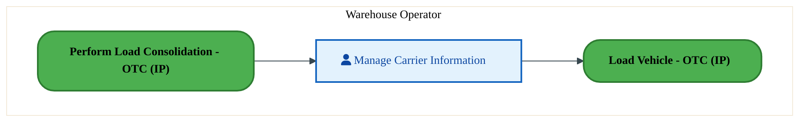

<a href="https://mermaid.live/view#pako:eNqlVF1v2jAU_StWKpRNClI-CcvDJAhEqtSqlejahzFNl-SaWDU2ckyBIv77bD4LW5_mhyg-Ofece48cb5xSVuhkTqu1YYLpjGxcXeMM3Yy4E2jQ9cgeeAbFYMKxcS2HSqFH7H1HC-L5ytIsVsCM8bVFRziVSH7ceqRnCrlHGhBNu0HFqOu5c8VmoNa55FJZ9g12qU93bodPfakqVGeC76dBmZhSzgSe4SiN07iwdQ2WUlQXojShXVq6W9scl8uyBqV37S8avIfVC6t0bfYUeIOGU-sZv4MJcjujVguLlQv1dgyDNdZHmMBGcyiZmBo89g2kQLyeocTfbsm21RqLkyl5GowFMavk0DQDpKTRBh6-aUIZ59lNnPeKxPcareQrZjfhMB1EoVfaSTIzuu_ZcNtLZNNaZxPJqwO1vbQzZOF85alVFvqeWpvnlReK6uyUd8Ju2D059dMgD_KjE6X0v5xMruoJmteD1zAqwmJw8gqSTpL7f-sdxxzEaS-4zgnVGyvxg2hRFNHwHNWwkwT-56L9Iur4-ZXoFDQuYX0W_JbHJ8EiSYsg_VRw73fd5WLyqGR5FIyGSZGcBNN-UPTCTwXjXhB3Dx0anamCeU04CPzt_xw7L6CwliZX8jBHBVqqsfNrT7ZLBIZDIaPQttmTexAwRZKDUsxsbwWVagaaSXFZFpqyOwkVecaalRxJmzw85eTL7ePXS2JkiI-orAzZFeRSNJKzaif6rzJz2vYvIiLt9nfT4mEb7Lfhh-wseDwzF3B4-kEu4OgEO54zQzMaq5xs4-xuKHOLVUhhwbWz9RxYaDlai9LJdn-ys5iblnHAwAQ824PbP72BmLQ=" title="View full diagram">&#128065; View Diagram</a>

#### BUSINESS ARCHITECTURE — 3.2.3 LO-190-030_Load_Vehicle_-_OTC_(IP) — LO-190-030_Load_Vehicle_-_OTC_(IP)

**Swim Lanes**: Warehouse Operator | **Tasks**: 2 | **Gateways**: 0

> **Legend**: ● Start · ● End · User Task · Service Task · ◇ Gateway · Sub-Process

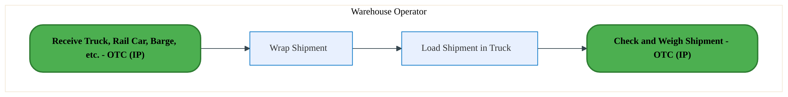

<a href="https://mermaid.live/view#pako:eNqlVF2PmkAU_SsTNoY2wYZPsTw0UZRkk212s9ruQ22acbjIxGEgw7Bqjf-9M6K42u5TeSDcM-eeM_fAsDdImYIRGb3ennIqI7Q3ZQ4FmBEyl7gG00It8B0LipcMalNzspLLGf19pDl-tdU0jSW4oGyn0RmsSkDf7i00Uo3MQjXmdb8GQTPTMitBCyx2cclKodl3MMzs7Oh2WhqXIgVxIdh26JBAtTLK4QJ7oR_6ie6rgZQ8vRLNgmyYEfOgN8fKDcmxkMftNzV8xdsXmspc1RlmNShOLgv2gJfA9IxSNBojjXg9h0Fr7cNVYLMKE8pXCvdtBQnM1xcosA8HdOj1FrwzRfPJgiN1EYbregIZqqWCp68SZZSx6M6PR0lgW7UU5RqiO3caTjzXInqSSI1uWzrc_gboKpfRsmTpidrf6Bkit9paYhu5tiV26n7jBTy9OMUDd-gOO6dx6MROfHbKsuy_nFSuYo7r9clr6iVuMum8nGAQxPbfeucxJ344cm5zAvFKCbwRTZLEm16img4Cx35fdJx4Azu-EV1hCRu8uwh-jv1OMAnCxAnfFWz9bnfZLJ9ESc6C3jRIgk4wHDvJyH1X0B85_vC0Q6WzErjKEcMcftk_FsYLFpCXKlf0WIHAshQL42dL1hd3NEe1oFlOqwK4vF521fJDidNuGVGO5qIh62uep3hxDmSNME_Ri377l5Y-epzH6MP908frJl81PQMB-gqtpoWeMWUoxsJCYyxW6gCBJJ_-JaC-yfaB-6jf_6IGOZVOW7qn0m1L703gquqOzxXsd7BhGQWIAtPUiPbG8f-l_nEpZLhh0jhYBm5kOdtxYkTHc240Vaq-iQnFKv6iBQ9_AGELnj0=" title="View full diagram">&#128065; View Diagram</a>

#### BUSINESS ARCHITECTURE — 3.2.4 LO-190-040_Check_and_Weigh_Shipment_-_OTC_(IP) — LO-190-040_Check_and_Weigh_Shipment_-_OTC_(IP)

**Swim Lanes**: Warehouse Operator | **Tasks**: 2 | **Gateways**: 0

> **Legend**: ● Start · ● End · User Task · Service Task · ◇ Gateway · Sub-Process

```mermaid
%%{init: {'theme': 'base', 'themeVariables': {'fontSize': '14px', 'fontFamily': 'Segoe UI, Arial, sans-serif','primaryColor': '#e8f0fe', 'primaryBorderColor': '#0071c5','lineColor': '#37474F', 'secondaryColor': '#f5f8fc'}, 'flowchart': {'useMaxWidth': false, 'htmlLabels': true, 'curve': 'basis', 'nodeSpacing': 40, 'rankSpacing': 50}} }%%
flowchart TD
    classDef startEvt fill:#4CAF50,stroke:#2E7D32,color:#000,font-weight:bold,stroke-width:2px,rx:20,ry:20
    classDef endEvt fill:#C62828,stroke:#B71C1C,color:#fff,font-weight:bold,stroke-width:2px,rx:20,ry:20
    classDef userTask fill:#E3F2FD,stroke:#1565C0,stroke-width:2px,color:#0D47A1
    classDef serviceTask fill:#FFF3E0,stroke:#E65100,stroke-width:2px,color:#BF360C
    classDef gateway fill:#FFF9C4,stroke:#F57F17,stroke-width:2px,color:#E65100
    classDef subProc fill:#F3E5F5,stroke:#7B1FA2,stroke-width:2px,color:#4A148C
    subgraph lane_0["Warehouse Operator"]
        n1["fa:fa-user Check and Weigh Shipment"]
        n2["fa:fa-user Perform 3PV"]
        n3["Load Vehicle - OTC (IP)"]
        n4["Perform Load Consolidation - OTC (IP)"]
    end
    n1 --> n2
    n4 --> n1
    n2 --> n3
    class n1 userTask
    class n2 userTask
    class n3 startEvt
    class n4 startEvt
```

<a href="https://mermaid.live/view#pako:eNqlVF1r2zAU_SvCJXgDB_wZZ34YJE4MhY4F0rUPyxiKfRWLyJKRlKZZyH-flM8ma5_mB2Mdn3vOvceytk4pKnAyp9PZUk51hraurqEBN0PuHCtwPXQAnrCkeM5AuZZDBNdT-mdPC-L21dIsVuCGso1Fp7AQgH7ce2hgCpmHFOaqq0BS4npuK2mD5SYXTEjLvoM-8cne7fhqKGQF8kLw_TQoE1PKKIcLHKVxGhe2TkEpeHUlShLSJ6W7s80xsS5rLPW-_ZWCb_j1mVa6NmuCmQLDqXXDHvAcmJ1Ry5XFypV8OYVBlfXhJrBpi0vKFwaPfQNJzJcXKPF3O7TrdGb8bIoeRzOOzFUyrNQICFLawOMXjQhlLLuL80GR-J7SUiwhuwvH6SgKvdJOkpnRfc-G210DXdQ6mwtWHandtZ0hC9tXT75moe_JjbnfeAGvLk55L-yH_bPTMA3yID85EUL-y8nkKh-xWh69xlERFqOzV5D0ktz_V-805ihOB8FtTiBfaAlvRIuiiMaXqMa9JPA_Fh0WUc_Pb0QXWMMaby6CX_L4LFgkaRGkHwoe_G67XM0nUpQnwWicFMlZMB0GxSD8UDAeBHH_2KHRWUjc1ohhDr_9nzPnGUuohckVfW9BYi3kzPl1INuLB4ZDcEZw12aP8hrKJcK8Qs_2C6JpTdsGuL4uCq-LJiCJkA2KJk_XvMjwHgSu0BPUtGSAuuj7Y44-3U8-XxNjQzyp7AtywZVgtMKaCv5emdmThwceoG73q-npuIwPy-M-4OFhGb0J3JacNtoVHL4PR-ef7QqOz7DjOQ3IBtPKybbO_rQzJ2IFBK-Ydnaeg1daTDe8dLL9qeCsWjMYjCg2H6s5gLu_5-GuSg==" title="View full diagram">&#128065; View Diagram</a>

Page 7<a href="#toc">↑ Back to TOC</a>LO-190 — Ship/Deliver Orders - OTC (IP)

#### BUSINESS ARCHITECTURE — 3.2.5 LO-190-060_Validate_and_Record_Shipping_Information_-_OTC_(IP) — LO-190-060_Validate_and_Record_Shipping_Information_-_OTC_(IP)

**Swim Lanes**: Warehouse Operator | **Tasks**: 11 | **Gateways**: 4

> **Legend**: ● Start · ● End · User Task · Service Task · ◇ Gateway · Sub-Process

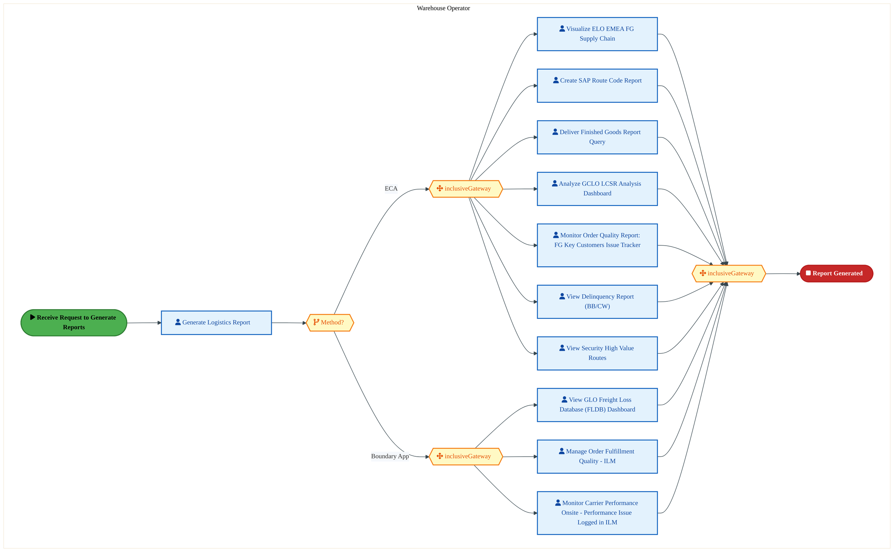

<a href="https://mermaid.live/view#pako:eNqlVl1v8jYU_itWqopWAi0J-aC52ASBdNWo2pWuvRjTZBIHrIY4s51SXl7--44JgcZLL7ZxQTgP53nOh09s74yYJcQIjMvLHc2pDNCuI1dkTToB6iywIJ0uqoAXzCleZER0lE_Kcjmj3w5ullN8KDeFRXhNs61CZ2TJCPrtrouGQMy6SOBc9AThNO10OwWna8y3IcsYV94XZJCa6SHa8a8R4wnhZwfT9K3YBWpGc3KG-77jO5HiCRKzPGmIpm46SOPOXiWXsU28wlwe0i8FuccfrzSRK7BTnAkCPiu5zqZ4QTJVo-SlwuKSv9fNoELFyaFhswLHNF8C7pgAcZy_nSHX3O_R_vJynp-CoufxPEfwiTMsxJikSEiAJ-8SpTTLggsnHEau2RWSszcSXNgTf9y3u7GqJIDSza5qbm9D6HIlgwXLkqNrb6NqCOzio8s_Atvs8i18a7FInpwjhZ49sAenSCPfCq2wjpSm6f-KBH3lz1i8HWNN-pEdjU-xLNdzQ_OfenWZY8cfWnqfCH-nMfkkGkVRf3Ju1cRzLfNr0VHU98xQE11iSTZ4exa8CZ2TYOT6keV_KVjF07MsF4-cxbVgf-JG7knQH1nR0P5S0BlazuCYIegsOS5WKMM5-dP8fW68Yk5WDPqKHgrCsWR8bvxROatPboFPioMU91Tv0S3JlRdBU7akQtJYoCdSMC6bLLvJGuY4234j6DacPqBpOHuqEBh4NMZitWCYJ02BflNgTDL6Ds8I9hCxIgm6ZSypQ6NfS8K3Tb7T5IecqKRnw0f0xEr4FcJL1pq52yS-UFHiDDYiNIHUJ_eTIYpu0awsimyLwhWmeZPu6XSyQTMCLzmVW_QzzDx6wVlJqixEk-u3cFXh-V8lyeNtXe3VaPRD-Hrd5A6a3HsGey3j6EHtcdAfKEHWAoGq4BcC6ZdCsjXhAt0JATk9cxy_EW39b9qFQ8w5BfuR8JTxNc5jGKBcUGhtrwFW0jAtS1g1mqO76b02YKYWAed4SY6ZR2WmRn5NcnmqoteiYbW07hYWLOKHfQbiCzVqEqsjB11F0_Ho-qvRs-yrk1qRYdW2mMD0wRMWQkgk2fk1qFqqFvL6s0T_LAE9Luqlq2mJ7u_sdrW_Oi97C9jx4xW6J3LFkp_mxn7_2ds9e8MysI3o4UxCc-OsFJDobbX76CzvP7H8f8mCs6D6AX1Evd6P8Kzto-nUtlsBtmb3NVv3dzV7oNm-Znu17R0TsHTA1ICbo30UsGpFR7P7mm1r9kCzfc32NNuydMDUgBvdoZY8Ne2Q4_e5MQmHc-O76oL-z4iVh2sMGhZF5eJ9Om3UOtWnbAO22-F-O-y0w2477LXDfjs8aIdv2mHoYTv-RZ0wtvXdqYn3j_ecJurUh30Tdtthrx32a9joGrAhrzFNjGBnHO7FcHdOSIrLTBr7roFLyWbbPDaCw_3RKIsEmGOK4VhfV-D-b_WMjaE=" title="View full diagram">&#128065; View Diagram</a>

Page 8<a href="#toc">↑ Back to TOC</a>LO-190 — Ship/Deliver Orders - OTC (IP)

#### BUSINESS ARCHITECTURE — 3.2.6 LO-190-070_Monitor_Carrier_Performance_on_Site_-_OTC_(IP) — LO-190-070_Monitor_Carrier_Performance_on_Site_-_OTC_(IP)

**Swim Lanes**: Load Planner | **Tasks**: 10 | **Gateways**: 4

> **Legend**: ● Start · ● End · User Task · Service Task · ◇ Gateway · Sub-Process

```mermaid
%%{init: {'theme': 'base', 'themeVariables': {'fontSize': '14px', 'fontFamily': 'Segoe UI, Arial, sans-serif','primaryColor': '#e8f0fe', 'primaryBorderColor': '#0071c5','lineColor': '#37474F', 'secondaryColor': '#f5f8fc'}, 'flowchart': {'useMaxWidth': false, 'htmlLabels': true, 'curve': 'basis', 'nodeSpacing': 40, 'rankSpacing': 50}} }%%
flowchart TD
    classDef startEvt fill:#4CAF50,stroke:#2E7D32,color:#000,font-weight:bold,stroke-width:2px,rx:20,ry:20
    classDef endEvt fill:#C62828,stroke:#B71C1C,color:#fff,font-weight:bold,stroke-width:2px,rx:20,ry:20
    classDef userTask fill:#E3F2FD,stroke:#1565C0,stroke-width:2px,color:#0D47A1
    classDef serviceTask fill:#FFF3E0,stroke:#E65100,stroke-width:2px,color:#BF360C
    classDef gateway fill:#FFF9C4,stroke:#F57F17,stroke-width:2px,color:#E65100
    classDef subProc fill:#F3E5F5,stroke:#7B1FA2,stroke-width:2px,color:#4A148C
    subgraph lane_0["Load Planner"]
        n1["fa:fa-user Generate Reports in SAP Transportation Management"]
        n2["fa:fa-user Use Personalised Object Worklist (POWL)"]
        n3["fa:fa-user Use Fiori Apps"]
        n4["fa:fa-user Generate Reports Using Query"]
        n5["fa:fa-user Generate Report Using Analytics Apps"]
        n6["fa:fa-user Generate Report for Freight Order Execution Monitoring"]
        n7["fa:fa-user Generate Report for Freight Order Quantity Analysis (ALP)"]
        n8["fa:fa-user Use Transportation Cockpit"]
        n9["fa:fa-user Generate Reports Using Export to Excel Option"]
        n10["fa:fa-user Generate Report Using ECA"]
        n11(["fa:fa-stop Report Generated"])
        n12["Coordinate Transportation OTC (IP)"]
        n13{{"fa:fa-code-branch Type of Report?"}}
        n14{{"fa:fa-code-branch exclusiveGateway"}}
        n15{{"fa:fa-code-branch Methods?"}}
        n16{{"fa:fa-code-branch exclusiveGateway"}}
    end
    n2 --> n4
    n3 --> n5
    n5 --> n13
    n6 --> n14
    n7 --> n14
    n1 --> n15
    n14 --> n16
    n16 --> n11
    n4 --> n16
    n8 --> n9
    n9 --> n16
    n15 -->|"POWL"| n2
    n15 -->|"Transportation Cockpit"| n8
    n13 -->|"Execution"| n6
    n10 --> n16
    n15 -->|"Fiori Apps"| n3
    n15 -->|"ECA"| n10
    n12 --> n1
    n13 -->|"Quantity"| n7
    class n1 userTask
    class n2 userTask
    class n3 userTask
    class n4 userTask
    class n5 userTask
    class n6 userTask
    class n7 userTask
    class n8 userTask
    class n9 userTask
    class n10 userTask
    class n11 endEvt
    class n12 startEvt
    class n13 gateway
    class n14 gateway
    class n15 gateway
    class n16 gateway
```

<a href="https://mermaid.live/view#pako:eNqlVl1v4jgU_StWqoqOFKR8EpqHXdFARiO1glna6cOyWpnEAW-DHdlOC0v572PnA0gaZme0eUDc43PPsW_sG--1iMZI87Xr6z0mWPhg3xNrtEE9H_SWkKOeDkrgG2QYLlPEe4qTUCLm-N-CZjrZVtEUFsINTncKnaMVReDpiw5GMjHVAYeE9zliOOnpvYzhDWS7gKaUKfYVGiZGUrhVQ3eUxYidCIbhmZErU1NM0Am2PcdzQpXHUURJ3BBN3GSYRL2DmlxK36I1ZKKYfs7RA9w-41isZZzAlCPJWYtNeg-XKFVrFCxXWJSz17oYmCsfIgs2z2CEyUrijiEhBsnLCXKNwwEcrq8X5GgKHscLAuQTpZDzMUoAFxKevAqQ4DT1r5xgFLqGzgWjL8i_sibe2Lb0SK3El0s3dFXc_hvCq7XwlzSNK2r_Ta3Bt7Ktzra-ZehsJ39bXojEJ6dgYA2t4dHpzjMDM6idkiT5X06yruwR8pfKa2KHVjg-epnuwA2Mj3r1MseONzLbdULsFUfoTDQMQ3tyKtVk4JrGZdG70B4YQUt0BQV6g7uT4G3gHAVD1wtN76Jg6deeZb6cMRrVgvbEDd2joHdnhiProqAzMp1hNUOps2IwW4MUEvS38edCu6cwBjMZEsQW2l8lTT3ElKMJ9BPYV1UHn5FkyHWBP1BGmeAAEzAfzcCj3JxcIVBgSsADJHAljzMRTTWrqfbEEZghximBKeYoBtPlPygS4JmyFwkIcDObPt9_amrYHzVCTBkGoyzjTarzH5N_4vIsga85YrtmovvDxCpvJGe9EzjiHc6DHwsklIGQFbsfTFUHApMtivKydlR2SLkesmpKer8q-TWHRGCxKycq-wq4Gd3PWtUcfqxm610GNHrJcOtF3v5UZSfbYmqCyn8RSsE0U4qtDWb8TK0nwaiVZt4c87igWU2v02NJ_3TOV1svoLLdY6LUW4ucPgbg5ku7OKa939cm6gvWX8qsaA0edxkCNKk8f19oh8N5ltOdhbZRmnP8ij6XjaGd5nanPSCxpjH_4DL4VRfZoMs_xAL9_m_yeFShXYZuFbplaNpVPKjimu61YrOK63zTqYBBDdQKVdslbcKwjG-r8LadX8zofaGpbrDQ3uUC2iOX9qzkDmuuXXGPR60YPpoYl1zPu4tMsNvjxd58Vwr1SFVfs-1cn8iC7p11d1XE-qvWgK1u2O6GnW7Y7YYH3bDXDQ-74dtuWFazGzere0ITtY43lSZu1x_RJux0w243PKhhTdc2iG0gjjV_rxX3TXknjVEC81RoB12DuaDzHYk0v7iXaXkWy8wxhvJzuSnBw3cmuWcS" title="View full diagram">&#128065; View Diagram</a>

Page 9<a href="#toc">↑ Back to TOC</a>LO-190 — Ship/Deliver Orders - OTC (IP)

#### BUSINESS ARCHITECTURE — 3.2.7 LO-190-080_Record_Carrier_Information_-_OTC_(IP) — LO-190-080_Record_Carrier_Information_-_OTC_(IP)

**Swim Lanes**: Load Planner | **Tasks**: 15 | **Gateways**: 3

> **Legend**: ● Start · ● End · User Task · Service Task · ◇ Gateway · Sub-Process

```mermaid
%%{init: {'theme': 'base', 'themeVariables': {'fontSize': '14px', 'fontFamily': 'Segoe UI, Arial, sans-serif','primaryColor': '#e8f0fe', 'primaryBorderColor': '#0071c5','lineColor': '#37474F', 'secondaryColor': '#f5f8fc'}, 'flowchart': {'useMaxWidth': false, 'htmlLabels': true, 'curve': 'basis', 'nodeSpacing': 40, 'rankSpacing': 50}} }%%
flowchart TD
    classDef startEvt fill:#4CAF50,stroke:#2E7D32,color:#000,font-weight:bold,stroke-width:2px,rx:20,ry:20
    classDef endEvt fill:#C62828,stroke:#B71C1C,color:#fff,font-weight:bold,stroke-width:2px,rx:20,ry:20
    classDef userTask fill:#E3F2FD,stroke:#1565C0,stroke-width:2px,color:#0D47A1
    classDef serviceTask fill:#FFF3E0,stroke:#E65100,stroke-width:2px,color:#BF360C
    classDef gateway fill:#FFF9C4,stroke:#F57F17,stroke-width:2px,color:#E65100
    classDef subProc fill:#F3E5F5,stroke:#7B1FA2,stroke-width:2px,color:#4A148C
    subgraph lane_0["Load Planner"]
        n1[["fa:fa-cog Trigger NCRM"]]
        n2[["fa:fa-cog Generate Carrier List and Send RFQ"]]
        n3[["fa:fa-cog Convert RFQs into Email and Send to Carrier(Included Hyperlink to BN4L 0"]]
        n4[["fa:fa-cog Receive Carrier Response"]]
        n5[["fa:fa-cog Verify Responses in LOM and Send for Approval (Best Carrier Selected)"]]
        n6[["fa:fa-cog Trigger Approval Workflow"]]
        n7[["fa:fa-cog Show RFQs in FO and Send Notification Mail to LOM"]]
        n8[["fa:fa-cog Trigger Mail to Selected Carrier for Final Confirmation"]]
        n9[["fa:fa-cog Receive Confirmation from Carrier"]]
        n10[["fa:fa-cog Update Carrier on FO"]]
        n11[["fa:fa-cog Select Other Response/Trigger Tendering Again"]]
        n12[["fa:fa-cog Trigger Multibid"]]
        n13[["fa:fa-cog Trigger Spot Bid"]]
        n14[["fa:fa-cog Trigger Rejection Mail to Rejected Carrier"]]
        n15[["fa:fa-cog Trigger Email to LOM"]]
        n16["Ship Order - OTC (IP)"]
        n17["Determine Mode of Transportation/Carrier - OTC (IP)"]
        n18{{"fa:fa-code-branch Approved?"}}
        n19{{"fa:fa-code-branch FO Pickup date 5 Days?"}}
        n20{{"fa:fa-code-branch exclusiveGateway"}}
    end
    n17 --> n1
    n3 --> n4
    n5 --> n6
    n6 --> n18
    n7 --> n8
    n8 --> n9
    n9 --> n10
    n10 --> n16
    n1 --> n19
    n13 --> n20
    n20 --> n2
    n12 --> n20
    n19 -->|"No"| n13
    n2 --> n3
    n14 --> n11
    n4 --> n15
    n15 --> n5
    n11 --> n20
    n18 -->|"Yes"| n7
    n18 -->|"No"| n14
    n19 -->|"Yes"| n12
    class n1 serviceTask
    class n2 serviceTask
    class n3 serviceTask
    class n4 serviceTask
    class n5 serviceTask
    class n6 serviceTask
    class n7 serviceTask
    class n8 serviceTask
    class n9 serviceTask
    class n10 serviceTask
    class n11 serviceTask
    class n12 serviceTask
    class n13 serviceTask
    class n14 serviceTask
    class n15 serviceTask
    class n16 startEvt
    class n17 startEvt
    class n18 gateway
    class n19 gateway
    class n20 gateway
```

<a href="https://mermaid.live/view#pako:eNqlV12PokgU_SsVJh17EsxQCII87EZRZjvpr217ZrIZN5sSCq0VKVKg3Y7jf99bQoky8rQ-dHvvPefcjyqqcK-FPKKap93c7FnKCg_tO8WSrmnHQ505yWlHR6XjKxGMzBOadyQm5mkxZT-OMGxl7xImfQFZs2QnvVO64BR9udPREIiJjnKS5t2cChZ39E4m2JqInc8TLiT6A3VjIz5mq0IjLiIqaoBhODi0gZqwlNbunmM5ViB5OQ15Gl2IxnbsxmHnIItL-Fu4JKI4lr_J6QN5_8aiYgl2TJKcAmZZrJN7MqeJ7LEQG-kLN2KrhsFymSeFgU0zErJ0AX7LAJcg6ap22cbhgA43N7P0lBS9jmcpgk-YkDwf0xjlBbgn2wLFLEm8D5Y_DGxDzwvBV9T7YE6ccc_UQ9mJB60buhxu942yxbLw5jyJKmj3Tfbgmdm7Lt4909DFDv42ctE0qjP5fdM13VOmkYN97KtMcRz_r0wwV_FK8lWVa9ILzGB8yoXtvu0bv-qpNseWM8TNOVGxZSE9Ew2CoDepRzXp29hoFx0Fvb7hN0QXpKBvZFcLDnzrJBjYToCdVsEyX7PKzfxZ8FAJ9iZ2YJ8EnREOhmaroDXElltVCDoLQbIlSkhK_zG-z7R7TiL0DGZKxUz7u4TJT4q_QzgmXky6IV-gV8EWCyrQo__yAMBzpHmJ_ExBCyaAfCIEA8o9ywtE0ghNYaegl-DPBr93yfd5uqWwpwGYI5YWHE3WhCW1Angq6du7NEw2EY3QH7uMCnh0VzI6erTukdHIYl1meaEhZdu6yBeaZzzNaYNlX7K-yvNldwLL-tD900NdW8wFGmaZ4FuSoNsRhc5VhilNaFjQ6GMjRf_6oE8q37hYySe9QXMuadMlf1MjQ8FTXdEjL1jMQlIwnqIHOUiYENTckHOvV6EIqvhTN7LRgKVQH6xXzMT6mKAhOmiZ-RkDxYKvlWqDjo1L_pcsOt9XXDbapDS2bVk3eoI7pl7jT6q7VxgQrGi6QMMFYc3qsdkyk01SsDmLmvDedfg04wUa_Qq3rsNf6L9Q8flilZ569k0h-7pQ-dRcXWzcB8Z0yTL0JG9B1EVPrz66vXv-2DgDHMCNaUHFGm5F9ABXE-IxZIC7NuOiOK7gJ7UerSrufl8XGNHuHPjhstrhNPp9ph0O5_jBdTzs6mcWrjYZOm4DG43JLm-STeM6mb7DSZHD7vtcHs41DfZA-QXaRd3ub_C_snulaVWmXZr9yuxXYLeyK7Iy3dIcVOagQhsql1E5lByubEXAVXZ1CcKXyqEAZgOAjzl-zrRHPtN-SgXFLIHKxFaVSvWpbFsBqk5PNm5mcqtMf9H8mMppBlQJVrM2xcDm2R0nuz-7iS8iZmuk1xqxWiN2a6TfGnFaI25rZNAagYVvDbVPAbePAbfPAbcPArdPAvdPr4-XfqfF76o3nkv34KobtnHl1nRtDScLYZHm7bXjrwD4pRDRmMABqx10jWwKPt2loeYd35a1zfH8HzMCLzHr0nn4D-Jg3VM=" title="View full diagram">&#128065; View Diagram</a>

Page 10<a href="#toc">↑ Back to TOC</a>LO-190 — Ship/Deliver Orders - OTC (IP)

#### BUSINESS ARCHITECTURE — 3.2.8 LO-190-090_Create_Proforma_Based_Delivery_Notice_-_OTC_(IP) — LO-190-090_Create_Proforma_Based_Delivery_Notice_-_OTC_(IP)

**Swim Lanes**: Warehouse Operator | **Tasks**: 3 | **Gateways**: 2

> **Legend**: ● Start · ● End · User Task · Service Task · ◇ Gateway · Sub-Process

```mermaid
%%{init: {'theme': 'base', 'themeVariables': {'fontSize': '14px', 'fontFamily': 'Segoe UI, Arial, sans-serif','primaryColor': '#e8f0fe', 'primaryBorderColor': '#0071c5','lineColor': '#37474F', 'secondaryColor': '#f5f8fc'}, 'flowchart': {'useMaxWidth': false, 'htmlLabels': true, 'curve': 'basis', 'nodeSpacing': 40, 'rankSpacing': 50}} }%%
flowchart TD
    classDef startEvt fill:#4CAF50,stroke:#2E7D32,color:#000,font-weight:bold,stroke-width:2px,rx:20,ry:20
    classDef endEvt fill:#C62828,stroke:#B71C1C,color:#fff,font-weight:bold,stroke-width:2px,rx:20,ry:20
    classDef userTask fill:#E3F2FD,stroke:#1565C0,stroke-width:2px,color:#0D47A1
    classDef serviceTask fill:#FFF3E0,stroke:#E65100,stroke-width:2px,color:#BF360C
    classDef gateway fill:#FFF9C4,stroke:#F57F17,stroke-width:2px,color:#E65100
    classDef subProc fill:#F3E5F5,stroke:#7B1FA2,stroke-width:2px,color:#4A148C
    subgraph lane_0["Warehouse Operator"]
        n1["fa:fa-user Print EIAJ Form"]
        n2["fa:fa-user Extract Delivery Information"]
        n3["Perform EIAJ Label Verification and Transfer to Handheld Device"]
        n4["Stage Finished Goods (IP)"]
        n5["Process Packing and Regulatory Export Reports - OTC (IP)"]
        n6{{"fa:fa-code-branch Ship to Japan OEMs (Fujitsu, NEC and Panasonic)?"}}
        n7{{"fa:fa-code-branch exclusiveGateway"}}
    end
    n1 --> n7
    n6 -->|"Yes"| n2
    n6 -->|"No"| n7
    n5 --> n6
    n3 --> n1
    n2 --> n3
    n7 --> n4
    class n1 userTask
    class n2 userTask
    class n4 startEvt
    class n5 startEvt
    class n6 gateway
    class n7 gateway
```

<a href="https://mermaid.live/view#pako:eNqlVWGPmzgQ_SsWq1VaiUhAIKR8uFOWQG-razdq9lpVl1PlwBB869jINrvJpfnvtSEkS7r76fIhyTzevDczMGZvZTwHK7Kur_eEERWh_UCVsIFBhAYrLGFgoxb4ggXBKwpyYDgFZ2pB_mtorl9tDc1gKd4QujPoAtYc0F-3NprqRGojiZkcShCkGNiDSpANFruYUy4M-womhVM0bsdLN1zkIM4ExwndLNCplDA4w6PQD_3U5EnIOMt7okVQTIpscDDFUf6UlViopvxawke8_UpyVeq4wFSC5pRqQ__EK6CmRyVqg2W1eOyGQaTxYXpgiwpnhK017jsaEpg9nKHAORzQ4fp6yU6m6H62ZEh_MoqlnEGBpNJw8qhQQSiNrvx4mgaOLZXgDxBdeUk4G3l2ZjqJdOuObYY7fAKyLlW04jQ_UodPpofIq7a22EaeY4ud_r7wApafneKxN_EmJ6eb0I3duHMqiuJ_Oem5inssH45eySj10tnJyw3GQez8qte1OfPDqXs5JxCPJINnommajpLzqJJx4Dqvi96ko7ETX4iusYInvDsLvov9k2AahKkbvirY-l1WWa_mgmed4CgJ0uAkGN646dR7VdCfuv7kWKHWWQtclYhiBt-dv5fWVyyg5Hqu6K4CgRUXS-uflmw-zNWcAkcFHprZo7kgTKHkdvoBpVxs-lyvz022SuBMoRlQ8ghih25ZoXOwIpz1E0c6cQ7CXG21my1BX8wyk6xJQJjl6F4vgiy0tOLoDw2UQHMtb25gX9DXgguF14BSferIEnL0nvNcoje387d9amC89WxBSjTH2YPescbrM6xrauax041UXO_YZzA_Eg3R3X38gtJ4v-_6N4fecKWrzUq0KEllCv6AK8zQXfJRV5HW_xIlaxt9SuLGbY4ZlpyR7O3vS-tweKYavqwK24zWUs_1ffusnbP0NrZ_mIuGw9-0wjEcm_DH0voGcmn90LfrAv_EG7ijB232-BiO2vC4P8xrw9ExDNvQf_bcGv9uX3uw9zLsn86sHhy8DI-7JeuhYYdatrUB_ayR3Ir2VvOC0S-hHApcU2UdbAvXii92LLOi5iC26irXmTOC9X5sWvDwE4X-JNc=" title="View full diagram">&#128065; View Diagram</a>

Page 11<a href="#toc">↑ Back to TOC</a>LO-190 — Ship/Deliver Orders - OTC (IP)

#### BUSINESS ARCHITECTURE — 3.2.9 LO-190-100_Ship_Order_-_OTC_(IP) — LO-190-100_Ship_Order_-_OTC_(IP)

**Swim Lanes**: Load Planner · Warehouse Operator | **Tasks**: 21 | **Gateways**: 8

> **Legend**: ● Start · ● End · User Task · Service Task · ◇ Gateway · Sub-Process

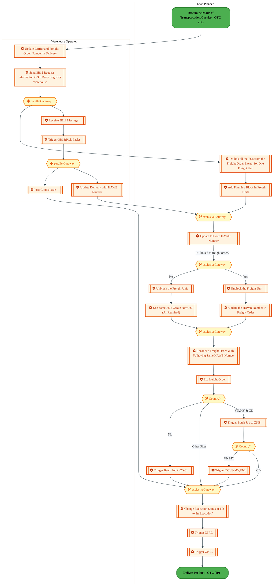

<a href="https://mermaid.live/view#pako:eNqlWG1z4jYQ_isa36TkZmDOkm1M-NAbMLhNJ29zJJfeXTodYcugibGoZCfQHP-9kpENKPjau_KBGT27--zq8WpleLEiFhOrb52cvNCM5n3w0srnZEFafdCaYkFabbAFPmJO8TQloqV8EpblE_p36Qbd5Uq5KSzEC5quFTohM0bA3XkbDGRg2gYCZ6IjCKdJq91acrrAfB2wlHHl_Yb0Ejsps2nTkPGY8J2Dbfsw8mRoSjOygx3f9d1QxQkSsSw-IE28pJdErY0qLmXP0RzzvCy_EOQSr-5pnM_lOsGpINJnni_SCzwlqdpjzguFRQV_qsSgQuXJpGCTJY5oNpO4a0uI4-xxB3n2ZgM2JycPWZ0U3I4eMiA_UYqFGJEEiFzC46ccJDRN-2_cYBB6dlvknD2S_hs09kcOakdqJ325dbutxO08Ezqb5_0pS2Pt2nlWe-ij5arNV31kt_lafhu5SBbvMgVd1EO9OtPQhwEMqkxJkvyvTFJXfovFo841dkIUjupc0Ot6gf2ar9rmyPUH0NSJ8CcakT3SMAyd8U6qcdeDdjPpMHS6dmCQznBOnvF6R3gWuDVh6Pkh9BsJt_nMKovpDWdRReiMvdCrCf0hDAeokdAdQLenK5Q8M46Xc5DijPxpf3mwLhiOwY1cZoQ_WH9s3dQng1-kOcH9BHciNgPBHGczAsYrEhU5ZRmY5DgvBGAJCK9BzkDrPNtZW5Jrnwwdkt0tYykRCO_AM83n4NfB_RBcFYtpWcN-nGPEZdOURY9ATgwQ8rKHJEZzI8r9oSjvaI0qaK8-QLOa41pNEIOka5AIAiZ4QZRG70DAiaK8Is9qfToQ4AP5q6CcxG8NGv-Q5oOaPRFNyWFucK_UkyrO8ZOcDdtMzWL2DklDuvrmVs4O3W85nc1kziHOozn4jU3VQ__8e3BuhEH7eNzn4G5yevmp_fHK3CyE_yXT5HxixqGGTDcfAtPVaXQdm65G9wxifUCUwsOykfZ6QPWRMBmMThqRjrxUHgFO020P3gmQcLY4aMjtAx2vIrKUo5RxcJ19s1sRkjlGJKVPMkwOh7iIctAB17cBOD2_eXt4lpFTOueEL-TtBi7lFaMO7q28WMSScXmS5Zl9F2DOqWRrZHFfXnb7iklnKuPlEyKrKC2ELOSX7dx7sDab_TDvx8K6PxbmHw8LWJHlfP3edO99n_vZ9xYlL8djsxfKB3KPOZkzeaeB6yXhOGfmBDaGyURyAWcIUTk2iMjBeSY7ZVE-PXVGHC5bVd77a3DBZlTkNBKgTmI26esRQ2T9W_5LIgSevQoxBsgNkyX8wlgswLkQxSv3hgEiMzinNzR67Nzg6NEcBsg-Ooar3sRSgsMjs5vL-jSsTUZ4lLHy_tcryN49clkEexYdnOZgibk8zyQ93oUO_L6gukvkUQWdzs9KBw1AbwtAVwPudt3VS3-77OmlDvcqOltHV-6oDP_6YF2xB-urZNO4zoKqwK6xRtrBr8rSxKgm1hGwctCFwbMK0GtUrZEGnAqotl559PS6zqm3jmpKndOpxHKq7XomUHPoMlAl2Jm5D78S6KIUqMrlVPX3DADVO9ZUTgWgirtaQ6N-pFPJK1zdECRWpzjR7V3-QHlf1oBcs7hreXdwMKE5EVuPuvye9vh41b78VNpg3Uo9c6-VczAyWKou-aT5HbOAkh78BHQk3H-xVs9678X6wIIaLU6jxW20eI2WbqPFb7T0Gi1njRZ5DhpNzSrAZhlgsw6wWQjYrARslgI2awGbxYDNaqBmNdA3egLVv1cPcacBd6ufWIewdxzuHof943DvOHx2FJbj5SgMK9hqWwv51oVpbPVfrPKfDvlvSEwSXKS5tWlbuMjZZJ1FVr_8R8AqyttpRLF8WVhswc0_LL9TFQ==" title="View full diagram">&#128065; View Diagram</a>

Page 12<a href="#toc">↑ Back to TOC</a>LO-190 — Ship/Deliver Orders - OTC (IP)

#### BUSINESS ARCHITECTURE — 3.2.10 LO-190-110_Update_Inventory_Status_-_OTC_(IP) — LO-190-110_Update_Inventory_Status_-_OTC_(IP)

**Swim Lanes**: Warehouse Operator | **Tasks**: 3 | **Gateways**: 0

> **Legend**: ● Start · ● End · User Task · Service Task · ◇ Gateway · Sub-Process

```mermaid
%%{init: {'theme': 'base', 'themeVariables': {'fontSize': '14px', 'fontFamily': 'Segoe UI, Arial, sans-serif','primaryColor': '#e8f0fe', 'primaryBorderColor': '#0071c5','lineColor': '#37474F', 'secondaryColor': '#f5f8fc'}, 'flowchart': {'useMaxWidth': false, 'htmlLabels': true, 'curve': 'basis', 'nodeSpacing': 40, 'rankSpacing': 50}} }%%
flowchart TD
    classDef startEvt fill:#4CAF50,stroke:#2E7D32,color:#000,font-weight:bold,stroke-width:2px,rx:20,ry:20
    classDef endEvt fill:#C62828,stroke:#B71C1C,color:#fff,font-weight:bold,stroke-width:2px,rx:20,ry:20
    classDef userTask fill:#E3F2FD,stroke:#1565C0,stroke-width:2px,color:#0D47A1
    classDef serviceTask fill:#FFF3E0,stroke:#E65100,stroke-width:2px,color:#BF360C
    classDef gateway fill:#FFF9C4,stroke:#F57F17,stroke-width:2px,color:#E65100
    classDef subProc fill:#F3E5F5,stroke:#7B1FA2,stroke-width:2px,color:#4A148C
    subgraph lane_0["Warehouse Operator"]
        n1[["fa:fa-cog Send 3B2 PGI Signal"]]
        n2[["fa:fa-cog Update PGI in Outbound Delivery"]]
        n3[["fa:fa-cog Update Inventory Status"]]
        n4["Update/Reset Cummulative Shipped for Customers - OTC (IP)"]
        n5["Process Goods Issue for Stock Material - OTC (IP)"]
    end
    n1 --> n2
    n2 --> n3
    n5 --> n1
    n3 --> n4
    class n1 serviceTask
    class n2 serviceTask
    class n3 serviceTask
    class n4 startEvt
    class n5 startEvt
```

<a href="https://mermaid.live/view#pako:eNqlVF1v2jAU_StWqopNClo-G5aHSRBIhbSq1dKuD-00meQarDp2ZDu0rOK_zyYUCitPy0OUe3zuOb4nll-dUlTgpM75-SvlVKfotacXUEMvRb0ZVtBzUQf8xJLiGQPVsxwiuC7onw3Nj5oXS7NYjmvKVhYtYC4A3U1dNDSNzEUKc9VXICnpub1G0hrLVSaYkJZ9BgPikY3bdmkkZAVyT_C8xC9j08oohz0cJlES5bZPQSl4dSBKYjIgZW9tN8fEc7nAUm-23yq4wi_3tNILUxPMFBjOQtfsO54BszNq2VqsbOXyLQyqrA83gRUNLimfGzzyDCQxf9pDsbdeo_X5-SPfmaLb8SNH5ikZVmoMBClt4MlSI0IZS8-ibJjHnqu0FE-QngWTZBwGbmknSc3onmvD7T8DnS90OhOs2lL7z3aGNGheXPmSBp4rV-Z95AW82jtlF8EgGOycRomf-dmbEyHkv5xMrvIWq6et1yTMg3y88_Ljizjz_tV7G3McJUP_OCeQS1rCO9E8z8PJPqrJRex7p0VHeXjhZUeic6zhGa_2gl-zaCeYx0nuJycFO7_jXbazGynKN8FwEufxTjAZ-fkwOCkYDf1osN2h0ZlL3CwQwxx-ew-Pzj2WsBAmV3TdgMRayEfnV0e2D_cfDInglOB-KeaoMP8ahaMA3VxOUUHnHDPDf98QHDbcNZUJY0OnHF23eiZaIzEGRpcgV0fN4YfNU74Ebna2QoXGulVHTZHp6ZhffoACjbK2rluGtXFAxYI2DVSICGlwpUUNUqE-ur7N0KfpzefDaWMjZYMGpdClEJVCU6Va2HQXWpRP6MrY2PvmIwmTTffBfdTvfzNZbMugK8NtGXfl9ijysCujd__cKrw7mQcrwcmV8ORKtLsPDuB4BzuuY4KpMa2c9NXZXMjm0q6A4JZpZ-06uNWiWPHSSTcXl9NuAh9TbM5T3YHrv33M4_4=" title="View full diagram">&#128065; View Diagram</a>

Page 13<a href="#toc">↑ Back to TOC</a>LO-190 — Ship/Deliver Orders - OTC (IP)

#### BUSINESS ARCHITECTURE — 3.2.11 LO-190-120_Send_Advanced_Shipping_Notice_-_OTC_(IP) — LO-190-120_Send_Advanced_Shipping_Notice_-_OTC_(IP)

**Swim Lanes**: Load Planner · Warehouse Operator | **Tasks**: 7 | **Gateways**: 4

> **Legend**: ● Start · ● End · User Task · Service Task · ◇ Gateway · Sub-Process

```mermaid
%%{init: {'theme': 'base', 'themeVariables': {'fontSize': '14px', 'fontFamily': 'Segoe UI, Arial, sans-serif','primaryColor': '#e8f0fe', 'primaryBorderColor': '#0071c5','lineColor': '#37474F', 'secondaryColor': '#f5f8fc'}, 'flowchart': {'useMaxWidth': false, 'htmlLabels': true, 'curve': 'basis', 'nodeSpacing': 40, 'rankSpacing': 50}} }%%
flowchart LR
    classDef startEvt fill:#4CAF50,stroke:#2E7D32,color:#000,font-weight:bold,stroke-width:2px,rx:20,ry:20
    classDef endEvt fill:#C62828,stroke:#B71C1C,color:#fff,font-weight:bold,stroke-width:2px,rx:20,ry:20
    classDef userTask fill:#E3F2FD,stroke:#1565C0,stroke-width:2px,color:#0D47A1
    classDef serviceTask fill:#FFF3E0,stroke:#E65100,stroke-width:2px,color:#BF360C
    classDef gateway fill:#FFF9C4,stroke:#F57F17,stroke-width:2px,color:#E65100
    classDef subProc fill:#F3E5F5,stroke:#7B1FA2,stroke-width:2px,color:#4A148C
    subgraph lane_0["Load Planner"]
        n1[["fa:fa-cog Create Freight Order"]]
        n2[["fa:fa-cog Generate Customer Pre-Alert"]]
        n3[["fa:fa-cog Send Error Email to Site Customer Service and Carrier"]]
        n8(["fa:fa-stop Pre-Alert Generated"])
        n9(["fa:fa-stop Error E-Mail Sent"])
        n11["Create Delivery Note - OTC (IP)"]
        n12{{"fa:fa-code-branch ZPRC Triggered?"}}
        n13{{"fa:fa-code-branch Flight Matrix File Uploaded?"}}
        n14{{"fa:fa-code-branch exclusiveGateway"}}
    end
    subgraph lane_1["Warehouse Operator"]
        n4[["fa:fa-cog Complete Pick Pack of all the Deliveries"]]
        n5[["fa:fa-cog Complete PGI of all the Deliveries"]]
        n6[["fa:fa-cog Update PGI in Deliveries"]]
        n7[["fa:fa-cog Send Customer ASN (YDN1)"]]
        n10(["fa:fa-stop Customer ASN Sent"])
        n15{{"fa:fa-arrows-alt parallelGateway"}}
    end
    n1 --> n4
    n5 --> n6
    n4 --> n5
    n2 --> n8
    n7 --> n10
    n11 --> n1
    n6 --> n15
    n15 --> n7
    n14 --> n3
    n3 --> n9
    n12 -->|"No"| n14
    n12 -->|"Yes"| n13
    n13 -->|"No"| n14
    n13 -->|"Yes"| n2
    n15 --> n12
    class n1 serviceTask
    class n2 serviceTask
    class n3 serviceTask
    class n4 serviceTask
    class n5 serviceTask
    class n6 serviceTask
    class n7 serviceTask
    class n8 endEvt
    class n9 endEvt
    class n10 endEvt
    class n11 startEvt
    class n12 gateway
    class n13 gateway
    class n14 gateway
    class n15 gateway
```

<a href="https://mermaid.live/view#pako:eNqlVmtv4jgU_StWqopWSqQ4D0LzYVc0kKpSH2jo7Gh2WK1M4oBVE0dOaGEZ_vtekweQIdJKyweke-495z5842SnRSKmmq9dX-9Yygof7XrFkq5oz0e9OclpT0cl8AeRjMw5zXsqJhFpMWX_HMKwk21UmMJCsmJ8q9ApXQiKvj7qaAhErqOcpLmRU8mSnt7LJFsRuQ0EF1JFX9FBYiaHbJXrXsiYymOAaXo4coHKWUqPsO05nhMqXk4jkcZnoombDJKot1fFcfEZLYksDuWvc_pMNt9YXCzBTgjPKcQsixV_InPKVY-FXCssWsuPehgsV3lSGNg0IxFLF4A7JkCSpO9HyDX3e7S_vp6lTVL09GWWIvhFnOT5iCYoLwAefxQoYZz7V04wDF1Tzwsp3ql_ZY29kW3pkerEh9ZNXQ3X-KRssSz8ueBxFWp8qh58K9vocuNbpi638N_KRdP4mCnoWwNr0GS693CAgzpTkiT_KxPMVb6R_L3KNbZDKxw1ubDbdwPzV726zZHjDXF7TlR-sIieiIZhaI-Poxr3XWx2i96Hdt8MWqILUtBPsj0K3gVOIxi6Xoi9TsEyX7vK9XwiRVQL2mM3dBtB7x6HQ6tT0BliZ1BVCDoLSbIl4iSlf5s_ZtqTIDGagJlSOdP-KsPUL8U_wJ0QPyFGJBYokBS6QqE8nBx6VU8PEE4Z1jnjgYKm4gTrvBArKtFEUmPIqSxaRPucOIWFQmMphUTjFWEcFQJN2anQtDw1RCAwIFKyX2oZ3DSSwMmOqZuyYmDcnjDuWoyqAONZVQAlFa14jCG-msqIcvZB5Ra9CLAM9PoWoJvHyW1rotZud-wzpsYcHuxoif6cfAnQm2SLBZU0_n2m7fenLPsyK-SHg3gmhWQbFDIOt2HG4TgvSDiXJegm4uscKn8oF_ZIgxO4tDGq5W9E0qWAJxG9ZmqQorU3TmtvxCrjFKYyYdE7mhD4EwkiHE512QyO0bx1fm6XysPjf-L3z_lfs5hUbJZ2s7wLi9gs3XD6gm6-j17wbYuFzdbqnFEurY57PA_YXvGZG4QXKCMS-qK8-zRSjAzjN5hxZbql2a9MpzTdyrRKc1CZXmlis9aqxKorMe1XZk3HlbpX25W8Xdl2ad7V7kO6nzPtRcy0nyq87fiu5q08tQK2uyh2i2K1asLWyQ2pxnJyj595rE6P3elxOj1up6ff6fE6PYPqzXkG3l0CsXkRxc1r_hy36jfQOWxfhp3LsFvDmq7BLsNFHGv-Tjt8rMEHXUwTsuaFttc1si7EdJtGmn_4qNHWh4dtxAjcHKsS3P8L5oIjdQ==" title="View full diagram">&#128065; View Diagram</a>

#### BUSINESS ARCHITECTURE — 3.2.12 LO-190-130_Send_Interplant_Shipping_Register_-_OTC_(IP) — LO-190-130_Send_Interplant_Shipping_Register_-_OTC_(IP)

**Swim Lanes**: Warehouse Operator | **Tasks**: 3 | **Gateways**: 0

> **Legend**: ● Start · ● End · User Task · Service Task · ◇ Gateway · Sub-Process

<a href="https://mermaid.live/view#pako:eNqlVMtu2zAQ_JWFgsAtIAN6Rq4OBWzZKgK0TRAnzSEpClpaykQkUiDpJG7gfy8pP-PWp-ogaIe7M8shtW9OIUp0Uuf8_I1xplN46-k5NthLoTcjCnsurIEfRDIyq1H1bA4VXE_Z7y7Nj9pXm2axnDSsXlp0ipVAuLt0YWgKaxcU4aqvUDLac3utZA2Ry0zUQtrsMxxQj3Zqm6WRkCXKfYLnJX4Rm9KacdzDYRIlUW7rFBaCl-9IaUwHtOitbHO1eCnmROqu_YXCb-T1npV6bmJKaoUmZ66b-iuZYW33qOXCYsVCPm_NYMrqcGPYtCUF45XBI89AkvCnPRR7qxWszs8f-U4UbsePHMxT1ESpMVJQ2sCTZw2U1XV6FmXDPPZcpaV4wvQsmCTjMHALu5PUbN1zrbn9F2TVXKczUZeb1P6L3UMatK-ufE0Dz5VL8z7SQl7ulbKLYBAMdkqjxM_8bKtEKf0vJeOrvCXqaaM1CfMgH--0_Pgizry_-bbbHEfJ0D_2CeUzK_CANM_zcLK3anIR-95p0lEeXnjZEWlFNL6Q5Z7wUxbtCPM4yf3kJOFa77jLxexaimJLGE7iPN4RJiM_HwYnCaOhHw02HRqeSpJ2DjXh-Mt7eHTuicS5ML7CVYuSaCEfnZ_rZPtw_8EkUZJS0i9EBbeSVRVKCEcBUCkamJrDN9cSrg2jNqWHtcG_ayNT-11oRllBNBMcBIXpnLUNcg03WCBrj5nC90xd0jN2XRBewl1bGsdhjLVB5fKoOPqwK1ZatHDJNcrW9tvJtrb9G6yYMvC2SSwNyccDkthw2CNApeCLEKWCS6UWCFRImGpRPME304KdRNCHq9sMPlxef9xZaUxaf_AY-v3PxtZN6K_DcBOG6zDYhME6jA5ugy05uLPvVoKTK-HJlWjz974D4934cFynQdkQVjrpm9MNajPMS6RkUWtn5TpkocV0yQsn7Qaas-iOYsyIuWfNGlz9Acjg7TU=" title="View full diagram">&#128065; View Diagram</a>

Page 14<a href="#toc">↑ Back to TOC</a>LO-190 — Ship/Deliver Orders - OTC (IP)

#### BUSINESS ARCHITECTURE — 3.2.13 LO-190-150_Deliver_Product_-_OTC_(IP) — LO-190-150_Deliver_Product_-_OTC_(IP)

**Swim Lanes**: Customer Business Analyst | **Tasks**: 4 | **Gateways**: 4

> **Legend**: ● Start · ● End · User Task · Service Task · ◇ Gateway · Sub-Process

```mermaid
%%{init: {'theme': 'base', 'themeVariables': {'fontSize': '14px', 'fontFamily': 'Segoe UI, Arial, sans-serif','primaryColor': '#e8f0fe', 'primaryBorderColor': '#0071c5','lineColor': '#37474F', 'secondaryColor': '#f5f8fc'}, 'flowchart': {'useMaxWidth': false, 'htmlLabels': true, 'curve': 'basis', 'nodeSpacing': 40, 'rankSpacing': 50}} }%%
flowchart TD
    classDef startEvt fill:#4CAF50,stroke:#2E7D32,color:#000,font-weight:bold,stroke-width:2px,rx:20,ry:20
    classDef endEvt fill:#C62828,stroke:#B71C1C,color:#fff,font-weight:bold,stroke-width:2px,rx:20,ry:20
    classDef userTask fill:#E3F2FD,stroke:#1565C0,stroke-width:2px,color:#0D47A1
    classDef serviceTask fill:#FFF3E0,stroke:#E65100,stroke-width:2px,color:#BF360C
    classDef gateway fill:#FFF9C4,stroke:#F57F17,stroke-width:2px,color:#E65100
    classDef subProc fill:#F3E5F5,stroke:#7B1FA2,stroke-width:2px,color:#4A148C
    subgraph lane_0["Customer Business Analyst"]
        n1[["fa:fa-cog Trigger IDOC for SO Creation"]]
        n2[["fa:fa-cog Trigger IDOC for SO Update"]]
        n3[["fa:fa-cog Transfer Sales Order to GTT"]]
        n4[["fa:fa-cog Track Sales Order in Track SO Fulfilment App"]]
        n5(["fa:fa-stop No Sales Order Updated Back to S/4"])
        n6(["fa:fa-stop End of Process"])
        n7(["fa:fa-stop End of Process"])
        n8["Create Standard Order (IP)"]
        n9{{"fa:fa-code-branch Document relevant for GTT?"}}
        n10{{"fa:fa-code-branch Document relevant for GTT?"}}
        n11{{"fa:fa-arrows-alt parallelGateway"}}
        n12{{"fa:fa-arrows-alt inclusiveGateway"}}
    end
    n3 --> n4
    n10 -->|"Yes"| n2
    n8 --> n11
    n9 -->|"Yes"| n1
    n12 --> n3
    n4 --> n5
    n2 --> n12
    n1 --> n12
    n9 -->|"No"| n6
    n10 -->|"No"| n7
    n11 -->|"Sales Order Created"| n9
    n11 -->|"Sales Order Updated"| n10
    class n1 serviceTask
    class n2 serviceTask
    class n3 serviceTask
    class n4 serviceTask
    class n5 endEvt
    class n6 endEvt
    class n7 endEvt
    class n8 startEvt
    class n9 gateway
    class n10 gateway
    class n11 gateway
    class n12 gateway
```

<a href="https://mermaid.live/view#pako:eNqlVmuP2jgU_StWRiNaKWjjPAjkw64gkGqkbqcSdKuqrFYmccAaY0e2A8NS_vvaJOGRgV2tmg9RfHzPudfHzk32VsozbEXW4-OeMKIisO-oFV7jTgQ6CyRxxwYV8AcSBC0olh0Tk3OmpuTvYxj0i1cTZrAErQndGXSKlxyDL082GGoitYFETHYlFiTv2J1CkDUSu5hTLkz0A-7nTn7MVk-NuMiwOAc4TgjTQFMpYfgMe6Ef-onhSZxyll2J5kHez9POwRRH-TZdIaGO5ZcS_45ev5JMrfQ4R1RiHbNSa_oRLTA1a1SiNFhaik1jBpEmD9OGTQuUErbUuO9oSCD2coYC53AAh8fHOTslBbPxnAF9pRRJOcY5kErDk40COaE0evDjYRI4tlSCv-DowZ2EY8-1U7OSSC_dsY253S0my5WKFpxmdWh3a9YQucWrLV4j17HFTt9buTDLzpnintt3-6dMoxDGMG4y5Xn-U5m0r2KG5Euda-IlbjI-5YJBL4idt3rNMsd-OIRtn7DYkBRfiCZJ4k3OVk16AXTui44Sr-fELdElUniLdmfBQeyfBJMgTGB4V7DK166yXHwWPG0EvUmQBCfBcASToXtX0B9Cv19XqHWWAhUrQBHDfznf51ZcSsXXWIBRKfXBlxIMGaI7qebWnxXHXAx-17E5inLUTfkSzARZLjXpafwcg5wLMH0GscBIEc408ZLp_jfzS5Fpw1o8r83Tr3euiVOkewR4Ni8vUBx8mM1aRP8NMX25YhHWgM8gKan2dI2ZAsOiaCkF705K2qQCfOJXOlXZGRgZLV3K9BdfC7y_EOi1BCYsAzwHZiu1063g8P8E983WGcMxmCpk2lJWV_Xu6fP7670b7PdnQzLcXWgr0xUY87Q8LlxgijdIP5jt0H7-NrcOh8u9d35WAJ4FkBB8K7uIKlAggSjF9EP1trRJ7k0SYSnVJ3WD37B0F6oemAe63V_1QaiH0DHjH3PrG9Y2_tBHsp7oV3Gw7gls0IprcOhWgV499qthUA_rWdjIwta4kf3Ej6q9dlk1HjY4rPHLs1btdXYMHPxbYH0oq_ov24ip66LZXc24d2e8uzP-3Zmg_iBcgb1bYHgL7J--XVfwoOmq12tybsPwNuw2sGVbuumtEcmsaG8df0D0T0qGc1RSZR1sC5WKT3cstaLjh9oqj76OCdL9c12Bh38ActHKPw==" title="View full diagram">&#128065; View Diagram</a>

#### BUSINESS ARCHITECTURE — 3.2.14 LO-190-160_Resolve_Shipping_Issues_-_OTC_(IP) — LO-190-160_Resolve_Shipping_Issues_-_OTC_(IP)

**Swim Lanes**: Warehouse Operator | **Tasks**: 1 | **Gateways**: 0

> **Legend**: ● Start · ● End · User Task · Service Task · ◇ Gateway · Sub-Process

<a href="https://mermaid.live/view#pako:eNqlVF1r2zAU_SvCJbgFB_wZZ34YJE4MgZV1S7c-NGMo9lUsqkhGkvOxkP8-OR9OmtGn-cFYx-eec--x5J2ViwKsxOp0dpRTnaCdrUtYgp0ge44V2A46Aj-xpHjOQNkNhwiup_TPgeaF1aahNViGl5RtG3QKCwHox8RBA1PIHKQwV10FkhLbsStJl1huU8GEbNh30CcuObidXg2FLEBeCK4be3lkShnlcIGDOIzDrKlTkAtevBMlEemT3N43zTGxzkss9aH9WsEj3rzQQpdmTTBTYDilXrIveA6smVHLusHyWq7OYVDV-HAT2LTCOeULg4eugSTmbxcocvd7tO90Zrw1Rc-jGUfmyhlWagQEKW3g8UojQhlL7sJ0kEWuo7QUb5Dc-eN4FPhO3kySmNFdpwm3uwa6KHUyF6w4UbvrZobErzaO3CS-68itud94AS8uTmnP7_v91mkYe6mXnp0IIf_lZHKVz1i9nbzGQeZno9bLi3pR6v6rdx5zFMYD7zYnkCuaw5VolmXB-BLVuBd57seiwyzouemN6AJrWOPtRfBTGraCWRRnXvyh4NHvtst6_iRFfhYMxlEWtYLx0MsG_oeC4cAL-6cOjc5C4qpEDHP47b7OrBcsoRQmV_S1Aom1kDPr15HcXNx7NSSCE4K7uVigR8zxAtC3GjOqt2jCc1oA1wjzogWfQBIhl5jnYLSuxfz7VkxpUaFpSavKbGo0UaoG9B2UYCsoTNXDVVVgikbA6AokMikUda5RF319TtH95OmhbdfswuMD91C3-9m4nZbBcXn95RvO1Zd_98Y_7ed3YNAeKMuxlmCmo4WV7KzDr8v83goguGba2jsWrrWYbnluJYcjbtVVYbbDiGKT_PII7v8C042i8Q==" title="View full diagram">&#128065; View Diagram</a>

#### BUSINESS ARCHITECTURE — 3.2.15 LO-190-170_Receive_Customer_Acknowledgment_of_Shipment_Receipt_and_Discrepancies_-_OTC_(IP) — LO-190-170_Receive_Customer_Acknowledgment_of_Shipment_Receipt_and_Discrepancies_-_OTC_(IP)

**Swim Lanes**: Warehouse Operator | **Tasks**: 1 | **Gateways**: 0

> **Legend**: ● Start · ● End · User Task · Service Task · ◇ Gateway · Sub-Process

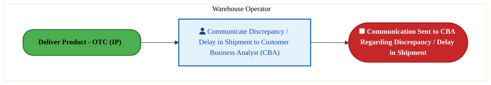

<a href="https://mermaid.live/view#pako:eNqlVNuK2zAU_BXhJXgXHOprnPqh4NgxLLTs0my7D00pii3HYmXJSHIuDfn3HueelKUP9UOwJnNmzhlL2hi5KIgRGb3ehnKqI7QxdUVqYkbInGFFTAvtge9YUjxjRJkdpxRcT-jvHc3xm1VH67AM15StO3RC5oKgb48WiqGQWUhhrvqKSFqaltlIWmO5TgQTsmPfkWFplzu3w18jIQsizwTbDp08gFJGOTnDXuiHftbVKZILXlyJlkE5LHNz2zXHxDKvsNS79ltFvuDVKy10BesSM0WAU-mafcYzwroZtWw7LG_l4hgGVZ0Ph8AmDc4pnwPu2wBJzN_OUGBvt2jb6035yRS9pFOO4MkZViolJVIa4PFCo5IyFt35SZwFtqW0FG8kunPHYeq5Vt5NEsHottWF218SOq90NBOsOFD7y26GyG1WllxFrm3JNfzeeBFenJ2SgTt0hyenUegkTnJ0Ksvyv5wgV_mC1dvBa-xlbpaevJxgECT233rHMVM_jJ3bnIhc0JxciGZZ5o3PUY0HgWO_LzrKvIGd3IjOsSZLvD4Lfkz8k2AWhJkTviu497vtsp09S5EfBb1xkAUnwXDkZLH7rqAfO_7w0CHozCVuKsQwJ7_sH1PjFUtSCcgVPTVEYi3k1Pi5J3cPd4BT4qjE_S57lIi6bjnNYUCUUpVL0mCer9EHlBIGE1OOJhVtasI10gIlrdKihrpRq-BYKYVijtlaaXSfjOKHayv3_uQFVc2FFxUge5QcxegrmWNZwGn4Vw9g8HDh4IEBcOgCOoI8izbXqI-eXhJ0__h87gb28_6FO6jf_wSdHZbefnm5hzrOcVdewe7hWFyB3ulcGpYBudSYFka0MXY3INySBSlxy7SxtQzcajFZ89yIdjeF0TYFhJ5SDB-w3oPbP5qOuwk=" title="View full diagram">&#128065; View Diagram</a>

Page 15<a href="#toc">↑ Back to TOC</a>LO-190 — Ship/Deliver Orders - OTC (IP)

#### BUSINESS ARCHITECTURE — 3.2.16 LO-190-190_Audit_Shipment_Transportation_Charges_-_OTC_(IP) — LO-190-190_Audit_Shipment_Transportation_Charges_-_OTC_(IP)

**Swim Lanes**: Boundary Apps and other source data · Freight Payment Analyst | **Tasks**: 10 | **Gateways**: 1

> **Legend**: ● Start · ● End · User Task · Service Task · ◇ Gateway · Sub-Process

```mermaid
%%{init: {'theme': 'base', 'themeVariables': {'fontSize': '14px', 'fontFamily': 'Segoe UI, Arial, sans-serif','primaryColor': '#e8f0fe', 'primaryBorderColor': '#0071c5','lineColor': '#37474F', 'secondaryColor': '#f5f8fc'}, 'flowchart': {'useMaxWidth': false, 'htmlLabels': true, 'curve': 'basis', 'nodeSpacing': 40, 'rankSpacing': 50}} }%%
flowchart LR
    classDef startEvt fill:#4CAF50,stroke:#2E7D32,color:#000,font-weight:bold,stroke-width:2px,rx:20,ry:20
    classDef endEvt fill:#C62828,stroke:#B71C1C,color:#fff,font-weight:bold,stroke-width:2px,rx:20,ry:20
    classDef userTask fill:#E3F2FD,stroke:#1565C0,stroke-width:2px,color:#0D47A1
    classDef serviceTask fill:#FFF3E0,stroke:#E65100,stroke-width:2px,color:#BF360C
    classDef gateway fill:#FFF9C4,stroke:#F57F17,stroke-width:2px,color:#E65100
    classDef subProc fill:#F3E5F5,stroke:#7B1FA2,stroke-width:2px,color:#4A148C
    subgraph lane_0["Boundary Apps and other source data"]
        n7[["fa:fa-cog Submit invoice to CTSI"]]
        n8[["fa:fa-cog Make Attempt to Match Order Details and Pay the Carrier"]]
        n9[["fa:fa-cog Submit Invoice in S/4 against Ariba PO"]]
        n10[["fa:fa-cog Run 080 Payment for CTSI"]]
        n13(["fa:fa-stop Payment Successfully Completed"])
        n14{{"fa:fa-arrows-alt parallelGateway"}}
    end
    subgraph lane_1["Freight Payment Analyst"]
        n1[["fa:fa-cog Calculate Charges and Distribute Costs Successfully in Freight Order"]]
        n2[["fa:fa-cog Create Freight Order"]]
        n3[["fa:fa-cog Update Charges from CTSI in TM as per the Invoiced Amount"]]
        n4[["fa:fa-cog Create and Post Freight settlement Document"]]
        n5[["fa:fa-cog Create Purchase Order and SES in S/4"]]
        n6[["fa:fa-cog Generate Cost Distribution Document"]]
        n11(["fa:fa-play Initiate TM Planning"])
        n12(["fa:fa-stop Cost Distribution Document Updated and Released to Accounting"])
    end
    n1 --> n7
    n7 --> n8
    n3 --> n4
    n4 --> n5
    n5 --> n6
    n9 --> n10
    n11 --> n2
    n6 --> n12
    n10 --> n13
    n8 --> n14
    n14 --> n3
    n14 --> n9
    n2 --> n1
    class n1 serviceTask
    class n2 serviceTask
    class n3 serviceTask
    class n4 serviceTask
    class n5 serviceTask
    class n6 serviceTask
    class n7 serviceTask
    class n8 serviceTask
    class n9 serviceTask
    class n10 serviceTask
    class n11 startEvt
    class n12 endEvt
    class n13 endEvt
    class n14 gateway
```

<a href="https://mermaid.live/view#pako:eNqlVk1v4zYQ_SuEgsAtIKP6tBwdCjiytQiwwQZxtj1sioKWKJsIRQoklcRr-L-XlGjZUq1eqoPhmeG8N_M0JHWwMpYjK7Zubw-YYhmDw0TuUIkmMZhsoEATG7SOPyDHcEOQmOg1BaNyjX82y9yg-tTLtC-FJSZ77V2jLUPg-4MNFiqR2EBAKqYCcVxM7EnFcQn5PmGEcb36Bs0Lp2jYTOie8Rzx8wLHidwsVKkEU3R2-1EQBanOEyhjNO-BFmExL7LJURdH2Ee2g1w25dcCPcLPP3Eud8ouIBFIrdnJknyFG0R0j5LX2pfV_P0kBhaahyrB1hXMMN0qf-AoF4f07ewKneMRHG9vX2lHCr4-v1KgnoxAIZaoAEIq9-pdggITEt8EySINHVtIzt5QfOOtoqXv2ZnuJFatO7YWd_qB8HYn4w0juVk6_dA9xF71afPP2HNsvle_Ay5E8zNTMvPm3rxjuo_cxE1OTEVR_C8mpSt_geLNcK381EuXHZcbzsLE-Tfeqc1lEC3coU6Iv-MMXYCmaeqvzlKtZqHrjIPep_7MSQagWyjRB9yfAe-SoANMwyh1o1HAlm9YZb154iw7AfqrMA07wOjeTRfeKGCwcIO5qVDhbDmsdoBAiv52frxa96xuhhosqkoASHPA1HbkQLCaZwjkUMJX6682Wz80-qGyChgXcJqxLVjXmxJLgOk7UzICyUDysn5QKZc5837OI3xDYCElKiupMx6hzHbgm96PYIkkxKSt5ElJqIoBCeQcIz4AvbtayIMpBFOw_i0AcAsxFVKfERsInr4NMFynD_JcU-DMHc1cIqpGmvFr_bj-L12akKzq1q_rLENCFDUhe5CwsiJIolxl_3qZHRwOp2zVGfsQU0gkqCCHhCDypR2eV-t4bJPU9rr29lxVQsqbfdTxLygkeyH7b8zt95hAktVEkYBEHR1b1Gq9xGp-8KbWbiak6Lei1DxRNa9poIc3YOBIw_9Xht_P-F7llwUVnJWN7pr45RFAASo1G3oWzPvNwaJUkysHsMHVQppZUk11FQkkJUGNYkuW1frPACi8CvSk9sROXVpmVjXuerU2szZAmPURviCKODTqntXGjI6V4LrnIauI2goP6v7EGkIp8qRGgKrrYDha3mAwx9mM5nnTxTMiSPWV6924yDKtbA-8G0Hqgun0d3UKGDNqzbkx_dYMjBm0ZmjMsDVnxrxrTdc5QRtsz9gzEz_ZrmMcvnHMjX2icw2fP7DvjO2Z9ReHq27o4groRbzRiD8aCUYj4WhkNhqJRiPz0cjdaETpNxpyuw-Gvt8zl3vf61_1Bqd7z7KtEvES4tyKD1bzdae-AHNUwJpI62hbsJZsvaeZFTdfQVbdjOISQ3W8la3z-A-FNz73" title="View full diagram">&#128065; View Diagram</a>

Page 16<a href="#toc">↑ Back to TOC</a>LO-190 — Ship/Deliver Orders - OTC (IP)

#### BUSINESS ARCHITECTURE — 3.2.17 LO-190-200_Monitor_Shipment_Status_-_OTC_(IP) — LO-190-200_Monitor_Shipment_Status_-_OTC_(IP)

**Swim Lanes**: Transportation Planner | **Tasks**: 13 | **Gateways**: 12

> **Legend**: ● Start · ● End · User Task · Service Task · ◇ Gateway · Sub-Process

```mermaid
%%{init: {'theme': 'base', 'themeVariables': {'fontSize': '14px', 'fontFamily': 'Segoe UI, Arial, sans-serif','primaryColor': '#e8f0fe', 'primaryBorderColor': '#0071c5','lineColor': '#37474F', 'secondaryColor': '#f5f8fc'}, 'flowchart': {'useMaxWidth': false, 'htmlLabels': true, 'curve': 'basis', 'nodeSpacing': 40, 'rankSpacing': 50}} }%%
flowchart TD
    classDef startEvt fill:#4CAF50,stroke:#2E7D32,color:#000,font-weight:bold,stroke-width:2px,rx:20,ry:20
    classDef endEvt fill:#C62828,stroke:#B71C1C,color:#fff,font-weight:bold,stroke-width:2px,rx:20,ry:20
    classDef userTask fill:#E3F2FD,stroke:#1565C0,stroke-width:2px,color:#0D47A1
    classDef serviceTask fill:#FFF3E0,stroke:#E65100,stroke-width:2px,color:#BF360C
    classDef gateway fill:#FFF9C4,stroke:#F57F17,stroke-width:2px,color:#E65100
    classDef subProc fill:#F3E5F5,stroke:#7B1FA2,stroke-width:2px,color:#4A148C
    subgraph lane_0["Transportation Planner"]
        n1[["fa:fa-cog Trigger IDOC for Outbound Delivery Update"]]
        n2[["fa:fa-cog Trigger IDOC for Outbound Delivery Creation"]]
        n3[["fa:fa-cog Track Shipment Document/TU in Shipment Tracking App"]]
        n4[["fa:fa-cog Update Events in Track Shipments App"]]
        n5[["fa:fa-cog Receive Last Event as Proof of Delivery"]]
        n6[["fa:fa-cog Receive Information from GXS"]]
        n7[["fa:fa-cog Update Last Event as Shipped CRF"]]
        n8[["fa:fa-cog Transfer Outbound Delivery to GTT"]]
        n9[["fa:fa-cog Track Outbound Delivery in OBD Fulfillment App"]]
        n10[["fa:fa-cog Pull information from S/4 (By WOM and My Samples)"]]
        n11[["fa:fa-cog Backtrack Execution/Delay Status in SO Fulfillment App"]]
        n12[["fa:fa-cog Update Last Event in Freight Order"]]
        n13[["fa:fa-cog Update Events in Freight Order"]]
        n14(["fa:fa-play Information from GXS received"])
        n15(["fa:fa-stop End of Process"])
        n16(["fa:fa-stop End of Process"])
        n17(["fa:fa-stop Execution Status Updated in Freight Order"])
        n18(["fa:fa-stop No Delivery Status Updated in S/4"])
        n19(["fa:fa-stop End of Process"])
        n20(["fa:fa-stop End of Process"])
        n21(["fa:fa-stop Execution Status Updated in Freight Order"])
        n22["Create Delivery Note - OTC (IP)"]
        n23{{"fa:fa-code-branch Document Relevant for GTT?"}}
        n24{{"fa:fa-code-branch Document Relevant for GTT?"}}
        n25{{"fa:fa-code-branch FO Type in Execution Status?"}}
        n26{{"fa:fa-code-branch exclusiveGateway"}}
        n27{{"fa:fa-code-branch exclusiveGateway"}}
        n28{{"fa:fa-arrows-alt parallelGateway"}}
        n29{{"fa:fa-arrows-alt parallelGateway"}}
        n30{{"fa:fa-arrows-alt parallelGateway"}}
        n31{{"fa:fa-arrows-alt parallelGateway"}}
        n32{{"fa:fa-arrows-alt parallelGateway"}}
        n33{{"fa:fa-arrows-alt parallelGateway"}}
        n34{{"fa:fa-arrows-alt inclusiveGateway"}}
    end
    n22 --> n28
    n23 -->|"Yes"| n1
    n25 -->|"Yes"| n3
    n3 --> n26
    n26 --> n4
    n6 --> n26
    n1 --> n34
    n2 --> n34
    n10 --> n20
    n14 --> n6
    n29 --> n5
    n31 --> n10
    n31 --> n25
    n24 -->|"Yes"| n2
    n34 --> n8
    n9 --> n11
    n11 --> n18
    n27 --> n9
    n12 --> n17
    n8 --> n27
    n29 --> n7
    n29 --> n27
    n5 --> n33
    n33 --> n12
    n7 --> n33
    n4 --> n32
    n32 --> n29
    n13 --> n21
    n30 -->|"Outbound Delivery Updated"| n23
    n24 -->|"No"| n16
    n23 -->|"No"| n15
    n25 -->|"No"| n19
    n32 --> n13
    n28 -->|"Outbound Delivery"| n30
    n30 -->|"Outbound Delivery Created"| n24
    n28 -->|"FU/FO - Created/Updated"| n31
    class n1 serviceTask
    class n2 serviceTask
    class n3 serviceTask
    class n4 serviceTask
    class n5 serviceTask
    class n6 serviceTask
    class n7 serviceTask
    class n8 serviceTask
    class n9 serviceTask
    class n10 serviceTask
    class n11 serviceTask
    class n12 serviceTask
    class n13 serviceTask
    class n14 startEvt
    class n15 endEvt
    class n16 endEvt
    class n17 endEvt
    class n18 endEvt
    class n19 endEvt
    class n20 endEvt
    class n21 endEvt
    class n22 startEvt
    class n23 gateway
    class n24 gateway
    class n25 gateway
    class n26 gateway
    class n27 gateway
    class n28 gateway
    class n29 gateway
    class n30 gateway
    class n31 gateway
    class n32 gateway
    class n33 gateway
    class n34 gateway
```

<a href="https://mermaid.live/view#pako:eNqtWG1v4jgQ_itWqoquBGreE_hwp_KSVaXdpVro7Z22p5NJHIgakshJ2rJd_vuNkziA61zV7qGqws_MPDPzeGwIz4qfBkQZKefnz1ESFSP03Cs2ZEt6I9Rb4Zz0-qgG_sA0wquY5D3mE6ZJsYh-VG6amT0xN4Z5eBvFO4YuyDol6Pa6j64gMO6jHCf5ICc0Cnv9XkajLaa7SRqnlHmfETdUwypbYxqnNCD04KCqjuZbEBpHCTnAhmM6psficuKnSXBCGlqhG_q9PSsuTh_9DaZFVX6Zk8_46VsUFBtYhzjOCfhsim38Ca9IzHosaMkwv6QPXIwoZ3kSEGyRYT9K1oCbKkAUJ_cHyFL3e7Q_P79L2qRoOb1LELz8GOf5lIQoLwCePRQojOJ4dGZOrjxL7ecFTe_J6EyfOVND7_uskxG0rvaZuINHEq03xWiVxkHjOnhkPYz07KlPn0a62qc7-C_kIklwyDSxdVd320xjR5toE54pDMNfygS60iXO75tcM8PTvWmbS7Nsa6K-5ONtTk3nShN1IvQh8skRqed5xuwg1cy2NLWbdOwZtjoRSNe4II94dyAcTsyW0LMcT3M6Cet8YpXl6oamPic0ZpZntYTOWPOu9E5C80oz3aZC4FlTnG1QjBPyj_r9TlnCbOVZSgtcRGmCbsCQEHqn_F0HsFeifQfHEI9CPPDTNVrSaL0mFF1P5xMUphTNy2KVlkmApiSOHgjdodssAAmA5ZhGfzPNhJKqLIHIEImwf48WmyjbkqRA09Qv2ZvL5S2KkgNeucEJQldZJhCap4R19Wj2AGE54zjNkEsYrFOGr8Qn0AL6hPOi5kE4R7CFaYjgjzcokNhykusE1NnW-xPSdIs-_rkQIh1pA6fZWfkZCdDkqydEuy_0TPKQyDakSNHH5VIIH8q242Us6DgfT5FXxmyKqy15qaOmnpLdlHEMkYIAi0sTXYx36Nv8M8KQ4_MOLfA2gw-PDyKfMLtjqK2oCpw9Eb9klJdQIZzVBZyAstrtxfy1IvXX5AYWj1ZXHJqzjxmRwHhl4P4z2LxogzNWuWw-EK2HJ4DgD8fB1iE4L9IMzUA-mEh2u5A8F73tN3k7ojeXmItb9xnIOjwhcgWiL-lhjF5SwTSIBMO31K2rb_LW_qcudR14qhuOHLr7ksJqgObLCbq4vvlweg_rxvPzYWwCMljBSfU37Y0HN0ZMHjC8YdcpHNTf75T9_pjA_FUCS07gzdFylxHWsijHCwpbTkGe_LjMQYWP9YenGOa8L8w9hGFK08d8gOMCZZjiOCZxR9DwHUGG-p4g7T1B-nuCjPcEmdKgKOnSHL4J1m9gutFg8BvbAA4YDPh5p_xF4Ej9hEPKDZZgMBqD0TDY3NGuAbNZ24Jdq9cGt-vCWlObAJUDZg20CYb12uIFNIyaKgA699BNoXadezbUvPuGWeNNa5y6lcepgSF3aKrXnAZwm9SOUKy4bh2spv1WzkZPjdfoCA5NyUbbA9_Ctia-I7wLQ23a7_oGGNSiGKJcX9J6BGxxOLjBEoeDG4ZCcVrL7XbVUg-V-nrN9WXc1GyKvN7tJVxzA-51edyhcfxYwSbx6LHixKJ3WoxOi9lpsTotdqfF6bS4nZZhpwXOVKepWwWtWwatWwc4rvyp9hS3mifQU9SWoo4UdaXoUIbqqhTVpKgurxjGvXlEPIVNOWzJYVsOO3LYlcNDKQyHRAprcliXw_IujbZLpa9sCXxzjQJl9KxUvwLBL0UBCXEZF8q-r-CySBe7xFdG1a8lSlkduWmE4SF2W4P7fwFvdLxq" title="View full diagram">&#128065; View Diagram</a>

Page 17<a href="#toc">↑ Back to TOC</a>LO-190 — Ship/Deliver Orders - OTC (IP)

### 3.3 Business Roles & Responsibilities

| Role / Lane | Processes Involved | Description |
|------------|-------------------|-------------|
| Warehouse Operator | LO-190-010_Perform_Load_Consolidation_-_OTC_(IP), LO-190-020_Receive_Truck,_Rail_Car,_Barge,_etc._-_OTC_(IP), LO-190-030_Load_Vehicle_-_OTC_(IP), LO-190-040_Check_and_Weigh_Shipment_-_OTC_(IP), LO-190-060_Validate_and_Record_Shipping_Information_-_OTC_(IP), LO-190-090_Create_Proforma_Based_Delivery_Notice_-_OTC_(IP), LO-190-100_Ship_Order_-_OTC_(IP), LO-190-110_Update_Inventory_Status_-_OTC_(IP), LO-190-120_Send_Advanced_Shipping_Notice_-_OTC_(IP), LO-190-130_Send_Interplant_Shipping_Register_-_OTC_(IP), LO-190-160_Resolve_Shipping_Issues_-_OTC_(IP), LO-190-170_Receive_Customer_Acknowledgment_of_Shipment_Receipt_and_Discrepancies_-_OTC_(IP),  | |
| Load Planner | LO-190-070_Monitor_Carrier_Performance_on_Site_-_OTC_(IP), LO-190-080_Record_Carrier_Information_-_OTC_(IP), LO-190-100_Ship_Order_-_OTC_(IP), LO-190-120_Send_Advanced_Shipping_Notice_-_OTC_(IP),  | |
| Customer Business Analyst | LO-190-150_Deliver_Product_-_OTC_(IP),  | |
| Boundary Apps and other source data | LO-190-190_Audit_Shipment_Transportation_Charges_-_OTC_(IP),  | |
| Freight Payment Analyst | LO-190-190_Audit_Shipment_Transportation_Charges_-_OTC_(IP),  | |
| Transportation Planner | LO-190-200_Monitor_Shipment_Status_-_OTC_(IP) | |

Page 18<a href="#toc">↑ Back to TOC</a>LO-190 — Ship/Deliver Orders - OTC (IP)

## 4. Data Architecture (TOGAF "D")

### 4.1 Data Flows — Source to Target

The following data flows are derived from the system integration hops for LO-190. Each row shows source application on its database flowing to a target application on its database.

| # | Flow Chain | Hop | Source App | Source DB | Target App | Target DB | Data Description | Frequency | Classification |
|---|-----------|-----|-----------|----------|-----------|----------|-----------------|-----------|---------------|

> *DB platforms will be populated when tower architects complete the extended flow template columns (42-47).*

Page 19<a href="#toc">↑ Back to TOC</a>LO-190 — Ship/Deliver Orders - OTC (IP)

### 4.2 Data Flow Diagrams

> **DATA ARCHITECTURE** — Database-to-database data flows. Applications (blue) sit above their hosting databases (green cylinders). Thick arrows show data movement between databases.

### 4.3 Data Lineage

Data lineage traces the origin and transformation path of key data objects across integrated systems.

| # | Source System | Source Schema/Object | Target System | Target Schema/Object | Transformation |
|---|-------------|---------------------|---------------|---------------------|---------------|

> *Lineage detail will be refined when tower architects validate source/target schema object mappings.*

### 4.4 RICEFW Data Objects

Data-centric RICEFW objects (Reports and Conversions) from the Object Tracker:

| Object ID | Type | Description | Status | Source | Target | Complexity |
|-----------|------|-------------|--------|--------|--------|-----------|
| OTCC1341 | Conversion | Payer Profile Data Conversion | 10. Object Complete |  |  | 03.Medium |
| OTCC1340 | Conversion | Payer Segment Data Conversion | 10. Object Complete |  |  | 03.Medium |
| OTCC1339 | Conversion | Payer Relationship Data Conversion | 10. Object Complete |  |  | 03.Medium |
| OTCC0803 | Conversion | Open Credit Case Conversion | 10. Object Complete |  |  | 02.High |
| OTCC0679 | Conversion | Open Dispute Case Conversion | 10. Object Complete |  |  | 02.High |
| OTCC0678 | Conversion | Collection Master Conversion | 10. Object Complete |  |  | 02.High |

### 4.5 Data Governance & Quality

| Concern | Approach |
|---------|----------|
| Data Ownership | Per-entity owners listed in Section 3.1 |
| Data Classification | Financial data classified as Intel Confidential |
| Data Retention | Per Intel corporate retention policies |
| Data Quality | Validated at source; reconciliation at target |

Page 20<a href="#toc">↑ Back to TOC</a>LO-190 — Ship/Deliver Orders - OTC (IP)

## 5. Application Architecture (TOGAF "A")

### 5.4 Component Overview

#### System Inventory

| System | IAPM ID | Status |
|--------|---------|--------|

Page 21<a href="#toc">↑ Back to TOC</a>LO-190 — Ship/Deliver Orders - OTC (IP)

### 5.5 RICEFW Inventory

| Object ID | Type | Description | Status | Source → Target | Middleware | Complexity |
|-----------|------|-------------|--------|----------------|-----------|-----------|
| OTCW1683 | Workflow | Additional WRICEF for Credit Limit Request Workflow | 10. Object Complete |  | NA | 03.Medium |
| OTCE0737 | Enhancement | Implement Standard BADI to activate Credit Limit Request Workflow | 10. Object Complete |  | NA | 04.Low |
| OTCE0614_IP | Enhancement | Implement Standard Credit/Collection BADI | 10. Object Complete |  | NA | 03.Medium |
| OTCE0021 | Enhancement | Credit hold release dashboard at line-item level | 10. Object Complete | NA → NA | NA | 01.Very High |
| OTCC1341 | Conversion | Payer Profile Data Conversion | 10. Object Complete |  | NA | 03.Medium |
| OTCC1340 | Conversion | Payer Segment Data Conversion | 10. Object Complete |  | NA | 03.Medium |
| OTCC1339 | Conversion | Payer Relationship Data Conversion | 10. Object Complete |  | NA | 03.Medium |
| OTCC0803 | Conversion | Open Credit Case Conversion | 10. Object Complete |  | NA | 02.High |
| OTCC0679 | Conversion | Open Dispute Case Conversion | 10. Object Complete |  | NA | 02.High |
| OTCC0678 | Conversion | Collection Master Conversion | 10. Object Complete |  | NA | 02.High |

**Summary**: 6 Conversions, 3 Enhancements, 1 Workflows

Page 22<a href="#toc">↑ Back to TOC</a>LO-190 — Ship/Deliver Orders - OTC (IP)

### 5.6 Integration Patterns

Integration patterns identified from the system flow analysis for LO-190:

| # | Pattern | Flow Chain | Middleware | Protocol | Auth |
|---|---------|-----------|-----------|----------|------|

> *Integration pattern details will be refined when tower architects validate middleware assignments.*

Page 23<a href="#toc">↑ Back to TOC</a>LO-190 — Ship/Deliver Orders - OTC (IP)

## 6. Technology Architecture (TOGAF "T")

### 6.1 Platform & Infrastructure

> **TECHNOLOGY / PLATFORM ARCHITECTURE** — Platforms (green) host applications (blue). Thick arrows show platform-to-platform integration flows.

#### Platform Inventory

Platform landscape inferred from integrated systems for LO-190:

| # | Platform | Type | Systems Using | Environment |
|---|----------|------|--------------|-------------|
| 1 | SAP S/4HANA | On-Premise (HEC) | SAP S/4 modules | DEV, QAS, PRD |
| 2 | SAP BTP (Integration Suite) | Cloud / PaaS | CPI, API Management | DEV, QAS, PRD |
| 3 | MuleSoft Anypoint | Cloud / iPaaS | API-led integrations | DEV, QAS, PRD |

> *Platform assignments will be validated when tower architects populate technology platform columns.*

Page 24<a href="#toc">↑ Back to TOC</a>LO-190 — Ship/Deliver Orders - OTC (IP)

### 6.2 SAP Development Object Status

| Metric | DEV | QAS | PRD |
|--------|-----|-----|-----|
| Transport Requests | — | — | — |
| Custom Code Objects | — | — | — |
| CDS Views | — | — | — |
| Fiori Apps | — | — | — |
| BAdIs / Enhancements | — | — | — |

### 6.3 NFRs & Design Principles

| Category | Requirement | Target / SLA | Priority |
|----------|-------------|-------------|----------|
| Performance | Order/transaction processing within interactive SLA | < 3 seconds for online transactions | High |
| Availability | Business-critical systems available during extended hours | 99.9% (06:00-22:00 all time zones) | High |
| Scalability | Support seasonal and promotional volume spikes | Handle 2x baseline transaction volume | Medium |
| Recoverability | Customer-facing systems recover within business impact window | RPO < 30 min, RTO < 2 hours | High |
| Data Volume | Support transactional data growth from business expansion | 10M+ documents/year | Medium |
| Latency | Near-real-time integration for order status updates | < 30 seconds for status propagation | Medium |
| Concurrency | Support global user base across business functions | 300+ concurrent users | Medium |

### 6.4 Security & Governance

| Concern | Approach | Standard / Policy | Owner |
|---------|----------|--------------------|-------|
| Authentication | Single Sign-On (SSO) via Intel corporate Azure AD identity | Intel IT Security Policy - Identity Management | IT Security |
| Authorization | Role-based access control (RBAC) with SAP authorization objects | Intel SAP Security Standards - Role Design | SAP Security Team |
| Data Classification | All financial/operational data classified per Intel Data Classification Standard | Intel Data Classification Policy | Data Governance |
| Data Encryption (at rest) | AES-256 encryption for SAP HANA database and file storage | Intel Encryption Standard | Infrastructure Security |
| Data Encryption (in transit) | TLS 1.3 for all system-to-system and user-to-system communication | Intel Network Security Policy | Network Engineering |
| Network Segmentation | SAP systems in dedicated network zones with firewall controls | Intel Network Architecture Standard | Network Security |
| API Security | OAuth 2.0 / certificate-based authentication for all API integrations | Intel API Security Guidelines | Integration Architecture |
| Audit Logging | Comprehensive audit trail for all data changes and user actions (SAP Security Audit Log) | SOX Compliance / Intel Audit Policy | Internal Audit |
| Certificate Management | Automated certificate lifecycle management for system-to-system trust | Intel PKI Standard | Certificate Authority Team |
| Compliance | SOX controls, export control (EAR/ITAR) screening, data privacy (GDPR) | Intel Corporate Compliance Framework | Compliance Office |

Page 25<a href="#toc">↑ Back to TOC</a>LO-190 — Ship/Deliver Orders - OTC (IP)

## 7. Project Context

### 7.1 Project Roadmap & Go-Live Plan

| ID | Description | FS | TDD | Build | FUT | Status |
|----|-------------|----|-----|-------|-----|--------|
| OTCW1683 | Additional WRICEF for Credit Limit Request Workflow | 2025-12-12 00:00:00 (100%) | 2026-02-04 00:00:00 (100%) | 2026-02-04 00:00:00 (100%) | 2026-03-04 00:00:00 (100%) | 1. On Track |
| OTCE0737 | Implement Standard BADI to activate Credit Limit Request Workflow | 2025-07-11 00:00:00 (100%) | 2025-12-03 00:00:00 (100%) | 2025-12-03 00:00:00 (100%) | 2026-03-04 00:00:00 (100%) | 1. On Track |
| OTCE0614_IP | Implement Standard Credit/Collection BADI | 2025-03-14 00:00:00 (100%) | 2025-08-13 00:00:00 (100%) | 2025-04-18 00:00:00 (100%) | 2025-09-05 00:00:00 (100%) |  |
| OTCE0021 | Credit hold release dashboard at line-item level | 2024-07-19 00:00:00 (100%) | 2025-09-05 00:00:00 (100%) | 2025-09-05 00:00:00 (100%) | 2026-02-04 00:00:00 (100%) | 1. On Track |
| OTCC1341 | Payer Profile Data Conversion | 2025-05-02 00:00:00 (100%) | 2025-06-24 00:00:00 (100%) | 2025-08-01 00:00:00 (100%) | 2025-09-10 00:00:00 (100%) |  |
| OTCC1340 | Payer Segment Data Conversion | 2025-05-02 00:00:00 (100%) | 2025-06-24 00:00:00 (100%) | 2025-08-01 00:00:00 (100%) | 2025-09-10 00:00:00 (100%) | 1. On Track |
| OTCC1339 | Payer Relationship Data Conversion | 2025-06-06 00:00:00 (100%) | 2025-10-23 00:00:00 (100%) | 2025-11-05 00:00:00 (100%) | 2025-11-21 00:00:00 (100%) | 4. Completed |
| OTCC0803 | Open Credit Case Conversion | 2025-06-06 00:00:00 (100%) | 2025-10-24 00:00:00 (100%) | 2025-11-05 00:00:00 (100%) | 2025-11-28 00:00:00 (100%) | 4. Completed |
| OTCC0679 | Open Dispute Case Conversion | 2025-06-06 00:00:00 (100%) | 2025-07-29 00:00:00 (100%) | 2025-08-29 00:00:00 (100%) | 2025-10-08 00:00:00 (100%) | 4. Completed |
| OTCC0678 | Collection Master Conversion | 2025-03-21 00:00:00 (100%) | 2025-05-02 00:00:00 (100%) | 2025-06-06 00:00:00 (100%) | 2025-08-29 00:00:00 (100%) |  |

Page 26<a href="#toc">↑ Back to TOC</a>LO-190 — Ship/Deliver Orders - OTC (IP)

### 7.2 RAID Log

Standard RAID items for LO-190 (Order To Cash (IP)):

| # | Category | Description | Status | Owner | Priority |
|---|----------|-------------|--------|-------|----------|
| 1 | Risk | Data migration completeness — validate all legacy Ship/Deliver Orders - OTC (IP) data maps to S/4 target structures | Open | Tower Architect | High |
| 2 | Risk | Integration testing coverage — ensure all 0 integrated systems are validated end-to-end | Open | Integration Lead | High |
| 3 | Assumption | Target SAP S/4HANA system available in DEV/QAS per release schedule | Active | SAP Basis | Medium |
| 4 | Issue | API access provisioning — SAP OData, Smartsheet, and IAPM API credentials required for automation | Open | EA Pipeline Team | High |
| 5 | Dependency | Upstream BPMN process models validated and signed off by business process owners | Active | Process Owner | Medium |

> *Live RAID data will be auto-populated from the Smartsheet RAID log via API integration.*

### 7.3 Recommendations & Next Steps

| # | Category | Recommendation | Priority | Owner | Target Date | Status |
|---|----------|---------------|----------|-------|-------------|--------|
| 1 | Architecture | Complete extended flow attributes (Data Entity, Integration Pattern, Tech Platform) in Flows tab for full BDAT coverage | High | Tower Architect | 2026-Q2 | Open |
| 2 | Data | Define data ownership and classification for all 0 flow chains to satisfy Data Architecture (TOGAF D) requirements | Medium | Data Architect | 2026-Q3 | Open |
| 3 | Testing | Develop integration test scenarios covering all 0 flow chains for FUT/SIT readiness | High | Test Lead | 2026-Q3 | Open |
| 4 | Business Architecture | Review and validate Business Architecture process steps against latest Signavio/BIC process models | Medium | Business Analyst | 2026-Q2 | Open |
| 5 | Security | Complete security review for API integrations and data flows per Intel Security Architecture standards | Medium | Security Architect | 2026-Q3 | Open |

---
*LO-190 — Architecture Document (TOGAF BDAT) · Order To Cash (IP) · Generated: April 2026*

Page 27<a href="#toc">↑ Back to TOC</a>LO-190 — Ship/Deliver Orders - OTC (IP)

