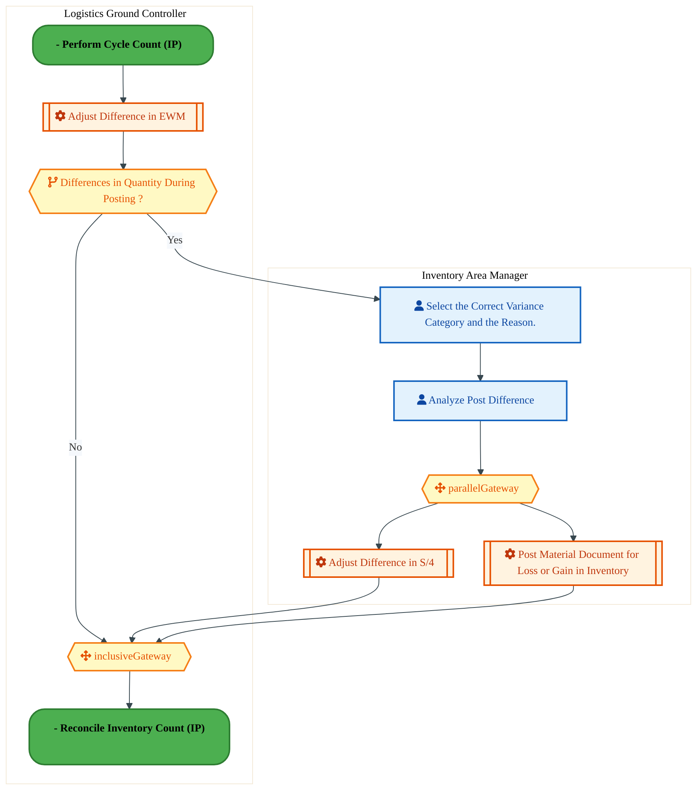

  
  <img src="data:image/svg+xml;base64,PHN2ZyB4bWxucz0iaHR0cDovL3d3dy53My5vcmcvMjAwMC9zdmciIHZpZXdCb3g9IjAgMCA4MDAgNDgwIiB3aWR0aD0iODAwIiBoZWlnaHQ9IjQ4MCI+CiAgPGRlZnM+CiAgICA8bGluZWFyR3JhZGllbnQgaWQ9ImJnIiB4MT0iMCUiIHkxPSIwJSIgeDI9IjEwMCUiIHkyPSIxMDAlIj4KICAgICAgPHN0b3Agb2Zmc2V0PSIwJSIgc3R5bGU9InN0b3AtY29sb3I6IzAwNzFjNTtzdG9wLW9wYWNpdHk6MSIvPgogICAgICA8c3RvcCBvZmZzZXQ9IjEwMCUiIHN0eWxlPSJzdG9wLWNvbG9yOiMwMGFlZWY7c3RvcC1vcGFjaXR5OjEiLz4KICAgIDwvbGluZWFyR3JhZGllbnQ+CiAgICA8bGluZWFyR3JhZGllbnQgaWQ9ImFjY2VudCIgeDE9IjAlIiB5MT0iMCUiIHgyPSIwJSIgeTI9IjEwMCUiPgogICAgICA8c3RvcCBvZmZzZXQ9IjAlIiBzdHlsZT0ic3RvcC1jb2xvcjojZmZmZmZmO3N0b3Atb3BhY2l0eTowLjE1Ii8+CiAgICAgIDxzdG9wIG9mZnNldD0iMTAwJSIgc3R5bGU9InN0b3AtY29sb3I6I2ZmZmZmZjtzdG9wLW9wYWNpdHk6MC4wMiIvPgogICAgPC9saW5lYXJHcmFkaWVudD4KICAgIDxwYXR0ZXJuIGlkPSJncmlkIiB3aWR0aD0iNDAiIGhlaWdodD0iNDAiIHBhdHRlcm5Vbml0cz0idXNlclNwYWNlT25Vc2UiPgogICAgICA8cGF0aCBkPSJNIDQwIDAgTCAwIDAgMCA0MCIgZmlsbD0ibm9uZSIgc3Ryb2tlPSJyZ2JhKDI1NSwyNTUsMjU1LDAuMDcpIiBzdHJva2Utd2lkdGg9IjAuNSIvPgogICAgPC9wYXR0ZXJuPgogIDwvZGVmcz4KCiAgPCEtLSBCYWNrZ3JvdW5kIC0tPgogIDxyZWN0IHdpZHRoPSI4MDAiIGhlaWdodD0iNDgwIiBmaWxsPSJ1cmwoI2JnKSIgcng9IjgiLz4KICA8cmVjdCB3aWR0aD0iODAwIiBoZWlnaHQ9IjQ4MCIgZmlsbD0idXJsKCNncmlkKSIgcng9IjgiLz4KICA8cmVjdCB3aWR0aD0iODAwIiBoZWlnaHQ9IjQ4MCIgZmlsbD0idXJsKCNhY2NlbnQpIiByeD0iOCIvPgoKICA8IS0tIERlY29yYXRpdmUgY2lyY3VpdC9hcmNoaXRlY3R1cmUgbGluZXMgLS0+CiAgPGcgc3Ryb2tlPSJyZ2JhKDI1NSwyNTUsMjU1LDAuMTIpIiBzdHJva2Utd2lkdGg9IjEuNSIgZmlsbD0ibm9uZSI+CiAgICA8cGF0aCBkPSJNIDAgMTAwIEwgMTIwIDEwMCBMIDE2MCAxNDAgTCAyODAgMTQwIi8+CiAgICA8cGF0aCBkPSJNIDAgMjYwIEwgODAgMjYwIEwgMTIwIDIyMCBMIDIwMCAyMjAgTCAyNDAgMjYwIEwgMzYwIDI2MCIvPgogICAgPHBhdGggZD0iTSA1MjAgMTAwIEwgNjAwIDEwMCBMIDY0MCA2MCBMIDgwMCA2MCIvPgogICAgPHBhdGggZD0iTSA0NDAgMzQwIEwgNTYwIDM0MCBMIDYwMCAzMDAgTCA3MjAgMzAwIEwgNzYwIDM0MCBMIDgwMCAzNDAiLz4KICAgIDxwYXRoIGQ9Ik0gNjAwIDQwMCBMIDY4MCA0MDAgTCA3MjAgNDQwIi8+CiAgICA8cGF0aCBkPSJNIDAgNDAwIEwgNDAgNDAwIEwgODAgMzYwIi8+CiAgICA8cGF0aCBkPSJNIDIwMCA0MjAgTCAzMjAgNDIwIEwgMzYwIDM4MCBMIDQ4MCAzODAiLz4KICAgIDxwYXRoIGQ9Ik0gNjUwIDQ0MCBMIDc1MCA0NDAgTCA4MDAgNDgwIi8+CiAgPC9nPgoKICA8IS0tIERlY29yYXRpdmUgbm9kZXMgLS0+CiAgPGcgZmlsbD0icmdiYSgyNTUsMjU1LDI1NSwwLjE4KSI+CiAgICA8Y2lyY2xlIGN4PSIxMjAiIGN5PSIxMDAiIHI9IjQiLz4KICAgIDxjaXJjbGUgY3g9IjI4MCIgY3k9IjE0MCIgcj0iNCIvPgogICAgPGNpcmNsZSBjeD0iMjAwIiBjeT0iMjIwIiByPSI0Ii8+CiAgICA8Y2lyY2xlIGN4PSIzNjAiIGN5PSIyNjAiIHI9IjQiLz4KICAgIDxjaXJjbGUgY3g9IjYwMCIgY3k9IjEwMCIgcj0iNCIvPgogICAgPGNpcmNsZSBjeD0iNzIwIiBjeT0iMzAwIiByPSI0Ii8+CiAgICA8Y2lyY2xlIGN4PSI1NjAiIGN5PSIzNDAiIHI9IjQiLz4KICAgIDxjaXJjbGUgY3g9IjgwIiBjeT0iMzYwIiByPSI0Ii8+CiAgICA8Y2lyY2xlIGN4PSI0ODAiIGN5PSIzODAiIHI9IjQiLz4KICAgIDxjaXJjbGUgY3g9IjMyMCIgY3k9IjQyMCIgcj0iNCIvPgogIDwvZz4KCiAgPCEtLSBUT0dBRiBCREFUIGJveGVzIC0tPgogIDxnIGZvbnQtZmFtaWx5PSJTZWdvZSBVSSwgQXJpYWwsIHNhbnMtc2VyaWYiIGZvbnQtc2l6ZT0iMTQiIGZvbnQtd2VpZ2h0PSI2MDAiPgogICAgPCEtLSBCIC0tPgogICAgPHJlY3QgeD0iMTUwIiB5PSIxNDAiIHdpZHRoPSIxMjAiIGhlaWdodD0iNDAiIHJ4PSI1IiBmaWxsPSJyZ2JhKDI1NSwyNTUsMjU1LDAuMTgpIiBzdHJva2U9InJnYmEoMjU1LDI1NSwyNTUsMC4zKSIgc3Ryb2tlLXdpZHRoPSIxIi8+CiAgICA8dGV4dCB4PSIyMTAiIHk9IjE2NSIgdGV4dC1hbmNob3I9Im1pZGRsZSIgZmlsbD0iI2ZmZiI+QnVzaW5lc3M8L3RleHQ+CiAgICA8IS0tIEQgLS0+CiAgICA8cmVjdCB4PSIyOTAiIHk9IjE0MCIgd2lkdGg9IjEyMCIgaGVpZ2h0PSI0MCIgcng9IjUiIGZpbGw9InJnYmEoMjU1LDI1NSwyNTUsMC4xOCkiIHN0cm9rZT0icmdiYSgyNTUsMjU1LDI1NSwwLjMpIiBzdHJva2Utd2lkdGg9IjEiLz4KICAgIDx0ZXh0IHg9IjM1MCIgeT0iMTY1IiB0ZXh0LWFuY2hvcj0ibWlkZGxlIiBmaWxsPSIjZmZmIj5EYXRhPC90ZXh0PgogICAgPCEtLSBBIC0tPgogICAgPHJlY3QgeD0iNDMwIiB5PSIxNDAiIHdpZHRoPSIxMjAiIGhlaWdodD0iNDAiIHJ4PSI1IiBmaWxsPSJyZ2JhKDI1NSwyNTUsMjU1LDAuMTgpIiBzdHJva2U9InJnYmEoMjU1LDI1NSwyNTUsMC4zKSIgc3Ryb2tlLXdpZHRoPSIxIi8+CiAgICA8dGV4dCB4PSI0OTAiIHk9IjE2NSIgdGV4dC1hbmNob3I9Im1pZGRsZSIgZmlsbD0iI2ZmZiI+QXBwbGljYXRpb248L3RleHQ+CiAgICA8IS0tIFQgLS0+CiAgICA8cmVjdCB4PSI1NzAiIHk9IjE0MCIgd2lkdGg9IjEyMCIgaGVpZ2h0PSI0MCIgcng9IjUiIGZpbGw9InJnYmEoMjU1LDI1NSwyNTUsMC4xOCkiIHN0cm9rZT0icmdiYSgyNTUsMjU1LDI1NSwwLjMpIiBzdHJva2Utd2lkdGg9IjEiLz4KICAgIDx0ZXh0IHg9IjYzMCIgeT0iMTY1IiB0ZXh0LWFuY2hvcj0ibWlkZGxlIiBmaWxsPSIjZmZmIj5UZWNobm9sb2d5PC90ZXh0PgogIDwvZz4KCiAgPCEtLSBDb25uZWN0aW5nIGxpbmVzIGJldHdlZW4gQkRBVCBib3hlcyAtLT4KICA8ZyBzdHJva2U9InJnYmEoMjU1LDI1NSwyNTUsMC4yNSkiIHN0cm9rZS13aWR0aD0iMSI+CiAgICA8bGluZSB4MT0iMjcwIiB5MT0iMTYwIiB4Mj0iMjkwIiB5Mj0iMTYwIi8+CiAgICA8bGluZSB4MT0iNDEwIiB5MT0iMTYwIiB4Mj0iNDMwIiB5Mj0iMTYwIi8+CiAgICA8bGluZSB4MT0iNTUwIiB5MT0iMTYwIiB4Mj0iNTcwIiB5Mj0iMTYwIi8+CiAgPC9nPgoKICA8IS0tIE1haW4gdGl0bGUgLS0+CiAgPHRleHQgeD0iNDAwIiB5PSIyNjAiIHRleHQtYW5jaG9yPSJtaWRkbGUiIGZvbnQtZmFtaWx5PSJTZWdvZSBVSSwgQXJpYWwsIHNhbnMtc2VyaWYiIGZvbnQtc2l6ZT0iMzYiIGZvbnQtd2VpZ2h0PSI3MDAiIGZpbGw9IiNmZmZmZmYiIGxldHRlci1zcGFjaW5nPSIxIj4KICAgIElBTyBBcmNoaXRlY3R1cmUKICA8L3RleHQ+CiAgPHRleHQgeD0iNDAwIiB5PSIzMDAiIHRleHQtYW5jaG9yPSJtaWRkbGUiIGZvbnQtZmFtaWx5PSJTZWdvZSBVSSwgQXJpYWwsIHNhbnMtc2VyaWYiIGZvbnQtc2l6ZT0iMTgiIGZvbnQtd2VpZ2h0PSI0MDAiIGZpbGw9InJnYmEoMjU1LDI1NSwyNTUsMC44KSIgbGV0dGVyLXNwYWNpbmc9IjIiPgogICAgVE9HQUYgQkRBVCDCtyBJQU8gUHJvZ3JhbSDCtyBJRE0gMi4wCiAgPC90ZXh0PgoKICA8IS0tIEJvdHRvbSBhY2NlbnQgYmFyIC0tPgogIDxyZWN0IHg9IjI4MCIgeT0iMzQwIiB3aWR0aD0iMjQwIiBoZWlnaHQ9IjMiIHJ4PSIxLjUiIGZpbGw9InJnYmEoMjU1LDI1NSwyNTUsMC40KSIvPgoKICA8IS0tIEludGVsIHRleHQgLS0+CiAgPHRleHQgeD0iNDAwIiB5PSIzODAiIHRleHQtYW5jaG9yPSJtaWRkbGUiIGZvbnQtZmFtaWx5PSJTZWdvZSBVSSwgQXJpYWwsIHNhbnMtc2VyaWYiIGZvbnQtc2l6ZT0iMTMiIGZpbGw9InJnYmEoMjU1LDI1NSwyNTUsMC41KSIgbGV0dGVyLXNwYWNpbmc9IjMiPgogICAgSU5URUwgQ09ORklERU5USUFMCiAgPC90ZXh0Pgo8L3N2Zz4K" alt="IAO Architecture" style="width:100%; border-radius:8px;" />
  <h1 style="font-size:36px; margin-top:24px;">R-240 — Manage Storage & Internal Movement of Inventory (IP)</h1>
  <h2 style="font-size:24px;">Architecture Document (TOGAF BDAT)</h2>
  
Order To Cash (IP) (OTC-IP) Tower 
  Capability R-240 · R Returns (IP)

  
IAO Program · R1 – R5 
  Generated: April 2026 
  Sajiv Francis

  
IAO Architecture Pipeline — Intel Confidential

Page 1<a href="#toc">↑ Back to TOC</a>R-240 — Manage Storage & Internal Movement of Inventory (IP)

## Table of Contents

<nav class="toc">
<ol>
  <li><a href="#1-executive-summary">1. Executive Summary</a></li>
  <li><a href="#2-business-context-objectives">2. Business Context &amp; Objectives</a>
    <ul>
      <li><a href="#21-classification">2.1 Classification</a></li>
      <li><a href="#22-business-drivers">2.2 Business Drivers</a></li>
      <li><a href="#23-success-criteria">2.3 Success Criteria</a></li>
      <li><a href="#24-companion-documents">2.4 Companion Documents</a></li>
    </ul>
  </li>
  <li><a href="#3-business-architecture-togaf-b">3. Business Architecture (TOGAF &ldquo;B&rdquo;)</a>
    <ul>
      <li><a href="#31-business-process-overview">3.1 Business Process Overview</a></li>
      <li><a href="#32-business-process-diagrams">3.2 Business Process Diagrams</a></li>
      <li><a href="#33-business-roles-responsibilities">3.3 Business Roles &amp; Responsibilities</a></li>
    </ul>
  </li>
  <li><a href="#4-data-architecture-togaf-d">4. Data Architecture (TOGAF &ldquo;D&rdquo;)</a>
    <ul>
      <li><a href="#41-data-entities-ownership">4.1 Data Entities &amp; Ownership</a></li>
      <li><a href="#42-data-flow-diagrams">4.2 Data Flow Diagrams</a></li>
      <li><a href="#43-data-lineage">4.3 Data Lineage</a></li>
      <li><a href="#44-ricefw-data-objects">4.4 RICEFW Data Objects</a></li>
      <li><a href="#45-data-governance-quality">4.5 Data Governance &amp; Quality</a></li>
    </ul>
  </li>
  <li><a href="#5-application-architecture-togaf-a">5. Application Architecture (TOGAF &ldquo;A&rdquo;)</a>
    <ul>
      <li><a href="#51-current-state-current-state-application-landscape">5.1 Current-State Application Landscape</a></li>
      <li><a href="#52-future-state-future-state-application-landscape">5.2 Future-State Application Landscape</a></li>
      <li><a href="#53-change-impact-summary">5.3 Change Impact Summary</a></li>
      <li><a href="#54-component-overview">5.4 Component Overview</a></li>
      <li><a href="#55-ricefw-inventory">5.5 RICEFW Inventory</a></li>
      <li><a href="#56-integration-patterns">5.6 Integration Patterns</a></li>
    </ul>
  </li>
  <li><a href="#6-technology-architecture-togaf-t">6. Technology Architecture (TOGAF &ldquo;T&rdquo;)</a>
    <ul>
      <li><a href="#61-platform-infrastructure">6.1 Platform &amp; Infrastructure</a></li>
      <li><a href="#62-sap-development-object-status">6.2 SAP Development Object Status</a></li>
      <li><a href="#63-nfrs-design-principles">6.3 NFRs &amp; Design Principles</a></li>
      <li><a href="#64-security-governance">6.4 Security &amp; Governance</a></li>
    </ul>
  </li>
  <li><a href="#7-project-context">7. Project Context</a>
    <ul>
      <li><a href="#71-project-roadmap-go-live-plan">7.1 Project Roadmap &amp; Go-Live Plan</a></li>
      <li><a href="#72-raid-log">7.2 RAID Log</a></li>
      <li><a href="#73-recommendations-next-steps">7.3 Recommendations &amp; Next Steps</a></li>
    </ul>
  </li>
</ol>
</nav>

Page 2<a href="#toc">↑ Back to TOC</a>R-240 — Manage Storage & Internal Movement of Inventory (IP)

## 1. Executive Summary

This Architecture Document defines the **Business, Data, Application, and Technology** (BDAT) architecture for **R-240 Manage Storage & Internal Movement of Inventory (IP)** within the IAO program. It includes 8 BPMN process diagram(s) in Section 3.

| Dimension | Value |
|-----------|-------|
| **Tower** | Order To Cash (IP) (OTC-IP) |
| **Process Group** | R Returns (IP) |
| **Capability** | R-240 - Manage Storage & Internal Movement of Inventory (IP) |
| **Release** | R1 – R5 |
| **Total Systems** | 0 |
| **System Status** | 0 Deployed, 0 Developing, 0 EOL, 0 Pending IAPM |
| **RICEFW Objects** | 1 Forms |

**Change Summary**: 0 new flow chains, 0 removed, 0 modified, 0 unchanged between Current-State and Future-State states.

> All system nodes in architecture diagrams are **IAPM-linked** — click any node to open its IAPM page. Diagrams require `securityLevel: 'loose'` for click events.

Page 3<a href="#toc">↑ Back to TOC</a>R-240 — Manage Storage & Internal Movement of Inventory (IP)

## 2. Business Context & Objectives

### 2.1 Classification

| Level | Value |
|-------|-------|
| **L0 Tower** | Order To Cash (IP) |
| **L1 Process** | R Returns (IP) |
| **L2 Capability** | R-240 - Manage Storage & Internal Movement of Inventory (IP) |

### 2.2 Business Drivers

| # | Driver | Description | Strategic Alignment | Priority |
|---|--------|-------------|---------------------|----------|
| 1 | IP Order Management Transformation | Transform Intel Products order management onto S/4 HANA with integrated pricing and ATP | IDM 2.0 Products Revenue | High |
| 2 | Customer Experience Improvement | Reduce order processing time and improve order visibility for IP customers | Customer Centricity | High |
| 3 | Returns & Rebate Automation | Automate returns processing, rebate management, and chargeback handling | Revenue Assurance | Medium |
| 4 | R-240 Process Migration | Migrate Manage Storage & Internal Movement of Inventory (IP) business processes and 0 integrated systems from legacy to S/4 HANA target architecture | IDM 2.0 Order Management (Intel Products) | High |

Page 4<a href="#toc">↑ Back to TOC</a>R-240 — Manage Storage & Internal Movement of Inventory (IP)

### 2.3 Success Criteria

| Metric | Target | Measure | Baseline | Owner |
|--------|--------|---------|----------|-------|
| Order Processing Time | < 2 hours | Time from order receipt to order confirmation | 6 hours (current) | Order Management Lead |
| Customer Credit Decision Time | < 15 minutes | Automated credit check and approval for standard orders | 2 hours (manual) | Credit Manager |
| Returns Processing Cycle | < 3 business days | End-to-end returns receipt to credit memo issuance | 7 business days (current) | Returns Manager |
| R-240 Migration Completeness | 100% flow chains validated | All 0 flow chains verified in target state | 0% (pre-migration) | Tower Architect |

### 2.4 Companion Documents

| Document | Description |
|----------|-------------|
| **Business Architecture** | Included in this document (Section 3) — process flows from BPMN diagrams |
| **This Document** | Full BDAT Architecture — Business + Data + Application + Technology |

Page 5<a href="#toc">↑ Back to TOC</a>R-240 — Manage Storage & Internal Movement of Inventory (IP)

## 3. Business Architecture (TOGAF "B")

### 3.1 Business Process Overview

This capability includes **8 business process(es)** modeled in BPMN 2.0, covering the end-to-end workflow for R-240 Manage Storage & Internal Movement of Inventory (IP).

| # | Step ID | Process Name | Lanes | Tasks | Gateways |
|---|---------|--------------|-------|-------|----------|
| 1 | R-240-020_-_Perform_Cycle_Count_(IP) | R-240-020_-_Perform_Cycle_Count_(IP) | Warehouse Operator | 9 | 2 |
| 2 | R-240-030_-_Perform_Physical_Inventory_Count_(IP) | R-240-030_-_Perform_Physical_Inventory_Count_(IP) | Warehouse Operator | 9 | 2 |
| 3 | R-240-040_-_Update_Inventory_Value_(IP) | R-240-040_-_Update_Inventory_Value_(IP) | Inventory Area Manager, Logistics Ground Controller | 5 | 3 |
| 4 | R-240-050_-_Reconcile_Inventory_Count_(IP) | R-240-050_-_Reconcile_Inventory_Count_(IP) | Inventory Area Manager | 2 | 0 |
| 5 | R-240-070_-_Identify_Need_to_Move_Material_within_Facility_(IP) | R-240-070_-_Identify_Need_to_Move_Material_within_Facility_(IP) | Warehouse Operator | 13 | 1 |
| 6 | R-240-080_-_Receive_Request_for_Material_Movement_(IP) | R-240-080_-_Receive_Request_for_Material_Movement_(IP) | Warehouse Operator | 8 | 1 |
| 7 | R-240-090_-_Create_Transfer_posting_for_Plant-to-Plant_Transfer_(IP) | R-240-090_-_Create_Transfer_posting_for_Plant-to-Plant_Transfer_(IP) | Ground Controller | 8 | 0 |
| 8 | R-240-100_-_Create_Transfer_posting_for_Intra-Facility_Transfer_(IP) | R-240-100_-_Create_Transfer_posting_for_Intra-Facility_Transfer_(IP) | Warehouse Operator | 4 | 0 |

Page 6<a href="#toc">↑ Back to TOC</a>R-240 — Manage Storage & Internal Movement of Inventory (IP)

### 3.2 Business Process Diagrams

#### BUSINESS ARCHITECTURE — 3.2.1 R-240-020_-_Perform_Cycle_Count_(IP) — R-240-020_-_Perform_Cycle_Count_(IP)

**Swim Lanes**: Warehouse Operator | **Tasks**: 9 | **Gateways**: 2

> **Legend**: ● Start · ● End · User Task · Service Task · ◇ Gateway · Sub-Process

<a href="https://mermaid.live/view#pako:eNqlVm1vqzYU_isWVZVWIhOvIeXDpoSEqdN6VzX3RdPNNDlwSKwSm9kmaZab_z4bSAhZuvthfEA8D-c858XHhr2RsBSM0Li93RNKZIj2PbmCNfRC1FtgAT0T1cRnzAle5CB62iZjVM7I35WZ7RVv2kxzMV6TfKfZGSwZoE-PJhopx9xEAlPRF8BJ1jN7BSdrzHcRyxnX1jcwzKysita8GjOeAm8NLCuwE1-55oRCS7uBF3ix9hOQMJp2RDM_G2ZJ76CTy9k2WWEuq_RLAU_47QtJ5UrhDOcClM1KrvNf8QJyXaPkpeaSkm-OzSBCx6GqYbMCJ4QuFe9ZiuKYvraUbx0O6HB7O6enoOjjZE6RupIcCzGBDAmp6OlGoozkeXjjRaPYt0whOXuF8MaZBhPXMRNdSahKt0zd3P4WyHIlwwXL08a0v9U1hE7xZvK30LFMvlP3i1hA0zZSNHCGzvAUaRzYkR0dI2VZ9r8iqb7yj1i8NrGmbuzEk1Ms2x_4kfVvvWOZEy8Y2Zd9Ar4hCZyJxnHsTttWTQe-bb0vOo7dgRVdiC6xhC3etYIPkXcSjP0gtoN3Bet4l1mWi2fOkqOgO_Vj_yQYjO145Lwr6I1sb9hkqHSWHBcrlGMKf1pf58YXzGHFVF_RbwVwLBmfG3_UxvqitrLJcJjhvu49ekyBSpLt0JhQgTYEo1bgiakNfunvdP0jDqo3KNolubqzkkp0F0X36JFulDDjOzRhSblWz5X4GMtkhX5hC8Q4esK0xHlX3u3KjxJJNjrA82onSILzK8JdAe9CQAiypHVmCmYqbPWsdl7Xz-_6PTMhm3pY9l_Rf-jKDLoyM5DoRZ0zWmcmsSwFIvS7NQRdkRf4qwSVjk5-VBScbVQmGrRJdv2HF7UAV9ZrNFYnYdoUpRfjJUYT0JtF6NWYgHiVrOgqPXw9SSVseVztD7D9zoJ0Js66O4kUudpFV1zP5-dRTR1RYVKlc3-uo0f3U5HqDFrPzzgvAd09Pt9fzLmz37epp9BfqENXzV6zGmr9q74SDin6aW4cDue-7nVfeEvyUpAN_FyfB62bOjHrB-qifv9HNYYNtGvoNHBQw4cG-jW07aO11RANdhroNvjhAttNtBOuHL7NjQ9sbnxTg3TJ_w6iejFoXgS1v99Ar4bDBg6bcM7Z6aVLOp7aHdq5TrvXae867V-nB9fp4Do9vE4_nH8buhVZp89rl7ff4Z3jF6FLu0faMI018DUmqRHujep3SP0ypZDhMpfGwTRwKdlsRxMjrH4bjLIa6wnB6jRf1-ThH7Gb_u8=" title="View full diagram">&#128065; View Diagram</a>

Page 7<a href="#toc">↑ Back to TOC</a>R-240 — Manage Storage & Internal Movement of Inventory (IP)

```mermaid
%%{init: {'theme': 'base', 'themeVariables': {'fontSize': '14px', 'fontFamily': 'Segoe UI, Arial, sans-serif','primaryColor': '#e8f0fe', 'primaryBorderColor': '#0071c5','lineColor': '#37474F', 'secondaryColor': '#f5f8fc'}, 'flowchart': {'useMaxWidth': false, 'htmlLabels': true, 'curve': 'basis', 'nodeSpacing': 40, 'rankSpacing': 50}} }%%
flowchart TD
    classDef startEvt fill:#4CAF50,stroke:#2E7D32,color:#000,font-weight:bold,stroke-width:2px,rx:20,ry:20
    classDef endEvt fill:#C62828,stroke:#B71C1C,color:#fff,font-weight:bold,stroke-width:2px,rx:20,ry:20
    classDef userTask fill:#E3F2FD,stroke:#1565C0,stroke-width:2px,color:#0D47A1
    classDef serviceTask fill:#FFF3E0,stroke:#E65100,stroke-width:2px,color:#BF360C
    classDef gateway fill:#FFF9C4,stroke:#F57F17,stroke-width:2px,color:#E65100
    classDef subProc fill:#F3E5F5,stroke:#7B1FA2,stroke-width:2px,color:#4A148C
    subgraph lane_0["Warehouse Operator"]
        n1["fa:fa-user Identify Bins via Warehouse Monitor"]
        n2["fa:fa-user Create Cycle Count (CC) Inventory Document via Batch Job or Manual"]
        n3["fa:fa-user Activate Physical Inventory Document"]
        n4["fa:fa-user Assign Counter for Counting"]
        n5["fa:fa-user Post Count of Physical Inventory Document."]
        n6["fa:fa-user Set Recount Status in Inventory Document"]
        n7["fa:fa-user Request for Approval for Post Count"]
        n8["fa:fa-user Perform Blind Count via RF Devices or Desktop"]
        n9[["fa:fa-cog Create New Physical Inventory Document"]]
        n10(["fa:fa-play Physical Inventory Cycle Count Initiated"])
        n11["Update Inventory Value (IP)"]
        n12{{"fa:fa-code-branch Recounting Required ?"}}
        n13{{"fa:fa-code-branch exclusiveGateway"}}
    end
    n3 --> n4
    n1 --> n2
    n6 --> n9
    n5 --> n11
    n10 --> n1
    n2 --> n13
    n9 --> n13
    n13 --> n3
    n12 -->|"No"| n7
    n12 -->|"Yes"| n6
    n7 --> n5
    n4 --> n8
    n8 --> n12
    class n1 userTask
    class n2 userTask
    class n3 userTask
    class n4 userTask
    class n5 userTask
    class n6 userTask
    class n7 userTask
    class n8 userTask
    class n9 serviceTask
    class n10 startEvt
    class n11 startEvt
    class n12 gateway
    class n13 gateway
```

#### BUSINESS ARCHITECTURE — 3.2.2 R-240-030_-_Perform_Physical_Inventory_Count_(IP) — R-240-030_-_Perform_Physical_Inventory_Count_(IP)

**Swim Lanes**: Warehouse Operator | **Tasks**: 9 | **Gateways**: 2

> **Legend**: ● Start · ● End · User Task · Service Task · ◇ Gateway · Sub-Process

<a href="https://mermaid.live/view#pako:eNqlVl2P4jYU_StWViNmpCDlkzB5aMUAqZC629GyO6tqqSrj3IA1wU5thxnK8t9r5wMIhYeqeUC5J-ece32xb7K3CE_Biq27uz1lVMVo31Nr2EAvRr0lltCzUQ28YEHxMgfZM5yMMzWnf1c0NyjeDc1gCd7QfGfQOaw4oK8zG420MLeRxEz2JQia9exeIegGi92Y51wY9gcYZk5WZWsePXGRgjgRHCdySailOWVwgv0oiILE6CQQztKOaRZmw4z0Dqa4nL-RNRaqKr-U8BG_f6OpWus4w7kEzVmrTf4rXkJu1qhEaTBSim3bDCpNHqYbNi8woWyl8cDRkMDs9QSFzuGADnd3C3ZMir5MFgzpi-RYyglkSCoNT7cKZTTP4w_BeJSEji2V4K8Qf_Cm0cT3bGJWEuulO7Zpbv8N6Gqt4iXP04bafzNriL3i3RbvsefYYqd_L3IBS0-ZxgNv6A2PmZ4id-yO20xZlv2vTLqv4guWr02uqZ94yeSYyw0H4dj5t1-7zEkQjdzLPoHYUgJnpkmS-NNTq6aD0HVumz4l_sAZX5iusII3vDsZPo6Do2ESRokb3TSs811WWS6fBSetoT8Nk_BoGD25yci7aRiM3GDYVKh9VgIXa5RjBn863xfWNyxgzXVf0W8FCKy4WFh_1GRzMVdzMhxnuG96jz6DEhS2gEZFkVNiDix6okyiF4rRyesj12f90srrWo0F6Dah5_VOaqMczdgWmBbt0P3z7AFNOCk3Guh6-F2PEVF0W7nMbgiCC4GUdMXQmJdM6TDjor7XJ6urC7u6aUWvqNVSPydoTjBjGtQWlKEJyFfFi67JoGvyzKVqUqe6k7LMlTTa_9aCqGs6B6W9SFXZXGFV1pa3-jH8fpQTvmr_hE_wdi5B96NS8Q1WlDxo-bn-UctnqebQbHet8Labuqa_SiogvdhOzv0xf5HjMz7PrtnN9D6iukJj83DuY_bl1yI1xZ_YLzgvAd3Pnh8eLtJ6-_1p2Sn0l3qkknXbuPN60c8L63A41_rXtfBO8lLSLfxSn_aTTM_D-oa5qN__Se_8Jnysw2YGsaAOwyYMm6ctO6rjYRP6dRi01k3sN_GgUbfmrmeAHwvrE19YP_TzBh82vFbnXcRH3e8gK2HUPnBq5uPZbDIrbGdyB_auw_51OLgOh9fhwXU4ug4Pz0d8t3Tn-Jbs4u4N3GsHexf2W9iyrQ2IDaapFe-t6qtGf_mkkGF90q2DbWF9quY7Rqy4evtbZbWBJxTrobypwcM_TyHplA==" title="View full diagram">&#128065; View Diagram</a>

Page 8<a href="#toc">↑ Back to TOC</a>R-240 — Manage Storage & Internal Movement of Inventory (IP)

#### BUSINESS ARCHITECTURE — 3.2.3 R-240-040_-_Update_Inventory_Value_(IP) — R-240-040_-_Update_Inventory_Value_(IP)

**Swim Lanes**: Inventory Area Manager · Logistics Ground Controller | **Tasks**: 5 | **Gateways**: 3

> **Legend**: ● Start · ● End · User Task · Service Task · ◇ Gateway · Sub-Process

<a href="https://mermaid.live/view#pako:eNqlVmGP4jYQ_StWVitaKbRJSAjkQys2kNVKu6ftcddTdVSVcRxw19jIdmA5jv_ecRJgQxepUiNEmOeZ92Ye2GHvEJlTJ3Fub_dMMJOgfccs6Yp2EtSZY007LqqB37FieM6p7ticQgozZd-qND9cv9o0i2V4xfjOolO6kBR9fnDRCAq5izQWuqupYkXH7awVW2G1SyWXymbf0EHhFZVas3QnVU7VOcHzYp9EUMqZoGe4F4dxmNk6TYkUeYu0iIpBQToH2xyXW7LEylTtl5o-4dcvLDdLiAvMNYWcpVnxRzyn3M5oVGkxUqrN0QymrY4Aw6ZrTJhYAB56ACksXs5Q5B0O6HB7OxMnUfRpPBMILsKx1mNaIG0AnmwMKhjnyU2YjrLIc7VR8oUmN8EkHvcCl9hJEhjdc6253S1li6VJ5pLnTWp3a2dIgvWrq16TwHPVDt4vtKjIz0ppPxgEg5PSXeynfnpUKorifymBr-oT1i-N1qSXBdn4pOVH_Sj1_s13HHMcxiP_0ieqNozQN6RZlvUmZ6sm_cj3rpPeZb2-l16QLrChW7w7Ew7T8ESYRXHmx1cJa73LLsv5s5LkSNibRFl0Iozv_GwUXCUMR344aDoEnoXC6yXiWNC_vK8z50FsqDBS7WAbUYyesMALqmbOn3WBvYQPeQVOCty1_qORwHz3jaJnqQ0as6KgigpC2zVBu2ZKOSUGwU5HqVTKfq42PNShFNxa2A6wyKuMjxRrKX5qE4ZfT4xELtAo_7tsySMm0PTnEIreVkXtqqrlJ9CzRwYaS1KuYHpUSIUepdYI7vcYiOB1MuaCcbjfHxmxUnKru5gbtMYKc075ff3Nz5zDoa6BvfGe9dbSR7lg2jCi0b2SJcyews5QEmgu_O_9h9EnX54uGu1DURe8hFOLME7PA4FOCUP_8PD8Y1snriqeqQI_VijdEU6v5g7ONtgTvjuHM4os3zSlbVe_lVgYZnZoXCo4vCr_7f3Xs0H1L8x711UmCC8129Drtooe6nZ_gX6acGDD7zPng5w53y1xg_t12vAYenXcb-JhHUbtMGzCuA57TRjUoX8h-QfVlWbQ4GGTdmwhasfV5raNHQ-1Fhy8D_feHlitlfDqSnR1pX96TLTg-H14cDzXWujwXRT8bWDHdVZUrTDLnWTvVI96-DuQ0wKX3DgH18GlkdOdIE5SPRKdcp1D5Zhh2C6rGjz8A7DzoPo=" title="View full diagram">&#128065; View Diagram</a>

#### BUSINESS ARCHITECTURE — 3.2.4 R-240-050_-_Reconcile_Inventory_Count_(IP) — R-240-050_-_Reconcile_Inventory_Count_(IP)

**Swim Lanes**: Inventory Area Manager | **Tasks**: 2 | **Gateways**: 0

> **Legend**: ● Start · ● End · User Task · Service Task · ◇ Gateway · Sub-Process

<a href="https://mermaid.live/view#pako:eNqlVNmO2jAU_RUrI8SMFKSshOahEgRSjTSVRmWWh6GqTHIN7jg2sp0Bivj32ixhqeapfohyj4_Pufd62TiFKMFJnVZrQznVKdq09RwqaKeoPcUK2i7aAy9YUjxloNqWQwTXY_pnR_OjxcrSLJbjirK1RccwE4Ce713UNwuZixTmqqNAUtJ22wtJKyzXmWBCWvYN9IhHdm6HqYGQJcgTwfMSv4jNUkY5nOAwiZIot-sUFIKXF6IkJj1StLc2OSaWxRxLvUu_VvAdr15pqecmJpgpMJy5rtgDngKzNWpZW6yo5cexGVRZH24aNl7ggvKZwSPPQBLz9xMUe9st2rZaE96YoqfhhCMzCoaVGgJBSht49KERoYylN1HWz2PPVVqKd0hvglEyDAO3sJWkpnTPtc3tLIHO5jqdClYeqJ2lrSENFitXrtLAc-XafK-8gJcnp6wb9IJe4zRI_MzPjk6EkP9yMn2VT1i9H7xGYR7kw8bLj7tx5v2rdyxzGCV9_7pPID9oAWeieZ6Ho1OrRt3Y9z4XHeRh18uuRGdYwxKvT4JfsqgRzOMk95NPBfd-11nW00cpiqNgOIrzuBFMBn7eDz4VjPp-1DtkaHRmEi_miGEOv7y3iXPPP4BrIdfmGgFG3zHHM5AT5-d-gR3cNzyCU4I7tv_oVVINHUEI6pe_a6UrI4CIkOhBKAUKmb9vmHJ1KRK8NSqFmKHnRWmahBp7Qz5nh7cNW2mxOPFQJmpj98NexoIyijUV3IDVgoGG0sjcnclERuXaCb1gVgO6vX-8azI0J3j_wyPU6Xw12R7CYB8eTg3392F4tj0WPB7LCzg4P1sXM-HhxlyAUXNlHdepQFaYlk66cXaPo3lASyC4ZtrZug6utRiveeGku0fEqXcVDik2e1vtwe1fgqnCjw==" title="View full diagram">&#128065; View Diagram</a>

Page 9<a href="#toc">↑ Back to TOC</a>R-240 — Manage Storage & Internal Movement of Inventory (IP)

#### BUSINESS ARCHITECTURE — 3.2.5 R-240-070_-_Identify_Need_to_Move_Material_within_Facility_(IP) — R-240-070_-_Identify_Need_to_Move_Material_within_Facility_(IP)

**Swim Lanes**: Warehouse Operator | **Tasks**: 13 | **Gateways**: 1

```mermaid
%%{init: {'theme': 'base', 'themeVariables': {'fontSize': '14px', 'fontFamily': 'Segoe UI, Arial, sans-serif','primaryColor': '#e8f0fe', 'primaryBorderColor': '#0071c5','lineColor': '#37474F', 'secondaryColor': '#f5f8fc'}, 'flowchart': {'useMaxWidth': false, 'htmlLabels': true, 'curve': 'basis', 'nodeSpacing': 40, 'rankSpacing': 50}} }%%
flowchart TD
    classDef startEvt fill:#4CAF50,stroke:#2E7D32,color:#000,font-weight:bold,stroke-width:2px,rx:20,ry:20
    classDef endEvt fill:#C62828,stroke:#B71C1C,color:#fff,font-weight:bold,stroke-width:2px,rx:20,ry:20
    classDef userTask fill:#E3F2FD,stroke:#1565C0,stroke-width:2px,color:#0D47A1
    classDef serviceTask fill:#FFF3E0,stroke:#E65100,stroke-width:2px,color:#BF360C
    classDef gateway fill:#FFF9C4,stroke:#F57F17,stroke-width:2px,color:#E65100
    classDef subProc fill:#F3E5F5,stroke:#7B1FA2,stroke-width:2px,color:#4A148C
    subgraph lane_0["Warehouse Operator"]
        n1["fa:fa-user Create Posting Change Warehouse Task to Move to Blocked Stock"]
        n2["fa:fa-user Confirm Posting Change Task via RF Scanner /Manual to Change Stock Type to..."]
        n3["fa:fa-user Create Posting Change Warehouse Task to Change Stock Type for FG"]
        n4["fa:fa-user Confirm Warehouse Task via RF Scanner /Manual to Change Stock Type for FG"]
        n5["fa:fa-user Perform ADPROD Transaction for Bin to Bin Transfer"]
        n6["fa:fa-user Confirm Bin to Bin Movement Warehouse Task"]
        n7["fa:fa-user Perform Scrapping of FG Stock"]
        n8[["fa:fa-cog Post Material Document After Scrapping FG"]]
        n9[["fa:fa-cog Post Material Document for Changing Stock Type for FG"]]
        n10[["fa:fa-cog Create WT for Bin to Bin Movement"]]
        n11[["fa:fa-cog Post Material Document"]]
        n12["Move Stock to Disposal Bin"]
        n13["Identify Need to Move Stock for FG"]
        n14(["fa:fa-play Identification of Business Scenario Initiated"])
        n15(["fa:fa-stop Stock Type Changed"])
        n16(["fa:fa-stop Material Location Changed"])
        n17(["fa:fa-stop Scrapping Completed"])
        n18{{"fa:fa-code-branch Business Scenario ?"}}
    end
    n3 --> n4
    n9 --> n15
    n4 --> n9
    n1 --> n2
    n8 --> n17
    n2 --> n12
    n12 --> n7
    n7 --> n8
    n18 -->|"Stock Type Transfer (To Blocked/Hold Stock)"| n3
    n5 --> n10
    n10 --> n6
    n6 --> n11
    n11 --> n16
    n13 --> n18
    n14 --> n13
    n18 -->|"Transfer Material 
from Bin to Bin"| n5
    n18 -->|"Scrapping"| n1
    class n1 userTask
    class n2 userTask
    class n3 userTask
    class n4 userTask
    class n5 userTask
    class n6 userTask
    class n7 userTask
    class n8 serviceTask
    class n9 serviceTask
    class n10 serviceTask
    class n11 serviceTask
    class n14 startEvt
    class n15 endEvt
    class n16 endEvt
    class n17 endEvt
    class n18 gateway
```

> **Legend**: ● Start · ● End · User Task · Service Task · ◇ Gateway · Sub-Process

<a href="https://mermaid.live/view#pako:eNqlVm1vo0YQ_isrosh3Es4BBuPwoZXfaCNdetHZbT6cq2oNi70K7KIFO3F9_u-dhQUbgqVr6w8h8-zMMzPPvh61gIdE87Tb2yNlNPfQsZdvSUJ6HuqtcUZ6OiqBP7CgeB2TrCd9Is7yBf27cDPt9E26SczHCY0PEl2QDSfo9wcdjSEw1lGGWdbPiKBRT--lgiZYHKY85kJ635BRZERFNjU04SIk4uxgGK4ZOBAaU0bO8MC1XduXcRkJOAsbpJETjaKgd5LFxfw12GKRF-XvMvKI355pmG_BjnCcEfDZ5kn8Ga9JLHvMxU5iwU7sKzFoJvMwEGyR4oCyDeC2AZDA7OUMOcbphE63tytWJ0XL2Yoh-AUxzrIZiVCWAzzf5yiicezd2NOx7xh6lgv-Qrwba-7OBpYeyE48aN3Qpbj9V0I329xb8zhUrv1X2YNnpW-6ePMsQxcH-NvKRVh4zjQdWiNrVGeauObUnFaZoij6X5lAV7HE2YvKNR_4lj-rc5nO0Jka7_mqNme2OzbbOhGxpwG5IPV9fzA_SzUfOqZxnXTiD4bGtEW6wTl5xYcz4f3Urgl9x_VN9yphma9d5W79JHhQEQ7mju_UhO7E9MfWVUJ7bNojVSHwbAROtyjGjPxlfFtpz1iQLQdd0ZeUCJxzsdL-LJ3lj5ngE2Evwn2pPZoKAr2hJ57lsBjRdIvZhqAzSaFjztEj3xP5ncQ8eCEhWuTwbTJbLWbOIiqSNnVBuKcYffXRIsCMgeunR8x2OJb8yqugR8tDKpPe3d01Mw3-Ww_vuSMukP9Lk9zubqNF92866MriNLM8EQFeCRrPnr5-maElHBAZDnLKWRE9oawQHz7FUERaszrsLvoiTk5gQljeaqRJ43ZXtQhgjaVSWx5BJ12TP_pWhwZ8U8wFeoRZkUc5mvFgV-QeR4Bc0BWqXNLc_xCNlKSQWXJ0Cd1Y8EaTU62W52Vb2Uqhdrz5IzW1g-RmKPZMWR6kmNEs5RmEQK7WlpTr-SEEFhod0G8Etle148rorgVk2h_qstIYziZFQANcLBuYqckug6svy0BwwuA25ugBbmwKpYfA9fGSzDmTZTlPL0Ut1_O7iGErolbkM1cVXAl026nq1TDlSRqTjupGx-N5BkLSX8MeCLYd_f280k6nMhLusPIfNkD9_k-wr5V5X5qmo2y7tO-VaZampcyR8naVbSm7GjcVUI27pTmqhov47yvtQtBqB6MPy_o8_fQrXJyl6h9X2ncoWhE4Kp9RERolMFT2UI2b1biq36wcTNW-WZekGjYH7Rrrwuq5hBeJ4JfHSFGb8665agqL4csbWepZ3fEN2OqGB92w3Q073fCwG3a74dHlk6Excn91BGbh6pB5fciuX3FN3FEvriY67ETdTnRUPVE0XUuISDANNe-oFQ9xeKyHJMK7ONdOuoZ3OV8cWKB5xYNV26UhRM4ohndEUoKnfwAaYsFq" title="View full diagram">&#128065; View Diagram</a>

Page 10<a href="#toc">↑ Back to TOC</a>R-240 — Manage Storage & Internal Movement of Inventory (IP)

#### BUSINESS ARCHITECTURE — 3.2.6 R-240-080_-_Receive_Request_for_Material_Movement_(IP) — R-240-080_-_Receive_Request_for_Material_Movement_(IP)

**Swim Lanes**: Warehouse Operator | **Tasks**: 8 | **Gateways**: 1

> **Legend**: ● Start · ● End · User Task · Service Task · ◇ Gateway · Sub-Process

<a href="https://mermaid.live/view#pako:eNqlVttu4zYQ_RVCi8AtIKeSLFmOHlr4JmCBDTaI0-ZhXRQ0RdlEZFIlqSRer_-9Q91saZ2n-sHWHM6cMxyOhj5aRCTUiqybmyPjTEfoONA7uqeDCA02WNGBjSrgLywZ3mRUDYxPKrhese-lm-vn78bNYDHes-xg0BXdCor-_GyjKQRmNlKYq6GikqUDe5BLtsfyMBeZkMb7E52kTlqq1UszIRMqzw6OE7okgNCMcXqGR6Ef-rGJU5QInnRI0yCdpGRwMsll4o3ssNRl-oWi9_j9mSV6B3aKM0XBZ6f32Re8oZnZo5aFwUghX5tiMGV0OBRslWPC-BZw3wFIYv5yhgLndEKnm5s1b0XR02LNEXxIhpVa0BQpDfDyVaOUZVn0yZ9P48CxlZbihUafvGW4GHk2MTuJYOuObYo7fKNsu9PRRmRJ7Tp8M3uIvPzdlu-R59jyAN89LcqTs9J87E28Sas0C925O2-U0jT9X0pQV_mE1UuttRzFXrxotdxgHMydn_mabS78cOr260TlKyP0gjSO49HyXKrlOHCdj0ln8WjszHukW6zpGz6cCe_mfksYB2Hshh8SVnr9LIvNgxSkIRwtgzhoCcOZG0-9Dwn9qetP6gyBZytxvkMZ5vQf59vaesaS7gTUFX3NqcRayLX1d-VsPtwFnxRHKR6a2qO5pLA39CCUhmZE8x3mW4rOJGUdtUD34pWilRaktGYZPNCkArr8Xo9f8JTJfV-gpH1lGD3GaEUw5-D62z3mBc4Mf-1V6T0dcgrg7e1tV2nUVXqgMhWgNF08PH5doCd4xxQmmgmOAEczxsvM4adcSmmvMP71xC_iTA32lOteebo0wbeWh4htU9_np34SDRlEX4aPu-GmbOgeGMxIRAtBiisxIYQ8UkIZHNEj_begEAMqn2E8MyO-ItAiOVS_V8AJxHXPdcFULhQomQxNwm1oN_LulzbLPIP3olE1IW22bbmaRBIg-fWyFZ0zjdIiRw_Qxdx0SUcaMQWnsc8zeoXC7VG06l8EweXhV730U6B3PJ4LndDhBpqC7NCsUHBdKAXylMMNJv5YW6dTFQhjsXrgLhoOf4der81JZbr1W85HlR3UZlCZfm36lTmuzXEdXA8yHtZ2bXqVOanNu3q1kXbL9R9r62p__4Bc-o4XRwrL4cVgMvtqBnIH9q7Do-uwfx0OLkdzZ2X84cpde-1103TqK6qLuldRr5nelm3tqdxjlljR0Sr_o8D_mISmuMi0dbItXGixOnBiReVdbhV5ApELhmHE7ivw9B_pHdyF" title="View full diagram">&#128065; View Diagram</a>

Page 11<a href="#toc">↑ Back to TOC</a>R-240 — Manage Storage & Internal Movement of Inventory (IP)

#### BUSINESS ARCHITECTURE — 3.2.7 R-240-090_-_Create_Transfer_posting_for_Plant-to-Plant_Transfer_(IP) — R-240-090_-_Create_Transfer_posting_for_Plant-to-Plant_Transfer_(IP)

**Swim Lanes**: Ground Controller | **Tasks**: 8 | **Gateways**: 0

> **Legend**: ● Start · ● End · User Task · Service Task · ◇ Gateway · Sub-Process

<a href="https://mermaid.live/view#pako:eNqlVd9vmzoU_lcsqiqbRCQgEFIerpRCmCqtWqX03j6s05UDJrFqbGSbtFmV_33HQEjIUu1hPCR8H-d854ft43crEzmxIuv6-p1yqiP0PtIbUpJRhEYrrMjIRi3xH5YUrxhRI2NTCK6X9Gdj5vrVmzEzXIpLynaGXZK1IOjfOxvNwZHZSGGuxopIWozsUSVpieUuFkxIY31FZoVTNNG6T7dC5kQeDRwndLMAXBnl5EhPQj_0U-OnSCZ4PhAtgmJWZKO9SY6J12yDpW7SrxW5x29PNNcbwAVmioDNRpfsK14RZmrUsjZcVsvtoRlUmTgcGrascEb5GnjfAUpi_nKkAme_R_vr62feB0WPyTNH8GQMK5WQAikN9GKrUUEZi678eJ4Gjq20FC8kuvIWYTLx7MxUEkHpjm2aO34ldL3R0UqwvDMdv5oaIq96s-Vb5Dm23MHvWSzC82OkeOrNvFkf6TZ0Yzc-RCqK4q8iQV_lI1YvXazFJPXSpI_lBtMgdn7XO5SZ-OHcPe8TkVuakRPRNE0ni2OrFtPAdT4WvU0nUyc-E11jTV7x7ih4E_u9YBqEqRt-KNjGO8-yXj1IkR0EJ4sgDXrB8NZN596Hgv7c9WddhqCzlrjaIIY5-d_5_mx9kaLmOYphUaRgjMhn60drax7ugkmBowKPTetRLAmUhp6wJBsBDGr6pgV6oBn8bwj6VutVo5gQRrdE7oZ63pme4AWV5QXBTJQVIxDLiBp12PtDqcm5VOfwIJRGX4TIFbpTqiaIcrR4uh86-0PnOxhN1FS2fPzWFkkFH3oEQ48myj24mOGDEpHVJeFwBoRsMn6EI6uK825OL3bzDy0Lv_demVijhMJC01V9ydE0ri31VGAG_vdiS6DKLeQoWjuTZUIUXXPIIUdfRdYUjT7RAuGqYjQz0_jzMJebT30uFYMN_gD7SDfr37wcqkYVdAcWrO9rDjKfT7eVcxRSWlQnqfUahwU98YVB075wD43H_8Ae6KDbQq-DYQu7s86DFs46OOu-doeM37TY7-CkhUEHpy0MO-i3cHpyQE34w2Aa0N5lenKZ9i_TwWV6epkOTwfa4MtNfyUMU3e68W3ZVklkiWluRe9WcyXDtZ2TAtdMW3vbwrUWyx3PrKi5uqy6ymFlE4phopQtuf8FUJGIdA==" title="View full diagram">&#128065; View Diagram</a>

#### BUSINESS ARCHITECTURE — 3.2.8 R-240-100_-_Create_Transfer_posting_for_Intra-Facility_Transfer_(IP) — R-240-100_-_Create_Transfer_posting_for_Intra-Facility_Transfer_(IP)

**Swim Lanes**: Warehouse Operator | **Tasks**: 4 | **Gateways**: 0

> **Legend**: ● Start · ● End · User Task · Service Task · ◇ Gateway · Sub-Process

<a href="https://mermaid.live/view#pako:eNqlVV1vozgU_SsWVZVdiWj5DBkeRkogrCpNNdW0O31oVyMH7MSqY7O2aZup8t_3OhBIMu3T8JBwj-89594DNm9OKSvipM7l5RsTzKTobWTWZENGKRotsSYjF7XAd6wYXnKiRzaHSmFu2c99mh_VrzbNYgXeML616C1ZSYL-uXLRDAq5izQWeqyJYnTkjmrFNlhtM8mlstkXZEo9ulfrluZSVUQNCZ6X-GUMpZwJMsBhEiVRYes0KaWoTkhpTKe0HO1sc1y-lGuszL79RpNr_HrPKrOGmGKuCeSszYZ_wUvC7YxGNRYrG_V8MINpqyPAsNsal0ysAI88gBQWTwMUe7sd2l1ePopeFN3ljwLBVXKsdU4o0gbgxbNBlHGeXkTZrIg9Vxsln0h6ESySPAzc0k6Swuiea80dvxC2Wpt0KXnVpY5f7AxpUL-66jUNPFdt4fdMi4hqUMomwTSY9krzxM_87KBEKf0tJfBV3WH91GktwiIo8l7Ljydx5v3Kdxgzj5KZf-4TUc-sJEekRVGEi8GqxST2vY9J50U48bIz0hU25AVvB8JPWdQTFnFS-MmHhK3eeZfN8kbJ8kAYLuIi7gmTuV_Mgg8Jo5kfTbsOgWelcL1GHAvyw3t4dO6xImsJvqKvNVHYSPXo_Nsm20v4kENxSvHYeo9uiKJSbdAsv_n2Nf9rlv99he7g9dS4NEwKBItozgQycv-3X6LkjDM45cykoAw4j-qu5TMcCcKgoT37hE5pwoeep5QrlCkCtqP7u_MmDmRQfVwenZbfSG3QNTDY0wTlsmzeqYn_6GtqDg_4G_mvIVBnFa-EURgVsEs5M9t-dMCZYcBbAdefR1yTgUsbWQ_aX2SJ92ZmayxWx3Ww0dob4aPx-DNY0IVhGwZdGLRh1IVRG066MG7D451gCQ976wQO3ofD431zshJ9uBL3Z9IJPOmOD8d1NkRtMKuc9M3ZfxLgs1ERihtunJ3r4MbI260onXR_dDpNXYFjOcPwRm9acPc_s7MOzQ==" title="View full diagram">&#128065; View Diagram</a>

Page 12<a href="#toc">↑ Back to TOC</a>R-240 — Manage Storage & Internal Movement of Inventory (IP)

### 3.3 Business Roles & Responsibilities

| Role / Lane | Processes Involved | Description |
|------------|-------------------|-------------|
| Warehouse Operator | R-240-020_-_Perform_Cycle_Count_(IP), R-240-030_-_Perform_Physical_Inventory_Count_(IP), R-240-070_-_Identify_Need_to_Move_Material_within_Facility_(IP), R-240-080_-_Receive_Request_for_Material_Movement_(IP), R-240-100_-_Create_Transfer_posting_for_Intra-Facility_Transfer_(IP) | |
| Inventory Area Manager | R-240-040_-_Update_Inventory_Value_(IP), R-240-050_-_Reconcile_Inventory_Count_(IP),  | |
| Logistics Ground Controller | R-240-040_-_Update_Inventory_Value_(IP),  | |
| Ground Controller | R-240-090_-_Create_Transfer_posting_for_Plant-to-Plant_Transfer_(IP),  | |

Page 13<a href="#toc">↑ Back to TOC</a>R-240 — Manage Storage & Internal Movement of Inventory (IP)

## 4. Data Architecture (TOGAF "D")

### 4.1 Data Entities & Ownership

The following data entities are derived from the system integration flows for R-240. Tower architects should validate ownership and classification.

| # | Data Entity | Source System | Target System | Data Owner | Classification | Volume | Master/Transaction |
|---|-------------|---------------|---------------|------------|----------------|--------|-------------------|

Page 14<a href="#toc">↑ Back to TOC</a>R-240 — Manage Storage & Internal Movement of Inventory (IP)

### 4.2 Data Flow Diagrams

> **DATA ARCHITECTURE** — Database-to-database data flows. Applications (blue) sit above their hosting databases (green cylinders). Thick arrows show data movement between databases.

### 4.3 Data Lineage

Data lineage traces the origin and transformation path of key data objects across integrated systems.

| # | Source System | Source Schema/Object | Target System | Target Schema/Object | Transformation |
|---|-------------|---------------------|---------------|---------------------|---------------|

> *Lineage detail will be refined when tower architects validate source/target schema object mappings.*

### 4.4 RICEFW Data Objects

Reports and Conversions for this capability will be populated from the Smartsheet Object Tracker via automated API extraction.

| Object ID | Type | Description | Status | Source | Target | Complexity |
|-----------|------|-------------|--------|--------|--------|-----------|
| R-240-R001 | Report | Manage Storage & Internal Movement of Inventory (IP) operational report | Planned | SAP S/4HANA | Analytics | Medium |
| R-240-C001 | Conversion | Legacy data migration for Manage Storage & Internal Movement of Inventory (IP) | Planned | Legacy ERP | SAP S/4HANA | High |

> *Pending: Smartsheet API integration to auto-populate live RICEFW data (see Build Requirements).*

### 4.5 Data Governance & Quality

| Concern | Approach |
|---------|----------|
| Data Ownership | Per-entity owners listed in Section 3.1 |
| Data Classification | Financial data classified as Intel Confidential |
| Data Retention | Per Intel corporate retention policies |
| Data Quality | Validated at source; reconciliation at target |

Page 15<a href="#toc">↑ Back to TOC</a>R-240 — Manage Storage & Internal Movement of Inventory (IP)

## 5. Application Architecture (TOGAF "A")

### 5.1 Current-State — Current-State Application Landscape

#### Overview

The Current-State architecture represents the **current / legacy** landscape for R-240.

#### Current-State Flow Narrative

*(No current-state flows defined.)*

### 5.2 Future-State — Future-State Application Landscape

#### Overview

The Future-State architecture represents the **target** landscape for R-240.

#### Future-State Flow Narrative

*(No future-state flows defined.)*

### 5.3 Change Impact Summary

| Change Type | Flow Chain | Detail |
|-------------|-----------|--------|

**Totals**: 0 new - 0 removed - 0 modified - 0 unchanged

### 5.4 Component Overview

#### System Inventory

| System | IAPM ID | Status |
|--------|---------|--------|

Page 16<a href="#toc">↑ Back to TOC</a>R-240 — Manage Storage & Internal Movement of Inventory (IP)

### 5.5 RICEFW Inventory

| Object ID | Type | Description | Status | Source → Target | Middleware | Complexity |
|-----------|------|-------------|--------|----------------|-----------|-----------|
| LOGF0349_IP | Form | ISM - Generate Packing List - IF/IP | 10. Object Complete | NA → NA | NA | 02.High |

**Summary**: 1 Forms

Page 17<a href="#toc">↑ Back to TOC</a>R-240 — Manage Storage & Internal Movement of Inventory (IP)

### 5.6 Integration Patterns

Integration patterns identified from the system flow analysis for R-240:

| # | Pattern | Flow Chain | Middleware | Protocol | Auth |
|---|---------|-----------|-----------|----------|------|

> *Integration pattern details will be refined when tower architects validate middleware assignments.*

Page 18<a href="#toc">↑ Back to TOC</a>R-240 — Manage Storage & Internal Movement of Inventory (IP)

## 6. Technology Architecture (TOGAF "T")

### 6.1 Platform & Infrastructure

> **TECHNOLOGY / PLATFORM ARCHITECTURE** — Platforms (green) host applications (blue). Thick arrows show platform-to-platform integration flows.

#### Platform Inventory

Platform landscape inferred from integrated systems for R-240:

| # | Platform | Type | Systems Using | Environment |
|---|----------|------|--------------|-------------|
| 1 | SAP S/4HANA | On-Premise (HEC) | SAP S/4 modules | DEV, QAS, PRD |
| 2 | SAP BTP (Integration Suite) | Cloud / PaaS | CPI, API Management | DEV, QAS, PRD |
| 3 | MuleSoft Anypoint | Cloud / iPaaS | API-led integrations | DEV, QAS, PRD |

> *Platform assignments will be validated when tower architects populate technology platform columns.*

Page 19<a href="#toc">↑ Back to TOC</a>R-240 — Manage Storage & Internal Movement of Inventory (IP)

### 6.2 SAP Development Object Status

**Capability RICEFW — Active Items** (0 of 1 objects)
*Data source: Smartsheet Object Tracker (cached 2026-04-06)*

> **Completion Context:** 1 of 1 objects (100%) are complete/closed. The **0 active items** below require attention. See the **RICEFW Register** for full detail.
>
> | Type | Completed | Active | Total |
> |------|----------:|-------:|------:|
> | Form (F) | 1 | 0 | 1 |
> | **Total** | **1** | **0** | **1** |

**All 1 objects are completed** — no active items requiring attention.

### 6.3 NFRs & Design Principles

| Category | Requirement | Target / SLA | Priority |
|----------|-------------|-------------|----------|
| Performance | Order/transaction processing within interactive SLA | < 3 seconds for online transactions | High |
| Availability | Business-critical systems available during extended hours | 99.9% (06:00-22:00 all time zones) | High |
| Scalability | Support seasonal and promotional volume spikes | Handle 2x baseline transaction volume | Medium |
| Recoverability | Customer-facing systems recover within business impact window | RPO < 30 min, RTO < 2 hours | High |
| Data Volume | Support transactional data growth from business expansion | 10M+ documents/year | Medium |
| Latency | Near-real-time integration for order status updates | < 30 seconds for status propagation | Medium |
| Concurrency | Support global user base across business functions | 300+ concurrent users | Medium |

### 6.4 Security & Governance

| Concern | Approach | Standard / Policy | Owner |
|---------|----------|--------------------|-------|
| Authentication | Single Sign-On (SSO) via Intel corporate Azure AD identity | Intel IT Security Policy - Identity Management | IT Security |
| Authorization | Role-based access control (RBAC) with SAP authorization objects | Intel SAP Security Standards - Role Design | SAP Security Team |
| Data Classification | All financial/operational data classified per Intel Data Classification Standard | Intel Data Classification Policy | Data Governance |
| Data Encryption (at rest) | AES-256 encryption for SAP HANA database and file storage | Intel Encryption Standard | Infrastructure Security |
| Data Encryption (in transit) | TLS 1.3 for all system-to-system and user-to-system communication | Intel Network Security Policy | Network Engineering |
| Network Segmentation | SAP systems in dedicated network zones with firewall controls | Intel Network Architecture Standard | Network Security |
| API Security | OAuth 2.0 / certificate-based authentication for all API integrations | Intel API Security Guidelines | Integration Architecture |
| Audit Logging | Comprehensive audit trail for all data changes and user actions (SAP Security Audit Log) | SOX Compliance / Intel Audit Policy | Internal Audit |
| Certificate Management | Automated certificate lifecycle management for system-to-system trust | Intel PKI Standard | Certificate Authority Team |
| Compliance | SOX controls, export control (EAR/ITAR) screening, data privacy (GDPR) | Intel Corporate Compliance Framework | Compliance Office |

Page 20<a href="#toc">↑ Back to TOC</a>R-240 — Manage Storage & Internal Movement of Inventory (IP)

## 7. Project Context

### 7.1 Project Roadmap & Go-Live Plan

*All 1 objects are completed — no active items to track.*

### 7.2 RAID Log

*Live data from Smartsheet Master RAID Log — extracted 2026-04-06*

**Mapped sub-tower(s):** 8.4 FTS IP - Logistics & Inventory Management

**RAID Summary:** 18 open items (0 capability-specific, 18 tower-level), 223 closed

| Severity | Capability | Tower-Wide | Total Open |
|----------|----------:|-----------:|-----------:|
| P1 - High | 0 | 3 | 3 |
| P2 - Medium | 0 | 11 | 11 |
| P3 - Low | 0 | 4 | 4 |
| **Total** | **0** | **18** | **18** |

**Other OTC-IP Tower RAID Items** (18 open):

| RAID ID | Type | Severity | Title | Status | Assigned To | Due Date |
|---------|------|----------|-------|--------|-------------|----------|
| 03591 | Risk | P1 - High | R3 E2E scenario execution | In Progress | Test Management | 2026-04-15 |
| 03767 | Risk | P1 - High | Day 1 OTC Execution - APOP production cutover for allocation... | In Progress | OTC IP | 2026-04-24 |
| 03800 | Risk | P1 - High | R3 Roles and Processes require Early Adopter names for upcom... | In Progress | CM & Comms | 2026-04-27 |
| 01733 | Risk | P2 - Medium | Tariffs impacts Item/BOM design which is impacting ERP/SCP (... | In Progress | E2E | 2026-03-06 |
| 03060 |  | P2 - Medium | Resource shift across Intel / Accenture Managed Services | In Progress | CM & Comms | 2026-05-29 |
| 03712 | Risk | P2 - Medium | LOGE0627, LOGE0690 | In Progress | OTC IP | 2026-04-03 |
| 03625 | Risk | P2 - Medium | Item/ BOM MC1 delta load | In Progress | Cutover | 2026-04-10 |
| 02456 | Action | P2 - Medium | clarify who is D for the R3 org design between SMG and CPG a... | In Progress | OTC IP | 2026-04-30 |
| 02486 | Action | P2 - Medium | Tier 1/Tier 2 customer support | Not Started | OTC IP | 2026-03-31 |
| 02491 | Action | P2 - Medium | Clearly defined demand and sales ops roles (especially in BM... | In Progress | OTC IP | 2026-04-30 |
| 03736 | Action | P2 - Medium | Golden Data/Test Data Readiness | In Progress | Master Data | 2026-04-22 |
| 03743 | Issue | P2 - Medium | FD-Share with Entitlements -  Interface File Paths for MC1 | Roadblock / At Risk | PMO | 2026-03-20 |
| 03749 | Action | P2 - Medium | Logistics Data Intake and Creation Process Definition | In Progress | Test Management | 2026-03-27 |
| 03793 | Action | P2 - Medium | Clarify and resolve SCP IP functional spec delay. Investigat... | Not Started | OTC IP | 2026-04-01 |
| 03315 | Risk | P3 - Low | BPMG – SCP L3/L4 flow standards | In Progress | Business Process Mgmt | 2026-03-27 |
| 03317 | Risk | P3 - Low | BPMG – E2E L3/L4 flow standards | In Progress | Business Process Mgmt | 2026-05-29 |
| 03627 | Risk | P3 - Low | Inconsistency Response from EH -API B-App | Not Started | B-Apps |  |
| 02488 | Action | P3 - Low | contractual demand policy (including cloud customers) | In Progress | OTC IP | 2026-04-17 |

### 7.3 Recommendations & Next Steps

| # | Category | Recommendation | Priority | Owner | Target Date | Status |
|---|----------|---------------|----------|-------|-------------|--------|
| 1 | Architecture | Complete extended flow attributes (Data Entity, Integration Pattern, Tech Platform) in Flows tab for full BDAT coverage | High | Tower Architect | 2026-Q2 | Open |
| 2 | Data | Define data ownership and classification for all 0 flow chains to satisfy Data Architecture (TOGAF D) requirements | Medium | Data Architect | 2026-Q3 | Open |
| 3 | Testing | Develop integration test scenarios covering all 0 flow chains for FUT/SIT readiness | High | Test Lead | 2026-Q3 | Open |
| 4 | Business Architecture | Review and validate Business Architecture process steps against latest Signavio/BIC process models | Medium | Business Analyst | 2026-Q2 | Open |
| 5 | Security | Complete security review for API integrations and data flows per Intel Security Architecture standards | Medium | Security Architect | 2026-Q3 | Open |

---
*R-240 — Architecture Document (TOGAF BDAT) · Order To Cash (IP) · Generated: April 2026*

Page 21<a href="#toc">↑ Back to TOC</a>R-240 — Manage Storage & Internal Movement of Inventory (IP)

