  
  <h1 style="font-size:36px; margin-top:24px;">R-250 — Receive and Put-away Product (IP)</h1>
  <h2 style="font-size:24px;">Architecture Document (TOGAF BDAT)</h2>
  
Order To Cash (IP) (OTC-IP) Tower 
  Capability R-250 · R Returns (IP)

  
IAO Program · Release 3 
  Generated: March 2026 
  Sajiv Francis

  
IAO Architecture Pipeline — Intel Confidential

Page 1<a href="#toc">↑ Back to TOC</a>R-250 — Receive and Put-away Product (IP)

## Table of Contents

1. [Executive Summary](#1-executive-summary)
2. [Business Context & Objectives](#2-business-context--objectives)
   - 2.1 [Classification](#21-classification)
   - 2.2 [Business Drivers](#22-business-drivers)
   - 2.3 [Success Criteria](#23-success-criteria)
   - 2.4 [Companion Documents](#24-companion-documents)
3. [Business Architecture (TOGAF "B")](#3-business-architecture-togaf-b)
   - 3.1 [Business Process Overview](#31-business-process-overview)
   - 3.2 [Business Process Diagrams](#32-business-process-diagrams)
   - 3.3 [Business Roles & Responsibilities](#33-business-roles--responsibilities)
4. [Data Architecture (TOGAF "D")](#4-data-architecture-togaf-d)
   - 4.1 [Data Entities & Ownership](#41-data-entities--ownership)
   - 4.2 [Data Flow Diagrams](#42-data-flow-diagrams)
   - 4.3 [Data Lineage](#43-data-lineage)
   - 4.4 [RICEFW Data Objects](#44-ricefw-data-objects)
   - 4.5 [Data Governance & Quality](#45-data-governance--quality)
5. [Application Architecture (TOGAF "A")](#5-application-architecture-togaf-a)
   - 5.1 [Current-State Application Landscape](#51-current-state--current-state-application-landscape)
   - 5.2 [Future-State Application Landscape](#52-future-state--future-state-application-landscape)
   - 5.3 [Change Impact Summary](#53-change-impact-summary)
   - 5.4 [Component Overview](#54-component-overview)
   - 5.5 [RICEFW Inventory](#55-ricefw-inventory)
   - 5.6 [Integration Patterns](#56-integration-patterns)
6. [Technology Architecture (TOGAF "T")](#6-technology-architecture-togaf-t)
   - 6.1 [Platform & Infrastructure](#61-platform--infrastructure)
   - 6.2 [SAP Development Object Status](#62-sap-development-object-status)
   - 6.3 [NFRs & Design Principles](#63-nfrs--design-principles)
   - 6.4 [Security & Governance](#64-security--governance)
7. [Project Context](#7-project-context)
   - 7.1 [Project Roadmap & Go-Live Plan](#71-project-roadmap--go-live-plan)
   - 7.2 [RAID Log](#72-raid-log)
   - 7.3 [Recommendations & Next Steps](#73-recommendations--next-steps)

Page 2<a href="#toc">↑ Back to TOC</a>R-250 — Receive and Put-away Product (IP)

## 1. Executive Summary

This Architecture Document defines the **Business, Data, Application, and Technology** (BDAT) architecture for **R-250 Receive and Put-away Product (IP)** within the IAO program. It includes 13 BPMN process diagram(s) in Section 3.
| Dimension | Value |
|-----------|-------|
| **Tower** | Order To Cash (IP) (OTC-IP) |
| **Process Group** | R Returns (IP) |
| **Capability** | R-250 - Receive and Put-away Product (IP) |
| **Release** | Release 3 |
| **Total Systems** | 0 |
| **System Status** | 0 Deployed, 0 Developing, 0 EOL, 0 Pending IAPM |
| **RICEFW Objects** | 5 Reports, 71 Interfaces, 20 Conversions, 167 Enhancements, 28 Forms, 1 Workflows |
**Change Summary**: 0 new flow chains, 0 removed, 0 modified, 0 unchanged between Current-State and Future-State states.

> All system nodes in architecture diagrams are **IAPM-linked** — click any node to open its IAPM page. Diagrams require `securityLevel: 'loose'` for click events.

Page 3<a href="#toc">↑ Back to TOC</a>R-250 — Receive and Put-away Product (IP)

## 2. Business Context & Objectives

### 2.1 Classification

| Level | Value |
|-------|-------|
| **L0 Tower** | Order To Cash (IP) |
| **L1 Process** | R Returns (IP) |
| **L2 Capability** | R-250 - Receive and Put-away Product (IP) |

### 2.2 Business Drivers

| # | Driver | Description | Strategic Alignment | Priority |
|---|--------|-------------|---------------------|----------|
| 1 | IP Order Management Transformation | Transform Intel Products order management onto S/4 HANA with integrated pricing and ATP | IDM 2.0 Products Revenue | High |
| 2 | Customer Experience Improvement | Reduce order processing time and improve order visibility for IP customers | Customer Centricity | High |
| 3 | Returns & Rebate Automation | Automate returns processing, rebate management, and chargeback handling | Revenue Assurance | Medium |
| 4 | R-250 Process Migration | Migrate Receive and Put-away Product (IP) business processes and 0 integrated systems from legacy to S/4 HANA target architecture | IDM 2.0 Order Management (Intel Products) | High |

Page 4<a href="#toc">↑ Back to TOC</a>R-250 — Receive and Put-away Product (IP)

### 2.3 Success Criteria

| Metric | Target | Measure | Baseline | Owner |
|--------|--------|---------|----------|-------|
| Order Processing Time | < 2 hours | Time from order receipt to order confirmation | 6 hours (current) | Order Management Lead |
| Customer Credit Decision Time | < 15 minutes | Automated credit check and approval for standard orders | 2 hours (manual) | Credit Manager |
| Returns Processing Cycle | < 3 business days | End-to-end returns receipt to credit memo issuance | 7 business days (current) | Returns Manager |
| R-250 Migration Completeness | 100% flow chains validated | All 0 flow chains verified in target state | 0% (pre-migration) | Tower Architect |

### 2.4 Companion Documents

| Document | Description |
|----------|-------------|
| **Business Architecture** | Included in this document (Section 3) — process flows from BPMN diagrams |
| **This Document** | Full BDAT Architecture — Business + Data + Application + Technology |

Page 5<a href="#toc">↑ Back to TOC</a>R-250 — Receive and Put-away Product (IP)

## 3. Business Architecture (TOGAF "B")

### 3.1 Business Process Overview

This capability includes **13 business process(es)** modeled in BPMN 2.0, covering the end-to-end workflow for R-250 Receive and Put-away Product (IP).

| # | Step ID | Process Name | Lanes | Tasks | Gateways |
|---|---------|--------------|-------|-------|----------|
| 1 | R-250-020_Assign_Trucks_to_Docks_(IP) | R-250-020_Assign_Trucks_to_Docks_(IP) | Ground Controller | 2 | 0 |
| 2 | R-250-040_Record_Receipt_and_Create_Tracking_Label_(IP) | R-250-040_Record_Receipt_and_Create_Tracking_Label_(IP) | Ground Controller, Returns Specialist | 20 | 14 |
| 3 | R-250-040_Record_Receipt_and_Create_Tracking_Label_-Revised | R-250-040_Record_Receipt_and_Create_Tracking_Label_-Revised | Ground Controller, Returns Specialist | 20 | 13 |
| 4 | R-250-050_Determine_Put-away_Location_(IP) | R-250-050_Determine_Put-away_Location_(IP) | Ground Controller, Planner | 11 | 4 |
| 5 | R-250-050_Determine_Put-away_Location_(IP)_(Copy) | R-250-050_Determine_Put-away_Location_(IP)_(Copy) | Ground Controller, Planner | 11 | 7 |
| 6 | R-250-060_Stage_Product_for_Appropriate_Zone_Moves_(IP) | R-250-060_Stage_Product_for_Appropriate_Zone_Moves_(IP) | Warehouse Operator | 2 | 0 |
| 7 | R-250-080_Transport_Product_to_Storage_(IP) | R-250-080_Transport_Product_to_Storage_(IP) | OTC IP - Returns Ground Controller | 3 | 0 |
| 8 | R-250-090_Record_Stock_Location_(IP) | R-250-090_Record_Stock_Location_(IP) | Ground Controller | 4 | 0 |
| 9 | R-250-100_Check_Material_for_Proper_Quantity_(IP) | R-250-100_Check_Material_for_Proper_Quantity_(IP) | Ground Controller | 8 | 2 |
| 10 | R-250-110_Move_Material_to_Holding_Location_(IP) | R-250-110_Move_Material_to_Holding_Location_(IP) | Ground Controller | 2 | 0 |
| 11 | R-250-120_Resolve_Discrepancies_(IP) | R-250-120_Resolve_Discrepancies_(IP) | Ground Controller | 21 | 13 |
| 12 | R-250-120_Resolve_Discrepancies_(IP)_(Copy) | R-250-120_Resolve_Discrepancies_(IP)_(Copy) | Ground Controller | 23 | 13 |
| 13 | R-250-130_Receive_Actual_Count_Quantity_(IP) | R-250-130_Receive_Actual_Count_Quantity_(IP) | Ground Controller | 1 | 0 |

### 3.2 Business Process Diagrams

Page 6<a href="#toc">↑ Back to TOC</a>R-250 — Receive and Put-away Product (IP)

#### BUSINESS ARCHITECTURE — 3.2.1 R-250-020_Assign_Trucks_to_Docks_(IP) — R-250-020_Assign_Trucks_to_Docks_(IP)

**Swim Lanes**: Ground Controller | **Tasks**: 2 | **Gateways**: 0

> **Legend**: ● Start · ● End · User Task · Service Task · ◇ Gateway · Sub-Process

<a href="https://mermaid.live/view#pako:eNqlVMuO2jAU_RUrI5SpFNQ8Cc2iEgRSVWqlUWHaRenCODaxcOzIdhgo4t9rEx4D7azqRZR7fM85vtePvYNEiZ3M6fX2lFOdgb2rK1xjNwPuEirseqADvkNJ4ZJh5docIrie0d_HtCButjbNYgWsKdtZdIZXAoPnzx4YGSLzgIJc9RWWlLie20haQ7nLBRPSZj_gIfHJ0e00NRayxPKa4PtpgBJDZZTjKxylcRoXlqcwEry8ESUJGRLkHuzimHhBFZT6uPxW4a9w-4OWujIxgUxhk1Ppmn2BS8xsjVq2FkOt3JybQZX14aZhswYiylcGj30DScjXVyjxDwdw6PUW_GIK5pMFB2YgBpWaYAKUNvB0owGhjGUPcT4qEt9TWoo1zh7CaTqJQg_ZSjJTuu_Z5vZfMF1VOlsKVp5S-y-2hixstp7cZqHvyZ353nlhXl6d8kE4DIcXp3Ea5EF-diKE_JeT6aucQ7U-eU2jIiwmF68gGSS5_7feucxJnI6C-z5huaEIvxItiiKaXls1HSSB_7bouIgGfn4nuoIav8DdVfBDHl8EiyQtgvRNwc7vfpXt8kkKdBaMpkmRXATTcVCMwjcF41EQD08rNDorCZsKfJKi5SXIzV5IwRiW3bwdPPi5cAjMCOzbdoORUnTFwVy2aK2AFmAihFw4v14xwltGXmG07lPLMXeyEVJDTQUHz-YBeJw_v7slR4aci7phWGMwq2jTmGP-_htGmG7Mn7FDbY15p3FLjQ3VJJqbDI75jQbQViWx2QDrjtZW4XjnwOPnp6uzObLdDw9Bv__RFH0K4y4MT2HQhdGr_bDg-RzewOG_4ehyF2_g-AI7nlNjWUNaOtneOT6G5sEsMYEt087Bc2CrxWzHkZMdHw2nbUpT34RCs5d1Bx7-AK5tvRo=" title="View in Mermaid Live">&#128065; View in Mermaid Live</a>

Page 7<a href="#toc">↑ Back to TOC</a>R-250 — Receive and Put-away Product (IP)

```mermaid
%%{init: {'theme': 'base', 'themeVariables': {'fontSize': '14px', 'fontFamily': 'Segoe UI, Arial, sans-serif','primaryColor': '#e8f0fe', 'primaryBorderColor': '#0071c5','lineColor': '#37474F', 'secondaryColor': '#f5f8fc'}, 'flowchart': {'useMaxWidth': false, 'htmlLabels': true, 'curve': 'basis', 'nodeSpacing': 40, 'rankSpacing': 50}} }%%
flowchart TD
    classDef startEvt fill:#4CAF50,stroke:#2E7D32,color:#000,font-weight:bold,stroke-width:2px,rx:20,ry:20
    classDef endEvt fill:#C62828,stroke:#B71C1C,color:#fff,font-weight:bold,stroke-width:2px,rx:20,ry:20
    classDef userTask fill:#E3F2FD,stroke:#1565C0,stroke-width:2px,color:#0D47A1
    classDef serviceTask fill:#FFF3E0,stroke:#E65100,stroke-width:2px,color:#BF360C
    classDef gateway fill:#FFF9C4,stroke:#F57F17,stroke-width:2px,color:#E65100
    classDef subProc fill:#F3E5F5,stroke:#7B1FA2,stroke-width:2px,color:#4A148C
    subgraph Ground Controller
        n1["fa:fa-user Assign Trucks to Door"]
        n2["fa:fa-user Check-in Transportation Unit(TU)"]
        n3["Complete Shipping/Receiving Documentation"]
        n4["Record Receipt and Create Tracking Label (IP)"]
    end
    n2 --> n1
    n4 --> n2
    n1 --> n3
    class n1 userTask
    class n2 userTask
    class n3 startEvt
    class n4 startEvt
```

#### BUSINESS ARCHITECTURE — 3.2.2 R-250-040_Record_Receipt_and_Create_Tracking_Label_(IP) — R-250-040_Record_Receipt_and_Create_Tracking_Label_(IP)

**Swim Lanes**: Ground Controller · Returns Specialist | **Tasks**: 20 | **Gateways**: 14

> **Legend**: ● Start · ● End · User Task · Service Task · ◇ Gateway · Sub-Process

<a href="https://mermaid.live/view#pako:eNqlWFtv47oR_iuEFoskgL3R1bL90MIrW0GAXNw4OQfFSR9oiYqFyKJKUUncbP57hxIpS4rUnqZ52A1nON83V5LRuxbQkGhz7fv39ziN-Ry9n_Ad2ZOTOTrZ4pycjFAl-A2zGG8Tkp-IPRFN-Sb-V7nNsLM3sU3IfLyPk4OQbsgTJejhcoQWYJiMUI7TfJwTFkcno5OMxXvMDh5NKBO7v5FppEclm1T9pCwk7LhB110jcMA0iVNyFFuu7dq-sMtJQNOwBRo50TQKTj6Ecwl9DXaY8dL9IifX-O33OOQ7WEc4yQns2fF9coW3JBExclYIWVCwF5WMOBc8KSRsk-EgTp9AbusgYjh9Pooc_eMDfXz__pjWpOh--Zgi-AkSnOdLEqGcg3j1wlEUJ8n8m-0tfEcf5ZzRZzL_Zq7cpWWOAhHJHELXRyK541cSP-34fEuTUG4dv4oY5mb2NmJvc1MfsQP82-EiaXhk8ibm1JzWTD9dwzM8xRRF0f_FBHll9zh_llwryzf9Zc1lOBPH0z_jqTCXtrswunki7CUOSAPU931rdUzVauIY-jDoT9-a6F4H9Alz8ooPR8CZZ9eAvuP6hjsIWPF1vSy2a0YDBWitHN-pAd2fhr8wBwHthWFPpYeA88RwtkMXjBZpiDyoBaNJQlilFz-p8cejFuF5hMci3WhNWETZHi1p8AwNiGCB7ggvWEpCdA2RivFDf-OHEXq4vUYYYJd4j5-I6EFe5IhTtCU_fvx41P7RYDHbLOBJFAuWOA8YyXAaHJC3I8Fz3k-YI3F6hIimoAtI_AKufeKw-iNZ05yjC0rDvLLNeNvM_s8JkK5iHgN5BVMFHFYelylgBOeg9mCYBxLgtFlWKQSGTh_g9zN0d71AcSMyJJJC0jIVcFqiEFwBOrEtIjzYwe8Ro3sUYo5FXtpMkz6mJeE4hjQCzabYikMPXXKyL53f4JfSaw9nkHaisoTEARiLsEdlvT-F5LaJoJZZAmNwmwkbaBLw_hrwMafsgPyYJJC6IhfxHSPdVJFCnVn8ds4KuBHaJNM2ySXcKjE0BfKu79AFSQmrCiNS1WymRRCQjEOiYJDCIuAd1NkfNWxAn4Ql8G8LwF2SJH4h4DBkavX7NZg17Qy9bfiQhcKZVnehTTUIIrVVoKSs7pVugIoyMStXNCj97sIbvfDVOORH3yQDoHpFzqET7su7tItmttFUZ98_oEB07hjsz_PgdX9-_9A1tdqm44mOfDg56Cu6uN-AQ_8sYgbXeMrLzAcJgfscypnBsUXyT47YA2GpLlDdKbAeru7RqQ-_bMrJh1dBKNvjrAvrtGHr3rjzPRTgJKmmZLNYi0qKDt-c2-K_ouIXo6VSeyueB2XJOK0avcU0GWBarC-bTBiKADEE5Tg1eHO4M1HYaE9GcpoUfR3g_jcmgFvdXoHzcKY_wdG-2sBxgVOYhPLszWSRm2xltfOesKZ_hsxbHEOQdRJ5KkHRssiSOBA2om6ifje3N-MeqtmfoUp5zJOqrW4ZEMBUVuN9hQ9QnkZ4jVn_TGYapzUZjEcmGy5UfRt-bj1AOGsimB2Eqk9kmzRvOtlMYVnxRv1leVQrdvGtDr4HXsUc7cmeNo61rpW4qsBhwvbiAF8XHIt3R3I8TJqbJ-_vx4yHZLyFd2WwQ5dROcLV3bWGFwcJ__qofXw0Td1-08qmHNKUvGUkaBywXYhpP0TzjL6rhwDVQX32ZTYQRl7Or2Qvx4Ck4hQMURfC0vshyFuQwH30Qi6qB1zXzPiamfk1M_tohhmjr_kYJxxlmEH3kGTAyPmK0eQrRu5XjKZfMZr1GsXpUPrgYOo8d9WhvoEWFVdIzpsN1bnC5WTXdytMYjnPx3eovB26h4x40a2r-05uPL-h6Zipt2tplKPTy_VZ551q_a8dUocIrGg8_ovAkAJLrm21NqXAVRZ6JZipDbNqbRhKYEsLtcNQEBMpUBam2lCtFaWy15VaMpq1T1MJoHcFaochMUzl1ESua69l3I6KyhXrX4_aDX3UfsH-rvzv4jn0SzwSlGbW1bhdjcQypsor6YVVB678Vm7JTJm1hUyVpeJw5QbFJcNwu7lXAJasp1mnaiKd-y1mvIBX9fHqUs13ekPVXytnZQCW0zIGt9RaVUaly7A6tTMnnVxYXYVKX01idFvSkP1hqrSZ067tJ42iU45ZCkNhup3EWkrQXc86qVWZlaUzrcYf26KV1UeGltjsF1v9Yrtf7PSLJ_1it1887RfPmp8y2hHpwypjWGUOq6xhlT2scoZVk2GVO6yaDquGs2EOZ8M05KesttTslVq9Urv-8NaWOwPyifpW1Ba7_eJpv3jWK4bR7hUb_WKzX2z1i-1-sdMv7o_S6o_S6o_SqqPURtoe3oY4DrX5u1Z-PNbmWkgiXCRc-xhpuOB0c0gDbV5-ZNWqB_kyxvAY2FfCj38DyJkdTQ==" title="View in Mermaid Live">&#128065; View in Mermaid Live</a>

Page 8<a href="#toc">↑ Back to TOC</a>R-250 — Receive and Put-away Product (IP)

#### BUSINESS ARCHITECTURE — 3.2.3 R-250-040_Record_Receipt_and_Create_Tracking_Label_-Revised — R-250-040_Record_Receipt_and_Create_Tracking_Label_-Revised

**Swim Lanes**: Ground Controller · Returns Specialist | **Tasks**: 20 | **Gateways**: 13

> **Legend**: ● Start · ● End · User Task · Service Task · ◇ Gateway · Sub-Process

<a href="https://mermaid.live/view#pako:eNqlWFlv47oV_iuEBoMkgD1jbZbthxaOlzRAFjeO56K46QMtUbYQWVRJKombm__eQ4mUJUXqkvohsT7ynO_spPVu-DQgxsT4_v09SiIxQe9nYk8O5GyCzraYk7MeKoBfmEV4GxN-JveENBHr6J_5NtNJ3-Q2iS3xIYqPEl2THSVoc91DUxCMe4jjhPc5YVF41jtLWXTA7DijMWVy9zcyCgdhzqaWLikLCDttGAw803dBNI4ScoJtz_GcpZTjxKdJUFMauuEo9M8-pHExffX3mInc_IyTW_z2WxSIPTyHOOYE9uzFIb7BWxJLHwXLJOZn7EUHI-KSJ4GArVPsR8kOcGcAEMPJ8wlyBx8f6OP796ekJEWP86cEwcePMedzEiIuAF68CBRGcTz55symS3fQ44LRZzL5Zi28uW31fOnJBFwf9GRw-68k2u3FZEvjQG3tv0ofJlb61mNvE2vQY0f42-AiSXBimg2tkTUqmS49c2bONFMYhv8XE8SVPWL-rLgW9tJazksu0x26s8FnfdrNueNNzWacCHuJfFJRulwu7cUpVIuhaw66lV4u7eFg1lC6w4K84uNJ4XjmlAqXrrc0vU6FBV_Tymy7YtTXCu2Fu3RLhd6luZxanQqdqemMlIWgZ8dwukdXjGZJgGaQC0bjmLBiXX4S8_cnI8STEPdluNGKsJCyA5pT_xkKEMEDeiAiYwkJ0C14KtsP_VUce2hzf4swqJ3jA94RWYMi40hQtCU_fvx4Mv5eYbHqLGBJGEmWiPuMpDjxj2i2J_4zbyfkSE6PANEE1nwSvYBpnzjsf--J4sQiAi1XlAZcWR4U1LkvjGAOyzPoyg5PnDrLIgEL0fkGvl-gh9spiiomIukdSXKfYOyhAEwBOrktJMLfw_eQ0QMKsMDSwTqT28Z0C1ZiQdkxN_c-ld5AQuZE4AjCBOzrbCuHGroW5FBXOKwr3OSZiCMZdfBZGvhLDtQjusyEkAhFOyJOJJLxxL-MSBzkjCD5KUxenesaToMIkolmtw_oiiSEFXmQkakWwdT3SSogLtAAQeYLXtc6avHAr3mgK-vkgq6DFeVC5T1PUNpUPu4webq6Rj6OY6kMkhCJGA6wBOLCIIPQh4UnN_goC2HxF7n_Qu5NC-JPoTEHv5dMPt1J_wWLthlQzUkcvRAILkR18dstyNUEzbrgJg2kfTWf0LpoQ5mrog5JXpI3AxOWKJOdekP93OameqtVfdGM_GSbYgCts4wLKN_H_CRvarPr2nQaHjfIl-3WB_mf3H89_HzcNEWdumh_OEBLmFv0FV09rsGgf2QRK3Ig68ePCdwmoNtSGJqEfzLErWsr8_qwnBV5zXtwPV3JkMvErX868l9W-C-rSsfgXt4i8tgKWuS1xjTsYCorqGDCEC0w3M9HTIWXw9GKgko3MMJpnLWlyvtPTLJW72_AeBj9OzgBFmsYRjiBxuOV2qyx5WnhLW6N6mRr_JJbPsMpRIWUlScvTJE0tlecD7rc4CqVd8j54pAKGC5Rwi966BLDAGwhG_83ns2mp3ipySeTknuA5lkKI0HKbG4e8wq5u7_rf6ayzPOSCuo4VVlWSa4eZ6oUgjxfleyp4OpCAv0XVf1WQ_-MEQgQOpADrczAppQ8xmCcE3aQU3yVCSwvF_GpZ6ub3ff3U7QC0t_C5dHfo-sw75TiXFvBtYIEf34yPj6qosN20UJGRm2TkLcUcneaxk0VXruK6kB_KEsYlU59tmXU4QbPu0-x50VMEjlsAvRJxbhdBXnz44zD4LoqbmkNMXvwNTHza2L2SQwzRl95H8cCpZhB9ZC4Q8j5ipD7FaHhV4S8VqEo6YoENG3jeqqn6xqqDS57cBxWE9s4LVWTlqcRNFXemqd7oxrTzW6XF7dVcUKojT_vaNJn-q6ZC3F0fr26aNwrrf812aWLwIr6_T9JHRoYFICpLv0QPwXoHbatRDwFmBpwNaB12BpQG7SG4tEa62dlhKO3D9V-UxulBDSjrYHSSFcCfzwZvyImMrgKnq64OqTnd1RftSF-f0jWmjDQarax0q79sbT2O5pLmk5z4W_yelHVaWoLtVJbxWSkN6iw2toF9WzpMJtOI0rqeai5hw1uswy_28zpsG6_3qj2Wdoma9RU6TVXdARKN0YqdtpKc9zwS22wS7u9hiq9oKPe3FfG1mwUYFkNqlzGjeeyQG1df2U9KsCyGyrN6g9yWbf6J34Nttphux122mG3HR62w147PGqHx-0w9GXlBUN9yexesrqX7O4lp3vJ7V4adi953Uuj7qVx55LVHQ3LVG-R6qjVitrl26067nTgrn4hU4eH7bDXDo_a4XErDLOnFTbbYasdttthpx1u99Ju99IuvTR6xgEuYTgKjMm7kb-KNSZGQEKcxcL46Bk4E3R9THxjkr-yNIqb7zzCcFQfCvDjX6Ah5tE=" title="View in Mermaid Live">&#128065; View in Mermaid Live</a>

Page 9<a href="#toc">↑ Back to TOC</a>R-250 — Receive and Put-away Product (IP)

#### BUSINESS ARCHITECTURE — 3.2.4 R-250-050_Determine_Put-away_Location_(IP) — R-250-050_Determine_Put-away_Location_(IP)

**Swim Lanes**: Ground Controller · Planner | **Tasks**: 11 | **Gateways**: 4

```mermaid
%%{init: {'theme': 'base', 'themeVariables': {'fontSize': '14px', 'fontFamily': 'Segoe UI, Arial, sans-serif','primaryColor': '#e8f0fe', 'primaryBorderColor': '#0071c5','lineColor': '#37474F', 'secondaryColor': '#f5f8fc'}, 'flowchart': {'useMaxWidth': false, 'htmlLabels': true, 'curve': 'basis', 'nodeSpacing': 40, 'rankSpacing': 50}} }%%
flowchart LR
    classDef startEvt fill:#4CAF50,stroke:#2E7D32,color:#000,font-weight:bold,stroke-width:2px,rx:20,ry:20
    classDef endEvt fill:#C62828,stroke:#B71C1C,color:#fff,font-weight:bold,stroke-width:2px,rx:20,ry:20
    classDef userTask fill:#E3F2FD,stroke:#1565C0,stroke-width:2px,color:#0D47A1
    classDef serviceTask fill:#FFF3E0,stroke:#E65100,stroke-width:2px,color:#BF360C
    classDef gateway fill:#FFF9C4,stroke:#F57F17,stroke-width:2px,color:#E65100
    classDef subProc fill:#F3E5F5,stroke:#7B1FA2,stroke-width:2px,color:#4A148C
    subgraph Ground Controller
        n4["fa:fa-user Review Disposition Decision in Ship Action Queue Screen (ZPRDI)"]
        n5["fa:fa-user Perform Un-disposition and Send Details to Manual Disposition Screen"]
        n6["fa:fa-user Move Product to Required Storage Location Based on Disposition"]
        n10[["fa:fa-cog Receive Products in Return Storage Location"]]
        n11[["fa:fa-cog Generate Inspection Document"]]
        n12["Stage Product for Appropriate Zone Moves"]
        n13["Process Receipt of Returned Material"]
        n17{{"fa:fa-code-branch Disposition Acceptable?"}}
    end
    subgraph Planner
        n1["fa:fa-user Send Disposition Details to Ship Action Queue Screen"]
        n2["fa:fa-user Perform Manual Disposition in Disposition Queue Screen"]
        n3["fa:fa-user Send Disposition Details to Ship Action Queue Screen"]
        n7[["fa:fa-cog Update Disposition in Custom Disposition Outcome Table"]]
        n8[["fa:fa-cog Run Static Disposition Batch Job"]]
        n9[["fa:fa-cog Run Dynamic Disposition Batch Job"]]
        n14{{"fa:fa-code-branch Static/Dynamic Disposition Rule met for Profit Centre?"}}
        n15{{"fa:fa-code-branch exclusiveGateway"}}
        n16{{"fa:fa-code-branch exclusiveGateway"}}
    end
    n10 --> n8
    n14 -->|"No"| n15
    n1 --> n16
    n4 --> n17
    n15 --> n2
    n7 --> n1
    n2 --> n3
    n3 --> n16
    n16 --> n4
    n17 -->|"No"| n5
    n8 --> n9
    n9 --> n14
    n6 --> n12
    n13 --> n10
    n11 --> n6
    n14 -->|"Yes"| n7
    n5 --> n15
    n17 -->|"Yes"| n11
    class n1 userTask
    class n2 userTask
    class n3 userTask
    class n4 userTask
    class n5 userTask
    class n6 userTask
    class n7 serviceTask
    class n8 serviceTask
    class n9 serviceTask
    class n10 serviceTask
    class n11 serviceTask
    class n12 startEvt
    class n13 startEvt
    class n14 gateway
    class n15 gateway
    class n16 gateway
    class n17 gateway
```

> **Legend**: ● Start · ● End · User Task · Service Task · ◇ Gateway · Sub-Process

<a href="https://mermaid.live/view#pako:eNqtVm1v6jYU_itWrio2CbQkJITmwyZemqpTu3Vwu2n3sg_GOQGrwc61nbaMy3-fTRIgaZg2bXxAnOec85wXPzjZWYTHYIXW1dWOMqpCtOuoNWygE6LOEkvodFEB_IoFxcsUZMfEJJypOf3zEOZ42ZsJM1iENzTdGnQOKw7o6a6LRjox7SKJmexJEDTpdDuZoBssthOecmGiP8AwsZNDtdI15iIGcQqw7cAhvk5NKYMT3A-8wItMngTCWVwjTfxkmJDO3jSX8leyxkId2s8lPOC332is1tpOcCpBx6zVJr3HS0jNjErkBiO5eKmWQaWpw_TC5hkmlK007tkaEpg9nyDf3u_R_upqwY5F0f1swZD-kBRLOYUESaXhmxeFEpqm4QdvMop8uyuV4M8QfnBvgmnf7RIzSahHt7tmub1XoKu1Cpc8jcvQ3quZIXSzt654C127K7b6u1ELWHyqNBm4Q3d4rDQOnIkzqSolSfKfKum9io9YPpe1bvqRG02PtRx_4E_s93zVmFMvGDnNPYF4oQTOSKMo6t-cVnUz8B37Muk46g_sSYN0hRW84u2J8HriHQkjP4ic4CJhUa_ZZb58FJxUhP0bP_KPhMHYiUbuRUJv5HjDskPNsxI4W6NbwXMWo4k-C8HTFEThNx_mfV5YCQ4T3DPrRjN4ofCKplRmXFJFOUNTIFSaH5Sh-ZpmaEQO-C855IDmRAAw9M2nx9n07tuF9ccZt1_nfgSRcLFBT6wXn_Fj3dpcq0oXUpimEimOHjDLcVproyhULzCoF3jgL4D06uKcKMMygy85FaDpFRd4BeieE3wgG-vLKEZmuFOFOrVjfz6SE77SXAToiV6abcxA5YK9Y9dENSanznQLDITWDLpjMoNil1NO8g0w1Ux1deZcGfJqLL1BNMoywfXNZkg-cQaHwWWj_75ONTICKYvmM4V4Uvash3_Q2eYubaQFu92p2Rh6S30dkXXtJEaEQKbM9f3Dwtrvi2x9gA3VPaaYsZrWnPpxFYdeU9pRAJeEVu_WbRdYi3po7aj_hrL_f_cY1E__KYvNsTV6m-RS8U0N_TlXhG8AfTSLbuhi2NBmbkSotUdqDGOs9Mn9yJeN7Ov32dMt08_af5bueO0SKTr4ro1qlqeANlCoV4syoQpNtNzFuYIKcr-dHN5Imkv9B7wtbttm2uDfph31qv_pqNf7Xi-1sj1jf11YP_GF9dW0VDmKOGdQ2l5pB5XfLwC3tIPSX5puYfZLs99gcwYF4FV2UG-j6mJYhF2X5nVJU6WVLE7VhFPVsSugHGPQHPd3c4XoQtU45TSn8YNGoHP-eDXrqR7YNdhth_vtsNcO--3woB0Ozh_0Nc_wouf6okfr46LLuexyj29ldbx_AfeqF4k67LfDg3Y4qGCra21AbDCNrXBnHd659Xt5DAnOU2XtuxbOFZ9vGbHCw7uplR_upSnF-vLeFOD-L_RgxmM=" title="View in Mermaid Live">&#128065; View in Mermaid Live</a>

Page 10<a href="#toc">↑ Back to TOC</a>R-250 — Receive and Put-away Product (IP)

#### BUSINESS ARCHITECTURE — 3.2.5 R-250-050_Determine_Put-away_Location_(IP)_(Copy) — R-250-050_Determine_Put-away_Location_(IP)_(Copy)

**Swim Lanes**: Ground Controller · Planner | **Tasks**: 11 | **Gateways**: 7

```mermaid
%%{init: {'theme': 'base', 'themeVariables': {'fontSize': '14px', 'fontFamily': 'Segoe UI, Arial, sans-serif','primaryColor': '#e8f0fe', 'primaryBorderColor': '#0071c5','lineColor': '#37474F', 'secondaryColor': '#f5f8fc'}, 'flowchart': {'useMaxWidth': false, 'htmlLabels': true, 'curve': 'basis', 'nodeSpacing': 40, 'rankSpacing': 50}} }%%
flowchart LR
    classDef startEvt fill:#4CAF50,stroke:#2E7D32,color:#000,font-weight:bold,stroke-width:2px,rx:20,ry:20
    classDef endEvt fill:#C62828,stroke:#B71C1C,color:#fff,font-weight:bold,stroke-width:2px,rx:20,ry:20
    classDef userTask fill:#E3F2FD,stroke:#1565C0,stroke-width:2px,color:#0D47A1
    classDef serviceTask fill:#FFF3E0,stroke:#E65100,stroke-width:2px,color:#BF360C
    classDef gateway fill:#FFF9C4,stroke:#F57F17,stroke-width:2px,color:#E65100
    classDef subProc fill:#F3E5F5,stroke:#7B1FA2,stroke-width:2px,color:#4A148C
    subgraph Ground Controller
        n4["fa:fa-user Confirm/Review Disposition Decision in Ship Action Queue Screen"]
        n5["fa:fa-user Perform Un-disposition and Send Details to Disposition Queue Screen"]
        n6["fa:fa-user Confirm WT for stock movement from Receiving Sloc to Disposition Sloc"]
        n10[["fa:fa-cog Receive Products in Return Storage Location"]]
        n11[["fa:fa-cog Create Warehouse Task for the movement of goods from Receiving to..."]]
        n12["Stage Product for Appropriate Zone Moves"]
        n13["Process Receipt of Returned Material"]
        n17{{"fa:fa-code-branch Undo Disposition?"}}
        n18{{"fa:fa-code-branch Undo Disposition?"}}
        n19{{"fa:fa-code-branch Undo Disposition?"}}
        n20{{"fa:fa-code-branch exclusiveGateway"}}
    end
    subgraph Planner
        n1["fa:fa-user Send Disposition Details to Ship Action Queue Screen"]
        n2["fa:fa-user Perform Manual Disposition in Manual Disposition Tile"]
        n3["fa:fa-user Send Disposition Details to Ship Action Queue Screen"]
        n7[["fa:fa-cog Update Disposition in Disposition Queue Screen"]]
        n8[["fa:fa-cog Run Static Disposition Batch Job"]]
        n9[["fa:fa-cog Run Dynamic Disposition Batch Job"]]
        n14{{"fa:fa-code-branch Static/Dynamic Disposition Rule met for Profit Centre?"}}
        n15{{"fa:fa-code-branch exclusiveGateway"}}
        n16{{"fa:fa-code-branch exclusiveGateway"}}
    end
    n10 --> n8
    n14 -->|"No"| n15
    n1 --> n16
    n15 --> n2
    n7 --> n1
    n2 --> n3
    n8 --> n9
    n9 --> n14
    n13 --> n10
    n14 -->|"Yes"| n7
    n16 --> n17
    n3 --> n16
    n4 --> n11
    n17 -->|"No"| n4
    n6 --> n19
    n18 -->|"No"| n6
    n19 -->|"No"| n12
    n18 -->|"Yes"| n20
    n19 -->|"Yes"| n20
    n17 -->|"Yes"| n20
    n5 --> n15
    n11 --> n18
    n20 --> n5
    class n1 userTask
    class n2 userTask
    class n3 userTask
    class n4 userTask
    class n5 userTask
    class n6 userTask
    class n7 serviceTask
    class n8 serviceTask
    class n9 serviceTask
    class n10 serviceTask
    class n11 serviceTask
    class n12 startEvt
    class n13 startEvt
    class n14 gateway
    class n15 gateway
    class n16 gateway
    class n17 gateway
    class n18 gateway
    class n19 gateway
    class n20 gateway
```

> **Legend**: ● Start · ● End · User Task · Service Task · ◇ Gateway · Sub-Process

<a href="https://mermaid.live/view#pako:eNqtV11z6jYQ_Ssa38nwArn-xMBDOwTwnXaSThqSZtpLH4S9Bk2MxMgyCeXy37vCNmDHdG7T8sCgs7vnrFa7wt4ZoYjAGBhXVzvGmRqQXUstYQWtAWnNaQqtNsmB36hkdJ5A2tI-seBqyv46uFnu-k27aSygK5ZsNTqFhQDy9FObDDEwaZOU8rSTgmRxq91aS7aicjsSiZDa-xP0YjM-qBWmGyEjkCcH0_St0MPQhHE4wY7v-m6g41IIBY8qpLEX9-KwtdfJJeI1XFKpDulnKdzRt2cWqSWuY5qkgD5LtUpu6RwSvUclM42FmdyUxWCp1uFYsOmahowvEHdNhCTlLyfIM_d7sr-6mvGjKLl9mHGCnzChaTqGmKQK4clGkZglyeCTOxoGntlOlRQvMPhkT_yxY7dDvZMBbt1s6-J2XoEtlmowF0lUuHZe9R4G9vqtLd8GttmWW_yuaQGPTkqjrt2ze0elG98aWaNSKY7j_6SEdZWPNH0ptCZOYAfjo5bldb2R-Z6v3ObY9YdWvU4gNyyEM9IgCJzJqVSTrmeZl0lvAqdrjmqkC6rglW5PhP2ReyQMPD-w_IuEuV49y2x-L0VYEjoTL_COhP6NFQzti4Tu0HJ7RYbIs5B0vSRfpMh4REZ4FlIkCcjcrj_c_TozYjqIaUeXW_vETK4-P8CGwSsZs3QtUqaY4GQMIUv1D8bJdMnWZBge8F8zyIBMQwnAZ8afZ9xelfseZCzkijzxTnTGSzG1KXYVCijKkpQoUdG9zN9tzJ08PxLUwaEQ4QtZiQ3eNxwbVooVeYAQ2AYni0wTrHBNSWNVBcv8etQIxaKIB4LnE2WhSnUtHkBlEoOVkHQB5FaEVLMhUYXJqjKNJGDfkGcqYSkwfZI3JeaNF-Qpa4H9JUSU1tNX4vr6ui5ho8JU6SSK_A58w_VaCrwHtdwfggO5Q_K0tk8HQ3XTQZrmKuuDdr43iMgdRuubtxbm73anTUXQmePlFS7xhKNKZX-cGfv9eVzvg3H9j8XZZnMcvIVJluKBfsln-BSG_VgbovuEcl4ZHavafnkPVwbm2M_fNy9287zcUZ7RpEKNbdeAPrIEqozO_52iX-3ip3Wk26qW2j9M7zlXrzZbmR4inJ2wQnBDFZ7Uz2Jei-6_jx5vOT4xfF-45Ta3RJ7B5yaqhyzByYR8qnBYYqbICIdUwrs-9f5tv-Vh3Q-3Kd5UpNP5AYtarl29_jYzfhEz45tOqTTkfla3XHs5YBdrv7AXSztfOsWyly_7xbJfOLslmVMAZj2N3_WVg3n4paFbeJaAU8vLLdZlIpZf3VApWfKUKVm9qt9xn_1aQex6QJmibdZD3lv8S5aimqdyl_UuD8YuDso7-9fXp1I-7VRguxl2mmG3Gfaa4W4z7J8_JVUsvYuW_kULtuVFk3XZZB8faau4cwF3y6ewKuw1w91m2G-Ge81wvxHG0y1go22sQK4oi4zBzji89eCbUQQxzRJl7NsGzZSYbnloDA5vB0Z2uEvHjOL_zSoH938DZh89pg==" title="View in Mermaid Live">&#128065; View in Mermaid Live</a>

Page 11<a href="#toc">↑ Back to TOC</a>R-250 — Receive and Put-away Product (IP)

#### BUSINESS ARCHITECTURE — 3.2.6 R-250-060_Stage_Product_for_Appropriate_Zone_Moves_(IP) — R-250-060_Stage_Product_for_Appropriate_Zone_Moves_(IP)

**Swim Lanes**: Warehouse Operator | **Tasks**: 2 | **Gateways**: 0

> **Legend**: ● Start · ● End · User Task · Service Task · ◇ Gateway · Sub-Process

<a href="https://mermaid.live/view#pako:eNqlVNuO2jAQ_RUrK5RWClISEkLzUAkCqVbqqquy7UotfTDJGKx17Mh2uBTx77W5BJbVPjUPKHOYc87MOOOdU4gSnNTpdHaUU52inauXUIGbIneOFbgeOgI_saR4zkC5NocIrqf07yEtiOqNTbNYjivKthadwkIA-nHvoaEhMg8pzFVXgaTE9dxa0grLbSaYkDb7DgbEJwe3018jIUuQlwTfT4IiNlRGOVzgXhIlUW55CgrBy1eiJCYDUrh7WxwT62KJpT6U3yh4wJtnWuqliQlmCkzOUlfsK54Dsz1q2VisaOTqPAyqrA83A5vWuKB8YfDIN5DE_OUCxf5-j_adzoy3puhpPOPIPAXDSo2BIKUNPFlpRChj6V2UDfPY95SW4gXSu3CSjHuhV9hOUtO679nhdtdAF0udzgUrT6ndte0hDeuNJzdp6Htya35vvICXF6esHw7CQes0SoIsyM5OhJD_cjJzlU9YvZy8Jr08zMetVxD348x_q3ducxwlw-B2TiBXtIAr0TzPe5PLqCb9OPDfFx3lvb6f3YgusIY13l4EP2VRK5jHSR4k7woe_W6rbOaPUhRnwd4kzuNWMBkF-TB8VzAaBtHgVKHRWUhcL9EzlrAUZpzoWw0SayGPCfbhwe-Z8yBWgIxn2RTmZKWo0BchSoW-QwG01mbpAM-cP1es0LCmGi9amkKUo2FdS2FWzkwE_RIcuuiwAUhI9NhobKf0Vqr3wWgRnBLcrZnJsMVUwE0hV7R7c50Y1dJQP15xowtXaVG3PbQamahqBq-I5gM-vvAe6nY_mwmcwuAYhqcwPIbR1elYynnXXsHRaS0cz6lAVpiWTrpzDleduQ5LILhh2tl7Dm60mG554aSHK8Fp6tK0NabYnFR1BPf_AFTMsho=" title="View in Mermaid Live">&#128065; View in Mermaid Live</a>

#### BUSINESS ARCHITECTURE — 3.2.7 R-250-080_Transport_Product_to_Storage_(IP) — R-250-080_Transport_Product_to_Storage_(IP)

**Swim Lanes**: OTC IP - Returns Ground Controller | **Tasks**: 3 | **Gateways**: 0

```mermaid
%%{init: {'theme': 'base', 'themeVariables': {'fontSize': '14px', 'fontFamily': 'Segoe UI, Arial, sans-serif','primaryColor': '#e8f0fe', 'primaryBorderColor': '#0071c5','lineColor': '#37474F', 'secondaryColor': '#f5f8fc'}, 'flowchart': {'useMaxWidth': false, 'htmlLabels': true, 'curve': 'basis', 'nodeSpacing': 40, 'rankSpacing': 50}} }%%
flowchart TD
    classDef startEvt fill:#4CAF50,stroke:#2E7D32,color:#000,font-weight:bold,stroke-width:2px,rx:20,ry:20
    classDef endEvt fill:#C62828,stroke:#B71C1C,color:#fff,font-weight:bold,stroke-width:2px,rx:20,ry:20
    classDef userTask fill:#E3F2FD,stroke:#1565C0,stroke-width:2px,color:#0D47A1
    classDef serviceTask fill:#FFF3E0,stroke:#E65100,stroke-width:2px,color:#BF360C
    classDef gateway fill:#FFF9C4,stroke:#F57F17,stroke-width:2px,color:#E65100
    classDef subProc fill:#F3E5F5,stroke:#7B1FA2,stroke-width:2px,color:#4A148C
    subgraph OTC IP - Returns Ground Controller
        n1["fa:fa-user Assign Resource to Move Physical Boxes to Putaway Storage Bins"]
        n2["fa:fa-user Track Resource via SAP Monitor"]
        n3["Transport Physical Boxes to Putaway Storage Bins"]
        n4(["fa:fa-play Transportation of Stock is Initiated"])
        n5(["fa:fa-stop Transportation of Stock is Completed"])
    end
    n4 --> n1
    n1 --> n3
    n3 --> n2
    n2 --> n5
    class n1 userTask
    class n2 userTask
    class n4 startEvt
    class n5 endEvt
```

> **Legend**: ● Start · ● End · User Task · Service Task · ◇ Gateway · Sub-Process

<a href="https://mermaid.live/view#pako:eNqllMuu2jAQhl_FyhGilYKUK6FZVIJAqiP1qKjQdlG6MIkNFsaObIdLEe9em4QEaE8XbRZR5s_M948nsU9WxnNkxVancyKMqBicumqNtqgbg-4SStS1QSV8hYLAJUWya3IwZ2pGfl7S3KA4mDSjpXBL6NGoM7TiCHx5tsFQF1IbSMhkTyJBcNfuFoJsoTgmnHJhsp_QADv44la_GnGRI9EmOE7kZqEupYShVvajIApSUydRxll-B8UhHuCsezbNUb7P1lCoS_ulRC_w8I3kaq1jDKlEOmettvQjXCJq1qhEabSsFLvrMIg0PkwPbFbAjLCV1gNHSwKyTSuFzvkMzp3OgjWmYD5eMKCvjEIpxwgDqbQ82SmACaXxU5AM09CxpRJ8g-InbxKNfc_OzEpivXTHNsPt7RFZrVW85DSvU3t7s4bYKw62OMSeY4ujvj94IZa3TknfG3iDxmkUuYmbXJ0wxv_lpOcq5lBuaq-Jn3rpuPFyw36YOL_zrsscB9HQfZwTEjuSoRtomqb-pB3VpB-6zuvQUer3neQBuoIK7eGxBb5LggaYhlHqRq8CK7_HLsvlVPDsCvQnYRo2wGjkpkPvVWAwdINB3aHmrAQs1uDTPAHPU9ADn5EqBZPgg-Aly0GiP47glCJRFZiLud8XFoYxhj0zfzCUkqyYrpS8FBkCioMXvkNguj5KkkEKRvyApJGnpYJmDjPFBVwhMCJMLqwfN2jvHj0XMNu05B2BYDacarw-Ori4L_V1qc5nsuB6A_yLefCmcS-ozmxoUBHOAMemVvdDJHjWDRD9VXNNeHuDCFuEVLz4GyLh24KiO4TeONUDC0Cv915Pug7dKvTr0K9Crw69KgxvfhJTct0cd7L3ZzloDog7Oaz3smVbWyS2kORWfLIu57M-w3OEYUmVdbYtWCo-O7LMii_nmFUWuZ7OmED9e20r8fwLehjtUQ==" title="View in Mermaid Live">&#128065; View in Mermaid Live</a>

#### BUSINESS ARCHITECTURE — 3.2.8 R-250-090_Record_Stock_Location_(IP) — R-250-090_Record_Stock_Location_(IP)

**Swim Lanes**: Ground Controller | **Tasks**: 4 | **Gateways**: 0

> **Legend**: ● Start · ● End · User Task · Service Task · ◇ Gateway · Sub-Process

<a href="https://mermaid.live/view#pako:eNqlVU1v2zAM_SuCiyIb4GD-jDMfBiROPBRYgWLZx2HdQbGpRKssBZKc1ivy3yfZjpN062k-GOYT-R5JifKzU4gSnNS5vn6mnOoUPY_0FioYpWi0xgpGLuqAb1hSvGagRtaHCK5X9Hfr5ke7J-tmsRxXlDUWXcFGAPp646KZCWQuUpirsQJJycgd7SStsGwywYS03lcwJR5p1fqluZAlyJOD5yV-EZtQRjmc4DCJkii3cQoKwcsLUhKTKSlGB5scE4_FFkvdpl8ruMVP32mpt8YmmCkwPltdsU94DczWqGVtsaKW-2MzqLI63DRstcMF5RuDR56BJOYPJyj2Dgd0uL6-54Mo-rK458g8BcNKLYAgpQ283GtEKGPpVZTN8thzlZbiAdKrYJkswsAtbCWpKd1zbXPHj0A3W52uBSt71_GjrSENdk-ufEoDz5WNeb_QAl6elLJJMA2mg9I88TM_OyoRQv5LyfRVfsHqoddahnmQLwYtP57Emfc337HMRZTM_Jd9ArmnBZyR5nkeLk-tWk5i33uddJ6HEy97QbrBGh5xcyJ8n0UDYR4nuZ-8StjpvcyyXt9JURwJw2WcxwNhMvfzWfAqYTTzo2mfoeHZSLzboo9S1LxEmdkLKRgD2a3bh_s_7h2CU4LHtt3omx2pBq20KB4Q5fZD4g2gtfneU4xWszt0K8xsC3nv_DzjCS55Ppv5keUQPjfhn0SBNRUcCYJuTc_sILec7ZRcsoWXbF93pQlAN3wP3DA2CNtytmBy7DI96gwaNvV3EVo1SkN1yR39GMgLsTly39Ua211sz4bpFKGyGqhu-Lrt4AIY3YNsDOE5Y_xmYFRa7P5yR1QZymrHQENpYt-exU5MaC_3Ds3KX7XSQxVvbu7eDrmbues--ASNxx9MHb0ZdWbQm0Fn9kef-50Z9mbYmfHZkbM-x1G7gIN_w-G_4eh8ui5W4v7OuAAnw6XluE4Fptm0dNJnp_09mF9ICQTXTDsH18G1FquGF07aXqNO3e7YgmJzuqsOPPwBXhEUgA==" title="View in Mermaid Live">&#128065; View in Mermaid Live</a>

Page 12<a href="#toc">↑ Back to TOC</a>R-250 — Receive and Put-away Product (IP)

#### BUSINESS ARCHITECTURE — 3.2.9 R-250-100_Check_Material_for_Proper_Quantity_(IP) — R-250-100_Check_Material_for_Proper_Quantity_(IP)

**Swim Lanes**: Ground Controller | **Tasks**: 8 | **Gateways**: 2

```mermaid
%%{init: {'theme': 'base', 'themeVariables': {'fontSize': '14px', 'fontFamily': 'Segoe UI, Arial, sans-serif','primaryColor': '#e8f0fe', 'primaryBorderColor': '#0071c5','lineColor': '#37474F', 'secondaryColor': '#f5f8fc'}, 'flowchart': {'useMaxWidth': false, 'htmlLabels': true, 'curve': 'basis', 'nodeSpacing': 40, 'rankSpacing': 50}} }%%
flowchart TD
    classDef startEvt fill:#4CAF50,stroke:#2E7D32,color:#000,font-weight:bold,stroke-width:2px,rx:20,ry:20
    classDef endEvt fill:#C62828,stroke:#B71C1C,color:#fff,font-weight:bold,stroke-width:2px,rx:20,ry:20
    classDef userTask fill:#E3F2FD,stroke:#1565C0,stroke-width:2px,color:#0D47A1
    classDef serviceTask fill:#FFF3E0,stroke:#E65100,stroke-width:2px,color:#BF360C
    classDef gateway fill:#FFF9C4,stroke:#F57F17,stroke-width:2px,color:#E65100
    classDef subProc fill:#F3E5F5,stroke:#7B1FA2,stroke-width:2px,color:#4A148C
    subgraph Ground Controller
        n1["fa:fa-user Receive the Box in Docking to check Physical Condition of Boxes"]
        n2["fa:fa-user Record the Mismatch in Variant Process"]
        n3[["fa:fa-cog Create Inbound Delivery"]]
        n4[["fa:fa-cog Distribute Inbound Delivery to EWM"]]
        n5["Receive Physical Boxes In Docking Area"]
        n6["Count and Verify Physical Boxes Against Labels/Packing lists"]
        n7["Check Condition of Physical Boxes"]
        n8["Move Damaged Stock to Hold Location"]
        n9(["fa:fa-play Quantity Check Initiated"])
        n10["Resolve Discrepancies (IP)"]
        n11["Resolve Discrepancies (IP)"]
        n12["Resolve Discrepancies (IP)"]
        n13{{"fa:fa-code-branch Condition of Physical Box ?"}}
        n14{{"fa:fa-code-branch Count Mismatch ?"}}
    end
    n3 --> n4
    n4 --> n5
    n8 --> n11
    n13 -->|"Good Box"| n6
    n14 -->|"No"| n1
    n9 --> n3
    n13 -->|"Damaged  Box"| n8
    n2 --> n10
    n14 -->|"Yes"| n2
    n7 --> n13
    n5 --> n14
    n1 --> n7
    n6 --> n12
    class n1 userTask
    class n2 userTask
    class n3 serviceTask
    class n4 serviceTask
    class n9 startEvt
    class n10 startEvt
    class n11 startEvt
    class n12 startEvt
    class n13 gateway
    class n14 gateway
```

> **Legend**: ● Start · ● End · User Task · Service Task · ◇ Gateway · Sub-Process

<a href="https://mermaid.live/view#pako:eNqlVl2P2jgU_StWRiNaKWjzSZg87IoJpDtSZzXtdFutyj4YxwFrjI1sMzOU8t_3Ol8QWh6q5QHh43vOvffYuWHvEFlQJ3Wur_dMMJOi_cCs6JoOUjRYYE0HLqqBz1gxvOBUD2xMKYV5ZN-qMD_avNowi-V4zfjOoo90KSn6-85FEyByF2ks9FBTxcqBO9gotsZql0kulY2-ouPSK6tszdatVAVVxwDPS3wSA5UzQY9wmERJlFuepkSKoidaxuW4JIODLY7LF7LCylTlbzW9x69fWGFWsC4x1xRiVmbN3-MF5bZHo7YWI1v13JrBtM0jwLDHDSZMLAGPPIAUFk9HKPYOB3S4vp6LLin6NJ0LBB_CsdZTWiJtAJ49G1QyztOrKJvksedqo-QTTa-CWTINA5fYTlJo3XOtucMXypYrky4kL5rQ4YvtIQ02r656TQPPVTv4PstFRXHMlI2CcTDuMt0mfuZnbaayLP9XJvBVfcL6qck1C_Mgn3a5_HgUZ96Pem2b0yiZ-Oc-UfXMCD0RzfM8nB2tmo1i37ssepuHIy87E11iQ1_w7ih4k0WdYB4nuZ9cFKzznVe5XTwoSVrBcBbncSeY3Pr5JLgoGE38aNxUCDpLhTcr9E7JrShQBmehJOdU1fv2I_yvc6fEaYmH1m70kRLKnimCpxTdylfEBJpK8gR3ERmJyIqSJ_Sw2mlGMLeCBTNMCiRLG0313Pn3RDv4QRsew0r6nuk1NmRl9atZIAyyPVN9JhF-7TSIXKJMUXAb3YlF1dGUcihW7YBzSor6pCkDt9hi-xOibWr25f6MHwO9NaJrtuoPBDo_JlBLv9gR8DLQNwhDjs92Ou3OBSZLzIQ2qB4Nvz3gWoxDjWetJ1atMrznc1-vTxkD5V5C1VO8xktaoEcDxdom_4RnD72XBFuZPunmTefWhsM9_rCF02Bmh-rkdzDIGZheAOvt6cXxKpe05DYf00TRDRaEQY9v7h7e9nP4_q8EB78SHO73x8Mu6HAB8xMu1kXP0B9z53A4VYguKdiT7G7qCQ1GYP1DhGg4_B0uXLOM6mXcLMf10m_GENRqge9z552Uha1l7nyHW9PuRs3uX7LCW9ZNrRKei7Rn3AmNm4igSeudC_9j7wsEBs1G0gS20nGzbtvx63XSLEfNdnAyr2xQO6d7cPBzODydwb2d6OLOTfd-6yf2LuD-BTy4gIftCO_DUQs7rrOmao1Z4aR7p_r_Av9xClriLTfOwXXw1sjHnSBOWr3nne2mAOaUYRi_6xo8_AdDUt6i" title="View in Mermaid Live">&#128065; View in Mermaid Live</a>

#### BUSINESS ARCHITECTURE — 3.2.10 R-250-110_Move_Material_to_Holding_Location_(IP) — R-250-110_Move_Material_to_Holding_Location_(IP)

**Swim Lanes**: Ground Controller | **Tasks**: 2 | **Gateways**: 0

> **Legend**: ● Start · ● End · User Task · Service Task · ◇ Gateway · Sub-Process

<a href="https://mermaid.live/view#pako:eNqlVE2P2jAQ_StWViitFKR8EppDJQhkW6krbcu2PZQejGODhWNHjsNHEf-9NoEE2O6pPkSZ55n3ZsZjHywkcmwlVq93oJyqBBxstcIFthNgL2CFbQc0wA8oKVwwXNnGhwiuZvTPyc0Ly51xM1gGC8r2Bp3hpcDg-2cHjHQgc0AFedWvsKTEduxS0gLKfSqYkMb7AQ-JS05q562xkDmWnYPrxh6KdCijHHdwEIdxmJm4CiPB8xtSEpEhQfbRJMfEFq2gVKf06wo_wd1PmquVtglkFdY-K1WwL3CBmalRydpgqJabSzNoZXS4btishIjypcZDV0MS8nUHRe7xCI693py3ouBlMudAL8RgVU0wAZXS8HSjAKGMJQ9hOsoi16mUFGucPPjTeBL4DjKVJLp01zHN7W8xXa5UshAsP7v2t6aGxC93jtwlvuvIvf7eaWGed0rpwB_6w1ZpHHupl16UCCH_paT7Kl9gtT5rTYPMzyatlhcNotR9zXcpcxLGI---T1huKMJXpFmWBdOuVdNB5Llvk46zYOCmd6RLqPAW7jvCD2nYEmZRnHnxm4SN3n2W9eJZCnQhDKZRFrWE8djLRv6bhOHIC4fnDDXPUsJyBR6lqHkOUn0WUjCGZbNvFvd-zS0CEwL7pt3gG0aYbjB40kWZmwYoB5_0uelhBF8EgooKbrAxE2iNczN5Cs-t31eM_i3jM5ZEyAI8CpFXDX-pbiOCd21IpUTZiT-JjdZQ4lUKOv79FUGo49MVRusuNBNaWopSZ_C1hlxRtW9F9Qg3PzwE_f5HnfLZ9BvzPDbca8zg6nwMeJnLG9j_Nxyc78sNGLYX1nKsAssC0txKDtbpadTPZ44JrJmyjo4FayVme46s5PSEWHWZ6wonFOqTLRrw-BcubsHw" title="View in Mermaid Live">&#128065; View in Mermaid Live</a>

Page 13<a href="#toc">↑ Back to TOC</a>R-250 — Receive and Put-away Product (IP)

#### BUSINESS ARCHITECTURE — 3.2.11 R-250-120_Resolve_Discrepancies_(IP) — R-250-120_Resolve_Discrepancies_(IP)

**Swim Lanes**: Ground Controller | **Tasks**: 21 | **Gateways**: 13

> **Legend**: ● Start · ● End · User Task · Service Task · ◇ Gateway · Sub-Process

<a href="https://mermaid.live/view#pako:eNqtWFtv2zga_SuEiiItYHd1oSzbD7twZbsIkDSeOtnBYrIPjETZQmXJQ1JNPJn89_0okbLESNjddPJQlIc857vyYj1bURFTa269f_-c5qmYo-cLsacHejFHFw-E04sRqoF_EpaSh4zyC7kmKXKxTf-oljn4-CSXSWxNDml2kuiW7gqK7i5HaAHEbIQ4yfmYU5YmF6OLI0sPhJ3CIiuYXP2OThM7qaypqc8Fiyk7L7DtwIl8oGZpTs-wF-AAryWP06jI445o4ifTJLp4kc5lxWO0J0xU7pecXpOnX9NY7GGckIxTWLMXh-yKPNBMxihYKbGoZD90MlIu7eSQsO2RRGm-AxzbADGSfz9Dvv3ygl7ev7_PG6PodnmfI_iLMsL5kiaIC4BXPwRK0iybv8PhYu3bIy5Y8Z3O37mrYOm5o0hGMofQ7ZFM7viRpru9mD8UWayWjh9lDHP3-DRiT3PXHrET_GvYonl8thRO3Kk7bSx9DpzQCbWlJEl-yhLkld0S_l3ZWnlrd71sbDn-xA_t13o6zCUOFo6ZJ8p-pBFtia7Xa291TtVq4jv2sOjntTexQ0N0RwR9JKez4CzEjeDaD9ZOMChY2zO9LB82rIi0oLfy134jGHx21gt3UBAvHDxVHoLOjpHjHn1hRZnHKIRasCLLKKvn5V_u_HZvJWSekLFMN_pGI5r-oGgRiZJk6JeS5CIVp3vr3y2O2-XccYqkw5RzsBFTdFugu2MMaUFLmoEaM_helx_uafQdpUljDbHaixilHN0AH_0CYAGW8rgedPXwG2LwDR-KPEnZAS1THjF6JHl0qv3iKCmkpChZDg5dQ1TyBOJInmcxKnJlDnbrp0-fujYmXRsbykDrgDYFF-hLUcS85h5FlxZ0aascTKKYCpKC2TRH2_JBHlvoUtADIlDYLYFoRYFCcgQ3qVZF8ghLRVrkI5mz0Sv_pl1Dl3Bkp7Jq4fU39IXmlBFJrhLQzssiiuhRQPBQ9LiMBO-qzn5rZKNid1YFfq2X00cIp26MSpzpDCIS1w7LsomTdLet7NhdadVk2zV6TMW-Tf5d1Mpxy-1IltNUdHoVO8VBW0FEyatM69aCKny7sh2YKhjZUXRVRFVsprzbK193E292h7YAqqtfr1FYclEc0G11QZqK3oCizuBS9YmM_u7qFn3YVv0Kt2vVvCx9-mhK4q7kYnOJIpJlKGHgxZaAEyAWVR22XWwqF-G_HC6CTn4Z5UVW9mXBH-iIxhLIrW6ukNjDQbWD82q1RTwiOXQgl3NHtXFeVZPXLd0xNuka20o3P2hLH5t9JE2Gi6qo9fmzLI9ZGkm3ZNpk-r7efB2jcHMnF_UYCv6XqOTJk8GDJxfohoHPcG7Xm-CKnGDLtYJr7bAeY9P_p5FM8uwnyK49EGaot3ORoK_mjoZHHjqknENH_u0Ib5O03pOmtrx8VPbP0Rt3jfuhsQ_b4qi8l1vx9zJlNH7d-yDwsa3gGQqtlpZNLI9y8EC63G6wdqPIjle9CdU19bGhrxPbZIQ323uLUVn7b4r4f4XIxBCBGsGRiK7poWgd6CYr-CtMy7sE8k_ZQV5Nm1IQ-SbKzudie_EMFkPZ4FHeHLLVRpQtBc8HBvWQ9ayez-jD5eaj8X6wf5J_7jt9n1ddC_fZUb4v9DNkjG5uwz6--_x83hMxHT_Amz3an4mtbv7HvfXy0uZ6_4Vb-fWKhftZ9CnKSg5V-lI_Qk2a309r3-bfmmMbNfWLX9mf9AtdJufDWl5X-knwih-8zf_p22izM40wVjzyMckEgoMIjmWa9ZOw_RaS8xaS-xaS9xYS7iWl-VD64Dis_wNnMxqP_y57XQGeGnt6gRoHaozVGKvxrB5j9RssV3pY6-FK4M97a9F5891bfwJXrZkoTT3GthLRTjhK1Z1qQLnpajOBkpjoBcpPbGtAGXF0IL5i-HqBltA2PCWhCZ52QofqKQY2xs7MAPRPXsiqSkb9a6f5xQK5cMwlG3WfNicGulY3LaxsfiHpp2pciTRJV646tgk0CVQpdr1OnVqF9SbKkX_J16n0UGfKm9ZLm8z5ZuZ8Rf1a1ExsTmjNpjye6iMtgVWBJ8YYY4PQAFiVy3GNFY5jAk1v6yTogjlqhYuNvHlNG6nYXR28HjeNp_LoBmYedTL0Ss81kuGZE4qhS1J9OZA7TH8x6cBuP-z1w7gf9vvhST8c9MPTfnjW_i7TjcgennKGp9zhKW94Cg9P-cNTk-GpYHhqOjw1nA13OBuuq77LdVGvF8W9qN-LTnrRoBedNt8hu_isH_fsAdwZwF39qa0Le_0w7of9fnjSDwf98LQfnvXCcGn1wk4_3B8l7o8SN1FaI-sAjzeSxtb82ao-sltzK6YJKTNhvYwsUopie8oja159jLbqd_wyJTtGDjX48h995HQA" title="View in Mermaid Live">&#128065; View in Mermaid Live</a>

Page 14<a href="#toc">↑ Back to TOC</a>R-250 — Receive and Put-away Product (IP)

#### BUSINESS ARCHITECTURE — 3.2.12 R-250-120_Resolve_Discrepancies_(IP)_(Copy) — R-250-120_Resolve_Discrepancies_(IP)_(Copy)

**Swim Lanes**: Ground Controller | **Tasks**: 23 | **Gateways**: 13

> **Legend**: ● Start · ● End · User Task · Service Task · ◇ Gateway · Sub-Process

<a href="https://mermaid.live/view#pako:eNqtWGtv47gV_SuEBoPMAPZUT8v2hxaObE8D5LVx0kWx6QdGomxhZElLUkncbP57LyWSlmQJ22aaD4F1yHPug_eSlN6MMI-IMTc-f35LsoTP0dsZ35E9OZujsyfMyNkI1cA_ME3wU0rYmZgT5xnfJP-upllu8SqmCWyN90l6EOiGbHOCHi5GaAHEdIQYztiYEZrEZ6OzgiZ7TA9BnuZUzP5EprEZV9bk0HlOI0KPE0zTt0IPqGmSkSPs-K7vrgWPkTDPopZo7MXTODx7F86l-Uu4w5RX7peMXOHXX5OI7-A5xikjMGfH9-klfiKpiJHTUmBhSZ9VMhIm7GSQsE2BwyTbAu6aAFGc_ThCnvn-jt4_f37MtFF0v3zMEPyFKWZsSWLEOMCrZ47iJE3nn9xgsfbMEeM0_0Hmn-yVv3TsUSgimUPo5kgkd_xCku2Oz5_yNJJTxy8ihrldvI7o69w2R_QA_zu2SBYdLQUTe2pPtaVz3wqsQFmK4_inLEFe6T1mP6StlbO210tty_ImXmCe6qkwl66_sLp5IvQ5CUlDdL1eO6tjqlYTzzKHRc_XzsQMOqJbzMkLPhwFZ4GrBdeev7b8QcHaXtfL8umW5qESdFbe2tOC_rm1XtiDgu7CcqfSQ9DZUlzs0Heal1mEAlgLmqcpofW4-Mus3x6NhyLPwHwS_kB5LKbFCd2jRRQlPMkznCLRJSjhZI9ewCf0RFBICYQdoSRD0NDoISOvBQkB-fbt26Pxr4YBGwxckxd0KTQUHUdRTV69JoxDpaMNht0A3Yg2bfMd4Md4HuOxqAd0R0KSPBO0CHkJnv1S4own_NDmuG3OAyNIZJQwBtFFBN3n6KGIIAC0JCmo0Q7fa_ODHYHUJLG2hmjtBYQAPgMf_QJgDpayqH5o600-EIPf8UGuyjJhkPsCZ-Gh9ouhOBeSvKQZOHQFUYktkiGx4UYIVrY2B0k-WZtp28YqAy4owMbHc3pA8APdFLIGloTjBGRh0TblU1URF1ARbcFZW_ACDoFEpDm4ukPfSUYoFmqVx81AFmFIClFOsEpRGXLWVrXMk_Wkdb0yEZ8oQJWe85JzAeXollAws0e3OePoe55HrE5EcaJuDTi9uL1AIYaCBbWVWKEUTq6MQ5GGOwINWMdyiQ9A-rL6u5j_Vcwtassn2bbs37SlMN8eDVXNJLQy6JNIVmSVJKqWTnSM6kYoL6Hcknba0rK6N2voOL5rkn_ntXLUSH8o6qir6PYq1nXGdN-gDce8ZF2y9zPkyUCaApUm2KSuu5kSRbBPGINc_aWA0zCpY-1q-72OtcpDelVVv-pUKPq7S9OCoZziLUGXeVi50pWfDriuSymm-b7e68DpkIhy2Sxu0erXK_GTweHaWhlKWJ6WfZZmbUsb_FyJBbiAHBMdi7jFVEs_EmUz0gHA_aZK5ZfVvoCKOE8y9nWEzjEPd3XdtrZw88_CEh0SLI4hyL1CpLAqLrQsC-hXwXm4vK8W7PrmetxjyvpvTN1cwnrDobaFs221QSzEGewtrNF8p_XNeozZ_0uZiiIISsZhAe-ru2tXTZxU9VHR2Ns6h6H7RVsEpaJZCiJzYtcGvijmZgAqnyJ2USkydsgJyH9t6nsdfRWL7hWmY9m4qKwCjroik_-HiN8Rge6FSkR7ss8bR0GXNe01Xd8LlFnIAlwhpNmqgxr9JFNztw6qcunqiwMKegNeB3SLiCKttha4F1DIvthtq4s7-nJx-7VzGTF_ki_OGjhJCd2LA_S25FhcHdPjdtKcbOuCUqd61TlwSBbilqEuI2N0cx_0GXPe3o7lHZHxE7xahLsjsVGmf3s03t-bXPdPuJVfJyyvn0Vew7RkUDvf67tylzb5GM3vpzVvFnd6A0U67dGJ29N-oQtWdaK8lFRbDclE60foRGL2oRBc82M060jDlOYvbIxTjuDcg5In6QDJ_gjJ-QjJ_QjJ6yUl2VAmYLusf8DOi8bjv4qCl4Ann1357MrniXyeyGdPPku-a6v5tgD-eDQWrVvXo_GHuMUpkl2zbGXVkbKTzrPldQE9w5V26ncI_R4AZpzulFt5qdEdiK7kdQdm6vcOdWOJKhEdvyUNO11AzbBkCmy3lYJGjizpvD1TgMyy7XVEHVPNkHm3dbyODOaf4vQEB73uwHVeR6-tTuXSKE1f2vAVcyYjURPks60mSAFnqgjTtilLx6OYSsk2JVXPkICrsyYjVrZcmUVFcGUCLEsBSkEthKXisToSltK0VZnpAGTe9bPfSarOlR5RoSqKq5ZO1bIljSgvZFxqWI66ze8pomvUF5oW7PbDXj886Yf9fnjaD8_6YVivftwawO3mF6L2kDM85A4PecNDk-Ehf3hoOjw0GxyCQh4csoaHhrNhu_IzYBv1etFJL-r3otNedKY_cLbrzxzArQHcHsAd9Q2vDbv9sNcPT_phvx-e9sOzXhh2jV7Y6oftfrg_Src_SldHaYyMPdybcBIZ8zej-npvzI2IxLhMufE-MnDJ880hC4159ZXbqC_mywRvKd7X4Pt_ALSmmG4=" title="View in Mermaid Live">&#128065; View in Mermaid Live</a>

Page 15<a href="#toc">↑ Back to TOC</a>R-250 — Receive and Put-away Product (IP)

#### BUSINESS ARCHITECTURE — 3.2.13 R-250-130_Receive_Actual_Count_Quantity_(IP) — R-250-130_Receive_Actual_Count_Quantity_(IP)

**Swim Lanes**: Ground Controller | **Tasks**: 1 | **Gateways**: 0

> **Legend**: ● Start · ● End · User Task · Service Task · ◇ Gateway · Sub-Process

<a href="https://mermaid.live/view#pako:eNqllNuO2jAQhl_FygqllYKUI6G5qASBVJVaqV227UXphXHGYK2xI9vhUMS71-a8rPaquYjiPzPfPzNxvPOIrMErvE5nxwQzBdr5ZgFL8Avkz7AGP0BH4SdWDM84aN_FUCnMhP09hEVps3FhTqvwkvGtUycwl4B-fA7QwCbyAGksdFeDYtQP_EaxJVbbUnKpXPQD9GlID26nV0OpalDXgDDMI5LZVM4EXOUkT_O0cnkaiBT1CyjNaJ8Sf--K43JNFliZQ_mthq9484vVZmHXFHMNNmZhlvwLngF3PRrVOo20anUeBtPOR9iBTRpMmJhbPQ2tpLB4vkpZuN-jfaczFRdT9DSaCmQvwrHWI6BIGyuPVwZRxnnxkJaDKgsDbZR8huIhHuejJA6I66SwrYeBG253DWy-MMVM8voU2l27Hoq42QRqU8RhoLb2fucFor46lb24H_cvTsM8KqPy7EQp_S8nO1f1hPXzyWucVHE1unhFWS8rw9e8c5ujNB9E93MCtWIEbqBVVSXj66jGvSwK34YOq6QXlnfQOTawxtsr8EOZXoBVlldR_ibw6HdfZTv7piQ5A5NxVmUXYD6MqkH8JjAdRGn_VKHlzBVuFuiTkq2oUWm_hZKcgzq-d5eIfk-9RyDAVoAGxLSYo-8tFoaZLcLUgEKPoCVf2d2IRkwTBQ0WZDv1_txA4neWQnFBcbfhdhQHYGOQpK-Yn-25wOzEakt4f4NIrghtZPMq71TjTZrdiMcHEaFu96NFnJbxcXn78Z14_kleyMlpP3uBtwS1xKz2ip13OKPsOVYDxS033j7wcGvkZCuIVxz-Za9tatvFiGE74uVR3P8DSySdYA==" title="View in Mermaid Live">&#128065; View in Mermaid Live</a>

Page 16<a href="#toc">↑ Back to TOC</a>R-250 — Receive and Put-away Product (IP)

### 3.3 Business Roles & Responsibilities

| Role / Lane | Processes Involved | Description |
|------------|-------------------|-------------|
| Ground Controller | R-250-020_Assign_Trucks_to_Docks_(IP), R-250-040_Record_Receipt_and_Create_Tracking_Label_(IP), R-250-040_Record_Receipt_and_Create_Tracking_Label_-Revised, R-250-050_Determine_Put-away_Location_(IP), R-250-050_Determine_Put-away_Location_(IP)_(Copy), R-250-090_Record_Stock_Location_(IP), R-250-100_Check_Material_for_Proper_Quantity_(IP), R-250-110_Move_Material_to_Holding_Location_(IP), R-250-120_Resolve_Discrepancies_(IP), R-250-120_Resolve_Discrepancies_(IP)_(Copy), R-250-130_Receive_Actual_Count_Quantity_(IP) | |
| Returns Specialist | R-250-040_Record_Receipt_and_Create_Tracking_Label_(IP), R-250-040_Record_Receipt_and_Create_Tracking_Label_-Revised,  | |
| Planner | R-250-050_Determine_Put-away_Location_(IP), R-250-050_Determine_Put-away_Location_(IP)_(Copy),  | |
| Warehouse Operator | R-250-060_Stage_Product_for_Appropriate_Zone_Moves_(IP),  | |
| OTC IP - Returns Ground Controller | R-250-080_Transport_Product_to_Storage_(IP),  | |

Page 17<a href="#toc">↑ Back to TOC</a>R-250 — Receive and Put-away Product (IP)

## 4. Data Architecture (TOGAF "D")

### 4.1 Data Entities & Ownership

The following data entities are derived from the system integration flows for R-250. Tower architects should validate ownership and classification.

| # | Data Entity | Source System | Target System | Data Owner | Classification | Volume | Master/Transaction |
|---|-------------|---------------|---------------|------------|----------------|--------|-------------------|

Page 18<a href="#toc">↑ Back to TOC</a>R-250 — Receive and Put-away Product (IP)

### 4.2 Data Flow Diagrams

> **DATA ARCHITECTURE** — Database-to-database data flows. Applications (blue) sit above their hosting databases (green cylinders). Thick arrows show data movement between databases.

### 4.3 Data Lineage

Data lineage traces the origin and transformation path of key data objects across integrated systems.

| # | Source System | Source Schema/Object | Target System | Target Schema/Object | Transformation |
|---|-------------|---------------------|---------------|---------------------|---------------|

> *Lineage detail will be refined when tower architects validate source/target schema object mappings.*

### 4.4 RICEFW Data Objects

Data-centric RICEFW objects (Reports and Conversions) from the Object Tracker:

| Object ID | Type | Description | Status | Source | Target | Complexity |
|-----------|------|-------------|--------|--------|--------|-----------|
| OTCR0967 | Report | Developing a report for the 2DN model where we can view the E2E flow in one r... | 10. Object Complete |  |  | 03.Medium |
| LOGR1252 | Report | 2DN - Inbound Escort Report | 10. Object Complete |  |  | 02.High |
| LOGR1236 | Report | 2DN - Outbound Escort Report | 06. Dev In Progress |  |  | 02.High |
| LOGR1173 | Report | 2DN - Outbound Manifest Report | 10. Object Complete |  |  | 03.Medium |
| LOGR1172 | Report | 2DN - Inbound Manifest Report | 10. Object Complete |  |  | 03.Medium |
| OTCM028_IP | Conversion | Open Quantity Contract | 10. Object Complete | ECC | S4 | N/A |
| OTCC1341 | Conversion | Payer Profile Data Conversion | 10. Object Complete |  |  | 03.Medium |
| OTCC1340 | Conversion | Payer Segment Data Conversion | 10. Object Complete |  |  | 03.Medium |
| OTCC1339 | Conversion | Payer Relationship Data Conversion | 10. Object Complete |  |  | 03.Medium |
| OTCC1232 | Conversion | Intel Federal Data conversion for Contract ITD costs | 10. Object Complete |  |  | 03.Medium |
| OTCC1231 | Conversion | Intel Federal Data conversion for Bill Plans | 10. Object Complete |  |  | 03.Medium |
| OTCC1229 | Conversion | Data conversion of open Federal Contracts from ECC to Dassian S4. | 10. Object Complete |  |  | 03.Medium |
| OTCC1228 | Conversion | Data conversion for Federal Contracts - Contract Fees/Retention/Incentive Fee... | 10. Object Complete |  |  | 03.Medium |
| OTCC1227 | Conversion | Data conversion for Intel Federal Contract WBS Assignments | 10. Object Complete |  |  | 03.Medium |
| OTCC0803 | Conversion | Open Credit Case Conversion | 10. Object Complete |  |  | 02.High |
| OTCC0802 | Conversion | Custom Z table(DH) DH tables data conversion from ECC to S4 for IP | 10. Object Complete |  |  | 02.High |
| OTCC0717 | Conversion | Pricing Condition records conversion | 10. Object Complete |  |  | 01.Very High |
| OTCC0679 | Conversion | Open Dispute Case Conversion | 10. Object Complete |  |  | 02.High |
| OTCC0678 | Conversion | Collection Master Conversion | 10. Object Complete |  |  | 02.High |
| OTCC0636 | Conversion | Output Condition (Sales) Conversion for IP R3 release | 10. Object Complete |  |  | 01.Very High |
| OTCC0564 | Conversion | Customer Material Info Record Conversion for IP R3 release | 10. Object Complete |  |  | 03.Medium |
| OTCC0563 | Conversion | Open Sales Order Conversion for IP R3 release | 10. Object Complete |  |  | 02.High |
| LOGM007_IP | Conversion | Storage Bin Upload | 10. Object Complete | WIINGS | EWM | N/A |
| LOGM006_IP | Conversion | Product Master conversion (additional EWM attribution) | 10. Object Complete | WIINGS, ECC WM | EWM | N/A |
| LOGC1313 | Conversion | Conversion of stock upload program | 10. Object Complete |  |  | 03.Medium |

### 4.5 Data Governance & Quality

| Concern | Approach |
|---------|----------|
| Data Ownership | Per-entity owners listed in Section 3.1 |
| Data Classification | Financial data classified as Intel Confidential |
| Data Retention | Per Intel corporate retention policies |
| Data Quality | Validated at source; reconciliation at target |

Page 19<a href="#toc">↑ Back to TOC</a>R-250 — Receive and Put-away Product (IP)

## 5. Application Architecture (TOGAF "A")

### 5.1 Current-State — Current-State Application Landscape

#### Overview

The Current-State architecture represents the **current / legacy** landscape for R-250.

#### Current-State Flow Narrative

*(No current-state flows defined.)*

### 5.2 Future-State — Future-State Application Landscape

#### Overview

The Future-State architecture represents the **target** landscape for R-250.

#### Future-State Flow Narrative

*(No future-state flows defined.)*

### 5.3 Change Impact Summary

| Change Type | Flow Chain | Detail |
|-------------|-----------|--------|

**Totals**: 0 new - 0 removed - 0 modified - 0 unchanged

### 5.4 Component Overview

#### System Inventory

| System | IAPM ID | Status |
|--------|---------|--------|

Page 20<a href="#toc">↑ Back to TOC</a>R-250 — Receive and Put-away Product (IP)

### 5.5 RICEFW Inventory

| Object ID | Type | Description | Status | Source → Target | Middleware | Complexity |
|-----------|------|-------------|--------|----------------|-----------|-----------|
| OTCW1683 | Workflow | Additional WRICEF for Credit Limit Request Workflow | 10. Object Complete |  | NA | 03.Medium |
| OTCR0967 | Report | Developing a report for the 2DN model where we can view the E2E flow in one r... | 10. Object Complete |  | NA | 03.Medium |
| OTCM028_IP | Conversion | Open Quantity Contract | 10. Object Complete | ECC → S4 | NA | N/A |
| OTCI1721 | Interface | Outbound Interface changes to send data from S4 to SF | 06. Dev In Progress |  | MULESOFT | 03.Medium |
| OTCI1720 | Interface | Inbound Interface to Update Original Flag Interface from SFDC to S4. | 06. Dev In Progress |  | MULESOFT | 03.Medium |
| OTCI1649 | Interface | Service Interface and Enhancement of the outbound proxy sent to NL brokers - ... | 10. Object Complete |  | MULESOFT | 02.High |
| OTCI1648 | Interface | Service Interface and Enhancement of the outbound proxy sent to NL brokers - ... | 10. Object Complete |  | MULESOFT | 02.High |
| OTCI1598 | Interface | An outbound Interface to Read the EEPM and DECODER Matrix from S4 to OL | 06. Dev In Progress |  | APIGEE | 02.High |
| OTCI1568 | Interface | Inbound Interface from WOM to S4 HANA to send Shipment and tracking information | 10. Object Complete |  | MULESOFT | 03.Medium |
| OTCI1498 | Interface | Inbound Interface from WOM to S4 HANA to send Customer Hierarchy | 10. Object Complete |  | MULESOFT | 03.Medium |
| OTCI1423 | Interface | Service Interface and Enhancement of the outbound proxy sent to NL brokers - ... | 10. Object Complete |  | MULESOFT | 02.High |
| OTCI1259 | Interface | Outbound interface from S4 HANA to WOM to send the product information | 10. Object Complete | S/4 → E-Commerce Cloud | APIGEE | 04.Low |
| OTCI1192 | Interface | Interface for BP Status query in GTS - CAAS | 10. Object Complete | GTS → MULESOFT | APIGEE | 03.Medium |
| OTCI1191 | Interface | Interface for Transactional status query in GTS - CAAS | 10. Object Complete | GTS → MULESOFT | APIGEE | 03.Medium |
| OTCI1190 | Interface | Interface for Product Create/ Change in GTS - CAAS | 10. Object Complete | MULESOFT → GTS | APIGEE | 02.High |
| OTCI1189 | Interface | Interface for Product Classification Query in GTS - CAAS | 10. Object Complete | MULESOFT → GTS | APIGEE | 03.Medium |
| OTCI1188 | Interface | Interface for Transactional Create/ Change in GTS - CAAS | 10. Object Complete | MULESOFT → GTS | APIGEE | 03.Medium |
| OTCI1187 | Interface | Interface for BP Create/ Change in GTS - CAAS | 10. Object Complete | MULESOFT → GTS | MULESOFT | 02.High |
| OTCI1180 | Interface | EMS_Inbound Interface for Capturing Hardware SO and Line-Item Details into se... | 10. Object Complete | OL → S/4 | APIGEE | 03.Medium |
| OTCI1179 | Interface | EMS_Outbound interface to OL (Orchestration layer) for activation key generat... | 10. Object Complete | S/4 → OL | APIGEE | 03.Medium |
| OTCI1178 | Interface | Interface from Sales Force (SF) to S4 to read the business rules | 10. Object Complete | SF → S/4 | MULESOFT | 03.Medium |
| OTCI0876 | Interface | Inbound interface to S4 HANA from PDH system to get dampened and Non Dampened... | 10. Object Complete | PDH → S/4 | BODS | 03.Medium |
| OTCI0716 | Interface | PIP 2A1 Interface to Distribute | 10. Object Complete |  | MULESOFT | 03.Medium |
| OTCI0711 | Interface | IP - Inbound Interface from CSAR to SAP | 10. Object Complete | CSAR → S/4 | NA | 02.High |
| OTCI0682 | Interface | Inbound Interface for Receiving PO details from B2B Customer | 10. Object Complete | OpenText → S/4 | MULESOFT | 03.Medium |
| OTCI0661 | Interface | Inbound KL Order Creation from ALPS to S/4 | 10. Object Complete | ALPS (Intel Product Validation Labs Planning) → S/4 | MULESOFT | 03.Medium |
| OTCI0565 | Interface | Outbound Interface development for Invoice data from S4 to CHM | 10. Object Complete | S/4 → CHM | NA | 03.Medium |
| OTCI0540 | Interface | Inbound Interface from WOM to S4 HANA to fetch the list of order Acknowledgem... | 10. Object Complete | WOM → S/4 | MULESOFT | 03.Medium |
| OTCI0488 | Interface | Interface development direction inbound for Credit or Debit Memo Requests cre... | 10. Object Complete | CHM → S/4 | NA | 03.Medium |
| OTCI0439 | Interface | Enable PIP 3A6 – transmit order status to the B2B customer (outbound interface) | 10. Object Complete | S/4 → OpenText | MULESOFT | 03.Medium |
| OTCI0438 | Interface | Enable PIP 3A7 – transmit significant sales order changes to the B2B customer... | 10. Object Complete | S/4 → OpenText | MULESOFT | 02.High |
| OTCI0435 | Interface | Inbound interface from IRC2 (Intel Registration Center) B-app to S4 against o... | 10. Object Complete | IRC2 → S/4 | MULESOFT | 03.Medium |
| OTCI0426 | Interface | Outbound interface to IRC2 (Intel registration center) B-app upon order create | 10. Object Complete | S/4 → IRC2 | MULESOFT | 03.Medium |
| OTCI0417 | Interface | Interface to Maintain Customer Part numbers in CMIR in S4 through WOM | 10. Object Complete | S/4 → WOM | MULESOFT | 03.Medium |
| OTCI0414 | Interface | Order create 4B3 - Consignment Issue | 10. Object Complete |  | MULESOFT | 02.High |
| OTCI0413 | Interface | WOM users should be able to verify/simulate orders details before submitting ... | 10. Object Complete | WOM → S/4 | MULESOFT | 03.Medium |
| OTCI0298 | Interface | Enable capture of changes on the Return Request from Salesforce into relevant... | 10. Object Complete | SalesForce → S/4 | MULESOFT | 03.Medium |
| OTCI0296 | Interface | Enable EDI : Billing Output Generation | 10. Object Complete | S/4 → OpenText | MULESOFT | 03.Medium |
| OTCI0294 | Interface | Inbound interface between Sales Force and S4 needed to create Return Order fo... | 10. Object Complete | SalesForce → S/4 | MULESOFT | 02.High |
| OTCI0291 | Interface | Outbound Interface from S4 to Salesforce to update the Return Order status in... | 10. Object Complete | S/4 → SalesForce | MULESOFT | 02.High |
| OTCI0258 | Interface | Enable EDI 855 – Order Acknowledgment to B2B customer | 10. Object Complete | S/4 → OpenText | MULESOFT | 02.High |
| OTCI0257 | Interface | Enable EDI 865 – Order change acknowledgment to B2B customer | 10. Object Complete | S/4 → OpenText | MULESOFT | 02.High |
| OTCI0085 | Interface | Outbound Interface from S4HANA to WOM to Share order confirmation data | 10. Object Complete | S/4 → WOM | MULESOFT | 02.High |
| OTCI0082 | Interface | Interface between MyDeals and S4 needed for pricing feeds | 10. Object Complete | MyDeals → S/4 | MULESOFT | 02.High |
| OTCI0081 | Interface | Interface between IPAR and S4 needed for pricing feeds | 10. Object Complete | IPAR → S/4 | MULESOFT | 02.High |
| OTCI0061 | Interface | Enable WOM - Order Change | 10. Object Complete | Commerce Cloud → S/4 | MULESOFT | 01.Very High |
| OTCI0060 | Interface | Enable EDI - Order Change | 10. Object Complete | OpenText → S/4 | MULESOFT | 02.High |
| OTCI0058 | Interface | Enable MySamples - Sample Order Change | 10. Object Complete | MySamples → S/4 | MULESOFT | 02.High |
| OTCI0040 | Interface | Enable MySamples - Sample Order Create | 10. Object Complete | MySamples → S/4 | MULESOFT | 02.High |
| OTCI0038 | Interface | Enable EDI - Order Create | 10. Object Complete | OpenText → S/4 | MULESOFT | 02.High |
| OTCI0037 | Interface | Enable WOM - Order Create | 10. Object Complete | Commerce Cloud → S/4 | MULESOFT | 01.Very High |
| OTCF1714 | Form | Intel Federal Form for Progress Pay (Output type SF1443) | 10. Object Complete |  | NA | 03.Medium |
| OTCF1629 | Form | Returns Credit Memo Output item level consolidation | 10. Object Complete |  | NA | 03.Medium |
| OTCF0681_IP | Form | Form development for Intercompany Invoice. | 10. Object Complete |  | NA | 02.High |
| OTCF0680 | Form | Process IFL Customer Invoice | 10. Object Complete |  | NA | 03.Medium |
| OTCF0460_IP | Form | Form Development for Invoice list. | 10. Object Complete | NA → NA | NA | 03.Medium |
| OTCF0054_IP | Form | Customer Billing output (Invoice/ Credit/ Debit/ Proforma Invoice) | 10. Object Complete | NA → NA | NA | 03.Medium |
| OTCF0046_IP | Form | Send/Transmit Invoice | 10. Object Complete | NA → NA | NA | 02.High |
| OTCF0004_IP | Form | Order acknowledgment and confirmation to the customer | 10. Object Complete | NA → NA | NA | 02.High |
| OTCE1710 | Enhancement | Addition of Custom Fiori Tile/Dashboard - MRB,Pending,NPR,Freight Determinati... | 07. FUT Roadblock |  | NA | 01.Very High |
| OTCE1709 | Enhancement | Addition of Custom Fiori Tile/Dashboard - Case routing,Required field,Return ... | 06. Dev In Progress |  | NA | 01.Very High |
| OTCE1703 | Enhancement | PRMP Role needs to be sent to CHM from S4 to create Channel Partner Role in CHM | 10. Object Complete |  | NA | 02.High |
| OTCE1668_IP | Enhancement | Enhancement to transfer Customs value from S4 to GTS for Sales orders and del... | 10. Object Complete |  | NA | 03.Medium |
| OTCE1605 | Enhancement | Custom Routine for VAS Billing with Hardware | 10. Object Complete |  | NA | 03.Medium |
| OTCE1585 | Enhancement | Addition of Custom Fiori Tile/Dashboard - EEPM,Decoder,Approval Matrix | 06. Dev In Progress |  | NA | 01.Very High |
| OTCE1505 | Enhancement | Automated Import declaration creation | 10. Object Complete |  | NA | 03.Medium |
| OTCE1421 | Enhancement | Data Enhancement for NL Import Broker | 10. Object Complete |  | NA | 03.Medium |
| OTCE1420 | Enhancement | NL Broker delivery filtration and Import worklist creatio | 10. Object Complete |  | NA | 03.Medium |
| OTCE1248 | Enhancement | IFL Enhancements Add custom fields to enable Dassian flow down | 10. Object Complete |  | NA | 04.Low |
| OTCE1199 | Enhancement | Enhancement to determine PO number based on SoldTo & MMID maintained in a BRF... | 10. Object Complete |  | NA | 03.Medium |
| OTCE1198 | Enhancement | Enhancement to AIF capabilities on access and notifications | 10. Object Complete |  | NA | 02.High |
| OTCE1115 | Enhancement | EMS_Enhancement for S4 validation of hardware and service warranty orders lin... | 10. Object Complete |  | NA | 02.High |
| OTCE1112 | Enhancement | Enhancement to restrict ‘plant code’ changes in sale orders in change mode fo... | 10. Object Complete |  | NA | 04.Low |
| OTCE1110 | Enhancement | Enhancement to determine the correct source system for integrating B-App data... | 10. Object Complete |  | NA | 02.High |
| OTCE1109 | Enhancement | Enhancement to capture the changes in the compliance status of the transactio... | 10. Object Complete |  | NA | 02.High |
| OTCE1108 | Enhancement | 2DN_Enhancement to create KB order from staging table & to update staging tab... | 10. Object Complete |  | NA | 03.Medium |
| OTCE1098 | Enhancement | BOT to extract input and validate mandatory fields and transform the data int... | 10. Object Complete |  | NA | 03.Medium |
| OTCE1097 | Enhancement | BOT to manage ad hoc execution schedules, create an audit trail and capture e... | 10. Object Complete |  | NA | 04.Low |
| OTCE1096 | Enhancement | BOT to orchestrate triggers for its execution, create an audit trail and capt... | 10. Object Complete |  | NA | 02.High |
| OTCE1095 | Enhancement | BOT to manage queue functionality for human approval of the first document of... | 10. Object Complete |  | NA | 01.Very High |
| OTCE1094 | Enhancement | BOT to identify the type of request and open the corresponding Order Type in ... | 10. Object Complete |  | NA | 03.Medium |
| OTCE1093 | Enhancement | BOT to manage its execution schedule, create an audit trail and capture evide... | 10. Object Complete |  | NA | 03.Medium |
| OTCE1092 | Enhancement | BOT for extracting input data from email validating mandatory fields and tran... | 10. Object Complete |  | NA | 02.High |
| OTCE1028 | Enhancement | Determine Confirmed Delivery date in sales orders at schedule line level base... | 10. Object Complete |  | NA | 03.Medium |
| OTCE1027 | Enhancement | Enhancement for Sold To and ShipTo determination for SO2 & KB order sales ord... | 10. Object Complete |  | NA | 03.Medium |
| OTCE1026 | Enhancement | Enhancement for copying Data / referencing from SO1 to SO2 for SO PO 2DN model. | 10. Object Complete |  | NA | 03.Medium |
| OTCE0975 | Enhancement | Implementation of an enhancement to restrict deletion of the material line it... | 10. Object Complete |  | NA | 04.Low |
| OTCE0966 | Enhancement | Implementation of an enhancement to add DNI(Do not improve) flag to SO1 after... | 10. Object Complete |  | NA | 04.Low |
| OTCE0965 | Enhancement | Implementation of an enhancement to replicate sales order blocks and holds fr... | 10. Object Complete |  | NA | 03.Medium |
| OTCE0844 | Enhancement | Enhancement to create Fiori report which will expose custom table data (Non d... | 10. Object Complete |  | NA | 03.Medium |
| OTCE0795 | Enhancement | Custom Z table(DH) creation & updates to the outbound order acknowledgements | 10. Object Complete |  | NA | 03.Medium |
| OTCE0794 | Enhancement | BOT for compilation of invoices in scheduled mode using pre-defined template | 10. Object Complete |  | NA | 03.Medium |
| OTCE0742 | Enhancement | Create CHM condition records(ZADC & ZSDC) from Order SIM output | 10. Object Complete |  | NA | 02.High |
| OTCE0741 | Enhancement | Enhancement to standard SAP report V_NLN to generate prices for Order SIM by ... | 10. Object Complete |  | NA | 02.High |
| OTCE0737 | Enhancement | Implement Standard BADI to activate Credit Limit Request Workflow | 10. Object Complete |  | NA | 04.Low |
| OTCE0721 | Enhancement | BOT Enhancement to Bulk Create Credit/Debit | 10. Object Complete |  | NA | 04.Low |
| OTCE0720 | Enhancement | BOT for compilation of invoices in ad-hoc mode to the customer request via e-... | 10. Object Complete |  | NA | 01.Very High |
| OTCE0719 | Enhancement | Utility program for open sales order conversion for IP OM team, that will be ... | 06. Dev In Progress |  | NA | 01.Very High |
| OTCE0718 | Enhancement | Pricing routines for Order SIM price calculations | 10. Object Complete |  | NA | 03.Medium |
| OTCE0715 | Enhancement | PIP 2A1 Interface: Custom Program to update Price catalogue | 10. Object Complete |  | NA | 03.Medium |
| OTCE0714 | Enhancement | Requirement is to Update CPN when there is a change in MMID of SOLI MMID trig... | 10. Object Complete |  | NA | 03.Medium |
| OTCE0713 | Enhancement | IP End customer CI :Custom Validations to be accommodated for Price masking c... | 10. Object Complete |  | NA | 03.Medium |
| OTCE0712 | Enhancement | Sold to party & Ship to party customer codes determination based on DUNS & DU... | 10. Object Complete |  | NA | 03.Medium |
| OTCE0683 | Enhancement | Enhancement request for adding End customer partner in Pricing Catalogue and ... | 10. Object Complete |  | NA | 03.Medium |
| OTCE0658 | Enhancement | IP-Intel Federal To capture DPAS Rating from Dassian table on Sales Order and... | 10. Object Complete |  | NA | 04.Low |
| OTCE0654 | Enhancement | Enhancement for idoc validation and creation of custom basic type, segment fo... | 10. Object Complete |  | NA | 03.Medium |
| OTCE0651_IP | Enhancement | Enrich the delivery data transfer data from S/4 IP to GTS with the 'new' vs '... | 10. Object Complete |  | NA | 03.Medium |
| OTCE0650 | Enhancement | Enhancement for Legal Control Exception Scenarios | 10. Object Complete |  | NA | 03.Medium |
| OTCE0642 | Enhancement | Enrich Intrastat dispatch declaration with missing transactions and missing d... | 10. Object Complete |  | NA | 03.Medium |
| OTCE0641 | Enhancement | Enhancement to determine transportation zone based on country key and region ... | 10. Object Complete |  | NA | 04.Low |
| OTCE0640 | Enhancement | Enhancement to support inbound interface 4B3 consignment issue | 10. Object Complete |  | NA | 03.Medium |
| OTCE0614_IP | Enhancement | Implement Standard Credit/Collection BADI | 10. Object Complete |  | NA | 03.Medium |
| OTCE0579 | Enhancement | Enhancement to extend standard table which will record fixed plant and fixed ... | 10. Object Complete |  | NA | 03.Medium |
| OTCE0578 | Enhancement | Enhancement to create custom table which will log Blue Yonder Order promiser ... | 10. Object Complete |  | NA | 03.Medium |
| OTCE0577 | Enhancement | List of fields that needs to be mapped to Order promiser Adaptor for order co... | 10. Object Complete |  | NA | 03.Medium |
| OTCE0576 | Enhancement | Enhancement to update the B2B PO number at the return Order | 10. Object Complete |  | NA | 04.Low |
| OTCE0575 | Enhancement | Enhancement to create custom table and field and determining actions on retur... | 10. Object Complete |  | NA | 03.Medium |
| OTCE0524 | Enhancement | Enhancement to support inbound interface from IRC2 (Intel Registration Center... | 10. Object Complete |  | NA | 04.Low |
| OTCE0523 | Enhancement | Enhancement to put user status hold on IRC2 (Intel Registration Center) relev... | 10. Object Complete |  | NA | 04.Low |
| OTCE0522 | Enhancement | Enhancement to put billing block at the line-item level for IRC2 (Intel Regis... | 10. Object Complete |  | NA | 04.Low |
| OTCE0489 | Enhancement | Enhancement to support outbound interface from S4 to IRC2 (Intel registration... | 10. Object Complete |  | NA | 03.Medium |
| OTCE0444 | Enhancement | Credit/Debit Memo Approval Workflow | 10. Object Complete |  | NA | 03.Medium |
| OTCE0443 | Enhancement | Enhancement to include the API custom field, S4 custom fields and append to t... | 10. Object Complete |  | NA | 03.Medium |
| OTCE0440 | Enhancement | Implement NCNR (non-cancellable / non reschedule) and NCNRR (non-cancellable ... | 10. Object Complete | NA → NA | NA | 03.Medium |
| OTCE0406 | Enhancement | Implement a warning and hold for the sales order line item having material wi... | 10. Object Complete | NA → NA | NA | 03.Medium |
| OTCE0404 | Enhancement | Enhancement to capture business rules for entitlement and Warranty of return ... | 10. Object Complete | NA → NA | NA | 03.Medium |
| OTCE0398_IP | Enhancement | Enhance data transfer from SAP S4/HANA to SAP GTS for Customs Declaration Cre... | 10. Object Complete | NA → NA | NA | 03.Medium |
| OTCE0191 | Enhancement | Generate Order e-Ack’s in sales order to customer in accordance with specific... | 10. Object Complete | NA → NA | NA | 04.Low |
| OTCE0088 | Enhancement | Determine sale orders to trigger availability check with BY | 10. Object Complete | NA → NA | NA | 03.Medium |
| OTCE0087 | Enhancement | Implement sales order cancellation control on order changes through B2B & WOM | 10. Object Complete | NA → NA | NA | 03.Medium |
| OTCE0086 | Enhancement | Implement Minimum order quantity (MOQ) and Delivery unit increment check vali... | 10. Object Complete | NA → NA | NA | 04.Low |
| OTCE0084 | Enhancement | Notification when Multiple Schedule lines are created | 10. Object Complete | NA → NA | NA | 03.Medium |
| OTCE0083 | Enhancement | Price Swamp program for order repricing | 10. Object Complete | NA → NA | NA | 03.Medium |
| OTCE0080 | Enhancement | IP: Pricing Date determination based on RGID and CGID | 10. Object Complete | NA → NA | NA | 03.Medium |
| OTCE0079 | Enhancement | Implement duplicate PO check validations for order create and change | 10. Object Complete | NA → NA | NA | 04.Low |
| OTCE0021 | Enhancement | Credit hold release dashboard at line-item level | 10. Object Complete | NA → NA | NA | 01.Very High |
| OTCE0002_IP | Enhancement | Populate Incoterms and Shipping conditions from Ship to party | 10. Object Complete | NA → NA | NA | 03.Medium |
| OTCC1341 | Conversion | Payer Profile Data Conversion | 10. Object Complete |  | NA | 03.Medium |
| OTCC1340 | Conversion | Payer Segment Data Conversion | 10. Object Complete |  | NA | 03.Medium |
| OTCC1339 | Conversion | Payer Relationship Data Conversion | 10. Object Complete |  | NA | 03.Medium |
| OTCC1232 | Conversion | Intel Federal Data conversion for Contract ITD costs | 10. Object Complete |  | NA | 03.Medium |
| OTCC1231 | Conversion | Intel Federal Data conversion for Bill Plans | 10. Object Complete |  | NA | 03.Medium |
| OTCC1229 | Conversion | Data conversion of open Federal Contracts from ECC to Dassian S4. | 10. Object Complete |  | NA | 03.Medium |
| OTCC1228 | Conversion | Data conversion for Federal Contracts - Contract Fees/Retention/Incentive Fee... | 10. Object Complete |  | NA | 03.Medium |
| OTCC1227 | Conversion | Data conversion for Intel Federal Contract WBS Assignments | 10. Object Complete |  | NA | 03.Medium |
| OTCC0803 | Conversion | Open Credit Case Conversion | 10. Object Complete |  | NA | 02.High |
| OTCC0802 | Conversion | Custom Z table(DH) DH tables data conversion from ECC to S4 for IP | 10. Object Complete |  | NA | 02.High |
| OTCC0717 | Conversion | Pricing Condition records conversion | 10. Object Complete |  | NA | 01.Very High |
| OTCC0679 | Conversion | Open Dispute Case Conversion | 10. Object Complete |  | NA | 02.High |
| OTCC0678 | Conversion | Collection Master Conversion | 10. Object Complete |  | NA | 02.High |
| OTCC0636 | Conversion | Output Condition (Sales) Conversion for IP R3 release | 10. Object Complete |  | NA | 01.Very High |
| OTCC0564 | Conversion | Customer Material Info Record Conversion for IP R3 release | 10. Object Complete |  | NA | 03.Medium |
| OTCC0563 | Conversion | Open Sales Order Conversion for IP R3 release | 10. Object Complete |  | NA | 02.High |
| LOGR1252 | Report | 2DN - Inbound Escort Report | 10. Object Complete |  | NA | 02.High |
| LOGR1236 | Report | 2DN - Outbound Escort Report | 06. Dev In Progress |  | NA | 02.High |
| LOGR1173 | Report | 2DN - Outbound Manifest Report | 10. Object Complete |  | NA | 03.Medium |
| LOGR1172 | Report | 2DN - Inbound Manifest Report | 10. Object Complete |  | NA | 03.Medium |
| LOGM007_IP | Conversion | Storage Bin Upload | 10. Object Complete | WIINGS → EWM | NA | N/A |
| LOGM006_IP | Conversion | Product Master conversion (additional EWM attribution) | 10. Object Complete | WIINGS, ECC WM → EWM | NA | N/A |
| LOGI1534_IP | Interface | BRF+ Extractor( API interface) to fetch the data saved in the BRF+ decision t... | 10. Object Complete |  | NA | 03.Medium |
| LOGI1312 | Interface | Label printing data in XML format from SAP EWM to Spectrum/Loftware | 10. Object Complete | S/4 → SPECTRUM | NA | 02.High |
| LOGI1300 | Interface | Discrepancy check for FAC receipts | 10. Object Complete |  | MULESOFT | 02.High |
| LOGI1271 | Interface | Duplicate ULT checks for Non-CPU returned products | 10. Object Complete | S/4 → ECA | NA | 02.High |
| LOGI1270 | Interface | IWRAP interface for CWP availibilty check(Inbound interface) | 10. Object Complete | IWRAP → S/4 | APIGEE | 02.High |
| LOGI1263 | Interface | Retrieve the GES scanned CPU entitlement check details | 10. Object Complete | Entitlement Orchestration Layer → S/4 | NA | 02.High |
| LOGI1262 | Interface | Entitlement Output processing to perform discrepancy checks | 10. Object Complete | Entitlement Orchestration Layer → S/4 | NA | 03.Medium |
| LOGI1261 | Interface | Discrepancy resolution results to be sent from Salesforce to SAP | 10. Object Complete | SalesForce → S/4 | APIGEE | 03.Medium |
| LOGI1067 | Interface | 2DN - S4 – Interface from S/4 to MPL for packing list. | 10. Object Complete | S/4 → MPL | SFT | 03.Medium |
| LOGI1066 | Interface | 2DN - Interface to capture Data for 1st Delivery in 2DN X-Dock Model | 10. Object Complete |  | MULESOFT | 03.Medium |
| LOGI0875 | Interface | Interface from WOM to S4 HANA to fetch the list of Deliveries for a particula... | 10. Object Complete | WOM → S/4 | MULESOFT | 03.Medium |
| LOGI0874 | Interface | Interface from WOM to S4 HANA to fetch the ASN information of delivery. | 10. Object Complete | WOM → S/4 | MULESOFT | 02.High |
| LOGI0842_IP | Interface | Interface from SAP S4 to DBaaS to Fetch Actual COF for FVR batch and COA for ... | 10. Object Complete | S/4 → DBaaS | MULESOFT | 03.Medium |
| LOGI0800_IP | Interface | Interface to send shipment information to custom broker | 10. Object Complete | S/4 → OpenText | MULESOFT | 03.Medium |
| LOGI0664 | Interface | Trigger ZCUS (export customs clearance output) and ZXCI to send outputs - ZSI... | 10. Object Complete | S/4 → OpenText | MULESOFT | 02.High |
| LOGI0663_IP | Interface | Trigger ZCUS (export customs clearance output) and ZXCI to send outputs - ZSI... | 10. Object Complete |  | MULESOFT | 02.High |
| LOGI0630_IP | Interface | TM - GTT: GXS sending carrier events back to GTT app “Shipment Tracking”. IP | 10. Object Complete |  | NA | 03.Medium |
| LOGI0612_IP | Interface | Customer ASN interface from outbound delivery | 10. Object Complete | S/4 → OpenText | MULESOFT | 03.Medium |
| LOGI0610 | Interface | 3B2 Post goods issue interface for Outbound delivery to SAP | 10. Object Complete | S/4 → OpenText | MULESOFT | 03.Medium |
| LOGI0609 | Interface | 3B13 interface for pick/pack updates for outbound delivery to SAP | 10. Object Complete | S/4 → OpenText | MULESOFT | 03.Medium |
| LOGI0607 | Interface | 3B14R Cancellation Request from S/4 to 3PL | 10. Object Complete | S/4 → 3PL | MULESOFT | 03.Medium |
| LOGI0418 | Interface | 3B12 Request to 3PL on FO creation | 10. Object Complete | 3PL → S/4 | MULESOFT | 02.High |
| LOGI0415 | Interface | 3B14C Cancellation Confirmation from 3PL to S/4 | 10. Object Complete | 3PL → S/4 | MULESOFT | 03.Medium |
| LOGF1632 | Form | TM:Trigger order details/collection details email from a freight order to the... | 10. Object Complete |  | NA | 03.Medium |
| LOGF1630 | Form | COO Label - print a Country of Origin (COO) label for the outbound shipment o... | 10. Object Complete |  | NA | 03.Medium |
| LOGF1583 | Form | Consolidated Export Commercial Invoice – Finished Goods (IP) | 10. Object Complete | NA → NA | NA | 03.Medium |
| LOGF1283 | Form | Packing list form for IP returns (outbound) | 10. Object Complete |  | NA | 03.Medium |
| LOGF1282 | Form | Commercial invoice form for IP returns (outbound) | 10. Object Complete |  | NA | 03.Medium |
| LOGF1258 | Form | Commercial invoice form for returns logistics | 10. Object Complete |  | NA | 02.High |
| LOGF1257 | Form | Packing list form for Returns Logistics | 10. Object Complete |  | NA | 02.High |
| LOGF1224 | Form | Enhancement to create Scrapping form Document | 10. Object Complete |  | NA | 03.Medium |
| LOGF1220 | Form | Enhancement to generate Shipping labels | 10. Object Complete |  | NA | 03.Medium |
| LOGF1219 | Form | Enhancement to create Physical inventory form | 10. Object Complete |  | NA | 03.Medium |
| LOGF1216 | Form | Enhancement to generate picklist | 10. Object Complete |  | NA | 03.Medium |
| LOGF1149_IP | Form | Consolidated Packing list for Chengdu | 10. Object Complete |  | NA | 02.High |
| LOGF0805 | Form | EIAJ form to be generated for OEM customers (Japan) | 10. Object Complete |  | NA | 02.High |
| LOGF0353_IP | Form | Generate Consolidated Export Commercial Invoice - Finished Goods (IF and IP) | 10. Object Complete | NA → NA | NA | 03.Medium |
| LOGF0349_IP | Form | ISM - Generate Packing List - IF/IP | 10. Object Complete | NA → NA | NA | 02.High |
| LOGF0348_IP | Form | Shipper Letter of instruction (Localization requirement for US) | 10. Object Complete | NA → NA | NA | 02.High |
| LOGF0345_IP | Form | Bailment CI and End-Customer CI for IF/IP | 10. Object Complete | NA → NA | NA | 03.Medium |
| LOGF0344_IP | Form | Generate Export CI for IF/IP | 10. Object Complete | NA → NA | NA | 02.High |
| LOGF0343_IP | Form | Generate Itemised Packing Lists | 10. Object Complete | NA → NA | NA | 03.Medium |
| LOGF0342_IP | Form | Generate Packing Lists for Finished Goods - IP and IF | 10. Object Complete | NA → NA | NA | 02.High |
| LOGE1713 | Enhancement | Copy Control Routine for Customer Master Special Instructions | 08. FUT In Progress |  | NA | 03.Medium |
| LOGE1609 | Enhancement | Enhancement for Fiori App development to maintain business rules for Dynamic ... | 10. Object Complete |  | NA | 01.Very High |
| LOGE1608 | Enhancement | Enhancement for Fiori App development to maintain business rules for Static D... | 10. Object Complete |  | NA | 01.Very High |
| LOGE1567 | Enhancement | TM - GTT: SAP S/4 Return Deliveries relevant for TM are not propagating to BN... | 10. Object Complete |  | NA | 03.Medium |
| LOGE1535 | Enhancement | New custom Fiori application for Undo Disposition and Confirm Disposition | 06. Dev In Progress |  | NA | 02.High |
| LOGE1509_IP | Enhancement | Tendering- FIORI app for Approval Hierarchy (Assign Delegate) | 10. Object Complete |  | NA | 04.Low |
| LOGE1507 | Enhancement | Custom enhancement to enable the integration of both IF(BI1) /IP(DI0) TM syst... | 10. Object Complete |  | NA | 02.High |
| LOGE1488_IP | Enhancement | Invoice notification- Notification to carrier for POD and internal notificati... | 10. Object Complete |  | NA | 02.High |
| LOGE1487_IP | Enhancement | Carrier notification- Carrier contact table BRF+ maintenance | 10. Object Complete |  | NA | 02.High |
| LOGE1486_IP | Enhancement | Carrier notification- Cancellation email | 10. Object Complete |  | NA | 02.High |
| LOGE1485_IP | Enhancement | Carrier notification- Acceptance and Rejection email | 10. Object Complete |  | NA | 02.High |
| LOGE1484_IP | Enhancement | Invoice notification- Notification to carrier for Invoice | 10. Object Complete |  | NA | 02.High |
| LOGE1483_IP | Enhancement | Invoice notification- Notification to carrier for dispute | 10. Object Complete |  | NA | 02.High |
| LOGE1482_IP | Enhancement | Tendering- Internal Notification mail | 10. Object Complete |  | NA | 03.Medium |
| LOGE1481_IP | Enhancement | Tendering- Approval Process with Purchase group determination | 10. Object Complete |  | NA | 03.Medium |
| LOGE1462_IP | Enhancement | TM - GTT: Send Event # Estimated Time of Arrival (ETA) as a separate event fr... | 10. Object Complete |  | NA | 03.Medium |
| LOGE1461_IP | Enhancement | TM - GTT: To propagate events to S/4 TM Freight order reported by GXS by Bypa... | 10. Object Complete |  | NA | 03.Medium |
| LOGE1460_IP | Enhancement | TM - GTT: Additional field needs to be captured in S/4 TM Freight Order “Note... | 10. Object Complete |  | NA | 03.Medium |
| LOGE1459_IP | Enhancement | TM - GTT: Additional field values sent by carrier through GXS are required in... | 10. Object Complete |  | NA | 03.Medium |
| LOGE1316 | Enhancement | Mass Upload Program for HAWB/MAWB/ETA update in Freight order | 10. Object Complete |  | NA | 02.High |
| LOGE1314 | Enhancement | Enhancement to create Credit Memo Request for the Goods Receipt quantity on p... | 10. Object Complete |  | NA | 03.Medium |
| LOGE1311 | Enhancement | Virtual Receiving | 10. Object Complete |  | NA | 03.Medium |
| LOGE1310 | Enhancement | Batch job to determine disposition based on static disposition rule table | 10. Object Complete |  | NA | 03.Medium |
| LOGE1301 | Enhancement | Enhancement for updating HAWB (House Air waybill) information in EWM Transpor... | 10. Object Complete |  | NA | 03.Medium |
| LOGE1298 | Enhancement | Receiving unexpected returned products in the Custom Receiving Screen | 10. Object Complete |  | NA | 02.High |
| LOGE1297_IP | Enhancement | Disable the Amount field within Subcontracting tab in Freight Order for CW Lo... | 10. Object Complete |  | NA | 03.Medium |
| LOGE1281 | Enhancement | Batch job to determine disposition based on dynamic disposition rule table | 10. Object Complete |  | NA | 03.Medium |
| LOGE1280 | Enhancement | Custom screen to request assignment of OPID to planner and capture the detail... | 10. Object Complete |  | NA | 01.Very High |
| LOGE1277 | Enhancement | Generate Docking report | 10. Object Complete |  | NA | 02.High |
| LOGE1269 | Enhancement | To Perform Undisposition for already dispositioned RMA | 10. Object Complete |  | NA | 01.Very High |
| LOGE1268 | Enhancement | Enhancement to create Ship instruction screen.​ | 10. Object Complete |  | NA | 03.Medium |
| LOGE1266 | Enhancement | Custom Receiving screen (ZPRDI) to have functionalities to process receiving ... | 10. Object Complete |  | NA | 01.Very High |
| LOGE1265 | Enhancement | Custom screen to capture shipment unloading details (Docking) | 10. Object Complete |  | NA | 02.High |
| LOGE1260 | Enhancement | Resolution for Discrepancy to be determined based on Business Rules | 10. Object Complete |  | NA | 01.Very High |
| LOGE1256_IP | Enhancement | TM - GTT: Document type T54 (House Airway Bill) number to GTT | 10. Object Complete |  | NA | 03.Medium |
| LOGE1251_IP | Enhancement | More determinization of input entry criteria to be added for dedicated carrie... | 10. Object Complete |  | NA | 03.Medium |
| LOGE1250_IP | Enhancement | Creating new Carrier selection strategy methods ZPRE_TAL and ZPOST_TAL to cal... | 10. Object Complete |  | NA | 03.Medium |
| LOGE1221 | Enhancement | Custom Fiori screen to capture shipping details and start the shipping process. | 10. Object Complete |  | NA | 02.High |
| LOGE1214 | Enhancement | Update price variance category and its reason in Difference Analyzer | 10. Object Complete |  | NA | 03.Medium |
| LOGE1197_IP | Enhancement | Carrier notification- Tendering initiation email | 10. Object Complete |  | NA | 02.High |
| LOGE1196_IP | Enhancement | Invoice notification- Notification to carrier for POD and internal notificati... | 10. Object Complete |  | NA | 02.High |
| LOGE1150 | Enhancement | TM:Custom BRF+ table for choosing the right the MTR ( Means of transport) dur... | 10. Object Complete |  | NA | 04.Low |
| LOGE1148 | Enhancement | 2DN - Trigger Auto packing in 2nd DN of 2DN X-Dock Model | 10. Object Complete |  | NA | 03.Medium |
| LOGE1147 | Enhancement | 2DN - S4 – Error Handling program in 2DN X-Dock Model | 10. Object Complete |  | NA | 02.High |
| LOGE1130 | Enhancement | Enhancement to Re-Plan the De-linked Freight Units based on Hawb Numbers | 10. Object Complete |  | NA | 02.High |
| LOGE1116 | Enhancement | 2DN - Enhancement to capture required fields of 1st Delivery in 2DN X-Dock Model | 10. Object Complete |  | NA | 03.Medium |
| LOGE1114 | Enhancement | 2DN - Post 3PL 3B2 or manual Goods Issue from CW or IW - Wrapper Program to c... | 10. Object Complete |  | NA | 03.Medium |
| LOGE0979 | Enhancement | Pre-alert summary report for the EMEA customer | 10. Object Complete |  | NA | 03.Medium |
| LOGE0838 | Enhancement | Enhancement to update the address and bp form the Custom Partner Function to ... | 10. Object Complete |  | NA | 04.Low |
| LOGE0797_IP | Enhancement | Pre alert notification to Customer | 10. Object Complete |  | NA | 03.Medium |
| LOGE0796_IP | Enhancement | Custom transaction to trigger CUSDEC | 10. Object Complete |  | NA | 02.High |
| LOGE0793 | Enhancement | Upload program to update pick/pack information in sap in case of 3B13 PIP fai... | 10. Object Complete |  | NA | 03.Medium |
| LOGE0792_IP | Enhancement | Enhancement to Update Custom Table form Master data and Manage SOP Data Commu... | 10. Object Complete |  | NA | 03.Medium |
| LOGE0791_IP | Enhancement | Creation of Proforma Invoice ZF8 from Freight Order and Save ITN Number in De... | 10. Object Complete |  | NA | 03.Medium |
| LOGE0772_IP | Enhancement | Develop Fiori app to View/Edit/Add SOP data(CMDB). | 10. Object Complete |  | NA | 02.High |
| LOGE0766_IP | Enhancement | TM - GTT: Routing of events from GTT to correct S4 system | 10. Object Complete |  | NA | 03.Medium |
| LOGE0765_IP | Enhancement | Calling a new BRF+ for Carrier exclusion during Carrier Selection process. Eg... | 10. Object Complete |  | NA | 03.Medium |
| LOGE0690 | Enhancement | TM - GTT: Boundary App - MySample for GTT: re-purposing. Applicable for Intel... | 10. Object Complete |  | NA | 03.Medium |
| LOGE0673_IP | Enhancement | Data code extractor to be extended on S4 TM side​ | 10. Object Complete |  | NA | 03.Medium |
| LOGE0632_IP | Enhancement | TM: Custom Determination Class to access Source and Destination country in FU... | 10. Object Complete |  | NA | 04.Low |
| LOGE0631 | Enhancement | TM - GTT: ETA calculated date to be captured in GTT Delivery App. IP | 10. Object Complete |  | NA | 04.Low |
| LOGE0628_IP | Enhancement | CRF freight orders, should have a custom event type “Shipped –CRF". This cust... | 10. Object Complete |  | NA | 04.Low |
| LOGE0627 | Enhancement | TM - GTT: Boundary App - WOM fields in GTT for WOM/MySample re-purposing. App... | 10. Object Complete |  | NA | 03.Medium |
| LOGE0626_IP | Enhancement | FO subcontracting screen for tendering enhancement. Fields include- send for ... | 10. Object Complete |  | NA | 04.Low |
| LOGE0625_IP | Enhancement | Tendering- FIORI app for Approval Hierarchy (Assign Delegate) | 10. Object Complete |  | NA | 04.Low |
| LOGE0613 | Enhancement | Development of LCSR tool in Fiori | 10. Object Complete |  | NA | 01.Very High |
| LOGE0611 | Enhancement | 1. Custom fields in Delivery to store Number of Pallets & IPLA indicator fiel... | 10. Object Complete |  | NA | 03.Medium |
| LOGE0608 | Enhancement | Custom logic to fetch the details from different source and save in the custo... | 10. Object Complete |  | NA | 03.Medium |
| LOGE0581 | Enhancement | Incoterm Location 1 ID field update for Outbound delivery | 10. Object Complete |  | NA | 04.Low |
| LOGE0547_IP | Enhancement | Mass upload – Custom TM program for below items. Resource Downtime upload.Not... | 10. Object Complete | NA → NA | NA | 04.Low |
| LOGE0546_IP | Enhancement | Mass upload – Custom TM program for below items. Schedule and Default Routes ... | 10. Object Complete | NA → NA | NA | 04.Low |
| LOGE0514 | Enhancement | After 3B13 is triggered and Pick & Pack is completed in deliveries, and the H... | 10. Object Complete | NA → NA | NA | 03.Medium |
| LOGE0513 | Enhancement | After 3B12 is triggered and YDN0 output type is triggered in the deliveries, ... | 10. Object Complete | NA → NA | NA | 03.Medium |
| LOGE0512 | Enhancement | Update Freight Order Number to the delivery documents after carrier is assign... | 10. Object Complete | ECD → S4 | NA | 03.Medium |
| LOGE0511_IP | Enhancement | Mass upload – Custom TM program for below items. Mass upload program to creat... | 10. Object Complete | NA → NA | NA | 04.Low |
| LOGE0510 | Enhancement | TM: To show TPT of each stage in a multileg Shipment (Default Routes) and fil... | 10. Object Complete | NA → NA | NA | 03.Medium |
| LOGE0478_IP | Enhancement | Generate Automated Carrier Pre-Alert (ZPRC) from SAP TM. | 10. Object Complete | NA → NA | NA | 03.Medium |
| LOGE0459_IP | Enhancement | In SAP TM, Custom carrier selection strategy - Carrier Selection -Custom Stra... | 10. Object Complete | NA → NA | NA | 03.Medium |
| LOGE0458_IP | Enhancement | In SAP TM, Custom carrier selection strategy - Carrier Selection -Custom Stra... | 10. Object Complete | NA → NA | NA | 03.Medium |
| LOGE0457_IP | Enhancement | In SAP TM, Custom carrier selection strategy - Carrier Selection -Custom Stra... | 10. Object Complete | NA → NA | NA | 03.Medium |
| LOGE0456_IP | Enhancement | In SAP TM, Custom carrier selection strategy - Carrier Selection UI enhanceme... | 10. Object Complete | NA → NA | NA | 03.Medium |
| LOGE0455 | Enhancement | In SAP TM, Post schedule lines updated, enhancement to unblock the Freight unit | 10. Object Complete |  | NA | 03.Medium |
| LOGE0454 | Enhancement | In SAP TM, Enhancement to add a Planning Block in the Freight Unit with the B... | 10. Object Complete |  | NA | 03.Medium |
| LOGE0453 | Enhancement | In SAP TM, When the Incoterm Location1 ID field is populated in the delivery ... | 10. Object Complete | NA → NA | NA | 03.Medium |
| LOGE0402 | Enhancement | In SAP TM, Goods Value to be populated in the Alternate Quantity in the Freig... | 10. Object Complete | NA → NA | NA | 03.Medium |
| LOGE0341_IP | Enhancement | Billing document creation to be triggered from the Output of outbound delivery | 10. Object Complete | NA → NA | NA | 03.Medium |
| LOGE0281_IP | Enhancement | Add custom fields Customer Window, Back Dated order fields in Freight Unit St... | 10. Object Complete | NA → NA | NA | 04.Low |
| LOGE0065_IP | Enhancement | Create single line delivery for a confirmed sales order confirmed schedule line | 10. Object Complete | NA → NA | NA | 04.Low |
| LOGE0064_IP | Enhancement | Add custom fields Customer Window, Back Dated order fields(And its date chang... | 10. Object Complete | NA → NA | NA | 03.Medium |
| LOGC1313 | Conversion | Conversion of stock upload program | 10. Object Complete |  | NA | 03.Medium |

**Summary**: 5 Reports, 71 Interfaces, 20 Conversions, 167 Enhancements, 28 Forms, 1 Workflows

Page 21<a href="#toc">↑ Back to TOC</a>R-250 — Receive and Put-away Product (IP)

### 5.6 Integration Patterns

Integration patterns identified from the system flow analysis for R-250:

| # | Pattern | Flow Chain | Middleware | Protocol | Auth |
|---|---------|-----------|-----------|----------|------|

> *Integration pattern details will be refined when tower architects validate middleware assignments.*

Page 22<a href="#toc">↑ Back to TOC</a>R-250 — Receive and Put-away Product (IP)

## 6. Technology Architecture (TOGAF "T")

### 6.1 Platform & Infrastructure

> **TECHNOLOGY / PLATFORM ARCHITECTURE** — Platforms (green) host applications (blue). Thick arrows show platform-to-platform integration flows.

#### Platform Inventory

Platform landscape inferred from integrated systems for R-250:

| # | Platform | Type | Systems Using | Environment |
|---|----------|------|--------------|-------------|
| 1 | SAP S/4HANA | On-Premise (HEC) | SAP S/4 modules | DEV, QAS, PRD |
| 2 | SAP BTP (Integration Suite) | Cloud / PaaS | CPI, API Management | DEV, QAS, PRD |
| 3 | MuleSoft Anypoint | Cloud / iPaaS | API-led integrations | DEV, QAS, PRD |

> *Platform assignments will be validated when tower architects populate technology platform columns.*

Page 23<a href="#toc">↑ Back to TOC</a>R-250 — Receive and Put-away Product (IP)

### 6.2 SAP Development Object Status

**Capability RICEFW Status** (292 objects)
*Data source: Smartsheet Object Tracker (cached 2026-03-27)*

| Status | Count | % |
|--------|------:|----:|
| 10. Object Complete | 282 | 96.6% |
| 06. Dev In Progress | 8 | 2.7% |
| 07. FUT Roadblock | 1 | 0.3% |
| 08. FUT In Progress | 1 | 0.3% |
| **Total** | **292** | **100%** |

**RICEFW by Type:**

| Type | Count |
|------|------:|
| Report (R) | 5 |
| Interface (I) | 71 |
| Conversion (C) | 20 |
| Enhancement (E) | 167 |
| Form (F) | 28 |
| Workflow (W) | 1 |
| **Total** | **292** |

**Technical Complexity:**

| Complexity | Count |
|------------|------:|
| 01.Very High | 18 |
| 02.High | 75 |
| 03.Medium | 165 |
| 04.Low | 31 |
| N/A | 3 |

**Active (Non-Complete) Objects:**

| Object ID | Type | Description | Status | Complexity |
|-----------|------|-------------|--------|------------|
| OTCI1721 | 02.Interface | Outbound Interface changes to send data from S4 to SF | 06. Dev In Progress | 03.Medium |
| OTCI1720 | 02.Interface | Inbound Interface to Update Original Flag Interface from SFDC to S4. | 06. Dev In Progress | 03.Medium |
| OTCI1598 | 02.Interface | An outbound Interface to Read the EEPM and DECODER Matrix from S4 to OL | 06. Dev In Progress | 02.High |
| OTCE1710 | 04.Enhancement | Addition of Custom Fiori Tile/Dashboard - MRB,Pending,NPR,Freight Determination ... | 07. FUT Roadblock | 01.Very High |
| OTCE1709 | 04.Enhancement | Addition of Custom Fiori Tile/Dashboard - Case routing,Required field,Return Loc... | 06. Dev In Progress | 01.Very High |
| OTCE1585 | 04.Enhancement | Addition of Custom Fiori Tile/Dashboard - EEPM,Decoder,Approval Matrix | 06. Dev In Progress | 01.Very High |
| OTCE0719 | 04.Enhancement | Utility program for open sales order conversion for IP OM team, that will be use... | 06. Dev In Progress | 01.Very High |
| LOGR1236 | 01.Report | 2DN - Outbound Escort Report | 06. Dev In Progress | 02.High |
| LOGE1713 | 04.Enhancement | Copy Control Routine for Customer Master Special Instructions | 08. FUT In Progress | 03.Medium |
| LOGE1535 | 04.Enhancement | New custom Fiori application for Undo Disposition and Confirm Disposition | 06. Dev In Progress | 02.High |

### 6.3 NFRs & Design Principles

| Category | Requirement | Target / SLA | Priority |
|----------|-------------|-------------|----------|
| Performance | Order/transaction processing within interactive SLA | < 3 seconds for online transactions | High |
| Availability | Business-critical systems available during extended hours | 99.9% (06:00-22:00 all time zones) | High |
| Scalability | Support seasonal and promotional volume spikes | Handle 2x baseline transaction volume | Medium |
| Recoverability | Customer-facing systems recover within business impact window | RPO < 30 min, RTO < 2 hours | High |
| Data Volume | Support transactional data growth from business expansion | 10M+ documents/year | Medium |
| Latency | Near-real-time integration for order status updates | < 30 seconds for status propagation | Medium |
| Concurrency | Support global user base across business functions | 300+ concurrent users | Medium |

### 6.4 Security & Governance

| Concern | Approach | Standard / Policy | Owner |
|---------|----------|--------------------|-------|
| Authentication | Single Sign-On (SSO) via Intel corporate Azure AD identity | Intel IT Security Policy - Identity Management | IT Security |
| Authorization | Role-based access control (RBAC) with SAP authorization objects | Intel SAP Security Standards - Role Design | SAP Security Team |
| Data Classification | All financial/operational data classified per Intel Data Classification Standard | Intel Data Classification Policy | Data Governance |
| Data Encryption (at rest) | AES-256 encryption for SAP HANA database and file storage | Intel Encryption Standard | Infrastructure Security |
| Data Encryption (in transit) | TLS 1.3 for all system-to-system and user-to-system communication | Intel Network Security Policy | Network Engineering |
| Network Segmentation | SAP systems in dedicated network zones with firewall controls | Intel Network Architecture Standard | Network Security |
| API Security | OAuth 2.0 / certificate-based authentication for all API integrations | Intel API Security Guidelines | Integration Architecture |
| Audit Logging | Comprehensive audit trail for all data changes and user actions (SAP Security Audit Log) | SOX Compliance / Intel Audit Policy | Internal Audit |
| Certificate Management | Automated certificate lifecycle management for system-to-system trust | Intel PKI Standard | Certificate Authority Team |
| Compliance | SOX controls, export control (EAR/ITAR) screening, data privacy (GDPR) | Intel Corporate Compliance Framework | Compliance Office |

Page 24<a href="#toc">↑ Back to TOC</a>R-250 — Receive and Put-away Product (IP)

## 7. Project Context

### 7.1 Project Roadmap & Go-Live Plan

*292 objects with timeline data (source: Object Tracker)*

| ID | Description | FS | TDD | Build | FUT | Status |
|----|-------------|----|-----|-------|-----|--------|
| OTCW1683 | Additional WRICEF for Credit Limit Request Workflow | Dec-25 (100%) | Feb-26 (100%) | Feb-26 (100%) | Mar-26 (100%) | 1. On Track |
| OTCR0967 | Developing a report for the 2DN model where we can view the E2E flow in one report. | Jun-25 (100%) | Nov-25 (100%) | Nov-25 (100%) | Feb-26 (100%) | 1. On Track |
| OTCM028_IP | Open Quantity Contract | Feb-25 (100%) | — | — | Feb-25 (100%) |  |
| OTCI1721 | Outbound Interface changes to send data from S4 to SF | Feb-26 (100%) | Feb-26 (100%) | Feb-26 (100%) | Mar-26 (100%) | 3. Off Track |
| OTCI1720 | Inbound Interface to Update Original Flag Interface from SFDC to S4. | Feb-26 (100%) | Feb-26 (100%) | Feb-26 (100%) | Mar-26 (100%) | 3. Off Track |
| OTCI1649 | Service Interface and Enhancement of the outbound proxy sent to NL brokers - Final Tax Assessment | Nov-25 (100%) | Nov-25 (100%) | Nov-25 (100%) | Mar-26 (100%) | 3. Off Track |
| OTCI1648 | Service Interface and Enhancement of the outbound proxy sent to NL brokers - Declaration Notifications | Nov-25 (100%) | Nov-25 (100%) | Nov-25 (100%) | Mar-26 (100%) | 3. Off Track |
| OTCI1598 | An outbound Interface to Read the EEPM and DECODER Matrix from S4 to OL | Sep-25 (100%) | Nov-25 (100%) | Nov-25 (100%) | Dec-25 (100%) | 4. Completed |
| OTCI1568 | Inbound Interface from WOM to S4 HANA to send Shipment and tracking information | Aug-25 (100%) | Oct-25 (100%) | Oct-25 (100%) | Nov-25 (100%) | 1. On Track |
| OTCI1498 | Inbound Interface from WOM to S4 HANA to send Customer Hierarchy | Jun-25 (100%) | Sep-25 (100%) | Sep-25 (100%) | Sep-25 (100%) |  |
| OTCI1423 | Service Interface and Enhancement of the outbound proxy sent to NL brokers - Declaration Request | Jul-25 (100%) | Oct-25 (100%) | Oct-25 (100%) | Mar-26 (100%) | 3. Off Track |
| OTCI1259 | Outbound interface from S4 HANA to WOM to send the product information | Jun-25 (100%) | Sep-25 (100%) | Sep-25 (100%) | Nov-25 (100%) | 4. Completed |
| OTCI1192 | Interface for BP Status query in GTS - CAAS | Jun-25 (100%) | Sep-25 (100%) | Sep-25 (100%) | Dec-25 (100%) | 4. Completed |
| OTCI1191 | Interface for Transactional status query in GTS - CAAS | Jun-25 (100%) | Sep-25 (100%) | Sep-25 (100%) | Dec-25 (100%) | 4. Completed |
| OTCI1190 | Interface for Product Create/ Change in GTS - CAAS | May-25 (100%) | Aug-25 (100%) | Aug-25 (100%) | Dec-25 (100%) | 2. At Risk |
| OTCI1189 | Interface for Product Classification Query in GTS - CAAS | Jun-25 (100%) | Aug-25 (100%) | Aug-25 (100%) | Dec-25 (100%) | 4. Completed |
| OTCI1188 | Interface for Transactional Create/ Change in GTS - CAAS | May-25 (100%) | Sep-25 (100%) | Sep-25 (100%) | Feb-26 (100%) | 2. At Risk |
| OTCI1187 | Interface for BP Create/ Change in GTS - CAAS | May-25 (100%) | Oct-25 (100%) | Oct-25 (100%) | Dec-25 (100%) | 4. Completed |
| OTCI1180 | EMS_Inbound Interface for Capturing Hardware SO and Line-Item Details into service sales order Text at Item Level and from OL (Orchestration layer) to S4 to remove the billing block | Jun-25 (100%) | Aug-25 (100%) | Aug-25 (100%) | Nov-25 (100%) | 4. Completed |
| OTCI1179 | EMS_Outbound interface to OL (Orchestration layer) for activation key generation of service warranty order and to send the validation result as part of call made from EH portal to S4 for validating the hardware and service warranty orders. | Jun-25 (100%) | Sep-25 (100%) | Sep-25 (100%) | Nov-25 (100%) | 4. Completed |
| OTCI1178 | Interface from Sales Force (SF) to S4 to read the business rules | Mar-25 (100%) | Aug-25 (100%) | Aug-25 (100%) | Oct-25 (100%) | 1. On Track |
| OTCI0876 | Inbound interface to S4 HANA from PDH system to get dampened and Non Dampened orders and update Non-Dampened orders with new CMAD and Dampened orders in custom table | Mar-25 (100%) | Sep-25 (100%) | Sep-25 (100%) | Nov-25 (100%) | 1. On Track |
| OTCI0716 | PIP 2A1 Interface to Distribute | Apr-25 (100%) | Aug-25 (100%) | Aug-25 (100%) | Nov-25 (100%) | 4. Completed |
| OTCI0711 | IP - Inbound Interface from CSAR to SAP | Mar-25 (100%) | May-25 (100%) | May-25 (100%) | Nov-25 (100%) | 1. On Track |
| OTCI0682 | Inbound Interface for Receiving PO details from B2B Customer | Jan-25 (100%) | Mar-25 (100%) | Mar-25 (100%) | Aug-25 (100%) | 1. On Track |
| OTCI0661 | Inbound KL Order Creation from ALPS to S/4 | Apr-25 (100%) | Jun-25 (100%) | Jun-25 (100%) | Nov-25 (100%) | 4. Completed |
| OTCI0565 | Outbound Interface development for Invoice data from S4 to CHM | Dec-24 (100%) | Jun-25 (100%) | Jun-25 (100%) | Sep-25 (100%) | 5. Not Dispositioned |
| OTCI0540 | Inbound Interface from WOM to S4 HANA to fetch the list of order Acknowledgements/confirmations for a particular customer. | Apr-25 (100%) | May-25 (100%) | May-25 (100%) | Oct-25 (100%) | 1. On Track |
| OTCI0488 | Interface development direction inbound for Credit or Debit Memo Requests creation through CHM (Channel Management) | Oct-24 (100%) | Jun-25 (100%) | Jun-25 (100%) | Sep-25 (100%) | 1. On Track |
| OTCI0439 | Enable PIP 3A6 – transmit order status to the B2B customer (outbound interface) | Dec-24 (100%) | Feb-25 (100%) | Feb-25 (100%) | Jul-25 (100%) |  |

*... and 262 more objects (see full Object Tracker)*

### 7.2 RAID Log

*Live data from Smartsheet Master RAID Log — extracted 2026-03-27*

**Mapped sub-tower(s):** 5.1 OTC IP - ALL, 5.10 OTC IP - Logistics Management Outbound, 5.11 OTC IP - Order Management, 5.12 OTC IP - TM, 5.13 OTC IP - Returns (Logistics Management), 5.3 OTC IP - Billing and Rebates, 5.4 OTC IP - Returns, 5.6 OTC IP - Credit and Collections, 5.8 OTC IP - EWM, 5.9 OTC IP - GTS, 8.4 FTS IP - Logistics & Inventory Management

**RAID Summary:** 19 open items (2 capability-specific, 17 tower-level), 220 closed

| Severity | Capability | Tower-Wide | Total Open |
|----------|----------:|-----------:|-----------:|
| P1 - High | 0 | 3 | 3 |
| P2 - Medium | 1 | 11 | 12 |
| P3 - Low | 1 | 3 | 4 |
| **Total** | **2** | **17** | **19** |

**Capability-Specific RAID Items:**

| RAID ID | Type | Severity | Title | Status | Assigned To | Due Date |
|---------|------|----------|-------|--------|-------------|----------|
| 03712 | Risk | P2 - Medium | LOGE0627, LOGE0690 | In Progress | OTC IP | 2026-04-03 |
| 03627 | Risk | P3 - Low | Inconsistency Response from EH -API B-App | Not Started | B-Apps |  |

**Other OTC-IP Tower RAID Items** (17 open):

| RAID ID | Type | Severity | Title | Status | Assigned To | Due Date |
|---------|------|----------|-------|--------|-------------|----------|
| 03591 | Risk | P1 - High | R3 E2E scenario execution | In Progress | Test Management | 2026-04-03 |
| 03755 | Risk | P1 - High | Coding for 2DN and AIF enhancements. | In Progress | Technology | 2026-03-27 |
| 03767 | Risk | P1 - High | Day 1 OTC Execution - APOP production cutover for allocation... | In Progress | OTC IP | 2026-04-24 |
| 01733 | Risk | P2 - Medium | Tariffs impacts Item/BOM design which is impacting ERP/SCP (... | In Progress | E2E | 2026-03-06 |
| 03060 |  | P2 - Medium | Resource shift across Intel / Accenture Managed Services | In Progress | CM & Comms | 2026-03-27 |
| 03625 | Risk | P2 - Medium | Item/ BOM MC1 delta load | In Progress | Cutover | 2026-04-10 |
| 03635 | Risk | P2 - Medium | Gaps in mapping of ITC test cases to automated controls and ... | Not Started | OTC IP | 2026-03-27 |
| 02456 | Action | P2 - Medium | clarify who is D for the R3 org design between SMG and CPG a... | In Progress | OTC IP | 2026-03-27 |
| 02486 | Action | P2 - Medium | Tier 1/Tier 2 customer support | Not Started | OTC IP | 2026-03-31 |
| 02491 | Action | P2 - Medium | Clearly defined demand and sales ops roles (especially in BM... | In Progress | OTC IP | 2026-03-27 |
| 03736 | Action | P2 - Medium | Golden Data/Test Data Readiness | In Progress | Master Data | 2026-04-22 |
| 03743 | Issue | P2 - Medium | FD-Share with Entitlements -  Interface File Paths for MC1 | Roadblock / At Risk | PMO | 2026-03-20 |
| 03749 | Action | P2 - Medium | Logistics Data Intake and Creation Process Definition | In Progress | Test Management | 2026-03-27 |
| 03760 | Risk | P2 - Medium | Require confirmation from OT/B2B team to confirm on 3B2 ASN | Roadblock / At Risk | B-Apps |  |
| 03315 | Risk | P3 - Low | BPMG – SCP L3/L4 flow standards | In Progress | Business Process Mgmt | 2026-03-27 |
| 03317 | Risk | P3 - Low | BPMG – E2E L3/L4 flow standards | In Progress | Business Process Mgmt | 2026-05-29 |
| 02488 | Action | P3 - Low | contractual demand policy (including cloud customers) | In Progress | OTC IP | 2026-04-17 |

### 7.3 Recommendations & Next Steps

| # | Category | Recommendation | Priority | Owner | Target Date | Status |
|---|----------|---------------|----------|-------|-------------|--------|
| 1 | Architecture | Complete extended flow attributes (Data Entity, Integration Pattern, Tech Platform) in Flows tab for full BDAT coverage | High | Tower Architect | 2026-Q2 | Open |
| 2 | Data | Define data ownership and classification for all 0 flow chains to satisfy Data Architecture (TOGAF D) requirements | Medium | Data Architect | 2026-Q3 | Open |
| 3 | Testing | Develop integration test scenarios covering all 0 flow chains for FUT/SIT readiness | High | Test Lead | 2026-Q3 | Open |
| 4 | Business Architecture | Review and validate Business Architecture process steps against latest Signavio/BIC process models | Medium | Business Analyst | 2026-Q2 | Open |
| 5 | Security | Complete security review for API integrations and data flows per Intel Security Architecture standards | Medium | Security Architect | 2026-Q3 | Open |

---
*R-250 — Architecture Document (TOGAF BDAT) · Order To Cash (IP) · Generated: March 2026*

