  <img src="data:image/svg+xml;base64,PHN2ZyB4bWxucz0iaHR0cDovL3d3dy53My5vcmcvMjAwMC9zdmciIHZpZXdCb3g9IjAgMCA4MDAgNDgwIiB3aWR0aD0iODAwIiBoZWlnaHQ9IjQ4MCI+DQogIDxkZWZzPg0KICAgIDxsaW5lYXJHcmFkaWVudCBpZD0iYmciIHgxPSIwJSIgeTE9IjAlIiB4Mj0iMTAwJSIgeTI9IjEwMCUiPg0KICAgICAgPHN0b3Agb2Zmc2V0PSIwJSIgc3R5bGU9InN0b3AtY29sb3I6IzAwNzFjNTtzdG9wLW9wYWNpdHk6MSIvPg0KICAgICAgPHN0b3Agb2Zmc2V0PSIxMDAlIiBzdHlsZT0ic3RvcC1jb2xvcjojMDBhZWVmO3N0b3Atb3BhY2l0eToxIi8+DQogICAgPC9saW5lYXJHcmFkaWVudD4NCiAgICA8bGluZWFyR3JhZGllbnQgaWQ9ImFjY2VudCIgeDE9IjAlIiB5MT0iMCUiIHgyPSIwJSIgeTI9IjEwMCUiPg0KICAgICAgPHN0b3Agb2Zmc2V0PSIwJSIgc3R5bGU9InN0b3AtY29sb3I6I2ZmZmZmZjtzdG9wLW9wYWNpdHk6MC4xNSIvPg0KICAgICAgPHN0b3Agb2Zmc2V0PSIxMDAlIiBzdHlsZT0ic3RvcC1jb2xvcjojZmZmZmZmO3N0b3Atb3BhY2l0eTowLjAyIi8+DQogICAgPC9saW5lYXJHcmFkaWVudD4NCiAgICA8cGF0dGVybiBpZD0iZ3JpZCIgd2lkdGg9IjQwIiBoZWlnaHQ9IjQwIiBwYXR0ZXJuVW5pdHM9InVzZXJTcGFjZU9uVXNlIj4NCiAgICAgIDxwYXRoIGQ9Ik0gNDAgMCBMIDAgMCAwIDQwIiBmaWxsPSJub25lIiBzdHJva2U9InJnYmEoMjU1LDI1NSwyNTUsMC4wNykiIHN0cm9rZS13aWR0aD0iMC41Ii8+DQogICAgPC9wYXR0ZXJuPg0KICA8L2RlZnM+DQoNCiAgPCEtLSBCYWNrZ3JvdW5kIC0tPg0KICA8cmVjdCB3aWR0aD0iODAwIiBoZWlnaHQ9IjQ4MCIgZmlsbD0idXJsKCNiZykiIHJ4PSI4Ii8+DQogIDxyZWN0IHdpZHRoPSI4MDAiIGhlaWdodD0iNDgwIiBmaWxsPSJ1cmwoI2dyaWQpIiByeD0iOCIvPg0KICA8cmVjdCB3aWR0aD0iODAwIiBoZWlnaHQ9IjQ4MCIgZmlsbD0idXJsKCNhY2NlbnQpIiByeD0iOCIvPg0KDQogIDwhLS0gRGVjb3JhdGl2ZSBjaXJjdWl0L2FyY2hpdGVjdHVyZSBsaW5lcyAtLT4NCiAgPGcgc3Ryb2tlPSJyZ2JhKDI1NSwyNTUsMjU1LDAuMTIpIiBzdHJva2Utd2lkdGg9IjEuNSIgZmlsbD0ibm9uZSI+DQogICAgPHBhdGggZD0iTSAwIDEwMCBMIDEyMCAxMDAgTCAxNjAgMTQwIEwgMjgwIDE0MCIvPg0KICAgIDxwYXRoIGQ9Ik0gMCAyNjAgTCA4MCAyNjAgTCAxMjAgMjIwIEwgMjAwIDIyMCBMIDI0MCAyNjAgTCAzNjAgMjYwIi8+DQogICAgPHBhdGggZD0iTSA1MjAgMTAwIEwgNjAwIDEwMCBMIDY0MCA2MCBMIDgwMCA2MCIvPg0KICAgIDxwYXRoIGQ9Ik0gNDQwIDM0MCBMIDU2MCAzNDAgTCA2MDAgMzAwIEwgNzIwIDMwMCBMIDc2MCAzNDAgTCA4MDAgMzQwIi8+DQogICAgPHBhdGggZD0iTSA2MDAgNDAwIEwgNjgwIDQwMCBMIDcyMCA0NDAiLz4NCiAgICA8cGF0aCBkPSJNIDAgNDAwIEwgNDAgNDAwIEwgODAgMzYwIi8+DQogICAgPHBhdGggZD0iTSAyMDAgNDIwIEwgMzIwIDQyMCBMIDM2MCAzODAgTCA0ODAgMzgwIi8+DQogICAgPHBhdGggZD0iTSA2NTAgNDQwIEwgNzUwIDQ0MCBMIDgwMCA0ODAiLz4NCiAgPC9nPg0KDQogIDwhLS0gRGVjb3JhdGl2ZSBub2RlcyAtLT4NCiAgPGcgZmlsbD0icmdiYSgyNTUsMjU1LDI1NSwwLjE4KSI+DQogICAgPGNpcmNsZSBjeD0iMTIwIiBjeT0iMTAwIiByPSI0Ii8+DQogICAgPGNpcmNsZSBjeD0iMjgwIiBjeT0iMTQwIiByPSI0Ii8+DQogICAgPGNpcmNsZSBjeD0iMjAwIiBjeT0iMjIwIiByPSI0Ii8+DQogICAgPGNpcmNsZSBjeD0iMzYwIiBjeT0iMjYwIiByPSI0Ii8+DQogICAgPGNpcmNsZSBjeD0iNjAwIiBjeT0iMTAwIiByPSI0Ii8+DQogICAgPGNpcmNsZSBjeD0iNzIwIiBjeT0iMzAwIiByPSI0Ii8+DQogICAgPGNpcmNsZSBjeD0iNTYwIiBjeT0iMzQwIiByPSI0Ii8+DQogICAgPGNpcmNsZSBjeD0iODAiIGN5PSIzNjAiIHI9IjQiLz4NCiAgICA8Y2lyY2xlIGN4PSI0ODAiIGN5PSIzODAiIHI9IjQiLz4NCiAgICA8Y2lyY2xlIGN4PSIzMjAiIGN5PSI0MjAiIHI9IjQiLz4NCiAgPC9nPg0KDQogIDwhLS0gVE9HQUYgQkRBVCBib3hlcyAtLT4NCiAgPGcgZm9udC1mYW1pbHk9IlNlZ29lIFVJLCBBcmlhbCwgc2Fucy1zZXJpZiIgZm9udC1zaXplPSIxNCIgZm9udC13ZWlnaHQ9IjYwMCI+DQogICAgPCEtLSBCIC0tPg0KICAgIDxyZWN0IHg9IjE1MCIgeT0iMTQwIiB3aWR0aD0iMTIwIiBoZWlnaHQ9IjQwIiByeD0iNSIgZmlsbD0icmdiYSgyNTUsMjU1LDI1NSwwLjE4KSIgc3Ryb2tlPSJyZ2JhKDI1NSwyNTUsMjU1LDAuMykiIHN0cm9rZS13aWR0aD0iMSIvPg0KICAgIDx0ZXh0IHg9IjIxMCIgeT0iMTY1IiB0ZXh0LWFuY2hvcj0ibWlkZGxlIiBmaWxsPSIjZmZmIj5CdXNpbmVzczwvdGV4dD4NCiAgICA8IS0tIEQgLS0+DQogICAgPHJlY3QgeD0iMjkwIiB5PSIxNDAiIHdpZHRoPSIxMjAiIGhlaWdodD0iNDAiIHJ4PSI1IiBmaWxsPSJyZ2JhKDI1NSwyNTUsMjU1LDAuMTgpIiBzdHJva2U9InJnYmEoMjU1LDI1NSwyNTUsMC4zKSIgc3Ryb2tlLXdpZHRoPSIxIi8+DQogICAgPHRleHQgeD0iMzUwIiB5PSIxNjUiIHRleHQtYW5jaG9yPSJtaWRkbGUiIGZpbGw9IiNmZmYiPkRhdGE8L3RleHQ+DQogICAgPCEtLSBBIC0tPg0KICAgIDxyZWN0IHg9IjQzMCIgeT0iMTQwIiB3aWR0aD0iMTIwIiBoZWlnaHQ9IjQwIiByeD0iNSIgZmlsbD0icmdiYSgyNTUsMjU1LDI1NSwwLjE4KSIgc3Ryb2tlPSJyZ2JhKDI1NSwyNTUsMjU1LDAuMykiIHN0cm9rZS13aWR0aD0iMSIvPg0KICAgIDx0ZXh0IHg9IjQ5MCIgeT0iMTY1IiB0ZXh0LWFuY2hvcj0ibWlkZGxlIiBmaWxsPSIjZmZmIj5BcHBsaWNhdGlvbjwvdGV4dD4NCiAgICA8IS0tIFQgLS0+DQogICAgPHJlY3QgeD0iNTcwIiB5PSIxNDAiIHdpZHRoPSIxMjAiIGhlaWdodD0iNDAiIHJ4PSI1IiBmaWxsPSJyZ2JhKDI1NSwyNTUsMjU1LDAuMTgpIiBzdHJva2U9InJnYmEoMjU1LDI1NSwyNTUsMC4zKSIgc3Ryb2tlLXdpZHRoPSIxIi8+DQogICAgPHRleHQgeD0iNjMwIiB5PSIxNjUiIHRleHQtYW5jaG9yPSJtaWRkbGUiIGZpbGw9IiNmZmYiPlRlY2hub2xvZ3k8L3RleHQ+DQogIDwvZz4NCg0KICA8IS0tIENvbm5lY3RpbmcgbGluZXMgYmV0d2VlbiBCREFUIGJveGVzIC0tPg0KICA8ZyBzdHJva2U9InJnYmEoMjU1LDI1NSwyNTUsMC4yNSkiIHN0cm9rZS13aWR0aD0iMSI+DQogICAgPGxpbmUgeDE9IjI3MCIgeTE9IjE2MCIgeDI9IjI5MCIgeTI9IjE2MCIvPg0KICAgIDxsaW5lIHgxPSI0MTAiIHkxPSIxNjAiIHgyPSI0MzAiIHkyPSIxNjAiLz4NCiAgICA8bGluZSB4MT0iNTUwIiB5MT0iMTYwIiB4Mj0iNTcwIiB5Mj0iMTYwIi8+DQogIDwvZz4NCg0KICA8IS0tIE1haW4gdGl0bGUgLS0+DQogIDx0ZXh0IHg9IjQwMCIgeT0iMjYwIiB0ZXh0LWFuY2hvcj0ibWlkZGxlIiBmb250LWZhbWlseT0iU2Vnb2UgVUksIEFyaWFsLCBzYW5zLXNlcmlmIiBmb250LXNpemU9IjM2IiBmb250LXdlaWdodD0iNzAwIiBmaWxsPSIjZmZmZmZmIiBsZXR0ZXItc3BhY2luZz0iMSI+DQogICAgSUFPIEFyY2hpdGVjdHVyZQ0KICA8L3RleHQ+DQogIDx0ZXh0IHg9IjQwMCIgeT0iMzAwIiB0ZXh0LWFuY2hvcj0ibWlkZGxlIiBmb250LWZhbWlseT0iU2Vnb2UgVUksIEFyaWFsLCBzYW5zLXNlcmlmIiBmb250LXNpemU9IjE4IiBmb250LXdlaWdodD0iNDAwIiBmaWxsPSJyZ2JhKDI1NSwyNTUsMjU1LDAuOCkiIGxldHRlci1zcGFjaW5nPSIyIj4NCiAgICBUT0dBRiBCREFUIMK3IElBTyBQcm9ncmFtIMK3IElETSAyLjANCiAgPC90ZXh0Pg0KDQogIDwhLS0gQm90dG9tIGFjY2VudCBiYXIgLS0+DQogIDxyZWN0IHg9IjI4MCIgeT0iMzQwIiB3aWR0aD0iMjQwIiBoZWlnaHQ9IjMiIHJ4PSIxLjUiIGZpbGw9InJnYmEoMjU1LDI1NSwyNTUsMC40KSIvPg0KDQogIDwhLS0gSW50ZWwgdGV4dCAtLT4NCiAgPHRleHQgeD0iNDAwIiB5PSIzODAiIHRleHQtYW5jaG9yPSJtaWRkbGUiIGZvbnQtZmFtaWx5PSJTZWdvZSBVSSwgQXJpYWwsIHNhbnMtc2VyaWYiIGZvbnQtc2l6ZT0iMTMiIGZpbGw9InJnYmEoMjU1LDI1NSwyNTUsMC41KSIgbGV0dGVyLXNwYWNpbmc9IjMiPg0KICAgIElOVEVMIENPTkZJREVOVElBTA0KICA8L3RleHQ+DQo8L3N2Zz4NCg==" alt="IAO Architecture" style="width:100%; border-radius:8px;" />
  <h1 style="font-size:36px; margin-top:24px;">LI-030 — Manage In-bound Transportation - PTP</h1>
  <h2 style="font-size:24px;">Architecture Document (TOGAF BDAT)</h2>
  
Procure To Pay (PTP) Tower 
  Capability LI-030 · LI Logistics Management Inbound - PTP

  
IAO Program · R1 – R5 
  Generated: April 2026 
  Sajiv Francis

  
IAO Architecture Pipeline — Intel Confidential

Page 1<a href="#toc">↑ Back to TOC</a>LI-030 — Manage In-bound Transportation - PTP

## Table of Contents

<nav class="toc">
<ol>
  <li><a href="#1-executive-summary">1. Executive Summary</a></li>
  <li><a href="#2-business-context-objectives">2. Business Context &amp; Objectives</a>
    <ul>
      <li><a href="#21-classification">2.1 Classification</a></li>
      <li><a href="#22-business-drivers">2.2 Business Drivers</a></li>
      <li><a href="#23-success-criteria">2.3 Success Criteria</a></li>
      <li><a href="#24-companion-documents">2.4 Companion Documents</a></li>
    </ul>
  </li>
  <li><a href="#3-business-architecture-togaf-b">3. Business Architecture (TOGAF &ldquo;B&rdquo;)</a>
    <ul>
      <li><a href="#31-business-process-overview">3.1 Business Process Overview</a></li>
      <li><a href="#32-business-process-diagrams">3.2 Business Process Diagrams</a></li>
      <li><a href="#33-business-roles-responsibilities">3.3 Business Roles &amp; Responsibilities</a></li>
    </ul>
  </li>
  <li><a href="#4-data-architecture-togaf-d">4. Data Architecture (TOGAF &ldquo;D&rdquo;)</a>
    <ul>
      <li><a href="#41-data-entities-ownership">4.1 Data Entities &amp; Ownership</a></li>
      <li><a href="#42-data-flow-diagrams">4.2 Data Flow Diagrams</a></li>
      <li><a href="#43-data-lineage">4.3 Data Lineage</a></li>
      <li><a href="#44-ricefw-data-objects">4.4 RICEFW Data Objects</a></li>
      <li><a href="#45-data-governance-quality">4.5 Data Governance &amp; Quality</a></li>
    </ul>
  </li>
  <li><a href="#5-application-architecture-togaf-a">5. Application Architecture (TOGAF &ldquo;A&rdquo;)</a>
    <ul>
      <li><a href="#54-component-overview">5.4 Component Overview</a></li>
      <li><a href="#55-ricefw-inventory">5.5 RICEFW Inventory</a></li>
      <li><a href="#56-integration-patterns">5.6 Integration Patterns</a></li>
    </ul>
  </li>
  <li><a href="#6-technology-architecture-togaf-t">6. Technology Architecture (TOGAF &ldquo;T&rdquo;)</a>
    <ul>
      <li><a href="#61-platform-infrastructure">6.1 Platform &amp; Infrastructure</a></li>
      <li><a href="#62-sap-development-object-status">6.2 SAP Development Object Status</a></li>
      <li><a href="#63-nfrs-design-principles">6.3 NFRs &amp; Design Principles</a></li>
      <li><a href="#64-security-governance">6.4 Security &amp; Governance</a></li>
    </ul>
  </li>
  <li><a href="#7-project-context">7. Project Context</a>
    <ul>
      <li><a href="#71-project-roadmap-go-live-plan">7.1 Project Roadmap &amp; Go-Live Plan</a></li>
      <li><a href="#72-raid-log">7.2 RAID Log</a></li>
      <li><a href="#73-recommendations-next-steps">7.3 Recommendations &amp; Next Steps</a></li>
    </ul>
  </li>
</ol>
</nav>

Page 2<a href="#toc">↑ Back to TOC</a>LI-030 — Manage In-bound Transportation - PTP

## 1. Executive Summary

This Architecture Document defines the **Business, Data, Application, and Technology** (BDAT) architecture for **LI-030 Manage In-bound Transportation - PTP** within the IAO program. It includes 8 BPMN process diagram(s) in Section 3.

| Dimension | Value |
|-----------|-------|
| **Tower** | Procure To Pay (PTP) |
| **Process Group** | LI Logistics Management Inbound - PTP |
| **Capability** | LI-030 - Manage In-bound Transportation - PTP |
| **Release** | R1 – R5 |
| **Total Systems** | 0 |
| **System Status** | 0 Deployed, 0 Developing, 0 EOL, 0 Pending IAPM |
| **RICEFW Objects** | 3 Reports, 171 Interfaces, 16 Conversions, 172 Enhancements, 7 Forms, 10 Workflows |

> All system nodes in architecture diagrams are **IAPM-linked** — click any node to open its IAPM page. Diagrams require `securityLevel: 'loose'` for click events.

Page 3<a href="#toc">↑ Back to TOC</a>LI-030 — Manage In-bound Transportation - PTP

## 2. Business Context & Objectives

### 2.1 Classification

| Level | Value |
|-------|-------|
| **L0 Tower** | Procure To Pay |
| **L1 Process** | LI Logistics Management Inbound - PTP |
| **L2 Capability** | LI-030 - Manage In-bound Transportation - PTP |

### 2.2 Business Drivers

| # | Driver | Description | Strategic Alignment | Priority |
|---|--------|-------------|---------------------|----------|
| 1 | Procurement Process Standardization | Standardize procurement processes across direct, indirect, and services on S/4 HANA + Ariba | IDM 2.0 Procurement Excellence | High |
| 2 | Supplier Collaboration Enhancement | Enable digital supplier collaboration for consignment, subcontracting, and quality management | Supplier Ecosystem | High |
| 3 | Payment Automation | Automate invoice verification, three-way matching, and payment execution | Finance Efficiency | Medium |
| 4 | LI-030 Process Migration | Migrate Manage In-bound Transportation - PTP business processes and 0 integrated systems from legacy to S/4 HANA target architecture | IDM 2.0 Procurement | High |

Page 4<a href="#toc">↑ Back to TOC</a>LI-030 — Manage In-bound Transportation - PTP

### 2.3 Success Criteria

| Metric | Target | Measure | Baseline | Owner |
|--------|--------|---------|----------|-------|
| PO Cycle Time | < 24 hours | Requisition approval to PO dispatch to supplier | 48 hours (current) | Procurement Lead |
| Invoice Automation Rate | > 80% | Invoices processed without manual intervention (touchless) | 45% (current) | AP Manager |
| Supplier On-Time Delivery | > 95% | Supplier adherence to confirmed delivery date | 89% (current) | Supplier Management |
| LI-030 Migration Completeness | 100% flow chains validated | All 0 flow chains verified in target state | 0% (pre-migration) | Tower Architect |

### 2.4 Companion Documents

| Document | Description |
|----------|-------------|
| **Business Architecture** | Included in this document (Section 3) — process flows from BPMN diagrams |
| **This Document** | Full BDAT Architecture — Business + Data + Application + Technology |

Page 5<a href="#toc">↑ Back to TOC</a>LI-030 — Manage In-bound Transportation - PTP

## 3. Business Architecture (TOGAF "B")

### 3.1 Business Process Overview

This capability includes **8 business process(es)** modeled in BPMN 2.0, covering the end-to-end workflow for LI-030 Manage In-bound Transportation - PTP.

| # | Step ID | Process Name | Lanes | Tasks | Gateways |
|---|---------|--------------|-------|-------|----------|
| 1 | LI-030-030_Establish_Partnership_with_Purchasing_-_PTP | LI-030-030_Establish_Partnership_with_Purchasing_-_PTP | Functional Analyst | 5 | 0 |
| 2 | LI-030-060_Negotiate_Freight_Allowances_-_PTP | LI-030-060_Negotiate_Freight_Allowances_-_PTP | Load Planner | 8 | 3 |
| 3 | LI-030-090_Identify_Appropriate_Modes_of_Outbound_and_Inbound_Transportation_-_PTP | LI-030-090_Identify_Appropriate_Modes_of_Outbound_and_Inbound_Transportation_-_PTP | Customer Business Analyst | 23 | 10 |
| 4 | LI-030-100_Select_Inbound_and_Outbound_Transportation_Carriers_-_PTP | LI-030-100_Select_Inbound_and_Outbound_Transportation_Carriers_-_PTP | Load Planner | 15 | 3 |
| 5 | LI-030-190_Complete_Inbound_Transportation_Schedule_and_Transmit_to_Carriers_-_PTP | LI-030-190_Complete_Inbound_Transportation_Schedule_and_Transmit_to_Carriers_-_PTP | Functional Analyst | 11 | 5 |
| 6 | LI-030-230_Manage_Dock_Scheduling_-_PTP | LI-030-230_Manage_Dock_Scheduling_-_PTP | Load Planner | 7 | 2 |
| 7 | LI-030-240_Audit_and_Pay_Freight_Bills_-_PTP | LI-030-240_Audit_and_Pay_Freight_Bills_-_PTP | Boundary Apps and other source data, Functional Analyst | 10 | 1 |
| 8 | LI-030-260_Monitor_Carrier_Performance_-_PTP | LI-030-260_Monitor_Carrier_Performance_-_PTP | Load Planner | 9 | 4 |

Page 6<a href="#toc">↑ Back to TOC</a>LI-030 — Manage In-bound Transportation - PTP

### 3.2 Business Process Diagrams

#### BUSINESS ARCHITECTURE — 3.2.1 LI-030-030_Establish_Partnership_with_Purchasing_-_PTP — LI-030-030_Establish_Partnership_with_Purchasing_-_PTP

**Swim Lanes**: Functional Analyst | **Tasks**: 5 | **Gateways**: 0

```mermaid
%%{init: {'theme': 'base', 'themeVariables': {'fontSize': '14px', 'fontFamily': 'Segoe UI, Arial, sans-serif','primaryColor': '#e8f0fe', 'primaryBorderColor': '#0071c5','lineColor': '#37474F', 'secondaryColor': '#f5f8fc'}, 'flowchart': {'useMaxWidth': false, 'htmlLabels': true, 'curve': 'basis', 'nodeSpacing': 40, 'rankSpacing': 50}} }%%
flowchart TD
    classDef startEvt fill:#4CAF50,stroke:#2E7D32,color:#000,font-weight:bold,stroke-width:2px,rx:20,ry:20
    classDef endEvt fill:#C62828,stroke:#B71C1C,color:#fff,font-weight:bold,stroke-width:2px,rx:20,ry:20
    classDef userTask fill:#E3F2FD,stroke:#1565C0,stroke-width:2px,color:#0D47A1
    classDef serviceTask fill:#FFF3E0,stroke:#E65100,stroke-width:2px,color:#BF360C
    classDef gateway fill:#FFF9C4,stroke:#F57F17,stroke-width:2px,color:#E65100
    classDef subProc fill:#F3E5F5,stroke:#7B1FA2,stroke-width:2px,color:#4A148C
    subgraph Functional Analyst
        n1[["fa:fa-cog Transfer PO/Delivery to TM based on Order and Delivery type(Control Key)"]]
        n2[["fa:fa-cog Determine Logistics Integration Profile (LIP)"]]
        n3[["fa:fa-cog Update FU based on Commodity Code"]]
        n4[["fa:fa-cog Determine Freight Unit Building Rule (FUBR)"]]
        n5[["fa:fa-cog Determine FU Type"]]
        n6["TM Planning (IP)"]
        n7["Manage In-bound Transportation"]
    end
    n2 --> n4
    n7 --> n1
    n4 --> n5
    n5 --> n3
    n3 --> n6
    n1 --> n2
    class n1 serviceTask
    class n2 serviceTask
    class n3 serviceTask
    class n4 serviceTask
    class n5 serviceTask
    class n6 startEvt
    class n7 startEvt
```

> **Legend**: ● Start · ● End · User Task · Service Task · ◇ Gateway · Sub-Process

<a href="https://mermaid.live/view#pako:eNqlVdtu4zYQ_RVCQeAUkFFdLVcPBWzZBIIm2GBjtw-boqAlyiZCkQZJJdEG_vcOJcW3Qk_Vg6AZHp4zc3jRp5PLgjqpc3v7yQQzKfocmR2t6ChFow3RdOSiLvEnUYxsONUjiymlMM_sZwvzo_2HhdkcJhXjjc0-062kaH3vohlM5C7SROixpoqVI3e0V6wiqskkl8qib-i09MpWrR-aS1VQdQJ4XuLnMUzlTNBTOkyiJMJ2nqa5FMUFaRmX0zIfHWxxXL7nO6JMW36t6SP5-IsVZgdxSbimgNmZij-QDeW2R6Nqm8tr9fZlBtNWR4Bhz3uSM7GFfORBShHxekrF3uGADre3L-IoilaLF4HgyTnRekFLpA2kl28GlYzz9CbKZjj2XG2UfKXpTbBMFmHg5raTFFr3XGvu-J2y7c6kG8mLHjp-tz2kwf7DVR9p4LmqgfeVFhXFSSmbBNNgelSaJ37mZ19KZVn-LyXwVa2Ifu21liEO8OKo5ceTOPP-y_fV5iJKZv61T1S9sZyekWKMw-XJquUk9r1h0jkOJ152Rbolhr6T5kT4WxYdCXGcYD8ZJOz0rqusN09K5l-E4TLG8ZEwmft4FgwSRjM_mvYVAs9Wkf0OcSLoP96PFwfXIjdMCsLRDF6NNi_O3x3YPsL_AaCSpCUZ53KLVrAVdUkVevr264Jy9kZVg4xEq0dkT3OBpEDf7MFCRBTohGj29C6DhVeSoz9o8wuInKsElyoLaqiq4ByiB7ll2rBco3thKNRua0XgBThB0d3D_dM1VXhJtd4XsBgIr0_1ZbKqZMFMA18FvZoeDVWCVbtl0RpuMTSvGS_gNKLvtS0Dr-ffr-uIB4nWaAV2XMEngAYTn2BhhCW-6zo7QySAeCSCbCl4Md7IGgxul2MvlWl9OeLhQHYfIkDj8e_QVR8mXdgfAhF1YdyHcReGfRh24aQP_S4MzramTZ4doIuRYHAkHByJBkfiwZHJ8aq7SCfHtOM6FVhPWOGkn077r4H_UUFLUnPjHFyH1EY-NyJ30vZOdup2yywYge1WdcnDv-IlKYw=" title="View full diagram">&#128065; View Diagram</a>

Page 7<a href="#toc">↑ Back to TOC</a>LI-030 — Manage In-bound Transportation - PTP

#### BUSINESS ARCHITECTURE — 3.2.2 LI-030-060_Negotiate_Freight_Allowances_-_PTP — LI-030-060_Negotiate_Freight_Allowances_-_PTP

**Swim Lanes**: Load Planner | **Tasks**: 8 | **Gateways**: 3

```mermaid
%%{init: {'theme': 'base', 'themeVariables': {'fontSize': '14px', 'fontFamily': 'Segoe UI, Arial, sans-serif','primaryColor': '#e8f0fe', 'primaryBorderColor': '#0071c5','lineColor': '#37474F', 'secondaryColor': '#f5f8fc'}, 'flowchart': {'useMaxWidth': false, 'htmlLabels': true, 'curve': 'basis', 'nodeSpacing': 40, 'rankSpacing': 50}} }%%
flowchart TD
    classDef startEvt fill:#4CAF50,stroke:#2E7D32,color:#000,font-weight:bold,stroke-width:2px,rx:20,ry:20
    classDef endEvt fill:#C62828,stroke:#B71C1C,color:#fff,font-weight:bold,stroke-width:2px,rx:20,ry:20
    classDef userTask fill:#E3F2FD,stroke:#1565C0,stroke-width:2px,color:#0D47A1
    classDef serviceTask fill:#FFF3E0,stroke:#E65100,stroke-width:2px,color:#BF360C
    classDef gateway fill:#FFF9C4,stroke:#F57F17,stroke-width:2px,color:#E65100
    classDef subProc fill:#F3E5F5,stroke:#7B1FA2,stroke-width:2px,color:#4A148C
    subgraph lane_0["Load Planner"]
        n1[["fa:fa-cog Select Carrier"]]
        n2[["fa:fa-cog Calculate Charges on FO From Freight Agreement"]]
        n3[["fa:fa-cog Calculate Charges on FO"]]
        n4[["fa:fa-cog Verify Invoice"]]
        n5[["fa:fa-cog Make Payment to Carrier"]]
        n6[["fa:fa-cog Update Rates for FF in CTSI Database"]]
        n7[["fa:fa-cog Receive TM Freight Agreement Master Data for FF"]]
        n8[["fa:fa-cog Receive Integrators Rates"]]
        n9(["fa:fa-play Freight Order Created"])
        n10(["fa:fa-stop Invoice Posted"])
        n11(["fa:fa-stop Database Updated"])
        n12{{"fa:fa-code-branch FF or INT?"}}
        n13{{"fa:fa-code-branch exclusiveGateway"}}
        n14{{"fa:fa-arrows-alt parallelGateway"}}
    end
    n9 --> n1
    n1 --> n12
    n4 --> n5
    n5 --> n10
    n3 --> n13
    n13 --> n4
    n2 --> n13
    n8 --> n3
    n7 --> n14
    n14 --> n2
    n14 --> n6
    n6 --> n11
    n12 -->|"INT"| n8
    n12 -->|"FF"| n7
    class n1 serviceTask
    class n2 serviceTask
    class n3 serviceTask
    class n4 serviceTask
    class n5 serviceTask
    class n6 serviceTask
    class n7 serviceTask
    class n8 serviceTask
    class n9 startEvt
    class n10 endEvt
    class n11 endEvt
    class n12 gateway
    class n13 gateway
    class n14 gateway
```

> **Legend**: ● Start · ● End · User Task · Service Task · ◇ Gateway · Sub-Process

<a href="https://mermaid.live/view#pako:eNqlVluP4jYU_itWRiNaKUi5EiYPrZhAqpF2dkcLu31YqsokJxCNsZFtbmX577WDwyVDpErlIeKc833fufiSHKyM5WDF1uPjoaSljNGhIxewhE6MOjMsoGOjk-M75iWeERAdjSkYlePynwrmBqudhmlfipcl2WvvGOYM0LcXGw0UkdhIYCq6AnhZdOzOipdLzPcJI4xr9AP0C6eospnQM-M58AvAcSI3CxWVlBQubj8KoiDVPAEZo_mNaBEW_SLrHHVxhG2zBeayKn8t4BXv_ixzuVB2gYkAhVnIJfmEZ0B0j5KvtS9b8009jFLoPFQNbLzCWUnnyh84ysUxfb-4Qud4RMfHxyk9J0WT4ZQi9csIFmIIBRJSuUcbiYqSkPghSAZp6NhCcvYO8YM3ioa-Z2e6k1i17th6uN0tlPOFjGeM5Aba3eoeYm-1s_ku9hyb79WzkQtofsmU9Ly-1z9neo7cxE3qTEVR_K9Maq58gsW7yTXyUy8dnnO5YS9MnI96dZvDIBq4zTkB35QZXImmaeqPLqMa9ULXaRd9Tv2ekzRE51jCFu8vgk9JcBZMwyh1o1bBU75mlevZG2dZLeiPwjQ8C0bPbjrwWgWDgRv0TYVKZ87xaoEIpvC382NqfWI4R2_KpMCn1l8nmP5R94cKFzgucDdjczQGAplECea8rKDXWO8Wm2CSrYkaAkrU7pyDQIyi9AtKOVuqR7X2aDDnoM49lQ0t_z9pNUjBLem7vgb26IVumFrcBja8xb7id0BveK9LQZK1dNi7JX1b5bqkr-ohUME4SlNUUpRMxi9oiCXWV1tDIbpV-AoZlBtAk9ePE1E1CQm8UjLqDbH-fbEXKkEtsGRcnGpr0J5-OdNWRG3QOvMXfReihIPi5Irz6_U-cC4kIdmqnip6Y-IO2m2g62mYkX3Ae4fDpZMcujN12WULPU_V98vnye9T63i8Jvj3CbDLyFqoIfxxOnxNWnChqQVmW9HFRKIV5pgQIB9I6k47_aFPqNv9TQkY0zWmZ-zgZIfGDE3YnGDqG9uv6cYRGNtrxPsnuzYjE67hrknnNeyesXsGf6620v85tdQkp9ZPpd8M6K2l_NHVjaObvLoXbyJea8RvjQStkbA10muNRK2Rfmvk6fw-vG3TMe-uW6971-vV1_qt27_vDmq3ZVtL4Etc5lZ8sKpPHfU5lEOB10RaR9vCa8nGe5pZcfVJYK2rczIssTrIy5Pz-C-2peZB" title="View full diagram">&#128065; View Diagram</a>

Page 8<a href="#toc">↑ Back to TOC</a>LI-030 — Manage In-bound Transportation - PTP

#### BUSINESS ARCHITECTURE — 3.2.3 LI-030-090_Identify_Appropriate_Modes_of_Outbound_and_Inbound_Transportation_-_PTP — LI-030-090_Identify_Appropriate_Modes_of_Outbound_and_Inbound_Transportation_-_PTP

**Swim Lanes**: Customer Business Analyst | **Tasks**: 23 | **Gateways**: 10

```mermaid
%%{init: {'theme': 'base', 'themeVariables': {'fontSize': '14px', 'fontFamily': 'Segoe UI, Arial, sans-serif','primaryColor': '#e8f0fe', 'primaryBorderColor': '#0071c5','lineColor': '#37474F', 'secondaryColor': '#f5f8fc'}, 'flowchart': {'useMaxWidth': false, 'htmlLabels': true, 'curve': 'basis', 'nodeSpacing': 40, 'rankSpacing': 50}} }%%
flowchart TD
    classDef startEvt fill:#4CAF50,stroke:#2E7D32,color:#000,font-weight:bold,stroke-width:2px,rx:20,ry:20
    classDef endEvt fill:#C62828,stroke:#B71C1C,color:#fff,font-weight:bold,stroke-width:2px,rx:20,ry:20
    classDef userTask fill:#E3F2FD,stroke:#1565C0,stroke-width:2px,color:#0D47A1
    classDef serviceTask fill:#FFF3E0,stroke:#E65100,stroke-width:2px,color:#BF360C
    classDef gateway fill:#FFF9C4,stroke:#F57F17,stroke-width:2px,color:#E65100
    classDef subProc fill:#F3E5F5,stroke:#7B1FA2,stroke-width:2px,color:#4A148C
    subgraph lane_0["Customer Business Analyst"]
        n1[["fa:fa-cog Create Purchase Organization and Purchase Group (Optional)"]]
        n2[["fa:fa-cog Create Location (Type-1003)"]]
        n3[["fa:fa-cog Update Calendar Resource for Shift Hours/Down Time"]]
        n4[["fa:fa-cog Create Location(Customers, Vendor) (Type 1021)"]]
        n5[["fa:fa-cog Propagate Material Master Finished Goods/Non FG/Capital Goods"]]
        n6[["fa:fa-cog Propagate Business Partner Roles(Sold to Party, Ship to Party,Z3PC)"]]
        n7[["fa:fa-cog Create Vehicle Resource"]]
        n8[["fa:fa-cog Create Means of Transport"]]
        n9[["fa:fa-cog Create Mode of Transport"]]
        n10[["fa:fa-cog Create Port (Type 1100)"]]
        n11[["fa:fa-cog Create UN/LOCODE"]]
        n12[["fa:fa-cog Create IATA"]]
        n13[["fa:fa-cog Create Transportation Zone"]]
        n14[["fa:fa-cog Create Transportation Lane"]]
        n15[["fa:fa-cog Create Calendar Resource"]]
        n16[["fa:fa-cog Define SCAC Code for Carrier BP"]]
        n17[["fa:fa-cog Create Equipment Type"]]
        n18[["fa:fa-cog Create Package Type"]]
        n19[["fa:fa-cog Utilize Std Country Code"]]
        n20[["fa:fa-cog Create Default Route"]]
        n21[["fa:fa-cog Update Lanes in Intel Routing Guide"]]
        n22[["fa:fa-cog Create Carrier Service Level"]]
        n23[["fa:fa-cog Create Schedules"]]
        n24(["fa:fa-play Creation of Purchase Organization and Purchase Group Initiated"])
        n25(["fa:fa-play Shipping Point/Plant Received"])
        n26(["fa:fa-play Mode of Transport Creation Initiated"])
        n27(["fa:fa-play Creation Of Ports Initiated"])
        n28(["fa:fa-play Creation Of Ports Initiated"])
        n29(["fa:fa-play Receive Country Code"])
        n30["Establish Partnership with Purchasing (Order Management)"]
        n31["Prepare Routing Guide (TM Planning)"]
        n32["Create Business Partner (Customer Master Data,Vendor,Carrier )"]
        n33["Process Material Master"]
        n34["Create Delivery Note (Forward)"]
        n35{{"fa:fa-code-branch exclusiveGateway"}}
        n36{{"fa:fa-code-branch exclusiveGateway"}}
        n37{{"fa:fa-code-branch exclusiveGateway"}}
        n38{{"fa:fa-arrows-alt parallelGateway"}}
        n39{{"fa:fa-arrows-alt parallelGateway"}}
        n40{{"fa:fa-arrows-alt parallelGateway"}}
        n41{{"fa:fa-arrows-alt parallelGateway"}}
        n42{{"fa:fa-arrows-alt parallelGateway"}}
        n43{{"fa:fa-arrows-alt parallelGateway"}}
        n44{{"fa:fa-arrows-alt inclusiveGateway"}}
    end
    n24 --> n1
    n33 --> n5
    n34 --> n6
    n26 --> n9
    n9 --> n8
    n25 --> n2
    n13 --> n14
    n8 --> n39
    n39 --> n15
    n39 --> n7
    n35 --> n13
    n4 --> n41
    n41 --> n44
    n1 --> n44
    n6 --> n44
    n38 --> n44
    n32 --> n42
    n42 --> n4
    n42 --> n16
    n7 --> n17
    n17 --> n18
    n29 --> n19
    n14 --> n21
    n21 --> n44
    n2 --> n43
    n43 --> n3
    n43 --> n20
    n28 --> n11
    n27 --> n12
    n16 --> n22
    n40 --> n37
    n44 --> n30
    n38 --> n31
    n5 --> n44
    n11 --> n36
    n12 --> n36
    n36 --> n10
    n23 --> n44
    n43 --> n37
    n10 --> n40
    n37 --> n23
    n40 --> n44
    n22 --> n44
    n18 --> n38
    n15 --> n38
    n19 --> n38
    n40 --> n35
    n41 --> n35
    n3 --> n35
    n20 --> n44
    class n1 serviceTask
    class n2 serviceTask
    class n3 serviceTask
    class n4 serviceTask
    class n5 serviceTask
    class n6 serviceTask
    class n7 serviceTask
    class n8 serviceTask
    class n9 serviceTask
    class n10 serviceTask
    class n11 serviceTask
    class n12 serviceTask
    class n13 serviceTask
    class n14 serviceTask
    class n15 serviceTask
    class n16 serviceTask
    class n17 serviceTask
    class n18 serviceTask
    class n19 serviceTask
    class n20 serviceTask
    class n21 serviceTask
    class n22 serviceTask
    class n23 serviceTask
    class n24 startEvt
    class n25 startEvt
    class n26 startEvt
    class n27 startEvt
    class n28 startEvt
    class n29 startEvt
    class n30 startEvt
    class n31 startEvt
    class n32 startEvt
    class n33 startEvt
    class n34 startEvt
    class n35 gateway
    class n36 gateway
    class n37 gateway
    class n38 gateway
    class n39 gateway
    class n40 gateway
    class n41 gateway
    class n42 gateway
    class n43 gateway
    class n44 gateway
```

> **Legend**: ● Start · ● End · User Task · Service Task · ◇ Gateway · Sub-Process

<a href="https://mermaid.live/view#pako:eNqlWGtvozgU_StWRlVaKVExj5Dkw0opCd2R2mk0aWelma5WLpgElWDWQNNMlf--1wGT1sGjUbYfqtxjn_s4XK6Bt07AQtoZd87O3uI0LsborVus6Jp2x6j7RHLa7aEK-EZ4TJ4SmnfFnoilxSL-ud-G7exVbBOYT9ZxshXogi4ZRQ-fe2gCxKSHcpLm_ZzyOOr2uhmP14RvPZYwLnZ_osPIiPbR6qUrxkPKDxsMw8WBA9QkTukBtlzbtX3By2nA0vCD08iJhlHQ3YnkErYJVoQX-_TLnN6S17_isFiBHZEkp7BnVayTG_JEE1FjwUuBBSV_kWLEuYiTgmCLjARxugTcNgDiJH0-QI6x26Hd2dlj2gRF99PHFMFfkJA8n9II5QXAs5cCRXGSjD_Z3sR3jF5ecPZMx5_MmTu1zF4gKhlD6UZPiNvf0Hi5KsZPLAnrrf2NqGFsZq89_jo2jR7fwn8lFk3DQyRvYA7NYRPpysUe9mSkKIr-VyTQld-T_LmONbN80582sbAzcDzj2J8sc2q7E6zqRPlLHNB3Tn3ft2YHqWYDBxt6p1e-NTA8xemSFHRDtgeHI89uHPqO62NX67CKp2ZZPs05C6RDa-b4TuPQvcL-xNQ6tCfYHtYZgp8lJ9kKJSSl_xg_HjtemRdsTTm6KnNo_DxHk5Qk27x47PxdccRfin_A3oiMI9IP2BJ5nEKJaF5yaL-coju-JGn8kxQxSxFJw8PKNWdlhs7vMrFEkgtw-96v2er3hgWVq_P7bUb7oIelEq2PxIcsFESPJFTco-grzRmkQFHEOFqs4qhAfwKQX07ZJkX38Zoq_uxfJnIuZcp76BtEYPyiyg1hw8Rqbs5HX3DlMiJaAt3CPzGs4EcOv5APIzFf0RBdMxbml1-gYv_60iNZXMCmPai4HuhcN5dvDvd9Cr6_Mpil5wu4wVDB9ui2J5TIDuZ3a-6pubutOnyjqzhIaCOrQhq2km4pTGTEInQP8yvPGC8U2qidBvPvVyxstPci7JTXBBpGrQu3d_DDl8ubO-9uOlO3tzfm58n9RN1pte5ssq8a-TtLVdGw_TvEG3JMdFqJR72v0pTegbkCHYMW3sRDntBc3Coe4TwW02CustsbY_ZvGWdrmsIJBMqrnPa-mJPgmSxpK0NpiYciTuApAC2KEHIs04Jv97mqU6S9JaBCUiYF3AplcUTBrQNEyJ2jOEWf04ImeyYcuui6jI-DmprLUCm4qA4WdENfaKJS23tmEcAsKOG2Vbfb5832LIFzZb9fdAfcJr89gz_D41cMYULwfvHeu6N4F0MiE1XPWZwWl3M4K0BDGtD45Zg8UMhHd-8hWW0Crq68u2h_W-d66vB06kih1hWqffaeY4kTcwaPVk8JzG05anMxVDdxsZKKC-3O78TjJQz6FFpd3CAXHw9UC4OrOacZ4fRjm8EQu0VC9BQglWWKI7vqlqOJ3xxS8niZkoL0quOqJ9tSdWjt02CBcKQcT8pO-xB6ShNQCjT6wsA69xnfEB6qrp23t0OTh7T_BC0RrBB9DRJI_YVeV09Jj53d7j1tcBrNPY02PNBAIbbJ-wQmBlwVkiQ00ZBGJ5Bs4xQSPoVknkKyTiHZraQ41WkOvVj9gJmG-v0_YOLXtmVVtiPten0g9w8qe1Tbo8ocymWnss3axrU7bNfAsLItybdqB9hRAFfatUds1UCdkC0ztnENyBCqPVBsa6gCZg3IrG0JKDaWKri1LZPEEmh0kGXJOnGdtinTNtU0Zcymzlo61ZYvYzB06xiNS5lFo35dutkUZtQ-ZeJ2nZZlKOJY0qmjqlvnbUktsKkAVh0VN4laio-mtEa_Oi-7SaMuxbSUzA9ymWpiMnN5DbCjAiMFaORwlF5qAEuxTSWN_ZuhaLl3768fVkztiqVdsbUrjnZloF1xtStD7cpIuwJXSrukVwHrZcB6HbBeCKxXAuulwHotsF4MrFfD1Kth_qIn9GqYejVgUsuPSR9xR4MPNLirwYcafNSOW4YGxxrc1OCWBtfUCwdC_V3nIzxoh912eNgOj1phmBOtMG6HzXbYaodtCXd6HXhoXJM47IzfOvuPsfDBNqxenjq7XoeUBVts06Az3n-07JT7d6VpTOBb0roCd_8BE-HDkw==" title="View full diagram">&#128065; View Diagram</a>

Page 9<a href="#toc">↑ Back to TOC</a>LI-030 — Manage In-bound Transportation - PTP

#### BUSINESS ARCHITECTURE — 3.2.4 LI-030-100_Select_Inbound_and_Outbound_Transportation_Carriers_-_PTP — LI-030-100_Select_Inbound_and_Outbound_Transportation_Carriers_-_PTP

**Swim Lanes**: Load Planner | **Tasks**: 15 | **Gateways**: 3

```mermaid
%%{init: {'theme': 'base', 'themeVariables': {'fontSize': '14px', 'fontFamily': 'Segoe UI, Arial, sans-serif','primaryColor': '#e8f0fe', 'primaryBorderColor': '#0071c5','lineColor': '#37474F', 'secondaryColor': '#f5f8fc'}, 'flowchart': {'useMaxWidth': false, 'htmlLabels': true, 'curve': 'basis', 'nodeSpacing': 40, 'rankSpacing': 50}} }%%
flowchart TD
    classDef startEvt fill:#4CAF50,stroke:#2E7D32,color:#000,font-weight:bold,stroke-width:2px,rx:20,ry:20
    classDef endEvt fill:#C62828,stroke:#B71C1C,color:#fff,font-weight:bold,stroke-width:2px,rx:20,ry:20
    classDef userTask fill:#E3F2FD,stroke:#1565C0,stroke-width:2px,color:#0D47A1
    classDef serviceTask fill:#FFF3E0,stroke:#E65100,stroke-width:2px,color:#BF360C
    classDef gateway fill:#FFF9C4,stroke:#F57F17,stroke-width:2px,color:#E65100
    classDef subProc fill:#F3E5F5,stroke:#7B1FA2,stroke-width:2px,color:#4A148C
    subgraph Load Planner
        n1[["fa:fa-cog Trigger NCRM"]]
        n2[["fa:fa-cog Generate Carrier List and Send RFQ"]]
        n3[["fa:fa-cog Convert RFQs into Email and Send to Carrier(Included Hyperlink to BN4L 0"]]
        n4[["fa:fa-cog Receive Carrier Response"]]
        n5[["fa:fa-cog Verify Responses in LOM and Send for Approval (Best Carrier Selected)"]]
        n6[["fa:fa-cog Trigger Approval Workflow"]]
        n7[["fa:fa-cog Show RFQs in FO and Send Notification Mail to LOM"]]
        n8[["fa:fa-cog Trigger Mail to Selected Carrier for Final Confirmation"]]
        n9[["fa:fa-cog Receive Confirmation from Carrier"]]
        n10[["fa:fa-cog Update Carrier on FO"]]
        n11[["fa:fa-cog Select Other Response/Trigger Tendering Again"]]
        n12[["fa:fa-cog Trigger Multibid"]]
        n13[["fa:fa-cog Trigger Spot Bid"]]
        n14[["fa:fa-cog Trigger Rejection Mail to Rejected Carrier"]]
        n15[["fa:fa-cog Trigger Email to LOM"]]
        n16["Ship Order - OTC (IF)_R3"]
        n17["Determine Mode of Transportation Carrier OTC (IF)_R3"]
        n18{{"fa:fa-code-branch Approved?"}}
        n19{{"fa:fa-code-branch FO Pickup date 5 Days?"}}
        n20{{"fa:fa-code-branch exclusiveGateway"}}
    end
    n17 --> n1
    n3 --> n4
    n5 --> n6
    n6 --> n18
    n7 --> n8
    n8 --> n9
    n9 --> n10
    n10 --> n16
    n1 --> n19
    n13 --> n20
    n20 --> n2
    n12 --> n20
    n2 --> n3
    n14 --> n11
    n4 --> n15
    n15 --> n5
    n11 --> n20
    n19 -->|"Yes"| n12
    n19 -->|"No"| n13
    n18 -->|"Yes"| n7
    n18 -->|"No"| n14
    class n1 serviceTask
    class n2 serviceTask
    class n3 serviceTask
    class n4 serviceTask
    class n5 serviceTask
    class n6 serviceTask
    class n7 serviceTask
    class n8 serviceTask
    class n9 serviceTask
    class n10 serviceTask
    class n11 serviceTask
    class n12 serviceTask
    class n13 serviceTask
    class n14 serviceTask
    class n15 serviceTask
    class n16 startEvt
    class n17 startEvt
    class n18 gateway
    class n19 gateway
    class n20 gateway
```

> **Legend**: ● Start · ● End · User Task · Service Task · ◇ Gateway · Sub-Process

<a href="https://mermaid.live/view#pako:eNqlV1uP2jgU_itWqhFTCbRxLiTkYVcQSHekuS1MW63KqjKJA94JceQEZijlv-8xSQi45Gl5mOGc833fudixw14LeUQ1T7u52bOUFR7ad4oVXdOOhzoLktNOF5WOL0Qwskho3pGYmKfFjP04wrCVvUuY9AVkzZKd9M7oklP0-a6LhkBMuignad7LqWBxp9vJBFsTsfN5woVEf6BurMfHbFVoxEVERQPQdQeHNlATltLGbTqWYwWSl9OQp9GFaGzHbhx2DrK4hL-FKyKKY_mbnD6Q968sKlZgxyTJKWBWxTq5JwuayB4LsZG-cCO29TBYLvOkMLBZRkKWLsFv6eASJH1tXLZ-OKDDzc08PSVFL-N5iuATJiTPxzRGeQHuybZAMUsS74PlDwNb7-aF4K_U-2BMnLFpdEPZiQet61053N4bZctV4S14ElXQ3pvswTOy96549wy9K3bwV8lF06jJ5PcN13BPmUYO9rFfZ4rj-H9lgrmKF5K_VrkmZmAE41MubPdtX_9Vr25zbDlDrM6Jii0L6ZloEATmpBnVpG9jvV10FJh93VdEl6Sgb2TXCA586yQY2E6AnVbBMp9a5WbxLHhYC5oTO7BPgs4IB0OjVdAaYsutKgSdpSDZCiUkpd_1b3PtnpMIPYOZUjHX_ilh8pPibxCOiReTXsiX6EWw5ZIK9OhPHwB4jjQukZ8oaMEEkE-EYEC5Z3mBSBqhGewUNA3-UvjmJd_n6ZbCngZgjlhacDRZE5Y0CuCppG_v0jDZRDRCf-4yKuDRfZXR0aN1j3Qli3WZZUpDyrZNkVOaZzzNqcKyL1lf5PmyO4Flfej-6aGpLeYCDbNM8C1J0O2IQud1hhlNaFjQ6KOSon990CeVr1y8yiddoTmXtNmKv9UjQ8FTU9EjL1jMQlIwnqIHOUiYENSsyLnXq6gJdfGnbmSjAUuhPlivmIn1MYEiOmiZ-RkDxYKva1WFjvVL_ucsOt9XXDaqUpRtW9aNnuCOadb4t7q7FxgQrGi6RMMlYWr12GiZySYp2IJFKty8Dp9lvECjX-HWdfiU_gsVny9W6WlmrwrZ14XKp-bqYuM-MGYrlqEneQuiHnp68dHtXfDx-9RUjgEHoGNaULGGixE9wO2EeAxJ4LrNuCjKRayXpF3G3e-bIiPaW4BAuKp2OY3-mGuHwzl-cB0PO_uZha-bDB23go3GZJerZEO_TqbvcFrksAM_lQd0Q4N9UH6BflGv9zv8r2yzNK3KtEuzX5n9CuxWdkWuTbc0B5U5qNB6nUuvHLUcruyagKvs9UUIXypHDTBUQGmbddyqFOt2atuuAVVDJxsrgvhY9M-59jfN59pPmVKNPPIycErqKhRHDdQM6-yek92f3cYXEaM1YrZGrNaI3Rrpt0ac1ojbGhm0RmDhW0PtU8DtY8Dtc8Dtg8Dtk8D90yvkpd9p8bv1W8-le3DVDdu4cmtdbQ1HC2GR5u214y8B-LUQ0ZjAIasduhrZFHy2S0PNO74xa5vjHTBmBF5k1qXz8B-4zt6r" title="View full diagram">&#128065; View Diagram</a>

Page 10<a href="#toc">↑ Back to TOC</a>LI-030 — Manage In-bound Transportation - PTP

#### BUSINESS ARCHITECTURE — 3.2.5 LI-030-190_Complete_Inbound_Transportation_Schedule_and_Transmit_to_Carriers_-_PTP — LI-030-190_Complete_Inbound_Transportation_Schedule_and_Transmit_to_Carriers_-_PTP

**Swim Lanes**: Functional Analyst | **Tasks**: 11 | **Gateways**: 5

```mermaid
%%{init: {'theme': 'base', 'themeVariables': {'fontSize': '14px', 'fontFamily': 'Segoe UI, Arial, sans-serif','primaryColor': '#e8f0fe', 'primaryBorderColor': '#0071c5','lineColor': '#37474F', 'secondaryColor': '#f5f8fc'}, 'flowchart': {'useMaxWidth': false, 'htmlLabels': true, 'curve': 'basis', 'nodeSpacing': 40, 'rankSpacing': 50}} }%%
flowchart TD
    classDef startEvt fill:#4CAF50,stroke:#2E7D32,color:#000,font-weight:bold,stroke-width:2px,rx:20,ry:20
    classDef endEvt fill:#C62828,stroke:#B71C1C,color:#fff,font-weight:bold,stroke-width:2px,rx:20,ry:20
    classDef userTask fill:#E3F2FD,stroke:#1565C0,stroke-width:2px,color:#0D47A1
    classDef serviceTask fill:#FFF3E0,stroke:#E65100,stroke-width:2px,color:#BF360C
    classDef gateway fill:#FFF9C4,stroke:#F57F17,stroke-width:2px,color:#E65100
    classDef subProc fill:#F3E5F5,stroke:#7B1FA2,stroke-width:2px,color:#4A148C
    subgraph lane_0["Functional Analyst"]
        n1[["fa:fa-cog Create Freight Order/Simulate FO (IRG)"]]
        n2[["fa:fa-cog Find Override Carrier"]]
        n3[["fa:fa-cog Check Transportation Lanes"]]
        n4[["fa:fa-cog Check Carrier Incompatibility Settings"]]
        n5[["fa:fa-cog Check Business Share"]]
        n6[["fa:fa-cog Check Transportation Allocation"]]
        n7[["fa:fa-cog Calculate Charges on FO"]]
        n8[["fa:fa-cog Generate Carrier Ranking List on FO"]]
        n9[["fa:fa-cog Initiate NCRM Process"]]
        n10[["fa:fa-cog Assign Carrier in The FO"]]
        n11[["fa:fa-cog Assign Carrier in The FO"]]
        n12(["fa:fa-stop TM Process is Executed"])
        n13(["fa:fa-stop TM Execution Process"])
        n14["A Establish Scheduled Ship Day Program - ASN - PTP"]
        n15{{"fa:fa-code-branch Dedicated Carrier Found?"}}
        n16{{"fa:fa-code-branch Carrier Found?"}}
        n17{{"fa:fa-code-branch exclusiveGateway"}}
        n18{{"fa:fa-arrows-alt parallelGateway"}}
        n19{{"fa:fa-arrows-alt parallelGateway"}}
    end
    n2 --> n15
    n3 --> n4
    n4 --> n18
    n18 --> n5
    n18 --> n6
    n5 --> n19
    n6 --> n19
    n9 --> n17
    n8 --> n16
    n14 --> n1
    n11 --> n13
    n17 --> n12
    n10 --> n17
    n7 --> n8
    n19 --> n7
    n15 -->|"Yes"| n11
    n15 -->|"No"| n3
    n16 -->|"No"| n9
    n16 -->|"Yes"| n10
    n1 --> n2
    class n1 serviceTask
    class n2 serviceTask
    class n3 serviceTask
    class n4 serviceTask
    class n5 serviceTask
    class n6 serviceTask
    class n7 serviceTask
    class n8 serviceTask
    class n9 serviceTask
    class n10 serviceTask
    class n11 serviceTask
    class n12 endEvt
    class n13 endEvt
    class n14 startEvt
    class n15 gateway
    class n16 gateway
    class n17 gateway
    class n18 gateway
    class n19 gateway
```

> **Legend**: ● Start · ● End · User Task · Service Task · ◇ Gateway · Sub-Process

<a href="https://mermaid.live/view#pako:eNqlVm1v6jYU_itWrirulUDLK4F82EQDqSr1tlVhm6bLNJnEAavGQbbTwrj89x1DEkhKpr3wIXCec57n8bGx470RZwkxAuPmZk85VQHad9SKrEknQJ0FlqTTRSfgFywoXjAiO7omzbia0j-PZZa72eoyjUV4TdlOo1OyzAj6-b6LRkBkXSQxlz1JBE073c5G0DUWuzBjmdDVn8ggNdOjW5G6zURCxLnANH0r9oDKKCdn2PFd3400T5I440lNNPXSQRp3DnpwLHuPV1io4_BzSb7i7a80USuIU8wkgZqVWrMHvCBM96hErrE4F2_lZFCpfThM2HSDY8qXgLsmQALz1zPkmYcDOtzczHllimbjOUfwiRmWckxSJBXAkzeFUspY8MkNR5FndqUS2SsJPtkTf-zY3Vh3EkDrZldPbu-d0OVKBYuMJUVp7133ENibbVdsA9vsih08G16EJ2ensG8P7EHldOtboRWWTmma_i8nmFcxw_K18Jo4kR2NKy_L63uh-VGvbHPs-iOrOU9EvNGYXIhGUeRMzlM16XuW2S56Gzl9M2yILrEi73h3FhyGbiUYeX5k-a2CJ7_mKPPFs8jiUtCZeJFXCfq3VjSyWwXdkeUOihGCzlLgzQoxzMkf5re5EeU8VjTjmKERPHZSzY3fT8X6w61vUJTiIMW9OFuiUBDoDUXiuH7oSe-hH6Z0nbMj_IQ-37_cfQGJSw27rhFRnqCnNyIETQgKMXwT0aA4DdsViV_RDPaB3GRCYT1i9AA9yAbPvcYrLNA9j7P1BsgLyqjaoSlRCrZUU8O7pnGbSzgXpERT2G-kwej_g9GOGMvi488G2W-QMYtPsxmC05JIBOToqUEa1El3hBNx5BStvsCJAa2hByrVVYFhXeAezmaqBR7Dl69I_9eg1wbFMuuckZR0yStLytFsRT46WdZ_o9mfK5pU2QbNqnEhKtFkS-JckQRYXy5ZzkfWqVSvwbmvGscFyghN4MhcMCpXaBqvSJIzksBi0w0aw04GJmycNeqh0fQRns-z58Y-8fb7c5cJ6S1g-eMVGpOEwrKDVtlwlOU8-WluHA6X9P51-t-T_Oskso0Z_F3fyN3pHGrSBmcayGfvsoeZQhssMGOEtZCG_44E74TTD26jXu9HPUFF7JxitwjdIj0oYmtwArxG3C9ir6gfFnG_EQ-L2C_igm6VfKs0LGOriJ0S8AvALgGzIVkUVCMuLMu0dRzi97nxmz6evmuLZuYxOyYqy34dHzbxSsksMydL--I9ocGLt1ktY7dmnNaM25rxWjP91ozfmhm0ZoatGViS1lT7LFh2cVWpo85V1K2uUHXcK9_udbh_Hfavw4Pr8LCEja6xJmKNaWIEe-N4P4Y7dEJSnDNlHLoGzlU23fHYCI73SCPfJMAcU6xPqRN4-Auq5ZVF" title="View full diagram">&#128065; View Diagram</a>

Page 11<a href="#toc">↑ Back to TOC</a>LI-030 — Manage In-bound Transportation - PTP

#### BUSINESS ARCHITECTURE — 3.2.6 LI-030-230_Manage_Dock_Scheduling_-_PTP — LI-030-230_Manage_Dock_Scheduling_-_PTP

**Swim Lanes**: Load Planner | **Tasks**: 7 | **Gateways**: 2

```mermaid
%%{init: {'theme': 'base', 'themeVariables': {'fontSize': '14px', 'fontFamily': 'Segoe UI, Arial, sans-serif','primaryColor': '#e8f0fe', 'primaryBorderColor': '#0071c5','lineColor': '#37474F', 'secondaryColor': '#f5f8fc'}, 'flowchart': {'useMaxWidth': false, 'htmlLabels': true, 'curve': 'basis', 'nodeSpacing': 40, 'rankSpacing': 50}} }%%
flowchart TD
    classDef startEvt fill:#4CAF50,stroke:#2E7D32,color:#000,font-weight:bold,stroke-width:2px,rx:20,ry:20
    classDef endEvt fill:#C62828,stroke:#B71C1C,color:#fff,font-weight:bold,stroke-width:2px,rx:20,ry:20
    classDef userTask fill:#E3F2FD,stroke:#1565C0,stroke-width:2px,color:#0D47A1
    classDef serviceTask fill:#FFF3E0,stroke:#E65100,stroke-width:2px,color:#BF360C
    classDef gateway fill:#FFF9C4,stroke:#F57F17,stroke-width:2px,color:#E65100
    classDef subProc fill:#F3E5F5,stroke:#7B1FA2,stroke-width:2px,color:#4A148C
    subgraph lane_0["Load Planner"]
        n1[["fa:fa-cog Create FO"]]
        n2[["fa:fa-cog Check FO Execution Status"]]
        n3[["fa:fa-cog Receive Confirmation and Create Inbound Delivery"]]
        n4[["fa:fa-cog Create/Update Freight Order"]]
        n5[["fa:fa-cog Send Unloading Instruction to EWM"]]
        n6[["fa:fa-cog Set FO Ready for Transportation Execution"]]
        n7[["fa:fa-cog Receive Events from EWM/GTT"]]
        n8(["fa:fa-stop Freight Settlement Creation"])
        n9["A Manage Goods in Transit - Capital – PTP"]
        n10{{"fa:fa-code-branch ASN Received ?"}}
        n11{{"fa:fa-code-branch exclusiveGateway"}}
    end
    n2 --> n8
    n9 --> n10
    n3 --> n4
    n4 --> n5
    n5 --> n6
    n6 --> n7
    n11 --> n2
    n7 --> n11
    n10 -->|"No"| n1
    n1 --> n11
    n10 -->|"Yes"| n3
    class n1 serviceTask
    class n2 serviceTask
    class n3 serviceTask
    class n4 serviceTask
    class n5 serviceTask
    class n6 serviceTask
    class n7 serviceTask
    class n8 endEvt
    class n9 startEvt
    class n10 gateway
    class n11 gateway
```

> **Legend**: ● Start · ● End · User Task · Service Task · ◇ Gateway · Sub-Process

<a href="https://mermaid.live/view#pako:eNqlVluP2jgU_itWRiNaKai5EiYPXTGBjCp12lFhWq1KtTLJCVhjbGQ7DCzlv69z45JOnjYPiO-c7zu35Dg5GAlPwQiN29sDYUSF6NBTK1hDL0S9BZbQM1Fl-I4FwQsKsldwMs7UlPxb0mxvsytohS3Ga0L3hXUKSw7o-ZOJRlpITSQxk30JgmQ9s7cRZI3FPuKUi4J9A8PMyspsteueixTEmWBZgZ34WkoJg7PZDbzAiwudhISz9Cpo5mfDLOkdi-Iof01WWKiy_FzCI979IKlaaZxhKkFzVmpNP-MF0KJHJfLCluRi2wyDyCIP0wObbnBC2FLbPUubBGYvZ5NvHY_oeHs7Z6ekaDaeM6SvhGIpx5AhqbR5slUoI5SGN140in3LlErwFwhvnEkwdh0zKToJdeuWWQy3_wpkuVLhgtO0pvZfix5CZ7MzxS50LFPs9W8rF7D0nCkaOENneMp0H9iRHTWZsiz7X5n0XMUMy5c618SNnXh8ymX7Az-y_ozXtDn2gpHdnhOILUngImgcx-7kPKrJwLet7qD3sTuwolbQJVbwivfngHeRdwoY-0FsB50Bq3ztKvPFk-BJE9Cd-LF_Chjc2_HI6QzojWxvWFeo4ywF3qwQxQz-sX7Ojc8cp-hJQwZibvyqaMXF7J_aneEww_2EL1EkQHeF4q-adUlzWrQVJC-ahSY7SHJFOENThVUuWzL3WvYNEiBbQBFnGRFrXAoxS5u0n9iC5xqOgWqa2LeieW_V-uF5k5Yli_JhQ1-LhW8J_WvhVD_K6JlRPRS9azqrHmqelMUojiY_HlvyQVuuita_AU71zecCzfTmyg0XqmroNJNWmODtYUy2wJREmeDrIveHh9msJRy-Owml4ptTq7oQRfWhylQ1iyrl-wvlnRaO0CNmeAnogfNUIsKqeolCfRThDVGYonnuWLaLnmZPrafDOhzONafQX2hpskKj6Zem_hT9NTeOx0uR_bYIdgnNpZY8VItzlun7Uf1hDur3P-qOa3hXQbveFOZW2KuhV0G_hn4FBzUcVDCooW1X2KlxUMe2G79VGH7PjS98bvzWuLF38f4GWRLdizUu6BeHzZXH6fS4nR6v0-N3egadnqDTM6yP9yvj3en9ct2h1Rx912a7MRumsQa93iQ1woNRvvf1t0EKGc6pMo6mgXPFp3uWGGH5fjTycoXHBOtja10Zj_8BnIugOw==" title="View full diagram">&#128065; View Diagram</a>

Page 12<a href="#toc">↑ Back to TOC</a>LI-030 — Manage In-bound Transportation - PTP

#### BUSINESS ARCHITECTURE — 3.2.7 LI-030-240_Audit_and_Pay_Freight_Bills_-_PTP — LI-030-240_Audit_and_Pay_Freight_Bills_-_PTP

**Swim Lanes**: Boundary Apps and other source data · Functional Analyst | **Tasks**: 10 | **Gateways**: 1

```mermaid
%%{init: {'theme': 'base', 'themeVariables': {'fontSize': '14px', 'fontFamily': 'Segoe UI, Arial, sans-serif','primaryColor': '#e8f0fe', 'primaryBorderColor': '#0071c5','lineColor': '#37474F', 'secondaryColor': '#f5f8fc'}, 'flowchart': {'useMaxWidth': false, 'htmlLabels': true, 'curve': 'basis', 'nodeSpacing': 40, 'rankSpacing': 50}} }%%
flowchart LR
    classDef startEvt fill:#4CAF50,stroke:#2E7D32,color:#000,font-weight:bold,stroke-width:2px,rx:20,ry:20
    classDef endEvt fill:#C62828,stroke:#B71C1C,color:#fff,font-weight:bold,stroke-width:2px,rx:20,ry:20
    classDef userTask fill:#E3F2FD,stroke:#1565C0,stroke-width:2px,color:#0D47A1
    classDef serviceTask fill:#FFF3E0,stroke:#E65100,stroke-width:2px,color:#BF360C
    classDef gateway fill:#FFF9C4,stroke:#F57F17,stroke-width:2px,color:#E65100
    classDef subProc fill:#F3E5F5,stroke:#7B1FA2,stroke-width:2px,color:#4A148C
    subgraph lane_0["Boundary Apps and other source data"]
        n7[["fa:fa-cog Submit invoice to CTSI"]]
        n8[["fa:fa-cog Attempt to Match Order Details and Pay the Carrier"]]
        n9[["fa:fa-cog Submit Invoice in S/4 against Ariba PO"]]
        n10[["fa:fa-cog Run 080 Payment for CTSI"]]
        n13(["fa:fa-stop Payment Successfully Completed"])
        n14{{"fa:fa-arrows-alt parallelGateway"}}
    end
    subgraph lane_1["Functional Analyst"]
        n1[["fa:fa-cog Create Freight Order"]]
        n2[["fa:fa-cog Calculate Charges and Distribute Costs Successfully in Freight Order"]]
        n3[["fa:fa-cog Update Charges from CTSI in TM as per the Invoiced Amount"]]
        n4[["fa:fa-cog Create and Post Freight settlement Document"]]
        n5[["fa:fa-cog Create Purchase Order and SES in S/4"]]
        n6[["fa:fa-cog Generate Cost Distribution Document"]]
        n11(["fa:fa-play Initiate TM Planning"])
        n12(["fa:fa-stop Cost Distribution Document Updated and Released to Accounting"])
    end
    n2 --> n7
    n7 --> n8
    n3 --> n4
    n4 --> n5
    n5 --> n6
    n9 --> n10
    n11 --> n1
    n6 --> n12
    n10 --> n13
    n8 --> n14
    n14 --> n3
    n14 --> n9
    n1 --> n2
    class n1 serviceTask
    class n2 serviceTask
    class n3 serviceTask
    class n4 serviceTask
    class n5 serviceTask
    class n6 serviceTask
    class n7 serviceTask
    class n8 serviceTask
    class n9 serviceTask
    class n10 serviceTask
    class n11 startEvt
    class n12 endEvt
    class n13 endEvt
    class n14 gateway
```

> **Legend**: ● Start · ● End · User Task · Service Task · ◇ Gateway · Sub-Process

<a href="https://mermaid.live/view#pako:eNqlVttu4zYQ_RVCQeAWsFFdLUcPBRzZWgTYYIM42z5sioKmKJsIRQoklcRr-N9LSvRFqtWX-kHwnJk5c-HwsncQz7GTOLe3e8KISsB-pLa4xKMEjNZQ4tEYtMAfUBC4pliOjE3BmVqRn42ZF1afxsxgGSwJ3Rl0hTccg-8PYzDXjnQMJGRyIrEgxWg8qgQpodilnHJhrG_wrHCLJppV3XORY3E2cN3YQ5F2pYThMxzEYRxmxk9ixFneIS2iYlag0cEkR_kH2kKhmvRriR_h558kV1stF5BKrG22qqRf4RpTU6MStcFQLd6PzSDSxGG6YasKIsI2Gg9dDQnI3s5Q5B4O4HB7-8pOQcHX51cG9A9RKOUCF0AqDS_fFSgIpclNmM6zyB1LJfgbTm78ZbwI_DEylSS6dHdsmjv5wGSzVcma09yaTj5MDYlffY7FZ-K7Y7HT314szPJzpHTqz_zZKdJ97KVeeoxUFMX_iqT7Kl6gfLOxlkHmZ4tTLC-aRqn7b75jmYswnnv9PmHxThC-IM2yLFieW7WcRp47THqfBVM37ZFuoMIfcHcmvEvDE2EWxZkXDxK28fpZ1usnwdGRMFhGWXQijO-9bO4PEoZzL5zZDDXPRsBqCyhk-G_3x6tzz-tmqMG8qiSALAdcb0cBJK8FwiCHCr46f7Xe5sfiH9qrgEkBJ4hvwKpel0QBwt65biNQHKQvqwftcukz6_rMlcJlpYzxI1RoC76ZrQgWWEFC2ySedPd0HiCFQhAsenx3V3N4sDkQBla_hQBuIGFSmeNhDcHTtx6H53ZJnmsG3JlrIpeY6Wnm4lopXvDLyU0qXp3sVzVCWMqipnQHUl5WFCuca-9fL73D_f7orSvjH3ICqQIVFJBSTL-0c_PqHA6tk95Z1xbO0ylkNUOKcAYpmOvPTqruOnnd8lKBNTnIRLPx2o73SvN7HpCimhqnVB8xG9wuzILoOSPr2sBcKtmtW7f-vyIE3Qjfq_ySvhC8bFpuaF4eAZSg0mNhxsAubQ7mpZ5X1aMNr5bajJFO8ZSRxEpR3CzWgqPa_OkRRVeJnvRO2Oqryo6p4V0tV3bMegzTLsMXzLCAtlfn3ullG0rB887zVVG9Cx70rUkMhe7Ik159pi-B_lT5vZkcjmZ7njdVPGOKdV252YhzhExnO-Sn6WM-mEx-13vfinErzqwYtGJoxbAVIytGrTi14l0revaI0wVbwMpTK_pHvWuBwAIzKx_DeTZe0JPvjnIr-hdHqgEvDv6Oxh_UBIOacFATDWqmg5p4UDMb1NwNanT_BlXe6ZnQxX17pXfR4CoaHm87Z-yUWJSQ5E6yd5o3nX735biANVXOYezAWvHVjiEnad4-Tt2M4oJAfbKVLXj4B48qO6U=" title="View full diagram">&#128065; View Diagram</a>

Page 13<a href="#toc">↑ Back to TOC</a>LI-030 — Manage In-bound Transportation - PTP

#### BUSINESS ARCHITECTURE — 3.2.8 LI-030-260_Monitor_Carrier_Performance_-_PTP — LI-030-260_Monitor_Carrier_Performance_-_PTP

**Swim Lanes**: Load Planner | **Tasks**: 9 | **Gateways**: 4

```mermaid
%%{init: {'theme': 'base', 'themeVariables': {'fontSize': '14px', 'fontFamily': 'Segoe UI, Arial, sans-serif','primaryColor': '#e8f0fe', 'primaryBorderColor': '#0071c5','lineColor': '#37474F', 'secondaryColor': '#f5f8fc'}, 'flowchart': {'useMaxWidth': false, 'htmlLabels': true, 'curve': 'basis', 'nodeSpacing': 40, 'rankSpacing': 50}} }%%
flowchart TD
    classDef startEvt fill:#4CAF50,stroke:#2E7D32,color:#000,font-weight:bold,stroke-width:2px,rx:20,ry:20
    classDef endEvt fill:#C62828,stroke:#B71C1C,color:#fff,font-weight:bold,stroke-width:2px,rx:20,ry:20
    classDef userTask fill:#E3F2FD,stroke:#1565C0,stroke-width:2px,color:#0D47A1
    classDef serviceTask fill:#FFF3E0,stroke:#E65100,stroke-width:2px,color:#BF360C
    classDef gateway fill:#FFF9C4,stroke:#F57F17,stroke-width:2px,color:#E65100
    classDef subProc fill:#F3E5F5,stroke:#7B1FA2,stroke-width:2px,color:#4A148C
    subgraph lane_0["Load Planner"]
        n1["fa:fa-user Generate Report Using Analytics Apps"]
        n2["fa:fa-user Generate Reports in SAP Transportation Management"]
        n3["fa:fa-user Generate Reports Using Query"]
        n4["fa:fa-user Generate Report Using ECA"]
        n5["fa:fa-user Use Personal Object Worklist (POWL)"]
        n6["fa:fa-user Use Transportation Cockpit"]
        n7["fa:fa-user Generate Reports Using Export to Excel Option"]
        n8["fa:fa-user Generate Report for Freight Order Quantity Analysis"]
        n9["fa:fa-user Generate Report for Freight Order Execution Monitoring"]
        n10(["fa:fa-stop Report Generated"])
        n11["Establish Scheduled Ship Day Program - PTP"]
        n12{{"fa:fa-code-branch Methods?"}}
        n13{{"fa:fa-code-branch exclusiveGateway"}}
        n14{{"fa:fa-code-branch Type of Report?"}}
        n15{{"fa:fa-code-branch exclusiveGateway"}}
    end
    n13 --> n10
    n2 --> n12
    n6 --> n7
    n4 --> n13
    n1 --> n14
    n12 -->|"ECA"| n4
    n11 --> n2
    n9 --> n15
    n8 --> n15
    n15 --> n13
    n5 --> n3
    n12 -->|"POWL"| n5
    n14 -->|"Execution"| n9
    n7 --> n13
    n3 --> n13
    n12 -->|"Fiori Apps"| n1
    n14 -->|"Quality"| n8
    n12 -->|"Transportation Cockpit"| n6
    class n1 userTask
    class n2 userTask
    class n3 userTask
    class n4 userTask
    class n5 userTask
    class n6 userTask
    class n7 userTask
    class n8 userTask
    class n9 userTask
    class n10 endEvt
    class n11 startEvt
    class n12 gateway
    class n13 gateway
    class n14 gateway
    class n15 gateway
```

> **Legend**: ● Start · ● End · User Task · Service Task · ◇ Gateway · Sub-Process

<a href="https://mermaid.live/view#pako:eNqlVttu4zYQ_RVCQeBdQAZ0tRw9tHBsa1EgQdw6aR6aoqAlymIjkwJJJXa9_vcOZcmOFGW7i-rB8BzOOXPRkNTeiHlCjNC4vNxTRlWI9gOVkQ0ZhGiwwpIMTHQEfseC4lVO5ED7pJypJf2ncrO9YqvdNBbhDc13Gl2SNSfo4RcTTYCYm0hiJoeSCJoOzEEh6AaL3ZTnXGjvCzJOrbSKVi9dc5EQcXawrMCOfaDmlJEz7AZe4EWaJ0nMWdISTf10nMaDg04u569xhoWq0i8lucXbR5qoDOwU55KAT6Y2-Q1ekVzXqESpsbgUL00zqNRxGDRsWeCYsjXgngWQwOz5DPnW4YAOl5dP7BQU3c-eGIInzrGUM5IiqQCevyiU0jwPL7zpJPItUyrBn0l44cyDmeuYsa4khNItUzd3-EroOlPhiudJ7Tp81TWETrE1xTZ0LFPs4LcTi7DkHGk6csbO-BTpOrCn9rSJlKbp_4oEfRX3WD7XseZu5ESzUyzbH_lT671eU-bMCyZ2t09EvNCYvBGNosidn1s1H_m29bHodeSOrGlHdI0VecW7s-DV1DsJRn4Q2cGHgsd43SzL1ULwuBF0537knwSDazuaOB8KehPbG9cZgs5a4CJDOWbkL-uPJ-OG4wQtwGREPBl_Ht30w2xYTXGY4qHuOvpCwAPqQr-RgsPEPUiYRjRhON8pGks0KQrZFnC-KSARZWg5WaB7mG6pEawoZ-gWM7yG84Cptpr7H2rHfH4tidi1id731DGfTtosv816kAQtiJAc6kV3q79JrNAjF885lQp9Wtw93nxu80fv-Z1Cpzx-LminyuC7qpxvq9QVh38xgYQKrdhWGn-77JQLFIlqF6I7fRJC6zBTVO2O7xQOo7be1Y_qzbckLo-vlMPJzwVk3pkw69NJVCpeNFqNdgLun9_665Gcw8m2grZnaBlnJClzkqBlRgs0gw0HmwTme4OGaHG_6ARz9vsmmL6Thit4HXGGbonKeCJ_fjIOh7fubr872cZ5KekL-XLc412a10-73xUE8bSu8F0w_0eDwZF7_AOJouHwJ93MGnBq26nt0dEOatOrl92GX9teY1f8r9BovSW-AqFZqD0b3aua6Nf2uGPbfidSbbvdQHr3VJFOTK9JoRmhavmqXg46um63okY4ojB09cEEfLsrDxOfw8BXi-Mu-aPdCr6jN6ezbmBzK7Vgpx92-2GvH_b74VE_HPTD4374qh-2rfo-b6P26YuijTvNZdeG3X7Y64f9BjZMY0PEBtPECPdG9V0I344JSXGZK-NgGrhUfLljsRFW309GWSTAnFGst_0RPPwLeNVNYg==" title="View full diagram">&#128065; View Diagram</a>

Page 14<a href="#toc">↑ Back to TOC</a>LI-030 — Manage In-bound Transportation - PTP

### 3.3 Business Roles & Responsibilities

| Role / Lane | Processes Involved | Description |
|------------|-------------------|-------------|
| Functional Analyst | LI-030-030_Establish_Partnership_with_Purchasing_-_PTP, LI-030-190_Complete_Inbound_Transportation_Schedule_and_Transmit_to_Carriers_-_PTP, LI-030-240_Audit_and_Pay_Freight_Bills_-_PTP,  | |
| Load Planner | LI-030-060_Negotiate_Freight_Allowances_-_PTP, LI-030-100_Select_Inbound_and_Outbound_Transportation_Carriers_-_PTP, LI-030-230_Manage_Dock_Scheduling_-_PTP, LI-030-260_Monitor_Carrier_Performance_-_PTP | |
| Customer Business Analyst | LI-030-090_Identify_Appropriate_Modes_of_Outbound_and_Inbound_Transportation_-_PTP,  | |
| Boundary Apps and other source data | LI-030-240_Audit_and_Pay_Freight_Bills_-_PTP,  | |

Page 15<a href="#toc">↑ Back to TOC</a>LI-030 — Manage In-bound Transportation - PTP

## 4. Data Architecture (TOGAF "D")

### 4.1 Data Flows — Source to Target

The following data flows are derived from the system integration hops for LI-030. Each row shows source application on its database flowing to a target application on its database.

| # | Flow Chain | Hop | Source App | Source DB | Target App | Target DB | Data Description | Frequency | Classification |
|---|-----------|-----|-----------|----------|-----------|----------|-----------------|-----------|---------------|

> *DB platforms will be populated when tower architects complete the extended flow template columns (42-47).*

Page 16<a href="#toc">↑ Back to TOC</a>LI-030 — Manage In-bound Transportation - PTP

### 4.2 Data Flow Diagrams

> **DATA ARCHITECTURE** — Database-to-database data flows. Applications (blue) sit above their hosting databases (green cylinders). Thick arrows show data movement between databases.

### 4.3 Data Lineage

Data lineage traces the origin and transformation path of key data objects across integrated systems.

| # | Source System | Source Schema/Object | Target System | Target Schema/Object | Transformation |
|---|-------------|---------------------|---------------|---------------------|---------------|

> *Lineage detail will be refined when tower architects validate source/target schema object mappings.*

### 4.4 RICEFW Data Objects

Data-centric RICEFW objects (Reports and Conversions) from the Object Tracker:

| Object ID | Type | Description | Status | Source | Target | Complexity |
|-----------|------|-------------|--------|--------|--------|-----------|
| PTPR1530_IP | Report | Develop a custom report in SAP S/4 HANA for auto PR to PO conversion failures... | 10. Object Complete |  |  | 03.Medium |
| PTPR1530_IF | Report | Develop a custom report in SAP S/4 HANA for auto PR to PO conversion failures... | 10. Object Complete |  |  | 04.Low |
| LOGR0856 | Report | Capital Call Ahead GAP Report​ | 10. Object Complete |  |  | 03.Medium |
| PTPM0008 | Conversion | Quality Info record upload [T-Code - QI01] | 10. Object Complete |  |  | N/A |
| PTPM0007 | Conversion | Inspection Plan upload [T-Code - QP01] | 10. Object Complete |  |  | N/A |
| PTPM0006 | Conversion | Master Inspection Characteristics upload [T-Code - QS21] | 10. Object Complete |  |  | N/A |
| PTPC0808_IP | Conversion | 2379_Master Data Migration from ECC to S/4 to bring Approved Manufacturer Par... | 10. Object Complete |  |  | 03.Medium |
| PTPC0808_IF | Conversion | 2379_Master Data Migration from ECC to S/4 to bring Approved Manufacturer Par... | 10. Object Complete |  |  | 04.Low |
| PTPC0633 | Conversion | Purchase Requisition Conversion from ECC to S/4 - IF | 10. Object Complete |  |  | 02.High |
| PTPC0537_IP | Conversion | Purchasing Info Records Migration from ECC to S/4 – IF and IP | 10. Object Complete | NA | NA | 03.Medium |
| PTPC0537_IF | Conversion | Purchasing Info Records Migration from ECC to S/4 – IF and IP | 10. Object Complete | NA | NA | 03.Medium |
| PTPC0536_IP | Conversion | Source List Migration from ECC to S/4 – IF and IP | 10. Object Complete | NA | NA | 03.Medium |
| PTPC0536_IF | Conversion | Source List Migration from ECC to S/4 – IF and IP | 10. Object Complete | NA | NA | 03.Medium |
| PTPC0509_IP | Conversion | Open Contracts Migration from ECC to S/4 - IF and IP | 10. Object Complete |  |  | 01.Very High |
| PTPC0509_IF | Conversion | Open Contracts Migration from ECC to S/4 - IF and IP | 10. Object Complete |  |  | 01.Very High |
| PTPC0504_IP | Conversion | Quota Arrangement Migration from ECC to S/4 - IF and IP | 10. Object Complete |  |  | 03.Medium |
| PTPC0504_IF | Conversion | Quota Arrangement Migration from ECC to S/4 - IF and IP | 10. Object Complete |  |  | 03.Medium |
| PTPC0176_IP | Conversion | Open PO conversion from Legacy to SAP S/4 | 10. Object Complete | ECC | S4 | 02.High |
| PTPC0176_IF | Conversion | Open PO conversion from Legacy to SAP S/4 | 10. Object Complete | ECC | S4 | 03.Medium |

### 4.5 Data Governance & Quality

| Concern | Approach |
|---------|----------|
| Data Ownership | Per-entity owners listed in Section 3.1 |
| Data Classification | Financial data classified as Intel Confidential |
| Data Retention | Per Intel corporate retention policies |
| Data Quality | Validated at source; reconciliation at target |

Page 17<a href="#toc">↑ Back to TOC</a>LI-030 — Manage In-bound Transportation - PTP

## 5. Application Architecture (TOGAF "A")

### 5.4 Component Overview

#### System Inventory

| System | IAPM ID | Status |
|--------|---------|--------|

Page 18<a href="#toc">↑ Back to TOC</a>LI-030 — Manage In-bound Transportation - PTP

### 5.5 RICEFW Inventory

| Object ID | Type | Description | Status | Source → Target | Middleware | Complexity |
|-----------|------|-------------|--------|----------------|-----------|-----------|
| PTPW0367_IP | Workflow | Workflow for Email Functionality and Notification to PO approver(IP) | 10. Object Complete | NA → NA | NA | 02.High |
| PTPW0367_IF | Workflow | Workflow for Email Functionality and Notification to PO approver(IF) | 10. Object Complete | NA → NA | NA | 02.High |
| PTPW0366_IP | Workflow | Workflow to trigger PO approvals in S4_IF | 10. Object Complete | NA → NA | NA | 03.Medium |
| PTPW0366_IF | Workflow | Workflow to trigger PO approvals in S4_IF | 10. Object Complete | NA → NA | NA | 03.Medium |
| PTPW0363_IP | Workflow | Workflow for Email Functionality and Notification to PR approver - IF | 10. Object Complete | NA → NA | NA | 02.High |
| PTPW0363_IF | Workflow | Workflow for Email Functionality and Notification to PR approver - IF | 10. Object Complete | NA → NA | NA | 02.High |
| PTPW0362_IP | Workflow | Workflow to Trigger PR approvals in S/4 – IF | 10. Object Complete | NA → NA | NA | 03.Medium |
| PTPW0362_IF | Workflow | Workflow to Trigger PR approvals in S/4 – IF | 10. Object Complete | NA → NA | NA | 03.Medium |
| PTPR1530_IP | Report | Develop a custom report in SAP S/4 HANA for auto PR to PO conversion failures... | 10. Object Complete |  | NA | 03.Medium |
| PTPR1530_IF | Report | Develop a custom report in SAP S/4 HANA for auto PR to PO conversion failures... | 10. Object Complete |  | NA | 04.Low |
| PTPM0008 | Conversion | Quality Info record upload [T-Code - QI01] | 10. Object Complete |  | NA | N/A |
| PTPM0007 | Conversion | Inspection Plan upload [T-Code - QP01] | 10. Object Complete |  | NA | N/A |
| PTPM0006 | Conversion | Master Inspection Characteristics upload [T-Code - QS21] | 10. Object Complete |  | NA | N/A |
| PTPI1689 | Interface | New custom API needed to process GET and DELETE function for Document Info Re... | 10. Object Complete |  | Apigee | 03.Medium |
| PTPI1657 | Interface | Interface to send Invoice PAID Status from CFIN to IP | 10. Object Complete |  | NA | 03.Medium |
| PTPI1533 | Interface | Pay@accept – Inbound Interface to fetch the values from FCE ODS to SAP S/4 HA... | 10. Object Complete |  | APIGEE | 03.Medium |
| PTPI1529_IP | Interface | An interface to retrieve the list of approvers from a custom MDG table(MDG sy... | 10. Object Complete |  | NA | 04.Low |
| PTPI1529_IF | Interface | An interface to retrieve the list of approvers from a custom MDG table(MDG sy... | 10. Object Complete |  | NA | 04.Low |
| PTPI1458 | Interface | Develop an interface between PEGA and S/4 HANA system to transmit MSL informa... | 10. Object Complete |  | MULESOFT | 03.Medium |
| PTPI1428_IP | Interface | Setting Up Inbound Interface from SPT tool/GTT(Global Trade and Tax) system t... | 10. Object Complete |  → S/4 | APIGEE | 04.Low |
| PTPI1428_IF | Interface | Setting Up Inbound Interface from SPT tool/GTT(Global Trade and Tax) system t... | 10. Object Complete |  → S/4 | APIGEE | 03.Medium |
| PTPI1331_IP | Interface | Ariba POs Goods Receipts to be sent from WIINGS to S/4 for R4 sites | 10. Object Complete | WIINGS → S/4 | MULESOFT | 03.Medium |
| PTPI1331_IF | Interface | Ariba POs Goods Receipts to be sent from WIINGS to S/4 for R4 sites | 10. Object Complete | WIINGS → S/4 | MULESOFT | 04.Low |
| PTPI1329_IP | Interface | FSD to change Purchase Order information from B2B Staging DB ePO from S4 IP | 10. Object Complete | S/4 → Stagging DB | MULESOFT | 03.Medium |
| PTPI1329_IF | Interface | FSD to change Purchase Order information from B2B Staging DB ePO from S4 IF | 10. Object Complete | S/4 → Stagging DB | MULESOFT | 04.Low |
| PTPI1308_IP | Interface | FSD to publish SAP Contracts pricing condition details to Web Contract - IP | 10. Object Complete | S/4 → WebContract | MULESOFT | 03.Medium |
| PTPI1308_IF | Interface | FSD to publish SAP Contracts pricing condition details to Web Contract - IF | 10. Object Complete | S/4 → WebContract | MULESOFT | 04.Low |
| PTPI1307_IP | Interface | FSD to publish SAP Contracts changes details to Web Contract - IP | 10. Object Complete | S/4 → WebContract | MULESOFT | 03.Medium |
| PTPI1307_IF | Interface | FSD to publish SAP Contracts changes details to Web Contract - IF | 10. Object Complete | S/4 → WebContract | MULESOFT | 04.Low |
| PTPI1171 | Interface | Get Material details from IF to METs/SOM | 10. Object Complete | S/4 → METs/SOM | APIGEE | 03.Medium |
| PTPI1170 | Interface | Get Source List details from IF to METs/SOM | 10. Object Complete | METs/SOM → S/4 | APIGEE | 02.High |
| PTPI1169 | Interface | Read Outline Agreement (OA) from IF in METs/SOM app. | 10. Object Complete | S/4 → METs/SOM | APIGEE | 02.High |
| PTPI1168 | Interface | Get PO details from IF to METs/SOM | 10. Object Complete | S/4 → METs/SOM | APIGEE | 03.Medium |
| PTPI1167 | Interface | Maintain PR in IF from METs/SOM | 10. Object Complete | METs/SOM → S/4 | APIGEE | 03.Medium |
| PTPI1154 | Interface | ILM to SAP S4 Interface – Assigning Material to Inspection Plan | 10. Object Complete | ILM → S/4 | NA | 03.Medium |
| PTPI1153 | Interface | Interface from ILM to SAP S/4 - Create/Modify Quality Info records | 10. Object Complete | ILM → S/4 | NA | 03.Medium |
| PTPI1152 | Interface | Develop an interface to create PO/STO from IRIS Non-Standard Request to S/4 Hana | 10. Object Complete | IRIS → S/4 | APIGEE | 04.Low |
| PTPI1138 | Interface | This interface is required to trigger split account assigned Purchase Requisi... | 10. Object Complete | MySamples → S/4 | APIGEE | 03.Medium |
| PTPI1137_IP | Interface | Interface between S4 to Boundary Apps (Customs Tracker and PEGA-ISMQ) for rea... | 10. Object Complete | ILM → S/4 | MULESOFT | 02.High |
| PTPI1137_IF | Interface | Interface between S4 to Boundary Apps (Customs Tracker and PEGA-ISMQ) for rea... | 10. Object Complete | S/4 → Boundary Apps (Customs Tracker and PEGA-ISMQ | MULESOFT | 03.Medium |
| PTPI1134 | Interface | Inbound Interface from E2Open to IF – Intel Foundry in S/4 to bring shipping ... | 10. Object Complete | E2Open → S/4 | MULESOFT | 03.Medium |
| PTPI1128_IP | Interface | Interface to send Ariba PO closure status information from S4 to Ariba | 10. Object Complete | S/4 → SAP Ariba Network | NA | 03.Medium |
| PTPI1128_IF | Interface | Interface to send Ariba PO closure status information from S4 to Ariba | 10. Object Complete | S/4 → SAP Ariba Network | NA | 04.Low |
| PTPI1032 | Interface | MQCS data pull Interface | 10. Object Complete | MQCS → S/4 | MULESOFT | 03.Medium |
| PTPI0825 | Interface | Get Purchase Group details from IF to CWB | 10. Object Complete | S/4 → CWB | MULESOFT | 04.Low |
| PTPI0823 | Interface | Get Purchase Req Details from IF to CWB | 10. Object Complete | S/4 → CWB | APIGEE | 03.Medium |
| PTPI0822_IP | Interface | Ariba Invoice Integration through (CIG - Cloud Integration Gateway (Currently... | 10. Object Complete | SAP Ariba Network → S/4 | NA | 03.Medium |
| PTPI0822_IF | Interface | Ariba Invoice Integration through (CIG - Cloud Integration Gateway (Currently... | 10. Object Complete | SAP Ariba Network → S/4 | NA | 04.Low |
| PTPI0821_IP | Interface | Invoice Status Update from SAP S/4 to Ariba Network through CIG - Cloud Integ... | 10. Object Complete | S/4 → SAP Ariba Network | NA | 03.Medium |
| PTPI0821_IF | Interface | Invoice Status Update from SAP S/4 to Ariba Network through CIG - Cloud Integ... | 10. Object Complete | S/4 → SAP Ariba Network | NA | 04.Low |
| PTPI0820_IP | Interface | Carbon Copy Invoice Integration from SAP S/4 to Ariba Network | 10. Object Complete | S/4 → SAP Ariba Network | NA | 03.Medium |
| PTPI0820_IF | Interface | Carbon Copy Invoice Integration from SAP S/4 to Ariba Network | 10. Object Complete | S/4 → SAP Ariba Network | NA | 04.Low |
| PTPI0819_IP | Interface | Intel B2B – XML (3C7) Notify of Self Billing Invoice – Interface to send noti... | 10. Object Complete | S/4 → OpenText | MULESOFT | 03.Medium |
| PTPI0819_IF | Interface | Intel B2B – XML (3C7) Notify of Self Billing Invoice – Interface to send noti... | 10. Object Complete | S/4 → OpenText | MULESOFT | 04.Low |
| PTPI0817_IP | Interface | Purchasing Services Fiori Catalog | 10. Object Complete | S/4 → Shopping@Intel | NA | 03.Medium |
| PTPI0817_IF | Interface | Purchasing Services Fiori Catalog | 10. Object Complete | S/4 → Shopping@Intel | NA | 04.Low |
| PTPI0816_IP | Interface | Intel WebSuite - Web PO – Interface to display Purchase Order information fro... | 10. Object Complete | Stagging DB → S/4 | MULESOFT | 03.Medium |
| PTPI0816_IF | Interface | Intel WebSuite - Web PO – Interface to display Purchase Order information fro... | 10. Object Complete | Stagging DB → S/4 | MULESOFT | 04.Low |
| PTPI0812_IP | Interface | Intel WebSuite - Web Forecast – Interface to display Purchase Order informati... | 10. Object Complete | Intel WebSuite Web Contract → S/4 | MULESOFT | 03.Medium |
| PTPI0812_IF | Interface | Intel WebSuite - Web Forecast – Interface to display Purchase Order informati... | 10. Object Complete | Intel WebSuite Web Contract → S/4 | MULESOFT | 04.Low |
| PTPI0735_IP | Interface | Ariba/Capital PO details to be retrieved from SAP S/4 at the time of receivin... | 10. Object Complete | WIINGS → S/4 | MULESOFT | 03.Medium |
| PTPI0735_IF | Interface | Ariba/Capital PO details to be retrieved from SAP S/4 at the time of receivin... | 10. Object Complete | WIINGS → S/4 | MULESOFT | 04.Low |
| PTPI0710_IP | Interface | S4 Manual Invoice Release Blocking functionality requires connection with GTT... | 10. Object Complete | S/4 → GTT (Custom Tracker) | NA | 03.Medium |
| PTPI0710_IF | Interface | S4 Manual Invoice Release Blocking functionality requires connection with GTT... | 10. Object Complete | S/4 → GTT (Custom Tracker) | NA | 04.Low |
| PTPI0709_IP | Interface | Ariba Asset Settlement Interface | 10. Object Complete | Shopping@Intel → S/4 | NA | 03.Medium |
| PTPI0709_IF | Interface | Ariba Asset Settlement Interface | 10. Object Complete | Shopping@Intel → S/4 | NA | 04.Low |
| PTPI0692_IP | Interface | Custom program to send configurations from S4 system to Illumis | 10. Object Complete | S/4 → Accounts Payable Recovery Tool | SFT | 03.Medium |
| PTPI0692_IF | Interface | Custom program to send configurations from S4 system to Illumis | 10. Object Complete | S/4 → Accounts Payable Recovery Tool | SFT | 04.Low |
| PTPI0691_IP | Interface | Custom program to send the supplier master data from S4 system to Illumis. | 10. Object Complete | S/4 → Accounts Payable Recovery Tool | SFT | 03.Medium |
| PTPI0691_IF | Interface | Custom program to send the supplier master data from S4 system to Illumis. | 10. Object Complete | S/4 → Accounts Payable Recovery Tool | SFT | 04.Low |
| PTPI0685 | Interface | Custom program to send the Transactions (Invoices) from IF system to Illumis | 10. Object Complete | S/4 → Accounts Payable Recovery Tool | SFT | 03.Medium |
| PTPI0671 | Interface | Interface to automatically create VMI PO & IB delivery in S/4 (IF and IP) via... | 10. Object Complete | S/4 → E2Open | MULESOFT | 02.High |
| PTPI0568 | Interface | Maintain Purchasing Info Record in IF from Pega PSI | 10. Object Complete | PEGA PSI → S/4 | APIGEE | 03.Medium |
| PTPI0567 | Interface | Get Material Master details from IF to Pega PSI | 10. Object Complete | S/4 → PEGA PSI | APIGEE | 02.High |
| PTPI0566 | Interface | Maintain Outline Agreement in IF from Pega PSI | 10. Object Complete | PEGA PSI → S/4 | APIGEE | 03.Medium |
| PTPI0559_IP | Interface | All Validation of Chemical purchases on non MRP PR by using integration betwe... | 10. Object Complete | ICHEM → S/4 | NA | 03.Medium |
| PTPI0559_IF | Interface | All Validation of Chemical purchases on non MRP PR by using integration betwe... | 10. Object Complete | ICHEM → S/4 | NA | 04.Low |
| PTPI0494 | Interface | Maintain PO in IF from CWB | 10. Object Complete | CWB → S/4 | APIGEE | 01.Very High |
| PTPI0473 | Interface | Demand Change - Automatic update of PR/PO/STR/STO/Scheduling agreement and Pr... | 09. FUT Overdue | NA → NA | Mulesoft | 02.High |
| PTPI0470 | Interface | Payment Proposal after invoice posted from SAP S/4 HANA CFIN to Ariba | 10. Object Complete | S/4 → SAP Ariba Network | NA | 03.Medium |
| PTPI0469 | Interface | Payment Remittance after payment posted from CFIN to IP/IF and from IP/IF to ... | 10. Object Complete | S/4 → SAP Ariba Network | NA | 03.Medium |
| PTPI0468 | Interface | Payment Status after payment is cancelled / Void from CFIN to IP / IF and Fro... | 10. Object Complete | S/4 → SAP Ariba Network | NA | 02.High |
| PTPI0467 | Interface | Maintain Outline Agreement in IF from EMS | 10. Object Complete | EMS → S/4 | APIGEE | 02.High |
| PTPI0466_IP | Interface | Payment Remittance after payment posted from CFIN to IP/IF for Readsoft | 10. Object Complete | S/4 → Readsoft | NA | 03.Medium |
| PTPI0466_IF | Interface | Payment Remittance after payment posted from CFIN to IP/IF for Readsoft | 10. Object Complete | S/4 → Readsoft | NA | 04.Low |
| PTPI0463_IP | Interface | GR Carbon Copy (Posted in S4) | 10. Object Complete | S/4 → SAP Ariba Network | NA | 02.High |
| PTPI0463_IF | Interface | GR Carbon Copy (Posted in S4) | 10. Object Complete | S/4 → SAP Ariba Network | NA | 03.Medium |
| PTPI0452 | Interface | Get Material Master alternate UOM details from IF to CWB | 10. Object Complete | S/4 → CWB | APIGEE | 02.High |
| PTPI0449 | Interface | Maintain Outline Agreement in IF from CWB | 10. Object Complete | CWB → S/4 | APIGEE | 01.Very High |
| PTPI0448 | Interface | Maintain Purchasing Info Record in IF from CWB | 10. Object Complete | CWB → S/4 | APIGEE | 02.High |
| PTPI0388_IP | Interface | Custom program to send the Purchase order from SAP S4 system to Illumis | 10. Object Complete | S/4 → Accounts Payable Recovery Tool | SFT | 02.High |
| PTPI0388_IF | Interface | Custom program to send the Purchase order from SAP S4 system to Illumis | 10. Object Complete | S/4 → Accounts Payable Recovery Tool | SFT | 03.Medium |
| PTPI0386 | Interface | Maintain Document Info Record in IF from CWB | 10. Object Complete | CWB → S/4 | APIGEE | 02.High |
| PTPI0384 | Interface | Create Document Info Record in IF from EMS | 10. Object Complete | Equipment Management System → S/4 | APIGEE | 02.High |
| PTPI0382 | Interface | Get OA determination by material from IF to CWB | 10. Object Complete | Commercial Workbench → S/4 | APIGEE | 02.High |
| PTPI0370 | Interface | Get OA determination by material from IF to EMS | 10. Object Complete | S/4 → Equipment Management System | APIGEE | 03.Medium |
| PTPI0369 | Interface | Develop an interface to send inventory reports and MRP parameters from S4(IF)... | 10. Object Complete | S/4 → E2Open | MULESOFT | 02.High |
| PTPI0368 | Interface | Automatic creation of Discrete PO & IB delivery when supplier initiates shipm... | 10. Object Complete | E2open → S/4 | MULESOFT | 02.High |
| PTPI0272 | Interface | Get Material Master details from IF to EMS | 10. Object Complete | S/4 → EMS | APIGEE | 02.High |
| PTPI0271 | Interface | Get Material Master details from IF to SIRFIS | 10. Object Complete | S/4 → SIRFIS | APIGEE | 02.High |
| PTPI0269_IP | Interface | Supplier Onboarding Data - IF | 10. Object Complete | Shopping@Intel → S/4 | NA | 03.Medium |
| PTPI0269_IF | Interface | Supplier Onboarding Data - IP | 10. Object Complete | Shopping@Intel → S/4 | NA | 04.Low |
| PTPI0269_CFIN | Interface | Supplier Onboarding Data - CFIN | 10. Object Complete | Shopping@Intel → S/4 | NA | 03.Medium |
| PTPI0266 | Interface | Get PO details from IF to EMS | 10. Object Complete | S/4 → EMS | APIGEE | 02.High |
| PTPI0263 | Interface | Maintain PR in IF from EMS | 10. Object Complete | EMS → S/4 | APIGEE | 02.High |
| PTPI0262 | Interface | Get PR details from IF to EMS | 10. Object Complete | S/4 → EMS | APIGEE | 03.Medium |
| PTPI0261 | Interface | Get PR details from IF to SIRFIS | 10. Object Complete | S/4 → SIRFIS | APIGEE | 03.Medium |
| PTPI0211_IP | Interface | Outbound interface to publish SAP Contracts details to Web Contract - IP | 10. Object Complete | S/4 → WebContract | MULESOFT | 03.Medium |
| PTPI0211_IF | Interface | Outbound interface to publish SAP Contracts details to Web Contract - IF | 10. Object Complete | S/4 → WebContract | MULESOFT | 04.Low |
| PTPI0144_IP | Interface | Interface from E2Open to S4 to publish supplier commits against Purchase Order | 10. Object Complete | E2Open → S/4 | MULESOFT | 02.High |
| PTPI0144_IF | Interface | Interface from E2Open to S4 to publish supplier commits against Purchase Order | 10. Object Complete | E2Open → S/4 | MULESOFT | 03.Medium |
| PTPI0140_IP | Interface | Interface from S4 to E2Open to send SA delivery schedule lines | 10. Object Complete | S/4 → E2Open | MULESOFT | 02.High |
| PTPI0140_IF | Interface | Interface from S4 to E2Open to send SA delivery schedule lines | 10. Object Complete | S/4 → E2Open | MULESOFT | 03.Medium |
| PTPI0138 | Interface | Interface from S4 to OpenText to send new purchase orders & purchase order ch... | 10. Object Complete | S/4 → GXS (Open text) | MULESOFT | 02.High |
| PTPI0136_IP | Interface | Interface from S4 to E2open to send new purchase orders, purchase order chang... | 10. Object Complete | S/4 → E2Open | MULESOFT | 02.High |
| PTPI0136_IF | Interface | Interface from S4 to E2open to send new purchase orders, purchase order chang... | 10. Object Complete | S/4 → E2Open | MULESOFT | 03.Medium |
| PTPI0134_IP | Interface | Interface from S4 to E2Open for SIMS Master Data & supply demand elements | 10. Object Complete | S/4 → E2Open | MULESOFT | 02.High |
| PTPI0134_IF | Interface | Interface from S4 to E2Open for SIMS Master Data & supply demand elements | 10. Object Complete | S/4 → E2Open | MULESOFT | 03.Medium |
| PTPI0133 | Interface | Get OA determination by material from IF to SIRFIS | 10. Object Complete | SIRFIS → S/4 | APIGEE | 03.Medium |
| PTPI0131 | Interface | Get Outline Agreement data from IF to SIRFIS | 10. Object Complete | SIRFIS → S/4 | APIGEE | 02.High |
| PTPI0111_IP | Interface | PO change (Custom logic) | 10. Object Complete | SAP Ariba Network → S/4 | NA | 03.Medium |
| PTPI0111_IF | Interface | PO change (Custom logic) | 10. Object Complete | SAP Ariba Network → S/4 | NA | 04.Low |
| PTPI0110 | Interface | Get PO details from IF to SIRFIS | 10. Object Complete | SIRFIS → S/4 | APIGEE | 02.High |
| PTPI0107_IP | Interface | PO Cancel | 10. Object Complete | SAP Ariba Network → S/4 | NA | 03.Medium |
| PTPI0107_IF | Interface | PO Cancel | 10. Object Complete | SAP Ariba Network → S/4 | NA | 04.Low |
| PTPI0103_IP | Interface | PO create (Custom logic) | 10. Object Complete | SAP Ariba Network → S/4 | NA | 03.Medium |
| PTPI0103_IF | Interface | PO create (Custom logic) | 10. Object Complete | SAP Ariba Network → S/4 | NA | 04.Low |
| PTPI0100_IP | Interface | PR Cancel | 10. Object Complete | SAP Ariba Network → S/4 | NA | 03.Medium |
| PTPI0100_IF | Interface | PR Cancel | 10. Object Complete | SAP Ariba Network → S/4 | NA | 04.Low |
| PTPI0098_IP | Interface | PR change (Custom logic) | 10. Object Complete | SAP Ariba Network → S/4 | NA | 03.Medium |
| PTPI0098_IF | Interface | PR change (Custom logic) | 10. Object Complete | SAP Ariba Network → S/4 | NA | 04.Low |
| PTPI0096_IP | Interface | PR creation (budget check, custom logic) | 10. Object Complete | SAP Ariba Network → S/4 | NA | 03.Medium |
| PTPI0096_IF | Interface | PR creation (budget check, custom logic) | 10. Object Complete | SAP Ariba Network → S/4 | NA | 04.Low |
| PTPI0094_IP | Interface | validate and enrich (PR - master data and custom code) | 10. Object Complete | S/4 → SAP Ariba Network | MULESOFT | 03.Medium |
| PTPI0094_IF | Interface | validate and enrich (PR - master data and custom code) | 10. Object Complete | S/4 → SAP Ariba Network | MULESOFT | 04.Low |
| PTPI0092_IP | Interface | Transfer of Ownership (change Ariba PR/PO) | 10. Object Complete | S/4 → SAP Ariba Network | APIGEE | 03.Medium |
| PTPI0092_IF | Interface | Transfer of Ownership (change Ariba PR/PO) | 10. Object Complete | S/4 → SAP Ariba Network | APIGEE | 04.Low |
| PTPI0018 | Interface | SAP S4 IF Boundary App Interface for updating Requested Dock Date (RDD) for C... | 10. Object Complete | S/4 → SIRFIS | APIGEE | 03.Medium |
| PTPI0017 | Interface | SAP S4 IF Boundary App Interface for updating POChange/PODeliveryDates - PO S... | 10. Object Complete | S/4 → SIRFIS | APIGEE | 02.High |
| PTPF1384 | Form | Exception Notification – Label printing functionality – IF only | 10. Object Complete |  | NA | 03.Medium |
| PTPF0014_IP | Form | PO Output Form Customization - IP | 10. Object Complete | NA → NA | NA | 02.High |
| PTPF0014_IF | Form | PO Output Form Customization - IF | 10. Object Complete | NA → NA | NA | 03.Medium |
| PTPE1700 | Enhancement | Enhancement required in the purchase order (change only) to validate if the u... | 10. Object Complete |  | NA | 03.Medium |
| PTPE1699 | Enhancement | Enhancement required in the purchase requisition (change only) to validate if... | 10. Object Complete |  | NA | 03.Medium |
| PTPE1687 | Enhancement | Automate Warranty Credit Memo Posting | 10. Object Complete |  | NA | 03.Medium |
| PTPE1656 | Enhancement | Enhancement to Update Invoice PAID Status from CFIN to IF & IP ARIBA Standard... | 10. Object Complete |  | NA | 03.Medium |
| PTPE1644 | Enhancement | New Enhancement required for to make PO price updates for HVM OSAT and SIFO o... | 09. FUT Overdue |  | NA | 02.High |
| PTPE1628_IP | Enhancement | INT-CR0941-Develop a custom enhancement in SAP S/4 for Subcon PO BOM comparis... | 10. Object Complete |  | NA | 04.Low |
| PTPE1628_IF | Enhancement | INT-CR0941-Develop a custom enhancement in SAP S/4 for Subcon PO BOM comparis... | 10. Object Complete |  | NA | 03.Medium |
| PTPE1622 | Enhancement | Enhancement to update Purchase document amount into USD when BAPP pull data f... | 10. Object Complete |  | NA | 03.Medium |
| PTPE1621 | Enhancement | Enhancement to deleting all entries from ESH_SR_LTXT and ESH_SR_TXT_OBJ, runn... | 10. Object Complete |  | NA | 04.Low |
| PTPE1606_IP | Enhancement | Custom enhancement to edit the posted accounting document for Payment Term, B... | 10. Object Complete |  | NA | 03.Medium |
| PTPE1606_IF | Enhancement | Custom enhancement to edit the posted accounting document for Payment Term, B... | 10. Object Complete |  | NA | 04.Low |
| PTPE1606_CFIN | Enhancement | Custom enhancement to edit the posted accounting document for Payment Term, B... | 10. Object Complete |  | NA | 03.Medium |
| PTPE1603 | Enhancement | Enhancement to Auto block the Expired Batches in IM Locations | 10. Object Complete |  | NA | 03.Medium |
| PTPE1532 | Enhancement | Enhancement required in the purchase order (change only) to validate if the u... | 10. Object Complete |  | NA | 03.Medium |
| PTPE1531 | Enhancement | Enhancement required in the purchase requisition (change only) to validate if... | 10. Object Complete |  | NA | 03.Medium |
| PTPE1495_IP | Enhancement | Enhancement required for ORDERS05 IDOC applicable for PO outbound from S4 to ... | 10. Object Complete |  | NA | 03.Medium |
| PTPE1495_IF | Enhancement | Enhancement required for ORDERS05 IDOC applicable for PO outbound from S4 to ... | 10. Object Complete |  | NA | 04.Low |
| PTPE1494_IP | Enhancement | Enhancement to trigger Output type which will generate IDOC once GR or GR rev... | 10. Object Complete |  | NA | 03.Medium |
| PTPE1494_IF | Enhancement | Enhancement to trigger Output type which will generate IDOC once GR or GR rev... | 10. Object Complete |  | NA | 04.Low |
| PTPE1465_IP | Enhancement | Enhancement to Get Purchase order details like Payee, Supnam, Purchase group ... | 10. Object Complete |  | NA | 03.Medium |
| PTPE1465_IF | Enhancement | Enhancement to Get Purchase order details like Payee, Supnam, Purchase group ... | 10. Object Complete |  | NA | 04.Low |
| PTPE1452_IP | Enhancement | Enhancement to create AMPL (Approved manufacturer part list ) in S/4 using ex... | 10. Object Complete |  | NA | 02.High |
| PTPE1452_IF | Enhancement | Enhancement to create AMPL (Approved manufacturer part list ) in S/4 using ex... | 10. Object Complete |  | NA | 03.Medium |
| PTPE1440_IP | Enhancement | Custom program to generate a PDF printout of SAP self-billing invoices (ERS/C... | 10. Object Complete |  | NA | 03.Medium |
| PTPE1440_IF | Enhancement | Custom program to generate a PDF printout of SAP self-billing invoices (ERS/C... | 10. Object Complete |  | NA | 04.Low |
| PTPE1437_IP | Enhancement | Enhancement required to populate custom logic for BLAORD (PTPI0211_IP_IF). | 10. Object Complete |  | NA | 03.Medium |
| PTPE1437_IF | Enhancement | Enhancement required to populate custom logic for BLAORD (PTPI0211_IP_IF). | 10. Object Complete |  | NA | 04.Low |
| PTPE1436_IP | Enhancement | Enhancement required to populate custom logic for BLAOCH (PTPI0211_IP_IF). | 99. Rejected/Cancelled/On Hold |  | NA | 03.Medium |
| PTPE1436_IF | Enhancement | Enhancement required to populate custom logic for BLAOCH (PTPI0211_IP_IF). | 99. Rejected/Cancelled/On Hold |  | NA | 04.Low |
| PTPE1424_IP | Enhancement | Enhancement for I-chem PR creation from Ariba until R5 go-live | 10. Object Complete |  | NA | 03.Medium |
| PTPE1424_IF | Enhancement | Enhancement for I-chem PR creation from Ariba until R5 go-live | 10. Object Complete |  | NA | 04.Low |
| PTPE1422_IP | Enhancement | Enhancement to Update Invoice PAID Status from CFIN to IF & IP ARIBA Standard... | 10. Object Complete |  | NA | 03.Medium |
| PTPE1422_IF | Enhancement | Enhancement to Update Invoice PAID Status from CFIN to IF & IP ARIBA Standard... | 10. Object Complete |  | NA | 04.Low |
| PTPE1343 | Enhancement | Enhancement required to maintain the list of approved suppliers for copper ma... | 10. Object Complete |  | NA | 03.Medium |
| PTPE1195_IP | Enhancement | Enhancement to auto close Purchase Orders based on policy criteria , executed... | 10. Object Complete |  | NA | 03.Medium |
| PTPE1195_IF | Enhancement | Enhancement to auto close Purchase Orders based on policy criteria , executed... | 10. Object Complete |  | NA | 04.Low |
| PTPE1139_IP | Enhancement | Custom Enhancements for Payment Proposal, payment remittance, payment status,... | 10. Object Complete |  | NA | 04.Low |
| PTPE1139_IF | Enhancement | Custom Enhancements for Payment Proposal, payment remittance, payment status,... | 10. Object Complete |  | NA | 04.Low |
| PTPE1139_CFIN | Enhancement | Custom Enhancements for Payment Proposal, payment remittance, payment status,... | 10. Object Complete |  | NA | 03.Medium |
| PTPE1135_IP | Enhancement | Enhancement required while triggering the COND_A idoc for contracts (PTPI0211... | 10. Object Complete |  | NA | 03.Medium |
| PTPE1135_IF | Enhancement | Enhancement required while triggering the COND_A idoc for contracts (PTPI0211... | 10. Object Complete |  | NA | 03.Medium |
| PTPE1133 | Enhancement | Enhancement to Get Purchase group email address details from IF system to CWB. | 10. Object Complete |  | NA | 04.Low |
| PTPE1120 | Enhancement | Enhancement required to automatically create and change subcon purchase requi... | 10. Object Complete |  | NA | 04.Low |
| PTPE1107 | Enhancement | Enhancement required to automatically create and change subcon purchase order... | 10. Object Complete |  | NA | 03.Medium |
| PTPE1099 | Enhancement | Exception Notification – Label printing functionality – IF only | 10. Object Complete | NA → NA | NA | 03.Medium |
| PTPE1050_IP | Enhancement | BADI Enhancement for PR PO Approval Workflow | 10. Object Complete |  | NA | 03.Medium |
| PTPE1050_IF | Enhancement | BADI Enhancement for PR PO Approval Workflow | 10. Object Complete |  | NA | 03.Medium |
| PTPE1049_IP | Enhancement | Enhancement to create custom field on Purchase Order Header Table to store Ap... | 10. Object Complete |  | NA | 03.Medium |
| PTPE1049_IF | Enhancement | Enhancement to create custom field on Purchase Order Header Table to store Ap... | 10. Object Complete |  | NA | 03.Medium |
| PTPE1036 | Enhancement | Batch update Program | 10. Object Complete |  | NA | 03.Medium |
| PTPE1033 | Enhancement | UD Enhancement | 10. Object Complete |  | NA | 03.Medium |
| PTPE1031 | Enhancement | Send email notification with details of task for Quality notification – IF only | 10. Object Complete |  | NA | 03.Medium |
| PTPE1030 | Enhancement | Creation of Return PO from Action box within Notification – IF only | 10. Object Complete |  | NA | 03.Medium |
| PTPE1029 | Enhancement | Creation of Notification as a follow up action with rejection codes – IF only | 10. Object Complete |  | NA | 02.High |
| PTPE1009 | Enhancement | Returns to 3PL | 99. Rejected/Cancelled/On Hold |  | NA | 04.Low |
| PTPE0977 | Enhancement | Develop app/transaction to Automate the stock from ‘Unrestricted/Blocked to Q... | 10. Object Complete |  | NA | 03.Medium |
| PTPE0962 | Enhancement | Enhancement required to automatically create return purchase orders based on ... | 10. Object Complete |  | NA | 03.Medium |
| PTPE0961 | Enhancement | Enhancement required to automatically create rework or repair and replacement... | 10. Object Complete |  | NA | 03.Medium |
| PTPE0958_IP | Enhancement | Activating the Final Invoice Indicator at PO Level SAP S/4 HANA - IP | 10. Object Complete |  | NA | 03.Medium |
| PTPE0958_IF | Enhancement | Activating the Final Invoice Indicator at PO Level - SAP S/4 HANA - IF | 10. Object Complete |  | NA | 04.Low |
| PTPE0941_IP | Enhancement | Enhancement to capture material price from receiving plant in Intercompany STO. | 10. Object Complete |  | NA | 03.Medium |
| PTPE0941_IF | Enhancement | Enhancement to capture material price from receiving plant in Intercompany STO. | 10. Object Complete |  | NA | 04.Low |
| PTPE0919_IP | Enhancement | Enhancement to trigger Output type which will generate IDOC once GR or GR rev... | 10. Object Complete |  | NA | 03.Medium |
| PTPE0919_IF | Enhancement | Enhancement to trigger Output type which will generate IDOC once GR or GR rev... | 10. Object Complete |  | NA | 04.Low |
| PTPE0826 | Enhancement | Enhancement required for FS-PTPI0017_IF, PTPI0018 to update the EKPO-VSART Field | 10. Object Complete |  | NA | 03.Medium |
| PTPE0790_IP | Enhancement | Enhancement to enrich or remove transactions from Intrastat arrival declarati... | 10. Object Complete |  | NA | 03.Medium |
| PTPE0790_IF | Enhancement | Enhancement to enrich or remove transactions from Intrastat arrival declarati... | 10. Object Complete |  | NA | 03.Medium |
| PTPE0745_IP | Enhancement | Quota Arrangement Mass Upload Tool Functionality IP | 10. Object Complete |  | NA | 02.High |
| PTPE0745_IF | Enhancement | Quota Arrangement Mass Upload Tool Functionality IF | 10. Object Complete |  | NA | 03.Medium |
| PTPE0744_IP | Enhancement | PIR Mass Upload Tool Functionality IP | 10. Object Complete |  | NA | 02.High |
| PTPE0744_IF | Enhancement | PIR Mass Upload Tool Functionality IF | 10. Object Complete |  | NA | 03.Medium |
| PTPE0743_IP | Enhancement | OA Mass Upload Tool Functionality IP | 10. Object Complete |  | NA | 02.High |
| PTPE0743_IF | Enhancement | OA Mass Upload Tool Functionality IF | 10. Object Complete |  | NA | 03.Medium |
| PTPE0733_IP | Enhancement | Enhancement to validate the user that creates/edits the PO cannot make themse... | 10. Object Complete |  | NA | 03.Medium |
| PTPE0733_IF | Enhancement | Enhancement to validate the user that creates/edits the PO cannot make themse... | 10. Object Complete |  | NA | 04.Low |
| PTPE0732 | Enhancement | Pay@Accept Custom Program to release the invoice - SAP S/4 HANA IP and IF | 10. Object Complete |  | NA | 03.Medium |
| PTPE0731_IP | Enhancement | Enhancement on Goods Receipts created from S4 (IF-IP) to Ariba Network | 10. Object Complete |  | NA | 03.Medium |
| PTPE0731_IF | Enhancement | Enhancement on Goods Receipts created from S4 (IF-IP) to Ariba Network | 10. Object Complete |  | NA | 04.Low |
| PTPE0730_IP | Enhancement | PR and PO interface enhancements to support Ariba Asset Interface | 10. Object Complete |  | NA | 03.Medium |
| PTPE0730_IF | Enhancement | PR and PO interface enhancements to support Ariba Asset Interface | 10. Object Complete |  | NA | 04.Low |
| PTPE0729_IP | Enhancement | Enhancement - Transfer of ownership Interface | 10. Object Complete |  | NA | 03.Medium |
| PTPE0729_IF | Enhancement | Enhancement - Transfer of ownership Interface | 10. Object Complete |  | NA | 04.Low |
| PTPE0727_IP | Enhancement | Source List Data Mass Upload Tool Functionality IP | 10. Object Complete |  | NA | 02.High |
| PTPE0727_IF | Enhancement | Source List Data Mass Upload Tool Functionality IF | 10. Object Complete |  | NA | 03.Medium |
| PTPE0726_IP | Enhancement | Enhancement to validate enabled supplier details to trigger Ariba relevant in... | 10. Object Complete |  | NA | 04.Low |
| PTPE0726_IF | Enhancement | Enhancement to validate enabled supplier details to trigger Ariba relevant in... | 10. Object Complete |  | NA | 04.Low |
| PTPE0726_CFIN | Enhancement | Enhancement to validate enabled supplier details to trigger Ariba relevant in... | 10. Object Complete |  | NA | 03.Medium |
| PTPE0707 | Enhancement | PR workflow Custom Table enhancement | 10. Object Complete |  | NA | 03.Medium |
| PTPE0706_IP | Enhancement | Enhancement to Post Goods Receipt for the converted Ariba Purchase Orders in ... | 10. Object Complete |  | NA | 02.High |
| PTPE0706_IF | Enhancement | Enhancement to Post Goods Receipt for the converted Ariba Purchase Orders in ... | 10. Object Complete |  | NA | 03.Medium |
| PTPE0656_IP | Enhancement | Enhancement on Purchase Orders Created or Changed from Ariba to S4 (IF-IP) | 10. Object Complete |  | NA | 03.Medium |
| PTPE0656_IF | Enhancement | Enhancement on Purchase Orders Created or Changed from Ariba to S4 (IF-IP) | 10. Object Complete |  | NA | 04.Low |
| PTPE0606_IP | Enhancement | Enhancement to create idoc extension for payload header info to send data to ... | 10. Object Complete |  | NA | 02.High |
| PTPE0606_IF | Enhancement | Enhancement to create idoc extension for payload header info to send data to ... | 10. Object Complete |  | NA | 03.Medium |
| PTPE0558_IP | Enhancement | Enhancements for chemical purchases on non MRP PR’s. | 10. Object Complete |  | NA | 03.Medium |
| PTPE0558_IF | Enhancement | Enhancements for chemical purchases on non MRP PR’s. | 10. Object Complete |  | NA | 04.Low |
| PTPE0543_IP | Enhancement | Enhancement required for ORDERS05 IDOC applicable for PO outbound from S4 to ... | 10. Object Complete |  | NA | 03.Medium |
| PTPE0543_IF | Enhancement | Enhancement required for ORDERS05 IDOC applicable for PO outbound from S4 to ... | 10. Object Complete |  | NA | 04.Low |
| PTPE0472_IP | Enhancement | Enhancement to map correct plant and user ID’s for Ariba PR replication in S4 | 10. Object Complete | NA → NA | NA | 03.Medium |
| PTPE0472_IF | Enhancement | Enhancement to map correct plant and user ID’s for Ariba PR replication in S4 | 10. Object Complete | NA → NA | NA | 04.Low |
| PTPE0471 | Enhancement | Review the auto reversal of payment documents, Reset clearing of invoice and ... | 99. Rejected/Cancelled/On Hold | NA → NA | NA | 02.High |
| PTPE0371_IP | Enhancement | Standard BTE for Manage Supplier Line items to add the PO and Supplier name -... | 10. Object Complete | NA → NA | NA | 04.Low |
| PTPE0371_IF | Enhancement | Standard BTE for Manage Supplier Line items to add the PO and Supplier name -... | 10. Object Complete | NA → NA | NA | 04.Low |
| PTPE0371_CFIN | Enhancement | Standard BTE for Manage Supplier Line items to add the PO and Supplier name -... | 10. Object Complete | NA → NA | NA | 03.Medium |
| PTPE0365 | Enhancement | Enhancement for populating DPAS data on Purchase Requisition (IF and IP) | 10. Object Complete | NA → NA | NA | 03.Medium |
| PTPE0318_IP | Enhancement | Custom program to block the vendor invoice based on the different business sc... | 10. Object Complete | NA → NA | NA | 04.Low |
| PTPE0318_IF | Enhancement | Custom program to block the vendor invoice based on the different business sc... | 10. Object Complete | NA → NA | NA | 03.Medium |
| PTPE0259_IP | Enhancement | Develop a routing logic to send Purchase Order to the Boundary apps from S/4 ... | 10. Object Complete | NA → NA | NA | 03.Medium |
| PTPE0259_IF | Enhancement | Develop a routing logic to send Purchase Order to the Boundary apps from S/4 ... | 10. Object Complete | NA → NA | NA | 03.Medium |
| PTPE0241_IP | Enhancement | Payment Term Mass change functionality in FBL1N Vendor Line item report | 10. Object Complete | NA → NA | NA | 03.Medium |
| PTPE0241_IF | Enhancement | Payment Term Mass change functionality in FBL1N Vendor Line item report | 10. Object Complete | NA → NA | NA | 04.Low |
| PTPE0202_IP | Enhancement | Develop a change utility for mass PR creation and change of purchase requisit... | 10. Object Complete | NA → NA | NA | 02.High |
| PTPE0202_IF | Enhancement | Develop a change utility for mass PR creation and change of purchase requisit... | 10. Object Complete | NA → NA | NA | 03.Medium |
| PTPE0200_IP | Enhancement | PO Mass Change - Upload Tool Functionality (IP) | 10. Object Complete | NA → NA | NA | 02.High |
| PTPE0200_IF | Enhancement | PO Mass Change - Upload Tool Functionality (IF) | 10. Object Complete | NA → NA | NA | 03.Medium |
| PTPE0090_IP | Enhancement | Attachment need to copy from PR to PO automatically | 10. Object Complete | NA → NA | NA | 03.Medium |
| PTPE0090_IF | Enhancement | Attachment need to copy from PR to PO automatically | 10. Object Complete | NA → NA | NA | 04.Low |
| PTPC0808_IP | Conversion | 2379_Master Data Migration from ECC to S/4 to bring Approved Manufacturer Par... | 10. Object Complete |  | NA | 03.Medium |
| PTPC0808_IF | Conversion | 2379_Master Data Migration from ECC to S/4 to bring Approved Manufacturer Par... | 10. Object Complete |  | NA | 04.Low |
| PTPC0633 | Conversion | Purchase Requisition Conversion from ECC to S/4 - IF | 10. Object Complete |  | NA | 02.High |
| PTPC0537_IP | Conversion | Purchasing Info Records Migration from ECC to S/4 – IF and IP | 10. Object Complete | NA → NA | NA | 03.Medium |
| PTPC0537_IF | Conversion | Purchasing Info Records Migration from ECC to S/4 – IF and IP | 10. Object Complete | NA → NA | NA | 03.Medium |
| PTPC0536_IP | Conversion | Source List Migration from ECC to S/4 – IF and IP | 10. Object Complete | NA → NA | NA | 03.Medium |
| PTPC0536_IF | Conversion | Source List Migration from ECC to S/4 – IF and IP | 10. Object Complete | NA → NA | NA | 03.Medium |
| PTPC0509_IP | Conversion | Open Contracts Migration from ECC to S/4 - IF and IP | 10. Object Complete |  | NA | 01.Very High |
| PTPC0509_IF | Conversion | Open Contracts Migration from ECC to S/4 - IF and IP | 10. Object Complete |  | NA | 01.Very High |
| PTPC0504_IP | Conversion | Quota Arrangement Migration from ECC to S/4 - IF and IP | 10. Object Complete |  | NA | 03.Medium |
| PTPC0504_IF | Conversion | Quota Arrangement Migration from ECC to S/4 - IF and IP | 10. Object Complete |  | NA | 03.Medium |
| PTPC0176_IP | Conversion | Open PO conversion from Legacy to SAP S/4 | 10. Object Complete | ECC → S4 | NA | 02.High |
| PTPC0176_IF | Conversion | Open PO conversion from Legacy to SAP S/4 | 10. Object Complete | ECC → S4 | NA | 03.Medium |
| LOGW0978_IP | Workflow | Workflow for processing Goods Receipt and tracking and tracing of non-invento... | 10. Object Complete |  | NA | 03.Medium |
| LOGW0978_IF | Workflow | Workflow for processing Goods Receipt and tracking and tracing of non-invento... | 10. Object Complete |  | NA | 03.Medium |
| LOGR0856 | Report | Capital Call Ahead GAP Report​ | 10. Object Complete |  | NA | 03.Medium |
| LOGI1726 | Interface | GR replication for raw materials for Straddle Sites from ECC to S4 IP via ECA​ | 06. Dev In Progress |  | MULESOFT | 03.Medium |
| LOGI1427_IP | Interface | Interface between S4 to Boundary Apps (PEGA-ISMQ) for real time data on Deliv... | 10. Object Complete | S/4 → PEGA | APIGEE | 03.Medium |
| LOGI1427_IF | Interface | Interface between S4 to Boundary Apps (PEGA-ISMQ) for real time data on Deliv... | 10. Object Complete | S/4 → PEGA | APIGEE | 04.Low |
| LOGI1309 | Interface | Inbound interface to receive Finished Goods Advanced Shipping notifications f... | 10. Object Complete | E2Open → S/4 | MULESOFT | 01.Very High |
| LOGI1206_IP | Interface | S4 sending 3B2 ASN information to supplier as outbound signal for return deli... | 10. Object Complete | S/4 → E2Open | MULESOFT | 03.Medium |
| LOGI1206_IF | Interface | S4 sending 3B2 ASN information to supplier as outbound signal for return deli... | 10. Object Complete | S/4 → E2Open | MULESOFT | 04.Low |
| LOGI1136_IP | Interface | Interface between S4 to Boundary Apps (Customs Tracker) for real time data on... | 10. Object Complete | S/4 → Boundary Apps (Customs Tracker) | APIGEE | 04.Low |
| LOGI1136_IF | Interface | Interface between S4 to Boundary Apps (Customs Tracker) for real time data on... | 10. Object Complete | S/4 → Boundary Apps (Customs Tracker and PEGA-ISMQ | APIGEE | 03.Medium |
| LOGI1129 | Interface | TM: RICEFW 1:Carrier selection and Charges calculation for IRG/ISCG( Intel ro... | 10. Object Complete | IRG/IRSG → S/4 | MULESOFT | 03.Medium |
| LOGI0956 | Interface | Inbound interface to receive OSAT Finished Goods and Return rework FG “Goods ... | 10. Object Complete | OpenText → S/4 | MULESOFT | 03.Medium |
| LOGI0955 | Interface | Inbound interface to receive Box CPU Finished Goods and Return Rework FG “Goo... | 10. Object Complete | OpenText → S/4 | MULESOFT | 03.Medium |
| LOGI0954 | Interface | Bailment Process: Inbound 4B2 from 3PL to IF via OpenText for Receipt of Bail... | 10. Object Complete | OpenText → S/4 | MULESOFT | 03.Medium |
| LOGI0953 | Interface | Bailment Process: Generated Outbound 4B2 from IF to OpenText for Bailed Material | 10. Object Complete | S/4 → OpenText | MULESOFT | 03.Medium |
| LOGI0852_IP | Interface | Outbound Interface to send freight forwarder rates from TM to CTSI. | 10. Object Complete | S/4 → CTSI | NA | 03.Medium |
| LOGI0852_IF | Interface | Outbound Interface to send freight forwarder rates from TM to CTSI | 10. Object Complete | S/4 → CTSI | NA | 04.Low |
| LOGI0834 | Interface | Inbound interface for WLA Hold scenario to trigger Outbound ASN with Non-Valu... | 10. Object Complete | E2Open → S/4 | MULESOFT | 03.Medium |
| LOGI0755 | Interface | PTP-LE: ASN (Inbound 3B2) from SIFO Suppliers - E2Open to S/4 IP | 10. Object Complete | E2OPEN → S/4 | MULESOFT | 03.Medium |
| LOGI0753_IP | Interface | The process involves sending a Real time consumption signal from a supplier o... | 10. Object Complete | E2OPEN → S/4 | MULESOFT | 03.Medium |
| LOGI0749_IP | Interface | TM –CTSI integration – Freight details to CTSI for Liability validation | 10. Object Complete | S/4 → CTSI | SFT | 03.Medium |
| LOGI0749_IF | Interface | TM –CTSI integration – Freight details to CTSI for Liability validation | 10. Object Complete | S/4 → CTSI | SFT | 04.Low |
| LOGI0516_IP | Interface | PTP IF​Fetch Integrators rate in TM via an API call to Redwood and leverage i... | 10. Object Complete | ECD → S/4 | APIGEE | 03.Medium |
| LOGE0515_IF | Enhancement | TM : Fetch Integrators rate in TM via an API call to Redwood and leverage it ... | 10. Object Complete | NA → NA | NA | 04.Low |
| LOGI0516_IF | Interface | PTP IP​Fetch Integrators rate in TM via an API call to Redwood and leverage i... | 10. Object Complete | ECD → S/4 | APIGEE | 04.Low |
| LOGI0503_IP | Interface | Outboundinterface GR data send to NIT as WIINGS gets replaced by S4 | 10. Object Complete | S/4 → NIT | MULESOFT | 03.Medium |
| LOGI0503_IF | Interface | Outboundinterface GR data send to NIT as WIINGS gets replaced by S4 | 10. Object Complete | S/4 → NIT | MULESOFT | 04.Low |
| LOGI0502 | Interface | Inbound Interface to receive and process 4B2 Goods receipt signal from 3PL to... | 10. Object Complete | E2Open → S/4 | MULESOFT | 03.Medium |
| LOGI0501 | Interface | Inbound interface to receive ASN (3B2) from fab material suppliers via E2Open... | 10. Object Complete | E2Open → S/4 | MULESOFT | 02.High |
| LOGI0267 | Interface | Inbound Interface to receive Advanced Shipment Notice (ASN) data in txt file ... | 10. Object Complete | GXS → S/4 | MULESOFT | 02.High |
| LOGI0253 | Interface | Inbound interface to receive Finished Goods Advanced Shipping notifications f... | 10. Object Complete | E2Open → S/4 | MULESOFT | 03.Medium |
| LOGI0252 | Interface | Inbound interface to receive “Goods Receipt” (4B2) signal for Raw Materials/F... | 10. Object Complete | OpenText → S/4 | MULESOFT | 03.Medium |
| LOGI0249 | Interface | Inbound interface to receive Realtime consumption (4B3) of raw materials/FG C... | 10. Object Complete | OpenText → S/4 | MULESOFT | 03.Medium |
| LOGI0245 | Interface | Inbound interface to receive Finished Goods ASN (3B2) from BOX CPU subcontrac... | 10. Object Complete | OpenText → S/4 | MULESOFT | 03.Medium |
| LOGI0244 | Interface | Inbound interface to receive ODM Finished Goods “Goods Receipt” (4B2) signal ... | 10. Object Complete | GSX → S/4 | MULESOFT | 03.Medium |
| LOGI0197_IP | Interface | Create Inbound Delivery Note from ASN in IP | 10. Object Complete | WebASN → S/4 | MULESOFT | 03.Medium |
| LOGI0197_IF | Interface | Create Inbound Delivery Note from ASN in IF | 10. Object Complete | WebASN → S/4 | MULESOFT | 04.Low |
| LOGI0163_IP | Interface | Inbound interface to receive consignment inventory adjustments (manual postin... | 10. Object Complete | E2Open → S/4 | MULESOFT | 03.Medium |
| LOGI0163_IF | Interface | Inbound interface to receive consignment inventory adjustments (manual postin... | 10. Object Complete | E2Open → S/4 | MULESOFT | 04.Low |
| LOGI0161 | Interface | Inbound interface to receive ODM Finished Goods “Goods Receipt” (4B2) signal ... | 10. Object Complete | E2Open → S/4 | MULESOFT | 03.Medium |
| LOGI0158 | Interface | Inbound interface to receive “Goods Receipt” (4B2) signal from OSATs for semi... | 10. Object Complete | E2Open → S/4 | MULESOFT | 03.Medium |
| LOGI0157_IP | Interface | Inbound interface to receive raw materials “Goods Receipt” (4B2) signal for c... | 10. Object Complete | E2Open → S/4 | MULESOFT | 03.Medium |
| LOGI0157_IF | Interface | Inbound interface to receive raw materials “Goods Receipt” (4B2) signal for c... | 10. Object Complete | E2Open → S/4 | MULESOFT | 04.Low |
| LOGI0156 | Interface | Outbound interface to send “Advanced Shipment Notification” signal (3B2) for ... | 10. Object Complete | S/4 → E2Open | MULESOFT | 03.Medium |
| LOGI0155 | Interface | Inbound interface to receive Semi-Finished Goods Advanced Shipping notificati... | 10. Object Complete | E2Open → S/4 | MULESOFT | 02.High |
| LOGI0154 | Interface | Inbound interface to receive Finished Goods Advanced Shipping notifications f... | 10. Object Complete | E2Open → S/4 | MULESOFT | 03.Medium |
| LOGI0150_IP | Interface | Outbound interface to send “Goods Receipt” signal (4B2) for Raw materials & O... | 10. Object Complete | S/4 → E2Open | MULESOFT | 03.Medium |
| LOGI0150_IF | Interface | Outbound Interface to send 4B2 Goods receipt acknowledgement from S/4 to E2Op... | 10. Object Complete | S/4 → E2Open | MULESOFT | 03.Medium |
| LOGF1085 | Form | Enhancement to print the Bin Location label in SAP EWM. | 10. Object Complete |  | NA | 03.Medium |
| LOGF1045 | Form | Goods Receipt Label Print triggered at the point of completion of the GR | 10. Object Complete |  | NA | 03.Medium |
| LOGF0920_IP | Form | Form for printing Goods receipt label in IM - IP | 10. Object Complete |  | NA | 02.High |
| LOGF0920_IF | Form | Form for printing Goods receipt label in IM - IF | 10. Object Complete |  | NA | 03.Medium |
| LOGE1728 | Enhancement | Automate Outbound delivery note creation for 250K annual Subcon POs for repai... | 06. Dev In Progress |  | NA | 03.Medium |
| LOGE1570 | Enhancement | CR0856 - Enhancement required (a report) to post the goods receipt for the ad... | 10. Object Complete |  | NA | 03.Medium |
| LOGE1506 | Enhancement | Enhancement to bring attachments of images from Material master (MM03) to the... | 10. Object Complete |  | NA | 02.High |
| LOGE1337 | Enhancement | Enhancement to generate outbound IDOC for 3B2 ASN information to RMA supplier... | 10. Object Complete |  | NA | 03.Medium |
| LOGE1193_IP | Enhancement | S4 – Enhancement to stop GR for Purchase Order for which Delivery Completed i... | 10. Object Complete |  | NA | 03.Medium |
| LOGE1193_IF | Enhancement | S4 – Enhancement to stop GR for Purchase Order for which Delivery Completed i... | 10. Object Complete |  | NA | 04.Low |
| LOGE1087 | Enhancement | Enhancement on the RF screen to auto populate the HU number for receiving. | 10. Object Complete |  | NA | 03.Medium |
| LOGE1086 | Enhancement | Enhancement on the RF screen for identifying the correct inbound delivery bas... | 10. Object Complete |  | NA | 03.Medium |
| LOGE1048 | Enhancement | To Identify Priority Inbound Deliveries in EWM and display the details of the... | 10. Object Complete |  | NA | 02.High |
| LOGE1047 | Enhancement | RF Scanner -Inbound Process Screen to enhanced to show the Delivery Priority ... | 10. Object Complete |  | NA | 02.High |
| LOGE1046 | Enhancement | Enhancement to capture Priority Indicator field in EWM Inbound Delivery from ... | 10. Object Complete |  | NA | 02.High |
| LOGE1035 | Enhancement | Inventory update program for Stock type updates | 10. Object Complete |  | NA | 03.Medium |
| LOGE1034 | Enhancement | Delivery creation enhancement to update Stock type | 10. Object Complete |  | NA | 03.Medium |
| LOGE0976_IP | Enhancement | Enhancement to enable delivery priority Indicator in Inbound delivery Documen... | 10. Object Complete |  | NA | 03.Medium |
| LOGE0976_IF | Enhancement | Enhancement to enable delivery priority Indicator in Inbound delivery Documen... | 10. Object Complete |  | NA | 04.Low |
| LOGE0952 | Enhancement | Generate Outbound 3B2 Message from S4 to OSAT supplier E2Open onboarded Suppl... | 10. Object Complete |  | NA | 03.Medium |
| LOGE0858_IP | Enhancement | Determine mode in freight order and charge calculation​ | 10. Object Complete |  | NA | 03.Medium |
| LOGE0858_IF | Enhancement | Determine mode in freight order and charge calculation​ | 10. Object Complete |  | NA | 04.Low |
| LOGE0855 | Enhancement | Capital Call Ahead Report​ | 10. Object Complete |  | NA | 03.Medium |
| LOGE0854 | Enhancement | Custom Fiori Application development to generate Call Ahead Reports for Capit... | 10. Object Complete |  | NA | 03.Medium |
| LOGE0853_IP | Enhancement | Inbound Carrier selection over-ride and exclusion rules to be considered duri... | 10. Object Complete |  | NA | 03.Medium |
| LOGE0853_IF | Enhancement | Inbound Carrier selection over-ride and exclusion rules to be considered duri... | 10. Object Complete |  | NA | 04.Low |
| LOGE0851_IP | Enhancement | Enhancement to store + transform + trigger freight forwarder rates to CTSI. | 10. Object Complete |  | NA | 02.High |
| LOGE0851_IF | Enhancement | Enhancement to store + transform + trigger freight forwarder rates to CTSI. | 10. Object Complete |  | NA | 03.Medium |
| LOGE0850_IP | Enhancement | Order management for inbound ASN and Non ASN scenarios using automatic optimi... | 10. Object Complete |  | NA | 03.Medium |
| LOGE0850_IF | Enhancement | Order management for inbound ASN and Non ASN scenarios using automatic optimi... | 10. Object Complete |  | NA | 04.Low |
| LOGE0849_IP | Enhancement | Introduce HAWB in Transportation Cockpit, FRO worklist and selection criteria... | 10. Object Complete |  | NA | 03.Medium |
| LOGE0849_IF | Enhancement | introduce HAWB in Transportation Cockpit, FRO worklist and selection criteria... | 10. Object Complete |  | NA | 04.Low |
| LOGE0848_IP | Enhancement | Planning for inbound ASN, Non ASN. ODM/OSAT scenarios using automatic optimiz... | 10. Object Complete |  | NA | 03.Medium |
| LOGE0848_IF | Enhancement | Planning for inbound ASN, Non ASN. ODM/OSAT scenarios using automatic optimiz... | 10. Object Complete |  | NA | 04.Low |
| LOGE0847 | Enhancement | TM: RICEFW 1:Carrier selection and Charges calculation for IRG/ISCG( Intel ro... | 10. Object Complete |  | NA | 03.Medium |
| LOGE0769_IP | Enhancement | TM: Distribute the freight cost to R&D/OCOS/PCOS/Capital cost objects based o... | 10. Object Complete |  | NA | 03.Medium |
| LOGE0769_IF | Enhancement | TM: Distribute the freight cost to R&D/OCOS/PCOS/Capital cost objects based o... | 10. Object Complete |  | NA | 04.Low |
| LOGE0768_IP | Enhancement | TM: Identify correct Company code, Purchase org, Purchase group, Virtual GLO ... | 10. Object Complete |  | NA | 03.Medium |
| LOGE0768_IF | Enhancement | TM: Identify correct Company code, Purchase org, Purchase group, Virtual GLO ... | 10. Object Complete |  | NA | 04.Low |
| LOGE0767_IP | Enhancement | TM - GTT: GTT to S4 for IF and IP data split | 10. Object Complete |  | NA | 03.Medium |
| LOGE0767_IF | Enhancement | TM - GTT: GTT to S4 for IF and IP data split | 10. Object Complete |  | NA | 04.Low |
| LOGE0754_IP | Enhancement | Enhancement to enable Outbound Interface to send 4B2 Goods receipt acknowledg... | 10. Object Complete |  | NA | 03.Medium |
| LOGE0754_IF | Enhancement | Enhancement to enable Outbound Interface to send 4B2 Goods receipt acknowledg... | 10. Object Complete |  | NA | 04.Low |
| LOGE0752_IP | Enhancement | TM: Auto-approve dispute doc for CTSI based invoices to update pass invoice c... | 10. Object Complete |  | NA | 03.Medium |
| LOGE0752_IF | Enhancement | TM: Auto-approve dispute doc for CTSI based invoices to update pass invoice c... | 10. Object Complete |  | NA | 04.Low |
| LOGE0751_IP | Enhancement | TM: Shortcut planning and optimizer-based planning for Capital PO to perform ... | 10. Object Complete |  | NA | 03.Medium |
| LOGE0751_IF | Enhancement | TM: Shortcut planning and optimizer-based planning for Capital PO to perform ... | 10. Object Complete |  | NA | 04.Low |
| LOGE0750_IP | Enhancement | TM: Update Pass invoice amount including prompt payment discount from CTSI to... | 10. Object Complete |  | NA | 01.Very High |
| LOGE0750_IF | Enhancement | TM: Update Pass invoice amount including prompt payment discount from CTSI to... | 10. Object Complete |  | NA | 03.Medium |
| LOGE0665_IP | Enhancement | Calculation base and Associated charge calculation logic for field creation a... | 10. Object Complete |  | NA | 03.Medium |
| LOGE0665_IF | Enhancement | Calculation base and Associated charge calculation logic for field creation a... | 10. Object Complete |  | NA | 04.Low |
| LOGE0655_IP | Enhancement | TM :PTP IP/IF​ - Weekly Milk run Charge calculation (Local Trucking)​ | 10. Object Complete |  | NA | 02.High |
| LOGE0655_IF | Enhancement | TM :PTP IP/IF​ - Weekly Milk run Charge calculation (Local Trucking)​ | 10. Object Complete |  | NA | 03.Medium |
| LOGE0515_IP | Enhancement | TM : Fetch Integrators rate in TM via an API call to Redwood and leverage it ... | 10. Object Complete | NA → NA | NA | 03.Medium |
| LOGE0450_IP | Enhancement | In SAP TM, Custom BRF+ and enhancement to populate the commodity code in the ... | 10. Object Complete | NA → NA | NA | 03.Medium |
| LOGE0450_IF | Enhancement | In SAP TM, Custom BRF+ and enhancement to populate the commodity code in the ... | 10. Object Complete | NA → NA | NA | 04.Low |
| PTPE1740 | Enhancement | Fair Market value Determination using custom code/logic during the replicatio... | 01. Pending Approval |  | NA | 02.High |
| PTPE1742 | Enhancement | Enhancement requirement to read production order changes and automate text pu... | 02. FS Unplanned |  | NA | 03.Medium |

**Summary**: 3 Reports, 171 Interfaces, 16 Conversions, 172 Enhancements, 7 Forms, 10 Workflows

Page 19<a href="#toc">↑ Back to TOC</a>LI-030 — Manage In-bound Transportation - PTP

### 5.6 Integration Patterns

Integration patterns identified from the system flow analysis for LI-030:

| # | Pattern | Flow Chain | Middleware | Protocol | Auth |
|---|---------|-----------|-----------|----------|------|

> *Integration pattern details will be refined when tower architects validate middleware assignments.*

Page 20<a href="#toc">↑ Back to TOC</a>LI-030 — Manage In-bound Transportation - PTP

## 6. Technology Architecture (TOGAF "T")

### 6.1 Platform & Infrastructure

> **TECHNOLOGY / PLATFORM ARCHITECTURE** — Platforms (green) host applications (blue). Thick arrows show platform-to-platform integration flows.

#### Platform Inventory

Platform landscape inferred from integrated systems for LI-030:

| # | Platform | Type | Systems Using | Environment |
|---|----------|------|--------------|-------------|
| 1 | SAP S/4HANA | On-Premise (HEC) | SAP S/4 modules | DEV, QAS, PRD |
| 2 | SAP BTP (Integration Suite) | Cloud / PaaS | CPI, API Management | DEV, QAS, PRD |
| 3 | MuleSoft Anypoint | Cloud / iPaaS | API-led integrations | DEV, QAS, PRD |

> *Platform assignments will be validated when tower architects populate technology platform columns.*

Page 21<a href="#toc">↑ Back to TOC</a>LI-030 — Manage In-bound Transportation - PTP

### 6.2 SAP Development Object Status

| Metric | DEV | QAS | PRD |
|--------|-----|-----|-----|
| Transport Requests | — | — | — |
| Custom Code Objects | — | — | — |
| CDS Views | — | — | — |
| Fiori Apps | — | — | — |
| BAdIs / Enhancements | — | — | — |

### 6.3 NFRs & Design Principles

| Category | Requirement | Target / SLA | Priority |
|----------|-------------|-------------|----------|
| Performance | Order/transaction processing within interactive SLA | < 3 seconds for online transactions | High |
| Availability | Business-critical systems available during extended hours | 99.9% (06:00-22:00 all time zones) | High |
| Scalability | Support seasonal and promotional volume spikes | Handle 2x baseline transaction volume | Medium |
| Recoverability | Customer-facing systems recover within business impact window | RPO < 30 min, RTO < 2 hours | High |
| Data Volume | Support transactional data growth from business expansion | 10M+ documents/year | Medium |
| Latency | Near-real-time integration for order status updates | < 30 seconds for status propagation | Medium |
| Concurrency | Support global user base across business functions | 300+ concurrent users | Medium |

### 6.4 Security & Governance

| Concern | Approach | Standard / Policy | Owner |
|---------|----------|--------------------|-------|
| Authentication | Single Sign-On (SSO) via Intel corporate Azure AD identity | Intel IT Security Policy - Identity Management | IT Security |
| Authorization | Role-based access control (RBAC) with SAP authorization objects | Intel SAP Security Standards - Role Design | SAP Security Team |
| Data Classification | All financial/operational data classified per Intel Data Classification Standard | Intel Data Classification Policy | Data Governance |
| Data Encryption (at rest) | AES-256 encryption for SAP HANA database and file storage | Intel Encryption Standard | Infrastructure Security |
| Data Encryption (in transit) | TLS 1.3 for all system-to-system and user-to-system communication | Intel Network Security Policy | Network Engineering |
| Network Segmentation | SAP systems in dedicated network zones with firewall controls | Intel Network Architecture Standard | Network Security |
| API Security | OAuth 2.0 / certificate-based authentication for all API integrations | Intel API Security Guidelines | Integration Architecture |
| Audit Logging | Comprehensive audit trail for all data changes and user actions (SAP Security Audit Log) | SOX Compliance / Intel Audit Policy | Internal Audit |
| Certificate Management | Automated certificate lifecycle management for system-to-system trust | Intel PKI Standard | Certificate Authority Team |
| Compliance | SOX controls, export control (EAR/ITAR) screening, data privacy (GDPR) | Intel Corporate Compliance Framework | Compliance Office |

Page 22<a href="#toc">↑ Back to TOC</a>LI-030 — Manage In-bound Transportation - PTP

## 7. Project Context

### 7.1 Project Roadmap & Go-Live Plan

| ID | Description | FS | TDD | Build | FUT | Status |
|----|-------------|----|-----|-------|-----|--------|
| PTPW0367_IP | Workflow for Email Functionality and Notification to PO approver(IP) | 2024-12-13 00:00:00 (100%) | 2025-09-24 00:00:00 (100%) | 2025-09-24 00:00:00 (100%) | 2025-12-03 00:00:00 (100%) | 1. On Track |
| PTPW0367_IF | Workflow for Email Functionality and Notification to PO approver(IF) | 2024-12-13 00:00:00 (100%) | 2025-09-24 00:00:00 (100%) | 2025-09-24 00:00:00 (100%) | 2025-12-03 00:00:00 (100%) | 1. On Track |
| PTPW0366_IP | Workflow to trigger PO approvals in S4_IF | 2024-12-27 00:00:00 (100%) | 2025-09-05 00:00:00 (100%) | 2025-09-05 00:00:00 (100%) | 2025-12-03 00:00:00 (100%) | 1. On Track |
| PTPW0366_IF | Workflow to trigger PO approvals in S4_IF | 2024-12-27 00:00:00 (100%) | 2025-09-05 00:00:00 (100%) | 2025-09-05 00:00:00 (100%) | 2025-12-03 00:00:00 (100%) | 1. On Track |
| PTPW0363_IP | Workflow for Email Functionality and Notification to PR approver - IF | 2024-09-06 00:00:00 (100%) | 2025-09-24 00:00:00 (100%) | 2025-09-24 00:00:00 (100%) | 2025-11-05 00:00:00 (100%) | 1. On Track |
| PTPW0363_IF | Workflow for Email Functionality and Notification to PR approver - IF | 2024-09-06 00:00:00 (100%) | 2025-09-24 00:00:00 (100%) | 2025-09-24 00:00:00 (100%) | 2025-11-05 00:00:00 (100%) | 1. On Track |
| PTPW0362_IP | Workflow to Trigger PR approvals in S/4 – IF | 2024-09-06 00:00:00 (100%) | 2025-08-29 00:00:00 (100%) | 2025-08-29 00:00:00 (100%) | 2025-12-03 00:00:00 (100%) | 1. On Track |
| PTPW0362_IF | Workflow to Trigger PR approvals in S/4 – IF | 2024-09-06 00:00:00 (100%) | 2025-08-29 00:00:00 (100%) | 2025-08-29 00:00:00 (100%) | 2025-12-03 00:00:00 (100%) | 1. On Track |
| PTPR1530_IP | Develop a custom report in SAP S/4 HANA for auto PR to PO conversion failures... | 2025-08-09 00:00:00 (100%) | 2025-10-03 00:00:00 (100%) | 2025-10-03 00:00:00 (100%) | 2025-11-05 00:00:00 (100%) | 1. On Track |
| PTPR1530_IF | Develop a custom report in SAP S/4 HANA for auto PR to PO conversion failures... | 2025-08-09 00:00:00 (100%) | 2025-10-03 00:00:00 (100%) | 2025-10-03 00:00:00 (100%) | 2025-11-05 00:00:00 (100%) | 1. On Track |
| PTPM0008 | Quality Info record upload [T-Code - QI01] | 2025-05-05 00:00:00 (100%) | — | — | 2025-06-11 00:00:00 (100%) |  |
| PTPM0007 | Inspection Plan upload [T-Code - QP01] | 2025-05-05 00:00:00 (100%) | — | — | 2025-06-11 00:00:00 (100%) |  |
| PTPM0006 | Master Inspection Characteristics upload [T-Code - QS21] | 2025-05-05 00:00:00 (100%) | — | — | 2025-06-11 00:00:00 (100%) |  |
| PTPI1689 | New custom API needed to process GET and DELETE function for Document Info Re... | 2026-01-07 00:00:00 (100%) | 2026-02-20 00:00:00 (100%) | 2026-02-20 00:00:00 (100%) | 2026-01-30 00:00:00 (100%) | 1. On Track |
| PTPI1657 | Interface to send Invoice PAID Status from CFIN to IP | 2025-08-08 00:00:00 (100%) | 2025-11-05 00:00:00 (100%) | 2025-11-05 00:00:00 (100%) | 2025-12-03 00:00:00 (100%) | 4. Completed |
| PTPI1533 | Pay@accept – Inbound Interface to fetch the values from FCE ODS to SAP S/4 HA... | 2025-09-08 00:00:00 (100%) | 2025-10-03 00:00:00 (100%) | 2025-10-03 00:00:00 (100%) | 2025-11-05 00:00:00 (100%) | 1. On Track |
| PTPI1529_IP | An interface to retrieve the list of approvers from a custom MDG table(MDG sy... | 2025-08-09 00:00:00 (100%) | 2025-10-17 00:00:00 (100%) | 2025-10-17 00:00:00 (100%) | 2025-12-03 00:00:00 (100%) | 4. Completed |
| PTPI1529_IF | An interface to retrieve the list of approvers from a custom MDG table(MDG sy... | 2025-08-09 00:00:00 (100%) | 2025-10-03 00:00:00 (100%) | 2025-10-03 00:00:00 (100%) | 2025-12-03 00:00:00 (100%) | 4. Completed |
| PTPI1458 | Develop an interface between PEGA and S/4 HANA system to transmit MSL informa... | 2025-07-08 00:00:00 (100%) | 2025-09-05 00:00:00 (100%) | 2025-09-05 00:00:00 (100%) | 2025-12-12 00:00:00 (100%) | 1. On Track |
| PTPI1428_IP | Setting Up Inbound Interface from SPT tool/GTT(Global Trade and Tax) system t... | 2025-06-11 00:00:00 (100%) | 2025-08-08 00:00:00 (100%) | 2025-08-08 00:00:00 (100%) | 2025-11-05 00:00:00 (100%) | 1. On Track |

*... and 359 more objects (see full Object Tracker)*

Page 23<a href="#toc">↑ Back to TOC</a>LI-030 — Manage In-bound Transportation - PTP

### 7.2 RAID Log

Standard RAID items for LI-030 (Procure To Pay):

| # | Category | Description | Status | Owner | Priority |
|---|----------|-------------|--------|-------|----------|
| 1 | Risk | Data migration completeness — validate all legacy Manage In-bound Transportation - PTP data maps to S/4 target structures | Open | Tower Architect | High |
| 2 | Risk | Integration testing coverage — ensure all 0 integrated systems are validated end-to-end | Open | Integration Lead | High |
| 3 | Assumption | Target SAP S/4HANA system available in DEV/QAS per release schedule | Active | SAP Basis | Medium |
| 4 | Issue | API access provisioning — SAP OData, Smartsheet, and IAPM API credentials required for automation | Open | EA Pipeline Team | High |
| 5 | Dependency | Upstream BPMN process models validated and signed off by business process owners | Active | Process Owner | Medium |

> *Live RAID data will be auto-populated from the Smartsheet RAID log via API integration.*

### 7.3 Recommendations & Next Steps

| # | Category | Recommendation | Priority | Owner | Target Date | Status |
|---|----------|---------------|----------|-------|-------------|--------|
| 1 | Architecture | Complete extended flow attributes (Data Entity, Integration Pattern, Tech Platform) in Flows tab for full BDAT coverage | High | Tower Architect | 2026-Q2 | Open |
| 2 | Data | Define data ownership and classification for all 0 flow chains to satisfy Data Architecture (TOGAF D) requirements | Medium | Data Architect | 2026-Q3 | Open |
| 3 | Testing | Develop integration test scenarios covering all 0 flow chains for FUT/SIT readiness | High | Test Lead | 2026-Q3 | Open |
| 4 | Business Architecture | Review and validate Business Architecture process steps against latest Signavio/BIC process models | Medium | Business Analyst | 2026-Q2 | Open |
| 5 | Security | Complete security review for API integrations and data flows per Intel Security Architecture standards | Medium | Security Architect | 2026-Q3 | Open |

---
*LI-030 — Architecture Document (TOGAF BDAT) · Procure To Pay · Generated: April 2026*

Page 24<a href="#toc">↑ Back to TOC</a>LI-030 — Manage In-bound Transportation - PTP

