<div style="text-align:center; padding-top:20px;">
  
  <h1 style="font-size:36px; margin-top:24px;">PM-040 — Maintain Supplier Certification and Monitor Performance</h1>
  <h2 style="font-size:24px;">Architecture Document (TOGAF BDAT)</h2>
  <p style="font-size:18px; color:#555;">Procure To Pay (PTP) Tower<br/>
  Capability PM-040 · PM Procure Materials and Services (Direct and Indirect)</p>
  <p style="font-size:14px; color:#888;">IAO Program · Release 3<br/>
  Generated: March 2026<br/>
  Sajiv Francis</p>
  <p style="font-size:12px; color:#aaa;">IAO Architecture Pipeline — Intel Confidential</p>
</div>

<style>
@media print {
  @page { margin: 0.75in; }
  .mermaid { page-break-inside: avoid; overflow: visible; }
  pre, table { page-break-inside: avoid; }
  h2, h3, h4 { page-break-after: avoid; }
}
.mermaid { overflow: visible; }
.mermaid svg { max-width: 100%; height: auto !important; }
.page-footer {
  padding-top: 8px;
  border-top: 1px solid #ddd;
  display: flex;
  justify-content: space-between;
  align-items: center;
  font-size: 11px;
  color: #888;
  position: fixed;
  bottom: 0;
  left: 0;
  right: 0;
  padding: 6px 20px;
  background: #fff;
}
@media print {
  .page-footer { position: fixed; bottom: 0; left: 0.75in; right: 0.75in; }
}
.page-footer a { color: #00aeef; text-decoration: none; font-weight: 500; }
.page-footer a:hover { color: #0071c5; text-decoration: underline; }
</style>

<div class="page-footer"><span>Page 1</span><span><a href="#toc">↑ Back to TOC</a></span><span>PM-040 — Maintain Supplier Certification and Monitor Performance</span></div>
<div style="page-break-before: always;"></div>

<a id="toc"></a>

## Table of Contents

1. [Executive Summary](#1-executive-summary)
2. [Business Context & Objectives](#2-business-context--objectives)
   - 2.1 [Classification](#21-classification)
   - 2.2 [Business Drivers](#22-business-drivers)
   - 2.3 [Success Criteria](#23-success-criteria)
   - 2.4 [Companion Documents](#24-companion-documents)
3. [Business Architecture (TOGAF "B")](#3-business-architecture-togaf-b)
   - 3.1 [Business Process Overview](#31-business-process-overview)
   - 3.2 [Business Process Diagrams](#32-business-process-diagrams)
   - 3.3 [Business Roles & Responsibilities](#33-business-roles--responsibilities)
4. [Data Architecture (TOGAF "D")](#4-data-architecture-togaf-d)
   - 4.1 [Data Entities & Ownership](#41-data-entities--ownership)
   - 4.2 [Data Flow Diagrams](#42-data-flow-diagrams)
   - 4.3 [Data Lineage](#43-data-lineage)
   - 4.4 [RICEFW Data Objects](#44-ricefw-data-objects)
   - 4.5 [Data Governance & Quality](#45-data-governance--quality)
5. [Application Architecture (TOGAF "A")](#5-application-architecture-togaf-a)
   - 5.1 [Current-State Application Landscape](#51-current-state--current-state-application-landscape)
   - 5.2 [Future-State Application Landscape](#52-future-state--future-state-application-landscape)
   - 5.3 [Change Impact Summary](#53-change-impact-summary)
   - 5.4 [Component Overview](#54-component-overview)
   - 5.5 [RICEFW Inventory](#55-ricefw-inventory)
   - 5.6 [Integration Patterns](#56-integration-patterns)
6. [Technology Architecture (TOGAF "T")](#6-technology-architecture-togaf-t)
   - 6.1 [Platform & Infrastructure](#61-platform--infrastructure)
   - 6.2 [SAP Development Object Status](#62-sap-development-object-status)
   - 6.3 [NFRs & Design Principles](#63-nfrs--design-principles)
   - 6.4 [Security & Governance](#64-security--governance)
7. [Project Context](#7-project-context)
   - 7.1 [Project Roadmap & Go-Live Plan](#71-project-roadmap--go-live-plan)
   - 7.2 [RAID Log](#72-raid-log)
   - 7.3 [Recommendations & Next Steps](#73-recommendations--next-steps)

<div class="page-footer"><span>Page 2</span><span><a href="#toc">↑ Back to TOC</a></span><span>PM-040 — Maintain Supplier Certification and Monitor Performance</span></div>
<div style="page-break-before: always;"></div>

## 1. Executive Summary

This Architecture Document defines the **Business, Data, Application, and Technology** (BDAT) architecture for **PM-040 Maintain Supplier Certification and Monitor Performance** within the IAO program. It includes 21 BPMN process diagram(s) in Section 3.
| Dimension | Value |
|-----------|-------|
| **Tower** | Procure To Pay (PTP) |
| **Process Group** | PM Procure Materials and Services (Direct and Indirect) |
| **Capability** | PM-040 - Maintain Supplier Certification and Monitor Performance |
| **Release** | Release 3 |
| **Total Systems** | 0 |
| **System Status** | 0 Deployed, 0 Developing, 0 EOL, 0 Pending IAPM |
| **RICEFW Objects** | 3 Reports, 171 Interfaces, 16 Conversions, 171 Enhancements, 7 Forms, 10 Workflows |
**Change Summary**: 0 new flow chains, 0 removed, 0 modified, 0 unchanged between Current-State and Future-State states.

> All system nodes in architecture diagrams are **IAPM-linked** — click any node to open its IAPM page. Diagrams require `securityLevel: "loose"` for click events.

<div class="page-footer"><span>Page 3</span><span><a href="#toc">↑ Back to TOC</a></span><span>PM-040 — Maintain Supplier Certification and Monitor Performance</span></div>
<div style="page-break-before: always;"></div>

## 2. Business Context & Objectives

### 2.1 Classification

| Level | Value |
|-------|-------|
| **L0 Tower** | Procure To Pay |
| **L1 Process** | PM Procure Materials and Services (Direct and Indirect) |
| **L2 Capability** | PM-040 - Maintain Supplier Certification and Monitor Performance |

### 2.2 Business Drivers

| # | Driver | Description | Strategic Alignment | Priority |
|---|--------|-------------|---------------------|----------|
| 1 | Procurement Process Standardization | Standardize procurement processes across direct, indirect, and services on S/4 HANA + Ariba | IDM 2.0 Procurement Excellence | High |
| 2 | Supplier Collaboration Enhancement | Enable digital supplier collaboration for consignment, subcontracting, and quality management | Supplier Ecosystem | High |
| 3 | Payment Automation | Automate invoice verification, three-way matching, and payment execution | Finance Efficiency | Medium |
| 4 | PM-040 Process Migration | Migrate Maintain Supplier Certification and Monitor Performance business processes and 0 integrated systems from legacy to S/4 HANA target architecture | IDM 2.0 Procurement | High |

<div class="page-footer"><span>Page 4</span><span><a href="#toc">↑ Back to TOC</a></span><span>PM-040 — Maintain Supplier Certification and Monitor Performance</span></div>
<div style="page-break-before: always;"></div>

### 2.3 Success Criteria

| Metric | Target | Measure | Baseline | Owner |
|--------|--------|---------|----------|-------|
| PO Cycle Time | < 24 hours | Requisition approval to PO dispatch to supplier | 48 hours (current) | Procurement Lead |
| Invoice Automation Rate | > 80% | Invoices processed without manual intervention (touchless) | 45% (current) | AP Manager |
| Supplier On-Time Delivery | > 95% | Supplier adherence to confirmed delivery date | 89% (current) | Supplier Management |
| PM-040 Migration Completeness | 100% flow chains validated | All 0 flow chains verified in target state | 0% (pre-migration) | Tower Architect |

### 2.4 Companion Documents

| Document | Description |
|----------|-------------|
| **Business Architecture** | Included in this document (Section 3) — process flows from BPMN diagrams |
| **This Document** | Full BDAT Architecture — Business + Data + Application + Technology |

<div class="page-footer"><span>Page 5</span><span><a href="#toc">↑ Back to TOC</a></span><span>PM-040 — Maintain Supplier Certification and Monitor Performance</span></div>
<div style="page-break-before: always;"></div>

## 3. Business Architecture (TOGAF "B")

### 3.1 Business Process Overview

This capability includes **21 business process(es)** modeled in BPMN 2.0, covering the end-to-end workflow for PM-040 Maintain Supplier Certification and Monitor Performance.

| # | Step ID | Process Name | Lanes | Tasks | Gateways |
|---|---------|--------------|-------|-------|----------|
| 1 | PM-040-010_Define_Supplier_Standards | PM-040-010_Define_Supplier_Standards | Commodity Manager | 2 | 1 |
| 2 | PM-040-020_Communicate_Requirements_to_Suppliers | PM-040-020_Communicate_Requirements_to_Suppliers | Commodity Manager | 2 | 1 |
| 3 | PM-040-030_Establish_Cross-Functional_Sourcing_Teams | PM-040-030_Establish_Cross-Functional_Sourcing_Teams | Commodity Manager | 3 | 0 |
| 4 | PM-040-040_Develop_Supplier_Qualification_and_Certification_Processes | PM-040-040_Develop_Supplier_Qualification_and_Certification_Processes | Commodity Manager | 4 | 2 |
| 5 | PM-040-050_Identify_Potential_New_Suppliers | PM-040-050_Identify_Potential_New_Suppliers | Commodity Manager | 2 | 0 |
| 6 | PM-040-060_Identify_Impacts_on_Existing_Suppliers | PM-040-060_Identify_Impacts_on_Existing_Suppliers | Commodity Manager | 3 | 0 |
| 7 | PM-040-080_Assess_Suppliers | PM-040-080_Assess_Suppliers | Commodity Manager | 5 | 2 |
| 8 | PM-040-090_Certify_Suppliers_for_Quality_Programs | PM-040-090_Certify_Suppliers_for_Quality_Programs | Commodity Manager | 6 | 3 |
| 9 | PM-040-100_Communicate_Approval | PM-040-100_Communicate_Approval | Commodity Manager | 2 | 2 |
| 10 | PM-040-120_Identify_Preferred_and_Secondary_Suppliers | PM-040-120_Identify_Preferred_and_Secondary_Suppliers | Commodity Manager | 6 | 7 |
| 11 | PM-040-130_Create_Purchasing_Info_Record | PM-040-130_Create_Purchasing_Info_Record | Commodity Manager | 5 | 5 |
| 12 | PM-040-140_Maintain_Source_List | PM-040-140_Maintain_Source_List | Commodity Manager | 1 | 1 |
| 13 | PM-040-150_Create_Quota_Arrangement | PM-040-150_Create_Quota_Arrangement | Buyer | 4 | 2 |
| 14 | PM-040-170_Monitor_Supplier_Performance | PM-040-170_Monitor_Supplier_Performance | Commodity Manager | 4 | 5 |
| 15 | PM-040-180_Perform_Periodic_Supplier_Evaluation_and_Ranking | PM-040-180_Perform_Periodic_Supplier_Evaluation_and_Ranking | Commodity Manager | 5 | 0 |
| 16 | PM-040-190_Analyze_Supplier’s_Results | PM-040-190_Analyze_Supplier’s_Results | Commodity Manager | 4 | 0 |
| 17 | PM-040-200_Develop_Corrective_Action_Plan_(CAP)_for_Problem_Suppliers | PM-040-200_Develop_Corrective_Action_Plan_(CAP)_for_Problem_Suppliers | Commodity Manager | 2 | 0 |
| 18 | PM-040-210_Analyze_Existing_CAPs_and_Feedback_to_Suppliers | PM-040-210_Analyze_Existing_CAPs_and_Feedback_to_Suppliers | Commodity Manager | 3 | 0 |
| 19 | PM-040-220_Provide_Feedback_to_Suppliers_Regularly | PM-040-220_Provide_Feedback_to_Suppliers_Regularly | Commodity Manager | 3 | 3 |
| 20 | PM-040-230_Collect_Supplier_Performance_Data | PM-040-230_Collect_Supplier_Performance_Data | Commodity Manager | 7 | 2 |
| 21 | PM-040_Maintain_Supplier_Certification_and_Monitor_Performance | PM-040_Maintain_Supplier_Certification_and_Monitor_Performance |  | 3 | 9 |

### 3.2 Business Process Diagrams

<div class="page-footer"><span>Page 6</span><span><a href="#toc">↑ Back to TOC</a></span><span>PM-040 — Maintain Supplier Certification and Monitor Performance</span></div>
<div style="page-break-before: always;"></div>

#### BUSINESS ARCHITECTURE — 3.2.1 PM-040-010_Define_Supplier_Standards — PM-040-010_Define_Supplier_Standards

**Swim Lanes**: Commodity Manager | **Tasks**: 2 | **Gateways**: 1

> **Legend**: <span style="color:#000;background:#4CAF50;padding:2px 6px;border-radius:10px;font-weight:bold;font-size:9pt">● Start</span> · <span style="color:#fff;background:#C62828;padding:2px 6px;border-radius:10px;font-weight:bold;font-size:9pt">● End</span> · <span style="background:#E3F2FD;padding:2px 6px;border:1px solid #1565C0;font-size:9pt">User Task</span> · <span style="background:#FFF3E0;padding:2px 6px;border:1px solid #E65100;font-size:9pt">Service Task</span> · <span style="background:#FFF9C4;padding:2px 6px;border:1px solid #F57F17;font-size:9pt">◇ Gateway</span> · <span style="background:#F3E5F5;padding:2px 6px;border:1px solid #7B1FA2;font-size:9pt">Sub-Process</span>

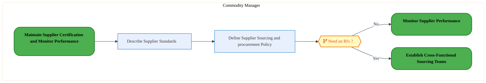

<div style="text-align:center; margin:4px 0 8px 0; font-size:11px;"><a href="https://mermaid.live/view#pako:eNqlVF1v2jAU_SuWq4qXICUhISwPm2gg0qR1qka3aRp7MM41WHXsyHZaGOW_z-YrLVufFgmUe3J8zr1X93qLqaoA5_j6essltzna9uwKaujlqLcgBnoBOgDfiOZkIcD0PIcpaWf8954WJc3a0zxWkpqLjUdnsFSAvn4M0NgdFAEyRJq-Ac1ZL-g1mtdEbwollPbsKxixkO3djp9ulK5Ad4QwzCKauqOCS-jgQZZkSenPGaBKVq9EWcpGjPZ2PjmhnuiKaLtPvzVwS9bfeWVXLmZEGHCcla3FJ7IA4Wu0uvUYbfXjqRnceB_pGjZrCOVy6fAkdJAm8qGD0nC3Q7vr67k8m6L7yVwi91BBjJkAQ8Y6ePpoEeNC5FdJMS7TMDBWqwfIr-JpNhnEAfWV5K70MPDN7T8BX65svlCiOlL7T76GPG7WgV7ncRjojfu_8AJZdU7FMB7Fo7PTTRYVUXFyYoz9l5Prq74n5uHoNR2UcTk5e0XpMC3Cv_VOZU6SbBxd9gn0I6fwQrQsy8G0a9V0mEbh26I35WAYFheiS2LhiWw6wXdFchYs06yMsjcFD36XWbaLO63oSXAwTcv0LJjdROU4flMwGUfJ6Jih01lq0qxQoepaVdxu0C2RZAn68N0_Mvo5x87UrQGatU0jOGg0U63244eIrFDjUmm121lp0Z0SnG7m-NcLgXgvYKjmi5cSlvj1qcxr8sCRb5W7GpTuuHegmdI1kRResxPHnrrZXghuXBVaGdMvW0ktV5KILs17IPWFUeqNCJfW_TqnArTljFPiFfbVnZJ5M4fhdjvHjOSM9P3l1l-49aQr9BmgcgLoC1ujD3O82x2OuOU4vMgU9fvvXXeOYXwIjwMpo0M4PIZDHz7P8Wc1x8-uSxfwDzB7PHkxKI51XvtXcPJvOP03PDyNLw5wDa4BvML5Fu8vaXeRV8BIKyzeBZi0Vs02kuJ8f5nhtqncyQknbsbqA7j7AxMT7oo=" title="View Full Diagram">&#128065; View Full Diagram</a></div>

#### BUSINESS ARCHITECTURE — 3.2.2 PM-040-020_Communicate_Requirements_to_Suppliers — PM-040-020_Communicate_Requirements_to_Suppliers

**Swim Lanes**: Commodity Manager | **Tasks**: 2 | **Gateways**: 1

> **Legend**: <span style="color:#000;background:#4CAF50;padding:2px 6px;border-radius:10px;font-weight:bold;font-size:9pt">● Start</span> · <span style="color:#fff;background:#C62828;padding:2px 6px;border-radius:10px;font-weight:bold;font-size:9pt">● End</span> · <span style="background:#E3F2FD;padding:2px 6px;border:1px solid #1565C0;font-size:9pt">User Task</span> · <span style="background:#FFF3E0;padding:2px 6px;border:1px solid #E65100;font-size:9pt">Service Task</span> · <span style="background:#FFF9C4;padding:2px 6px;border:1px solid #F57F17;font-size:9pt">◇ Gateway</span> · <span style="background:#F3E5F5;padding:2px 6px;border:1px solid #7B1FA2;font-size:9pt">Sub-Process</span>

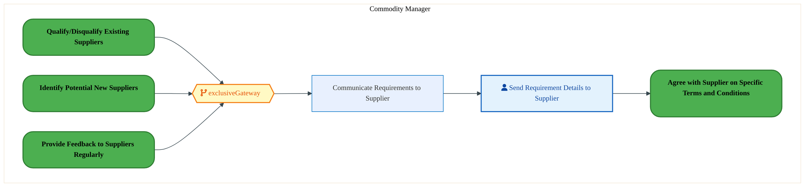

<div style="text-align:center; margin:4px 0 8px 0; font-size:11px;"><a href="https://mermaid.live/view#pako:eNqlVctu2zgU_RVCQeCNjOppuVoM4MhWUWAy6NRpZzHpgqYubSIUqZCUH2P430tafk_STbUQeI_uOfdBXmrrEVmBl3v391smmMnRtmcWUEMvR70Z1tDzUQd8x4rhGQfdcz5UCjNl_-3dwqRZOzeHlbhmfOPQKcwloG-ffTSyRO4jjYXua1CM9vxeo1iN1aaQXCrnfQdDGtB9tMOnB6kqUGeHIMhCkloqZwLOcJwlWVI6ngYiRXUlSlM6pKS3c8lxuSILrMw-_VbDI17_wyqzsDbFXIP1WZia_4lnwF2NRrUOI61aHpvBtIsjbMOmDSZMzC2eBBZSWLycoTTY7dDu_v5ZnIKip_GzQPYhHGs9Boq0sfBkaRBlnOd3STEq08DXRskXyO-iSTaOI5-4SnJbeuC75vZXwOYLk88krw6u_ZWrIY-ata_WeRT4amPfN7FAVOdIxSAaRsNTpIcsLMLiGIlS-luRbF_VE9Yvh1iTuIzK8SlWmA7SIvi_3rHMcZKNwts-gVoyAheiZVnGk3OrJoM0DN4XfSjjQVDciM6xgRXenAU_FslJsEyzMszeFezi3WbZzr4oSY6C8SQt05Ng9hCWo-hdwWQUJsNDhlZnrnCzQIWsa1kxs0GPWOA5qO67e0T477NHcU5x37UbTe32oq_w2jJlx1QYNAaDGdfISDRtm4Yzy_Z-XAhEVsAFaAUjthOX5F-wYssazRUAWjGzODkhKdC0AcIoI-gJVK0RtgkVdhaZYVLoa5XEqvzdYs7o5sOY6dduiSZrpo0dn5PsDS21tM-VTdA5f5HGrTBHf8HqPcbAMuyeLFkFqASoZpi8XBanbdnzlmPFN9fEbLs99tfdjf2ZnW6yQLAmvNVsCZ-6w_Ps7XYdy_a_W4gI9ft_2A06mElnZgczvTYH12bWmdHBDDszvjhoDjwO2BUcn26TKzh5G07fhgdvw9lxWDzfq-3uYlZ5-dbb_xLsb6MCiltuvJ3v4dbI6UYQL99fnV7bVJY5Ztie6LoDdz8BJG0Siw==" title="View Full Diagram">&#128065; View Full Diagram</a></div>

#### BUSINESS ARCHITECTURE — 3.2.3 PM-040-030_Establish_Cross-Functional_Sourcing_Teams — PM-040-030_Establish_Cross-Functional_Sourcing_Teams

**Swim Lanes**: Commodity Manager | **Tasks**: 3 | **Gateways**: 0

> **Legend**: <span style="color:#000;background:#4CAF50;padding:2px 6px;border-radius:10px;font-weight:bold;font-size:9pt">● Start</span> · <span style="color:#fff;background:#C62828;padding:2px 6px;border-radius:10px;font-weight:bold;font-size:9pt">● End</span> · <span style="background:#E3F2FD;padding:2px 6px;border:1px solid #1565C0;font-size:9pt">User Task</span> · <span style="background:#FFF3E0;padding:2px 6px;border:1px solid #E65100;font-size:9pt">Service Task</span> · <span style="background:#FFF9C4;padding:2px 6px;border:1px solid #F57F17;font-size:9pt">◇ Gateway</span> · <span style="background:#F3E5F5;padding:2px 6px;border:1px solid #7B1FA2;font-size:9pt">Sub-Process</span>

```mermaid
%%{init: {"theme": "base", "themeVariables": {"fontSize": "14px", "fontFamily": "Segoe UI, Arial, sans-serif","primaryColor": "#e8f0fe", "primaryBorderColor": "#0071c5","lineColor": "#37474F", "secondaryColor": "#f5f8fc"}, "flowchart": {"useMaxWidth": false, "htmlLabels": true, "curve": "basis", "nodeSpacing": 40, "rankSpacing": 50}} }%%
flowchart TD
    classDef startEvt fill:#4CAF50,stroke:#2E7D32,color:#000,font-weight:bold,stroke-width:2px,rx:20,ry:20
    classDef endEvt fill:#C62828,stroke:#B71C1C,color:#fff,font-weight:bold,stroke-width:2px,rx:20,ry:20
    classDef userTask fill:#E3F2FD,stroke:#1565C0,stroke-width:2px,color:#0D47A1
    classDef serviceTask fill:#FFF3E0,stroke:#E65100,stroke-width:2px,color:#BF360C
    classDef gateway fill:#FFF9C4,stroke:#F57F17,stroke-width:2px,color:#E65100
    classDef subProc fill:#F3E5F5,stroke:#7B1FA2,stroke-width:2px,color:#4A148C
    subgraph Commodity Manager
        n1["fa:fa-user Establish Cross- Functional Sourcing Teams"]
        n2["fa:fa-user Define Cross-Functional Teams and Team Members"]
        n3["fa:fa-user Finalize Sourcing Need and Evaluation Process with Team Members"]
        n4["Develop Supplier Qualification and Certification Processes"]
        n5["Maintain Supplier Certification and Monitor Performance"]
    end
    n5 --> n1
    n1 --> n2
    n2 --> n3
    n3 --> n4
    class n1 userTask
    class n2 userTask
    class n3 userTask
    class n4 startEvt
    class n5 startEvt
```

<div style="text-align:center; margin:4px 0 8px 0; font-size:11px;"><a href="https://mermaid.live/view#pako:eNqllE2P2jAQhv-KldWKS5DyuaE5VIJApEql2opteyg9mGQM1jp2ZDuwFPHfa5NAFrrbS5FAmTczz-sZbB-cQpTgpM79_YFyqlN0GOgNVDBI0WCFFQxc1ArfsaR4xUANbA4RXC_o71OaH9UvNs1qOa4o21t1AWsB6NsnF41NIXORwlwNFUhKBu6glrTCcp8JJqTNvoMR8cjJrXs1EbIE2Sd4XuIXsSlllEMvh0mURLmtU1AIXl5BSUxGpBgc7eKY2BUbLPVp-Y2COX75QUu9MTHBTIHJ2eiKfcYrYLZHLRurFY3cnodBlfXhZmCLGheUr40eeUaSmD_3Uuwdj-h4f7_kF1P0NF1yZD4Fw0pNgSCljTzbakQoY-ldlI3z2HOVluIZ0rtglkzDwC1sJ6lp3XPtcIc7oOuNTleClV3qcGd7SIP6xZUvaeC5cm9-b7yAl71T9hCMgtHFaZL4mZ-dnQgh_-Vk5iqfsHruvGZhHuTTi5cfP8SZ9zfv3OY0Ssb-7ZxAbmkBr6B5noezflSzh9j33odO8vDBy26ga6xhh_c98EMWXYB5nOR-8i6w9btdZbN6lKI4A8NZnMcXYDLx83HwLjAa-9GoW6HhrCWuNygTVSVKqvdojjleg2zf2w_3fy4dglOCh3bcaGa20opRZYqkUGqI8oYXmgqOGVqIRtpdiZ4AV2rp_HqFCa4xpg1zsDrGK8SpEmFenp7QHKoVyBtUeI3KqSk0l0Nv_wWgPDFmW8wabNHIDgyUQjuqN_9gR4Y9hS0wUaNFU9eMGoevjTEgtGhJFpyB1L3SseGGFRvWHFOuzbeHXZda2FyYq1BI9AiSCFlhXsAFZA5T-8BjNBx-NH9HF_ptGHRh0IZhF4ZtGL3aOLbkfGCu5OBtOXxbji53yZUcX2THdSowXdDSSQ_O6TI3F34JBDdMO0fXwY0Wiz0vnPR06TlNXZoDMqXY7MWqFY9_AP8-AAw=" title="View Full Diagram">&#128065; View Full Diagram</a></div>

<div class="page-footer"><span>Page 7</span><span><a href="#toc">↑ Back to TOC</a></span><span>PM-040 — Maintain Supplier Certification and Monitor Performance</span></div>
<div style="page-break-before: always;"></div>

#### BUSINESS ARCHITECTURE — 3.2.4 PM-040-040_Develop_Supplier_Qualification_and_Certification_Processes — PM-040-040_Develop_Supplier_Qualification_and_Certification_Processes

**Swim Lanes**: Commodity Manager | **Tasks**: 4 | **Gateways**: 2

> **Legend**: <span style="color:#000;background:#4CAF50;padding:2px 6px;border-radius:10px;font-weight:bold;font-size:9pt">● Start</span> · <span style="color:#fff;background:#C62828;padding:2px 6px;border-radius:10px;font-weight:bold;font-size:9pt">● End</span> · <span style="background:#E3F2FD;padding:2px 6px;border:1px solid #1565C0;font-size:9pt">User Task</span> · <span style="background:#FFF3E0;padding:2px 6px;border:1px solid #E65100;font-size:9pt">Service Task</span> · <span style="background:#FFF9C4;padding:2px 6px;border:1px solid #F57F17;font-size:9pt">◇ Gateway</span> · <span style="background:#F3E5F5;padding:2px 6px;border:1px solid #7B1FA2;font-size:9pt">Sub-Process</span>

```mermaid
%%{init: {"theme": "base", "themeVariables": {"fontSize": "14px", "fontFamily": "Segoe UI, Arial, sans-serif","primaryColor": "#e8f0fe", "primaryBorderColor": "#0071c5","lineColor": "#37474F", "secondaryColor": "#f5f8fc"}, "flowchart": {"useMaxWidth": false, "htmlLabels": true, "curve": "basis", "nodeSpacing": 40, "rankSpacing": 50}} }%%
flowchart TD
    classDef startEvt fill:#4CAF50,stroke:#2E7D32,color:#000,font-weight:bold,stroke-width:2px,rx:20,ry:20
    classDef endEvt fill:#C62828,stroke:#B71C1C,color:#fff,font-weight:bold,stroke-width:2px,rx:20,ry:20
    classDef userTask fill:#E3F2FD,stroke:#1565C0,stroke-width:2px,color:#0D47A1
    classDef serviceTask fill:#FFF3E0,stroke:#E65100,stroke-width:2px,color:#BF360C
    classDef gateway fill:#FFF9C4,stroke:#F57F17,stroke-width:2px,color:#E65100
    classDef subProc fill:#F3E5F5,stroke:#7B1FA2,stroke-width:2px,color:#4A148C
    subgraph Commodity Manager
        n1["Develop Supplier Qualification and Certification Process"]
        n2["Define Specific Selection Criteria for the RFx or Selection Event"]
        n3["Identify Ongoing Performance KPI's"]
        n4["Define Event/Activity Scoring Methodology for Decision Making"]
        n5["Identify Impacts on Existing Suppliers"]
        n6["Identify Potential New Suppliers"]
        n7["Monitor Supplier Performance"]
        n8["Establish Cross-Functional Sourcing Teams"]
        n9{{"fa:fa-code-branch Is Supplier New or Existing?"}}
        n10{{"fa:fa-arrows-alt parallelGateway"}}
    end
    n1 --> n2
    n2 --> n10
    n10 --> n3
    n10 --> n4
    n4 --> n9
    n8 --> n1
    n9 -->|"Existing"| n5
    n9 -->|"New"| n6
    n3 --> n7
    class n5 startEvt
    class n6 startEvt
    class n7 startEvt
    class n8 startEvt
    class n9 gateway
    class n10 gateway
```

<div style="text-align:center; margin:4px 0 8px 0; font-size:11px;"><a href="https://mermaid.live/view#pako:eNqlVV2TqkYQ_StTbG35ghVAEOUhKRclZSXe7L1ukoeYhxEGndphhpoZ_IjX_54eQFGz-xQeLPpM9-nTPXZzslKRESuynp9PlFMdoVNPb0lBehHqrbEiPRs1wB9YUrxmRPWMTy64XtJ_ajfXLw_GzWAJLig7GnRJNoKg3-c2mkAgs5HCXPUVkTTv2b1S0gLLYyyYkMb7iYxyJ6-ztUcvQmZEdg6OE7ppAKGMctLBg9AP_cTEKZIKnt2R5kE-ytPe2YhjYp9usdS1_EqRBT78STO9BTvHTBHw2eqC_YrXhJkatawMllZyd2kGVSYPh4YtS5xSvgHcdwCSmL93UOCcz-j8_Lzi16TobbriCJ6UYaWmJEdKAzzbaZRTxqInP54kgWMrLcU7iZ68WTgdeHZqKomgdMc2ze3vCd1sdbQWLGtd-3tTQ-SVB1seIs-x5RF-H3IRnnWZ4qE38kbXTC-hG7vxJVOe5_8rE_RVvmH13uaaDRIvmV5zucEwiJ3_8l3KnPrhxH3sE5E7mpIb0iRJBrOuVbNh4Dqfk74kg6ETP5BusCZ7fOwIx7F_JUyCMHHDTwmbfI8qq_WrFOmFcDALkuBKGL64ycT7lNCfuP6oVQg8G4nLLYpFUYiM6iNaYI43RDbn5uHuXytrSnaEiRItq7JklEj0tcKM5jTFmgqOMM9QTKTuECOPKLWy_r5h8mqmHAYKLUuSGm-0JIykdUgsqYZxxSgXEsEOQN-SA4LXzmO2I1zfUw6Acp4BTPMj-o1vBMwEeiUSOArMU4J-eZ33HmT4nYya8YcJ0O9M8ctUSEOwIHorMujX5lirmYJYZRQs8Duc39MFtxLmBcylVsioPVClDdulaQ8yhrdxr0KbN8zQF7L_LCKEiIWAtWm6crmJm2LvvUfgPYO5XzOq4IalUKqfVLxuJeRZikqaDYLeCC4eEo1Pp5WV4yjHfbOv-2vYOOkWzVWX1sgEGZcif1pZ5_Ptn8bpKLCUYq_6mGlUYokZI-znZiK6INgZzQt3Ub__I_xXWtNrTNe5HDsNMHiw_db2G3PcmqM2vDXHxvwOfWllr6zvcIEPh1BajQ9bfNBwhDdDCEHXlXoHDz-Gw4_h0cfw-LIx7lCotIUt2yoIXDnNrOhk1Z9L-KRmJMcV09bZtnClxfLIUyuqPytWVWYQOaUYpr1owPO_yzBsIg==" title="View Full Diagram">&#128065; View Full Diagram</a></div>

#### BUSINESS ARCHITECTURE — 3.2.5 PM-040-050_Identify_Potential_New_Suppliers — PM-040-050_Identify_Potential_New_Suppliers

**Swim Lanes**: Commodity Manager | **Tasks**: 2 | **Gateways**: 0

> **Legend**: <span style="color:#000;background:#4CAF50;padding:2px 6px;border-radius:10px;font-weight:bold;font-size:9pt">● Start</span> · <span style="color:#fff;background:#C62828;padding:2px 6px;border-radius:10px;font-weight:bold;font-size:9pt">● End</span> · <span style="background:#E3F2FD;padding:2px 6px;border:1px solid #1565C0;font-size:9pt">User Task</span> · <span style="background:#FFF3E0;padding:2px 6px;border:1px solid #E65100;font-size:9pt">Service Task</span> · <span style="background:#FFF9C4;padding:2px 6px;border:1px solid #F57F17;font-size:9pt">◇ Gateway</span> · <span style="background:#F3E5F5;padding:2px 6px;border:1px solid #7B1FA2;font-size:9pt">Sub-Process</span>

```mermaid
%%{init: {"theme": "base", "themeVariables": {"fontSize": "14px", "fontFamily": "Segoe UI, Arial, sans-serif","primaryColor": "#e8f0fe", "primaryBorderColor": "#0071c5","lineColor": "#37474F", "secondaryColor": "#f5f8fc"}, "flowchart": {"useMaxWidth": false, "htmlLabels": true, "curve": "basis", "nodeSpacing": 40, "rankSpacing": 50}} }%%
flowchart TD
    classDef startEvt fill:#4CAF50,stroke:#2E7D32,color:#000,font-weight:bold,stroke-width:2px,rx:20,ry:20
    classDef endEvt fill:#C62828,stroke:#B71C1C,color:#fff,font-weight:bold,stroke-width:2px,rx:20,ry:20
    classDef userTask fill:#E3F2FD,stroke:#1565C0,stroke-width:2px,color:#0D47A1
    classDef serviceTask fill:#FFF3E0,stroke:#E65100,stroke-width:2px,color:#BF360C
    classDef gateway fill:#FFF9C4,stroke:#F57F17,stroke-width:2px,color:#E65100
    classDef subProc fill:#F3E5F5,stroke:#7B1FA2,stroke-width:2px,color:#4A148C
    subgraph Commodity Manager
        n1["fa:fa-user Identify Potential New Suppliers"]
        n2["fa:fa-user Generate Supplier list"]
        n3["Communicate Requirements to Suppliers"]
        n4["Maintain Supplier Certification and Monitor Performance"]
    end
    n4 --> n1
    n1 --> n2
    n2 --> n3
    class n1 userTask
    class n2 userTask
    class n3 startEvt
    class n4 startEvt
```

<div style="text-align:center; margin:4px 0 8px 0; font-size:11px;"><a href="https://mermaid.live/view#pako:eNqlVE2P2jAQ_StWViiXIOWT0BwqQSBVpVKtyrY9lB5MMgZrHTu1nWUp4r_X5iMstJwaKVHm5c17M5Nkdk4pKnAyp9fbUU51hnauXkMNbobcJVbgeugIfMOS4iUD5VoOEVzP6e8DLYibV0uzWIFryrYWncNKAPr60UMjk8g8pDBXfQWSEtdzG0lrLLe5YEJa9gMMiU8ObqdHYyErkBeC76dBmZhURjlc4CiN07iweQpKwasrUZKQISndvS2OiU25xlIfym8VzPDrd1rptYkJZgoMZ61r9gkvgdketWwtVrby5TwMqqwPNwObN7ikfGXw2DeQxPz5AiX-fo_2vd6Cd6boabLgyBwlw0pNgCClDTx90YhQxrKHOB8Vie8pLcUzZA_hNJ1EoVfaTjLTuu_Z4fY3QFdrnS0Fq07U_sb2kIXNqydfs9D35NZcb7yAVxenfBAOw2HnNE6DPMjPToSQ_3Iyc5VPWD2fvKZRERaTzitIBknu_613bnMSp6Pgdk4gX2gJb0SLooiml1FNB0ng3xcdF9HAz29EV1jDBm8vgu_yuBMskrQI0ruCR7_bKtvloxTlWTCaJkXSCabjoBiFdwXjURAPTxUanZXEzRrloq5FRfUWzTDHK5DH5_bgwY-FQ3BGcN-OG32sgGtKtuhRaHuHGfoMGzRvm4ZRkGrh_HyTHF4nfwAO0kyjoyNGlb5OiUyKrafltLTUL_CrpdKsBK4V0uKeU2zSZphybc6LfA7SFGuFqOAI8wrNhNk7QqJHkETIGvMSOiHz5R5veIz6_fem91MYHMPwFIbHMHrzWizn_DleweG_4aj7Ja_guIMdz6nB1EcrJ9s5h51o9mYFBLdMO3vPwa0W8y0vneywO5y2qcy4JhSbV1ofwf0faBXCfQ==" title="View Full Diagram">&#128065; View Full Diagram</a></div>

#### BUSINESS ARCHITECTURE — 3.2.6 PM-040-060_Identify_Impacts_on_Existing_Suppliers — PM-040-060_Identify_Impacts_on_Existing_Suppliers

**Swim Lanes**: Commodity Manager | **Tasks**: 3 | **Gateways**: 0

> **Legend**: <span style="color:#000;background:#4CAF50;padding:2px 6px;border-radius:10px;font-weight:bold;font-size:9pt">● Start</span> · <span style="color:#fff;background:#C62828;padding:2px 6px;border-radius:10px;font-weight:bold;font-size:9pt">● End</span> · <span style="background:#E3F2FD;padding:2px 6px;border:1px solid #1565C0;font-size:9pt">User Task</span> · <span style="background:#FFF3E0;padding:2px 6px;border:1px solid #E65100;font-size:9pt">Service Task</span> · <span style="background:#FFF9C4;padding:2px 6px;border:1px solid #F57F17;font-size:9pt">◇ Gateway</span> · <span style="background:#F3E5F5;padding:2px 6px;border:1px solid #7B1FA2;font-size:9pt">Sub-Process</span>

```mermaid
%%{init: {"theme": "base", "themeVariables": {"fontSize": "14px", "fontFamily": "Segoe UI, Arial, sans-serif","primaryColor": "#e8f0fe", "primaryBorderColor": "#0071c5","lineColor": "#37474F", "secondaryColor": "#f5f8fc"}, "flowchart": {"useMaxWidth": false, "htmlLabels": true, "curve": "basis", "nodeSpacing": 40, "rankSpacing": 50}} }%%
flowchart TD
    classDef startEvt fill:#4CAF50,stroke:#2E7D32,color:#000,font-weight:bold,stroke-width:2px,rx:20,ry:20
    classDef endEvt fill:#C62828,stroke:#B71C1C,color:#fff,font-weight:bold,stroke-width:2px,rx:20,ry:20
    classDef userTask fill:#E3F2FD,stroke:#1565C0,stroke-width:2px,color:#0D47A1
    classDef serviceTask fill:#FFF3E0,stroke:#E65100,stroke-width:2px,color:#BF360C
    classDef gateway fill:#FFF9C4,stroke:#F57F17,stroke-width:2px,color:#E65100
    classDef subProc fill:#F3E5F5,stroke:#7B1FA2,stroke-width:2px,color:#4A148C
    subgraph Commodity Manager
        n1["Evaluate Existing Supplier"]
        n2["Identify Impact on Existing Supplier"]
        n3["Determine Supplier's Ability to Meet the Criteria"]
        n4["Qualify/Disqualify Existing Suppliers"]
        n5["Develop Supplier Qualification and Certification Processes"]
    end
    n2 --> n3
    n3 --> n4
    n5 --> n1
    n1 --> n2
    class n4 startEvt
    class n5 startEvt
```

<div style="text-align:center; margin:4px 0 8px 0; font-size:11px;"><a href="https://mermaid.live/view#pako:eNqlVE2PmzAQ_SsWq4gLUflcUg6VEgjSSl2pVbbtoduDA0NirbGpbfLRKP-9dkhgk9Wqh3JAzOPNezPjj4NV8BKsxBqNDoQRlaCDrdZQg50ge4kl2A7qgO9YELykIG3DqThTC_LnRPPCZmdoBstxTejeoAtYcUDfHhw01YnUQRIzOZYgSGU7diNIjcU-5ZQLw76DSeVWJ7fzrxkXJYiB4LqxV0Q6lRIGAxzEYRzmJk9CwVl5JVpF1aQq7KMpjvJtscZCncpvJTzi3Q9SqrWOK0wlaM5a1fQzXgI1PSrRGqxoxeYyDCKND9MDWzS4IGyl8dDVkMDsZYAi93hEx9HomfWm6Cl7Zkg_BcVSZlAhqTQ83yhUEUqTuzCd5pHrSCX4CyR3_jzOAt8pTCeJbt11zHDHWyCrtUqWnJZn6nhrekj8ZueIXeK7jtjr940XsHJwSu_9iT_pnWaxl3rpxamqqv9y0nMVT1i-nL3mQe7nWe_lRfdR6r7Vu7SZhfHUu50TiA0p4JVonufBfBjV_D7y3PdFZ3lw76Y3oiusYIv3g-DHNOwF8yjOvfhdwc7vtsp2-UXw4iIYzKM86gXjmZdP_XcFw6kXTs4Vap2VwM0apbyueUnUHj1ihlcguv_mYd7PZ2u-wbTVXaD5jkil9x1atE1DiSZav15xfc19KIEpUu3RQ633qEKc_Ssr0FkZKBC1Pms9x5ZouiTUFKU4egRQSN8MKBVEMwm-lgi1xNcWU-37ISPyd_f51lhep0Un5w1Q3vQU1OmQAiuia8esRCkINSBm9CAlDFp6x3cfzEfj8Sfd0TkMujA8h1EXnjcd87rQf7W6mtuf1Ss46mHLsWo9KkxKKzlYp8tSX6glVLilyjo6Fm4VX-xZYSWnS8Vqm1IvXUawXuu6A49_AafZyWI=" title="View Full Diagram">&#128065; View Full Diagram</a></div>

<div class="page-footer"><span>Page 8</span><span><a href="#toc">↑ Back to TOC</a></span><span>PM-040 — Maintain Supplier Certification and Monitor Performance</span></div>
<div style="page-break-before: always;"></div>

#### BUSINESS ARCHITECTURE — 3.2.7 PM-040-080_Assess_Suppliers — PM-040-080_Assess_Suppliers

**Swim Lanes**: Commodity Manager | **Tasks**: 5 | **Gateways**: 2

> **Legend**: <span style="color:#000;background:#4CAF50;padding:2px 6px;border-radius:10px;font-weight:bold;font-size:9pt">● Start</span> · <span style="color:#fff;background:#C62828;padding:2px 6px;border-radius:10px;font-weight:bold;font-size:9pt">● End</span> · <span style="background:#E3F2FD;padding:2px 6px;border:1px solid #1565C0;font-size:9pt">User Task</span> · <span style="background:#FFF3E0;padding:2px 6px;border:1px solid #E65100;font-size:9pt">Service Task</span> · <span style="background:#FFF9C4;padding:2px 6px;border:1px solid #F57F17;font-size:9pt">◇ Gateway</span> · <span style="background:#F3E5F5;padding:2px 6px;border:1px solid #7B1FA2;font-size:9pt">Sub-Process</span>

```mermaid
%%{init: {"theme": "base", "themeVariables": {"fontSize": "14px", "fontFamily": "Segoe UI, Arial, sans-serif","primaryColor": "#e8f0fe", "primaryBorderColor": "#0071c5","lineColor": "#37474F", "secondaryColor": "#f5f8fc"}, "flowchart": {"useMaxWidth": false, "htmlLabels": true, "curve": "basis", "nodeSpacing": 40, "rankSpacing": 50}} }%%
flowchart TD
    classDef startEvt fill:#4CAF50,stroke:#2E7D32,color:#000,font-weight:bold,stroke-width:2px,rx:20,ry:20
    classDef endEvt fill:#C62828,stroke:#B71C1C,color:#fff,font-weight:bold,stroke-width:2px,rx:20,ry:20
    classDef userTask fill:#E3F2FD,stroke:#1565C0,stroke-width:2px,color:#0D47A1
    classDef serviceTask fill:#FFF3E0,stroke:#E65100,stroke-width:2px,color:#BF360C
    classDef gateway fill:#FFF9C4,stroke:#F57F17,stroke-width:2px,color:#E65100
    classDef subProc fill:#F3E5F5,stroke:#7B1FA2,stroke-width:2px,color:#4A148C
    subgraph Commodity Manager
        n1["fa:fa-user Process Supplier Quotations"]
        n2["fa:fa-user Certify Suppliers for Quality Programs"]
        n3["Assess Suppliers"]
        n4["Perform Total Cost Model Analysis"]
        n5["Conduct Final Assessment Based on Consolidation Data"]
        n6["Supplier Selection"]
        n7["Manage Quotation"]
        n8{{"fa:fa-code-branch Quality Assessment needed?"}}
        n9{{"fa:fa-code-branch exclusiveGateway"}}
    end
    n7 --> n3
    n3 --> n1
    n1 --> n4
    n4 --> n5
    n2 --> n9
    n5 --> n8
    n9 --> n6
    n8 -->|"Yes"| n2
    n8 -->|"No"| n9
    class n1 userTask
    class n2 userTask
    class n6 startEvt
    class n7 startEvt
    class n8 gateway
    class n9 gateway
```

<div style="text-align:center; margin:4px 0 8px 0; font-size:11px;"><a href="https://mermaid.live/view#pako:eNqlVU2P4jgQ_StWWi0uQUpCQkIOu4JARiNtr2ZF745GyxxMUgGrHRvZTjcMw3_fMgmf230aDoj3UvVeVeFy9k4hS3BS5_FxzwQzKdn3zBpq6KWkt6Qaei5piX-oYnTJQfdsTCWFmbMfxzA_3GxtmOVyWjO-s-wcVhLI359dMsZE7hJNhe5rUKzqub2NYjVVu0xyqWz0AySVVx3dukcTqUpQlwDPi_0iwlTOBFzoQRzGYW7zNBRSlDeiVVQlVdE72OK4fCvWVJlj-Y2GJ7r9ykqzRlxRrgFj1qbmf9AlcNujUY3lika9nobBtPUROLD5hhZMrJAPPaQUFS8XKvIOB3J4fFyIsyl5ni4EwU_BqdZTqIg2SM9eDakY5-lDmI3zyHO1UfIF0odgFk8HgVvYTlJs3XPtcPtvwFZrky4lL7vQ_pvtIQ02W1dt08Bz1Q6_77xAlBenbBgkQXJ2msR-5mcnp6qqfskJ56qeqX7pvGaDPMinZy8_GkaZ93-9U5vTMB7793MC9coKuBLN83wwu4xqNox872PRST4Yetmd6IoaeKO7i-AoC8-CeRTnfvyhYOt3X2Wz_KJkcRIczKI8OgvGEz8fBx8KhmM_TLoKUWel6GZNMlnXsmRmR56ooCtQ7XP7Ef6_C6eiaUX7dtzEGoPWZN5sNpwh8VcjDTVMCr1wvl_lBbd5GSjDqt05T5NK2mTKrS2qYiX1ncQAJcZaX9vdRYQY8QUUStXkGevg2Io25AmXhpOxoHyHa3SbEmFKhqvbFIbkDENIa1GDMGSCd1BJpEAZoSVn5bEzMqWG3qoMUeU8gjlwKGzgbUyMMe08L0O6jUj2-9OQ7MXYX-JqF-vzVK4KEwAllL8vnMPhKn_0fj5sC95o9gqf2pN3ycLdbH-ImPT7v-GIOzhoYbcPwm9h2MGwhVEHgxaOOhi1MOngqIXDDiYW_lw43wD_iJ-YfMf_KY_06OqMW__Tbt_Qwfv08Hy_3dDx-3RyWsgbdnRiHdepQdWUlU66d44vI3xhlVDRhhvn4Dq0MXK-E4WTHi9tp9ngKYEpo_YEt-ThP4vhM7o=" title="View Full Diagram">&#128065; View Full Diagram</a></div>

<div class="page-footer"><span>Page 9</span><span><a href="#toc">↑ Back to TOC</a></span><span>PM-040 — Maintain Supplier Certification and Monitor Performance</span></div>
<div style="page-break-before: always;"></div>

#### BUSINESS ARCHITECTURE — 3.2.8 PM-040-090_Certify_Suppliers_for_Quality_Programs — PM-040-090_Certify_Suppliers_for_Quality_Programs

**Swim Lanes**: Commodity Manager | **Tasks**: 6 | **Gateways**: 3

> **Legend**: <span style="color:#000;background:#4CAF50;padding:2px 6px;border-radius:10px;font-weight:bold;font-size:9pt">● Start</span> · <span style="color:#fff;background:#C62828;padding:2px 6px;border-radius:10px;font-weight:bold;font-size:9pt">● End</span> · <span style="background:#E3F2FD;padding:2px 6px;border:1px solid #1565C0;font-size:9pt">User Task</span> · <span style="background:#FFF3E0;padding:2px 6px;border:1px solid #E65100;font-size:9pt">Service Task</span> · <span style="background:#FFF9C4;padding:2px 6px;border:1px solid #F57F17;font-size:9pt">◇ Gateway</span> · <span style="background:#F3E5F5;padding:2px 6px;border:1px solid #7B1FA2;font-size:9pt">Sub-Process</span>

```mermaid
%%{init: {"theme": "base", "themeVariables": {"fontSize": "14px", "fontFamily": "Segoe UI, Arial, sans-serif","primaryColor": "#e8f0fe", "primaryBorderColor": "#0071c5","lineColor": "#37474F", "secondaryColor": "#f5f8fc"}, "flowchart": {"useMaxWidth": false, "htmlLabels": true, "curve": "basis", "nodeSpacing": 40, "rankSpacing": 50}} }%%
flowchart TD
    classDef startEvt fill:#4CAF50,stroke:#2E7D32,color:#000,font-weight:bold,stroke-width:2px,rx:20,ry:20
    classDef endEvt fill:#C62828,stroke:#B71C1C,color:#fff,font-weight:bold,stroke-width:2px,rx:20,ry:20
    classDef userTask fill:#E3F2FD,stroke:#1565C0,stroke-width:2px,color:#0D47A1
    classDef serviceTask fill:#FFF3E0,stroke:#E65100,stroke-width:2px,color:#BF360C
    classDef gateway fill:#FFF9C4,stroke:#F57F17,stroke-width:2px,color:#E65100
    classDef subProc fill:#F3E5F5,stroke:#7B1FA2,stroke-width:2px,color:#4A148C
    subgraph Commodity Manager
        n1["fa:fa-user Certify Suppliers for Quality Programs"]
        n2["fa:fa-user Set Qualification Criteria and Standard for Suppliers"]
        n3["fa:fa-user Gather Supplier Qualification Data"]
        n4["fa:fa-user Approve Supplier Qualification"]
        n5["fa:fa-user Provide Feedback to the Supplier"]
        n6["fa:fa-user Update Item to BOM AML"]
        n7["Identify Preferred and Secondary Suppliers"]
        n8["Maintain Supplier Certification and Monitor Performance"]
        n9["Define Supplier Standards"]
        n10["Develop Supplier Qualification and Certification Processes"]
        n11{{"fa:fa-code-branch exclusiveGateway"}}
        n12{{"fa:fa-code-branch exclusiveGateway"}}
        n13{{"fa:fa-code-branch Is Supplier Qualified?"}}
    end
    n8 --> n11
    n11 --> n1
    n9 --> n11
    n1 --> n2
    n2 --> n12
    n12 --> n3
    n3 --> n13
    n10 --> n11
    n13 -->|"Yes"| n4
    n13 -->|"No"| n5
    n4 --> n6
    n6 --> n7
    n5 --> n12
    class n1 userTask
    class n2 userTask
    class n3 userTask
    class n4 userTask
    class n5 userTask
    class n6 userTask
    class n7 startEvt
    class n8 startEvt
    class n9 startEvt
    class n10 startEvt
    class n11 gateway
    class n12 gateway
    class n13 gateway
```

<div style="text-align:center; margin:4px 0 8px 0; font-size:11px;"><a href="https://mermaid.live/view#pako:eNqlVl2P6jYQ_StWVitegpRPwuahFRvI1UqXdivuh6rSB5NMwNokjmyHhXL577XzQTa54aVFAjHHc86MT5xJLlpEY9B87fHxQnIifHSZiANkMPHRZIc5THRUA98wI3iXAp-onITmYkP-qdJMpzipNIWFOCPpWaEb2FNAX190tJDEVEcc53zKgZFkok8KRjLMzgFNKVPZDzBPjKSq1iw9UxYD6xIMwzMjV1JTkkMH257jOaHicYhoHvdEEzeZJ9HkqppL6Xt0wExU7Zcc1vj0ncTiIOMEpxxkzkFk6We8g1TtUbBSYVHJjq0ZhKs6uTRsU-CI5HuJO4aEGM7fOsg1rld0fXzc5rei6MtymyP5iVLM-RISxIWEV0eBEpKm_oMTLELX0Llg9A38B2vlLW1Lj9ROfLl1Q1fmTt-B7A_C39E0blKn72oPvlWcdHbyLUNnZ_k7qAV53FUKZtbcmt8qPXtmYAZtpSRJ_lcl6Sv7gvlbU2tlh1a4vNUy3ZkbGD_rtdtcOt7CHPoE7Egi-CAahqG96qxazVzTuC_6HNozIxiI7rGAd3zuBJ8C5yYYul5oencF63rDLsvdK6NRK2iv3NC9CXrPZriw7go6C9OZNx1KnT3DxQEFNMtoTMQZrXGO98DqdfXJzb-2WoL9BE-V3SgAJkhyRpuyKFICjKOEMvRHiVNFl21JxYxvtb8_SFh9iQ2ImpCQCAtCcxQwIuStihHOY7QRWN1YcSV8K9NXtPuKn7AcGl3yQH2JBe7TnT59URSMHuEOv091-1S54SOJAYUA8Q5Hb0hQJHu5SfXJsz75axHLo4FeBGSK9_z7Gi3Wn_sUT1JeYsgr018ZJMAYxLVR7Qi659JccteY5EJ-u83VV7A1RwmtqZzF0uxXYNLzDOcR9IWepJA8eHIUdjLtZRrUNI0q9wgpLe5dEFWz34U6zsA5DMXMy6V1TD05pjs5-6IDglOUlpwc4VN9a2216_UjzfpvNHuc9sJ_2gjEv3ZkOfDqP_kcTae_qLab2DQboImfhut1bDWh1Sy3sdkAdhPbzXobm8ZQr8r4sdX-VE7-kAd9uPAbrXC3wZ1aYNaEszr0mtDt91PNH9V0O3d7sDUO2-OwMw674_BsHPZuz7UePB-Hn8ZhaeI4braDuw9b47DdwpquZSBvIhJr_kWrXmbkC08MCS5ToV11DZeCbs55pPnVQ18rqymwJFhNzhq8_guBQuv9" title="View Full Diagram">&#128065; View Full Diagram</a></div>

<div class="page-footer"><span>Page 10</span><span><a href="#toc">↑ Back to TOC</a></span><span>PM-040 — Maintain Supplier Certification and Monitor Performance</span></div>
<div style="page-break-before: always;"></div>

#### BUSINESS ARCHITECTURE — 3.2.9 PM-040-100_Communicate_Approval — PM-040-100_Communicate_Approval

**Swim Lanes**: Commodity Manager | **Tasks**: 2 | **Gateways**: 2

> **Legend**: <span style="color:#000;background:#4CAF50;padding:2px 6px;border-radius:10px;font-weight:bold;font-size:9pt">● Start</span> · <span style="color:#fff;background:#C62828;padding:2px 6px;border-radius:10px;font-weight:bold;font-size:9pt">● End</span> · <span style="background:#E3F2FD;padding:2px 6px;border:1px solid #1565C0;font-size:9pt">User Task</span> · <span style="background:#FFF3E0;padding:2px 6px;border:1px solid #E65100;font-size:9pt">Service Task</span> · <span style="background:#FFF9C4;padding:2px 6px;border:1px solid #F57F17;font-size:9pt">◇ Gateway</span> · <span style="background:#F3E5F5;padding:2px 6px;border:1px solid #7B1FA2;font-size:9pt">Sub-Process</span>

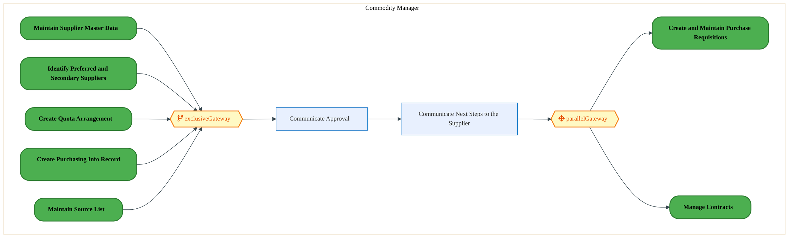

<div style="text-align:center; margin:4px 0 8px 0; font-size:11px;"><a href="https://mermaid.live/view#pako:eNqlVU2P4jgQ_StWWi0uQUpCQugcVqKBrFqaGfUsszuHYQ8mKYPVxs7YDh-D-O9bhgBNhj5tJD7q-dV7rlLK3nuFKsHLvMfHPZfcZmTfsUtYQScjnTk10PHJCfiHak7nAkzHcZiSdsp_HWlhXG0dzWE5XXGxc-gUFgrI3y8-GWKi8Imh0nQNaM46fqfSfEX1bqSE0o79AAMWsKNbs_SsdAn6SgiCNCwSTBVcwhXupXEa5y7PQKFkeSPKEjZgRefgNifUplhSbY_brw18ptvvvLRLjBkVBpCztCvxic5BuBqtrh1W1Hp9bgY3zkdiw6YVLbhcIB4HCGkq365QEhwO5PD4OJMXU_JtPJMEn0JQY8bAiLEIT9aWMC5E9hCPhnkS-MZq9QbZQzRJx73IL1wlGZYe-K653Q3wxdJmcyXKhtrduBqyqNr6eptFga93-N3yAllenUb9aBANLk7PaTgKR2cnxtj_csK-6m_UvDVek14e5eOLV5j0k1Hwu965zHGcDsN2n0CveQHvRPM8702urZr0kzD4WPQ57_WDUUt0QS1s6O4q-DSKL4J5kuZh-qHgya-9y3r-qlVxFuxNkjy5CKbPYT6MPhSMh2E8aHaIOgtNqyUZqdVKldzuyGcq6QL0ad09Mvwx89x6LXmBhZBhVWm1pmLm_fuOFbVYX2BrydRCZYhVBEeaTOuqEhylb_J6Lk-DS6GyRHsuLX7Ia63xVTZA_oKfNTfcciXNbWqMqaft4v6l1bSwLUZyZDSKZ3_0MBZ_xtTSW3of6S8lSMvZjrxqYKA1lMd9Tc_TfpFpWaXXOr7WylI8hnBMF3iSSXvLHFyZTZE4x-RFMoW1FngM3dKfbmpQmAHkEzct0TDY72ceoxmjXXfEdufoXiwJbAtRG76GP0_v4Mw7HN6nhdc0qrXamC4VllRUUyFA_JaEo336IxPS7f7hfJs4PMVRE0bNcjNfst-mBw3QxGlrfdCKn9r5jV-vFcfvJgVXL-feDRzfh5P7cP8-nN6HB_fhp_swtqE5HG7h8Ax7vrcCvaK89LK9d7wZ8fYsgdFaWO_ge7S2arqThZcdbxCvrkrMHHOKg706gYf_ANejXJk=" title="View Full Diagram">&#128065; View Full Diagram</a></div>

<div class="page-footer"><span>Page 11</span><span><a href="#toc">↑ Back to TOC</a></span><span>PM-040 — Maintain Supplier Certification and Monitor Performance</span></div>
<div style="page-break-before: always;"></div>

#### BUSINESS ARCHITECTURE — 3.2.10 PM-040-120_Identify_Preferred_and_Secondary_Suppliers — PM-040-120_Identify_Preferred_and_Secondary_Suppliers

**Swim Lanes**: Commodity Manager | **Tasks**: 6 | **Gateways**: 7

> **Legend**: <span style="color:#000;background:#4CAF50;padding:2px 6px;border-radius:10px;font-weight:bold;font-size:9pt">● Start</span> · <span style="color:#fff;background:#C62828;padding:2px 6px;border-radius:10px;font-weight:bold;font-size:9pt">● End</span> · <span style="background:#E3F2FD;padding:2px 6px;border:1px solid #1565C0;font-size:9pt">User Task</span> · <span style="background:#FFF3E0;padding:2px 6px;border:1px solid #E65100;font-size:9pt">Service Task</span> · <span style="background:#FFF9C4;padding:2px 6px;border:1px solid #F57F17;font-size:9pt">◇ Gateway</span> · <span style="background:#F3E5F5;padding:2px 6px;border:1px solid #7B1FA2;font-size:9pt">Sub-Process</span>

```mermaid
%%{init: {"theme": "base", "themeVariables": {"fontSize": "14px", "fontFamily": "Segoe UI, Arial, sans-serif","primaryColor": "#e8f0fe", "primaryBorderColor": "#0071c5","lineColor": "#37474F", "secondaryColor": "#f5f8fc"}, "flowchart": {"useMaxWidth": false, "htmlLabels": true, "curve": "basis", "nodeSpacing": 40, "rankSpacing": 50}} }%%
flowchart TD
    classDef startEvt fill:#4CAF50,stroke:#2E7D32,color:#000,font-weight:bold,stroke-width:2px,rx:20,ry:20
    classDef endEvt fill:#C62828,stroke:#B71C1C,color:#fff,font-weight:bold,stroke-width:2px,rx:20,ry:20
    classDef userTask fill:#E3F2FD,stroke:#1565C0,stroke-width:2px,color:#0D47A1
    classDef serviceTask fill:#FFF3E0,stroke:#E65100,stroke-width:2px,color:#BF360C
    classDef gateway fill:#FFF9C4,stroke:#F57F17,stroke-width:2px,color:#E65100
    classDef subProc fill:#F3E5F5,stroke:#7B1FA2,stroke-width:2px,color:#4A148C
    subgraph Commodity Manager
        n1["fa:fa-user Update Preferred Supplier's Application"]
        n2["fa:fa-user Update Pricing to S4 from CWB/RFX UI"]
        n3["fa:fa-user Update Appropriate System"]
        n4[["fa:fa-cog Update Speed AML with Preferred/ secondary"]]
        n5[["fa:fa-cog Update Alternate Suppliers in Windchill"]]
        n6["Identify Preferred and Secondary Suppliers"]
        n7(["fa:fa-stop Speed AML Updated"])
        n8(["fa:fa-stop Alternate Suppliers Updated in Windchill"])
        n9["Create and Maintain Purchase Requisitions"]
        n10["Secondary Supplier Identified"]
        n11["Preferred Supplier Identified"]
        n12["Create Service Agreement"]
        n13["Create Scheduling Agreement"]
        n14["Create Purchasing Info Record"]
        n15["Maintain Source List"]
        n16["Certify Suppliers for Quality Programs"]
        n17{{"fa:fa-code-branch Prioritize/ group suppliers based on Sourcing strategy?"}}
        n18{{"fa:fa-code-branch exclusiveGateway"}}
        n19{{"fa:fa-code-branch exclusiveGateway"}}
        n20{{"fa:fa-code-branch exclusiveGateway"}}
        n21{{"fa:fa-code-branch exclusiveGateway"}}
        n22{{"fa:fa-arrows-alt parallelGateway"}}
        n23{{"fa:fa-arrows-alt parallelGateway"}}
    end
    n6 --> n17
    n18 --> n3
    n10 --> n18
    n11 --> n18
    n17 -->|"Preferred"| n11
    n16 --> n6
    n1 --> n9
    n2 --> n23
    n23 --> n12
    n23 --> n13
    n23 --> n14
    n23 --> n15
    n5 --> n8
    n4 --> n7
    n22 -->|"Indirect"| n1
    n22 -->|"Direct"| n19
    n17 -->|"Secondary 
(If Required)"| n10
    n3 --> n22
    n20 --> n2
    n21 --> n5
    n21 --> n20
    n22 -->|"Spares"| n21
    n19 --> n4
    n19 --> n20
    class n1 userTask
    class n2 userTask
    class n3 userTask
    class n4 serviceTask
    class n5 serviceTask
    class n7 endEvt
    class n8 endEvt
    class n9 startEvt
    class n10 startEvt
    class n11 startEvt
    class n12 startEvt
    class n13 startEvt
    class n14 startEvt
    class n15 startEvt
    class n16 startEvt
    class n17 gateway
    class n18 gateway
    class n19 gateway
    class n20 gateway
    class n21 gateway
    class n22 gateway
    class n23 gateway
```

<div style="text-align:center; margin:4px 0 8px 0; font-size:11px;"><a href="https://mermaid.live/view#pako:eNqlV1tv4jgY_StWqooZCdRcCeRhVzSQVaVW6gwz25WGfTCJA1aDnbWdAsPw39cmV9LkYbtIrfiOz3e-i6-ctJBGSPO029sTJlh44DQQW7RDAw8M1pCjwRDkwJ-QYbhOEB8oTkyJWOKfF5phpwdFU1gAdzg5KnSJNhSB7w9DMJOOyRBwSPiII4bjwXCQMryD7OjThDLFvkGTWI8v0Yqhe8oixGqCrrtG6EjXBBNUw5Zru3ag_DgKKYmuRGMnnsTh4KySS-g-3EImLulnHD3BwwuOxFbaMUw4kpyt2CWPcI0SVaNgmcLCjL2VzcBcxSGyYcsUhphsJG7rEmKQvNaQo5_P4Hx7uyJVUPBtviJAfsIEcj5HMeBCwos3AWKcJN6N7c8CRx9ywegr8m7MhTu3zGGoKvFk6fpQNXe0R3izFd6aJlFBHe1VDZ6ZHobs4Jn6kB3l_1YsRKI6kj82J-akinTvGr7hl5HiOP5fkWRf2TfIX4tYCyswg3kVy3DGjq-_1yvLnNvuzGj3CbE3HKKGaBAE1qJu1WLsGHq_6H1gjXW_JbqBAu3hsRac-nYlGDhuYLi9gnm8dpbZ-pnRsBS0Fk7gVILuvRHMzF5Be2bYkyJDqbNhMN0Cn-52NMLiCJ4ggRvE8nH1IcaPlRZDL4Yj1W7wPY1kOeCZoRgxhiKwzNI0wYgNOJipbyEUmJKV9ndDw-zRwGoNA0HB0gYxozvgv9zffQ3-khv5WsDqFJDxGJUbWH1fHrlAu2sv-0flFtJN6bVMkUx79vQI9lhs60ruQLWnpUxTx-nUmSUCMXJRLFrAASbgBZMo3MqZaYmMpcZDhIjA8bHRPkhkC8u4tdJ1Ie6nKgEuaNooIc8lkvTPDf6kxe9KtfBsp9yUmUoVnyHlp9J8gpgI-QeeMybPGY7AV_RPhjlWE97K2NCl7_u6QNEBfEm5yVfL7P2i6uebdW7LfNOC2YYheXUQ0aJaDWq4RVGWqFXXx7ZrdlGnYj-QmMpyQ3lNtPiO5FedWVLpgsAj5m1ZNf0-YpfZrychpgx8yWCitp7c0nI37tqNdE-nevFFaLSWx3-oli2mTHb-J7oDG0azVO7mUlXdpBGgRToqfXkayII2x99X2vncVJ90q6NDmGQcv6E_8rOr7Tb9kJupf8zN-JibWbtBxuiej2AiQAoZTBKU9DhZ_81JXnb5FzIGo9Fvar4K25jkgFXaekGYlIDRBlwF_Grsg5X2S_HK8SLEuLRzc1qYZm6aZUDTKvTNNvCOYbcBpwCc3C4ztHOzLNE0i4QfSIQZCkWeb3t03hibtmutz4gV-fQQ50eKLP1zzi-uPlIkZla1FN2s7KIZTssu3wx1NvLlxBC_qJtVZ6c5227ZVy8O1fDyxXEFm92w1Q3bzUfG1YjTO-IWj6orcNIFTqun3nXmeg9u9OBmD2714HYP7vTg4x7cLV9L1_CkG552wnJtdMJGN2x2w1YJa0Nth9gO4kjzTtrl14n8BROhGGaJ0M5DDWaCLo8k1LzLK17LLjfrHEN1nOfg-V942xYh" title="View Full Diagram">&#128065; View Full Diagram</a></div>

<div class="page-footer"><span>Page 12</span><span><a href="#toc">↑ Back to TOC</a></span><span>PM-040 — Maintain Supplier Certification and Monitor Performance</span></div>
<div style="page-break-before: always;"></div>

#### BUSINESS ARCHITECTURE — 3.2.11 PM-040-130_Create_Purchasing_Info_Record — PM-040-130_Create_Purchasing_Info_Record

**Swim Lanes**: Commodity Manager | **Tasks**: 5 | **Gateways**: 5

> **Legend**: <span style="color:#000;background:#4CAF50;padding:2px 6px;border-radius:10px;font-weight:bold;font-size:9pt">● Start</span> · <span style="color:#fff;background:#C62828;padding:2px 6px;border-radius:10px;font-weight:bold;font-size:9pt">● End</span> · <span style="background:#E3F2FD;padding:2px 6px;border:1px solid #1565C0;font-size:9pt">User Task</span> · <span style="background:#FFF3E0;padding:2px 6px;border:1px solid #E65100;font-size:9pt">Service Task</span> · <span style="background:#FFF9C4;padding:2px 6px;border:1px solid #F57F17;font-size:9pt">◇ Gateway</span> · <span style="background:#F3E5F5;padding:2px 6px;border:1px solid #7B1FA2;font-size:9pt">Sub-Process</span>

```mermaid
%%{init: {"theme": "base", "themeVariables": {"fontSize": "14px", "fontFamily": "Segoe UI, Arial, sans-serif","primaryColor": "#e8f0fe", "primaryBorderColor": "#0071c5","lineColor": "#37474F", "secondaryColor": "#f5f8fc"}, "flowchart": {"useMaxWidth": false, "htmlLabels": true, "curve": "basis", "nodeSpacing": 40, "rankSpacing": 50}} }%%
flowchart TD
    classDef startEvt fill:#4CAF50,stroke:#2E7D32,color:#000,font-weight:bold,stroke-width:2px,rx:20,ry:20
    classDef endEvt fill:#C62828,stroke:#B71C1C,color:#fff,font-weight:bold,stroke-width:2px,rx:20,ry:20
    classDef userTask fill:#E3F2FD,stroke:#1565C0,stroke-width:2px,color:#0D47A1
    classDef serviceTask fill:#FFF3E0,stroke:#E65100,stroke-width:2px,color:#BF360C
    classDef gateway fill:#FFF9C4,stroke:#F57F17,stroke-width:2px,color:#E65100
    classDef subProc fill:#F3E5F5,stroke:#7B1FA2,stroke-width:2px,color:#4A148C
    subgraph Commodity Manager
        n1["fa:fa-user Populate Pricing Conditions in S4 Via Boundary App"]
        n2[["fa:fa-cog Create PIR"]]
        n3[["fa:fa-cog Validate Key PIR Details Integrated from Boundary App"]]
        n4[["fa:fa-cog Create PIR"]]
        n5[["fa:fa-cog Finalize PIR"]]
        n6(["fa:fa-play Supplier Awarded"])
        n7["Maintain Source List"]
        n8["Create and Maintain Purchase Requisitions"]
        n9["Create Service Agreement"]
        n10["Manage Contracts"]
        n11{{"fa:fa-code-branch PIR Exists?"}}
        n12{{"fa:fa-code-branch OA or PIR?"}}
        n13{{"fa:fa-code-branch exclusiveGateway"}}
        n14{{"fa:fa-code-branch exclusiveGateway"}}
        n15{{"fa:fa-arrows-alt parallelGateway"}}
    end
    n10 --> n14
    n2 --> n11
    n6 --> n12
    n11 -->|"No"| n4
    n11 -->|"Yes"| n3
    n3 --> n13
    n4 --> n13
    n13 --> n1
    n1 --> n5
    n5 --> n15
    n15 --> n7
    n14 --> n2
    n12 -->|"PIR"| n14
    n15 --> n8
    n12 -->|"OA"| n9
    class n1 userTask
    class n2 serviceTask
    class n3 serviceTask
    class n4 serviceTask
    class n5 serviceTask
    class n6 startEvt
    class n7 startEvt
    class n8 startEvt
    class n9 startEvt
    class n10 startEvt
    class n11 gateway
    class n12 gateway
    class n13 gateway
    class n14 gateway
    class n15 gateway
```

<div style="text-align:center; margin:4px 0 8px 0; font-size:11px;"><a href="https://mermaid.live/view#pako:eNqlVl2P4jYU_StWRiNaKUj5JEweWoWPVKPudEfLdqpq6YNJHLDGsVPbGWAZ_nvtkATIBKlqeUDcc8859_omueRgJCxFRmjc3x8wxTIEh4HcoBwNQjBYQYEGJjgBL5BjuCJIDDQnY1Qu8PeKZnvFTtM0FsMck71GF2jNEPj90QSREhITCEjFUCCOs4E5KDjOId9PGWFcs-_QOLOyqlqdmjCeIn4mWFZgJ76SEkzRGXYDL_BirRMoYTS9Ms38bJwlg6NujrBtsoFcVu2XAj3B3R84lRsVZ5AIpDgbmZNPcIWIPqPkpcaSkr81w8BC16FqYIsCJpiuFe5ZCuKQvp4h3zoewfH-fknbouDrbEmB-iQECjFDGRBSwfM3CTJMSHjnTaPYt0whOXtF4Z0zD2auYyb6JKE6umXq4Q63CK83MlwxktbU4VafIXSKncl3oWOZfK--O7UQTc-VpiNn7IzbSpPAntrTplKWZf-rkpor_wrFa11r7sZOPGtr2f7In1of_ZpjzrwgsrtzQvwNJ-jCNI5jd34e1Xzk29Zt00nsjqxpx3QNJdrC_dnwYeq1hrEfxHZw0_BUr9tluXrmLGkM3bkf-61hMLHjyLlp6EW2N647VD5rDosNmLI8ZymWe_AEKVwjfsrrD7W_LY0Mhhkc6nGDZ1aURB0IPHOs70ClpUqJGRUAU7DwwAuGYMLK6uEAUVEsjb8u7JxvrV_ClJqjyuzxi6Jd8txr3gskONXMX9Fes8EMSYiJAI9UInUIiVKQcZZ3K19aev-ytH_NizFVxb_3MUc_tMyCqCu8KIuCYDWlaAvVPkkV_ccLeqDYTxBT1bmaFCt5gsAnLOT1hMaKVfcGaQpawbPib9SOBF_Q3yUWp5lfSx_O0sXpTgbRmiO1T2mniG1VveiLra-g5DCRHTPbPhzOc0jRcKUWT7Kppj_fqbbFz0vjeLxUOP2KzxFgXOs-CNx-AdolpBT4Df1yenS6Mu-_yfyzDHLOtmIIiQQF5JAQRD6I1CI7_VDTAsPhT7pwDTh1XO8POqpjpxHYGnhfGr-xpfGubr0u_icSVcKtE25t0MReJ7YbQhOfQr8O_TrbxHYNBE1c-7X9OXUf1T39fnGyRjnuMj9HFfHhYhfpNpodfAU7l4v0KuPezHg3M_7NzKj9Y7uCg3543A8_9MPqmvfjdrPQr2GnH3b7Ya8f9hvYMI0c8Rzi1AgPRvVKpF6bUpTBkkjjaBqwlGyxp4kRVq8ORlno9TjDUC3D_AQe_wE5lfOX" title="View Full Diagram">&#128065; View Full Diagram</a></div>

<div class="page-footer"><span>Page 13</span><span><a href="#toc">↑ Back to TOC</a></span><span>PM-040 — Maintain Supplier Certification and Monitor Performance</span></div>
<div style="page-break-before: always;"></div>

#### BUSINESS ARCHITECTURE — 3.2.12 PM-040-140_Maintain_Source_List — PM-040-140_Maintain_Source_List

**Swim Lanes**: Commodity Manager | **Tasks**: 1 | **Gateways**: 1

> **Legend**: <span style="color:#000;background:#4CAF50;padding:2px 6px;border-radius:10px;font-weight:bold;font-size:9pt">● Start</span> · <span style="color:#fff;background:#C62828;padding:2px 6px;border-radius:10px;font-weight:bold;font-size:9pt">● End</span> · <span style="background:#E3F2FD;padding:2px 6px;border:1px solid #1565C0;font-size:9pt">User Task</span> · <span style="background:#FFF3E0;padding:2px 6px;border:1px solid #E65100;font-size:9pt">Service Task</span> · <span style="background:#FFF9C4;padding:2px 6px;border:1px solid #F57F17;font-size:9pt">◇ Gateway</span> · <span style="background:#F3E5F5;padding:2px 6px;border:1px solid #7B1FA2;font-size:9pt">Sub-Process</span>


<div style="text-align:center; margin:4px 0 8px 0; font-size:11px;"><a href="https://mermaid.live/view#pako:eNqlVV2v2jgQ_StWrq5opaAmISFsHlaCQFbV9mrR0nYfSh9MMgHrOnbWdrhQyn_fMV8Bbu_T5gHFxzPneA4zzs7JZQFO4jw-7phgJiG7jllBBZ2EdBZUQ8clR-ArVYwuOOiOjSmlMDP24xDmh_XGhlksoxXjW4vOYCmBfPnokiEmcpdoKnRXg2Jlx-3UilVUbVPJpbLRDzAovfKgdtoaSVWAagM8L_bzCFM5E9DCvTiMw8zmacilKG5Iy6gclHlnbw_H5Uu-osocjt9oeKKbf1hhVrguKdeAMStT8U90AdzWaFRjsbxR67MZTFsdgYbNapozsUQ89BBSVDy3UOTt92T_-DgXF1HyeTwXBJ-cU63HUBJtEJ6sDSkZ58lDmA6zyHO1UfIZkodgEo97gZvbShIs3XOtud0XYMuVSRaSF6fQ7outIQnqjas2SeC5aou_d1ogilYp7QeDYHBRGsV-6qdnpbIs_5cS-qo-U_180pr0siAbX7T8qB-l3mu-c5njMB769z6BWrMcrkizLOtNWqsm_cj33iYdZb2-l96RLqmBF7ptCX9LwwthFsWZH79JeNS7P2WzmCqZnwl7kyiLLoTxyM-GwZuE4dAPB6cTIs9S0XpFUllVsmBmS56ooEtQx337CP_bt7lT0qSk3VwuyVTWDceCyJ-wJWMwlHFN3q0pZ4f8Are0S4z8UCpZvSdfsRukQmTaKOxNDeQvtdRz5_v3K4ng3UWi5mjUqNE4dVqTKXatAEXG1FCSKkDyAnPfX-X27nKfMMbeAGTKqTC2sgUT1DApyMcChGEle8UR3nEclDDjw5fa1kNkSWYSzw_kE9M4XYot0aNXNFFLo42sb3KeKBPolXiV1N_tWnsL6C5wuvMVgU3O0YU1_HFsnrmz319lxe2fUuLQgOrKGsRFhcyauuYMncM-wS6B1nD8P44vwifd7u94gNMyOC7j0zK-3Q3t8ufcSWnNDLo7-bdhdYV-kr8BXxXY97nzs83oHQlOEyb6x2V01cr2CFcDd7MTXK6sG7j3azj8NRyd7qIbsH-exxs0Pg-V4zoVqIqywkl2zuFbhN-rAkracOPsXYc2Rs62IneSw53tNIceGTOKo1Qdwf1_0Es42g==" title="View Full Diagram">&#128065; View Full Diagram</a></div>

#### BUSINESS ARCHITECTURE — 3.2.13 PM-040-150_Create_Quota_Arrangement — PM-040-150_Create_Quota_Arrangement

**Swim Lanes**: Buyer | **Tasks**: 4 | **Gateways**: 2

> **Legend**: <span style="color:#000;background:#4CAF50;padding:2px 6px;border-radius:10px;font-weight:bold;font-size:9pt">● Start</span> · <span style="color:#fff;background:#C62828;padding:2px 6px;border-radius:10px;font-weight:bold;font-size:9pt">● End</span> · <span style="background:#E3F2FD;padding:2px 6px;border:1px solid #1565C0;font-size:9pt">User Task</span> · <span style="background:#FFF3E0;padding:2px 6px;border:1px solid #E65100;font-size:9pt">Service Task</span> · <span style="background:#FFF9C4;padding:2px 6px;border:1px solid #F57F17;font-size:9pt">◇ Gateway</span> · <span style="background:#F3E5F5;padding:2px 6px;border:1px solid #7B1FA2;font-size:9pt">Sub-Process</span>

```mermaid
%%{init: {"theme": "base", "themeVariables": {"fontSize": "14px", "fontFamily": "Segoe UI, Arial, sans-serif","primaryColor": "#e8f0fe", "primaryBorderColor": "#0071c5","lineColor": "#37474F", "secondaryColor": "#f5f8fc"}, "flowchart": {"useMaxWidth": false, "htmlLabels": true, "curve": "basis", "nodeSpacing": 40, "rankSpacing": 50}} }%%
flowchart TD
    classDef startEvt fill:#4CAF50,stroke:#2E7D32,color:#000,font-weight:bold,stroke-width:2px,rx:20,ry:20
    classDef endEvt fill:#C62828,stroke:#B71C1C,color:#fff,font-weight:bold,stroke-width:2px,rx:20,ry:20
    classDef userTask fill:#E3F2FD,stroke:#1565C0,stroke-width:2px,color:#0D47A1
    classDef serviceTask fill:#FFF3E0,stroke:#E65100,stroke-width:2px,color:#BF360C
    classDef gateway fill:#FFF9C4,stroke:#F57F17,stroke-width:2px,color:#E65100
    classDef subProc fill:#F3E5F5,stroke:#7B1FA2,stroke-width:2px,color:#4A148C
    subgraph Buyer
        n1["fa:fa-user Create Quota Arrangement"]
        n2["fa:fa-user Initiate Planning/Procurement Event (MRP/Manual PR Creation)"]
        n3[["fa:fa-cog Check Quota Parameters for MM ID/Plant Combination"]]
        n4[["fa:fa-cog Allocate Vendors Based on Quota Parameters (Quota Rating/Quota Allocation)"]]
        n5["Communicate Approval"]
        n6["Identify Preferred and Secondary Suppliers"]
        n7{{"fa:fa-code-branch Quota Arrangement Maintained?"}}
        n8{{"fa:fa-code-branch exclusiveGateway"}}
    end
    n6 --> n1
    n1 --> n2
    n2 --> n7
    n7 -->|"Yes"| n3
    n3 --> n4
    n4 --> n8
    n7 -->|"No"| n8
    n8 --> n5
    class n1 userTask
    class n2 userTask
    class n3 serviceTask
    class n4 serviceTask
    class n5 startEvt
    class n6 startEvt
    class n7 gateway
    class n8 gateway
```

<div style="text-align:center; margin:4px 0 8px 0; font-size:11px;"><a href="https://mermaid.live/view#pako:eNqlVW2P2jgQ_itWVit6UtAmISE0H66CQE4rlYpb2p5OpR9MYoO1jh05Dgul_Pcbk_ASdvfTRSJinsw8z8zYY--tVGbEiqz7-z0TTEdo39FrkpNOhDpLXJKOjWrgO1YMLzkpO8aHSqHn7NfRzfWLrXEzWIJzxncGnZOVJOjbo42GEMhtVGJRdkuiGO3YnUKxHKtdLLlUxvuODKhDj2rNp5FUGVEXB8cJ3TSAUM4EucC90A_9xMSVJJUia5HSgA5o2jmY5Lh8SddY6WP6VUmmePsPy_QabIp5ScBnrXP-GS8JNzVqVRksrdTm1AxWGh0BDZsXOGViBbjvAKSweL5AgXM4oMP9_UKcRdHX8UIgeFKOy3JMKCo1wJONRpRxHt358TAJHLvUSj6T6M6bhOOeZ6emkghKd2zT3O4LYau1jpaSZ41r98XUEHnF1lbbyHNstYP3jRYR2UUp7nsDb3BWGoVu7MYnJUrp_1KCvqqvuHxutCa9xEvGZy036Aex85rvVObYD4fubZ-I2rCUXJEmSdKbXFo16Qeu8z7pKOn1nfiGdIU1ecG7C-HH2D8TJkGYuOG7hLXebZbVcqZkeiLsTYIkOBOGIzcZeu8S-kPXHzQZAs9K4WKNRtWOqBozj3B_LCyKI4q7psUoVgRKQH9XUmOYL9h_KxhRoRfWz6sgrx30CPPNTNiMYyFgrz6YnCt1jESTjXl_mD7NHqZYVJij2VOtw6T4o03c-3FmTuUKxWuSPjfJzLDCOdFElYhKhaZT9Dh-MIIaxTJfMnHkA7prPr_NN-RcpibR77BzJTCN4CDKkBSvNT7UyBOwQj1NP-rwJu1rnQBkIIu8EuzIPywKJTeYt6vrg9djBt1gdIdmilCiFMhjkaH56YxB86ooOIMU2rHhfn-pJCPdJSxNun69UGiKmdDwI9mnhXU4XFEM3qYg25RXJduQv-rNe4mCJtV_RB91u3_CZmlMtza9xvRqM2zM0Ji_F9a_BGr4DYva4L3azW9MvzYHN1Ff5DHoBA9qr-BqLoz-6Txowd7bcO961ltf_He_BOdztAX334bD0-C30MEJtWwrJyrHLLOivXW89OBizAjFFdfWwbZwpeV8J1IrOl4OVlVkEDlmGGY2r8HDf5_RWQI=" title="View Full Diagram">&#128065; View Full Diagram</a></div>

<div class="page-footer"><span>Page 14</span><span><a href="#toc">↑ Back to TOC</a></span><span>PM-040 — Maintain Supplier Certification and Monitor Performance</span></div>
<div style="page-break-before: always;"></div>

#### BUSINESS ARCHITECTURE — 3.2.14 PM-040-170_Monitor_Supplier_Performance — PM-040-170_Monitor_Supplier_Performance

**Swim Lanes**: Commodity Manager | **Tasks**: 4 | **Gateways**: 5

> **Legend**: <span style="color:#000;background:#4CAF50;padding:2px 6px;border-radius:10px;font-weight:bold;font-size:9pt">● Start</span> · <span style="color:#fff;background:#C62828;padding:2px 6px;border-radius:10px;font-weight:bold;font-size:9pt">● End</span> · <span style="background:#E3F2FD;padding:2px 6px;border:1px solid #1565C0;font-size:9pt">User Task</span> · <span style="background:#FFF3E0;padding:2px 6px;border:1px solid #E65100;font-size:9pt">Service Task</span> · <span style="background:#FFF9C4;padding:2px 6px;border:1px solid #F57F17;font-size:9pt">◇ Gateway</span> · <span style="background:#F3E5F5;padding:2px 6px;border:1px solid #7B1FA2;font-size:9pt">Sub-Process</span>

```mermaid
%%{init: {"theme": "base", "themeVariables": {"fontSize": "14px", "fontFamily": "Segoe UI, Arial, sans-serif","primaryColor": "#e8f0fe", "primaryBorderColor": "#0071c5","lineColor": "#37474F", "secondaryColor": "#f5f8fc"}, "flowchart": {"useMaxWidth": false, "htmlLabels": true, "curve": "basis", "nodeSpacing": 40, "rankSpacing": 50}} }%%
flowchart TD
    classDef startEvt fill:#4CAF50,stroke:#2E7D32,color:#000,font-weight:bold,stroke-width:2px,rx:20,ry:20
    classDef endEvt fill:#C62828,stroke:#B71C1C,color:#fff,font-weight:bold,stroke-width:2px,rx:20,ry:20
    classDef userTask fill:#E3F2FD,stroke:#1565C0,stroke-width:2px,color:#0D47A1
    classDef serviceTask fill:#FFF3E0,stroke:#E65100,stroke-width:2px,color:#BF360C
    classDef gateway fill:#FFF9C4,stroke:#F57F17,stroke-width:2px,color:#E65100
    classDef subProc fill:#F3E5F5,stroke:#7B1FA2,stroke-width:2px,color:#4A148C
    subgraph Commodity Manager
        n1["Monitor Supplier Performance"]
        n2["Define Operational KPIs"]
        n3["Gather Operational KPI Data"]
        n4["Manage Review of KPIs Dashboard"]
        n5["Collect Supplier Performance Data"]
        n6["Block Supplier for Further Use"]
        n7["Flag Supplier for Deletion"]
        n8["Define Supplier Standards"]
        n9["Develop Supplier Qualification and Certification Processes"]
        n10{{"fa:fa-code-branch exclusiveGateway"}}
        n11{{"fa:fa-code-branch KPI Issue Identified?"}}
        n12{{"fa:fa-code-branch exclusiveGateway"}}
        n13{{"fa:fa-code-branch Inactive or Block?"}}
        n14{{"fa:fa-arrows-alt parallelGateway"}}
    end
    n8 --> n12
    n1 --> n2
    n2 --> n10
    n10 --> n3
    n3 --> n4
    n4 --> n11
    n11 -->|"No"| n10
    n12 --> n1
    n14 --> n5
    n11 -->|"Yes"| n14
    n13 -->|"Inactive"| n7
    n13 -->|"Block"| n6
    n9 --> n12
    n14 -->|"Based on Performance Criteria"| n13
    class n5 startEvt
    class n6 startEvt
    class n7 startEvt
    class n8 startEvt
    class n9 startEvt
    class n10 gateway
    class n11 gateway
    class n12 gateway
    class n13 gateway
    class n14 gateway
```

<div style="text-align:center; margin:4px 0 8px 0; font-size:11px;"><a href="https://mermaid.live/view#pako:eNqlVl2P4jYU_StWRiNegpRPwuRhKwhkNWpnO112W1WlDya5AWtMHNkOH2X577VDQiCTeWnzgPC559xzfR3bORkJS8EIjcfHE8mJDNFpIDewhUGIBissYGCiC_A75gSvKIiB5mQslwvyT0WzveKgaRqL8ZbQo0YXsGaAvj-baKKE1EQC52IogJNsYA4KTraYHyNGGdfsBxhnVla51aEp4ynwlmBZgZ34SkpJDi3sBl7gxVonIGF5epc087NxlgzOujjK9skGc1mVXwp4wYc_SCo3apxhKkBxNnJLf8EroHqOkpcaS0q-a5pBhPbJVcMWBU5Ivla4ZymI4_ythXzrfEbnx8dlfjVF32bLHKknoViIGWRISAXPdxJlhNLwwYsmsW-ZQnL2BuGDMw9mrmMmeiahmrpl6uYO90DWGxmuGE1r6nCv5xA6xcHkh9CxTH5Uvx0vyNPWKRo5Y2d8dZoGdmRHjVOWZf_LSfWVf8Pirfaau7ETz65etj_yI-t9vmaaMy-Y2N0-Ad-RBG6SxnHszttWzUe-bX2cdBq7IyvqJF1jCXt8bBM-Rd41YewHsR18mPDi162yXL1yljQJ3bkf-9eEwdSOJ86HCb2J7Y3rClWeNcfFBkVsu2UpkUf0gnO8Bn6J6ye3_1oaL0xtVsbRoiwKSoCjV-AZ41ucJ7A0_r5hO4qtSlSbBv1aAMeSsBxT9PPrs7gnuor4Gau9zrtENMMS35M9XUNVGfoKOwJ7xLIqp-KKzYphnt4LfCVQG5NCInuL7vEYKcmUsuStFSg2ikteFflddGYaKH5M8fqePgMKeir33HHblSt7IbE-P9JOX54q6g4oK1rubyWmJCNJ1SWkdCgCLltEvw0gBHRy2dbptDQyHGZ4qA_e4UodHckGwSGhpSA7-Hx5M5fG-Xwrs_tlem2ehSgBPaeQa3tIf-pqnf9m6fbLnnOcSKVCqrXV4rzz81oh5pztxRBTiQrMsVp9-s5NHU6XP_kYDYefdMH12L6Mm6FTh60mbF0Atx67l6FXD72abjf0Kt2PpfGFLY0ft3maxM24Vvpd4Z96NbWysbDdOtI0pQoH3WjVpio0qkNP3Zl6DVXduCnS78_Nzog4keraxBdz9-boUUVeL5I7eNQPB_3wuB9-6odV3-vz8x62-2GnH3b7Ya-BDdPYgmoASY3wZFRfIOorJYUMl1QaZ9PApWSLY54YYXVTG2WRKuWMYHWAbi_g-V8BUMzS" title="View Full Diagram">&#128065; View Full Diagram</a></div>

<div class="page-footer"><span>Page 15</span><span><a href="#toc">↑ Back to TOC</a></span><span>PM-040 — Maintain Supplier Certification and Monitor Performance</span></div>
<div style="page-break-before: always;"></div>

#### BUSINESS ARCHITECTURE — 3.2.15 PM-040-180_Perform_Periodic_Supplier_Evaluation_and_Ranking — PM-040-180_Perform_Periodic_Supplier_Evaluation_and_Ranking

**Swim Lanes**: Commodity Manager | **Tasks**: 5 | **Gateways**: 0

> **Legend**: <span style="color:#000;background:#4CAF50;padding:2px 6px;border-radius:10px;font-weight:bold;font-size:9pt">● Start</span> · <span style="color:#fff;background:#C62828;padding:2px 6px;border-radius:10px;font-weight:bold;font-size:9pt">● End</span> · <span style="background:#E3F2FD;padding:2px 6px;border:1px solid #1565C0;font-size:9pt">User Task</span> · <span style="background:#FFF3E0;padding:2px 6px;border:1px solid #E65100;font-size:9pt">Service Task</span> · <span style="background:#FFF9C4;padding:2px 6px;border:1px solid #F57F17;font-size:9pt">◇ Gateway</span> · <span style="background:#F3E5F5;padding:2px 6px;border:1px solid #7B1FA2;font-size:9pt">Sub-Process</span>

```mermaid
%%{init: {"theme": "base", "themeVariables": {"fontSize": "14px", "fontFamily": "Segoe UI, Arial, sans-serif","primaryColor": "#e8f0fe", "primaryBorderColor": "#0071c5","lineColor": "#37474F", "secondaryColor": "#f5f8fc"}, "flowchart": {"useMaxWidth": false, "htmlLabels": true, "curve": "basis", "nodeSpacing": 40, "rankSpacing": 50}} }%%
flowchart TD
    classDef startEvt fill:#4CAF50,stroke:#2E7D32,color:#000,font-weight:bold,stroke-width:2px,rx:20,ry:20
    classDef endEvt fill:#C62828,stroke:#B71C1C,color:#fff,font-weight:bold,stroke-width:2px,rx:20,ry:20
    classDef userTask fill:#E3F2FD,stroke:#1565C0,stroke-width:2px,color:#0D47A1
    classDef serviceTask fill:#FFF3E0,stroke:#E65100,stroke-width:2px,color:#BF360C
    classDef gateway fill:#FFF9C4,stroke:#F57F17,stroke-width:2px,color:#E65100
    classDef subProc fill:#F3E5F5,stroke:#7B1FA2,stroke-width:2px,color:#4A148C
    subgraph Commodity Manager
        n1["fa:fa-user Initiate Periodic Supplier Evaluation and Ranking"]
        n2["fa:fa-user Define Evaluation Metrics"]
        n3["fa:fa-user Define Evaluation Time Period"]
        n4["fa:fa-user Populate Supplier Performance Data"]
        n5["fa:fa-user Evaluate Supplier Performance"]
        n6["Analyze Supplier’s Results"]
        n7["Collect Supplier Performance Data"]
    end
    n7 --> n1
    n1 --> n2
    n2 --> n3
    n3 --> n4
    n4 --> n5
    n5 --> n6
    class n1 userTask
    class n2 userTask
    class n3 userTask
    class n4 userTask
    class n5 userTask
    class n6 startEvt
    class n7 startEvt
```

<div style="text-align:center; margin:4px 0 8px 0; font-size:11px;"><a href="https://mermaid.live/view#pako:eNqlVV1r2zAU_SvCpeTFAX_GqR8GqRNDYYXSdNvDsgfFlhJRWTKS3DYt-e-7ip0PZykbzA8h9-iec-69luQPp5AlcVLn-vqDCWZS9DEwa1KRQYoGS6zJwEUt8B0rhpec6IHNoVKYOXvfpflR_WbTLJbjivGNRedkJQn6dueiCRC5izQWeqiJYnTgDmrFKqw2meRS2ewrMqYe3bl1S7dSlUQdEzwv8YsYqJwJcoTDJEqi3PI0KaQoe6I0pmNaDLa2OC5fizVWZld-o8k9fvvBSrOGmGKuCeSsTcW_4iXhtkejGosVjXrZD4Np6yNgYPMaF0ysAI88gBQWz0co9rZbtL2-XoiDKXqaLgSCp-BY6ymhSBuAZy8GUcZ5ehVlkzz2XG2UfCbpVTBLpmHgFraTFFr3XDvc4Sthq7VJl5KXXerw1faQBvWbq97SwHPVBn7PvIgoj07ZKBgH44PTbeJnfrZ3opT-lxPMVT1h_dx5zcI8yKcHLz8exZn3p96-zWmUTPzzORH1wgpyIprneTg7jmo2in3vc9HbPBx52ZnoChvyijdHwZssOgjmcZL7yaeCrd95lc3yQcliLxjO4jw-CCa3fj4JPhWMJn407ioEnZXC9RplsqpkycwG3WOBV0S16_YR_s-FQ3FK8dCOG93BsWXQEHqAswWcAs2buuYMlmYvmDfYMCkQFiV6hG0KW3Th_DpRC_pq0A2cr1PmPTGKFbrPCv_GemLVvqI-M-ozH2TdcFv9oWggUakqLAqCptjgPj3u0zvHy_Q-cwTMicB8837MXjSB599o9Eh0w81ZjwkQ4C7hpDD_UB0csvaPSNBw-AVeUxf6bRh0YdCGYReGbRh1YdSGcRfGbTg62W5WcH_MenBwGQ4vw9FlOL4Mjw73VQ9ODrDjOhWBsbDSST-c3QcDPioloRjm6mxdBzdGzjeicNLdxeo0dQmvbcow7PeqBbe_AVpRGcw=" title="View Full Diagram">&#128065; View Full Diagram</a></div>

#### BUSINESS ARCHITECTURE — 3.2.16 PM-040-190_Analyze_Supplier’s_Results — PM-040-190_Analyze_Supplier’s_Results

**Swim Lanes**: Commodity Manager | **Tasks**: 4 | **Gateways**: 0

> **Legend**: <span style="color:#000;background:#4CAF50;padding:2px 6px;border-radius:10px;font-weight:bold;font-size:9pt">● Start</span> · <span style="color:#fff;background:#C62828;padding:2px 6px;border-radius:10px;font-weight:bold;font-size:9pt">● End</span> · <span style="background:#E3F2FD;padding:2px 6px;border:1px solid #1565C0;font-size:9pt">User Task</span> · <span style="background:#FFF3E0;padding:2px 6px;border:1px solid #E65100;font-size:9pt">Service Task</span> · <span style="background:#FFF9C4;padding:2px 6px;border:1px solid #F57F17;font-size:9pt">◇ Gateway</span> · <span style="background:#F3E5F5;padding:2px 6px;border:1px solid #7B1FA2;font-size:9pt">Sub-Process</span>

```mermaid
%%{init: {"theme": "base", "themeVariables": {"fontSize": "14px", "fontFamily": "Segoe UI, Arial, sans-serif","primaryColor": "#e8f0fe", "primaryBorderColor": "#0071c5","lineColor": "#37474F", "secondaryColor": "#f5f8fc"}, "flowchart": {"useMaxWidth": false, "htmlLabels": true, "curve": "basis", "nodeSpacing": 40, "rankSpacing": 50}} }%%
flowchart TD
    classDef startEvt fill:#4CAF50,stroke:#2E7D32,color:#000,font-weight:bold,stroke-width:2px,rx:20,ry:20
    classDef endEvt fill:#C62828,stroke:#B71C1C,color:#fff,font-weight:bold,stroke-width:2px,rx:20,ry:20
    classDef userTask fill:#E3F2FD,stroke:#1565C0,stroke-width:2px,color:#0D47A1
    classDef serviceTask fill:#FFF3E0,stroke:#E65100,stroke-width:2px,color:#BF360C
    classDef gateway fill:#FFF9C4,stroke:#F57F17,stroke-width:2px,color:#E65100
    classDef subProc fill:#F3E5F5,stroke:#7B1FA2,stroke-width:2px,color:#4A148C
    subgraph Commodity Manager
        n1["fa:fa-user Initiate Analysis of Supplier’s Results"]
        n2["fa:fa-user Analyze Supplier Data"]
        n3["fa:fa-user Compare Against Expected Parameters"]
        n4["fa:fa-user Identify Superior/Poor Performers"]
        n5["Develop Corrective Action Plan (CAP) for Problem Suppliers"]
        n6["Perform Periodic Supplier Evaluation and Ranking"]
    end
    n6 --> n1
    n1 --> n2
    n2 --> n3
    n3 --> n4
    n4 --> n5
    class n1 userTask
    class n2 userTask
    class n3 userTask
    class n4 userTask
    class n5 startEvt
    class n6 startEvt
```

<div style="text-align:center; margin:4px 0 8px 0; font-size:11px;"><a href="https://mermaid.live/view#pako:eNqlVU2P2kgQ_Sstj0YkktH6ExMfIjEGS5ESCYVsctjZQ2F3Q2va3Va7zUBG_PetxsYMZOa0PmDqueq9qnJX-cUpVEmd1Lm_f-GSm5S8jMyWVnSUktEaGjpySQf8BM1hLWgzsj5MSbPiv09uflTvrZvFcqi4OFh0RTeKkr-_uGSGgcIlDchm3FDN2cgd1ZpXoA-ZEkpb7zs6ZR47qfWPHpQuqb44eF7iFzGGCi7pBQ6TKIlyG9fQQsnyipTFbMqK0dEmJ9RzsQVtTum3Df0G-1-8NFu0GYiGos_WVOIrrKmwNRrdWqxo9e7cDN5YHYkNW9VQcLlBPPIQ0iCfLlDsHY_keH__KAdR8mP-KAlehYCmmVNGGoPwYmcI40Kkd1E2y2PPbYxWTzS9CxbJPAzcwlaSYumea5s7fqZ8szXpWomydx0_2xrSoN67ep8GnqsP-HujRWV5UcomwTSYDkoPiZ_52VmJMfa_lLCv-gc0T73WIsyDfD5o-fEkzrw_-c5lzqNk5t_2ieodL-gr0jzPw8WlVYtJ7Hvvkz7k4cTLbkg3YOgzHC6En7JoIMzjJPeTdwk7vdss2_VSq-JMGC7iPB4Ikwc_nwXvEkYzP5r2GSLPRkO9JZmqKlVycyDfQMKG6u65vaT_z6PDIGUwtu0mX3BsORZEZhLEAQ8pUYys2roWHMPawPM_NeQ7bVphmkfn31dEwTXRKf43HWLJHAxcR4TXEZhlDRqVN8BlY8hiX9PC0JIsQUNFDdU3itFN6iWVhrODlcTFoPRfS6U0WVLNlK7-iI4xek53VKgapbVGLb5DdbwpSZYCJPmQzZYfCbMkWuG2qoZqbrgmyNXrWD2OzS4ulS92IFo40YIsyXecb5ztgQEHqvsjJ2Q8_oyvpDf9zgx6M-jMsDfDzox6M-rM-NVZsgznGbqCg7fh8G04ehuOh61zBU8G2HEd7HoFvHTSF-e09vHTUFIGeHico-tAa9TqIAsnPa1Hp61LPHlzDnhqqw48_gfpUwkJ" title="View Full Diagram">&#128065; View Full Diagram</a></div>

#### BUSINESS ARCHITECTURE — 3.2.17 PM-040-200_Develop_Corrective_Action_Plan_(CAP)_for_Problem_Suppliers — PM-040-200_Develop_Corrective_Action_Plan_(CAP)_for_Problem_Suppliers

**Swim Lanes**: Commodity Manager | **Tasks**: 2 | **Gateways**: 0

> **Legend**: <span style="color:#000;background:#4CAF50;padding:2px 6px;border-radius:10px;font-weight:bold;font-size:9pt">● Start</span> · <span style="color:#fff;background:#C62828;padding:2px 6px;border-radius:10px;font-weight:bold;font-size:9pt">● End</span> · <span style="background:#E3F2FD;padding:2px 6px;border:1px solid #1565C0;font-size:9pt">User Task</span> · <span style="background:#FFF3E0;padding:2px 6px;border:1px solid #E65100;font-size:9pt">Service Task</span> · <span style="background:#FFF9C4;padding:2px 6px;border:1px solid #F57F17;font-size:9pt">◇ Gateway</span> · <span style="background:#F3E5F5;padding:2px 6px;border:1px solid #7B1FA2;font-size:9pt">Sub-Process</span>

```mermaid
%%{init: {"theme": "base", "themeVariables": {"fontSize": "14px", "fontFamily": "Segoe UI, Arial, sans-serif","primaryColor": "#e8f0fe", "primaryBorderColor": "#0071c5","lineColor": "#37474F", "secondaryColor": "#f5f8fc"}, "flowchart": {"useMaxWidth": false, "htmlLabels": true, "curve": "basis", "nodeSpacing": 40, "rankSpacing": 50}} }%%
flowchart TD
    classDef startEvt fill:#4CAF50,stroke:#2E7D32,color:#000,font-weight:bold,stroke-width:2px,rx:20,ry:20
    classDef endEvt fill:#C62828,stroke:#B71C1C,color:#fff,font-weight:bold,stroke-width:2px,rx:20,ry:20
    classDef userTask fill:#E3F2FD,stroke:#1565C0,stroke-width:2px,color:#0D47A1
    classDef serviceTask fill:#FFF3E0,stroke:#E65100,stroke-width:2px,color:#BF360C
    classDef gateway fill:#FFF9C4,stroke:#F57F17,stroke-width:2px,color:#E65100
    classDef subProc fill:#F3E5F5,stroke:#7B1FA2,stroke-width:2px,color:#4A148C
    subgraph Commodity Manager
        n1["fa:fa-user Develop Corrective Action Plan For Problem Suppliers"]
        n2["fa:fa-user Define New or Updated Improvement Plan With Suppliers"]
        n3["Analyze Existing CAPs and Feedback to Suppliers"]
        n4["Analyze Supplier’s Results"]
    end
    n4 --> n1
    n1 --> n2
    n2 --> n3
    class n1 userTask
    class n2 userTask
    class n3 startEvt
    class n4 startEvt
```

<div style="text-align:center; margin:4px 0 8px 0; font-size:11px;"><a href="https://mermaid.live/view#pako:eNqlVE2PmzAQ_SsWq4gLkfhcshwqERKklbrVqtntHpoeHBgnVoyNbJOPRvnvNSFfmzancgDmMfPezMP2zipECVZi9Xo7yqlO0M7WC6jATpA9wwpsB3XADywpnjFQdptDBNcT-vuQ5oX1pk1rsRxXlG1bdAJzAej92UGpKWQOUpirvgJJie3YtaQVlttMMCHb7AcYEJcc1I6fhkKWIC8Jrht7RWRKGeVwgYM4jMO8rVNQCF5-IiURGZDC3rfNMbEuFljqQ_uNghe8-aClXpiYYKbA5Cx0xb7iGbB2Ri2bFisauTqZQVWrw41hkxoXlM8NHroGkpgvL1Dk7vdo3-tN-VkUvY2mHJmrYFipERCktIHHK40IZSx5CLM0j1xHaSmWkDz443gU-E7RTpKY0V2nNbe_Bjpf6GQmWHlM7a_bGRK_3jhyk_iuI7fmfqMFvLwoZY_-wB-clYaxl3nZSYkQ8l9Kxlf5htXyqDUOcj8fnbW86DHK3L_5TmOOwjj1bn0CuaIFXJHmeR6ML1aNHyPPvU86zINHN7shnWMNa7y9ED5l4Zkwj-Lci-8Sdnq3XTazVymKE2EwjvLoTBgPvTz17xKGqRcOjh0anrnE9QJloqpESfUWvWCO5yC77-3FvZ9Ti-CE4H5rNxrBCpioTYmUUGi6ApSah-DolWGOciGR6c3s3ApNmrpmFKSaWr-uCP1bQmK2GPoGa2Rq3-vSuFWi56qWYmUOAq474g-qF_cYA8OYcsy2vwGNN1RpszNQlr4qhHmJcoByhosl0uIeQXhFcEqZNr7rPSn0HVTD9KXALO_uhYeo3_9iDDqGXhf6x9DvwuDq37U5pzX7Cfb_DQfnffsJDs-w5VgVyArT0kp21uHgNIdrCQSblq29Y-FGi8mWF1ZyOGCs5mDviGLz36sO3P8BHOfNjA==" title="View Full Diagram">&#128065; View Full Diagram</a></div>

<div class="page-footer"><span>Page 16</span><span><a href="#toc">↑ Back to TOC</a></span><span>PM-040 — Maintain Supplier Certification and Monitor Performance</span></div>
<div style="page-break-before: always;"></div>

#### BUSINESS ARCHITECTURE — 3.2.18 PM-040-210_Analyze_Existing_CAPs_and_Feedback_to_Suppliers — PM-040-210_Analyze_Existing_CAPs_and_Feedback_to_Suppliers

**Swim Lanes**: Commodity Manager | **Tasks**: 3 | **Gateways**: 0

> **Legend**: <span style="color:#000;background:#4CAF50;padding:2px 6px;border-radius:10px;font-weight:bold;font-size:9pt">● Start</span> · <span style="color:#fff;background:#C62828;padding:2px 6px;border-radius:10px;font-weight:bold;font-size:9pt">● End</span> · <span style="background:#E3F2FD;padding:2px 6px;border:1px solid #1565C0;font-size:9pt">User Task</span> · <span style="background:#FFF3E0;padding:2px 6px;border:1px solid #E65100;font-size:9pt">Service Task</span> · <span style="background:#FFF9C4;padding:2px 6px;border:1px solid #F57F17;font-size:9pt">◇ Gateway</span> · <span style="background:#F3E5F5;padding:2px 6px;border:1px solid #7B1FA2;font-size:9pt">Sub-Process</span>

```mermaid
%%{init: {"theme": "base", "themeVariables": {"fontSize": "14px", "fontFamily": "Segoe UI, Arial, sans-serif","primaryColor": "#e8f0fe", "primaryBorderColor": "#0071c5","lineColor": "#37474F", "secondaryColor": "#f5f8fc"}, "flowchart": {"useMaxWidth": false, "htmlLabels": true, "curve": "basis", "nodeSpacing": 40, "rankSpacing": 50}} }%%
flowchart TD
    classDef startEvt fill:#4CAF50,stroke:#2E7D32,color:#000,font-weight:bold,stroke-width:2px,rx:20,ry:20
    classDef endEvt fill:#C62828,stroke:#B71C1C,color:#fff,font-weight:bold,stroke-width:2px,rx:20,ry:20
    classDef userTask fill:#E3F2FD,stroke:#1565C0,stroke-width:2px,color:#0D47A1
    classDef serviceTask fill:#FFF3E0,stroke:#E65100,stroke-width:2px,color:#BF360C
    classDef gateway fill:#FFF9C4,stroke:#F57F17,stroke-width:2px,color:#E65100
    classDef subProc fill:#F3E5F5,stroke:#7B1FA2,stroke-width:2px,color:#4A148C
    subgraph Commodity Manager
        n1["fa:fa-user Initiate Analysis of Existing CAPs and Feedback to Suppliers"]
        n2["fa:fa-user Collect Supplier Performance Data Based on Improvement Plan"]
        n3["fa:fa-user Monitor Supplier Performance Based on Improvement Plan"]
        n4["Provide Feedback to Suppliers Regularly"]
        n5["Develop Corrective Action Plan (CAP) for Problem Suppliers"]
    end
    n5 --> n1
    n3 --> n4
    n2 --> n3
    n1 --> n2
    class n1 userTask
    class n2 userTask
    class n3 userTask
    class n4 startEvt
    class n5 startEvt
```

<div style="text-align:center; margin:4px 0 8px 0; font-size:11px;"><a href="https://mermaid.live/view#pako:eNqlVF1r2zAU_SvCpWQDB_xZZ34YJE4MhRXK0m0P6x4U-yoRlSUjyWmykv--q3w2XQqD-SHJPb46596Tq_viVaoGL_eur1-45DYnLz27gAZ6OenNqIGeT3bAd6o5nQkwPZfDlLRT_nubFibtyqU5rKQNF2uHTmGugHy79ckQDwqfGCpN34DmrOf3Ws0bqteFEkq77CsYsIBt1favRkrXoE8JQZCFVYpHBZdwguMsyZLSnTNQKVmfkbKUDVjV27jihHquFlTbbfmdgTu6-sFru8CYUWEAcxa2EV_oDITr0erOYVWnlwczuHE6Eg2btrTico54EiCkqXw6QWmw2ZDN9fWjPIqSh_GjJPhUghozBkaMRXiytIRxIfKrpBiWaeAbq9UT5FfRJBvHkV-5TnJsPfCduf1n4POFzWdK1PvU_rPrIY_ala9XeRT4eo2fb7RA1iel4iYaRIOj0igLi7A4KDHG_ksJfdUP1DzttSZxGZXjo1aY3qRF8Dffoc1xkg3Dtz6BXvIKXpGWZRlPTlZNbtIweJ90VMY3QfGGdE4tPNP1ifBTkRwJyzQrw-xdwp3e2yq72b1W1YEwnqRleiTMRmE5jN4lTIZhMthXiDxzTdsFKVTTqJrbNbmjks5B7967R4Y_Hz1Gc0b7zm5yi9eWY0NkKKlY45ASxchkxY3FcSTF8N4QKmtSAtQzWj0Rq8i0a1vBQZtH79cr4uicGO-RgMoes8k9aKZ0Q2UFZEwtJSNcEDVRktw2rVZL3BLSkntB5TlvfM57p7BipS_z_iNlgpTo-JLXcLkz8hXmnaBarM8PpnhwDEsQqsUGtcYG-RK9wy8UdULkA3r2kWBFBBVw4zUX_MIrtfshU9Lvf8Y_ZR_GuzDZh9EujPdhuAujV-PjwMO1OYOjy3B8GU6OG-UMTo-w53sNoMm89vIXb7vSce3XwGgnrLfxPdpZNV3Lysu3q8_r2hqnaswpTmSzAzd_AOzvAI4=" title="View Full Diagram">&#128065; View Full Diagram</a></div>

#### BUSINESS ARCHITECTURE — 3.2.19 PM-040-220_Provide_Feedback_to_Suppliers_Regularly — PM-040-220_Provide_Feedback_to_Suppliers_Regularly

**Swim Lanes**: Commodity Manager | **Tasks**: 3 | **Gateways**: 3

> **Legend**: <span style="color:#000;background:#4CAF50;padding:2px 6px;border-radius:10px;font-weight:bold;font-size:9pt">● Start</span> · <span style="color:#fff;background:#C62828;padding:2px 6px;border-radius:10px;font-weight:bold;font-size:9pt">● End</span> · <span style="background:#E3F2FD;padding:2px 6px;border:1px solid #1565C0;font-size:9pt">User Task</span> · <span style="background:#FFF3E0;padding:2px 6px;border:1px solid #E65100;font-size:9pt">Service Task</span> · <span style="background:#FFF9C4;padding:2px 6px;border:1px solid #F57F17;font-size:9pt">◇ Gateway</span> · <span style="background:#F3E5F5;padding:2px 6px;border:1px solid #7B1FA2;font-size:9pt">Sub-Process</span>

```mermaid
%%{init: {"theme": "base", "themeVariables": {"fontSize": "14px", "fontFamily": "Segoe UI, Arial, sans-serif","primaryColor": "#e8f0fe", "primaryBorderColor": "#0071c5","lineColor": "#37474F", "secondaryColor": "#f5f8fc"}, "flowchart": {"useMaxWidth": false, "htmlLabels": true, "curve": "basis", "nodeSpacing": 40, "rankSpacing": 50}} }%%
flowchart TD
    classDef startEvt fill:#4CAF50,stroke:#2E7D32,color:#000,font-weight:bold,stroke-width:2px,rx:20,ry:20
    classDef endEvt fill:#C62828,stroke:#B71C1C,color:#fff,font-weight:bold,stroke-width:2px,rx:20,ry:20
    classDef userTask fill:#E3F2FD,stroke:#1565C0,stroke-width:2px,color:#0D47A1
    classDef serviceTask fill:#FFF3E0,stroke:#E65100,stroke-width:2px,color:#BF360C
    classDef gateway fill:#FFF9C4,stroke:#F57F17,stroke-width:2px,color:#E65100
    classDef subProc fill:#F3E5F5,stroke:#7B1FA2,stroke-width:2px,color:#4A148C
    subgraph Commodity Manager
        n1["fa:fa-user Initiate Process of Providing Feedback to Suppliers"]
        n2["Provide Supplier Feedback with Potential of Some Type of Recognition"]
        n3["Provide Feedback to Supplier Based on Improvement Plan and Actions Required"]
        n4["Communicate Requirements to Suppliers"]
        n5["Monitor Supplier Performance"]
        n6["Analyze Existing CAPs and Feedback to Suppliers"]
        n7{{"fa:fa-code-branch Supplier Performance Meet/Exceeds Expectations or Below Expectations?"}}
        n8{{"fa:fa-code-branch exclusiveGateway"}}
        n9{{"fa:fa-arrows-alt parallelGateway"}}
    end
    n6 --> n1
    n1 --> n7
    n3 --> n9
    n2 --> n8
    n9 --> n8
    n8 --> n4
    n9 -->|"Performance 
Management Actions"| n5
    n7 -->|"Below
 Expectations"| n3
    n7 -->|"Meet/Exceeds
 Expectations"| n2
    class n1 userTask
    class n4 startEvt
    class n5 startEvt
    class n6 startEvt
    class n7 gateway
    class n8 gateway
    class n9 gateway
```

<div style="text-align:center; margin:4px 0 8px 0; font-size:11px;"><a href="https://mermaid.live/view#pako:eNqlVV2PqzYQ_SsWq1VeiAoEQpaHVvmiWqkrrZrtvQ9NHxwYEmuNTW2zSW5u_nvHgXzebFWpPESZw8w5Mwcz7JxM5uAkzuPjjglmErLrmBWU0ElIZ0E1dFzSAF-oYnTBQXdsTiGFmbFvhzQ_rDY2zWIpLRnfWnQGSwnkj2eXDLGQu0RTobsaFCs6bqdSrKRqO5ZcKpv9AIPCKw5q7a2RVDmoc4LnxX4WYSlnAs5wLw7jMLV1GjIp8ivSIioGRdbZ2-a4XGcrqsyh_VrDC918ZblZYVxQrgFzVqbkv9EFcDujUbXFslp9HM1g2uoINGxW0YyJJeKhh5Ci4v0MRd5-T_aPj3NxEiVvk7kgeGWcaj2BgmiD8PTDkIJxnjyE42Eaea42Sr5D8hBM40kvcDM7SYKje641t7sGtlyZZCF53qZ213aGJKg2rtokgeeqLf7eaIHIz0rjfjAIBielUeyP_fFRqSiK_6WEvqo3qt9brWkvDdLJScuP-tHY-5HvOOYkjIf-rU-gPlgGF6RpmvamZ6um_cj3Picdpb2-N74hXVIDa7o9Ez6NwxNhGsWpH39K2OjddlkvXpXMjoS9aZRGJ8J45KfD4FPCcOiHg7ZD5FkqWq3IWJalzJnZkhcq6BJUc99ewv9z7hQ0KWjX2k2e8bVlOBCxHYDWRBb27wfL8TiSFCBf0OydGElmdVVxBkrPnb8u-ALkawrglHKuWzOzIq_SgEAVbslnsgTytq3ABr_jW7e0HUhxzdq7YL3XBBnhdsmJFOS5rDAPV4ww5JVTQajIyTCzlBr5_66ZgvyaPERya1EtWGZHb7Mshf6XSSMse5HYrVTnPl5BFVKVVGRwnd3H7KGgfPsNyHTDtLF-joev-tDgfzA23u2OT8pu2e4C90S2uqtMXgDMT9NNhqwa1SrIDG0cwF5HgIvkCv1l7uz3F1KD-1KwyXit2Qf82pz4m6qncxVVSq51l3JDKqoo58B_qME90vwRfdLt_ownsQ39JozbsNeET20YNOGgDZ-uw0EThpd3v-PRufBmLpqX4HBC2oMxd77j82yL4rbo4BNil04dEns3iZdu38sPLt5vO95xr13B4WmJX8HRfbh_H46Py-gKHdxFn46o4zoloDksd5Kdc_g84yc8h4LW3Dh716G1kbOtyJzk8Blz6irHygmjuF3KBtz_AxJEmSA=" title="View Full Diagram">&#128065; View Full Diagram</a></div>

<div class="page-footer"><span>Page 17</span><span><a href="#toc">↑ Back to TOC</a></span><span>PM-040 — Maintain Supplier Certification and Monitor Performance</span></div>
<div style="page-break-before: always;"></div>

#### BUSINESS ARCHITECTURE — 3.2.20 PM-040-230_Collect_Supplier_Performance_Data — PM-040-230_Collect_Supplier_Performance_Data

**Swim Lanes**: Commodity Manager | **Tasks**: 7 | **Gateways**: 2

> **Legend**: <span style="color:#000;background:#4CAF50;padding:2px 6px;border-radius:10px;font-weight:bold;font-size:9pt">● Start</span> · <span style="color:#fff;background:#C62828;padding:2px 6px;border-radius:10px;font-weight:bold;font-size:9pt">● End</span> · <span style="background:#E3F2FD;padding:2px 6px;border:1px solid #1565C0;font-size:9pt">User Task</span> · <span style="background:#FFF3E0;padding:2px 6px;border:1px solid #E65100;font-size:9pt">Service Task</span> · <span style="background:#FFF9C4;padding:2px 6px;border:1px solid #F57F17;font-size:9pt">◇ Gateway</span> · <span style="background:#F3E5F5;padding:2px 6px;border:1px solid #7B1FA2;font-size:9pt">Sub-Process</span>

```mermaid
%%{init: {"theme": "base", "themeVariables": {"fontSize": "14px", "fontFamily": "Segoe UI, Arial, sans-serif","primaryColor": "#e8f0fe", "primaryBorderColor": "#0071c5","lineColor": "#37474F", "secondaryColor": "#f5f8fc"}, "flowchart": {"useMaxWidth": false, "htmlLabels": true, "curve": "basis", "nodeSpacing": 40, "rankSpacing": 50}} }%%
flowchart TD
    classDef startEvt fill:#4CAF50,stroke:#2E7D32,color:#000,font-weight:bold,stroke-width:2px,rx:20,ry:20
    classDef endEvt fill:#C62828,stroke:#B71C1C,color:#fff,font-weight:bold,stroke-width:2px,rx:20,ry:20
    classDef userTask fill:#E3F2FD,stroke:#1565C0,stroke-width:2px,color:#0D47A1
    classDef serviceTask fill:#FFF3E0,stroke:#E65100,stroke-width:2px,color:#BF360C
    classDef gateway fill:#FFF9C4,stroke:#F57F17,stroke-width:2px,color:#E65100
    classDef subProc fill:#F3E5F5,stroke:#7B1FA2,stroke-width:2px,color:#4A148C
    subgraph Commodity Manager
        n1["Receive External Performance Data"]
        n2["Receive Internal Performance Data"]
        n3["Receive Supplier Data"]
        n4["Collect Supplier Performance Data"]
        n5["Identify applicable quality programs and define quality parameters"]
        n6["Define/Identify Sources for Performance Data"]
        n7["Consolidate Supplier Performance Data"]
        n8["Perform Periodic Supplier Evaluation and Rankin"]
        n9["Monitor Supplier Performance"]
        n10{{"fa:fa-arrows-alt parallelGateway"}}
        n11{{"fa:fa-arrows-alt parallelGateway"}}
    end
    n9 --> n4
    n4 --> n5
    n6 --> n10
    n10 --> n1
    n10 --> n2
    n10 --> n3
    n1 --> n11
    n2 --> n11
    n3 --> n11
    n11 --> n7
    n7 --> n8
    n5 --> n6
    class n8 startEvt
    class n9 startEvt
    class n10 gateway
    class n11 gateway
```

<div style="text-align:center; margin:4px 0 8px 0; font-size:11px;"><a href="https://mermaid.live/view#pako:eNqlVVuP4jYY_StWRiNegporYfJQiQmkGqkjrZZt92Hpg0lssMaxqe1wWcR_7-ckEKAz7VbNA-I7Pud8l9jO0SlkSZzUeXw8MsFMio4DsyYVGaRosMSaDFzUAr9jxfCSEz2wHCqFmbPvDc2PNntLs1iOK8YPFp2TlSTotxcXTUDIXaSx0ENNFKMDd7BRrMLqkEkulWU_kDH1aJOtW3qWqiSqJ3he4hcxSDkTpIfDJEqi3Oo0KaQob0xpTMe0GJxscVzuijVWpim_1uQV77-y0qwhpphrApy1qfiveEm47dGo2mJFrbbnYTBt8wgY2HyDCyZWgEceQAqLtx6KvdMJnR4fF-KSFH2ZLgSCp-BY6ymhSBuAZ1uDKOM8fYiySR57rjZKvpH0IZgl0zBwC9tJCq17rh3ucEfYam3SpeRlRx3ubA9psNm7ap8GnqsO8HuXi4iyz5SNgnEwvmR6TvzMz86ZKKX_KxPMVX3B-q3LNQvzIJ9ecvnxKM68v_ud25xGycS_nxNRW1aQK9M8z8NZP6rZKPa9j02f83DkZXemK2zIDh96w6csuhjmcZL7yYeGbb77KuvlJyWLs2E4i_P4Ypg8-_kk-NAwmvjRuKsQfFYKb9Yok1UlS2YO6BULvCKqXbeP8L8tnM-kIGxL0GxviBKYo09EUakqLAqCptjghfPHlSS4kryIH5KEV5J5vdlwRtQ7tAhocOA4KUxP-2fnGCQvJRGG0QPCVlLYiwX9WWNuO94oCUOoNMKiRCWhcN77NQwrBBrQt54j8Jw21J8u1nNZq4JoBKX8S0VJ04TQkrMStsaPNjIGWcewTAYvrOi1sy3mNTZMiqaRz3BHMHFr8AQGrxKuXajwvZy3bN87HhcOxSnFQ6yU3Okh5qYZCcyf_9Ju6oVzOl2L_P8mgrui_SOe0HD4M7zgLozaMO7CURv63UmAPx1wFwd3cXiOO_qZH9zF4V3sd4Kki5M2HHdh3Iajq3MJi5db9gZ-eh-GCrt74Rb2z7DjOhWBF8NKJz06zUcRPpywQXHNjXNyHVwbOT-Iwkmbj4dTb-xumjJst3MLnv4Ce8xb9g==" title="View Full Diagram">&#128065; View Full Diagram</a></div>

<div class="page-footer"><span>Page 18</span><span><a href="#toc">↑ Back to TOC</a></span><span>PM-040 — Maintain Supplier Certification and Monitor Performance</span></div>
<div style="page-break-before: always;"></div>

#### BUSINESS ARCHITECTURE — 3.2.21 PM-040_Maintain_Supplier_Certification_and_Monitor_Performance — PM-040_Maintain_Supplier_Certification_and_Monitor_Performance

**Swim Lanes**:  | **Tasks**: 3 | **Gateways**: 9

> **Legend**: <span style="color:#000;background:#4CAF50;padding:2px 6px;border-radius:10px;font-weight:bold;font-size:9pt">● Start</span> · <span style="color:#fff;background:#C62828;padding:2px 6px;border-radius:10px;font-weight:bold;font-size:9pt">● End</span> · <span style="background:#E3F2FD;padding:2px 6px;border:1px solid #1565C0;font-size:9pt">User Task</span> · <span style="background:#FFF3E0;padding:2px 6px;border:1px solid #E65100;font-size:9pt">Service Task</span> · <span style="background:#FFF9C4;padding:2px 6px;border:1px solid #F57F17;font-size:9pt">◇ Gateway</span> · <span style="background:#F3E5F5;padding:2px 6px;border:1px solid #7B1FA2;font-size:9pt">Sub-Process</span>

```mermaid
%%{init: {"theme": "base", "themeVariables": {"fontSize": "14px", "fontFamily": "Segoe UI, Arial, sans-serif","primaryColor": "#e8f0fe", "primaryBorderColor": "#0071c5","lineColor": "#37474F", "secondaryColor": "#f5f8fc"}, "flowchart": {"useMaxWidth": false, "htmlLabels": true, "curve": "basis", "nodeSpacing": 40, "rankSpacing": 50}} }%%
flowchart TD
    classDef startEvt fill:#4CAF50,stroke:#2E7D32,color:#000,font-weight:bold,stroke-width:2px,rx:20,ry:20
    classDef endEvt fill:#C62828,stroke:#B71C1C,color:#fff,font-weight:bold,stroke-width:2px,rx:20,ry:20
    classDef userTask fill:#E3F2FD,stroke:#1565C0,stroke-width:2px,color:#0D47A1
    classDef serviceTask fill:#FFF3E0,stroke:#E65100,stroke-width:2px,color:#BF360C
    classDef gateway fill:#FFF9C4,stroke:#F57F17,stroke-width:2px,color:#E65100
    classDef subProc fill:#F3E5F5,stroke:#7B1FA2,stroke-width:2px,color:#4A148C
    n1["Agree with Supplier on Specific Terms and Conditions"]
    n2["Assess Suppliers​"]
    n3["Create Purchase Info Record"]
    n4["Create and Maintain Purchase Requisitions"]
    n5["Manage Contracts"]
    n6["Landing Page - MDM-020-230 Review the Deactivation Request"]
    n7["Define Supplier Standards"]
    n8{{"fa:fa-code-branch exclusiveGateway"}}
    n9{{"fa:fa-code-branch exclusiveGateway"}}
    n10{{"fa:fa-code-branch Terminate Business Relationship?"}}
    n11{{"fa:fa-code-branch exclusiveGateway"}}
    n12{{"fa:fa-arrows-alt parallelGateway"}}
    n13{{"fa:fa-arrows-alt parallelGateway"}}
    n14{{"fa:fa-arrows-alt parallelGateway"}}
    n15{{"fa:fa-arrows-alt parallelGateway"}}
    n16{{"fa:fa-arrows-alt parallelGateway"}}
    n17[["fa:fa-folder-open Monitor Supplier Performance"]]
    n18[["fa:fa-folder-open Collect Supplier Performance Data"]]
    n19[["fa:fa-folder-open Perform Periodic Supplier Evaluation and Ranking"]]
    n20[["fa:fa-folder-open Analyze Supplier’s Results"]]
    n21[["fa:fa-folder-open Develop Corrective Action Plan (CAP) for Problem Suppliers"]]
    n22[["fa:fa-folder-open Analyze Existing CAPs and Feedback to Suppliers"]]
    n23[["fa:fa-folder-open Provide Feedback to Suppliers Regularly"]]
    n24[["fa:fa-folder-open Communicate Requirements to Suppliers"]]
    n25[["fa:fa-folder-open Certify Suppliers for Quality Programs"]]
    n26[["fa:fa-folder-open Landing Page - MDM-020-190 Create Vendor Master"]]
    n27[["fa:fa-folder-open Landing Page - MDM-020-200 Extend Vendor Master"]]
    n28[["fa:fa-folder-open Landing Page - MDM-020-210 Change Vendor Master"]]
    n29[["fa:fa-folder-open Identify Preferred and Secondary Suppliers"]]
    n30[["fa:fa-folder-open Maintain Source List"]]
    n31[["fa:fa-folder-open Create Quota Arrangement"]]
    n32[["fa:fa-folder-open Communicate Approval"]]
    n33[["fa:fa-folder-open A Block the Vendor (Intercompany Vendors)"]]
    n34[["fa:fa-folder-open Establish Cross-Functional Sourcing Teams"]]
    n35[["fa:fa-folder-open Develop Supplier Qualification and Certification Processes"]]
    n36[["fa:fa-folder-open Identify Impacts on Existing Suppliers"]]
    n37[["fa:fa-folder-open Qualify/Disqualify Existing Suppliers"]]
    n38[["fa:fa-folder-open Identify Potential New Suppliers"]]
    n7 --> n12
    n12 --> n8
    n8 --> n17
    n17 --> n18
    n18 --> n19
    n19 --> n20
    n20 --> n21
    n21 --> n22
    n22 --> n23
    n23 --> n9
    n9 --> n24
    n24 --> n1
    n1 --> n2
    n2 --> n25
    n25 --> n13
    n13 --> n26
    n13 --> n29
    n13 --> n28
    n13 --> n30
    n13 --> n31
    n13 --> n3
    n29 --> n14
    n26 --> n14
    n28 --> n14
    n30 --> n14
    n31 --> n14
    n3 --> n14
    n14 --> n32
    n32 --> n15
    n15 --> n4
    n15 --> n5
    n8 --> n11
    n33 --> n6
    n12 --> n34
    n34 --> n35
    n35 --> n16
    n16 --> n36
    n11 --> n33
    n36 --> n37
    n37 --> n10
    n16 --> n38
    n10 -->|"Yes"| n11
    n10 -->|"No"| n9
    n38 --> n9
    n13 --> n27
    n27 --> n14
    class n4 startEvt
    class n5 startEvt
    class n6 startEvt
    class n7 startEvt
    class n8 gateway
    class n9 gateway
    class n10 gateway
    class n11 gateway
    class n12 gateway
    class n13 gateway
    class n14 gateway
    class n15 gateway
    class n16 gateway
    class n17 subProc
    class n18 subProc
    class n19 subProc
    class n20 subProc
    class n21 subProc
    class n22 subProc
    class n23 subProc
    class n24 subProc
    class n25 subProc
    class n26 subProc
    class n27 subProc
    class n28 subProc
    class n29 subProc
    class n30 subProc
    class n31 subProc
    class n32 subProc
    class n33 subProc
    class n34 subProc
    class n35 subProc
    class n36 subProc
    class n37 subProc
    class n38 subProc
```

<div style="text-align:center; margin:4px 0 8px 0; font-size:11px;"><a href="https://mermaid.live/view#pako:eNqlWG1v4jgQ_itWVhV7EuiSmBDgw50oL6dK21W39PZ0Wu6DSRyw1iSs7dCyXf77jUNiQs5sha5SW_J45pkXz4wdXp0oi6kzdG5uXlnK1BC9ttSabmhriFpLImmrjY7AZyIYWXIqW1omyVI1Z98LMa-7fdFiGpuRDeN7jc7pKqPoz7s2GoEibyNJUtmRVLCk1W5tBdsQsR9nPBNa-h3tJ25SWCuXbjMRU3EScN3QiwJQ5SylJxiH3bA703qSRlkan5EmQdJPotZBO8ez52hNhCrczyW9Jy9_sVit4TkhXFKQWasN_0CWlOsYlcg1FuViVyWDSW0nhYTNtyRi6QrwrguQIOnXExS4hwM63NwsUmMUPU0WKYKfiBMpJzRBUgE83SmUMM6H77rj0Sxw21KJ7CsdvvOn4QT77UhHMoTQ3bZObueZstVaDZcZj0vRzrOOYehvX9riZei7bbGHvw1bNI1PlsY9v-_3jaXb0Bt748pSkiT_yxLkVTwR-bW0NcUzfzYxtrygF4zd__JVYU664chr5omKHYtojXQ2m-HpKVXTXuC5l0lvZ7jnjhukK6LoM9mfCAfjriGcBeHMCy8SHu01vcyXDyKLKkI8DWaBIQxvvdnIv0jYHXndfulh6n1ZOKOVoBQ9M7VG83y75YwKlKVovqURS1iEnqjYSETSGI2h4JliWSoXzj8lg68ZpKRSGm25yH3XXZ5kMMiMBYUsoIdcQIVKiu7SJEOP0EMiPgl2T4La3j1hqYLfk9Yj_ZYz2fQhALV7kpIV1S4qQSJVW-3B6gegg25BD1qmg-4n9x3Xdzs-doFyx-gzgqGDJhQ02Y5o-sIUlerEEwIPJB_GwSlPc0X0DIhr5vqvrwsnIcOEdPSs6yyhW6M1oi8RzyXb0T-OxbBwDodSY3C1hufaVfRWsVSn7xY0U70pj5QX8cg12_5ep_Cut-qfVIgQ2bPsEK7QlgjCOeUWBXytQvdaheBahd61CuGXL5VCAuOJik62pSm6z-D4ysSpFB6oSDKxgSRSKIaqGry-XR0ODU4jZVVHE6JInWNg5yhV9H-WxdCphmy6Izw_lrHuo0c4L6D6a5S-a6ccpYTvv58KXHeyN9BVJHNeNJVh8OwME7qjPNtCgEJQ3U0UjaLCkwdOUvR-PHr4BYHbCAYYHO-b2tSokfs_d2_6wqTS_Qxsx9E0ozRekugrUpmdEV_Ioch2LKZ2fQh7lXMi-L7O1L20o5tNnrJId18xpgTcYlIlL3oUXOChQrFkX_NCZ-tTTjhTe-3vSpDNGVHPTnRh5nkDF5Uz9jOc1MB9T6SCra4xhlcxwrCHHVFAdpmxfx2jBz6uSbr6iY8XmuIuhqTr_D0ImlCowbioj3l1W7PuBb7QDuYAmmdwAlH0gRUHglG70ANlej_lmSJwHRU6EF0LdVX_7SoabbdQnYTX1S6U8Qjd8kxX79pk7P1dChmLss2WpPsSlL_UuS4U8hTuikvO5BriyKTszPK0aGDCj2nQ-_VEz2sQBz-fBmYyFXWc6Piq4XSs9wrR1xqqrxN18t4bW30HMcKRr28tZjJYt_lCXR-d2v86YfLb8eMbPP23ai9T-hNk7CNcLWwUIep0ftNHqjlbj0C_ukWU66E5hkqgbw6WEhiYU-IIVJdk-FACnhnZJeCbMVsC2EzJI1BxVpRdM_tKo5XNcr1aLh8DM-JKcWwuBKVErwkMmkC_AWC3CXhNwEyG0qrxutcE-g0Au03AawKNZ6_MBPZNQ5cSgbmaHIFu4zlo7LBnWvsI9BoVgY0LlcnANF1JYVTKQLEByjAwNq1UAqFpiZLDbXKYDShy82Ph_K2b8kfNY7PyMSsWBqY9zqvI7GlozpfzbBbvNZAp85Z6Bgd2uGeHQzvcr17CztCBFYW4rLBnh307jO1w1w4Hdrhnh8PqDfAc7tvhgRWG8WCFPTvs22Fsh7t2OLDDPTtsj9K3R-nbo8T2KLE9SmyPEtujxPYosT1KbI8S26PEJkqn7WzgtY6w2Bm-OsV3Y87QiWlC4EbuHNoOyVU236eRMyy-Q3LybQw1M2FEXxSP4OFfe6Itag==" title="View Full Diagram">&#128065; View Full Diagram</a></div>

<div class="page-footer"><span>Page 19</span><span><a href="#toc">↑ Back to TOC</a></span><span>PM-040 — Maintain Supplier Certification and Monitor Performance</span></div>
<div style="page-break-before: always;"></div>

### 3.3 Business Roles & Responsibilities

| Role / Lane | Processes Involved | Description |
|------------|-------------------|-------------|
| Commodity Manager | PM-040-010_Define_Supplier_Standards, PM-040-020_Communicate_Requirements_to_Suppliers, PM-040-030_Establish_Cross-Functional_Sourcing_Teams, PM-040-040_Develop_Supplier_Qualification_and_Certification_Processes, PM-040-050_Identify_Potential_New_Suppliers, PM-040-060_Identify_Impacts_on_Existing_Suppliers, PM-040-080_Assess_Suppliers, PM-040-090_Certify_Suppliers_for_Quality_Programs, PM-040-100_Communicate_Approval, PM-040-120_Identify_Preferred_and_Secondary_Suppliers, PM-040-130_Create_Purchasing_Info_Record, PM-040-140_Maintain_Source_List, PM-040-170_Monitor_Supplier_Performance, PM-040-180_Perform_Periodic_Supplier_Evaluation_and_Ranking, PM-040-190_Analyze_Supplier’s_Results, PM-040-200_Develop_Corrective_Action_Plan_(CAP)_for_Problem_Suppliers, PM-040-210_Analyze_Existing_CAPs_and_Feedback_to_Suppliers, PM-040-220_Provide_Feedback_to_Suppliers_Regularly, PM-040-230_Collect_Supplier_Performance_Data,  | |
| Buyer | PM-040-150_Create_Quota_Arrangement,  | |
|  | PM-040_Maintain_Supplier_Certification_and_Monitor_Performance | |

<div class="page-footer"><span>Page 20</span><span><a href="#toc">↑ Back to TOC</a></span><span>PM-040 — Maintain Supplier Certification and Monitor Performance</span></div>
<div style="page-break-before: always;"></div>

## 4. Data Architecture (TOGAF "D")

### 4.1 Data Entities & Ownership

The following data entities are derived from the system integration flows for PM-040. Tower architects should validate ownership and classification.

| # | Data Entity | Source System | Target System | Data Owner | Classification | Volume | Master/Transaction |
|---|-------------|---------------|---------------|------------|----------------|--------|-------------------|

<div class="page-footer"><span>Page 21</span><span><a href="#toc">↑ Back to TOC</a></span><span>PM-040 — Maintain Supplier Certification and Monitor Performance</span></div>
<div style="page-break-before: always;"></div>

### 4.2 Data Flow Diagrams

> **DATA ARCHITECTURE** — Database-to-database data flows. Applications (blue) sit above their hosting databases (green cylinders). Thick arrows show data movement between databases.

### 4.3 Data Lineage

Data lineage traces the origin and transformation path of key data objects across integrated systems.

| # | Source System | Source Schema/Object | Target System | Target Schema/Object | Transformation |
|---|-------------|---------------------|---------------|---------------------|---------------|

> *Lineage detail will be refined when tower architects validate source/target schema object mappings.*

### 4.4 RICEFW Data Objects

Data-centric RICEFW objects (Reports and Conversions) from the Object Tracker:

| Object ID | Type | Description | Status | Source | Target | Complexity |
|-----------|------|-------------|--------|--------|--------|-----------|
| PTPR1530_IP | Report | Develop a custom report in SAP S/4 HANA for auto PR to PO conversion failures... | 10. Object Complete |  |  | 03.Medium |
| PTPR1530_IF | Report | Develop a custom report in SAP S/4 HANA for auto PR to PO conversion failures... | 10. Object Complete |  |  | 04.Low |
| LOGR0856 | Report | Capital Call Ahead GAP Report​ | 10. Object Complete |  |  | 03.Medium |
| PTPM0008 | Conversion | Quality Info record upload [T-Code - QI01] | 10. Object Complete |  |  | N/A |
| PTPM0007 | Conversion | Inspection Plan upload [T-Code - QP01] | 10. Object Complete |  |  | N/A |
| PTPM0006 | Conversion | Master Inspection Characteristics upload [T-Code - QS21] | 10. Object Complete |  |  | N/A |
| PTPC0808_IP | Conversion | 2379_Master Data Migration from ECC to S/4 to bring Approved Manufacturer Par... | 10. Object Complete |  |  | 03.Medium |
| PTPC0808_IF | Conversion | 2379_Master Data Migration from ECC to S/4 to bring Approved Manufacturer Par... | 10. Object Complete |  |  | 04.Low |
| PTPC0633 | Conversion | Purchase Requisition Conversion from ECC to S/4 - IF | 10. Object Complete |  |  | 02.High |
| PTPC0537_IP | Conversion | Purchasing Info Records Migration from ECC to S/4 – IF and IP | 10. Object Complete | NA | NA | 03.Medium |
| PTPC0537_IF | Conversion | Purchasing Info Records Migration from ECC to S/4 – IF and IP | 10. Object Complete | NA | NA | 03.Medium |
| PTPC0536_IP | Conversion | Source List Migration from ECC to S/4 – IF and IP | 10. Object Complete | NA | NA | 03.Medium |
| PTPC0536_IF | Conversion | Source List Migration from ECC to S/4 – IF and IP | 10. Object Complete | NA | NA | 03.Medium |
| PTPC0509_IP | Conversion | Open Contracts Migration from ECC to S/4 - IF and IP | 10. Object Complete |  |  | 01.Very High |
| PTPC0509_IF | Conversion | Open Contracts Migration from ECC to S/4 - IF and IP | 10. Object Complete |  |  | 01.Very High |
| PTPC0504_IP | Conversion | Quota Arrangement Migration from ECC to S/4 - IF and IP | 10. Object Complete |  |  | 03.Medium |
| PTPC0504_IF | Conversion | Quota Arrangement Migration from ECC to S/4 - IF and IP | 10. Object Complete |  |  | 03.Medium |
| PTPC0176_IP | Conversion | Open PO conversion from Legacy to SAP S/4 | 10. Object Complete | ECC | S4 | 02.High |
| PTPC0176_IF | Conversion | Open PO conversion from Legacy to SAP S/4 | 10. Object Complete | ECC | S4 | 03.Medium |

### 4.5 Data Governance & Quality

| Concern | Approach |
|---------|----------|
| Data Ownership | Per-entity owners listed in Section 3.1 |
| Data Classification | Financial data classified as Intel Confidential |
| Data Retention | Per Intel corporate retention policies |
| Data Quality | Validated at source; reconciliation at target |

<div class="page-footer"><span>Page 22</span><span><a href="#toc">↑ Back to TOC</a></span><span>PM-040 — Maintain Supplier Certification and Monitor Performance</span></div>
<div style="page-break-before: always;"></div>

## 5. Application Architecture (TOGAF "A")

### 5.1 Current-State — Current-State Application Landscape

#### Overview

The Current-State architecture represents the **current / legacy** landscape for PM-040.

#### Current-State Flow Narrative

*(No current-state flows defined.)*

### 5.2 Future-State — Future-State Application Landscape

#### Overview

The Future-State architecture represents the **target** landscape for PM-040.

#### Future-State Flow Narrative

*(No future-state flows defined.)*

### 5.3 Change Impact Summary

| Change Type | Flow Chain | Detail |
|-------------|-----------|--------|

**Totals**: 0 new - 0 removed - 0 modified - 0 unchanged

### 5.4 Component Overview

#### System Inventory

| System | IAPM ID | Status |
|--------|---------|--------|

<div class="page-footer"><span>Page 23</span><span><a href="#toc">↑ Back to TOC</a></span><span>PM-040 — Maintain Supplier Certification and Monitor Performance</span></div>
<div style="page-break-before: always;"></div>

### 5.5 RICEFW Inventory

| Object ID | Type | Description | Status | Source → Target | Middleware | Complexity |
|-----------|------|-------------|--------|----------------|-----------|-----------|
| PTPW0367_IP | Workflow | Workflow for Email Functionality and Notification to PO approver(IP) | 10. Object Complete | NA → NA | NA | 02.High |
| PTPW0367_IF | Workflow | Workflow for Email Functionality and Notification to PO approver(IF) | 10. Object Complete | NA → NA | NA | 02.High |
| PTPW0366_IP | Workflow | Workflow to trigger PO approvals in S4_IF | 10. Object Complete | NA → NA | NA | 03.Medium |
| PTPW0366_IF | Workflow | Workflow to trigger PO approvals in S4_IF | 10. Object Complete | NA → NA | NA | 03.Medium |
| PTPW0363_IP | Workflow | Workflow for Email Functionality and Notification to PR approver - IF | 10. Object Complete | NA → NA | NA | 02.High |
| PTPW0363_IF | Workflow | Workflow for Email Functionality and Notification to PR approver - IF | 10. Object Complete | NA → NA | NA | 02.High |
| PTPW0362_IP | Workflow | Workflow to Trigger PR approvals in S/4 – IF | 10. Object Complete | NA → NA | NA | 03.Medium |
| PTPW0362_IF | Workflow | Workflow to Trigger PR approvals in S/4 – IF | 10. Object Complete | NA → NA | NA | 03.Medium |
| PTPR1530_IP | Report | Develop a custom report in SAP S/4 HANA for auto PR to PO conversion failures... | 10. Object Complete |  | NA | 03.Medium |
| PTPR1530_IF | Report | Develop a custom report in SAP S/4 HANA for auto PR to PO conversion failures... | 10. Object Complete |  | NA | 04.Low |
| PTPM0008 | Conversion | Quality Info record upload [T-Code - QI01] | 10. Object Complete |  | NA | N/A |
| PTPM0007 | Conversion | Inspection Plan upload [T-Code - QP01] | 10. Object Complete |  | NA | N/A |
| PTPM0006 | Conversion | Master Inspection Characteristics upload [T-Code - QS21] | 10. Object Complete |  | NA | N/A |
| PTPI1689 | Interface | New custom API needed to process GET and DELETE function for Document Info Re... | 10. Object Complete |  | Apigee | 03.Medium |
| PTPI1657 | Interface | Interface to send Invoice PAID Status from CFIN to IP | 10. Object Complete |  | NA | 03.Medium |
| PTPI1533 | Interface | Pay@accept – Inbound Interface to fetch the values from FCE ODS to SAP S/4 HA... | 10. Object Complete |  | APIGEE | 03.Medium |
| PTPI1529_IP | Interface | An interface to retrieve the list of approvers from a custom MDG table(MDG sy... | 10. Object Complete |  | NA | 04.Low |
| PTPI1529_IF | Interface | An interface to retrieve the list of approvers from a custom MDG table(MDG sy... | 10. Object Complete |  | NA | 04.Low |
| PTPI1458 | Interface | Develop an interface between PEGA and S/4 HANA system to transmit MSL informa... | 10. Object Complete |  | MULESOFT | 03.Medium |
| PTPI1428_IP | Interface | Setting Up Inbound Interface from SPT tool/GTT(Global Trade and Tax) system t... | 10. Object Complete |  → S/4 | APIGEE | 04.Low |
| PTPI1428_IF | Interface | Setting Up Inbound Interface from SPT tool/GTT(Global Trade and Tax) system t... | 10. Object Complete |  → S/4 | APIGEE | 03.Medium |
| PTPI1331_IP | Interface | Ariba POs Goods Receipts to be sent from WIINGS to S/4 for R4 sites | 10. Object Complete | WIINGS → S/4 | MULESOFT | 03.Medium |
| PTPI1331_IF | Interface | Ariba POs Goods Receipts to be sent from WIINGS to S/4 for R4 sites | 10. Object Complete | WIINGS → S/4 | MULESOFT | 04.Low |
| PTPI1329_IP | Interface | FSD to change Purchase Order information from B2B Staging DB ePO from S4 IP | 10. Object Complete | S/4 → Stagging DB | MULESOFT | 03.Medium |
| PTPI1329_IF | Interface | FSD to change Purchase Order information from B2B Staging DB ePO from S4 IF | 10. Object Complete | S/4 → Stagging DB | MULESOFT | 04.Low |
| PTPI1308_IP | Interface | FSD to publish SAP Contracts pricing condition details to Web Contract - IP | 10. Object Complete | S/4 → WebContract | MULESOFT | 03.Medium |
| PTPI1308_IF | Interface | FSD to publish SAP Contracts pricing condition details to Web Contract - IF | 10. Object Complete | S/4 → WebContract | MULESOFT | 04.Low |
| PTPI1307_IP | Interface | FSD to publish SAP Contracts changes details to Web Contract - IP | 10. Object Complete | S/4 → WebContract | MULESOFT | 03.Medium |
| PTPI1307_IF | Interface | FSD to publish SAP Contracts changes details to Web Contract - IF | 10. Object Complete | S/4 → WebContract | MULESOFT | 04.Low |
| PTPI1171 | Interface | Get Material details from IF to METs/SOM | 10. Object Complete | S/4 → METs/SOM | APIGEE | 03.Medium |
| PTPI1170 | Interface | Get Source List details from IF to METs/SOM | 10. Object Complete | METs/SOM → S/4 | APIGEE | 02.High |
| PTPI1169 | Interface | Read Outline Agreement (OA) from IF in METs/SOM app. | 10. Object Complete | S/4 → METs/SOM | APIGEE | 02.High |
| PTPI1168 | Interface | Get PO details from IF to METs/SOM | 10. Object Complete | S/4 → METs/SOM | APIGEE | 03.Medium |
| PTPI1167 | Interface | Maintain PR in IF from METs/SOM | 10. Object Complete | METs/SOM → S/4 | APIGEE | 03.Medium |
| PTPI1154 | Interface | ILM to SAP S4 Interface – Assigning Material to Inspection Plan | 10. Object Complete | ILM → S/4 | NA | 03.Medium |
| PTPI1153 | Interface | Interface from ILM to SAP S/4 - Create/Modify Quality Info records | 10. Object Complete | ILM → S/4 | NA | 03.Medium |
| PTPI1152 | Interface | Develop an interface to create PO/STO from IRIS Non-Standard Request to S/4 Hana | 10. Object Complete | IRIS → S/4 | APIGEE | 04.Low |
| PTPI1138 | Interface | This interface is required to trigger split account assigned Purchase Requisi... | 10. Object Complete | MySamples → S/4 | APIGEE | 03.Medium |
| PTPI1137_IP | Interface | Interface between S4 to Boundary Apps (Customs Tracker and PEGA-ISMQ) for rea... | 10. Object Complete | ILM → S/4 | MULESOFT | 02.High |
| PTPI1137_IF | Interface | Interface between S4 to Boundary Apps (Customs Tracker and PEGA-ISMQ) for rea... | 10. Object Complete | S/4 → Boundary Apps (Customs Tracker and PEGA-ISMQ | MULESOFT | 03.Medium |
| PTPI1134 | Interface | Inbound Interface from E2Open to IF – Intel Foundry in S/4 to bring shipping ... | 10. Object Complete | E2Open → S/4 | MULESOFT | 03.Medium |
| PTPI1128_IP | Interface | Interface to send Ariba PO closure status information from S4 to Ariba | 10. Object Complete | S/4 → SAP Ariba Network | NA | 03.Medium |
| PTPI1128_IF | Interface | Interface to send Ariba PO closure status information from S4 to Ariba | 10. Object Complete | S/4 → SAP Ariba Network | NA | 04.Low |
| PTPI1032 | Interface | MQCS data pull Interface | 10. Object Complete | MQCS → S/4 | MULESOFT | 03.Medium |
| PTPI0825 | Interface | Get Purchase Group details from IF to CWB | 10. Object Complete | S/4 → CWB | MULESOFT | 04.Low |
| PTPI0823 | Interface | Get Purchase Req Details from IF to CWB | 10. Object Complete | S/4 → CWB | APIGEE | 03.Medium |
| PTPI0822_IP | Interface | Ariba Invoice Integration through (CIG - Cloud Integration Gateway (Currently... | 10. Object Complete | SAP Ariba Network → S/4 | NA | 03.Medium |
| PTPI0822_IF | Interface | Ariba Invoice Integration through (CIG - Cloud Integration Gateway (Currently... | 10. Object Complete | SAP Ariba Network → S/4 | NA | 04.Low |
| PTPI0821_IP | Interface | Invoice Status Update from SAP S/4 to Ariba Network through CIG - Cloud Integ... | 10. Object Complete | S/4 → SAP Ariba Network | NA | 03.Medium |
| PTPI0821_IF | Interface | Invoice Status Update from SAP S/4 to Ariba Network through CIG - Cloud Integ... | 10. Object Complete | S/4 → SAP Ariba Network | NA | 04.Low |
| PTPI0820_IP | Interface | Carbon Copy Invoice Integration from SAP S/4 to Ariba Network | 10. Object Complete | S/4 → SAP Ariba Network | NA | 03.Medium |
| PTPI0820_IF | Interface | Carbon Copy Invoice Integration from SAP S/4 to Ariba Network | 10. Object Complete | S/4 → SAP Ariba Network | NA | 04.Low |
| PTPI0819_IP | Interface | Intel B2B – XML (3C7) Notify of Self Billing Invoice – Interface to send noti... | 10. Object Complete | S/4 → OpenText | MULESOFT | 03.Medium |
| PTPI0819_IF | Interface | Intel B2B – XML (3C7) Notify of Self Billing Invoice – Interface to send noti... | 10. Object Complete | S/4 → OpenText | MULESOFT | 04.Low |
| PTPI0817_IP | Interface | Purchasing Services Fiori Catalog | 10. Object Complete | S/4 → Shopping@Intel | NA | 03.Medium |
| PTPI0817_IF | Interface | Purchasing Services Fiori Catalog | 10. Object Complete | S/4 → Shopping@Intel | NA | 04.Low |
| PTPI0816_IP | Interface | Intel WebSuite - Web PO – Interface to display Purchase Order information fro... | 10. Object Complete | Stagging DB → S/4 | MULESOFT | 03.Medium |
| PTPI0816_IF | Interface | Intel WebSuite - Web PO – Interface to display Purchase Order information fro... | 10. Object Complete | Stagging DB → S/4 | MULESOFT | 04.Low |
| PTPI0812_IP | Interface | Intel WebSuite - Web Forecast – Interface to display Purchase Order informati... | 10. Object Complete | Intel WebSuite Web Contract → S/4 | MULESOFT | 03.Medium |
| PTPI0812_IF | Interface | Intel WebSuite - Web Forecast – Interface to display Purchase Order informati... | 10. Object Complete | Intel WebSuite Web Contract → S/4 | MULESOFT | 04.Low |
| PTPI0735_IP | Interface | Ariba/Capital PO details to be retrieved from SAP S/4 at the time of receivin... | 10. Object Complete | WIINGS → S/4 | MULESOFT | 03.Medium |
| PTPI0735_IF | Interface | Ariba/Capital PO details to be retrieved from SAP S/4 at the time of receivin... | 10. Object Complete | WIINGS → S/4 | MULESOFT | 04.Low |
| PTPI0710_IP | Interface | S4 Manual Invoice Release Blocking functionality requires connection with GTT... | 10. Object Complete | S/4 → GTT (Custom Tracker) | NA | 03.Medium |
| PTPI0710_IF | Interface | S4 Manual Invoice Release Blocking functionality requires connection with GTT... | 10. Object Complete | S/4 → GTT (Custom Tracker) | NA | 04.Low |
| PTPI0709_IP | Interface | Ariba Asset Settlement Interface | 10. Object Complete | Shopping@Intel → S/4 | NA | 03.Medium |
| PTPI0709_IF | Interface | Ariba Asset Settlement Interface | 10. Object Complete | Shopping@Intel → S/4 | NA | 04.Low |
| PTPI0692_IP | Interface | Custom program to send configurations from S4 system to Illumis | 10. Object Complete | S/4 → Accounts Payable Recovery Tool | SFT | 03.Medium |
| PTPI0692_IF | Interface | Custom program to send configurations from S4 system to Illumis | 10. Object Complete | S/4 → Accounts Payable Recovery Tool | SFT | 04.Low |
| PTPI0691_IP | Interface | Custom program to send the supplier master data from S4 system to Illumis. | 10. Object Complete | S/4 → Accounts Payable Recovery Tool | SFT | 03.Medium |
| PTPI0691_IF | Interface | Custom program to send the supplier master data from S4 system to Illumis. | 10. Object Complete | S/4 → Accounts Payable Recovery Tool | SFT | 04.Low |
| PTPI0685 | Interface | Custom program to send the Transactions (Invoices) from IF system to Illumis | 10. Object Complete | S/4 → Accounts Payable Recovery Tool | SFT | 03.Medium |
| PTPI0671 | Interface | Interface to automatically create VMI PO & IB delivery in S/4 (IF and IP) via... | 10. Object Complete | S/4 → E2Open | MULESOFT | 02.High |
| PTPI0568 | Interface | Maintain Purchasing Info Record in IF from Pega PSI | 10. Object Complete | PEGA PSI → S/4 | APIGEE | 03.Medium |
| PTPI0567 | Interface | Get Material Master details from IF to Pega PSI | 10. Object Complete | S/4 → PEGA PSI | APIGEE | 02.High |
| PTPI0566 | Interface | Maintain Outline Agreement in IF from Pega PSI | 10. Object Complete | PEGA PSI → S/4 | APIGEE | 03.Medium |
| PTPI0559_IP | Interface | All Validation of Chemical purchases on non MRP PR by using integration betwe... | 10. Object Complete | ICHEM → S/4 | NA | 03.Medium |
| PTPI0559_IF | Interface | All Validation of Chemical purchases on non MRP PR by using integration betwe... | 10. Object Complete | ICHEM → S/4 | NA | 04.Low |
| PTPI0494 | Interface | Maintain PO in IF from CWB | 10. Object Complete | CWB → S/4 | APIGEE | 01.Very High |
| PTPI0473 | Interface | Demand Change - Automatic update of PR/PO/STR/STO/Scheduling agreement and Pr... | 06. Dev In Progress | NA → NA | Mulesoft | 02.High |
| PTPI0470 | Interface | Payment Proposal after invoice posted from SAP S/4 HANA CFIN to Ariba | 10. Object Complete | S/4 → SAP Ariba Network | NA | 03.Medium |
| PTPI0469 | Interface | Payment Remittance after payment posted from CFIN to IP/IF and from IP/IF to ... | 10. Object Complete | S/4 → SAP Ariba Network | NA | 03.Medium |
| PTPI0468 | Interface | Payment Status after payment is cancelled / Void from CFIN to IP / IF and Fro... | 10. Object Complete | S/4 → SAP Ariba Network | NA | 02.High |
| PTPI0467 | Interface | Maintain Outline Agreement in IF from EMS | 10. Object Complete | EMS → S/4 | APIGEE | 02.High |
| PTPI0466_IP | Interface | Payment Remittance after payment posted from CFIN to IP/IF for Readsoft | 10. Object Complete | S/4 → Readsoft | NA | 03.Medium |
| PTPI0466_IF | Interface | Payment Remittance after payment posted from CFIN to IP/IF for Readsoft | 10. Object Complete | S/4 → Readsoft | NA | 04.Low |
| PTPI0463_IP | Interface | GR Carbon Copy (Posted in S4) | 10. Object Complete | S/4 → SAP Ariba Network | NA | 02.High |
| PTPI0463_IF | Interface | GR Carbon Copy (Posted in S4) | 10. Object Complete | S/4 → SAP Ariba Network | NA | 03.Medium |
| PTPI0452 | Interface | Get Material Master alternate UOM details from IF to CWB | 10. Object Complete | S/4 → CWB | APIGEE | 02.High |
| PTPI0449 | Interface | Maintain Outline Agreement in IF from CWB | 10. Object Complete | CWB → S/4 | APIGEE | 01.Very High |
| PTPI0448 | Interface | Maintain Purchasing Info Record in IF from CWB | 10. Object Complete | CWB → S/4 | APIGEE | 02.High |
| PTPI0388_IP | Interface | Custom program to send the Purchase order from SAP S4 system to Illumis | 10. Object Complete | S/4 → Accounts Payable Recovery Tool | SFT | 02.High |
| PTPI0388_IF | Interface | Custom program to send the Purchase order from SAP S4 system to Illumis | 10. Object Complete | S/4 → Accounts Payable Recovery Tool | SFT | 03.Medium |
| PTPI0386 | Interface | Maintain Document Info Record in IF from CWB | 10. Object Complete | CWB → S/4 | APIGEE | 02.High |
| PTPI0384 | Interface | Create Document Info Record in IF from EMS | 10. Object Complete | Equipment Management System → S/4 | APIGEE | 02.High |
| PTPI0382 | Interface | Get OA determination by material from IF to CWB | 10. Object Complete | Commercial Workbench → S/4 | APIGEE | 02.High |
| PTPI0370 | Interface | Get OA determination by material from IF to EMS | 10. Object Complete | S/4 → Equipment Management System | APIGEE | 03.Medium |
| PTPI0369 | Interface | Develop an interface to send inventory reports and MRP parameters from S4(IF)... | 10. Object Complete | S/4 → E2Open | MULESOFT | 02.High |
| PTPI0368 | Interface | Automatic creation of Discrete PO & IB delivery when supplier initiates shipm... | 10. Object Complete | E2open → S/4 | MULESOFT | 02.High |
| PTPI0272 | Interface | Get Material Master details from IF to EMS | 10. Object Complete | S/4 → EMS | APIGEE | 02.High |
| PTPI0271 | Interface | Get Material Master details from IF to SIRFIS | 10. Object Complete | S/4 → SIRFIS | APIGEE | 02.High |
| PTPI0269_IP | Interface | Supplier Onboarding Data - IF | 10. Object Complete | Shopping@Intel → S/4 | NA | 03.Medium |
| PTPI0269_IF | Interface | Supplier Onboarding Data - IP | 10. Object Complete | Shopping@Intel → S/4 | NA | 04.Low |
| PTPI0269_CFIN | Interface | Supplier Onboarding Data - CFIN | 10. Object Complete | Shopping@Intel → S/4 | NA | 03.Medium |
| PTPI0266 | Interface | Get PO details from IF to EMS | 10. Object Complete | S/4 → EMS | APIGEE | 02.High |
| PTPI0263 | Interface | Maintain PR in IF from EMS | 10. Object Complete | EMS → S/4 | APIGEE | 02.High |
| PTPI0262 | Interface | Get PR details from IF to EMS | 10. Object Complete | S/4 → EMS | APIGEE | 03.Medium |
| PTPI0261 | Interface | Get PR details from IF to SIRFIS | 10. Object Complete | S/4 → SIRFIS | APIGEE | 03.Medium |
| PTPI0211_IP | Interface | Outbound interface to publish SAP Contracts details to Web Contract - IP | 10. Object Complete | S/4 → WebContract | MULESOFT | 03.Medium |
| PTPI0211_IF | Interface | Outbound interface to publish SAP Contracts details to Web Contract - IF | 10. Object Complete | S/4 → WebContract | MULESOFT | 04.Low |
| PTPI0144_IP | Interface | Interface from E2Open to S4 to publish supplier commits against Purchase Order | 10. Object Complete | E2Open → S/4 | MULESOFT | 02.High |
| PTPI0144_IF | Interface | Interface from E2Open to S4 to publish supplier commits against Purchase Order | 10. Object Complete | E2Open → S/4 | MULESOFT | 03.Medium |
| PTPI0140_IP | Interface | Interface from S4 to E2Open to send SA delivery schedule lines | 10. Object Complete | S/4 → E2Open | MULESOFT | 02.High |
| PTPI0140_IF | Interface | Interface from S4 to E2Open to send SA delivery schedule lines | 10. Object Complete | S/4 → E2Open | MULESOFT | 03.Medium |
| PTPI0138 | Interface | Interface from S4 to OpenText to send new purchase orders & purchase order ch... | 10. Object Complete | S/4 → GXS (Open text) | MULESOFT | 02.High |
| PTPI0136_IP | Interface | Interface from S4 to E2open to send new purchase orders, purchase order chang... | 10. Object Complete | S/4 → E2Open | MULESOFT | 02.High |
| PTPI0136_IF | Interface | Interface from S4 to E2open to send new purchase orders, purchase order chang... | 10. Object Complete | S/4 → E2Open | MULESOFT | 03.Medium |
| PTPI0134_IP | Interface | Interface from S4 to E2Open for SIMS Master Data & supply demand elements | 10. Object Complete | S/4 → E2Open | MULESOFT | 02.High |
| PTPI0134_IF | Interface | Interface from S4 to E2Open for SIMS Master Data & supply demand elements | 10. Object Complete | S/4 → E2Open | MULESOFT | 03.Medium |
| PTPI0133 | Interface | Get OA determination by material from IF to SIRFIS | 10. Object Complete | SIRFIS → S/4 | APIGEE | 03.Medium |
| PTPI0131 | Interface | Get Outline Agreement data from IF to SIRFIS | 10. Object Complete | SIRFIS → S/4 | APIGEE | 02.High |
| PTPI0111_IP | Interface | PO change (Custom logic) | 10. Object Complete | SAP Ariba Network → S/4 | NA | 03.Medium |
| PTPI0111_IF | Interface | PO change (Custom logic) | 10. Object Complete | SAP Ariba Network → S/4 | NA | 04.Low |
| PTPI0110 | Interface | Get PO details from IF to SIRFIS | 10. Object Complete | SIRFIS → S/4 | APIGEE | 02.High |
| PTPI0107_IP | Interface | PO Cancel | 10. Object Complete | SAP Ariba Network → S/4 | NA | 03.Medium |
| PTPI0107_IF | Interface | PO Cancel | 10. Object Complete | SAP Ariba Network → S/4 | NA | 04.Low |
| PTPI0103_IP | Interface | PO create (Custom logic) | 10. Object Complete | SAP Ariba Network → S/4 | NA | 03.Medium |
| PTPI0103_IF | Interface | PO create (Custom logic) | 10. Object Complete | SAP Ariba Network → S/4 | NA | 04.Low |
| PTPI0100_IP | Interface | PR Cancel | 10. Object Complete | SAP Ariba Network → S/4 | NA | 03.Medium |
| PTPI0100_IF | Interface | PR Cancel | 10. Object Complete | SAP Ariba Network → S/4 | NA | 04.Low |
| PTPI0098_IP | Interface | PR change (Custom logic) | 10. Object Complete | SAP Ariba Network → S/4 | NA | 03.Medium |
| PTPI0098_IF | Interface | PR change (Custom logic) | 10. Object Complete | SAP Ariba Network → S/4 | NA | 04.Low |
| PTPI0096_IP | Interface | PR creation (budget check, custom logic) | 10. Object Complete | SAP Ariba Network → S/4 | NA | 03.Medium |
| PTPI0096_IF | Interface | PR creation (budget check, custom logic) | 10. Object Complete | SAP Ariba Network → S/4 | NA | 04.Low |
| PTPI0094_IP | Interface | validate and enrich (PR - master data and custom code) | 10. Object Complete | S/4 → SAP Ariba Network | MULESOFT | 03.Medium |
| PTPI0094_IF | Interface | validate and enrich (PR - master data and custom code) | 10. Object Complete | S/4 → SAP Ariba Network | MULESOFT | 04.Low |
| PTPI0092_IP | Interface | Transfer of Ownership (change Ariba PR/PO) | 10. Object Complete | S/4 → SAP Ariba Network | APIGEE | 03.Medium |
| PTPI0092_IF | Interface | Transfer of Ownership (change Ariba PR/PO) | 10. Object Complete | S/4 → SAP Ariba Network | APIGEE | 04.Low |
| PTPI0018 | Interface | SAP S4 IF Boundary App Interface for updating Requested Dock Date (RDD) for C... | 10. Object Complete | S/4 → SIRFIS | APIGEE | 03.Medium |
| PTPI0017 | Interface | SAP S4 IF Boundary App Interface for updating POChange/PODeliveryDates - PO S... | 10. Object Complete | S/4 → SIRFIS | APIGEE | 02.High |
| PTPF1384 | Form | Exception Notification – Label printing functionality – IF only | 10. Object Complete |  | NA | 03.Medium |
| PTPF0014_IP | Form | PO Output Form Customization - IP | 10. Object Complete | NA → NA | NA | 02.High |
| PTPF0014_IF | Form | PO Output Form Customization - IF | 10. Object Complete | NA → NA | NA | 03.Medium |
| PTPE1700 | Enhancement | Enhancement required in the purchase order (change only) to validate if the u... | 10. Object Complete |  | NA | 03.Medium |
| PTPE1699 | Enhancement | Enhancement required in the purchase requisition (change only) to validate if... | 10. Object Complete |  | NA | 03.Medium |
| PTPE1687 | Enhancement | Automate Warranty Credit Memo Posting | 10. Object Complete |  | NA | 03.Medium |
| PTPE1656 | Enhancement | Enhancement to Update Invoice PAID Status from CFIN to IF & IP ARIBA Standard... | 10. Object Complete |  | NA | 03.Medium |
| PTPE1644 | Enhancement | New Enhancement required for to make PO price updates for HVM OSAT and SIFO o... | 06. Dev In Progress |  | NA | 02.High |
| PTPE1628_IP | Enhancement | INT-CR0941-Develop a custom enhancement in SAP S/4 for Subcon PO BOM comparis... | 08. FUT In Progress |  | NA | 04.Low |
| PTPE1628_IF | Enhancement | INT-CR0941-Develop a custom enhancement in SAP S/4 for Subcon PO BOM comparis... | 08. FUT In Progress |  | NA | 03.Medium |
| PTPE1622 | Enhancement | Enhancement to update Purchase document amount into USD when BAPP pull data f... | 10. Object Complete |  | NA | 03.Medium |
| PTPE1621 | Enhancement | Enhancement to deleting all entries from ESH_SR_LTXT and ESH_SR_TXT_OBJ, runn... | 10. Object Complete |  | NA | 04.Low |
| PTPE1606_IP | Enhancement | Custom enhancement to edit the posted accounting document for Payment Term, B... | 10. Object Complete |  | NA | 03.Medium |
| PTPE1606_IF | Enhancement | Custom enhancement to edit the posted accounting document for Payment Term, B... | 10. Object Complete |  | NA | 04.Low |
| PTPE1606_CFIN | Enhancement | Custom enhancement to edit the posted accounting document for Payment Term, B... | 10. Object Complete |  | NA | 03.Medium |
| PTPE1603 | Enhancement | Enhancement to Auto block the Expired Batches in IM Locations | 10. Object Complete |  | NA | 03.Medium |
| PTPE1532 | Enhancement | Enhancement required in the purchase order (change only) to validate if the u... | 10. Object Complete |  | NA | 03.Medium |
| PTPE1531 | Enhancement | Enhancement required in the purchase requisition (change only) to validate if... | 10. Object Complete |  | NA | 03.Medium |
| PTPE1495_IP | Enhancement | Enhancement required for ORDERS05 IDOC applicable for PO outbound from S4 to ... | 10. Object Complete |  | NA | 03.Medium |
| PTPE1495_IF | Enhancement | Enhancement required for ORDERS05 IDOC applicable for PO outbound from S4 to ... | 10. Object Complete |  | NA | 04.Low |
| PTPE1494_IP | Enhancement | Enhancement to trigger Output type which will generate IDOC once GR or GR rev... | 10. Object Complete |  | NA | 03.Medium |
| PTPE1494_IF | Enhancement | Enhancement to trigger Output type which will generate IDOC once GR or GR rev... | 10. Object Complete |  | NA | 04.Low |
| PTPE1465_IP | Enhancement | Enhancement to Get Purchase order details like Payee, Supnam, Purchase group ... | 10. Object Complete |  | NA | 03.Medium |
| PTPE1465_IF | Enhancement | Enhancement to Get Purchase order details like Payee, Supnam, Purchase group ... | 10. Object Complete |  | NA | 04.Low |
| PTPE1452_IP | Enhancement | Enhancement to create AMPL (Approved manufacturer part list ) in S/4 using ex... | 10. Object Complete |  | NA | 02.High |
| PTPE1452_IF | Enhancement | Enhancement to create AMPL (Approved manufacturer part list ) in S/4 using ex... | 10. Object Complete |  | NA | 03.Medium |
| PTPE1440_IP | Enhancement | Custom program to generate a PDF printout of SAP self-billing invoices (ERS/C... | 10. Object Complete |  | NA | 03.Medium |
| PTPE1440_IF | Enhancement | Custom program to generate a PDF printout of SAP self-billing invoices (ERS/C... | 10. Object Complete |  | NA | 04.Low |
| PTPE1437_IP | Enhancement | Enhancement required to populate custom logic for BLAORD (PTPI0211_IP_IF). | 10. Object Complete |  | NA | 03.Medium |
| PTPE1437_IF | Enhancement | Enhancement required to populate custom logic for BLAORD (PTPI0211_IP_IF). | 10. Object Complete |  | NA | 04.Low |
| PTPE1436_IP | Enhancement | Enhancement required to populate custom logic for BLAOCH (PTPI0211_IP_IF). | 99. Rejected/Cancelled/On Hold |  | NA | 03.Medium |
| PTPE1436_IF | Enhancement | Enhancement required to populate custom logic for BLAOCH (PTPI0211_IP_IF). | 99. Rejected/Cancelled/On Hold |  | NA | 04.Low |
| PTPE1424_IP | Enhancement | Enhancement for I-chem PR creation from Ariba until R5 go-live | 10. Object Complete |  | NA | 03.Medium |
| PTPE1424_IF | Enhancement | Enhancement for I-chem PR creation from Ariba until R5 go-live | 10. Object Complete |  | NA | 04.Low |
| PTPE1422_IP | Enhancement | Enhancement to Update Invoice PAID Status from CFIN to IF & IP ARIBA Standard... | 10. Object Complete |  | NA | 03.Medium |
| PTPE1422_IF | Enhancement | Enhancement to Update Invoice PAID Status from CFIN to IF & IP ARIBA Standard... | 10. Object Complete |  | NA | 04.Low |
| PTPE1343 | Enhancement | Enhancement required to maintain the list of approved suppliers for copper ma... | 10. Object Complete |  | NA | 03.Medium |
| PTPE1195_IP | Enhancement | Enhancement to auto close Purchase Orders based on policy criteria , executed... | 10. Object Complete |  | NA | 03.Medium |
| PTPE1195_IF | Enhancement | Enhancement to auto close Purchase Orders based on policy criteria , executed... | 10. Object Complete |  | NA | 04.Low |
| PTPE1139_IP | Enhancement | Custom Enhancements for Payment Proposal, payment remittance, payment status,... | 10. Object Complete |  | NA | 04.Low |
| PTPE1139_IF | Enhancement | Custom Enhancements for Payment Proposal, payment remittance, payment status,... | 10. Object Complete |  | NA | 04.Low |
| PTPE1139_CFIN | Enhancement | Custom Enhancements for Payment Proposal, payment remittance, payment status,... | 10. Object Complete |  | NA | 03.Medium |
| PTPE1135_IP | Enhancement | Enhancement required while triggering the COND_A idoc for contracts (PTPI0211... | 10. Object Complete |  | NA | 03.Medium |
| PTPE1135_IF | Enhancement | Enhancement required while triggering the COND_A idoc for contracts (PTPI0211... | 10. Object Complete |  | NA | 03.Medium |
| PTPE1133 | Enhancement | Enhancement to Get Purchase group email address details from IF system to CWB. | 10. Object Complete |  | NA | 04.Low |
| PTPE1120 | Enhancement | Enhancement required to automatically create and change subcon purchase requi... | 10. Object Complete |  | NA | 04.Low |
| PTPE1107 | Enhancement | Enhancement required to automatically create and change subcon purchase order... | 10. Object Complete |  | NA | 03.Medium |
| PTPE1099 | Enhancement | Exception Notification – Label printing functionality – IF only | 10. Object Complete | NA → NA | NA | 03.Medium |
| PTPE1050_IP | Enhancement | BADI Enhancement for PR PO Approval Workflow | 10. Object Complete |  | NA | 03.Medium |
| PTPE1050_IF | Enhancement | BADI Enhancement for PR PO Approval Workflow | 10. Object Complete |  | NA | 03.Medium |
| PTPE1049_IP | Enhancement | Enhancement to create custom field on Purchase Order Header Table to store Ap... | 10. Object Complete |  | NA | 03.Medium |
| PTPE1049_IF | Enhancement | Enhancement to create custom field on Purchase Order Header Table to store Ap... | 10. Object Complete |  | NA | 03.Medium |
| PTPE1036 | Enhancement | Batch update Program | 10. Object Complete |  | NA | 03.Medium |
| PTPE1033 | Enhancement | UD Enhancement | 10. Object Complete |  | NA | 03.Medium |
| PTPE1031 | Enhancement | Send email notification with details of task for Quality notification – IF only | 10. Object Complete |  | NA | 03.Medium |
| PTPE1030 | Enhancement | Creation of Return PO from Action box within Notification – IF only | 10. Object Complete |  | NA | 03.Medium |
| PTPE1029 | Enhancement | Creation of Notification as a follow up action with rejection codes – IF only | 10. Object Complete |  | NA | 02.High |
| PTPE1009 | Enhancement | Returns to 3PL | 99. Rejected/Cancelled/On Hold |  | NA | 04.Low |
| PTPE0977 | Enhancement | Develop app/transaction to Automate the stock from ‘Unrestricted/Blocked to Q... | 10. Object Complete |  | NA | 03.Medium |
| PTPE0962 | Enhancement | Enhancement required to automatically create return purchase orders based on ... | 10. Object Complete |  | NA | 03.Medium |
| PTPE0961 | Enhancement | Enhancement required to automatically create rework or repair and replacement... | 10. Object Complete |  | NA | 03.Medium |
| PTPE0958_IP | Enhancement | Activating the Final Invoice Indicator at PO Level SAP S/4 HANA - IP | 10. Object Complete |  | NA | 03.Medium |
| PTPE0958_IF | Enhancement | Activating the Final Invoice Indicator at PO Level - SAP S/4 HANA - IF | 10. Object Complete |  | NA | 04.Low |
| PTPE0941_IP | Enhancement | Enhancement to capture material price from receiving plant in Intercompany STO. | 10. Object Complete |  | NA | 03.Medium |
| PTPE0941_IF | Enhancement | Enhancement to capture material price from receiving plant in Intercompany STO. | 10. Object Complete |  | NA | 04.Low |
| PTPE0919_IP | Enhancement | Enhancement to trigger Output type which will generate IDOC once GR or GR rev... | 10. Object Complete |  | NA | 03.Medium |
| PTPE0919_IF | Enhancement | Enhancement to trigger Output type which will generate IDOC once GR or GR rev... | 10. Object Complete |  | NA | 04.Low |
| PTPE0826 | Enhancement | Enhancement required for FS-PTPI0017_IF, PTPI0018 to update the EKPO-VSART Field | 10. Object Complete |  | NA | 03.Medium |
| PTPE0790_IP | Enhancement | Enhancement to enrich or remove transactions from Intrastat arrival declarati... | 10. Object Complete |  | NA | 03.Medium |
| PTPE0790_IF | Enhancement | Enhancement to enrich or remove transactions from Intrastat arrival declarati... | 10. Object Complete |  | NA | 03.Medium |
| PTPE0745_IP | Enhancement | Quota Arrangement Mass Upload Tool Functionality IP | 10. Object Complete |  | NA | 02.High |
| PTPE0745_IF | Enhancement | Quota Arrangement Mass Upload Tool Functionality IF | 10. Object Complete |  | NA | 03.Medium |
| PTPE0744_IP | Enhancement | PIR Mass Upload Tool Functionality IP | 10. Object Complete |  | NA | 02.High |
| PTPE0744_IF | Enhancement | PIR Mass Upload Tool Functionality IF | 10. Object Complete |  | NA | 03.Medium |
| PTPE0743_IP | Enhancement | OA Mass Upload Tool Functionality IP | 10. Object Complete |  | NA | 02.High |
| PTPE0743_IF | Enhancement | OA Mass Upload Tool Functionality IF | 10. Object Complete |  | NA | 03.Medium |
| PTPE0733_IP | Enhancement | Enhancement to validate the user that creates/edits the PO cannot make themse... | 10. Object Complete |  | NA | 03.Medium |
| PTPE0733_IF | Enhancement | Enhancement to validate the user that creates/edits the PO cannot make themse... | 10. Object Complete |  | NA | 04.Low |
| PTPE0732 | Enhancement | Pay@Accept Custom Program to release the invoice - SAP S/4 HANA IP and IF | 10. Object Complete |  | NA | 03.Medium |
| PTPE0731_IP | Enhancement | Enhancement on Goods Receipts created from S4 (IF-IP) to Ariba Network | 10. Object Complete |  | NA | 03.Medium |
| PTPE0731_IF | Enhancement | Enhancement on Goods Receipts created from S4 (IF-IP) to Ariba Network | 10. Object Complete |  | NA | 04.Low |
| PTPE0730_IP | Enhancement | PR and PO interface enhancements to support Ariba Asset Interface | 10. Object Complete |  | NA | 03.Medium |
| PTPE0730_IF | Enhancement | PR and PO interface enhancements to support Ariba Asset Interface | 10. Object Complete |  | NA | 04.Low |
| PTPE0729_IP | Enhancement | Enhancement - Transfer of ownership Interface | 10. Object Complete |  | NA | 03.Medium |
| PTPE0729_IF | Enhancement | Enhancement - Transfer of ownership Interface | 10. Object Complete |  | NA | 04.Low |
| PTPE0727_IP | Enhancement | Source List Data Mass Upload Tool Functionality IP | 10. Object Complete |  | NA | 02.High |
| PTPE0727_IF | Enhancement | Source List Data Mass Upload Tool Functionality IF | 10. Object Complete |  | NA | 03.Medium |
| PTPE0726_IP | Enhancement | Enhancement to validate enabled supplier details to trigger Ariba relevant in... | 10. Object Complete |  | NA | 04.Low |
| PTPE0726_IF | Enhancement | Enhancement to validate enabled supplier details to trigger Ariba relevant in... | 10. Object Complete |  | NA | 04.Low |
| PTPE0726_CFIN | Enhancement | Enhancement to validate enabled supplier details to trigger Ariba relevant in... | 10. Object Complete |  | NA | 03.Medium |
| PTPE0707 | Enhancement | PR workflow Custom Table enhancement | 10. Object Complete |  | NA | 03.Medium |
| PTPE0706_IP | Enhancement | Enhancement to Post Goods Receipt for the converted Ariba Purchase Orders in ... | 10. Object Complete |  | NA | 02.High |
| PTPE0706_IF | Enhancement | Enhancement to Post Goods Receipt for the converted Ariba Purchase Orders in ... | 10. Object Complete |  | NA | 03.Medium |
| PTPE0656_IP | Enhancement | Enhancement on Purchase Orders Created or Changed from Ariba to S4 (IF-IP) | 10. Object Complete |  | NA | 03.Medium |
| PTPE0656_IF | Enhancement | Enhancement on Purchase Orders Created or Changed from Ariba to S4 (IF-IP) | 10. Object Complete |  | NA | 04.Low |
| PTPE0606_IP | Enhancement | Enhancement to create idoc extension for payload header info to send data to ... | 10. Object Complete |  | NA | 02.High |
| PTPE0606_IF | Enhancement | Enhancement to create idoc extension for payload header info to send data to ... | 10. Object Complete |  | NA | 03.Medium |
| PTPE0558_IP | Enhancement | Enhancements for chemical purchases on non MRP PR’s. | 10. Object Complete |  | NA | 03.Medium |
| PTPE0558_IF | Enhancement | Enhancements for chemical purchases on non MRP PR’s. | 10. Object Complete |  | NA | 04.Low |
| PTPE0543_IP | Enhancement | Enhancement required for ORDERS05 IDOC applicable for PO outbound from S4 to ... | 10. Object Complete |  | NA | 03.Medium |
| PTPE0543_IF | Enhancement | Enhancement required for ORDERS05 IDOC applicable for PO outbound from S4 to ... | 10. Object Complete |  | NA | 04.Low |
| PTPE0472_IP | Enhancement | Enhancement to map correct plant and user ID’s for Ariba PR replication in S4 | 10. Object Complete | NA → NA | NA | 03.Medium |
| PTPE0472_IF | Enhancement | Enhancement to map correct plant and user ID’s for Ariba PR replication in S4 | 10. Object Complete | NA → NA | NA | 04.Low |
| PTPE0471 | Enhancement | Review the auto reversal of payment documents, Reset clearing of invoice and ... | 99. Rejected/Cancelled/On Hold | NA → NA | NA | 02.High |
| PTPE0371_IP | Enhancement | Standard BTE for Manage Supplier Line items to add the PO and Supplier name -... | 10. Object Complete | NA → NA | NA | 04.Low |
| PTPE0371_IF | Enhancement | Standard BTE for Manage Supplier Line items to add the PO and Supplier name -... | 10. Object Complete | NA → NA | NA | 04.Low |
| PTPE0371_CFIN | Enhancement | Standard BTE for Manage Supplier Line items to add the PO and Supplier name -... | 10. Object Complete | NA → NA | NA | 03.Medium |
| PTPE0365 | Enhancement | Enhancement for populating DPAS data on Purchase Requisition (IF and IP) | 10. Object Complete | NA → NA | NA | 03.Medium |
| PTPE0318_IP | Enhancement | Custom program to block the vendor invoice based on the different business sc... | 10. Object Complete | NA → NA | NA | 04.Low |
| PTPE0318_IF | Enhancement | Custom program to block the vendor invoice based on the different business sc... | 10. Object Complete | NA → NA | NA | 03.Medium |
| PTPE0259_IP | Enhancement | Develop a routing logic to send Purchase Order to the Boundary apps from S/4 ... | 10. Object Complete | NA → NA | NA | 03.Medium |
| PTPE0259_IF | Enhancement | Develop a routing logic to send Purchase Order to the Boundary apps from S/4 ... | 10. Object Complete | NA → NA | NA | 03.Medium |
| PTPE0241_IP | Enhancement | Payment Term Mass change functionality in FBL1N Vendor Line item report | 10. Object Complete | NA → NA | NA | 03.Medium |
| PTPE0241_IF | Enhancement | Payment Term Mass change functionality in FBL1N Vendor Line item report | 10. Object Complete | NA → NA | NA | 04.Low |
| PTPE0202_IP | Enhancement | Develop a change utility for mass PR creation and change of purchase requisit... | 10. Object Complete | NA → NA | NA | 02.High |
| PTPE0202_IF | Enhancement | Develop a change utility for mass PR creation and change of purchase requisit... | 10. Object Complete | NA → NA | NA | 03.Medium |
| PTPE0200_IP | Enhancement | PO Mass Change - Upload Tool Functionality (IP) | 10. Object Complete | NA → NA | NA | 02.High |
| PTPE0200_IF | Enhancement | PO Mass Change - Upload Tool Functionality (IF) | 10. Object Complete | NA → NA | NA | 03.Medium |
| PTPE0090_IP | Enhancement | Attachment need to copy from PR to PO automatically | 10. Object Complete | NA → NA | NA | 03.Medium |
| PTPE0090_IF | Enhancement | Attachment need to copy from PR to PO automatically | 10. Object Complete | NA → NA | NA | 04.Low |
| PTPC0808_IP | Conversion | 2379_Master Data Migration from ECC to S/4 to bring Approved Manufacturer Par... | 10. Object Complete |  | NA | 03.Medium |
| PTPC0808_IF | Conversion | 2379_Master Data Migration from ECC to S/4 to bring Approved Manufacturer Par... | 10. Object Complete |  | NA | 04.Low |
| PTPC0633 | Conversion | Purchase Requisition Conversion from ECC to S/4 - IF | 10. Object Complete |  | NA | 02.High |
| PTPC0537_IP | Conversion | Purchasing Info Records Migration from ECC to S/4 – IF and IP | 10. Object Complete | NA → NA | NA | 03.Medium |
| PTPC0537_IF | Conversion | Purchasing Info Records Migration from ECC to S/4 – IF and IP | 10. Object Complete | NA → NA | NA | 03.Medium |
| PTPC0536_IP | Conversion | Source List Migration from ECC to S/4 – IF and IP | 10. Object Complete | NA → NA | NA | 03.Medium |
| PTPC0536_IF | Conversion | Source List Migration from ECC to S/4 – IF and IP | 10. Object Complete | NA → NA | NA | 03.Medium |
| PTPC0509_IP | Conversion | Open Contracts Migration from ECC to S/4 - IF and IP | 10. Object Complete |  | NA | 01.Very High |
| PTPC0509_IF | Conversion | Open Contracts Migration from ECC to S/4 - IF and IP | 10. Object Complete |  | NA | 01.Very High |
| PTPC0504_IP | Conversion | Quota Arrangement Migration from ECC to S/4 - IF and IP | 10. Object Complete |  | NA | 03.Medium |
| PTPC0504_IF | Conversion | Quota Arrangement Migration from ECC to S/4 - IF and IP | 10. Object Complete |  | NA | 03.Medium |
| PTPC0176_IP | Conversion | Open PO conversion from Legacy to SAP S/4 | 10. Object Complete | ECC → S4 | NA | 02.High |
| PTPC0176_IF | Conversion | Open PO conversion from Legacy to SAP S/4 | 10. Object Complete | ECC → S4 | NA | 03.Medium |
| LOGW0978_IP | Workflow | Workflow for processing Goods Receipt and tracking and tracing of non-invento... | 10. Object Complete |  | NA | 03.Medium |
| LOGW0978_IF | Workflow | Workflow for processing Goods Receipt and tracking and tracing of non-invento... | 10. Object Complete |  | NA | 03.Medium |
| LOGR0856 | Report | Capital Call Ahead GAP Report​ | 10. Object Complete |  | NA | 03.Medium |
| LOGI1726 | Interface | GR replication for raw materials for Straddle Sites from ECC to S4 IP via ECA​ | 04. FS In Progress |  | MULESOFT | 03.Medium |
| LOGI1427_IP | Interface | Interface between S4 to Boundary Apps (PEGA-ISMQ) for real time data on Deliv... | 10. Object Complete | S/4 → PEGA | APIGEE | 03.Medium |
| LOGI1427_IF | Interface | Interface between S4 to Boundary Apps (PEGA-ISMQ) for real time data on Deliv... | 10. Object Complete | S/4 → PEGA | APIGEE | 04.Low |
| LOGI1309 | Interface | Inbound interface to receive Finished Goods Advanced Shipping notifications f... | 10. Object Complete | E2Open → S/4 | MULESOFT | 01.Very High |
| LOGI1206_IP | Interface | S4 sending 3B2 ASN information to supplier as outbound signal for return deli... | 10. Object Complete | S/4 → E2Open | MULESOFT | 03.Medium |
| LOGI1206_IF | Interface | S4 sending 3B2 ASN information to supplier as outbound signal for return deli... | 10. Object Complete | S/4 → E2Open | MULESOFT | 04.Low |
| LOGI1136_IP | Interface | Interface between S4 to Boundary Apps (Customs Tracker) for real time data on... | 10. Object Complete | S/4 → Boundary Apps (Customs Tracker) | APIGEE | 04.Low |
| LOGI1136_IF | Interface | Interface between S4 to Boundary Apps (Customs Tracker) for real time data on... | 10. Object Complete | S/4 → Boundary Apps (Customs Tracker and PEGA-ISMQ | APIGEE | 03.Medium |
| LOGI1129 | Interface | TM: RICEFW 1:Carrier selection and Charges calculation for IRG/ISCG( Intel ro... | 10. Object Complete | IRG/IRSG → S/4 | MULESOFT | 03.Medium |
| LOGI0956 | Interface | Inbound interface to receive OSAT Finished Goods and Return rework FG “Goods ... | 10. Object Complete | OpenText → S/4 | MULESOFT | 03.Medium |
| LOGI0955 | Interface | Inbound interface to receive Box CPU Finished Goods and Return Rework FG “Goo... | 10. Object Complete | OpenText → S/4 | MULESOFT | 03.Medium |
| LOGI0954 | Interface | Bailment Process: Inbound 4B2 from 3PL to IF via OpenText for Receipt of Bail... | 10. Object Complete | OpenText → S/4 | MULESOFT | 03.Medium |
| LOGI0953 | Interface | Bailment Process: Generated Outbound 4B2 from IF to OpenText for Bailed Material | 10. Object Complete | S/4 → OpenText | MULESOFT | 03.Medium |
| LOGI0852_IP | Interface | Outbound Interface to send freight forwarder rates from TM to CTSI. | 10. Object Complete | S/4 → CTSI | NA | 03.Medium |
| LOGI0852_IF | Interface | Outbound Interface to send freight forwarder rates from TM to CTSI | 10. Object Complete | S/4 → CTSI | NA | 04.Low |
| LOGI0834 | Interface | Inbound interface for WLA Hold scenario to trigger Outbound ASN with Non-Valu... | 10. Object Complete | E2Open → S/4 | MULESOFT | 03.Medium |
| LOGI0755 | Interface | PTP-LE: ASN (Inbound 3B2) from SIFO Suppliers - E2Open to S/4 IP | 10. Object Complete | E2OPEN → S/4 | MULESOFT | 03.Medium |
| LOGI0753_IP | Interface | The process involves sending a Real time consumption signal from a supplier o... | 10. Object Complete | E2OPEN → S/4 | MULESOFT | 03.Medium |
| LOGI0749_IP | Interface | TM –CTSI integration – Freight details to CTSI for Liability validation | 10. Object Complete | S/4 → CTSI | SFT | 03.Medium |
| LOGI0749_IF | Interface | TM –CTSI integration – Freight details to CTSI for Liability validation | 10. Object Complete | S/4 → CTSI | SFT | 04.Low |
| LOGI0516_IP | Interface | PTP IF​Fetch Integrators rate in TM via an API call to Redwood and leverage i... | 10. Object Complete | ECD → S/4 | APIGEE | 03.Medium |
| LOGE0515_IF | Enhancement | TM : Fetch Integrators rate in TM via an API call to Redwood and leverage it ... | 10. Object Complete | NA → NA | NA | 04.Low |
| LOGI0516_IF | Interface | PTP IP​Fetch Integrators rate in TM via an API call to Redwood and leverage i... | 10. Object Complete | ECD → S/4 | APIGEE | 04.Low |
| LOGI0503_IP | Interface | Outboundinterface GR data send to NIT as WIINGS gets replaced by S4 | 10. Object Complete | S/4 → NIT | MULESOFT | 03.Medium |
| LOGI0503_IF | Interface | Outboundinterface GR data send to NIT as WIINGS gets replaced by S4 | 10. Object Complete | S/4 → NIT | MULESOFT | 04.Low |
| LOGI0502 | Interface | Inbound Interface to receive and process 4B2 Goods receipt signal from 3PL to... | 10. Object Complete | E2Open → S/4 | MULESOFT | 03.Medium |
| LOGI0501 | Interface | Inbound interface to receive ASN (3B2) from fab material suppliers via E2Open... | 10. Object Complete | E2Open → S/4 | MULESOFT | 02.High |
| LOGI0267 | Interface | Inbound Interface to receive Advanced Shipment Notice (ASN) data in txt file ... | 10. Object Complete | GXS → S/4 | MULESOFT | 02.High |
| LOGI0253 | Interface | Inbound interface to receive Finished Goods Advanced Shipping notifications f... | 10. Object Complete | E2Open → S/4 | MULESOFT | 03.Medium |
| LOGI0252 | Interface | Inbound interface to receive “Goods Receipt” (4B2) signal for Raw Materials/F... | 10. Object Complete | OpenText → S/4 | MULESOFT | 03.Medium |
| LOGI0249 | Interface | Inbound interface to receive Realtime consumption (4B3) of raw materials/FG C... | 10. Object Complete | OpenText → S/4 | MULESOFT | 03.Medium |
| LOGI0245 | Interface | Inbound interface to receive Finished Goods ASN (3B2) from BOX CPU subcontrac... | 10. Object Complete | OpenText → S/4 | MULESOFT | 03.Medium |
| LOGI0244 | Interface | Inbound interface to receive ODM Finished Goods “Goods Receipt” (4B2) signal ... | 10. Object Complete | GSX → S/4 | MULESOFT | 03.Medium |
| LOGI0197_IP | Interface | Create Inbound Delivery Note from ASN in IP | 10. Object Complete | WebASN → S/4 | MULESOFT | 03.Medium |
| LOGI0197_IF | Interface | Create Inbound Delivery Note from ASN in IF | 10. Object Complete | WebASN → S/4 | MULESOFT | 04.Low |
| LOGI0163_IP | Interface | Inbound interface to receive consignment inventory adjustments (manual postin... | 10. Object Complete | E2Open → S/4 | MULESOFT | 03.Medium |
| LOGI0163_IF | Interface | Inbound interface to receive consignment inventory adjustments (manual postin... | 10. Object Complete | E2Open → S/4 | MULESOFT | 04.Low |
| LOGI0161 | Interface | Inbound interface to receive ODM Finished Goods “Goods Receipt” (4B2) signal ... | 10. Object Complete | E2Open → S/4 | MULESOFT | 03.Medium |
| LOGI0158 | Interface | Inbound interface to receive “Goods Receipt” (4B2) signal from OSATs for semi... | 10. Object Complete | E2Open → S/4 | MULESOFT | 03.Medium |
| LOGI0157_IP | Interface | Inbound interface to receive raw materials “Goods Receipt” (4B2) signal for c... | 10. Object Complete | E2Open → S/4 | MULESOFT | 03.Medium |
| LOGI0157_IF | Interface | Inbound interface to receive raw materials “Goods Receipt” (4B2) signal for c... | 10. Object Complete | E2Open → S/4 | MULESOFT | 04.Low |
| LOGI0156 | Interface | Outbound interface to send “Advanced Shipment Notification” signal (3B2) for ... | 10. Object Complete | S/4 → E2Open | MULESOFT | 03.Medium |
| LOGI0155 | Interface | Inbound interface to receive Semi-Finished Goods Advanced Shipping notificati... | 10. Object Complete | E2Open → S/4 | MULESOFT | 02.High |
| LOGI0154 | Interface | Inbound interface to receive Finished Goods Advanced Shipping notifications f... | 10. Object Complete | E2Open → S/4 | MULESOFT | 03.Medium |
| LOGI0150_IP | Interface | Outbound interface to send “Goods Receipt” signal (4B2) for Raw materials & O... | 10. Object Complete | S/4 → E2Open | MULESOFT | 03.Medium |
| LOGI0150_IF | Interface | Outbound Interface to send 4B2 Goods receipt acknowledgement from S/4 to E2Op... | 10. Object Complete | S/4 → E2Open | MULESOFT | 03.Medium |
| LOGF1085 | Form | Enhancement to print the Bin Location label in SAP EWM. | 10. Object Complete |  | NA | 03.Medium |
| LOGF1045 | Form | Goods Receipt Label Print triggered at the point of completion of the GR | 10. Object Complete |  | NA | 03.Medium |
| LOGF0920_IP | Form | Form for printing Goods receipt label in IM - IP | 10. Object Complete |  | NA | 02.High |
| LOGF0920_IF | Form | Form for printing Goods receipt label in IM - IF | 10. Object Complete |  | NA | 03.Medium |
| LOGE1728 | Enhancement | Automate Outbound delivery note creation for 250K annual Subcon POs for repai... | 04. FS In Progress |  | NA | 03.Medium |
| LOGE1570 | Enhancement | CR0856 - Enhancement required (a report) to post the goods receipt for the ad... | 10. Object Complete |  | NA | 03.Medium |
| LOGE1506 | Enhancement | Enhancement to bring attachments of images from Material master (MM03) to the... | 10. Object Complete |  | NA | 02.High |
| LOGE1337 | Enhancement | Enhancement to generate outbound IDOC for 3B2 ASN information to RMA supplier... | 10. Object Complete |  | NA | 03.Medium |
| LOGE1193_IP | Enhancement | S4 – Enhancement to stop GR for Purchase Order for which Delivery Completed i... | 10. Object Complete |  | NA | 03.Medium |
| LOGE1193_IF | Enhancement | S4 – Enhancement to stop GR for Purchase Order for which Delivery Completed i... | 10. Object Complete |  | NA | 04.Low |
| LOGE1087 | Enhancement | Enhancement on the RF screen to auto populate the HU number for receiving. | 10. Object Complete |  | NA | 03.Medium |
| LOGE1086 | Enhancement | Enhancement on the RF screen for identifying the correct inbound delivery bas... | 10. Object Complete |  | NA | 03.Medium |
| LOGE1048 | Enhancement | To Identify Priority Inbound Deliveries in EWM and display the details of the... | 10. Object Complete |  | NA | 02.High |
| LOGE1047 | Enhancement | RF Scanner -Inbound Process Screen to enhanced to show the Delivery Priority ... | 10. Object Complete |  | NA | 02.High |
| LOGE1046 | Enhancement | Enhancement to capture Priority Indicator field in EWM Inbound Delivery from ... | 10. Object Complete |  | NA | 02.High |
| LOGE1035 | Enhancement | Inventory update program for Stock type updates | 10. Object Complete |  | NA | 03.Medium |
| LOGE1034 | Enhancement | Delivery creation enhancement to update Stock type | 10. Object Complete |  | NA | 03.Medium |
| LOGE0976_IP | Enhancement | Enhancement to enable delivery priority Indicator in Inbound delivery Documen... | 10. Object Complete |  | NA | 03.Medium |
| LOGE0976_IF | Enhancement | Enhancement to enable delivery priority Indicator in Inbound delivery Documen... | 10. Object Complete |  | NA | 04.Low |
| LOGE0952 | Enhancement | Generate Outbound 3B2 Message from S4 to OSAT supplier E2Open onboarded Suppl... | 10. Object Complete |  | NA | 03.Medium |
| LOGE0858_IP | Enhancement | Determine mode in freight order and charge calculation​ | 10. Object Complete |  | NA | 03.Medium |
| LOGE0858_IF | Enhancement | Determine mode in freight order and charge calculation​ | 10. Object Complete |  | NA | 04.Low |
| LOGE0855 | Enhancement | Capital Call Ahead Report​ | 10. Object Complete |  | NA | 03.Medium |
| LOGE0854 | Enhancement | Custom Fiori Application development to generate Call Ahead Reports for Capit... | 10. Object Complete |  | NA | 03.Medium |
| LOGE0853_IP | Enhancement | Inbound Carrier selection over-ride and exclusion rules to be considered duri... | 10. Object Complete |  | NA | 03.Medium |
| LOGE0853_IF | Enhancement | Inbound Carrier selection over-ride and exclusion rules to be considered duri... | 10. Object Complete |  | NA | 04.Low |
| LOGE0851_IP | Enhancement | Enhancement to store + transform + trigger freight forwarder rates to CTSI. | 10. Object Complete |  | NA | 02.High |
| LOGE0851_IF | Enhancement | Enhancement to store + transform + trigger freight forwarder rates to CTSI. | 10. Object Complete |  | NA | 03.Medium |
| LOGE0850_IP | Enhancement | Order management for inbound ASN and Non ASN scenarios using automatic optimi... | 10. Object Complete |  | NA | 03.Medium |
| LOGE0850_IF | Enhancement | Order management for inbound ASN and Non ASN scenarios using automatic optimi... | 10. Object Complete |  | NA | 04.Low |
| LOGE0849_IP | Enhancement | Introduce HAWB in Transportation Cockpit, FRO worklist and selection criteria... | 10. Object Complete |  | NA | 03.Medium |
| LOGE0849_IF | Enhancement | introduce HAWB in Transportation Cockpit, FRO worklist and selection criteria... | 10. Object Complete |  | NA | 04.Low |
| LOGE0848_IP | Enhancement | Planning for inbound ASN, Non ASN. ODM/OSAT scenarios using automatic optimiz... | 10. Object Complete |  | NA | 03.Medium |
| LOGE0848_IF | Enhancement | Planning for inbound ASN, Non ASN. ODM/OSAT scenarios using automatic optimiz... | 10. Object Complete |  | NA | 04.Low |
| LOGE0847 | Enhancement | TM: RICEFW 1:Carrier selection and Charges calculation for IRG/ISCG( Intel ro... | 10. Object Complete |  | NA | 03.Medium |
| LOGE0769_IP | Enhancement | TM: Distribute the freight cost to R&D/OCOS/PCOS/Capital cost objects based o... | 10. Object Complete |  | NA | 03.Medium |
| LOGE0769_IF | Enhancement | TM: Distribute the freight cost to R&D/OCOS/PCOS/Capital cost objects based o... | 10. Object Complete |  | NA | 04.Low |
| LOGE0768_IP | Enhancement | TM: Identify correct Company code, Purchase org, Purchase group, Virtual GLO ... | 10. Object Complete |  | NA | 03.Medium |
| LOGE0768_IF | Enhancement | TM: Identify correct Company code, Purchase org, Purchase group, Virtual GLO ... | 10. Object Complete |  | NA | 04.Low |
| LOGE0767_IP | Enhancement | TM - GTT: GTT to S4 for IF and IP data split | 10. Object Complete |  | NA | 03.Medium |
| LOGE0767_IF | Enhancement | TM - GTT: GTT to S4 for IF and IP data split | 10. Object Complete |  | NA | 04.Low |
| LOGE0754_IP | Enhancement | Enhancement to enable Outbound Interface to send 4B2 Goods receipt acknowledg... | 10. Object Complete |  | NA | 03.Medium |
| LOGE0754_IF | Enhancement | Enhancement to enable Outbound Interface to send 4B2 Goods receipt acknowledg... | 10. Object Complete |  | NA | 04.Low |
| LOGE0752_IP | Enhancement | TM: Auto-approve dispute doc for CTSI based invoices to update pass invoice c... | 10. Object Complete |  | NA | 03.Medium |
| LOGE0752_IF | Enhancement | TM: Auto-approve dispute doc for CTSI based invoices to update pass invoice c... | 10. Object Complete |  | NA | 04.Low |
| LOGE0751_IP | Enhancement | TM: Shortcut planning and optimizer-based planning for Capital PO to perform ... | 10. Object Complete |  | NA | 03.Medium |
| LOGE0751_IF | Enhancement | TM: Shortcut planning and optimizer-based planning for Capital PO to perform ... | 10. Object Complete |  | NA | 04.Low |
| LOGE0750_IP | Enhancement | TM: Update Pass invoice amount including prompt payment discount from CTSI to... | 10. Object Complete |  | NA | 01.Very High |
| LOGE0750_IF | Enhancement | TM: Update Pass invoice amount including prompt payment discount from CTSI to... | 10. Object Complete |  | NA | 03.Medium |
| LOGE0665_IP | Enhancement | Calculation base and Associated charge calculation logic for field creation a... | 10. Object Complete |  | NA | 03.Medium |
| LOGE0665_IF | Enhancement | Calculation base and Associated charge calculation logic for field creation a... | 10. Object Complete |  | NA | 04.Low |
| LOGE0655_IP | Enhancement | TM :PTP IP/IF​ - Weekly Milk run Charge calculation (Local Trucking)​ | 10. Object Complete |  | NA | 02.High |
| LOGE0655_IF | Enhancement | TM :PTP IP/IF​ - Weekly Milk run Charge calculation (Local Trucking)​ | 10. Object Complete |  | NA | 03.Medium |
| LOGE0515_IP | Enhancement | TM : Fetch Integrators rate in TM via an API call to Redwood and leverage it ... | 10. Object Complete | NA → NA | NA | 03.Medium |
| LOGE0450_IP | Enhancement | In SAP TM, Custom BRF+ and enhancement to populate the commodity code in the ... | 10. Object Complete | NA → NA | NA | 03.Medium |
| LOGE0450_IF | Enhancement | In SAP TM, Custom BRF+ and enhancement to populate the commodity code in the ... | 10. Object Complete | NA → NA | NA | 04.Low |
| PTPE1740 | Enhancement | Fair Market value Determination using custom code/logic during the replicatio... | 01. Pending Approval |  | NA | 02.High |

**Summary**: 3 Reports, 171 Interfaces, 16 Conversions, 171 Enhancements, 7 Forms, 10 Workflows

<div class="page-footer"><span>Page 24</span><span><a href="#toc">↑ Back to TOC</a></span><span>PM-040 — Maintain Supplier Certification and Monitor Performance</span></div>
<div style="page-break-before: always;"></div>

### 5.6 Integration Patterns

Integration patterns identified from the system flow analysis for PM-040:

| # | Pattern | Flow Chain | Middleware | Protocol | Auth |
|---|---------|-----------|-----------|----------|------|

> *Integration pattern details will be refined when tower architects validate middleware assignments.*

<div class="page-footer"><span>Page 25</span><span><a href="#toc">↑ Back to TOC</a></span><span>PM-040 — Maintain Supplier Certification and Monitor Performance</span></div>
<div style="page-break-before: always;"></div>

## 6. Technology Architecture (TOGAF "T")

### 6.1 Platform & Infrastructure

> **TECHNOLOGY / PLATFORM ARCHITECTURE** — Platforms (green) host applications (blue). Thick arrows show platform-to-platform integration flows.

#### Platform Inventory

Platform landscape inferred from integrated systems for PM-040:

| # | Platform | Type | Systems Using | Environment |
|---|----------|------|--------------|-------------|
| 1 | SAP S/4HANA | On-Premise (HEC) | SAP S/4 modules | DEV, QAS, PRD |
| 2 | SAP BTP (Integration Suite) | Cloud / PaaS | CPI, API Management | DEV, QAS, PRD |
| 3 | MuleSoft Anypoint | Cloud / iPaaS | API-led integrations | DEV, QAS, PRD |

> *Platform assignments will be validated when tower architects populate technology platform columns.*

<div class="page-footer"><span>Page 26</span><span><a href="#toc">↑ Back to TOC</a></span><span>PM-040 — Maintain Supplier Certification and Monitor Performance</span></div>
<div style="page-break-before: always;"></div>

### 6.2 SAP Development Object Status

**Capability RICEFW Status** (378 objects)
*Data source: Smartsheet Object Tracker (cached 2026-03-27)*

| Status | Count | % |
|--------|------:|----:|
| 10. Object Complete | 367 | 97.1% |
| 99. Rejected/Cancelled/On Hold | 4 | 1.1% |
| 06. Dev In Progress | 2 | 0.5% |
| 08. FUT In Progress | 2 | 0.5% |
| 04. FS In Progress | 2 | 0.5% |
| 01. Pending Approval | 1 | 0.3% |
| **Total** | **378** | **100%** |

**RICEFW by Type:**

| Type | Count |
|------|------:|
| Report (R) | 3 |
| Interface (I) | 171 |
| Conversion (C) | 16 |
| Enhancement (E) | 171 |
| Form (F) | 7 |
| Workflow (W) | 10 |
| **Total** | **378** |

**Technical Complexity:**

| Complexity | Count |
|------------|------:|
| 01.Very High | 6 |
| 02.High | 59 |
| 03.Medium | 213 |
| 04.Low | 97 |
| N/A | 3 |

**Active (Non-Complete) Objects:**

| Object ID | Type | Description | Status | Complexity |
|-----------|------|-------------|--------|------------|
| PTPI0473 | 02.Interface | Demand Change - Automatic update of PR/PO/STR/STO/Scheduling agreement and Produ... | 06. Dev In Progress | 02.High |
| PTPE1644 | 04.Enhancement | New Enhancement required for to make PO price updates for HVM OSAT and SIFO orde... | 06. Dev In Progress | 02.High |
| PTPE1628_IP | 04.Enhancement | INT-CR0941-Develop a custom enhancement in SAP S/4 for Subcon PO BOM comparison ... | 08. FUT In Progress | 04.Low |
| PTPE1628_IF | 04.Enhancement | INT-CR0941-Develop a custom enhancement in SAP S/4 for Subcon PO BOM comparison ... | 08. FUT In Progress | 03.Medium |
| LOGI1726 | 02.Interface | GR replication for raw materials for Straddle Sites from ECC to S4 IP via ECA​ | 04. FS In Progress | 03.Medium |
| LOGE1728 | 04.Enhancement | Automate Outbound delivery note creation for 250K annual Subcon POs for repair/r... | 04. FS In Progress | 03.Medium |
| PTPE1740 | 04.Enhancement | Fair Market value Determination using custom code/logic during the replication o... | 01. Pending Approval | 02.High |

### 6.3 NFRs & Design Principles

| Category | Requirement | Target / SLA | Priority |
|----------|-------------|-------------|----------|
| Performance | Order/transaction processing within interactive SLA | < 3 seconds for online transactions | High |
| Availability | Business-critical systems available during extended hours | 99.9% (06:00-22:00 all time zones) | High |
| Scalability | Support seasonal and promotional volume spikes | Handle 2x baseline transaction volume | Medium |
| Recoverability | Customer-facing systems recover within business impact window | RPO < 30 min, RTO < 2 hours | High |
| Data Volume | Support transactional data growth from business expansion | 10M+ documents/year | Medium |
| Latency | Near-real-time integration for order status updates | < 30 seconds for status propagation | Medium |
| Concurrency | Support global user base across business functions | 300+ concurrent users | Medium |

### 6.4 Security & Governance

| Concern | Approach | Standard / Policy | Owner |
|---------|----------|--------------------|-------|
| Authentication | Single Sign-On (SSO) via Intel corporate Azure AD identity | Intel IT Security Policy - Identity Management | IT Security |
| Authorization | Role-based access control (RBAC) with SAP authorization objects | Intel SAP Security Standards - Role Design | SAP Security Team |
| Data Classification | All financial/operational data classified per Intel Data Classification Standard | Intel Data Classification Policy | Data Governance |
| Data Encryption (at rest) | AES-256 encryption for SAP HANA database and file storage | Intel Encryption Standard | Infrastructure Security |
| Data Encryption (in transit) | TLS 1.3 for all system-to-system and user-to-system communication | Intel Network Security Policy | Network Engineering |
| Network Segmentation | SAP systems in dedicated network zones with firewall controls | Intel Network Architecture Standard | Network Security |
| API Security | OAuth 2.0 / certificate-based authentication for all API integrations | Intel API Security Guidelines | Integration Architecture |
| Audit Logging | Comprehensive audit trail for all data changes and user actions (SAP Security Audit Log) | SOX Compliance / Intel Audit Policy | Internal Audit |
| Certificate Management | Automated certificate lifecycle management for system-to-system trust | Intel PKI Standard | Certificate Authority Team |
| Compliance | SOX controls, export control (EAR/ITAR) screening, data privacy (GDPR) | Intel Corporate Compliance Framework | Compliance Office |

<div class="page-footer"><span>Page 27</span><span><a href="#toc">↑ Back to TOC</a></span><span>PM-040 — Maintain Supplier Certification and Monitor Performance</span></div>
<div style="page-break-before: always;"></div>

## 7. Project Context

### 7.1 Project Roadmap & Go-Live Plan

*375 objects with timeline data (source: Object Tracker)*

| ID | Description | FS | TDD | Build | FUT | Status |
|----|-------------|----|-----|-------|-----|--------|
| PTPW0367_IP | Workflow for Email Functionality and Notification to PO approver(IP) | Dec-24 (100%) | Sep-25 (100%) | Sep-25 (100%) | Dec-25 (100%) | 1. On Track |
| PTPW0367_IF | Workflow for Email Functionality and Notification to PO approver(IF) | Dec-24 (100%) | Sep-25 (100%) | Sep-25 (100%) | Dec-25 (100%) | 1. On Track |
| PTPW0366_IP | Workflow to trigger PO approvals in S4_IF | Dec-24 (100%) | Sep-25 (100%) | Sep-25 (100%) | Dec-25 (100%) | 1. On Track |
| PTPW0366_IF | Workflow to trigger PO approvals in S4_IF | Dec-24 (100%) | Sep-25 (100%) | Sep-25 (100%) | Dec-25 (100%) | 1. On Track |
| PTPW0363_IP | Workflow for Email Functionality and Notification to PR approver - IF | Sep-24 (100%) | Sep-25 (100%) | Sep-25 (100%) | Nov-25 (100%) | 1. On Track |
| PTPW0363_IF | Workflow for Email Functionality and Notification to PR approver - IF | Sep-24 (100%) | Sep-25 (100%) | Sep-25 (100%) | Nov-25 (100%) | 1. On Track |
| PTPW0362_IP | Workflow to Trigger PR approvals in S/4 – IF | Sep-24 (100%) | Aug-25 (100%) | Aug-25 (100%) | Dec-25 (100%) | 1. On Track |
| PTPW0362_IF | Workflow to Trigger PR approvals in S/4 – IF | Sep-24 (100%) | Aug-25 (100%) | Aug-25 (100%) | Dec-25 (100%) | 1. On Track |
| PTPR1530_IP | Develop a custom report in SAP S/4 HANA for auto PR to PO conversion failures instead in ECA – IP/IF | Aug-25 (100%) | Oct-25 (100%) | Oct-25 (100%) | Nov-25 (100%) | 1. On Track |
| PTPR1530_IF | Develop a custom report in SAP S/4 HANA for auto PR to PO conversion failures instead in ECA – IP/IF | Aug-25 (100%) | Oct-25 (100%) | Oct-25 (100%) | Nov-25 (100%) | 1. On Track |
| PTPM0008 | Quality Info record upload [T-Code - QI01] | May-25 (100%) | — | — | Jun-25 (100%) |  |
| PTPM0007 | Inspection Plan upload [T-Code - QP01] | May-25 (100%) | — | — | Jun-25 (100%) |  |
| PTPM0006 | Master Inspection Characteristics upload [T-Code - QS21] | May-25 (100%) | — | — | Jun-25 (100%) |  |
| PTPI1689 | New custom API needed to process GET and DELETE function for Document Info Record Object Link where boundary app CWB can perform GET and DELETE in S4. | Jan-26 (100%) | Feb-26 (100%) | Feb-26 (100%) | Jan-26 (100%) | 1. On Track |
| PTPI1657 | Interface to send Invoice PAID Status from CFIN to IP | Aug-25 (100%) | Nov-25 (100%) | Nov-25 (100%) | Dec-25 (100%) | 4. Completed |
| PTPI1533 | Pay@accept – Inbound Interface to fetch the values from FCE ODS to SAP S/4 HANA IF | Sep-25 (100%) | Oct-25 (100%) | Oct-25 (100%) | Nov-25 (100%) | 1. On Track |
| PTPI1529_IP | An interface to retrieve the list of approvers from a custom MDG table(MDG system) when a PR/PO creation or change workflow is triggered in S/4HANA.​ | Aug-25 (100%) | Oct-25 (100%) | Oct-25 (100%) | Dec-25 (100%) | 4. Completed |
| PTPI1529_IF | An interface to retrieve the list of approvers from a custom MDG table(MDG system) when a PR/PO creation or change workflow is triggered in S/4HANA.​ | Aug-25 (100%) | Oct-25 (100%) | Oct-25 (100%) | Dec-25 (100%) | 4. Completed |
| PTPI1458 | Develop an interface between PEGA and S/4 HANA system to transmit MSL information – IF | Jul-25 (100%) | Sep-25 (100%) | Sep-25 (100%) | Dec-25 (100%) | 1. On Track |
| PTPI1428_IP | Setting Up Inbound Interface from SPT tool/GTT(Global Trade and Tax) system to S/4 IF and IP Systems | Jun-25 (100%) | Aug-25 (100%) | Aug-25 (100%) | Nov-25 (100%) | 1. On Track |
| PTPI1428_IF | Setting Up Inbound Interface from SPT tool/GTT(Global Trade and Tax) system to S/4 IF and IP Systems | Jun-25 (100%) | Aug-25 (100%) | Aug-25 (100%) | Nov-25 (100%) | 1. On Track |
| PTPI1331_IP | Ariba POs Goods Receipts to be sent from WIINGS to S/4 for R4 sites | May-25 (100%) | May-25 (100%) | May-25 (100%) | Oct-25 (100%) | 1. On Track |
| PTPI1331_IF | Ariba POs Goods Receipts to be sent from WIINGS to S/4 for R4 sites | May-25 (100%) | May-25 (100%) | May-25 (100%) | Oct-25 (100%) | 1. On Track |
| PTPI1329_IP | FSD to change Purchase Order information from B2B Staging DB ePO from S4 IP | May-25 (100%) | Jun-25 (100%) | Jun-25 (100%) | Dec-25 (100%) | 4. Completed |
| PTPI1329_IF | FSD to change Purchase Order information from B2B Staging DB ePO from S4 IF | May-25 (100%) | Jun-25 (100%) | Jun-25 (100%) | Dec-25 (100%) | 4. Completed |
| PTPI1308_IP | FSD to publish SAP Contracts pricing condition details to Web Contract - IP | May-25 (100%) | Jun-25 (100%) | Jun-25 (100%) | Nov-25 (100%) | 4. Completed |
| PTPI1308_IF | FSD to publish SAP Contracts pricing condition details to Web Contract - IF | May-25 (100%) | Jun-25 (100%) | Jun-25 (100%) | Nov-25 (100%) | 4. Completed |
| PTPI1307_IP | FSD to publish SAP Contracts changes details to Web Contract - IP | May-25 (100%) | Jun-25 (100%) | Jun-25 (100%) | Nov-25 (100%) | 4. Completed |
| PTPI1307_IF | FSD to publish SAP Contracts changes details to Web Contract - IF | May-25 (100%) | Jun-25 (100%) | Jun-25 (100%) | Nov-25 (100%) | 4. Completed |
| PTPI1171 | Get Material details from IF to METs/SOM | May-25 (100%) | Jul-25 (100%) | Jul-25 (100%) | Nov-25 (100%) | 4. Completed |

*... and 345 more objects (see full Object Tracker)*

### 7.2 RAID Log

*Live data from Smartsheet Master RAID Log — extracted 2026-03-27*

**Mapped sub-tower(s):** 6.2 PTP - Procurement, 6.3 PTP - EWM, 6.4 PTP - Logistics Management Inbound, 6.5 PTP - TM, 6.6 PTP - GTS, 6.7 PTP - Enable Payments, 6.8 PTP - QM

**RAID Summary:** 32 open items (4 capability-specific, 28 tower-level), 324 closed

| Severity | Capability | Tower-Wide | Total Open |
|----------|----------:|-----------:|-----------:|
| P1 - High | 0 | 3 | 3 |
| P2 - Medium | 3 | 21 | 24 |
| P3 - Low | 1 | 3 | 4 |
| **Total** | **4** | **28** | **32** |

**Capability-Specific RAID Items:**

| RAID ID | Type | Severity | Title | Status | Assigned To | Due Date |
|---------|------|----------|-------|--------|-------------|----------|
| 03501 | Risk | P2 - Medium | PTPI0473 - DCR Interface from PDH to S/4 - Track development... | In Progress | B-Apps | 2026-03-27 |
| 03236 | Action | P2 - Medium | Assessment of IQC Solution mapping within Current QM Design ... | In Progress | PTP | 2026-03-27 |
| 03461 | Risk | P2 - Medium | PTP ECA DCM Process Changes and impacts to delivered self se... | In Progress | PTP | 2026-03-27 |
| 03373 | Risk | P3 - Low | incoterm location id value to be used for import requisition... | In Progress | PTP | 2026-05-01 |

**Other PTP Tower RAID Items** (28 open):

| RAID ID | Type | Severity | Title | Status | Assigned To | Due Date |
|---------|------|----------|-------|--------|-------------|----------|
| 03591 | Risk | P1 - High | R3 E2E scenario execution | In Progress | Test Management | 2026-04-03 |
| 03681 | Risk | P1 - High | ITC Execution: Planning run availability - Prerequisite for ... | In Progress | E2E | 2026-03-27 |
| 03757 | Risk | P1 - High | IF Planning data not available in ITC1 until W4, leaving too... | In Progress | FTS IF | 2026-04-03 |
| 03234 | Action | P2 - Medium | Process code information missing from PTP | Not Started | PTP | 2025-12-12 |
| 03355 | Risk | P2 - Medium | PTP ECA OSAT Predictive Tool Test Self-Service Query View cr... | In Progress | FTS IP | 2026-04-03 |
| 03718 | Risk | P2 - Medium | Storage Location Logic for Non-MMID Parts. | In Progress | PTP | 2026-03-27 |
| 03729 | Action | P2 - Medium | AN and CC invoices are fetching wrong tax codes and posting ... | In Progress | FPR | 2026-03-23 |
| 03540 | Issue | P2 - Medium | FPR Tower help required for GR/IR Clearing document and Data... | To Be Reviewed | PTP | 2026-02-11 |
| 03542 | Action | P2 - Medium | T042A table data in IF & IP | In Progress |  | 2026-02-13 |
| 03548 | Risk | P2 - Medium | IAPMID 1532 SIC-Supplier Hub MRP data needs not aligned | In Progress | B-Apps | 2026-04-03 |
| 03625 | Risk | P2 - Medium | Item/ BOM MC1 delta load | In Progress | Cutover | 2026-04-10 |
| 03628 | Risk | P2 - Medium | R3 Returns Rework Process Causing Finance Double Counting in... | In Progress | E2E | 2026-03-27 |
| 03641 | Risk | P2 - Medium | Inventory Item Detailed Report | In Progress | Analytics (Reporting) | 2026-03-27 |
| 03462 | Risk | P2 - Medium | PTP ECA Demand Analytics dependency on MP PRF & RTF | In Progress | FTS IP | 2026-04-03 |
| 02173 | Risk | P2 - Medium | LE Restructuring : Jan 1 ‘26 EE+Asset changes reduced to Mal... | In Progress | Legal Entity | 2025-09-30 |
| 03733 | Risk | P2 - Medium | FTS IP string cases upload to JIRA | Not Started | PTP | 2026-03-13 |
| 03735 | Issue | P2 - Medium | Box CPU Supplier Moduslink Queries | In Progress | FTS IP | 2026-03-21 |
| 03736 | Action | P2 - Medium | Golden Data/Test Data Readiness | In Progress | Master Data | 2026-04-22 |
| 03743 | Issue | P2 - Medium | FD-Share with Entitlements -  Interface File Paths for MC1 | Roadblock / At Risk | PMO | 2026-03-20 |
| 03749 | Action | P2 - Medium | Logistics Data Intake and Creation Process Definition | In Progress | Test Management | 2026-03-27 |
| 03756 | Risk | P2 - Medium | LE101-1001 Operation Support Ownership for SIMS/Tester Front... | In Progress | E2E | 2026-04-24 |
| 03758 | Action | P2 - Medium | IMR Repair Order Creation Ownership | In Progress | PTP |  |
| 03765 | Risk | P2 - Medium | Net Price issue for ZIC STO creation | Not Started | PTP | 2026-03-27 |
| 03768 | Risk | P2 - Medium | E2Open interface smoke testing | In Progress | Cutover | 2026-04-03 |
| 03317 | Risk | P3 - Low | BPMG – E2E L3/L4 flow standards | In Progress | Business Process Mgmt | 2026-05-29 |
| 03525 | Issue | P3 - Low | Vendor determination in PDH for 2DN PR's & STR's. | Not Started | FTS IP | 2026-03-06 |
| 03473 | Action | P3 - Low | Manual Service PIR creation for IP-IF Service Procurement. | In Progress | FPR | 2026-05-29 |
| 02358 |  |  | METs/SOM Bapp is not ready for E2E Testing | Not Started |  |  |

### 7.3 Recommendations & Next Steps

| # | Category | Recommendation | Priority | Owner | Target Date | Status |
|---|----------|---------------|----------|-------|-------------|--------|
| 1 | Architecture | Complete extended flow attributes (Data Entity, Integration Pattern, Tech Platform) in Flows tab for full BDAT coverage | High | Tower Architect | 2026-Q2 | Open |
| 2 | Data | Define data ownership and classification for all 0 flow chains to satisfy Data Architecture (TOGAF D) requirements | Medium | Data Architect | 2026-Q3 | Open |
| 3 | Testing | Develop integration test scenarios covering all 0 flow chains for FUT/SIT readiness | High | Test Lead | 2026-Q3 | Open |
| 4 | Business Architecture | Review and validate Business Architecture process steps against latest Signavio/BIC process models | Medium | Business Analyst | 2026-Q2 | Open |
| 5 | Security | Complete security review for API integrations and data flows per Intel Security Architecture standards | Medium | Security Architect | 2026-Q3 | Open |

---
*PM-040 — Architecture Document (TOGAF BDAT) · Procure To Pay · Generated: March 2026*

