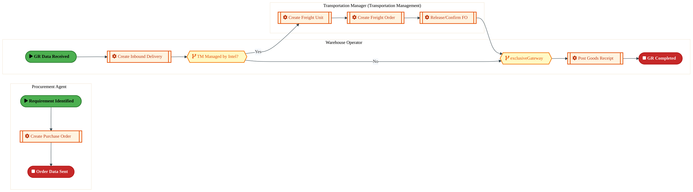
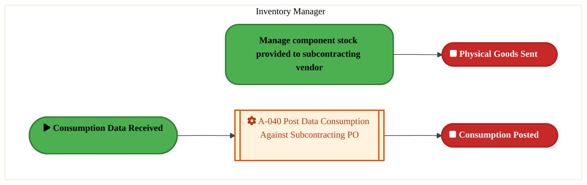
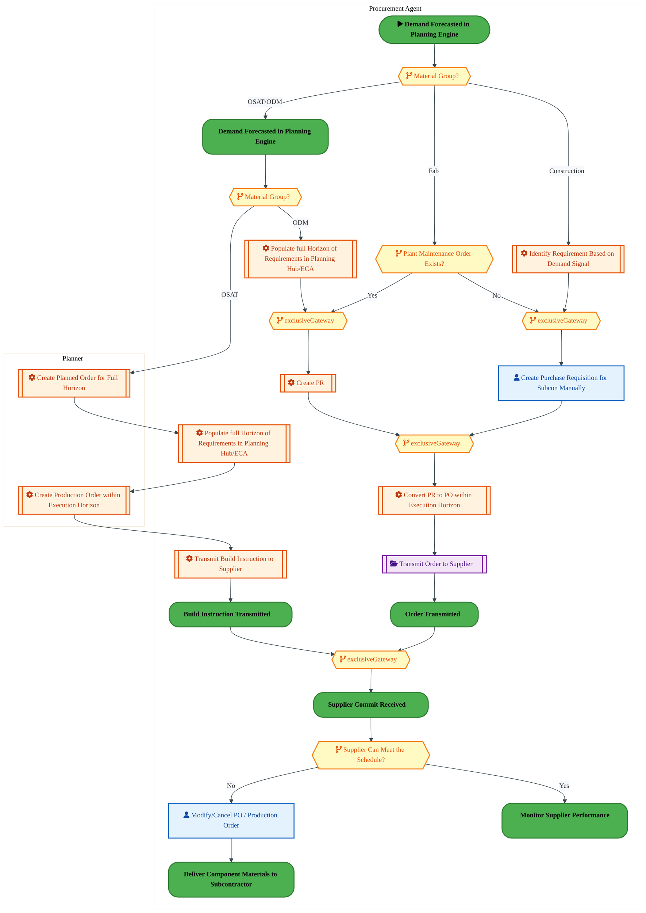

  <img src="data:image/svg+xml;base64,PHN2ZyB4bWxucz0iaHR0cDovL3d3dy53My5vcmcvMjAwMC9zdmciIHZpZXdCb3g9IjAgMCA4MDAgNDgwIiB3aWR0aD0iODAwIiBoZWlnaHQ9IjQ4MCI+DQogIDxkZWZzPg0KICAgIDxsaW5lYXJHcmFkaWVudCBpZD0iYmciIHgxPSIwJSIgeTE9IjAlIiB4Mj0iMTAwJSIgeTI9IjEwMCUiPg0KICAgICAgPHN0b3Agb2Zmc2V0PSIwJSIgc3R5bGU9InN0b3AtY29sb3I6IzAwNzFjNTtzdG9wLW9wYWNpdHk6MSIvPg0KICAgICAgPHN0b3Agb2Zmc2V0PSIxMDAlIiBzdHlsZT0ic3RvcC1jb2xvcjojMDBhZWVmO3N0b3Atb3BhY2l0eToxIi8+DQogICAgPC9saW5lYXJHcmFkaWVudD4NCiAgICA8bGluZWFyR3JhZGllbnQgaWQ9ImFjY2VudCIgeDE9IjAlIiB5MT0iMCUiIHgyPSIwJSIgeTI9IjEwMCUiPg0KICAgICAgPHN0b3Agb2Zmc2V0PSIwJSIgc3R5bGU9InN0b3AtY29sb3I6I2ZmZmZmZjtzdG9wLW9wYWNpdHk6MC4xNSIvPg0KICAgICAgPHN0b3Agb2Zmc2V0PSIxMDAlIiBzdHlsZT0ic3RvcC1jb2xvcjojZmZmZmZmO3N0b3Atb3BhY2l0eTowLjAyIi8+DQogICAgPC9saW5lYXJHcmFkaWVudD4NCiAgICA8cGF0dGVybiBpZD0iZ3JpZCIgd2lkdGg9IjQwIiBoZWlnaHQ9IjQwIiBwYXR0ZXJuVW5pdHM9InVzZXJTcGFjZU9uVXNlIj4NCiAgICAgIDxwYXRoIGQ9Ik0gNDAgMCBMIDAgMCAwIDQwIiBmaWxsPSJub25lIiBzdHJva2U9InJnYmEoMjU1LDI1NSwyNTUsMC4wNykiIHN0cm9rZS13aWR0aD0iMC41Ii8+DQogICAgPC9wYXR0ZXJuPg0KICA8L2RlZnM+DQoNCiAgPCEtLSBCYWNrZ3JvdW5kIC0tPg0KICA8cmVjdCB3aWR0aD0iODAwIiBoZWlnaHQ9IjQ4MCIgZmlsbD0idXJsKCNiZykiIHJ4PSI4Ii8+DQogIDxyZWN0IHdpZHRoPSI4MDAiIGhlaWdodD0iNDgwIiBmaWxsPSJ1cmwoI2dyaWQpIiByeD0iOCIvPg0KICA8cmVjdCB3aWR0aD0iODAwIiBoZWlnaHQ9IjQ4MCIgZmlsbD0idXJsKCNhY2NlbnQpIiByeD0iOCIvPg0KDQogIDwhLS0gRGVjb3JhdGl2ZSBjaXJjdWl0L2FyY2hpdGVjdHVyZSBsaW5lcyAtLT4NCiAgPGcgc3Ryb2tlPSJyZ2JhKDI1NSwyNTUsMjU1LDAuMTIpIiBzdHJva2Utd2lkdGg9IjEuNSIgZmlsbD0ibm9uZSI+DQogICAgPHBhdGggZD0iTSAwIDEwMCBMIDEyMCAxMDAgTCAxNjAgMTQwIEwgMjgwIDE0MCIvPg0KICAgIDxwYXRoIGQ9Ik0gMCAyNjAgTCA4MCAyNjAgTCAxMjAgMjIwIEwgMjAwIDIyMCBMIDI0MCAyNjAgTCAzNjAgMjYwIi8+DQogICAgPHBhdGggZD0iTSA1MjAgMTAwIEwgNjAwIDEwMCBMIDY0MCA2MCBMIDgwMCA2MCIvPg0KICAgIDxwYXRoIGQ9Ik0gNDQwIDM0MCBMIDU2MCAzNDAgTCA2MDAgMzAwIEwgNzIwIDMwMCBMIDc2MCAzNDAgTCA4MDAgMzQwIi8+DQogICAgPHBhdGggZD0iTSA2MDAgNDAwIEwgNjgwIDQwMCBMIDcyMCA0NDAiLz4NCiAgICA8cGF0aCBkPSJNIDAgNDAwIEwgNDAgNDAwIEwgODAgMzYwIi8+DQogICAgPHBhdGggZD0iTSAyMDAgNDIwIEwgMzIwIDQyMCBMIDM2MCAzODAgTCA0ODAgMzgwIi8+DQogICAgPHBhdGggZD0iTSA2NTAgNDQwIEwgNzUwIDQ0MCBMIDgwMCA0ODAiLz4NCiAgPC9nPg0KDQogIDwhLS0gRGVjb3JhdGl2ZSBub2RlcyAtLT4NCiAgPGcgZmlsbD0icmdiYSgyNTUsMjU1LDI1NSwwLjE4KSI+DQogICAgPGNpcmNsZSBjeD0iMTIwIiBjeT0iMTAwIiByPSI0Ii8+DQogICAgPGNpcmNsZSBjeD0iMjgwIiBjeT0iMTQwIiByPSI0Ii8+DQogICAgPGNpcmNsZSBjeD0iMjAwIiBjeT0iMjIwIiByPSI0Ii8+DQogICAgPGNpcmNsZSBjeD0iMzYwIiBjeT0iMjYwIiByPSI0Ii8+DQogICAgPGNpcmNsZSBjeD0iNjAwIiBjeT0iMTAwIiByPSI0Ii8+DQogICAgPGNpcmNsZSBjeD0iNzIwIiBjeT0iMzAwIiByPSI0Ii8+DQogICAgPGNpcmNsZSBjeD0iNTYwIiBjeT0iMzQwIiByPSI0Ii8+DQogICAgPGNpcmNsZSBjeD0iODAiIGN5PSIzNjAiIHI9IjQiLz4NCiAgICA8Y2lyY2xlIGN4PSI0ODAiIGN5PSIzODAiIHI9IjQiLz4NCiAgICA8Y2lyY2xlIGN4PSIzMjAiIGN5PSI0MjAiIHI9IjQiLz4NCiAgPC9nPg0KDQogIDwhLS0gVE9HQUYgQkRBVCBib3hlcyAtLT4NCiAgPGcgZm9udC1mYW1pbHk9IlNlZ29lIFVJLCBBcmlhbCwgc2Fucy1zZXJpZiIgZm9udC1zaXplPSIxNCIgZm9udC13ZWlnaHQ9IjYwMCI+DQogICAgPCEtLSBCIC0tPg0KICAgIDxyZWN0IHg9IjE1MCIgeT0iMTQwIiB3aWR0aD0iMTIwIiBoZWlnaHQ9IjQwIiByeD0iNSIgZmlsbD0icmdiYSgyNTUsMjU1LDI1NSwwLjE4KSIgc3Ryb2tlPSJyZ2JhKDI1NSwyNTUsMjU1LDAuMykiIHN0cm9rZS13aWR0aD0iMSIvPg0KICAgIDx0ZXh0IHg9IjIxMCIgeT0iMTY1IiB0ZXh0LWFuY2hvcj0ibWlkZGxlIiBmaWxsPSIjZmZmIj5CdXNpbmVzczwvdGV4dD4NCiAgICA8IS0tIEQgLS0+DQogICAgPHJlY3QgeD0iMjkwIiB5PSIxNDAiIHdpZHRoPSIxMjAiIGhlaWdodD0iNDAiIHJ4PSI1IiBmaWxsPSJyZ2JhKDI1NSwyNTUsMjU1LDAuMTgpIiBzdHJva2U9InJnYmEoMjU1LDI1NSwyNTUsMC4zKSIgc3Ryb2tlLXdpZHRoPSIxIi8+DQogICAgPHRleHQgeD0iMzUwIiB5PSIxNjUiIHRleHQtYW5jaG9yPSJtaWRkbGUiIGZpbGw9IiNmZmYiPkRhdGE8L3RleHQ+DQogICAgPCEtLSBBIC0tPg0KICAgIDxyZWN0IHg9IjQzMCIgeT0iMTQwIiB3aWR0aD0iMTIwIiBoZWlnaHQ9IjQwIiByeD0iNSIgZmlsbD0icmdiYSgyNTUsMjU1LDI1NSwwLjE4KSIgc3Ryb2tlPSJyZ2JhKDI1NSwyNTUsMjU1LDAuMykiIHN0cm9rZS13aWR0aD0iMSIvPg0KICAgIDx0ZXh0IHg9IjQ5MCIgeT0iMTY1IiB0ZXh0LWFuY2hvcj0ibWlkZGxlIiBmaWxsPSIjZmZmIj5BcHBsaWNhdGlvbjwvdGV4dD4NCiAgICA8IS0tIFQgLS0+DQogICAgPHJlY3QgeD0iNTcwIiB5PSIxNDAiIHdpZHRoPSIxMjAiIGhlaWdodD0iNDAiIHJ4PSI1IiBmaWxsPSJyZ2JhKDI1NSwyNTUsMjU1LDAuMTgpIiBzdHJva2U9InJnYmEoMjU1LDI1NSwyNTUsMC4zKSIgc3Ryb2tlLXdpZHRoPSIxIi8+DQogICAgPHRleHQgeD0iNjMwIiB5PSIxNjUiIHRleHQtYW5jaG9yPSJtaWRkbGUiIGZpbGw9IiNmZmYiPlRlY2hub2xvZ3k8L3RleHQ+DQogIDwvZz4NCg0KICA8IS0tIENvbm5lY3RpbmcgbGluZXMgYmV0d2VlbiBCREFUIGJveGVzIC0tPg0KICA8ZyBzdHJva2U9InJnYmEoMjU1LDI1NSwyNTUsMC4yNSkiIHN0cm9rZS13aWR0aD0iMSI+DQogICAgPGxpbmUgeDE9IjI3MCIgeTE9IjE2MCIgeDI9IjI5MCIgeTI9IjE2MCIvPg0KICAgIDxsaW5lIHgxPSI0MTAiIHkxPSIxNjAiIHgyPSI0MzAiIHkyPSIxNjAiLz4NCiAgICA8bGluZSB4MT0iNTUwIiB5MT0iMTYwIiB4Mj0iNTcwIiB5Mj0iMTYwIi8+DQogIDwvZz4NCg0KICA8IS0tIE1haW4gdGl0bGUgLS0+DQogIDx0ZXh0IHg9IjQwMCIgeT0iMjYwIiB0ZXh0LWFuY2hvcj0ibWlkZGxlIiBmb250LWZhbWlseT0iU2Vnb2UgVUksIEFyaWFsLCBzYW5zLXNlcmlmIiBmb250LXNpemU9IjM2IiBmb250LXdlaWdodD0iNzAwIiBmaWxsPSIjZmZmZmZmIiBsZXR0ZXItc3BhY2luZz0iMSI+DQogICAgSUFPIEFyY2hpdGVjdHVyZQ0KICA8L3RleHQ+DQogIDx0ZXh0IHg9IjQwMCIgeT0iMzAwIiB0ZXh0LWFuY2hvcj0ibWlkZGxlIiBmb250LWZhbWlseT0iU2Vnb2UgVUksIEFyaWFsLCBzYW5zLXNlcmlmIiBmb250LXNpemU9IjE4IiBmb250LXdlaWdodD0iNDAwIiBmaWxsPSJyZ2JhKDI1NSwyNTUsMjU1LDAuOCkiIGxldHRlci1zcGFjaW5nPSIyIj4NCiAgICBUT0dBRiBCREFUIMK3IElBTyBQcm9ncmFtIMK3IElETSAyLjANCiAgPC90ZXh0Pg0KDQogIDwhLS0gQm90dG9tIGFjY2VudCBiYXIgLS0+DQogIDxyZWN0IHg9IjI4MCIgeT0iMzQwIiB3aWR0aD0iMjQwIiBoZWlnaHQ9IjMiIHJ4PSIxLjUiIGZpbGw9InJnYmEoMjU1LDI1NSwyNTUsMC40KSIvPg0KDQogIDwhLS0gSW50ZWwgdGV4dCAtLT4NCiAgPHRleHQgeD0iNDAwIiB5PSIzODAiIHRleHQtYW5jaG9yPSJtaWRkbGUiIGZvbnQtZmFtaWx5PSJTZWdvZSBVSSwgQXJpYWwsIHNhbnMtc2VyaWYiIGZvbnQtc2l6ZT0iMTMiIGZpbGw9InJnYmEoMjU1LDI1NSwyNTUsMC41KSIgbGV0dGVyLXNwYWNpbmc9IjMiPg0KICAgIElOVEVMIENPTkZJREVOVElBTA0KICA8L3RleHQ+DQo8L3N2Zz4NCg==" alt="IAO Architecture" style="width:100%; border-radius:8px;" />
  <h1 style="font-size:36px; margin-top:24px;">PM-110 — Procure Subcontracting</h1>
  <h2 style="font-size:24px;">Architecture Document (TOGAF BDAT)</h2>
  
Procure To Pay (PTP) Tower 
  Capability PM-110 · PM Procure Materials and Services (Direct and Indirect)

  
IAO Program · R1 – R5 
  Generated: April 2026 
  Sajiv Francis

  
IAO Architecture Pipeline — Intel Confidential

Page 1<a href="#toc">↑ Back to TOC</a>PM-110 — Procure Subcontracting

## Table of Contents

<nav class="toc">
<ol>
  <li><a href="#1-executive-summary">1. Executive Summary</a></li>
  <li><a href="#2-business-context-objectives">2. Business Context &amp; Objectives</a>
    <ul>
      <li><a href="#21-classification">2.1 Classification</a></li>
      <li><a href="#22-business-drivers">2.2 Business Drivers</a></li>
      <li><a href="#23-success-criteria">2.3 Success Criteria</a></li>
      <li><a href="#24-companion-documents">2.4 Companion Documents</a></li>
    </ul>
  </li>
  <li><a href="#3-business-architecture-togaf-b">3. Business Architecture (TOGAF &ldquo;B&rdquo;)</a>
    <ul>
      <li><a href="#31-business-process-overview">3.1 Business Process Overview</a></li>
      <li><a href="#32-business-process-diagrams">3.2 Business Process Diagrams</a></li>
      <li><a href="#33-business-roles-responsibilities">3.3 Business Roles &amp; Responsibilities</a></li>
    </ul>
  </li>
  <li><a href="#4-data-architecture-togaf-d">4. Data Architecture (TOGAF &ldquo;D&rdquo;)</a>
    <ul>
      <li><a href="#41-data-entities-ownership">4.1 Data Entities &amp; Ownership</a></li>
      <li><a href="#42-data-flow-diagrams">4.2 Data Flow Diagrams</a></li>
      <li><a href="#43-data-lineage">4.3 Data Lineage</a></li>
      <li><a href="#44-ricefw-data-objects">4.4 RICEFW Data Objects</a></li>
      <li><a href="#45-data-governance-quality">4.5 Data Governance &amp; Quality</a></li>
    </ul>
  </li>
  <li><a href="#5-application-architecture-togaf-a">5. Application Architecture (TOGAF &ldquo;A&rdquo;)</a>
    <ul>
      <li><a href="#54-component-overview">5.4 Component Overview</a></li>
      <li><a href="#55-development-object-inventory">5.5 Development Object Inventory</a>
        <ul>
          <li><a href="#551-sap-development-objects">5.5.1 SAP Development Objects</a></li>
          <li><a href="#552-eca-development-objects">5.5.2 ECA Development Objects</a></li>
          <li><a href="#553-interface-objects">5.5.3 Interface Objects</a></li>
          <li><a href="#554-middleware-objects">5.5.4 Middleware Objects</a></li>
          <li><a href="#555-scheduling-batch-objects">5.5.5 Scheduling &amp; Batch Objects</a></li>
          <li><a href="#556-boundary-application-dependencies">5.5.6 Boundary Application Dependencies</a></li>
        </ul>
      </li>
      <li><a href="#56-integration-patterns">5.6 Integration Patterns</a></li>
    </ul>
  </li>
  <li><a href="#6-technology-architecture-togaf-t">6. Technology Architecture (TOGAF &ldquo;T&rdquo;)</a>
    <ul>
      <li><a href="#61-platform-infrastructure">6.1 Platform &amp; Infrastructure</a></li>
      <li><a href="#62-sap-development-object-status">6.2 SAP Development Object Status</a></li>
      <li><a href="#63-nfrs-design-principles">6.3 NFRs &amp; Design Principles</a></li>
      <li><a href="#64-security-governance">6.4 Security &amp; Governance</a></li>
      <li><a href="#65-eca-development-object-status">6.5 ECA Development Object Status</a></li>
    </ul>
  </li>
  <li><a href="#7-project-context">7. Project Context</a>
    <ul>
      <li><a href="#71-project-roadmap-go-live-plan">7.1 Project Roadmap &amp; Go-Live Plan</a></li>
      <li><a href="#72-raid-log">7.2 RAID Log</a></li>
      <li><a href="#73-recommendations-next-steps">7.3 Recommendations &amp; Next Steps</a></li>
    </ul>
  </li>
</ol>
</nav>

Page 2<a href="#toc">↑ Back to TOC</a>PM-110 — Procure Subcontracting

## 1. Executive Summary

This Architecture Document defines the **Business, Data, Application, and Technology** (BDAT) architecture for **PM-110 Procure Subcontracting** within the IAO program. It includes 8 BPMN process diagram(s) in Section 3.

| Dimension | Value |
|-----------|-------|
| **Tower** | Procure To Pay (PTP) |
| **Process Group** | PM Procure Materials and Services (Direct and Indirect) |
| **Capability** | PM-110 - Procure Subcontracting |
| **Release** | R1 – R5 |
| **Total Systems** | 0 |
| **System Status** | 0 Deployed, 0 Developing, 0 EOL, 0 Pending IAPM |
| **RICEFW Objects** | 3 Reports, 171 Interfaces, 16 Conversions, 172 Enhancements, 7 Forms, 10 Workflows |

> All system nodes in architecture diagrams are **IAPM-linked** — click any node to open its IAPM page. Diagrams require `securityLevel: 'loose'` for click events.

Page 3<a href="#toc">↑ Back to TOC</a>PM-110 — Procure Subcontracting

## 2. Business Context & Objectives

### 2.1 Classification

| Level | Value |
|-------|-------|
| **L0 Tower** | Procure To Pay |
| **L1 Process** | PM Procure Materials and Services (Direct and Indirect) |
| **L2 Capability** | PM-110 - Procure Subcontracting |

### 2.2 Business Drivers

| # | Driver | Description | Strategic Alignment | Priority |
|---|--------|-------------|---------------------|----------|
| 1 | Procurement Process Standardization | Standardize procurement processes across direct, indirect, and services on S/4 HANA + Ariba | IDM 2.0 Procurement Excellence | High |
| 2 | Supplier Collaboration Enhancement | Enable digital supplier collaboration for consignment, subcontracting, and quality management | Supplier Ecosystem | High |
| 3 | Payment Automation | Automate invoice verification, three-way matching, and payment execution | Finance Efficiency | Medium |
| 4 | PM-110 Process Migration | Migrate Procure Subcontracting business processes and 0 integrated systems from legacy to S/4 HANA target architecture | IDM 2.0 Procurement | High |

Page 4<a href="#toc">↑ Back to TOC</a>PM-110 — Procure Subcontracting

### 2.3 Success Criteria

| Metric | Target | Measure | Baseline | Owner |
|--------|--------|---------|----------|-------|
| PO Cycle Time | < 24 hours | Requisition approval to PO dispatch to supplier | 48 hours (current) | Procurement Lead |
| Invoice Automation Rate | > 80% | Invoices processed without manual intervention (touchless) | 45% (current) | AP Manager |
| Supplier On-Time Delivery | > 95% | Supplier adherence to confirmed delivery date | 89% (current) | Supplier Management |
| PM-110 Migration Completeness | 100% flow chains validated | All 0 flow chains verified in target state | 0% (pre-migration) | Tower Architect |

### 2.4 Companion Documents

| Document | Description |
|----------|-------------|
| **Business Architecture** | Included in this document (Section 3) — process flows from BPMN diagrams |
| **This Document** | Full BDAT Architecture — Business + Data + Application + Technology |

Page 5<a href="#toc">↑ Back to TOC</a>PM-110 — Procure Subcontracting

## 3. Business Architecture (TOGAF "B")

### 3.1 Business Process Overview

This capability includes **8 business process(es)** modeled in BPMN 2.0, covering the end-to-end workflow for PM-110 Procure Subcontracting.

| # | Step ID | Process Name | Lanes | Tasks | Gateways |
|---|---------|--------------|-------|-------|----------|
| 1 | PM-110-020_Create_PO-_Components-_Purchased_&amp;_Delivered_to_Subcontractor_(Drop_Ship) | PM-110-020_Create_PO-_Components-_Purchased_&amp;_Delivered_to_Subcontractor_(Drop_Ship) | Procurement Agent, Transportation Manager (Transportation Management), Warehouse Operator | 6 | 2 |
| 2 | PM-110-030_Create_3rd_Party_PO-_Components_to_be_delivered_directly_to_Subcontractor | PM-110-030_Create_3rd_Party_PO-_Components_to_be_delivered_directly_to_Subcontractor | Procurement Agent, Transportation Manager (Transportation Management), Warehouse Operator | 15 | 10 |
| 3 | PM-110-040_Deliver_Component_Materials_to_Subcontractor | PM-110-040_Deliver_Component_Materials_to_Subcontractor | Procurement Agent, Transportation Manager (Transportation Management), Warehouse Operator | 8 | 6 |
| 4 | PM-110-050_Manage_component_stock_provided_to_subcontracting_vendor | PM-110-050_Manage_component_stock_provided_to_subcontracting_vendor | Procurement Agent, Transportation Manager (Transportation Management), Warehouse Operator | 15 | 10 |
| 5 | PM-110-070_Post_component_stock_adjustment_-_PTP | PM-110-070_Post_component_stock_adjustment_-_PTP | Inventory Manager | 1 | 0 |
| 6 | PM-110-090_Notify_Subcontractor_of_Schedule_Requirements | PM-110-090_Notify_Subcontractor_of_Schedule_Requirements | Planner, Procurement Agent | 7 | 7 |
| 7 | PM-110-100_Verify_Subcontractor’s_Ability_to_Meet_Schedule | PM-110-100_Verify_Subcontractor’s_Ability_to_Meet_Schedule | Planner, Procurement Agent | 10 | 8 |
| 8 | PM-110-110_Manage_Subcontractor_Located_Inventory | PM-110-110_Manage_Subcontractor_Located_Inventory | ODM Supplier | 3 | 1 |

Page 6<a href="#toc">↑ Back to TOC</a>PM-110 — Procure Subcontracting

### 3.2 Business Process Diagrams

#### BUSINESS ARCHITECTURE — 3.2.1 PM-110-020_Create_PO-_Components-_Purchased_&amp;_Delivered_to_Subcontractor_(Drop_Ship) — PM-110-020_Create_PO-_Components-_Purchased_&amp;_Delivered_to_Subcontractor_(Drop_Ship)

**Swim Lanes**: Procurement Agent · Transportation Manager (Transportation Management) · Warehouse Operator | **Tasks**: 6 | **Gateways**: 2

> **Legend**: ● Start · ● End · User Task · Service Task · ◇ Gateway · Sub-Process

<a href="https://mermaid.live/view#pako:eNqlVm1v4jgQ_itWqopdKWjzSmg-3IkGUlVqd6vS3dVqOZ1MMgGrxs7ZDoVj-e_nkEAghf1yfIg04-dlZhw7bIyEp2CExvX1hjCiQrTpqDksoBOizhRL6JioSnzDguApBdkpMRlnakz-3cFsL1-VsDIX4wWh6zI7hhkH9PXeRANNpCaSmMmuBEGyjtnJBVlgsY445aJEX0E_s7KdW710y0UKogFYVmAnvqZSwqBJu4EXeHHJk5Bwlp6IZn7Wz5LOtiyO8rdkjoXalV9IeMSr7yRVcx1nmErQmLla0Ac8BVr2qERR5pJCLPfDILL0YXpg4xwnhM103rN0SmD22qR8a7tF2-vrCTuYoofnCUP6l1As5RAyJJVOj5YKZYTS8MqLBrFvmVIJ_grhlTMKhq5jJmUnoW7dMsvhdt-AzOYqnHKa1tDuW9lD6OQrU6xCxzLFWj9bXsDSxinqOX2nf3C6DezIjvZOWZb9Lyc9V_GC5WvtNXJjJx4evGy_50fWe719m0MvGNjtOYFYkgSOROM4dkfNqEY937Yui97Gbs-KWqIzrOANrxvBm8g7CMZ-ENvBRcHKr11lMX0SPNkLuiM_9g-Cwa0dD5yLgt7A9vp1hVpnJnA-RxQz-Nv6OTFK2ULo88cUGsz0c2L8VWHLH7N_akyGwwx3Ez5DkQDdGnoqhH7tJKAv5RnSjGNK8OFAyakewjP8U5Da4T7VT5IRSDXp4xHppiFJxfNKGA2xwmhcFVWj9bt2rhVb01_0MZE5Fworwhl6xAzPtMiHs_mynI-nvXpne43F7lU926p_yngGCnoqnyLOMiIWKP7Swvd-6_BV348N4UKjjlb4jgXMeVHOPweBFRenjThnbe7ZlBcsRUOgZAli3arNPSU9canQHeep1G0lQHLVwvdb23z3XG3XDr18t8G21dphjY_4Iqeg3mPtzaapJYXuVO9gMkcvj_XmpWi61v0ooH9OjO32mOqcp8IqoYXUdd1VR7OhHebMbNTt_qFfxTp0q9CuzyJz6ri-QZhfx04de1Xs12GvCr067FfhHhzU5L31zvvXxPjMJ8avI1G7dnXbwB8gd8je0U1RtnB0n52sOBdX3Isr3sUV_-JK7-JKcPgmnaT759M39VfltD3rbNbeX7inaWefNkxjAWKBSWqEG2P3b0P_I0khwwVVxtY0cKH4eM0SI9x9lY0iTzVzSLA-eIsquf0PmpHF9g==" title="View full diagram">&#128065; View Diagram</a>

Page 7<a href="#toc">↑ Back to TOC</a>PM-110 — Procure Subcontracting

#### BUSINESS ARCHITECTURE — 3.2.2 PM-110-030_Create_3rd_Party_PO-_Components_to_be_delivered_directly_to_Subcontractor — PM-110-030_Create_3rd_Party_PO-_Components_to_be_delivered_directly_to_Subcontractor

**Swim Lanes**: Procurement Agent · Transportation Manager (Transportation Management) · Warehouse Operator | **Tasks**: 15 | **Gateways**: 10

> **Legend**: ● Start · ● End · User Task · Service Task · ◇ Gateway · Sub-Process

<a href="https://mermaid.live/view#pako:eNqlWG1v4jgQ_itWqopdCbSJ8wZ8uFMLTYW0bFHp3uq0nE4mcSCqiXNO0pbr8t_PIXYA41Rqjw9IfmaeeWbGb0lejZBG2Bgal5evSZoUQ_DaKdZ4gztD0FmiHHe6oAb-QCxBS4LzTuUT07SYJ__u3Swne6ncKixAm4RsK3SOVxSD75MuuOJE0gU5SvNejlkSd7qdjCUbxLYjSiirvC9wPzbjvZowXVMWYXZwME3fCl1OJUmKD7DtO74TVLwchzSNToLGbtyPw86uSo7Q53CNWLFPv8zxFL38SKJizccxIjnmPutiQ76iJSZVjQUrKyws2ZNsRpJXOilv2DxDYZKuOO6YHGIofTxArrnbgd3l5SJtRMHX-0UK-C8kKM_HOAZ5weGbpwLECSHDC2d0FbhmNy8YfcTDC3jjj23YDatKhrx0s1s1t_eMk9W6GC4piYRr77mqYQizly57GUKzy7b8X9HCaXRQGnmwD_uN0rVvjayRVIrj-H8p8b6yB5Q_Cq0bO4DBuNGyXM8dmefxZJljx7-y1D5h9pSE-ChoEAT2zaFVN55rme1BrwPbM0dK0BUq8DPaHgIORk4TMHD9wPJbA9Z6apblcsZoKAPaN27gNgH9ayu4gq0BnSvL6YsMeZwVQ9kaEJTiv82fC6MKWzK-_9ICXK34_8L4q_atfqn9k_vEaBijXkhXYMQwLw3MSsaXXY7BXbWHOOOY4mgp84KGj-CBr-Q8o3zB6piW96mhZoT37x7_UyYiuUnE_5M4wRFnfT5iQevAygua1aHBGBUIzOuCTtz7r6-H_CLcW_KcwjWY3X0B84e73xfGble782Wt65rF1Zo6UJHQFExRilZc85MWr9L_fNrWgbZHAdvvCvCdH5Rqa8w3GdpuWqeUe0wwn7MvI5rGCduA4E4lwPdr2O_VcN5RecsEQB7hB2J4TctqCWaYoYKy0wZbjUp1ZIAZzQtwS2mUg0mel_jUGWqceQV5ucmqaTx1drUFTNIlLdMIjDFJnjDbKmV7p6SjdO5xiJNMnW5fK3JXFm-q9BUVzGLKJ-GoblBQcDeegnmZZSQ5n063OhESvlERV5mh8FHpqq9s0Nv7ep_tq3g625pWX_WfvO0_eF98aCr-R7P2NhEqZwYXGtFNRnBx7msrvrL77UeMozBm622ehIiIqdBRXJUiW6Vz9hTn47KrtXVeg68wJukTj0t5EVPK9xxl55SB_pycTL_Ys69Hx2R9T5h6b_wSkjLn7bqtr0SVZn2MBvW0h6k4ciOw3PIaC0zOErU_puh8XNH9mKJ3oCHG6HPeQ6QAGWKIEExaSL6W9LDNMKAxz686EPZ3k-6e4xcw6PV-q-5IAdhiLJ6aUmmHYuzUY18M_XpoS7PlCsCUQF8FxFhGsM0akIKWDNkAAwWQEo4YC7vVKMiIkmDLogbSQyZhS0B42K6kCA85tqCI2TBEIyxZOdwX-mth8EeKhfGLd0qGEgXBM0AGhyLhs1CzOpLUtGXlngBEb2HTSzFbnjJuJtcRgb_ROrCrGv7E-d5iNclChWKrBkmRzYUDYeCHxt4AbdUymdYiTQNEHd7RQ3C1UuTD_wkM9bB9_GB_YnFaLW6rxWu1-K2Wfqtl0Grha7XVZLWbYLupvQ9WeyP4MSBfH09xvwXvt-ADPc5XuB63xKvkKQq1qK1FHS3qalFPi_patC_f6U7hgRbmh5gWtvQw1MO2Hnb0sKuHPT3sS9joGhvMr4QkMoavxv5DDP9YE-EYlaQwdl0DlQWdb9PQGO4_WBhlFnHmOEH8gXxTg7v_AAf9f3s=" title="View full diagram">&#128065; View Diagram</a>

Page 8<a href="#toc">↑ Back to TOC</a>PM-110 — Procure Subcontracting

```mermaid
%%{init: {'theme': 'base', 'themeVariables': {'fontSize': '14px', 'fontFamily': 'Segoe UI, Arial, sans-serif','primaryColor': '#e8f0fe', 'primaryBorderColor': '#0071c5','lineColor': '#37474F', 'secondaryColor': '#f5f8fc'}, 'flowchart': {'useMaxWidth': false, 'htmlLabels': true, 'curve': 'basis', 'nodeSpacing': 40, 'rankSpacing': 50}} }%%
flowchart LR
    classDef startEvt fill:#4CAF50,stroke:#2E7D32,color:#000,font-weight:bold,stroke-width:2px,rx:20,ry:20
    classDef endEvt fill:#C62828,stroke:#B71C1C,color:#fff,font-weight:bold,stroke-width:2px,rx:20,ry:20
    classDef userTask fill:#E3F2FD,stroke:#1565C0,stroke-width:2px,color:#0D47A1
    classDef serviceTask fill:#FFF3E0,stroke:#E65100,stroke-width:2px,color:#BF360C
    classDef gateway fill:#FFF9C4,stroke:#F57F17,stroke-width:2px,color:#E65100
    classDef subProc fill:#F3E5F5,stroke:#7B1FA2,stroke-width:2px,color:#4A148C
    subgraph lane_0["Procurement Agent"]
        n3[["fa:fa-cog Create Purchase Order"]]
        n4[["fa:fa-cog Create Stock Transport Order"]]
        n16(["fa:fa-play Requirement Identified"])
        n21(["fa:fa-stop Order Data Sent"])
        n28{{"fa:fa-code-branch PO/ STO?"}}
    end
    subgraph lane_1["Transportation Manager (Transportation Management)"]
        n9[["fa:fa-cog Create Freight Unit"]]
        n10[["fa:fa-cog Create Freight Order"]]
        n11[["fa:fa-cog Release/Confirm FO"]]
        n12[["fa:fa-cog Create Freight Order"]]
        n13[["fa:fa-cog Release/Confirm FO"]]
        n14[["fa:fa-cog Create Freight Unit"]]
    end
    subgraph lane_2["Warehouse Operator"]
        n1["fa:fa-user Post Goods Issue"]
        n2["fa:fa-user Post Consumption"]
        n5[["fa:fa-cog Create Inbound Delivery"]]
        n6[["fa:fa-cog Post Goods Receipt"]]
        n7[["fa:fa-cog Create Outbound Delivery"]]
        n8[["fa:fa-cog Perform Goods Issue to ODM Supplier"]]
        n15["Pick and Pack"]
        n17(["fa:fa-play GR Data Received"])
        n18(["fa:fa-play GI Data Received"])
        n19(["fa:fa-play GR Data Received"])
        n20(["fa:fa-play Consumption Data Received"])
        n22(["fa:fa-stop GR Completed"])
        n23(["fa:fa-stop Delivery Data Sent"])
        n24(["fa:fa-stop Physical Goods Sent"])
        n25(["fa:fa-stop PGI Data Sent"])
        n26(["fa:fa-stop Consumption Posted"])
        n27(["fa:fa-stop Inventory Monitored"])
        n29{{"fa:fa-code-branch IM/3PL?"}}
        n30{{"fa:fa-code-branch exclusiveGateway"}}
        n31{{"fa:fa-code-branch exclusiveGateway"}}
        n32{{"fa:fa-code-branch TM Managed by Intel?"}}
        n33{{"fa:fa-code-branch exclusiveGateway"}}
        n34{{"fa:fa-code-branch TM Managed by Intel?"}}
        n35{{"fa:fa-code-branch exclusiveGateway"}}
        n36{{"fa:fa-arrows-alt parallelGateway"}}
        n37{{"fa:fa-arrows-alt Type of Information?"}}
    end
    n16 --> n28
    n3 --> n21
    n6 --> n22
    n4 --> n7
    n7 --> n32
    n15 --> n30
    n18 --> n30
    n1 --> n37
    n30 --> n1
    n17 --> n31
    n19 --> n31
    n5 --> n34
    n9 --> n10
    n10 --> n11
    n33 --> n29
    n11 --> n33
    n13 --> n35
    n31 --> n5
    n12 --> n13
    n14 --> n12
    n28 -->|"STO"| n4
    n37 --> n24
    n37 --> n25
    n20 --> n2
    n28 -->|"PO"| n3
    n35 --> n36
    n8 --> n27
    n36 --> n6
    n36 --> n8
    n34 -->|"No"| n35
    n34 -->|"Yes"| n14
    n32 -->|"No"| n33
    n32 -->|"Yes"| n9
    n29 -->|"3PL"| n23
    n29 -->|"IM"| n15
    n2 --> n26
    class n1 userTask
    class n2 userTask
    class n3 serviceTask
    class n4 serviceTask
    class n5 serviceTask
    class n6 serviceTask
    class n7 serviceTask
    class n8 serviceTask
    class n9 serviceTask
    class n10 serviceTask
    class n11 serviceTask
    class n12 serviceTask
    class n13 serviceTask
    class n14 serviceTask
    class n16 startEvt
    class n17 startEvt
    class n18 startEvt
    class n19 startEvt
    class n20 startEvt
    class n21 endEvt
    class n22 endEvt
    class n23 endEvt
    class n24 endEvt
    class n25 endEvt
    class n26 endEvt
    class n27 endEvt
    class n28 gateway
    class n29 gateway
    class n30 gateway
    class n31 gateway
    class n32 gateway
    class n33 gateway
    class n34 gateway
    class n35 gateway
    class n36 gateway
    class n37 gateway
```

#### BUSINESS ARCHITECTURE — 3.2.3 PM-110-040_Deliver_Component_Materials_to_Subcontractor — PM-110-040_Deliver_Component_Materials_to_Subcontractor

**Swim Lanes**: Procurement Agent · Transportation Manager (Transportation Management) · Warehouse Operator | **Tasks**: 8 | **Gateways**: 6

```mermaid
%%{init: {'theme': 'base', 'themeVariables': {'fontSize': '14px', 'fontFamily': 'Segoe UI, Arial, sans-serif','primaryColor': '#e8f0fe', 'primaryBorderColor': '#0071c5','lineColor': '#37474F', 'secondaryColor': '#f5f8fc'}, 'flowchart': {'useMaxWidth': false, 'htmlLabels': true, 'curve': 'basis', 'nodeSpacing': 40, 'rankSpacing': 50}} }%%
flowchart LR
    classDef startEvt fill:#4CAF50,stroke:#2E7D32,color:#000,font-weight:bold,stroke-width:2px,rx:20,ry:20
    classDef endEvt fill:#C62828,stroke:#B71C1C,color:#fff,font-weight:bold,stroke-width:2px,rx:20,ry:20
    classDef userTask fill:#E3F2FD,stroke:#1565C0,stroke-width:2px,color:#0D47A1
    classDef serviceTask fill:#FFF3E0,stroke:#E65100,stroke-width:2px,color:#BF360C
    classDef gateway fill:#FFF9C4,stroke:#F57F17,stroke-width:2px,color:#E65100
    classDef subProc fill:#F3E5F5,stroke:#7B1FA2,stroke-width:2px,color:#4A148C
    subgraph lane_0["Procurement Agent"]
        n15["Create Plant-to-Plant Transfer Order"]
        n16["Create and Process Purchase Order"]
        n17{{"fa:fa-code-branch exclusiveGateway"}}
    end
    subgraph lane_1["Transportation Manager (Transportation Management)"]
        n5[["fa:fa-cog Create Freight Unit"]]
        n6[["fa:fa-cog Create Freight Order"]]
        n7[["fa:fa-cog Release/Confirm FO"]]
    end
    subgraph lane_2["Warehouse Operator"]
        n1["fa:fa-user Post Goods Issue"]
        n2[["fa:fa-cog Create Inbound Delivery"]]
        n3[["fa:fa-cog Post Goods Receipt"]]
        n4[["fa:fa-cog Create Outbound Delivery"]]
        n8["Pick and Pack"]
        n9(["fa:fa-play GI Data Received"])
        n10(["fa:fa-play GR Data Received"])
        n11(["fa:fa-stop GR Completed"])
        n12(["fa:fa-stop Delivery Data Sent"])
        n13(["fa:fa-stop Physical Goods Sent"])
        n14(["fa:fa-stop PGI Data Sent"])
        n18{{"fa:fa-code-branch IM/3PL?"}}
        n19{{"fa:fa-code-branch exclusiveGateway"}}
        n20{{"fa:fa-code-branch TM Managed by Intel?"}}
        n21{{"fa:fa-code-branch exclusiveGateway"}}
        n22{{"fa:fa-arrows-alt Type of Information?"}}
    end
    n3 --> n11
    n8 --> n19
    n9 --> n19
    n1 --> n22
    n19 --> n1
    n5 --> n6
    n6 --> n7
    n21 --> n18
    n7 --> n21
    n22 --> n13
    n22 --> n14
    n17 --> n4
    n15 -->|"ODM/BOX Subcon"| n17
    n16 -->|"Non ODM/BOX Subcon"| n17
    n2 --> n3
    n10 --> n2
    n20 -->|"Yes"| n5
    n20 -->|"No"| n21
    n18 -->|"3PL"| n12
    n4 --> n20
    n18 -->|"IM"| n8
    class n1 userTask
    class n2 serviceTask
    class n3 serviceTask
    class n4 serviceTask
    class n5 serviceTask
    class n6 serviceTask
    class n7 serviceTask
    class n9 startEvt
    class n10 startEvt
    class n11 endEvt
    class n12 endEvt
    class n13 endEvt
    class n14 endEvt
    class n15 startEvt
    class n16 startEvt
    class n17 gateway
    class n18 gateway
    class n19 gateway
    class n20 gateway
    class n21 gateway
    class n22 gateway
```

> **Legend**: ● Start · ● End · User Task · Service Task · ◇ Gateway · Sub-Process

<a href="https://mermaid.live/view#pako:eNqlV11v4jgU_StWqooZCdR8kpCHHVEgFVKZotLZ2VVZrUziQNQQR7bTlmH472snDiGZpNLu8oC4x-fc43vjm4Sj4uMAKa5yfX2Mkoi54NhjO7RHPRf0NpCiXh8UwO-QRHATI9oTnBAnbBX9yGmamb4LmsA8uI_ig0BXaIsR-DbvgzEXxn1AYUIHFJEo7PV7KYn2kBwmOMZEsK-QE6ph7iaXbjEJEKkIqmprvsWlcZSgCjZs0zY9oaPIx0lQSxpaoRP6vZPYXIzf_B0kLN9-RtECvn-PArbjcQhjijhnx_bxPdygWNTISCYwPyOvZTMiKnwS3rBVCv0o2XLcVDlEYPJSQZZ6OoHT9fU6OZuC-8d1AvjHjyGlUxQCyjg8e2UgjOLYvTInY89S-5QR_ILcK31mTw2974tKXF662hfNHbyhaLtj7gbHgaQO3kQNrp6-98m7q6t9cuDfDS-UBJXTZKg7unN2urW1iTYpncIw_F9OvK_kCdIX6TUzPN2bnr00a2hN1F_zlWVOTXusNfuEyGvko4uknucZs6pVs6Glqd1Jbz1jqE4aSbeQoTd4qBKOJuY5oWfZnmZ3Jiz8mrvMNkuC_TKhMbM865zQvtW8sd6Z0BxrpiN3yPNsCUx3IIYJ-lt9XisibUb4_CUMjLf8e638VXDFJ9EszpkQxAsCSy5iA4YH-Q_wxE8lDREBD2KQGrJhJYNJAIQLohQsM8LPK0WtGvt4XCshdEM4EDeNwYYb-DuA3v04o9Eruiu6ulZOp0LGz11bWRr3zjeXYsIgi3ACFjCBW77VT624KP5zfTPW83O1ly2QpXgkP7bgG7-Tcf6lYPihoCz3UmHXFY8oRrwzNxOchBHZA--h4ncUqvME3yFBO5yJlqaIQIabXT2biNkBS0wZuMM4oGBOaYbqZL21iHmywRm_iFMU86tADo06jLrowuER-ShKm50yW00eMvahiyPOauS_FMcJ-i_1nY8-nZOmMZ-8uzmYQgaLLbyigLM_X3ZFbfIfP-ZrFZ8ynAr-BO_TGLFfuXqDW1ZUOKyKGaspjIZiuTvQyIex7GObxGxKyorbyE77ZM0XN8by_ks1UAV79G_nsDg7arvsaSGnLACbAz9LDMVNR137b456JYOE4Dc6gDG_Lx1SBHDIrUJM9vmcf2m5ZyQGGAx-E5dWxo6MRzIeNWKtiHW9jEuCjK0iHMpwWIS2DHUp1xwJ2DJdKdd1STCagFkaSsk5zh1_rpWH6eLm9uEPsMo2_BVlrfwU3JI0lKSv_Hb3EVG6le6aKvdXLqsyz5-I5kKrufAV5_i5IM2RC_yMFVZlLlOmVpvM-SInOhdPP9H38qlfg_XLR3dtxehcMTtXrM6VYeeK3bkyOr9-1StRO3BNvkLVUb0VNVpRsxW1OvyGHbhdvrnUYacdHrXC_Dy0wlo7rJew0lf2iM9rFCjuUcn_EvC_DQEKYRYz5dRXYMbw6pD4ipu_OitZGnDlNIL8ibgvwNM_XcTcRw==" title="View full diagram">&#128065; View Diagram</a>

Page 9<a href="#toc">↑ Back to TOC</a>PM-110 — Procure Subcontracting

#### BUSINESS ARCHITECTURE — 3.2.4 PM-110-050_Manage_component_stock_provided_to_subcontracting_vendor — PM-110-050_Manage_component_stock_provided_to_subcontracting_vendor

**Swim Lanes**: Procurement Agent · Transportation Manager (Transportation Management) · Warehouse Operator | **Tasks**: 15 | **Gateways**: 10

> **Legend**: ● Start · ● End · User Task · Service Task · ◇ Gateway · Sub-Process

<a href="https://mermaid.live/view#pako:eNqlWGtv4jgU_StWRhUzEmhiJyHAh1210IyQyoJKZ0arYbUyiQNWQ5x1Elq2w39fh9g8XGekdvmA5HPvuY-Ta-fxYoUsItbAurp6oSktBuClVazJhrQGoLXEOWm1QQ18w5ziZULyVuUTs7SY038PbtDNniu3Cgvwhia7Cp2TFSPg67gNrgUxaYMcp3knJ5zGrXYr43SD-W7IEsYr7w-kF9vxIZs03TAeEX5ysG0fhp6gJjQlJ9jxXd8NKl5OQpZGF0FjL-7FYWtfFZewp3CNeXEov8zJBD9_p1GxFusYJzkRPutik9zhJUmqHgteVlhY8q0Sg-ZVnlQINs9wSNOVwF1bQBynjyfIs_d7sL-6WqTHpODufpEC8QsTnOcjEoO8EPDttgAxTZLBB3d4HXh2Oy84eySDD-jWHzmoHVadDETrdrsSt_NE6GpdDJYsiaRr56nqYYCy5zZ_HiC7zXfiX8tF0uiUadhFPdQ7Zrrx4RAOVaY4jv9XJqErf8D5o8x16wQoGB1zQa_rDe3X8VSbI9e_hrpOhG9pSM6CBkHg3J6kuu160G4OehM4XXuoBV3hgjzh3Slgf-geAwaeH0C_MWCdT6-yXM44C1VA59YLvGNA_wYG16gxoHsN3Z6sUMRZcZytQYJT8rf9Y2FVYUsu9l9agOuV-F9Yf9W-1S91fgifGA9i3AnZCgw5Ea2BWcnF2OUETKs9JBjnFNdImRcsfAQPYpLzjImBNTFh9-ORmiVCv3vyT0llceNI_NOYkkiwPp2xkH1i5QXL6tBghAsM5nVDF-7dl5dTfRHpLEVN4RrMpp_B_GH6-8La72t3MdYm1aDIduwDF5SlYIJTvBI5PxrxqvxPl7L2jRoF_LArwFdxUOrS2L9kGNWEl5R7khBxzT4PWRpTvgHBVCegt-dw3prDfUPnDRcAiQjfMSdrVlYjmBGOC8YvBYbHLNWRASZMBGYcDNkmY6m4HrkcSDH-WxqRCBQMfBP59DjoMs6M5QX4wliUg3Gel-TS2TP2Nk6XrEwjMCIJ3RK-0xTpXpLOMtyTkNBMnwRf8yc8ZkLps6KqXqajCZiXWZbQV9esZ6xyWha_LBN61WFBhWRYOM1w-KgJ7mt798t9vQUPXWxf7VrY0_3Hv_bvvy0-gtqpIPyrq5-Q4rUv0nzH6VbMCOM7NTivKY5GUbI1nzuuxpitdzkNcSIvnYni6RQlksnZN59r48lnZ3Z3dqzV3j2zN3kOkzIXnXypb2E6rf8ummObaQ8TeURGYLkTqhck0Qt14PsyovdndN6X0T3RMOfsKe_gpAAZ5jhJSNJA8owkmjalOh6J4mYJOp3fqvuZBBy5ttXarYGutvbl2q-X8oEoVeHUGso1kmvJ7sllr146Khs6hPu5sMaThfWzOi9UHE8GUkzY0wAkQykGUg6KICtFfQX0NUCmcBRD2qEqDtoSUM05qjslBpSAc_SQcjqu8lCAo8qUWY5ld6UCs-lBAUdXRmzDgwEpC5SdwyMgRYZIjymeTA5cVY2jVH0FqHIcW1L_JPmBqsRykGaArm75g9UdOHosZTh_iq5GRT2XX8DIDDvnz9wXFrfR4jVauo0Wv9HSa7T0Gy1ihBpNsNmEmk3NOsBmIcSuV292l7jfgPca8L4ZR7Z8m7tEoRFFRtQxoq4R9YxoV71AXcK-Ge6Z4b4RFpNshKEZRmbYMcOuGfYUbLWtDeEbTCNr8GIdvnqILyMRiXGZFNa-beGyYPNdGlqDw9cBq8wiwRxRLJ5-NzW4_w87X1RW" title="View full diagram">&#128065; View Diagram</a>

Page 10<a href="#toc">↑ Back to TOC</a>PM-110 — Procure Subcontracting

```mermaid
%%{init: {'theme': 'base', 'themeVariables': {'fontSize': '14px', 'fontFamily': 'Segoe UI, Arial, sans-serif','primaryColor': '#e8f0fe', 'primaryBorderColor': '#0071c5','lineColor': '#37474F', 'secondaryColor': '#f5f8fc'}, 'flowchart': {'useMaxWidth': false, 'htmlLabels': true, 'curve': 'basis', 'nodeSpacing': 40, 'rankSpacing': 50}} }%%
flowchart LR
    classDef startEvt fill:#4CAF50,stroke:#2E7D32,color:#000,font-weight:bold,stroke-width:2px,rx:20,ry:20
    classDef endEvt fill:#C62828,stroke:#B71C1C,color:#fff,font-weight:bold,stroke-width:2px,rx:20,ry:20
    classDef userTask fill:#E3F2FD,stroke:#1565C0,stroke-width:2px,color:#0D47A1
    classDef serviceTask fill:#FFF3E0,stroke:#E65100,stroke-width:2px,color:#BF360C
    classDef gateway fill:#FFF9C4,stroke:#F57F17,stroke-width:2px,color:#E65100
    classDef subProc fill:#F3E5F5,stroke:#7B1FA2,stroke-width:2px,color:#4A148C
    subgraph lane_0["Procurement Agent"]
        n3[["fa:fa-cog Create Purchase Order"]]
        n4[["fa:fa-cog Create Stock Transport Order"]]
        n16(["fa:fa-play Requirement Identified"])
        n20(["fa:fa-stop Order Data Sent"])
        n26{{"fa:fa-code-branch PO/ STO?"}}
    end
    subgraph lane_1["Transportation Manager (Transportation Management)"]
        n9[["fa:fa-cog Create Freight Unit"]]
        n10[["fa:fa-cog Create Freight Order"]]
        n11[["fa:fa-cog Release/Confirm FO"]]
        n12[["fa:fa-cog Create Freight Order"]]
        n13[["fa:fa-cog Release/Confirm FO"]]
        n14[["fa:fa-cog Create Freight Unit"]]
    end
    subgraph lane_2["Warehouse Operator"]
        n1["fa:fa-user Monitor Components Stock Provided to Vendor"]
        n2["fa:fa-user Post Goods Issue"]
        n5[["fa:fa-cog Create Inbound Delivery"]]
        n6[["fa:fa-cog Post Goods Receipt"]]
        n7[["fa:fa-cog Perform Goods Issue to ODM Supplier"]]
        n8[["fa:fa-cog Create Outbound Delivery"]]
        n15["Pick and Pack"]
        n17(["fa:fa-play GR Data Received"])
        n18(["fa:fa-play GI Data Received"])
        n19(["fa:fa-play GR Data Received"])
        n21(["fa:fa-stop GR Completed"])
        n22(["fa:fa-stop Inventory Monitored"])
        n23(["fa:fa-stop Delivery Data Sent"])
        n24(["fa:fa-stop Physical Goods Sent"])
        n25(["fa:fa-stop PGI Data Sent"])
        n27{{"fa:fa-code-branch IM/3PL?"}}
        n28{{"fa:fa-code-branch exclusiveGateway"}}
        n29{{"fa:fa-code-branch exclusiveGateway"}}
        n30{{"fa:fa-code-branch TM Managed by Intel?"}}
        n31{{"fa:fa-code-branch exclusiveGateway"}}
        n32{{"fa:fa-code-branch TM Managed by Intel?"}}
        n33{{"fa:fa-code-branch exclusiveGateway"}}
        n34{{"fa:fa-arrows-alt parallelGateway"}}
        n35{{"fa:fa-arrows-alt inclusiveGateway"}}
    end
    n16 --> n26
    n3 --> n20
    n34 --> n6
    n34 --> n7
    n7 --> n1
    n6 --> n21
    n1 --> n22
    n4 --> n8
    n8 --> n30
    n27 -->|"IM"| n15
    n15 --> n28
    n18 --> n28
    n2 --> n35
    n28 --> n2
    n17 --> n29
    n19 --> n29
    n5 --> n32
    n9 --> n10
    n10 --> n11
    n31 --> n27
    n11 --> n31
    n33 --> n34
    n13 --> n33
    n29 --> n5
    n26 -->|"PO"| n3
    n27 -->|"3PL"| n23
    n12 --> n13
    n14 --> n12
    n26 -->|"STO"| n4
    n35 --> n24
    n35 --> n25
    n30 -->|"Yes"| n9
    n32 -->|"Yes"| n14
    n32 -->|"No"| n33
    n30 -->|"No"| n31
    class n1 userTask
    class n2 userTask
    class n3 serviceTask
    class n4 serviceTask
    class n5 serviceTask
    class n6 serviceTask
    class n7 serviceTask
    class n8 serviceTask
    class n9 serviceTask
    class n10 serviceTask
    class n11 serviceTask
    class n12 serviceTask
    class n13 serviceTask
    class n14 serviceTask
    class n16 startEvt
    class n17 startEvt
    class n18 startEvt
    class n19 startEvt
    class n20 endEvt
    class n21 endEvt
    class n22 endEvt
    class n23 endEvt
    class n24 endEvt
    class n25 endEvt
    class n26 gateway
    class n27 gateway
    class n28 gateway
    class n29 gateway
    class n30 gateway
    class n31 gateway
    class n32 gateway
    class n33 gateway
    class n34 gateway
    class n35 gateway
```

#### BUSINESS ARCHITECTURE — 3.2.5 PM-110-070_Post_component_stock_adjustment_-_PTP — PM-110-070_Post_component_stock_adjustment_-_PTP

**Swim Lanes**: Inventory Manager | **Tasks**: 1 | **Gateways**: 0

> **Legend**: ● Start · ● End · User Task · Service Task · ◇ Gateway · Sub-Process

<a href="https://mermaid.live/view#pako:eNqlVF2PmzAQ_CsWp4hWIhIQCCkPlRISqpNaNWqu7cOlqhxjEuuMjWyTj0b577VDAiTXeyoPiB3vzuwOto8W4hm2YqvXOxJGVAyOttrgAtsxsFdQYtsBNfADCgJXFEvb5OScqQX5c07zgnJv0gyWwoLQg0EXeM0x-P7ogLEupA6QkMm-xILktmOXghRQHBJOuTDZD3iUu_lZ7bI04SLDok1w3chDoS6lhOEWHkRBFKSmTmLEWXZDmof5KEf2yTRH-Q5toFDn9iuJv8D9T5KpjY5zSCXWORtV0M9whamZUYnKYKgS26sZRBodpg1blBARttZ44GpIQPbSQqF7OoFTr7dkjSh4mi4Z0A-iUMopzoFUGp5tFcgJpfFDkIzT0HWkEvwFxw_-LJoOfAeZSWI9uusYc_s7TNYbFa84zS6p_Z2ZIfbLvSP2se864qDfd1qYZa1SMvRH_qhRmkRe4iVXpTzP_0tJ-yqeoHy5aM0GqZ9OGy0vHIaJ-5rvOuY0iMbevU9YbAnCHdI0TQez1qrZMPTct0kn6WDoJneka6jwDh5awg9J0BCmYZR60ZuEtd59l9VqLji6Eg5mYRo2hNHES8f-m4TB2AtGlw41z1rAcgMoZPi3-7y0HtkWM8XFAXyBDK6xWFq_6lzzMO9Z5-QwzmEf8TUY993ABXMuFZhCBUHCmayKUhHOwHgNCdMLi2qlD4oSECm9X8H8q2bsUvrvGsqSapO6HGfSbxhhssWZrnvfqRu0dVLxEsw3B0kQpOAT55kECz3GXUVwV9FVMjO8kgh1fm0DQLwoOdOc-iRx9AJKwbckwxlQ3LjYnVAbmPHWNx3VHywE_f5H3fgl9OvwsgOZV4dB51cbsLMhb1b85kjfwIPL6bsBg3-BYUNgOVaBRQFJZsVH63z76hs6wzmsqLJOjgUrxRcHhqz4fEtZVZnpHT0lUG-eogZPfwHtlOJP" title="View full diagram">&#128065; View Diagram</a>

Page 11<a href="#toc">↑ Back to TOC</a>PM-110 — Procure Subcontracting

#### BUSINESS ARCHITECTURE — 3.2.6 PM-110-090_Notify_Subcontractor_of_Schedule_Requirements — PM-110-090_Notify_Subcontractor_of_Schedule_Requirements

**Swim Lanes**: Planner · Procurement Agent | **Tasks**: 7 | **Gateways**: 7

> **Legend**: ● Start · ● End · User Task · Service Task · ◇ Gateway · Sub-Process

<a href="https://mermaid.live/view#pako:eNqlV22P4jYQ_itWTitaCXR5JcCHVrzldNLu7Qq2raqjqkzigLXBTh1nF7rHf--YOIGE8KF3fFitH8_MM_N4PJh3I-QRMUbG3d07ZVSO0HtHbsmOdEaos8YZ6XRRAfyOBcXrhGQdZRNzJpf035OZ5aZ7ZaawAO9oclDokmw4Qb997qIxOCZdlGGW9TIiaNzpdlJBd1gcpjzhQll_IIPYjE9semvCRUTE2cA0fSv0wDWhjJxhx3d9N1B-GQk5i2pBYy8exGHnqJJL-Fu4xUKe0s8z8oD3f9BIbmEd4yQjYLOVu-Qer0miapQiV1iYi9dSDJopHgaCLVMcUrYB3DUBEpi9nCHPPB7R8e5uxSpSdL9YMQSfMMFZNiMxyiTA81eJYpokow_udBx4ZjeTgr-Q0Qd77s8cuxuqSkZQutlV4vbeCN1s5WjNk0ib9t5UDSM73XfFfmSbXXGAvw0uwqIz07RvD-xBxTTxrak1LZniOP4hJtBVPOPsRXPNncAOZhWX5fW9qXkdryxz5vpjq6kTEa80JBdBgyBw5mep5n3PMm8HnQRO35w2gm6wJG_4cA44nLpVwMDzA8u_GbDga2aZr58ED8uAztwLvCqgP7GCsX0zoDu23IHOEOJsBE63KMGM_G1-XRlP8B8jYmX8VVioD7NgI8ajGPeU4GgqCBSEIIMoDyXlDD2qu4MoQ8uPbt3VrrsuSJbCrUGSo4ALEuJMosVzgDBgs-mi7uvUfR94ROPDFW3dx23yJQSmyqUTv3Ya_FR5pQmc04zsVEKfI8IkjSmJwPznC_shmGubWFdBIlV-qtSDW4nmbANjo6GieXJL6KvSkO9ACIiPHkBLNbEyJcoyX8NUkQKHkjcPwfoxd3USk5wmUBeD3ijUyNAzDJNsR6U8VXnpoOR_WgQf1fnM9zBX2KZZkVJbNSLJsioRNHl8aJh5bdRoHL4w_paQaAPjHipZkJBAcc00-u_v5eGo747eGhIOt2e6T4Ln6a8r43i89PLbvVR7K80ok4QBQnTrzvc0k1dBBt9FPWz30g3DxSmJiy5BMwFls2Yc22yPQ_Zhkmfg8amYKk036_vcnK_VHYhhChPR4ylhVXtonU49lqYJPV2h2kV32wM8YIY3pcyNIz-HgK-Mtolk6f7KRdEi403hdcHrNWYTZ3A_JHpaqFyfHuvG_fZBlgvobpgSC_JPTjN66k642Po6qRJynCSHeiz_XG_IN6hnDnuma1YxF-iNyi36LMkOTQHZcHFAnftOUzb7_x5XJRVzUa_3i5orej3Q675e22YB-HrtF0vbLvftAvDKtVWsS_-hjjfQa-sU4NvK-JNkK-ObIig9deRy7RRrVy89ve2U5nrfLg3sshSrpOprqmA8QSumxvgrVkf_TaVRGum4ZVidvlXWZ-m0rLJAy23kaQ01zRdeFFTxD_TG4-wB1djtZobQceeZhkQt02GT50q5fuNMKo1vZ7QcP9dTsioBtK5XKiqfj1elDC9eFUq98jVVg-122GmH3XbYa4f77bB_-Qqr7Qyqd2wNHrbDlnkDt27g9g3cuYG7N3DvBt4vX4J12G-HB-3wsBWGu94KW-2w3Q475cuyDrslbHSNHRE7TCNj9G6cfqfBb7mIxDhPpHHsGjiXfHlgoTE6_Z4x8jQCnhnFMNR3BXj8D5_kYiQ=" title="View full diagram">&#128065; View Diagram</a>

Page 12<a href="#toc">↑ Back to TOC</a>PM-110 — Procure Subcontracting

#### BUSINESS ARCHITECTURE — 3.2.7 PM-110-100_Verify_Subcontractor’s_Ability_to_Meet_Schedule — PM-110-100_Verify_Subcontractor’s_Ability_to_Meet_Schedule

**Swim Lanes**: Planner · Procurement Agent | **Tasks**: 10 | **Gateways**: 8

> **Legend**: ● Start · ● End · User Task · Service Task · ◇ Gateway · Sub-Process

<a href="https://mermaid.live/view#pako:eNq1V21v6jYU_itWrio2CdS8ksCHTRTIvZXWtSrdpukyTSZxwLrGZk7Swu3lv-84cQKkiTZ1Gh8Qfs55nvPiYye8GpGIiTE2rq5eKafZGL32sg3Zkt4Y9VY4Jb0-KoFfsaR4xUjaUz6J4NmCfi3cLHe3V24KC_GWsoNCF2QtCPrlto8mQGR9lGKeDlIiadLr93aSbrE8TAUTUnl_IEFiJkU0bboRMiby5GCavhV5QGWUkxPs-K7vhoqXkkjw-EI08ZIgiXpHlRwTL9EGy6xIP0_JHd7_RuNsA-sEs5SAzybbsp_wijBVYyZzhUW5fK6aQVMVh0PDFjscUb4G3DUBkph_OUGeeTyi49XVktdB0dNsyRF8IobTdEYSlGYAz58zlFDGxh_c6ST0zH6aSfGFjD_Yc3_m2P1IVTKG0s2-au7ghdD1JhuvBIu16-BF1TC2d_u-3I9tsy8P8N2IRXh8ijQd2oEd1JFufGtqTatISZL8p0jQV_mE0y861twJ7XBWx7K8oTc13-pVZc5cf2I1-0TkM43ImWgYhs781Kr50LPMbtGb0Bma04boGmfkBR9OgqOpWwuGnh9afqdgGa-ZZb56kCKqBJ25F3q1oH9jhRO7U9CdWG6gMwSdtcS7DWKYkz_Nz0vjAX5xIpfGH6WH-vDRZ7AkeJzgQSTWaCoJFIRK1xjdq4ODEiFRmDOGPglJvwoOCucSltmuIUWcRxkVXMu80GxDOZrvSZQX8Bs5mK625C2VPPQkl3B58AxN1vB9WYZVZ6DmBt2JmCaH6ynmEWHo4R5dv0nnkm9f8qsScglnLiXokfyV05QWbNWNRb6CGwLdYZ5jxg6XWk57Ox4bbXMbboI_EzjeD48oEyrlf25XIeNdyjzBBZJuaYZucspidMthVnTZILvIdztGi-LPNYaXGg9ilzOVc3K26UgkZRvKTUgR5FaMCdxU6FO-up5PJw1Z__-RDS5lb2PgwW6fy6Ab2LUYgfyMbDGP0YKuOWbNwbW-q5V2DA6xdg6FJBFOM1A4z2bO1_C8AI3vzzXU5NwJeN4VY1G2Fz0QCWOyVePXmFMH3P9lmHOaC7S3O1ptNkg0_D3wL09dt8-wSIXRZzXwYrsTXHXuDnZIPWXTcl7UnGcSR1Beg-4DvS4Y-GroHklEQK8ZKXh9Pe1YTAYryCna1KHQRyny3Y9L43g8Z43aWWQfsTyFKB_Lq7dBs8122ilVDAeXkAzBuwhaRBsS54w0g9vWe1K27XaW2lvVWcozwtVQ6Btxvqdplr5Rcd5XuPs-mvc-2tmdkcCjnciB2JHTSOoKW--c-prnIzQY_AAXhV665dIe6rVlloCn1_awXFsV4Om1WxG0oFUp2oXCt6XxO0mXxjd1XpuWn0Vp0Lijc6glNWAFFbHyqNYNgq2rqNf2ZSDbqZQDbbhfTJ4K06iiWGeW6_vZXZlhTbR0yCpnS4e0KgHLawK-ppgVoB2qVuvO2lVntb9V-QfaXuVg6whOs8qq0bXSqUxdx7BZZYhXJcVuWuChWN92hUtw9rakiqjeEi9gux12zt8ALyxup8XrtAw7LX6nJei0jDotcAY6TVb97n-J2x2404G7HbjXgQ87cL8DD6rX5Et41ArDwWyFrXbYboeddthth712eFi9jRt9Y0vgeU5jY_xqFH9i4Y9uTBKcs8w49g2cZ2Jx4JExLv7sGfkuBsEZxfAauy3B499cSMIH" title="View full diagram">&#128065; View Diagram</a>

Page 13<a href="#toc">↑ Back to TOC</a>PM-110 — Procure Subcontracting

#### BUSINESS ARCHITECTURE — 3.2.8 PM-110-110_Manage_Subcontractor_Located_Inventory — PM-110-110_Manage_Subcontractor_Located_Inventory

**Swim Lanes**: ODM Supplier | **Tasks**: 3 | **Gateways**: 1

> **Legend**: ● Start · ● End · User Task · Service Task · ◇ Gateway · Sub-Process

<a href="https://mermaid.live/view#pako:eNqlVV2v4jYQ_StWrq5opaAmISFpHipxCalW6tWult3tw1JVxrHBxbEj24FLEf-9YxI-2_vUPCDO8Zw544nHOXhEVdTLvefnA5fc5ugwsGta00GOBkts6MBHHfENa46XgpqBi2FK2jn_-xQWxs2bC3NciWsu9o6d05Wi6OsHH01AKHxksDRDQzVnA3_QaF5jvZ8qobSLfqIZC9jJrV96Ubqi-hoQBGlIEpAKLumVHqVxGpdOZyhRsrpLyhKWMTI4uuKE2pE11vZUfmvoK377nVd2DZhhYSjErG0tfsNLKtwerW4dR1q9PTeDG-cjoWHzBhMuV8DHAVAay82VSoLjER2fnxfyYoq-FAuJ4CECG1NQhowFera1iHEh8qd4OimTwDdWqw3Nn6JZWowin7id5LD1wHfNHe4oX61tvlSi6kOHO7eHPGrefP2WR4Gv9_D74EVldXWajqMsyi5OL2k4DadnJ8bY_3KCvuov2Gx6r9mojMri4hUm42Qa_DvfeZtFnE7Cxz5RveWE3iQty3I0u7ZqNk7C4P2kL-VoHEwfkq6wpTu8vyb8eRpfEpZJWobpuwk7v8cq2-Unrcg54WiWlMklYfoSlpPo3YTxJIyzvkLIs9K4WSOBJf0z-L7wPhavaN42jeBUL7w_ujD3yPA7LDOcMzwkaoUmZCPVTtBqRX9CUyUZ1zX66GYIZLe6CGRfLRcwvegz3qFXaIabUIOY0oBkyzCxrYbDfG84AuEnZSwquCGaNliS_UnzQW6ptErv0aT6qzW2BnQvjX-41NoIaPypLlRgi9FnSijf0goEP94okqvCWNW4HZm2bixXstPNO5NbzfhBc63mXUl6OJwlWGu1M0MsLOKSiNZAVb92B2XhHY83ouzaeQYDQvVQNVS61uEVhUrrRklnOreKbBAcjC2vaIWsgje5hEvKamgwtBd9g8lUN-8HYPdHxmg4_AXecQ-jDqY9TDs4uodJD0cdHPcw7GDWw6yD0c0JdjE3c3a3El9uqjs66S-VO3L8X2R6nrY7NjuPjOd7NdU15pWXH7zTlwa-RhVluBXWO_oebq2a7yXx8tON7LVNBfkKjmFQ6o48_gOfBilu" title="View full diagram">&#128065; View Diagram</a>

Page 14<a href="#toc">↑ Back to TOC</a>PM-110 — Procure Subcontracting

### 3.3 Business Roles & Responsibilities

| Role / Lane | Processes Involved | Description |
|------------|-------------------|-------------|
| Procurement Agent | PM-110-020_Create_PO-_Components-_Purchased_&amp;_Delivered_to_Subcontractor_(Drop_Ship), PM-110-030_Create_3rd_Party_PO-_Components_to_be_delivered_directly_to_Subcontractor, PM-110-040_Deliver_Component_Materials_to_Subcontractor, PM-110-050_Manage_component_stock_provided_to_subcontracting_vendor, PM-110-090_Notify_Subcontractor_of_Schedule_Requirements, PM-110-100_Verify_Subcontractor’s_Ability_to_Meet_Schedule,  | |
| Transportation Manager (Transportation Management) | PM-110-020_Create_PO-_Components-_Purchased_&amp;_Delivered_to_Subcontractor_(Drop_Ship), PM-110-030_Create_3rd_Party_PO-_Components_to_be_delivered_directly_to_Subcontractor, PM-110-040_Deliver_Component_Materials_to_Subcontractor, PM-110-050_Manage_component_stock_provided_to_subcontracting_vendor,  | |
| Warehouse Operator | PM-110-020_Create_PO-_Components-_Purchased_&amp;_Delivered_to_Subcontractor_(Drop_Ship), PM-110-030_Create_3rd_Party_PO-_Components_to_be_delivered_directly_to_Subcontractor, PM-110-040_Deliver_Component_Materials_to_Subcontractor, PM-110-050_Manage_component_stock_provided_to_subcontracting_vendor,  | |
| Inventory Manager | PM-110-070_Post_component_stock_adjustment_-_PTP,  | |
| Planner | PM-110-090_Notify_Subcontractor_of_Schedule_Requirements, PM-110-100_Verify_Subcontractor’s_Ability_to_Meet_Schedule,  | |
| ODM Supplier | PM-110-110_Manage_Subcontractor_Located_Inventory | |

Page 15<a href="#toc">↑ Back to TOC</a>PM-110 — Procure Subcontracting

## 4. Data Architecture (TOGAF "D")

### 4.1 Data Flows — Source to Target

*Data flows with DB platform details will be populated when tower architects complete the extended flow template columns (42-47) via the Input Portal.*

### 4.2 Data Flow Diagrams

> **DATA ARCHITECTURE** — Database-to-database data flows. Applications (blue) sit above their hosting databases (green cylinders). Thick arrows show data movement between databases.

### 4.3 Data Lineage

*Data lineage (source schema/object → target schema/object mappings) will be populated when tower architects provide validated schema details via the Input Portal.*

### 4.4 RICEFW Data Objects

Data-centric RICEFW objects (Reports and Conversions) from the Object Tracker:

| Object ID | Type | Description | Status | Source → Target | Complexity |
|-----------|------|-------------|--------|----------------|----------|
| PTPR1530_IP | Report | Develop a custom report in SAP S/4 HANA for auto PR to PO conversion failures... | 10. Object Complete |  | 03.Medium |
| PTPR1530_IF | Report | Develop a custom report in SAP S/4 HANA for auto PR to PO conversion failures... | 10. Object Complete |  | 04.Low |
| LOGR0856 | Report | Capital Call Ahead GAP Report​ | 10. Object Complete |  | 03.Medium |
| PTPM0008 | Conversion | Quality Info record upload [T-Code - QI01] | 10. Object Complete |  | N/A |
| PTPM0007 | Conversion | Inspection Plan upload [T-Code - QP01] | 10. Object Complete |  | N/A |
| PTPM0006 | Conversion | Master Inspection Characteristics upload [T-Code - QS21] | 10. Object Complete |  | N/A |
| PTPC0808_IP | Conversion | 2379_Master Data Migration from ECC to S/4 to bring Approved Manufacturer Par... | 10. Object Complete |  | 03.Medium |
| PTPC0808_IF | Conversion | 2379_Master Data Migration from ECC to S/4 to bring Approved Manufacturer Par... | 10. Object Complete |  | 04.Low |
| PTPC0633 | Conversion | Purchase Requisition Conversion from ECC to S/4 - IF | 10. Object Complete |  | 02.High |
| PTPC0537_IP | Conversion | Purchasing Info Records Migration from ECC to S/4 – IF and IP | 10. Object Complete | NA → NA | 03.Medium |
| PTPC0537_IF | Conversion | Purchasing Info Records Migration from ECC to S/4 – IF and IP | 10. Object Complete | NA → NA | 03.Medium |
| PTPC0536_IP | Conversion | Source List Migration from ECC to S/4 – IF and IP | 10. Object Complete | NA → NA | 03.Medium |
| PTPC0536_IF | Conversion | Source List Migration from ECC to S/4 – IF and IP | 10. Object Complete | NA → NA | 03.Medium |
| PTPC0509_IP | Conversion | Open Contracts Migration from ECC to S/4 - IF and IP | 10. Object Complete |  | 01.Very High |
| PTPC0509_IF | Conversion | Open Contracts Migration from ECC to S/4 - IF and IP | 10. Object Complete |  | 01.Very High |
| PTPC0504_IP | Conversion | Quota Arrangement Migration from ECC to S/4 - IF and IP | 10. Object Complete |  | 03.Medium |
| PTPC0504_IF | Conversion | Quota Arrangement Migration from ECC to S/4 - IF and IP | 10. Object Complete |  | 03.Medium |
| PTPC0176_IP | Conversion | Open PO conversion from Legacy to SAP S/4 | 10. Object Complete | ECC → S4 | 02.High |
| PTPC0176_IF | Conversion | Open PO conversion from Legacy to SAP S/4 | 10. Object Complete | ECC → S4 | 03.Medium |

### 4.5 Data Governance & Quality

| Concern | Approach |
|---------|----------|
| Data Ownership | Per-entity owners listed in Section 3.1 |
| Data Classification | Financial data classified as Intel Confidential |
| Data Retention | Per Intel corporate retention policies |
| Data Quality | Validated at source; reconciliation at target |

Page 16<a href="#toc">↑ Back to TOC</a>PM-110 — Procure Subcontracting

## 5. Application Architecture (TOGAF "A")

### 5.4 Component Overview

#### System Inventory

| System | IAPM ID | Status |
|--------|---------|--------|

### 5.5 Development Object Inventory

**Summary**: 379 SAP, 171 Interfaces | RICEFW: 3 Reports, 171 Interfaces, 16 Conversions, 172 Enhancements, 7 Forms, 10 Workflows

#### 5.5.1 SAP Development Objects

SAP platform objects (Reports, Interfaces, Conversions, Enhancements, Forms, Workflows) developed on S/4, MDG, or S/4 BOT:

| Object ID | Type | Description | Status | Dev System | Complexity |
|-----------|------|-------------|--------|-----------|----------|
| PTPW0367_IP | Workflow | Workflow for Email Functionality and Notification to PO approver(IP) | 10. Object Complete | 01.S4 | 02.High |
| PTPW0367_IF | Workflow | Workflow for Email Functionality and Notification to PO approver(IF) | 10. Object Complete | 01.S4 | 02.High |
| PTPW0366_IP | Workflow | Workflow to trigger PO approvals in S4_IF | 10. Object Complete | 01.S4 | 03.Medium |
| PTPW0366_IF | Workflow | Workflow to trigger PO approvals in S4_IF | 10. Object Complete | 01.S4 | 03.Medium |
| PTPW0363_IP | Workflow | Workflow for Email Functionality and Notification to PR approver - IF | 10. Object Complete | 01.S4 | 02.High |
| PTPW0363_IF | Workflow | Workflow for Email Functionality and Notification to PR approver - IF | 10. Object Complete | 01.S4 | 02.High |
| PTPW0362_IP | Workflow | Workflow to Trigger PR approvals in S/4 – IF | 10. Object Complete | 01.S4 | 03.Medium |
| PTPW0362_IF | Workflow | Workflow to Trigger PR approvals in S/4 – IF | 10. Object Complete | 01.S4 | 03.Medium |
| PTPR1530_IP | Report | Develop a custom report in SAP S/4 HANA for auto PR to PO conversion failures... | 10. Object Complete | 01.S4 | 03.Medium |
| PTPR1530_IF | Report | Develop a custom report in SAP S/4 HANA for auto PR to PO conversion failures... | 10. Object Complete | 01.S4 | 04.Low |
| PTPM0008 | Conversion | Quality Info record upload [T-Code - QI01] | 10. Object Complete | 01.S4 | N/A |
| PTPM0007 | Conversion | Inspection Plan upload [T-Code - QP01] | 10. Object Complete | 01.S4 | N/A |
| PTPM0006 | Conversion | Master Inspection Characteristics upload [T-Code - QS21] | 10. Object Complete | 01.S4 | N/A |
| PTPI1689 | Interface | New custom API needed to process GET and DELETE function for Document Info Re... | 10. Object Complete | 01.S4 | 03.Medium |
| PTPI1657 | Interface | Interface to send Invoice PAID Status from CFIN to IP | 10. Object Complete | 01.S4 | 03.Medium |
| PTPI1533 | Interface | Pay@accept – Inbound Interface to fetch the values from FCE ODS to SAP S/4 HA... | 10. Object Complete | 01.S4 | 03.Medium |
| PTPI1529_IP | Interface | An interface to retrieve the list of approvers from a custom MDG table(MDG sy... | 10. Object Complete | 01.S4 | 04.Low |
| PTPI1529_IF | Interface | An interface to retrieve the list of approvers from a custom MDG table(MDG sy... | 10. Object Complete | 01.S4 | 04.Low |
| PTPI1458 | Interface | Develop an interface between PEGA and S/4 HANA system to transmit MSL informa... | 10. Object Complete | 01.S4 | 03.Medium |
| PTPI1428_IP | Interface | Setting Up Inbound Interface from SPT tool/GTT(Global Trade and Tax) system t... | 10. Object Complete | 01.S4 | 04.Low |
| PTPI1428_IF | Interface | Setting Up Inbound Interface from SPT tool/GTT(Global Trade and Tax) system t... | 10. Object Complete | 01.S4 | 03.Medium |
| PTPI1331_IP | Interface | Ariba POs Goods Receipts to be sent from WIINGS to S/4 for R4 sites | 10. Object Complete | 01.S4 | 03.Medium |
| PTPI1331_IF | Interface | Ariba POs Goods Receipts to be sent from WIINGS to S/4 for R4 sites | 10. Object Complete | 01.S4 | 04.Low |
| PTPI1329_IP | Interface | FSD to change Purchase Order information from B2B Staging DB ePO from S4 IP | 10. Object Complete | 01.S4 | 03.Medium |
| PTPI1329_IF | Interface | FSD to change Purchase Order information from B2B Staging DB ePO from S4 IF | 10. Object Complete | 01.S4 | 04.Low |
| PTPI1308_IP | Interface | FSD to publish SAP Contracts pricing condition details to Web Contract - IP | 10. Object Complete | 01.S4 | 03.Medium |
| PTPI1308_IF | Interface | FSD to publish SAP Contracts pricing condition details to Web Contract - IF | 10. Object Complete | 01.S4 | 04.Low |
| PTPI1307_IP | Interface | FSD to publish SAP Contracts changes details to Web Contract - IP | 10. Object Complete | 01.S4 | 03.Medium |
| PTPI1307_IF | Interface | FSD to publish SAP Contracts changes details to Web Contract - IF | 10. Object Complete | 01.S4 | 04.Low |
| PTPI1171 | Interface | Get Material details from IF to METs/SOM | 10. Object Complete | 01.S4 | 03.Medium |
| PTPI1170 | Interface | Get Source List details from IF to METs/SOM | 10. Object Complete | 01.S4 | 02.High |
| PTPI1169 | Interface | Read Outline Agreement (OA) from IF in METs/SOM app. | 10. Object Complete | 01.S4 | 02.High |
| PTPI1168 | Interface | Get PO details from IF to METs/SOM | 10. Object Complete | 01.S4 | 03.Medium |
| PTPI1167 | Interface | Maintain PR in IF from METs/SOM | 10. Object Complete | 01.S4 | 03.Medium |
| PTPI1154 | Interface | ILM to SAP S4 Interface – Assigning Material to Inspection Plan | 10. Object Complete | 01.S4 | 03.Medium |
| PTPI1153 | Interface | Interface from ILM to SAP S/4 - Create/Modify Quality Info records | 10. Object Complete | 01.S4 | 03.Medium |
| PTPI1152 | Interface | Develop an interface to create PO/STO from IRIS Non-Standard Request to S/4 Hana | 10. Object Complete | 01.S4 | 04.Low |
| PTPI1138 | Interface | This interface is required to trigger split account assigned Purchase Requisi... | 10. Object Complete | 01.S4 | 03.Medium |
| PTPI1137_IP | Interface | Interface between S4 to Boundary Apps (Customs Tracker and PEGA-ISMQ) for rea... | 10. Object Complete | 01.S4 | 02.High |
| PTPI1137_IF | Interface | Interface between S4 to Boundary Apps (Customs Tracker and PEGA-ISMQ) for rea... | 10. Object Complete | 01.S4 | 03.Medium |
| PTPI1134 | Interface | Inbound Interface from E2Open to IF – Intel Foundry in S/4 to bring shipping ... | 10. Object Complete | 01.S4 | 03.Medium |
| PTPI1128_IP | Interface | Interface to send Ariba PO closure status information from S4 to Ariba | 10. Object Complete | 01.S4 | 03.Medium |
| PTPI1128_IF | Interface | Interface to send Ariba PO closure status information from S4 to Ariba | 10. Object Complete | 01.S4 | 04.Low |
| PTPI1032 | Interface | MQCS data pull Interface | 10. Object Complete | 01.S4 | 03.Medium |
| PTPI0825 | Interface | Get Purchase Group details from IF to CWB | 10. Object Complete | 01.S4 | 04.Low |
| PTPI0823 | Interface | Get Purchase Req Details from IF to CWB | 10. Object Complete | 01.S4 | 03.Medium |
| PTPI0822_IP | Interface | Ariba Invoice Integration through (CIG - Cloud Integration Gateway (Currently... | 10. Object Complete | 01.S4 | 03.Medium |
| PTPI0822_IF | Interface | Ariba Invoice Integration through (CIG - Cloud Integration Gateway (Currently... | 10. Object Complete | 01.S4 | 04.Low |
| PTPI0821_IP | Interface | Invoice Status Update from SAP S/4 to Ariba Network through CIG - Cloud Integ... | 10. Object Complete | 01.S4 | 03.Medium |
| PTPI0821_IF | Interface | Invoice Status Update from SAP S/4 to Ariba Network through CIG - Cloud Integ... | 10. Object Complete | 01.S4 | 04.Low |
| PTPI0820_IP | Interface | Carbon Copy Invoice Integration from SAP S/4 to Ariba Network | 10. Object Complete | 01.S4 | 03.Medium |
| PTPI0820_IF | Interface | Carbon Copy Invoice Integration from SAP S/4 to Ariba Network | 10. Object Complete | 01.S4 | 04.Low |
| PTPI0819_IP | Interface | Intel B2B – XML (3C7) Notify of Self Billing Invoice – Interface to send noti... | 10. Object Complete | 01.S4 | 03.Medium |
| PTPI0819_IF | Interface | Intel B2B – XML (3C7) Notify of Self Billing Invoice – Interface to send noti... | 10. Object Complete | 01.S4 | 04.Low |
| PTPI0817_IP | Interface | Purchasing Services Fiori Catalog | 10. Object Complete | 01.S4 | 03.Medium |
| PTPI0817_IF | Interface | Purchasing Services Fiori Catalog | 10. Object Complete | 01.S4 | 04.Low |
| PTPI0816_IP | Interface | Intel WebSuite - Web PO – Interface to display Purchase Order information fro... | 10. Object Complete | 01.S4 | 03.Medium |
| PTPI0816_IF | Interface | Intel WebSuite - Web PO – Interface to display Purchase Order information fro... | 10. Object Complete | 01.S4 | 04.Low |
| PTPI0812_IP | Interface | Intel WebSuite - Web Forecast – Interface to display Purchase Order informati... | 10. Object Complete | 01.S4 | 03.Medium |
| PTPI0812_IF | Interface | Intel WebSuite - Web Forecast – Interface to display Purchase Order informati... | 10. Object Complete | 01.S4 | 04.Low |
| PTPI0735_IP | Interface | Ariba/Capital PO details to be retrieved from SAP S/4 at the time of receivin... | 10. Object Complete | 01.S4 | 03.Medium |
| PTPI0735_IF | Interface | Ariba/Capital PO details to be retrieved from SAP S/4 at the time of receivin... | 10. Object Complete | 01.S4 | 04.Low |
| PTPI0710_IP | Interface | S4 Manual Invoice Release Blocking functionality requires connection with GTT... | 10. Object Complete | 01.S4 | 03.Medium |
| PTPI0710_IF | Interface | S4 Manual Invoice Release Blocking functionality requires connection with GTT... | 10. Object Complete | 01.S4 | 04.Low |
| PTPI0709_IP | Interface | Ariba Asset Settlement Interface | 10. Object Complete | 01.S4 | 03.Medium |
| PTPI0709_IF | Interface | Ariba Asset Settlement Interface | 10. Object Complete | 01.S4 | 04.Low |
| PTPI0692_IP | Interface | Custom program to send configurations from S4 system to Illumis | 10. Object Complete | 01.S4 | 03.Medium |
| PTPI0692_IF | Interface | Custom program to send configurations from S4 system to Illumis | 10. Object Complete | 01.S4 | 04.Low |
| PTPI0691_IP | Interface | Custom program to send the supplier master data from S4 system to Illumis. | 10. Object Complete | 01.S4 | 03.Medium |
| PTPI0691_IF | Interface | Custom program to send the supplier master data from S4 system to Illumis. | 10. Object Complete | 01.S4 | 04.Low |
| PTPI0685 | Interface | Custom program to send the Transactions (Invoices) from IF system to Illumis | 10. Object Complete | 01.S4 | 03.Medium |
| PTPI0671 | Interface | Interface to automatically create VMI PO & IB delivery in S/4 (IF and IP) via... | 10. Object Complete | 01.S4 | 02.High |
| PTPI0568 | Interface | Maintain Purchasing Info Record in IF from Pega PSI | 10. Object Complete | 01.S4 | 03.Medium |
| PTPI0567 | Interface | Get Material Master details from IF to Pega PSI | 10. Object Complete | 01.S4 | 02.High |
| PTPI0566 | Interface | Maintain Outline Agreement in IF from Pega PSI | 10. Object Complete | 01.S4 | 03.Medium |
| PTPI0559_IP | Interface | All Validation of Chemical purchases on non MRP PR by using integration betwe... | 10. Object Complete | 01.S4 | 03.Medium |
| PTPI0559_IF | Interface | All Validation of Chemical purchases on non MRP PR by using integration betwe... | 10. Object Complete | 01.S4 | 04.Low |
| PTPI0494 | Interface | Maintain PO in IF from CWB | 10. Object Complete | 01.S4 | 01.Very High |
| PTPI0473 | Interface | Demand Change - Automatic update of PR/PO/STR/STO/Scheduling agreement and Pr... | 09. FUT Overdue | 01.S4 | 02.High |
| PTPI0470 | Interface | Payment Proposal after invoice posted from SAP S/4 HANA CFIN to Ariba | 10. Object Complete | 01.S4 | 03.Medium |
| PTPI0469 | Interface | Payment Remittance after payment posted from CFIN to IP/IF and from IP/IF to ... | 10. Object Complete | 01.S4 | 03.Medium |
| PTPI0468 | Interface | Payment Status after payment is cancelled / Void from CFIN to IP / IF and Fro... | 10. Object Complete | 01.S4 | 02.High |
| PTPI0467 | Interface | Maintain Outline Agreement in IF from EMS | 10. Object Complete | 01.S4 | 02.High |
| PTPI0466_IP | Interface | Payment Remittance after payment posted from CFIN to IP/IF for Readsoft | 10. Object Complete | 01.S4 | 03.Medium |
| PTPI0466_IF | Interface | Payment Remittance after payment posted from CFIN to IP/IF for Readsoft | 10. Object Complete | 01.S4 | 04.Low |
| PTPI0463_IP | Interface | GR Carbon Copy (Posted in S4) | 10. Object Complete | 01.S4 | 02.High |
| PTPI0463_IF | Interface | GR Carbon Copy (Posted in S4) | 10. Object Complete | 01.S4 | 03.Medium |
| PTPI0452 | Interface | Get Material Master alternate UOM details from IF to CWB | 10. Object Complete | 01.S4 | 02.High |
| PTPI0449 | Interface | Maintain Outline Agreement in IF from CWB | 10. Object Complete | 01.S4 | 01.Very High |
| PTPI0448 | Interface | Maintain Purchasing Info Record in IF from CWB | 10. Object Complete | 01.S4 | 02.High |
| PTPI0388_IP | Interface | Custom program to send the Purchase order from SAP S4 system to Illumis | 10. Object Complete | 01.S4 | 02.High |
| PTPI0388_IF | Interface | Custom program to send the Purchase order from SAP S4 system to Illumis | 10. Object Complete | 01.S4 | 03.Medium |
| PTPI0386 | Interface | Maintain Document Info Record in IF from CWB | 10. Object Complete | 01.S4 | 02.High |
| PTPI0384 | Interface | Create Document Info Record in IF from EMS | 10. Object Complete | 01.S4 | 02.High |
| PTPI0382 | Interface | Get OA determination by material from IF to CWB | 10. Object Complete | 01.S4 | 02.High |
| PTPI0370 | Interface | Get OA determination by material from IF to EMS | 10. Object Complete | 01.S4 | 03.Medium |
| PTPI0369 | Interface | Develop an interface to send inventory reports and MRP parameters from S4(IF)... | 10. Object Complete | 01.S4 | 02.High |
| PTPI0368 | Interface | Automatic creation of Discrete PO & IB delivery when supplier initiates shipm... | 10. Object Complete | 01.S4 | 02.High |
| PTPI0272 | Interface | Get Material Master details from IF to EMS | 10. Object Complete | 01.S4 | 02.High |
| PTPI0271 | Interface | Get Material Master details from IF to SIRFIS | 10. Object Complete | 01.S4 | 02.High |
| PTPI0269_IP | Interface | Supplier Onboarding Data - IF | 10. Object Complete | 01.S4 | 03.Medium |
| PTPI0269_IF | Interface | Supplier Onboarding Data - IP | 10. Object Complete | 01.S4 | 04.Low |
| PTPI0269_CFIN | Interface | Supplier Onboarding Data - CFIN | 10. Object Complete | 01.S4 | 03.Medium |
| PTPI0266 | Interface | Get PO details from IF to EMS | 10. Object Complete | 01.S4 | 02.High |
| PTPI0263 | Interface | Maintain PR in IF from EMS | 10. Object Complete | 01.S4 | 02.High |
| PTPI0262 | Interface | Get PR details from IF to EMS | 10. Object Complete | 01.S4 | 03.Medium |
| PTPI0261 | Interface | Get PR details from IF to SIRFIS | 10. Object Complete | 01.S4 | 03.Medium |
| PTPI0211_IP | Interface | Outbound interface to publish SAP Contracts details to Web Contract - IP | 10. Object Complete | 01.S4 | 03.Medium |
| PTPI0211_IF | Interface | Outbound interface to publish SAP Contracts details to Web Contract - IF | 10. Object Complete | 01.S4 | 04.Low |
| PTPI0144_IP | Interface | Interface from E2Open to S4 to publish supplier commits against Purchase Order | 10. Object Complete | 01.S4 | 02.High |
| PTPI0144_IF | Interface | Interface from E2Open to S4 to publish supplier commits against Purchase Order | 10. Object Complete | 01.S4 | 03.Medium |
| PTPI0140_IP | Interface | Interface from S4 to E2Open to send SA delivery schedule lines | 10. Object Complete | 01.S4 | 02.High |
| PTPI0140_IF | Interface | Interface from S4 to E2Open to send SA delivery schedule lines | 10. Object Complete | 01.S4 | 03.Medium |
| PTPI0138 | Interface | Interface from S4 to OpenText to send new purchase orders & purchase order ch... | 10. Object Complete | 01.S4 | 02.High |
| PTPI0136_IP | Interface | Interface from S4 to E2open to send new purchase orders, purchase order chang... | 10. Object Complete | 01.S4 | 02.High |
| PTPI0136_IF | Interface | Interface from S4 to E2open to send new purchase orders, purchase order chang... | 10. Object Complete | 01.S4 | 03.Medium |
| PTPI0134_IP | Interface | Interface from S4 to E2Open for SIMS Master Data & supply demand elements | 10. Object Complete | 01.S4 | 02.High |
| PTPI0134_IF | Interface | Interface from S4 to E2Open for SIMS Master Data & supply demand elements | 10. Object Complete | 01.S4 | 03.Medium |
| PTPI0133 | Interface | Get OA determination by material from IF to SIRFIS | 10. Object Complete | 01.S4 | 03.Medium |
| PTPI0131 | Interface | Get Outline Agreement data from IF to SIRFIS | 10. Object Complete | 01.S4 | 02.High |
| PTPI0111_IP | Interface | PO change (Custom logic) | 10. Object Complete | 01.S4 | 03.Medium |
| PTPI0111_IF | Interface | PO change (Custom logic) | 10. Object Complete | 01.S4 | 04.Low |
| PTPI0110 | Interface | Get PO details from IF to SIRFIS | 10. Object Complete | 01.S4 | 02.High |
| PTPI0107_IP | Interface | PO Cancel | 10. Object Complete | 01.S4 | 03.Medium |
| PTPI0107_IF | Interface | PO Cancel | 10. Object Complete | 01.S4 | 04.Low |
| PTPI0103_IP | Interface | PO create (Custom logic) | 10. Object Complete | 01.S4 | 03.Medium |
| PTPI0103_IF | Interface | PO create (Custom logic) | 10. Object Complete | 01.S4 | 04.Low |
| PTPI0100_IP | Interface | PR Cancel | 10. Object Complete | 01.S4 | 03.Medium |
| PTPI0100_IF | Interface | PR Cancel | 10. Object Complete | 01.S4 | 04.Low |
| PTPI0098_IP | Interface | PR change (Custom logic) | 10. Object Complete | 01.S4 | 03.Medium |
| PTPI0098_IF | Interface | PR change (Custom logic) | 10. Object Complete | 01.S4 | 04.Low |
| PTPI0096_IP | Interface | PR creation (budget check, custom logic) | 10. Object Complete | 01.S4 | 03.Medium |
| PTPI0096_IF | Interface | PR creation (budget check, custom logic) | 10. Object Complete | 01.S4 | 04.Low |
| PTPI0094_IP | Interface | validate and enrich (PR - master data and custom code) | 10. Object Complete | 01.S4 | 03.Medium |
| PTPI0094_IF | Interface | validate and enrich (PR - master data and custom code) | 10. Object Complete | 01.S4 | 04.Low |
| PTPI0092_IP | Interface | Transfer of Ownership (change Ariba PR/PO) | 10. Object Complete | 01.S4 | 03.Medium |
| PTPI0092_IF | Interface | Transfer of Ownership (change Ariba PR/PO) | 10. Object Complete | 01.S4 | 04.Low |
| PTPI0018 | Interface | SAP S4 IF Boundary App Interface for updating Requested Dock Date (RDD) for C... | 10. Object Complete | 01.S4 | 03.Medium |
| PTPI0017 | Interface | SAP S4 IF Boundary App Interface for updating POChange/PODeliveryDates - PO S... | 10. Object Complete | 01.S4 | 02.High |
| PTPF1384 | Form | Exception Notification – Label printing functionality – IF only | 10. Object Complete | 01.S4 | 03.Medium |
| PTPF0014_IP | Form | PO Output Form Customization - IP | 10. Object Complete | 01.S4 | 02.High |
| PTPF0014_IF | Form | PO Output Form Customization - IF | 10. Object Complete | 01.S4 | 03.Medium |
| PTPE1700 | Enhancement | Enhancement required in the purchase order (change only) to validate if the u... | 10. Object Complete | 01.S4 | 03.Medium |
| PTPE1699 | Enhancement | Enhancement required in the purchase requisition (change only) to validate if... | 10. Object Complete | 01.S4 | 03.Medium |
| PTPE1687 | Enhancement | Automate Warranty Credit Memo Posting | 10. Object Complete | 01.S4 | 03.Medium |
| PTPE1656 | Enhancement | Enhancement to Update Invoice PAID Status from CFIN to IF & IP ARIBA Standard... | 10. Object Complete | 01.S4 | 03.Medium |
| PTPE1644 | Enhancement | New Enhancement required for to make PO price updates for HVM OSAT and SIFO o... | 09. FUT Overdue | 01.S4 | 02.High |
| PTPE1628_IP | Enhancement | INT-CR0941-Develop a custom enhancement in SAP S/4 for Subcon PO BOM comparis... | 10. Object Complete | 01.S4 | 04.Low |
| PTPE1628_IF | Enhancement | INT-CR0941-Develop a custom enhancement in SAP S/4 for Subcon PO BOM comparis... | 10. Object Complete | 01.S4 | 03.Medium |
| PTPE1622 | Enhancement | Enhancement to update Purchase document amount into USD when BAPP pull data f... | 10. Object Complete | 01.S4 | 03.Medium |
| PTPE1621 | Enhancement | Enhancement to deleting all entries from ESH_SR_LTXT and ESH_SR_TXT_OBJ, runn... | 10. Object Complete | 01.S4 | 04.Low |
| PTPE1606_IP | Enhancement | Custom enhancement to edit the posted accounting document for Payment Term, B... | 10. Object Complete | 01.S4 | 03.Medium |
| PTPE1606_IF | Enhancement | Custom enhancement to edit the posted accounting document for Payment Term, B... | 10. Object Complete | 01.S4 | 04.Low |
| PTPE1606_CFIN | Enhancement | Custom enhancement to edit the posted accounting document for Payment Term, B... | 10. Object Complete | 01.S4 | 03.Medium |
| PTPE1603 | Enhancement | Enhancement to Auto block the Expired Batches in IM Locations | 10. Object Complete | 01.S4 | 03.Medium |
| PTPE1532 | Enhancement | Enhancement required in the purchase order (change only) to validate if the u... | 10. Object Complete | 01.S4 | 03.Medium |
| PTPE1531 | Enhancement | Enhancement required in the purchase requisition (change only) to validate if... | 10. Object Complete | 01.S4 | 03.Medium |
| PTPE1495_IP | Enhancement | Enhancement required for ORDERS05 IDOC applicable for PO outbound from S4 to ... | 10. Object Complete | 01.S4 | 03.Medium |
| PTPE1495_IF | Enhancement | Enhancement required for ORDERS05 IDOC applicable for PO outbound from S4 to ... | 10. Object Complete | 01.S4 | 04.Low |
| PTPE1494_IP | Enhancement | Enhancement to trigger Output type which will generate IDOC once GR or GR rev... | 10. Object Complete | 01.S4 | 03.Medium |
| PTPE1494_IF | Enhancement | Enhancement to trigger Output type which will generate IDOC once GR or GR rev... | 10. Object Complete | 01.S4 | 04.Low |
| PTPE1465_IP | Enhancement | Enhancement to Get Purchase order details like Payee, Supnam, Purchase group ... | 10. Object Complete | 01.S4 | 03.Medium |
| PTPE1465_IF | Enhancement | Enhancement to Get Purchase order details like Payee, Supnam, Purchase group ... | 10. Object Complete | 01.S4 | 04.Low |
| PTPE1452_IP | Enhancement | Enhancement to create AMPL (Approved manufacturer part list ) in S/4 using ex... | 10. Object Complete | 01.S4 | 02.High |
| PTPE1452_IF | Enhancement | Enhancement to create AMPL (Approved manufacturer part list ) in S/4 using ex... | 10. Object Complete | 01.S4 | 03.Medium |
| PTPE1440_IP | Enhancement | Custom program to generate a PDF printout of SAP self-billing invoices (ERS/C... | 10. Object Complete | 01.S4 | 03.Medium |
| PTPE1440_IF | Enhancement | Custom program to generate a PDF printout of SAP self-billing invoices (ERS/C... | 10. Object Complete | 01.S4 | 04.Low |
| PTPE1437_IP | Enhancement | Enhancement required to populate custom logic for BLAORD (PTPI0211_IP_IF). | 10. Object Complete | 01.S4 | 03.Medium |
| PTPE1437_IF | Enhancement | Enhancement required to populate custom logic for BLAORD (PTPI0211_IP_IF). | 10. Object Complete | 01.S4 | 04.Low |
| PTPE1436_IP | Enhancement | Enhancement required to populate custom logic for BLAOCH (PTPI0211_IP_IF). | 99. Rejected/Cancelled/On Hold | 01.S4 | 03.Medium |
| PTPE1436_IF | Enhancement | Enhancement required to populate custom logic for BLAOCH (PTPI0211_IP_IF). | 99. Rejected/Cancelled/On Hold | 01.S4 | 04.Low |
| PTPE1424_IP | Enhancement | Enhancement for I-chem PR creation from Ariba until R5 go-live | 10. Object Complete | 01.S4 | 03.Medium |
| PTPE1424_IF | Enhancement | Enhancement for I-chem PR creation from Ariba until R5 go-live | 10. Object Complete | 01.S4 | 04.Low |
| PTPE1422_IP | Enhancement | Enhancement to Update Invoice PAID Status from CFIN to IF & IP ARIBA Standard... | 10. Object Complete | 01.S4 | 03.Medium |
| PTPE1422_IF | Enhancement | Enhancement to Update Invoice PAID Status from CFIN to IF & IP ARIBA Standard... | 10. Object Complete | 01.S4 | 04.Low |
| PTPE1343 | Enhancement | Enhancement required to maintain the list of approved suppliers for copper ma... | 10. Object Complete | 01.S4 | 03.Medium |
| PTPE1195_IP | Enhancement | Enhancement to auto close Purchase Orders based on policy criteria , executed... | 10. Object Complete | 01.S4 | 03.Medium |
| PTPE1195_IF | Enhancement | Enhancement to auto close Purchase Orders based on policy criteria , executed... | 10. Object Complete | 01.S4 | 04.Low |
| PTPE1139_IP | Enhancement | Custom Enhancements for Payment Proposal, payment remittance, payment status,... | 10. Object Complete | 01.S4 | 04.Low |
| PTPE1139_IF | Enhancement | Custom Enhancements for Payment Proposal, payment remittance, payment status,... | 10. Object Complete | 01.S4 | 04.Low |
| PTPE1139_CFIN | Enhancement | Custom Enhancements for Payment Proposal, payment remittance, payment status,... | 10. Object Complete | 01.S4 | 03.Medium |
| PTPE1135_IP | Enhancement | Enhancement required while triggering the COND_A idoc for contracts (PTPI0211... | 10. Object Complete | 01.S4 | 03.Medium |
| PTPE1135_IF | Enhancement | Enhancement required while triggering the COND_A idoc for contracts (PTPI0211... | 10. Object Complete | 01.S4 | 03.Medium |
| PTPE1133 | Enhancement | Enhancement to Get Purchase group email address details from IF system to CWB. | 10. Object Complete | 01.S4 | 04.Low |
| PTPE1120 | Enhancement | Enhancement required to automatically create and change subcon purchase requi... | 10. Object Complete | 01.S4 | 04.Low |
| PTPE1107 | Enhancement | Enhancement required to automatically create and change subcon purchase order... | 10. Object Complete | 01.S4 | 03.Medium |
| PTPE1099 | Enhancement | Exception Notification – Label printing functionality – IF only | 10. Object Complete | 01.S4 | 03.Medium |
| PTPE1050_IP | Enhancement | BADI Enhancement for PR PO Approval Workflow | 10. Object Complete | 01.S4 | 03.Medium |
| PTPE1050_IF | Enhancement | BADI Enhancement for PR PO Approval Workflow | 10. Object Complete | 01.S4 | 03.Medium |
| PTPE1049_IP | Enhancement | Enhancement to create custom field on Purchase Order Header Table to store Ap... | 10. Object Complete | 01.S4 | 03.Medium |
| PTPE1049_IF | Enhancement | Enhancement to create custom field on Purchase Order Header Table to store Ap... | 10. Object Complete | 01.S4 | 03.Medium |
| PTPE1036 | Enhancement | Batch update Program | 10. Object Complete | 01.S4 | 03.Medium |
| PTPE1033 | Enhancement | UD Enhancement | 10. Object Complete | 01.S4 | 03.Medium |
| PTPE1031 | Enhancement | Send email notification with details of task for Quality notification – IF only | 10. Object Complete | 01.S4 | 03.Medium |
| PTPE1030 | Enhancement | Creation of Return PO from Action box within Notification – IF only | 10. Object Complete | 01.S4 | 03.Medium |
| PTPE1029 | Enhancement | Creation of Notification as a follow up action with rejection codes – IF only | 10. Object Complete | 01.S4 | 02.High |
| PTPE1009 | Enhancement | Returns to 3PL | 99. Rejected/Cancelled/On Hold | 01.S4 | 04.Low |
| PTPE0977 | Enhancement | Develop app/transaction to Automate the stock from ‘Unrestricted/Blocked to Q... | 10. Object Complete | 01.S4 | 03.Medium |
| PTPE0962 | Enhancement | Enhancement required to automatically create return purchase orders based on ... | 10. Object Complete | 01.S4 | 03.Medium |
| PTPE0961 | Enhancement | Enhancement required to automatically create rework or repair and replacement... | 10. Object Complete | 01.S4 | 03.Medium |
| PTPE0958_IP | Enhancement | Activating the Final Invoice Indicator at PO Level SAP S/4 HANA - IP | 10. Object Complete | 01.S4 | 03.Medium |
| PTPE0958_IF | Enhancement | Activating the Final Invoice Indicator at PO Level - SAP S/4 HANA - IF | 10. Object Complete | 01.S4 | 04.Low |
| PTPE0941_IP | Enhancement | Enhancement to capture material price from receiving plant in Intercompany STO. | 10. Object Complete | 01.S4 | 03.Medium |
| PTPE0941_IF | Enhancement | Enhancement to capture material price from receiving plant in Intercompany STO. | 10. Object Complete | 01.S4 | 04.Low |
| PTPE0919_IP | Enhancement | Enhancement to trigger Output type which will generate IDOC once GR or GR rev... | 10. Object Complete | 01.S4 | 03.Medium |
| PTPE0919_IF | Enhancement | Enhancement to trigger Output type which will generate IDOC once GR or GR rev... | 10. Object Complete | 01.S4 | 04.Low |
| PTPE0826 | Enhancement | Enhancement required for FS-PTPI0017_IF, PTPI0018 to update the EKPO-VSART Field | 10. Object Complete | 01.S4 | 03.Medium |
| PTPE0790_IP | Enhancement | Enhancement to enrich or remove transactions from Intrastat arrival declarati... | 10. Object Complete | 01.S4 | 03.Medium |
| PTPE0790_IF | Enhancement | Enhancement to enrich or remove transactions from Intrastat arrival declarati... | 10. Object Complete | 01.S4 | 03.Medium |
| PTPE0745_IP | Enhancement | Quota Arrangement Mass Upload Tool Functionality IP | 10. Object Complete | 01.S4 | 02.High |
| PTPE0745_IF | Enhancement | Quota Arrangement Mass Upload Tool Functionality IF | 10. Object Complete | 01.S4 | 03.Medium |
| PTPE0744_IP | Enhancement | PIR Mass Upload Tool Functionality IP | 10. Object Complete | 01.S4 | 02.High |
| PTPE0744_IF | Enhancement | PIR Mass Upload Tool Functionality IF | 10. Object Complete | 01.S4 | 03.Medium |
| PTPE0743_IP | Enhancement | OA Mass Upload Tool Functionality IP | 10. Object Complete | 01.S4 | 02.High |
| PTPE0743_IF | Enhancement | OA Mass Upload Tool Functionality IF | 10. Object Complete | 01.S4 | 03.Medium |
| PTPE0733_IP | Enhancement | Enhancement to validate the user that creates/edits the PO cannot make themse... | 10. Object Complete | 01.S4 | 03.Medium |
| PTPE0733_IF | Enhancement | Enhancement to validate the user that creates/edits the PO cannot make themse... | 10. Object Complete | 01.S4 | 04.Low |
| PTPE0732 | Enhancement | Pay@Accept Custom Program to release the invoice - SAP S/4 HANA IP and IF | 10. Object Complete | 01.S4 | 03.Medium |
| PTPE0731_IP | Enhancement | Enhancement on Goods Receipts created from S4 (IF-IP) to Ariba Network | 10. Object Complete | 01.S4 | 03.Medium |
| PTPE0731_IF | Enhancement | Enhancement on Goods Receipts created from S4 (IF-IP) to Ariba Network | 10. Object Complete | 01.S4 | 04.Low |
| PTPE0730_IP | Enhancement | PR and PO interface enhancements to support Ariba Asset Interface | 10. Object Complete | 01.S4 | 03.Medium |
| PTPE0730_IF | Enhancement | PR and PO interface enhancements to support Ariba Asset Interface | 10. Object Complete | 01.S4 | 04.Low |
| PTPE0729_IP | Enhancement | Enhancement - Transfer of ownership Interface | 10. Object Complete | 01.S4 | 03.Medium |
| PTPE0729_IF | Enhancement | Enhancement - Transfer of ownership Interface | 10. Object Complete | 01.S4 | 04.Low |
| PTPE0727_IP | Enhancement | Source List Data Mass Upload Tool Functionality IP | 10. Object Complete | 01.S4 | 02.High |
| PTPE0727_IF | Enhancement | Source List Data Mass Upload Tool Functionality IF | 10. Object Complete | 01.S4 | 03.Medium |
| PTPE0726_IP | Enhancement | Enhancement to validate enabled supplier details to trigger Ariba relevant in... | 10. Object Complete | 01.S4 | 04.Low |
| PTPE0726_IF | Enhancement | Enhancement to validate enabled supplier details to trigger Ariba relevant in... | 10. Object Complete | 01.S4 | 04.Low |
| PTPE0726_CFIN | Enhancement | Enhancement to validate enabled supplier details to trigger Ariba relevant in... | 10. Object Complete | 01.S4 | 03.Medium |
| PTPE0707 | Enhancement | PR workflow Custom Table enhancement | 10. Object Complete | 01.S4 | 03.Medium |
| PTPE0706_IP | Enhancement | Enhancement to Post Goods Receipt for the converted Ariba Purchase Orders in ... | 10. Object Complete | 01.S4 | 02.High |
| PTPE0706_IF | Enhancement | Enhancement to Post Goods Receipt for the converted Ariba Purchase Orders in ... | 10. Object Complete | 01.S4 | 03.Medium |
| PTPE0656_IP | Enhancement | Enhancement on Purchase Orders Created or Changed from Ariba to S4 (IF-IP) | 10. Object Complete | 01.S4 | 03.Medium |
| PTPE0656_IF | Enhancement | Enhancement on Purchase Orders Created or Changed from Ariba to S4 (IF-IP) | 10. Object Complete | 01.S4 | 04.Low |
| PTPE0606_IP | Enhancement | Enhancement to create idoc extension for payload header info to send data to ... | 10. Object Complete | 01.S4 | 02.High |
| PTPE0606_IF | Enhancement | Enhancement to create idoc extension for payload header info to send data to ... | 10. Object Complete | 01.S4 | 03.Medium |
| PTPE0558_IP | Enhancement | Enhancements for chemical purchases on non MRP PR’s. | 10. Object Complete | 01.S4 | 03.Medium |
| PTPE0558_IF | Enhancement | Enhancements for chemical purchases on non MRP PR’s. | 10. Object Complete | 01.S4 | 04.Low |
| PTPE0543_IP | Enhancement | Enhancement required for ORDERS05 IDOC applicable for PO outbound from S4 to ... | 10. Object Complete | 01.S4 | 03.Medium |
| PTPE0543_IF | Enhancement | Enhancement required for ORDERS05 IDOC applicable for PO outbound from S4 to ... | 10. Object Complete | 01.S4 | 04.Low |
| PTPE0472_IP | Enhancement | Enhancement to map correct plant and user ID’s for Ariba PR replication in S4 | 10. Object Complete | 01.S4 | 03.Medium |
| PTPE0472_IF | Enhancement | Enhancement to map correct plant and user ID’s for Ariba PR replication in S4 | 10. Object Complete | 01.S4 | 04.Low |
| PTPE0471 | Enhancement | Review the auto reversal of payment documents, Reset clearing of invoice and ... | 99. Rejected/Cancelled/On Hold | 01.S4 | 02.High |
| PTPE0371_IP | Enhancement | Standard BTE for Manage Supplier Line items to add the PO and Supplier name -... | 10. Object Complete | 01.S4 | 04.Low |
| PTPE0371_IF | Enhancement | Standard BTE for Manage Supplier Line items to add the PO and Supplier name -... | 10. Object Complete | 01.S4 | 04.Low |
| PTPE0371_CFIN | Enhancement | Standard BTE for Manage Supplier Line items to add the PO and Supplier name -... | 10. Object Complete | 01.S4 | 03.Medium |
| PTPE0365 | Enhancement | Enhancement for populating DPAS data on Purchase Requisition (IF and IP) | 10. Object Complete | 01.S4 | 03.Medium |
| PTPE0318_IP | Enhancement | Custom program to block the vendor invoice based on the different business sc... | 10. Object Complete | 01.S4 | 04.Low |
| PTPE0318_IF | Enhancement | Custom program to block the vendor invoice based on the different business sc... | 10. Object Complete | 01.S4 | 03.Medium |
| PTPE0259_IP | Enhancement | Develop a routing logic to send Purchase Order to the Boundary apps from S/4 ... | 10. Object Complete | 01.S4 | 03.Medium |
| PTPE0259_IF | Enhancement | Develop a routing logic to send Purchase Order to the Boundary apps from S/4 ... | 10. Object Complete | 01.S4 | 03.Medium |
| PTPE0241_IP | Enhancement | Payment Term Mass change functionality in FBL1N Vendor Line item report | 10. Object Complete | 01.S4 | 03.Medium |
| PTPE0241_IF | Enhancement | Payment Term Mass change functionality in FBL1N Vendor Line item report | 10. Object Complete | 01.S4 | 04.Low |
| PTPE0202_IP | Enhancement | Develop a change utility for mass PR creation and change of purchase requisit... | 10. Object Complete | 01.S4 | 02.High |
| PTPE0202_IF | Enhancement | Develop a change utility for mass PR creation and change of purchase requisit... | 10. Object Complete | 01.S4 | 03.Medium |
| PTPE0200_IP | Enhancement | PO Mass Change - Upload Tool Functionality (IP) | 10. Object Complete | 01.S4 | 02.High |
| PTPE0200_IF | Enhancement | PO Mass Change - Upload Tool Functionality (IF) | 10. Object Complete | 01.S4 | 03.Medium |
| PTPE0090_IP | Enhancement | Attachment need to copy from PR to PO automatically | 10. Object Complete | 01.S4 | 03.Medium |
| PTPE0090_IF | Enhancement | Attachment need to copy from PR to PO automatically | 10. Object Complete | 01.S4 | 04.Low |
| PTPC0808_IP | Conversion | 2379_Master Data Migration from ECC to S/4 to bring Approved Manufacturer Par... | 10. Object Complete | 01.S4 | 03.Medium |
| PTPC0808_IF | Conversion | 2379_Master Data Migration from ECC to S/4 to bring Approved Manufacturer Par... | 10. Object Complete | 01.S4 | 04.Low |
| PTPC0633 | Conversion | Purchase Requisition Conversion from ECC to S/4 - IF | 10. Object Complete | 01.S4 | 02.High |
| PTPC0537_IP | Conversion | Purchasing Info Records Migration from ECC to S/4 – IF and IP | 10. Object Complete | 01.S4 | 03.Medium |
| PTPC0537_IF | Conversion | Purchasing Info Records Migration from ECC to S/4 – IF and IP | 10. Object Complete | 01.S4 | 03.Medium |
| PTPC0536_IP | Conversion | Source List Migration from ECC to S/4 – IF and IP | 10. Object Complete | 01.S4 | 03.Medium |
| PTPC0536_IF | Conversion | Source List Migration from ECC to S/4 – IF and IP | 10. Object Complete | 01.S4 | 03.Medium |
| PTPC0509_IP | Conversion | Open Contracts Migration from ECC to S/4 - IF and IP | 10. Object Complete | 01.S4 | 01.Very High |
| PTPC0509_IF | Conversion | Open Contracts Migration from ECC to S/4 - IF and IP | 10. Object Complete | 01.S4 | 01.Very High |
| PTPC0504_IP | Conversion | Quota Arrangement Migration from ECC to S/4 - IF and IP | 10. Object Complete | 01.S4 | 03.Medium |
| PTPC0504_IF | Conversion | Quota Arrangement Migration from ECC to S/4 - IF and IP | 10. Object Complete | 01.S4 | 03.Medium |
| PTPC0176_IP | Conversion | Open PO conversion from Legacy to SAP S/4 | 10. Object Complete | 01.S4 | 02.High |
| PTPC0176_IF | Conversion | Open PO conversion from Legacy to SAP S/4 | 10. Object Complete | 01.S4 | 03.Medium |
| LOGW0978_IP | Workflow | Workflow for processing Goods Receipt and tracking and tracing of non-invento... | 10. Object Complete | 01.S4 | 03.Medium |
| LOGW0978_IF | Workflow | Workflow for processing Goods Receipt and tracking and tracing of non-invento... | 10. Object Complete | 01.S4 | 03.Medium |
| LOGR0856 | Report | Capital Call Ahead GAP Report​ | 10. Object Complete | 01.S4 | 03.Medium |
| LOGI1726 | Interface | GR replication for raw materials for Straddle Sites from ECC to S4 IP via ECA​ | 06. Dev In Progress | 01.S4 | 03.Medium |
| LOGI1427_IP | Interface | Interface between S4 to Boundary Apps (PEGA-ISMQ) for real time data on Deliv... | 10. Object Complete | 01.S4 | 03.Medium |
| LOGI1427_IF | Interface | Interface between S4 to Boundary Apps (PEGA-ISMQ) for real time data on Deliv... | 10. Object Complete | 01.S4 | 04.Low |
| LOGI1309 | Interface | Inbound interface to receive Finished Goods Advanced Shipping notifications f... | 10. Object Complete | 01.S4 | 01.Very High |
| LOGI1206_IP | Interface | S4 sending 3B2 ASN information to supplier as outbound signal for return deli... | 10. Object Complete | 01.S4 | 03.Medium |
| LOGI1206_IF | Interface | S4 sending 3B2 ASN information to supplier as outbound signal for return deli... | 10. Object Complete | 01.S4 | 04.Low |
| LOGI1136_IP | Interface | Interface between S4 to Boundary Apps (Customs Tracker) for real time data on... | 10. Object Complete | 01.S4 | 04.Low |
| LOGI1136_IF | Interface | Interface between S4 to Boundary Apps (Customs Tracker) for real time data on... | 10. Object Complete | 01.S4 | 03.Medium |
| LOGI1129 | Interface | TM: RICEFW 1:Carrier selection and Charges calculation for IRG/ISCG( Intel ro... | 10. Object Complete | 01.S4 | 03.Medium |
| LOGI0956 | Interface | Inbound interface to receive OSAT Finished Goods and Return rework FG “Goods ... | 10. Object Complete | 01.S4 | 03.Medium |
| LOGI0955 | Interface | Inbound interface to receive Box CPU Finished Goods and Return Rework FG “Goo... | 10. Object Complete | 01.S4 | 03.Medium |
| LOGI0954 | Interface | Bailment Process: Inbound 4B2 from 3PL to IF via OpenText for Receipt of Bail... | 10. Object Complete | 01.S4 | 03.Medium |
| LOGI0953 | Interface | Bailment Process: Generated Outbound 4B2 from IF to OpenText for Bailed Material | 10. Object Complete | 01.S4 | 03.Medium |
| LOGI0852_IP | Interface | Outbound Interface to send freight forwarder rates from TM to CTSI. | 10. Object Complete | 01.S4 | 03.Medium |
| LOGI0852_IF | Interface | Outbound Interface to send freight forwarder rates from TM to CTSI | 10. Object Complete | 01.S4 | 04.Low |
| LOGI0834 | Interface | Inbound interface for WLA Hold scenario to trigger Outbound ASN with Non-Valu... | 10. Object Complete | 01.S4 | 03.Medium |
| LOGI0755 | Interface | PTP-LE: ASN (Inbound 3B2) from SIFO Suppliers - E2Open to S/4 IP | 10. Object Complete | 01.S4 | 03.Medium |
| LOGI0753_IP | Interface | The process involves sending a Real time consumption signal from a supplier o... | 10. Object Complete | 01.S4 | 03.Medium |
| LOGI0749_IP | Interface | TM –CTSI integration – Freight details to CTSI for Liability validation | 10. Object Complete | 01.S4 | 03.Medium |
| LOGI0749_IF | Interface | TM –CTSI integration – Freight details to CTSI for Liability validation | 10. Object Complete | 01.S4 | 04.Low |
| LOGI0516_IP | Interface | PTP IF​Fetch Integrators rate in TM via an API call to Redwood and leverage i... | 10. Object Complete | 01.S4 | 03.Medium |
| LOGE0515_IF | Enhancement | TM : Fetch Integrators rate in TM via an API call to Redwood and leverage it ... | 10. Object Complete | 01.S4 | 04.Low |
| LOGI0516_IF | Interface | PTP IP​Fetch Integrators rate in TM via an API call to Redwood and leverage i... | 10. Object Complete | 01.S4 | 04.Low |
| LOGI0503_IP | Interface | Outboundinterface GR data send to NIT as WIINGS gets replaced by S4 | 10. Object Complete | 01.S4 | 03.Medium |
| LOGI0503_IF | Interface | Outboundinterface GR data send to NIT as WIINGS gets replaced by S4 | 10. Object Complete | 01.S4 | 04.Low |
| LOGI0502 | Interface | Inbound Interface to receive and process 4B2 Goods receipt signal from 3PL to... | 10. Object Complete | 01.S4 | 03.Medium |
| LOGI0501 | Interface | Inbound interface to receive ASN (3B2) from fab material suppliers via E2Open... | 10. Object Complete | 01.S4 | 02.High |
| LOGI0267 | Interface | Inbound Interface to receive Advanced Shipment Notice (ASN) data in txt file ... | 10. Object Complete | 01.S4 | 02.High |
| LOGI0253 | Interface | Inbound interface to receive Finished Goods Advanced Shipping notifications f... | 10. Object Complete | 01.S4 | 03.Medium |
| LOGI0252 | Interface | Inbound interface to receive “Goods Receipt” (4B2) signal for Raw Materials/F... | 10. Object Complete | 01.S4 | 03.Medium |
| LOGI0249 | Interface | Inbound interface to receive Realtime consumption (4B3) of raw materials/FG C... | 10. Object Complete | 01.S4 | 03.Medium |
| LOGI0245 | Interface | Inbound interface to receive Finished Goods ASN (3B2) from BOX CPU subcontrac... | 10. Object Complete | 01.S4 | 03.Medium |
| LOGI0244 | Interface | Inbound interface to receive ODM Finished Goods “Goods Receipt” (4B2) signal ... | 10. Object Complete | 01.S4 | 03.Medium |
| LOGI0197_IP | Interface | Create Inbound Delivery Note from ASN in IP | 10. Object Complete | 01.S4 | 03.Medium |
| LOGI0197_IF | Interface | Create Inbound Delivery Note from ASN in IF | 10. Object Complete | 01.S4 | 04.Low |
| LOGI0163_IP | Interface | Inbound interface to receive consignment inventory adjustments (manual postin... | 10. Object Complete | 01.S4 | 03.Medium |
| LOGI0163_IF | Interface | Inbound interface to receive consignment inventory adjustments (manual postin... | 10. Object Complete | 01.S4 | 04.Low |
| LOGI0161 | Interface | Inbound interface to receive ODM Finished Goods “Goods Receipt” (4B2) signal ... | 10. Object Complete | 01.S4 | 03.Medium |
| LOGI0158 | Interface | Inbound interface to receive “Goods Receipt” (4B2) signal from OSATs for semi... | 10. Object Complete | 01.S4 | 03.Medium |
| LOGI0157_IP | Interface | Inbound interface to receive raw materials “Goods Receipt” (4B2) signal for c... | 10. Object Complete | 01.S4 | 03.Medium |
| LOGI0157_IF | Interface | Inbound interface to receive raw materials “Goods Receipt” (4B2) signal for c... | 10. Object Complete | 01.S4 | 04.Low |
| LOGI0156 | Interface | Outbound interface to send “Advanced Shipment Notification” signal (3B2) for ... | 10. Object Complete | 01.S4 | 03.Medium |
| LOGI0155 | Interface | Inbound interface to receive Semi-Finished Goods Advanced Shipping notificati... | 10. Object Complete | 01.S4 | 02.High |
| LOGI0154 | Interface | Inbound interface to receive Finished Goods Advanced Shipping notifications f... | 10. Object Complete | 01.S4 | 03.Medium |
| LOGI0150_IP | Interface | Outbound interface to send “Goods Receipt” signal (4B2) for Raw materials & O... | 10. Object Complete | 01.S4 | 03.Medium |
| LOGI0150_IF | Interface | Outbound Interface to send 4B2 Goods receipt acknowledgement from S/4 to E2Op... | 10. Object Complete | 01.S4 | 03.Medium |
| LOGF1085 | Form | Enhancement to print the Bin Location label in SAP EWM. | 10. Object Complete | 01.S4 | 03.Medium |
| LOGF1045 | Form | Goods Receipt Label Print triggered at the point of completion of the GR | 10. Object Complete | 01.S4 | 03.Medium |
| LOGF0920_IP | Form | Form for printing Goods receipt label in IM - IP | 10. Object Complete | 01.S4 | 02.High |
| LOGF0920_IF | Form | Form for printing Goods receipt label in IM - IF | 10. Object Complete | 01.S4 | 03.Medium |
| LOGE1728 | Enhancement | Automate Outbound delivery note creation for 250K annual Subcon POs for repai... | 06. Dev In Progress | 01.S4 | 03.Medium |
| LOGE1570 | Enhancement | CR0856 - Enhancement required (a report) to post the goods receipt for the ad... | 10. Object Complete | 01.S4 | 03.Medium |
| LOGE1506 | Enhancement | Enhancement to bring attachments of images from Material master (MM03) to the... | 10. Object Complete | 01.S4 | 02.High |
| LOGE1337 | Enhancement | Enhancement to generate outbound IDOC for 3B2 ASN information to RMA supplier... | 10. Object Complete | 01.S4 | 03.Medium |
| LOGE1193_IP | Enhancement | S4 – Enhancement to stop GR for Purchase Order for which Delivery Completed i... | 10. Object Complete | 01.S4 | 03.Medium |
| LOGE1193_IF | Enhancement | S4 – Enhancement to stop GR for Purchase Order for which Delivery Completed i... | 10. Object Complete | 01.S4 | 04.Low |
| LOGE1087 | Enhancement | Enhancement on the RF screen to auto populate the HU number for receiving. | 10. Object Complete | 01.S4 | 03.Medium |
| LOGE1086 | Enhancement | Enhancement on the RF screen for identifying the correct inbound delivery bas... | 10. Object Complete | 01.S4 | 03.Medium |
| LOGE1048 | Enhancement | To Identify Priority Inbound Deliveries in EWM and display the details of the... | 10. Object Complete | 01.S4 | 02.High |
| LOGE1047 | Enhancement | RF Scanner -Inbound Process Screen to enhanced to show the Delivery Priority ... | 10. Object Complete | 01.S4 | 02.High |
| LOGE1046 | Enhancement | Enhancement to capture Priority Indicator field in EWM Inbound Delivery from ... | 10. Object Complete | 01.S4 | 02.High |
| LOGE1035 | Enhancement | Inventory update program for Stock type updates | 10. Object Complete | 01.S4 | 03.Medium |
| LOGE1034 | Enhancement | Delivery creation enhancement to update Stock type | 10. Object Complete | 01.S4 | 03.Medium |
| LOGE0976_IP | Enhancement | Enhancement to enable delivery priority Indicator in Inbound delivery Documen... | 10. Object Complete | 01.S4 | 03.Medium |
| LOGE0976_IF | Enhancement | Enhancement to enable delivery priority Indicator in Inbound delivery Documen... | 10. Object Complete | 01.S4 | 04.Low |
| LOGE0952 | Enhancement | Generate Outbound 3B2 Message from S4 to OSAT supplier E2Open onboarded Suppl... | 10. Object Complete | 01.S4 | 03.Medium |
| LOGE0858_IP | Enhancement | Determine mode in freight order and charge calculation​ | 10. Object Complete | 01.S4 | 03.Medium |
| LOGE0858_IF | Enhancement | Determine mode in freight order and charge calculation​ | 10. Object Complete | 01.S4 | 04.Low |
| LOGE0855 | Enhancement | Capital Call Ahead Report​ | 10. Object Complete | 01.S4 | 03.Medium |
| LOGE0854 | Enhancement | Custom Fiori Application development to generate Call Ahead Reports for Capit... | 10. Object Complete | 01.S4 | 03.Medium |
| LOGE0853_IP | Enhancement | Inbound Carrier selection over-ride and exclusion rules to be considered duri... | 10. Object Complete | 01.S4 | 03.Medium |
| LOGE0853_IF | Enhancement | Inbound Carrier selection over-ride and exclusion rules to be considered duri... | 10. Object Complete | 01.S4 | 04.Low |
| LOGE0851_IP | Enhancement | Enhancement to store + transform + trigger freight forwarder rates to CTSI. | 10. Object Complete | 01.S4 | 02.High |
| LOGE0851_IF | Enhancement | Enhancement to store + transform + trigger freight forwarder rates to CTSI. | 10. Object Complete | 01.S4 | 03.Medium |
| LOGE0850_IP | Enhancement | Order management for inbound ASN and Non ASN scenarios using automatic optimi... | 10. Object Complete | 01.S4 | 03.Medium |
| LOGE0850_IF | Enhancement | Order management for inbound ASN and Non ASN scenarios using automatic optimi... | 10. Object Complete | 01.S4 | 04.Low |
| LOGE0849_IP | Enhancement | Introduce HAWB in Transportation Cockpit, FRO worklist and selection criteria... | 10. Object Complete | 01.S4 | 03.Medium |
| LOGE0849_IF | Enhancement | introduce HAWB in Transportation Cockpit, FRO worklist and selection criteria... | 10. Object Complete | 01.S4 | 04.Low |
| LOGE0848_IP | Enhancement | Planning for inbound ASN, Non ASN. ODM/OSAT scenarios using automatic optimiz... | 10. Object Complete | 01.S4 | 03.Medium |
| LOGE0848_IF | Enhancement | Planning for inbound ASN, Non ASN. ODM/OSAT scenarios using automatic optimiz... | 10. Object Complete | 01.S4 | 04.Low |
| LOGE0847 | Enhancement | TM: RICEFW 1:Carrier selection and Charges calculation for IRG/ISCG( Intel ro... | 10. Object Complete | 01.S4 | 03.Medium |
| LOGE0769_IP | Enhancement | TM: Distribute the freight cost to R&D/OCOS/PCOS/Capital cost objects based o... | 10. Object Complete | 01.S4 | 03.Medium |
| LOGE0769_IF | Enhancement | TM: Distribute the freight cost to R&D/OCOS/PCOS/Capital cost objects based o... | 10. Object Complete | 01.S4 | 04.Low |
| LOGE0768_IP | Enhancement | TM: Identify correct Company code, Purchase org, Purchase group, Virtual GLO ... | 10. Object Complete | 01.S4 | 03.Medium |
| LOGE0768_IF | Enhancement | TM: Identify correct Company code, Purchase org, Purchase group, Virtual GLO ... | 10. Object Complete | 01.S4 | 04.Low |
| LOGE0767_IP | Enhancement | TM - GTT: GTT to S4 for IF and IP data split | 10. Object Complete | 01.S4 | 03.Medium |
| LOGE0767_IF | Enhancement | TM - GTT: GTT to S4 for IF and IP data split | 10. Object Complete | 01.S4 | 04.Low |
| LOGE0754_IP | Enhancement | Enhancement to enable Outbound Interface to send 4B2 Goods receipt acknowledg... | 10. Object Complete | 01.S4 | 03.Medium |
| LOGE0754_IF | Enhancement | Enhancement to enable Outbound Interface to send 4B2 Goods receipt acknowledg... | 10. Object Complete | 01.S4 | 04.Low |
| LOGE0752_IP | Enhancement | TM: Auto-approve dispute doc for CTSI based invoices to update pass invoice c... | 10. Object Complete | 01.S4 | 03.Medium |
| LOGE0752_IF | Enhancement | TM: Auto-approve dispute doc for CTSI based invoices to update pass invoice c... | 10. Object Complete | 01.S4 | 04.Low |
| LOGE0751_IP | Enhancement | TM: Shortcut planning and optimizer-based planning for Capital PO to perform ... | 10. Object Complete | 01.S4 | 03.Medium |
| LOGE0751_IF | Enhancement | TM: Shortcut planning and optimizer-based planning for Capital PO to perform ... | 10. Object Complete | 01.S4 | 04.Low |
| LOGE0750_IP | Enhancement | TM: Update Pass invoice amount including prompt payment discount from CTSI to... | 10. Object Complete | 01.S4 | 01.Very High |
| LOGE0750_IF | Enhancement | TM: Update Pass invoice amount including prompt payment discount from CTSI to... | 10. Object Complete | 01.S4 | 03.Medium |
| LOGE0665_IP | Enhancement | Calculation base and Associated charge calculation logic for field creation a... | 10. Object Complete | 01.S4 | 03.Medium |
| LOGE0665_IF | Enhancement | Calculation base and Associated charge calculation logic for field creation a... | 10. Object Complete | 01.S4 | 04.Low |
| LOGE0655_IP | Enhancement | TM :PTP IP/IF​ - Weekly Milk run Charge calculation (Local Trucking)​ | 10. Object Complete | 01.S4 | 02.High |
| LOGE0655_IF | Enhancement | TM :PTP IP/IF​ - Weekly Milk run Charge calculation (Local Trucking)​ | 10. Object Complete | 01.S4 | 03.Medium |
| LOGE0515_IP | Enhancement | TM : Fetch Integrators rate in TM via an API call to Redwood and leverage it ... | 10. Object Complete | 01.S4 | 03.Medium |
| LOGE0450_IP | Enhancement | In SAP TM, Custom BRF+ and enhancement to populate the commodity code in the ... | 10. Object Complete | 01.S4 | 03.Medium |
| LOGE0450_IF | Enhancement | In SAP TM, Custom BRF+ and enhancement to populate the commodity code in the ... | 10. Object Complete | 01.S4 | 04.Low |
| PTPE1740 | Enhancement | Fair Market value Determination using custom code/logic during the replicatio... | 01. Pending Approval | 01.S4 | 02.High |
| PTPE1742 | Enhancement | Enhancement requirement to read production order changes and automate text pu... | 02. FS Unplanned | 01.S4 | 03.Medium |

#### 5.5.3 Interface Objects

Holistic view of all interface objects by L2 capability — includes ECA → S/4, S/4 → ECA, boundary system, and inter-platform interfaces with middleware and integration approach:

| Object ID | Description | Source → Target | Middleware | Approach | Status |
|-----------|-------------|----------------|-----------|----------|--------|
| PTPI1689 | New custom API needed to process GET and DELETE function for Document Info Re... |  | Apigee |  | 10. Object Complete |
| PTPI1657 | Interface to send Invoice PAID Status from CFIN to IP |  | NA |  | 10. Object Complete |
| PTPI1533 | Pay@accept – Inbound Interface to fetch the values from FCE ODS to SAP S/4 HA... |  | APIGEE |  | 10. Object Complete |
| PTPI1529_IP | An interface to retrieve the list of approvers from a custom MDG table(MDG sy... |  | NA |  | 10. Object Complete |
| PTPI1529_IF | An interface to retrieve the list of approvers from a custom MDG table(MDG sy... |  | NA |  | 10. Object Complete |
| PTPI1458 | Develop an interface between PEGA and S/4 HANA system to transmit MSL informa... |  | MULESOFT |  | 10. Object Complete |
| PTPI1428_IP | Setting Up Inbound Interface from SPT tool/GTT(Global Trade and Tax) system t... |  → S/4 | APIGEE |  | 10. Object Complete |
| PTPI1428_IF | Setting Up Inbound Interface from SPT tool/GTT(Global Trade and Tax) system t... |  → S/4 | APIGEE |  | 10. Object Complete |
| PTPI1331_IP | Ariba POs Goods Receipts to be sent from WIINGS to S/4 for R4 sites | WIINGS → S/4 | MULESOFT |  | 10. Object Complete |
| PTPI1331_IF | Ariba POs Goods Receipts to be sent from WIINGS to S/4 for R4 sites | WIINGS → S/4 | MULESOFT |  | 10. Object Complete |
| PTPI1329_IP | FSD to change Purchase Order information from B2B Staging DB ePO from S4 IP | S/4 → Stagging DB | MULESOFT |  | 10. Object Complete |
| PTPI1329_IF | FSD to change Purchase Order information from B2B Staging DB ePO from S4 IF | S/4 → Stagging DB | MULESOFT |  | 10. Object Complete |
| PTPI1308_IP | FSD to publish SAP Contracts pricing condition details to Web Contract - IP | S/4 → WebContract | MULESOFT |  | 10. Object Complete |
| PTPI1308_IF | FSD to publish SAP Contracts pricing condition details to Web Contract - IF | S/4 → WebContract | MULESOFT |  | 10. Object Complete |
| PTPI1307_IP | FSD to publish SAP Contracts changes details to Web Contract - IP | S/4 → WebContract | MULESOFT |  | 10. Object Complete |
| PTPI1307_IF | FSD to publish SAP Contracts changes details to Web Contract - IF | S/4 → WebContract | MULESOFT |  | 10. Object Complete |
| PTPI1171 | Get Material details from IF to METs/SOM | S/4 → METs/SOM | APIGEE |  | 10. Object Complete |
| PTPI1170 | Get Source List details from IF to METs/SOM | METs/SOM → S/4 | APIGEE |  | 10. Object Complete |
| PTPI1169 | Read Outline Agreement (OA) from IF in METs/SOM app. | S/4 → METs/SOM | APIGEE |  | 10. Object Complete |
| PTPI1168 | Get PO details from IF to METs/SOM | S/4 → METs/SOM | APIGEE |  | 10. Object Complete |
| PTPI1167 | Maintain PR in IF from METs/SOM | METs/SOM → S/4 | APIGEE |  | 10. Object Complete |
| PTPI1154 | ILM to SAP S4 Interface – Assigning Material to Inspection Plan | ILM → S/4 | NA |  | 10. Object Complete |
| PTPI1153 | Interface from ILM to SAP S/4 - Create/Modify Quality Info records | ILM → S/4 | NA |  | 10. Object Complete |
| PTPI1152 | Develop an interface to create PO/STO from IRIS Non-Standard Request to S/4 Hana | IRIS → S/4 | APIGEE |  | 10. Object Complete |
| PTPI1138 | This interface is required to trigger split account assigned Purchase Requisi... | MySamples → S/4 | APIGEE |  | 10. Object Complete |
| PTPI1137_IP | Interface between S4 to Boundary Apps (Customs Tracker and PEGA-ISMQ) for rea... | ILM → S/4 | MULESOFT |  | 10. Object Complete |
| PTPI1137_IF | Interface between S4 to Boundary Apps (Customs Tracker and PEGA-ISMQ) for rea... | S/4 → Boundary Apps (Customs Tracker and PEGA-ISMQ | MULESOFT |  | 10. Object Complete |
| PTPI1134 | Inbound Interface from E2Open to IF – Intel Foundry in S/4 to bring shipping ... | E2Open → S/4 | MULESOFT |  | 10. Object Complete |
| PTPI1128_IP | Interface to send Ariba PO closure status information from S4 to Ariba | S/4 → SAP Ariba Network | NA |  | 10. Object Complete |
| PTPI1128_IF | Interface to send Ariba PO closure status information from S4 to Ariba | S/4 → SAP Ariba Network | NA |  | 10. Object Complete |
| PTPI1032 | MQCS data pull Interface | MQCS → S/4 | MULESOFT |  | 10. Object Complete |
| PTPI0825 | Get Purchase Group details from IF to CWB | S/4 → CWB | MULESOFT |  | 10. Object Complete |
| PTPI0823 | Get Purchase Req Details from IF to CWB | S/4 → CWB | APIGEE |  | 10. Object Complete |
| PTPI0822_IP | Ariba Invoice Integration through (CIG - Cloud Integration Gateway (Currently... | SAP Ariba Network → S/4 | NA |  | 10. Object Complete |
| PTPI0822_IF | Ariba Invoice Integration through (CIG - Cloud Integration Gateway (Currently... | SAP Ariba Network → S/4 | NA |  | 10. Object Complete |
| PTPI0821_IP | Invoice Status Update from SAP S/4 to Ariba Network through CIG - Cloud Integ... | S/4 → SAP Ariba Network | NA |  | 10. Object Complete |
| PTPI0821_IF | Invoice Status Update from SAP S/4 to Ariba Network through CIG - Cloud Integ... | S/4 → SAP Ariba Network | NA |  | 10. Object Complete |
| PTPI0820_IP | Carbon Copy Invoice Integration from SAP S/4 to Ariba Network | S/4 → SAP Ariba Network | NA |  | 10. Object Complete |
| PTPI0820_IF | Carbon Copy Invoice Integration from SAP S/4 to Ariba Network | S/4 → SAP Ariba Network | NA |  | 10. Object Complete |
| PTPI0819_IP | Intel B2B – XML (3C7) Notify of Self Billing Invoice – Interface to send noti... | S/4 → OpenText | MULESOFT |  | 10. Object Complete |
| PTPI0819_IF | Intel B2B – XML (3C7) Notify of Self Billing Invoice – Interface to send noti... | S/4 → OpenText | MULESOFT |  | 10. Object Complete |
| PTPI0817_IP | Purchasing Services Fiori Catalog | S/4 → Shopping@Intel | NA |  | 10. Object Complete |
| PTPI0817_IF | Purchasing Services Fiori Catalog | S/4 → Shopping@Intel | NA |  | 10. Object Complete |
| PTPI0816_IP | Intel WebSuite - Web PO – Interface to display Purchase Order information fro... | Stagging DB → S/4 | MULESOFT |  | 10. Object Complete |
| PTPI0816_IF | Intel WebSuite - Web PO – Interface to display Purchase Order information fro... | Stagging DB → S/4 | MULESOFT |  | 10. Object Complete |
| PTPI0812_IP | Intel WebSuite - Web Forecast – Interface to display Purchase Order informati... | Intel WebSuite Web Contract → S/4 | MULESOFT |  | 10. Object Complete |
| PTPI0812_IF | Intel WebSuite - Web Forecast – Interface to display Purchase Order informati... | Intel WebSuite Web Contract → S/4 | MULESOFT |  | 10. Object Complete |
| PTPI0735_IP | Ariba/Capital PO details to be retrieved from SAP S/4 at the time of receivin... | WIINGS → S/4 | MULESOFT |  | 10. Object Complete |
| PTPI0735_IF | Ariba/Capital PO details to be retrieved from SAP S/4 at the time of receivin... | WIINGS → S/4 | MULESOFT |  | 10. Object Complete |
| PTPI0710_IP | S4 Manual Invoice Release Blocking functionality requires connection with GTT... | S/4 → GTT (Custom Tracker) | NA |  | 10. Object Complete |
| PTPI0710_IF | S4 Manual Invoice Release Blocking functionality requires connection with GTT... | S/4 → GTT (Custom Tracker) | NA |  | 10. Object Complete |
| PTPI0709_IP | Ariba Asset Settlement Interface | Shopping@Intel → S/4 | NA |  | 10. Object Complete |
| PTPI0709_IF | Ariba Asset Settlement Interface | Shopping@Intel → S/4 | NA |  | 10. Object Complete |
| PTPI0692_IP | Custom program to send configurations from S4 system to Illumis | S/4 → Accounts Payable Recovery Tool | SFT |  | 10. Object Complete |
| PTPI0692_IF | Custom program to send configurations from S4 system to Illumis | S/4 → Accounts Payable Recovery Tool | SFT |  | 10. Object Complete |
| PTPI0691_IP | Custom program to send the supplier master data from S4 system to Illumis. | S/4 → Accounts Payable Recovery Tool | SFT |  | 10. Object Complete |
| PTPI0691_IF | Custom program to send the supplier master data from S4 system to Illumis. | S/4 → Accounts Payable Recovery Tool | SFT |  | 10. Object Complete |
| PTPI0685 | Custom program to send the Transactions (Invoices) from IF system to Illumis | S/4 → Accounts Payable Recovery Tool | SFT |  | 10. Object Complete |
| PTPI0671 | Interface to automatically create VMI PO & IB delivery in S/4 (IF and IP) via... | S/4 → E2Open | MULESOFT |  | 10. Object Complete |
| PTPI0568 | Maintain Purchasing Info Record in IF from Pega PSI | PEGA PSI → S/4 | APIGEE | 01. Standard API | 10. Object Complete |
| PTPI0567 | Get Material Master details from IF to Pega PSI | S/4 → PEGA PSI | APIGEE | 01. Standard API | 10. Object Complete |
| PTPI0566 | Maintain Outline Agreement in IF from Pega PSI | PEGA PSI → S/4 | APIGEE | 01. Standard API | 10. Object Complete |
| PTPI0559_IP | All Validation of Chemical purchases on non MRP PR by using integration betwe... | ICHEM → S/4 | NA |  | 10. Object Complete |
| PTPI0559_IF | All Validation of Chemical purchases on non MRP PR by using integration betwe... | ICHEM → S/4 | NA |  | 10. Object Complete |
| PTPI0494 | Maintain PO in IF from CWB | CWB → S/4 | APIGEE | 01. Standard API | 10. Object Complete |
| PTPI0473 | Demand Change - Automatic update of PR/PO/STR/STO/Scheduling agreement and Pr... | NA → NA | Mulesoft |  | 09. FUT Overdue |
| PTPI0470 | Payment Proposal after invoice posted from SAP S/4 HANA CFIN to Ariba | S/4 → SAP Ariba Network | NA |  | 10. Object Complete |
| PTPI0469 | Payment Remittance after payment posted from CFIN to IP/IF and from IP/IF to ... | S/4 → SAP Ariba Network | NA |  | 10. Object Complete |
| PTPI0468 | Payment Status after payment is cancelled / Void from CFIN to IP / IF and Fro... | S/4 → SAP Ariba Network | NA |  | 10. Object Complete |
| PTPI0467 | Maintain Outline Agreement in IF from EMS | EMS → S/4 | APIGEE |  | 10. Object Complete |
| PTPI0466_IP | Payment Remittance after payment posted from CFIN to IP/IF for Readsoft | S/4 → Readsoft | NA |  | 10. Object Complete |
| PTPI0466_IF | Payment Remittance after payment posted from CFIN to IP/IF for Readsoft | S/4 → Readsoft | NA |  | 10. Object Complete |
| PTPI0463_IP | GR Carbon Copy (Posted in S4) | S/4 → SAP Ariba Network | NA |  | 10. Object Complete |
| PTPI0463_IF | GR Carbon Copy (Posted in S4) | S/4 → SAP Ariba Network | NA |  | 10. Object Complete |
| PTPI0452 | Get Material Master alternate UOM details from IF to CWB | S/4 → CWB | APIGEE | 01. Standard API | 10. Object Complete |
| PTPI0449 | Maintain Outline Agreement in IF from CWB | CWB → S/4 | APIGEE | 01. Standard API | 10. Object Complete |
| PTPI0448 | Maintain Purchasing Info Record in IF from CWB | CWB → S/4 | APIGEE | 01. Standard API | 10. Object Complete |
| PTPI0388_IP | Custom program to send the Purchase order from SAP S4 system to Illumis | S/4 → Accounts Payable Recovery Tool | SFT |  | 10. Object Complete |
| PTPI0388_IF | Custom program to send the Purchase order from SAP S4 system to Illumis | S/4 → Accounts Payable Recovery Tool | SFT |  | 10. Object Complete |
| PTPI0386 | Maintain Document Info Record in IF from CWB | CWB → S/4 | APIGEE |  | 10. Object Complete |
| PTPI0384 | Create Document Info Record in IF from EMS | Equipment Management System → S/4 | APIGEE | 01. Standard API | 10. Object Complete |
| PTPI0382 | Get OA determination by material from IF to CWB | Commercial Workbench → S/4 | APIGEE |  | 10. Object Complete |
| PTPI0370 | Get OA determination by material from IF to EMS | S/4 → Equipment Management System | APIGEE | 01. Standard API | 10. Object Complete |
| PTPI0369 | Develop an interface to send inventory reports and MRP parameters from S4(IF)... | S/4 → E2Open | MULESOFT |  | 10. Object Complete |
| PTPI0368 | Automatic creation of Discrete PO & IB delivery when supplier initiates shipm... | E2open → S/4 | MULESOFT | 05. Fully custom API | 10. Object Complete |
| PTPI0272 | Get Material Master details from IF to EMS | S/4 → EMS | APIGEE | 01. Standard API | 10. Object Complete |
| PTPI0271 | Get Material Master details from IF to SIRFIS | S/4 → SIRFIS | APIGEE | 01. Standard API | 10. Object Complete |
| PTPI0269_IP | Supplier Onboarding Data - IF | Shopping@Intel → S/4 | NA |  | 10. Object Complete |
| PTPI0269_IF | Supplier Onboarding Data - IP | Shopping@Intel → S/4 | NA |  | 10. Object Complete |
| PTPI0269_CFIN | Supplier Onboarding Data - CFIN | Shopping@Intel → S/4 | NA |  | 10. Object Complete |
| PTPI0266 | Get PO details from IF to EMS | S/4 → EMS | APIGEE | 01. Standard API | 10. Object Complete |
| PTPI0263 | Maintain PR in IF from EMS | EMS → S/4 | APIGEE | 01. Standard API | 10. Object Complete |
| PTPI0262 | Get PR details from IF to EMS | S/4 → EMS | APIGEE | 01. Standard API | 10. Object Complete |
| PTPI0261 | Get PR details from IF to SIRFIS | S/4 → SIRFIS | APIGEE | 01. Standard API | 10. Object Complete |
| PTPI0211_IP | Outbound interface to publish SAP Contracts details to Web Contract - IP | S/4 → WebContract | MULESOFT |  | 10. Object Complete |
| PTPI0211_IF | Outbound interface to publish SAP Contracts details to Web Contract - IF | S/4 → WebContract | MULESOFT |  | 10. Object Complete |
| PTPI0144_IP | Interface from E2Open to S4 to publish supplier commits against Purchase Order | E2Open → S/4 | MULESOFT | 05. Fully custom API | 10. Object Complete |
| PTPI0144_IF | Interface from E2Open to S4 to publish supplier commits against Purchase Order | E2Open → S/4 | MULESOFT | 05. Fully custom API | 10. Object Complete |
| PTPI0140_IP | Interface from S4 to E2Open to send SA delivery schedule lines | S/4 → E2Open | MULESOFT | 04. Enhanced IDOC | 10. Object Complete |
| PTPI0140_IF | Interface from S4 to E2Open to send SA delivery schedule lines | S/4 → E2Open | MULESOFT | 04. Enhanced IDOC | 10. Object Complete |
| PTPI0138 | Interface from S4 to OpenText to send new purchase orders & purchase order ch... | S/4 → GXS (Open text) | MULESOFT | 04. Enhanced IDOC | 10. Object Complete |
| PTPI0136_IP | Interface from S4 to E2open to send new purchase orders, purchase order chang... | S/4 → E2Open | MULESOFT | 04. Enhanced IDOC | 10. Object Complete |
| PTPI0136_IF | Interface from S4 to E2open to send new purchase orders, purchase order chang... | S/4 → E2Open | MULESOFT | 04. Enhanced IDOC | 10. Object Complete |
| PTPI0134_IP | Interface from S4 to E2Open for SIMS Master Data & supply demand elements | S/4 → E2Open | MULESOFT |  | 10. Object Complete |
| PTPI0134_IF | Interface from S4 to E2Open for SIMS Master Data & supply demand elements | S/4 → E2Open | MULESOFT |  | 10. Object Complete |
| PTPI0133 | Get OA determination by material from IF to SIRFIS | SIRFIS → S/4 | APIGEE | 01. Standard API | 10. Object Complete |
| PTPI0131 | Get Outline Agreement data from IF to SIRFIS | SIRFIS → S/4 | APIGEE | 01. Standard API | 10. Object Complete |
| PTPI0111_IP | PO change (Custom logic) | SAP Ariba Network → S/4 | NA |  | 10. Object Complete |
| PTPI0111_IF | PO change (Custom logic) | SAP Ariba Network → S/4 | NA |  | 10. Object Complete |
| PTPI0110 | Get PO details from IF to SIRFIS | SIRFIS → S/4 | APIGEE | 01. Standard API | 10. Object Complete |
| PTPI0107_IP | PO Cancel | SAP Ariba Network → S/4 | NA |  | 10. Object Complete |
| PTPI0107_IF | PO Cancel | SAP Ariba Network → S/4 | NA |  | 10. Object Complete |
| PTPI0103_IP | PO create (Custom logic) | SAP Ariba Network → S/4 | NA |  | 10. Object Complete |
| PTPI0103_IF | PO create (Custom logic) | SAP Ariba Network → S/4 | NA |  | 10. Object Complete |
| PTPI0100_IP | PR Cancel | SAP Ariba Network → S/4 | NA |  | 10. Object Complete |
| PTPI0100_IF | PR Cancel | SAP Ariba Network → S/4 | NA |  | 10. Object Complete |
| PTPI0098_IP | PR change (Custom logic) | SAP Ariba Network → S/4 | NA |  | 10. Object Complete |
| PTPI0098_IF | PR change (Custom logic) | SAP Ariba Network → S/4 | NA |  | 10. Object Complete |
| PTPI0096_IP | PR creation (budget check, custom logic) | SAP Ariba Network → S/4 | NA |  | 10. Object Complete |
| PTPI0096_IF | PR creation (budget check, custom logic) | SAP Ariba Network → S/4 | NA |  | 10. Object Complete |
| PTPI0094_IP | validate and enrich (PR - master data and custom code) | S/4 → SAP Ariba Network | MULESOFT |  | 10. Object Complete |
| PTPI0094_IF | validate and enrich (PR - master data and custom code) | S/4 → SAP Ariba Network | MULESOFT |  | 10. Object Complete |
| PTPI0092_IP | Transfer of Ownership (change Ariba PR/PO) | S/4 → SAP Ariba Network | APIGEE |  | 10. Object Complete |
| PTPI0092_IF | Transfer of Ownership (change Ariba PR/PO) | S/4 → SAP Ariba Network | APIGEE |  | 10. Object Complete |
| PTPI0018 | SAP S4 IF Boundary App Interface for updating Requested Dock Date (RDD) for C... | S/4 → SIRFIS | APIGEE |  | 10. Object Complete |
| PTPI0017 | SAP S4 IF Boundary App Interface for updating POChange/PODeliveryDates - PO S... | S/4 → SIRFIS | APIGEE |  | 10. Object Complete |
| LOGI1726 | GR replication for raw materials for Straddle Sites from ECC to S4 IP via ECA​ |  | MULESOFT |  | 06. Dev In Progress |
| LOGI1427_IP | Interface between S4 to Boundary Apps (PEGA-ISMQ) for real time data on Deliv... | S/4 → PEGA | APIGEE |  | 10. Object Complete |
| LOGI1427_IF | Interface between S4 to Boundary Apps (PEGA-ISMQ) for real time data on Deliv... | S/4 → PEGA | APIGEE |  | 10. Object Complete |
| LOGI1309 | Inbound interface to receive Finished Goods Advanced Shipping notifications f... | E2Open → S/4 | MULESOFT |  | 10. Object Complete |
| LOGI1206_IP | S4 sending 3B2 ASN information to supplier as outbound signal for return deli... | S/4 → E2Open | MULESOFT |  | 10. Object Complete |
| LOGI1206_IF | S4 sending 3B2 ASN information to supplier as outbound signal for return deli... | S/4 → E2Open | MULESOFT |  | 10. Object Complete |
| LOGI1136_IP | Interface between S4 to Boundary Apps (Customs Tracker) for real time data on... | S/4 → Boundary Apps (Customs Tracker) | APIGEE |  | 10. Object Complete |
| LOGI1136_IF | Interface between S4 to Boundary Apps (Customs Tracker) for real time data on... | S/4 → Boundary Apps (Customs Tracker and PEGA-ISMQ | APIGEE |  | 10. Object Complete |
| LOGI1129 | TM: RICEFW 1:Carrier selection and Charges calculation for IRG/ISCG( Intel ro... | IRG/IRSG → S/4 | MULESOFT |  | 10. Object Complete |
| LOGI0956 | Inbound interface to receive OSAT Finished Goods and Return rework FG “Goods ... | OpenText → S/4 | MULESOFT |  | 10. Object Complete |
| LOGI0955 | Inbound interface to receive Box CPU Finished Goods and Return Rework FG “Goo... | OpenText → S/4 | MULESOFT |  | 10. Object Complete |
| LOGI0954 | Bailment Process: Inbound 4B2 from 3PL to IF via OpenText for Receipt of Bail... | OpenText → S/4 | MULESOFT |  | 10. Object Complete |
| LOGI0953 | Bailment Process: Generated Outbound 4B2 from IF to OpenText for Bailed Material | S/4 → OpenText | MULESOFT |  | 10. Object Complete |
| LOGI0852_IP | Outbound Interface to send freight forwarder rates from TM to CTSI. | S/4 → CTSI | NA |  | 10. Object Complete |
| LOGI0852_IF | Outbound Interface to send freight forwarder rates from TM to CTSI | S/4 → CTSI | NA |  | 10. Object Complete |
| LOGI0834 | Inbound interface for WLA Hold scenario to trigger Outbound ASN with Non-Valu... | E2Open → S/4 | MULESOFT |  | 10. Object Complete |
| LOGI0755 | PTP-LE: ASN (Inbound 3B2) from SIFO Suppliers - E2Open to S/4 IP | E2OPEN → S/4 | MULESOFT |  | 10. Object Complete |
| LOGI0753_IP | The process involves sending a Real time consumption signal from a supplier o... | E2OPEN → S/4 | MULESOFT |  | 10. Object Complete |
| LOGI0749_IP | TM –CTSI integration – Freight details to CTSI for Liability validation | S/4 → CTSI | SFT |  | 10. Object Complete |
| LOGI0749_IF | TM –CTSI integration – Freight details to CTSI for Liability validation | S/4 → CTSI | SFT |  | 10. Object Complete |
| LOGI0516_IP | PTP IF​Fetch Integrators rate in TM via an API call to Redwood and leverage i... | ECD → S/4 | APIGEE |  | 10. Object Complete |
| LOGI0516_IF | PTP IP​Fetch Integrators rate in TM via an API call to Redwood and leverage i... | ECD → S/4 | APIGEE |  | 10. Object Complete |
| LOGI0503_IP | Outboundinterface GR data send to NIT as WIINGS gets replaced by S4 | S/4 → NIT | MULESOFT |  | 10. Object Complete |
| LOGI0503_IF | Outboundinterface GR data send to NIT as WIINGS gets replaced by S4 | S/4 → NIT | MULESOFT |  | 10. Object Complete |
| LOGI0502 | Inbound Interface to receive and process 4B2 Goods receipt signal from 3PL to... | E2Open → S/4 | MULESOFT |  | 10. Object Complete |
| LOGI0501 | Inbound interface to receive ASN (3B2) from fab material suppliers via E2Open... | E2Open → S/4 | MULESOFT |  | 10. Object Complete |
| LOGI0267 | Inbound Interface to receive Advanced Shipment Notice (ASN) data in txt file ... | GXS → S/4 | MULESOFT |  | 10. Object Complete |
| LOGI0253 | Inbound interface to receive Finished Goods Advanced Shipping notifications f... | E2Open → S/4 | MULESOFT |  | 10. Object Complete |
| LOGI0252 | Inbound interface to receive “Goods Receipt” (4B2) signal for Raw Materials/F... | OpenText → S/4 | MULESOFT |  | 10. Object Complete |
| LOGI0249 | Inbound interface to receive Realtime consumption (4B3) of raw materials/FG C... | OpenText → S/4 | MULESOFT |  | 10. Object Complete |
| LOGI0245 | Inbound interface to receive Finished Goods ASN (3B2) from BOX CPU subcontrac... | OpenText → S/4 | MULESOFT |  | 10. Object Complete |
| LOGI0244 | Inbound interface to receive ODM Finished Goods “Goods Receipt” (4B2) signal ... | GSX → S/4 | MULESOFT |  | 10. Object Complete |
| LOGI0197_IP | Create Inbound Delivery Note from ASN in IP | WebASN → S/4 | MULESOFT |  | 10. Object Complete |
| LOGI0197_IF | Create Inbound Delivery Note from ASN in IF | WebASN → S/4 | MULESOFT |  | 10. Object Complete |
| LOGI0163_IP | Inbound interface to receive consignment inventory adjustments (manual postin... | E2Open → S/4 | MULESOFT |  | 10. Object Complete |
| LOGI0163_IF | Inbound interface to receive consignment inventory adjustments (manual postin... | E2Open → S/4 | MULESOFT |  | 10. Object Complete |
| LOGI0161 | Inbound interface to receive ODM Finished Goods “Goods Receipt” (4B2) signal ... | E2Open → S/4 | MULESOFT |  | 10. Object Complete |
| LOGI0158 | Inbound interface to receive “Goods Receipt” (4B2) signal from OSATs for semi... | E2Open → S/4 | MULESOFT |  | 10. Object Complete |
| LOGI0157_IP | Inbound interface to receive raw materials “Goods Receipt” (4B2) signal for c... | E2Open → S/4 | MULESOFT |  | 10. Object Complete |
| LOGI0157_IF | Inbound interface to receive raw materials “Goods Receipt” (4B2) signal for c... | E2Open → S/4 | MULESOFT |  | 10. Object Complete |
| LOGI0156 | Outbound interface to send “Advanced Shipment Notification” signal (3B2) for ... | S/4 → E2Open | MULESOFT |  | 10. Object Complete |
| LOGI0155 | Inbound interface to receive Semi-Finished Goods Advanced Shipping notificati... | E2Open → S/4 | MULESOFT |  | 10. Object Complete |
| LOGI0154 | Inbound interface to receive Finished Goods Advanced Shipping notifications f... | E2Open → S/4 | MULESOFT |  | 10. Object Complete |
| LOGI0150_IP | Outbound interface to send “Goods Receipt” signal (4B2) for Raw materials & O... | S/4 → E2Open | MULESOFT |  | 10. Object Complete |
| LOGI0150_IF | Outbound Interface to send 4B2 Goods receipt acknowledgement from S/4 to E2Op... | S/4 → E2Open | MULESOFT |  | 10. Object Complete |

#### 5.5.5 Scheduling & Batch Objects

*Scheduling and batch job objects (AutoSys, CWA) will be populated when job scheduler metadata is available. This section will map batch dependencies to RICEFW and ECA objects.*

#### 5.5.6 Boundary Application Dependencies

The following development objects integrate with **boundary applications** (external systems outside the S/4 HANA core):

| Object ID | Description | Boundary Application | Source → Target |
|-----------|------------|---------------------|----------------|
| PTPI1689 | New custom API needed to process GET and DELETE function for Document Info Re... | Commercial Workbench |  |
| PTPI1533 | Pay@accept – Inbound Interface to fetch the values from FCE ODS to SAP S/4 HA... | FCE Operational Data Services - METS Smart Order Management |  |
| PTPI1458 | Develop an interface between PEGA and S/4 HANA system to transmit MSL informa... | Pega Manage My Supply Line GFM |  |
| PTPI1428_IP | Setting Up Inbound Interface from SPT tool/GTT(Global Trade and Tax) system t... | Customs Tracker |  → S/4 |
| PTPI1428_IF | Setting Up Inbound Interface from SPT tool/GTT(Global Trade and Tax) system t... | Customs Tracker |  → S/4 |
| PTPI1331_IP | Ariba POs Goods Receipts to be sent from WIINGS to S/4 for R4 sites | Wiings on the Web (WOW) - WIINGS (Angular) | WIINGS → S/4 |
| PTPI1331_IF | Ariba POs Goods Receipts to be sent from WIINGS to S/4 for R4 sites | Wiings on the Web (WOW) - WIINGS (Angular) | WIINGS → S/4 |
| PTPI1329_IP | FSD to change Purchase Order information from B2B Staging DB ePO from S4 IP | Intel WebSuite - Web PO; B2B Staging Database | S/4 → Stagging DB |
| PTPI1329_IF | FSD to change Purchase Order information from B2B Staging DB ePO from S4 IF | Intel WebSuite - Web PO; B2B Staging Database | S/4 → Stagging DB |
| PTPI1308_IP | FSD to publish SAP Contracts pricing condition details to Web Contract - IP | Intel WebSuite - Web Contract; B2B Staging Database | S/4 → WebContract |
| PTPI1308_IF | FSD to publish SAP Contracts pricing condition details to Web Contract - IF | Intel WebSuite - Web Contract; B2B Staging Database | S/4 → WebContract |
| PTPI1307_IP | FSD to publish SAP Contracts changes details to Web Contract - IP | Intel WebSuite - Web Contract; B2B Staging Database | S/4 → WebContract |
| PTPI1307_IF | FSD to publish SAP Contracts changes details to Web Contract - IF | Intel WebSuite - Web Contract; B2B Staging Database | S/4 → WebContract |
| PTPI1171 | Get Material details from IF to METs/SOM | FCE Operational Data Services - METS Smart Order Management | S/4 → METs/SOM |
| PTPI1170 | Get Source List details from IF to METs/SOM | FCE Operational Data Services - METS Smart Order Management | METs/SOM → S/4 |
| PTPI1169 | Read Outline Agreement (OA) from IF in METs/SOM app. | FCE Operational Data Services - METS Smart Order Management | S/4 → METs/SOM |
| PTPI1168 | Get PO details from IF to METs/SOM | FCE Operational Data Services - METS Smart Order Management | S/4 → METs/SOM |
| PTPI1167 | Maintain PR in IF from METs/SOM | FCE Operational Data Services - METS Smart Order Management | METs/SOM → S/4 |
| PTPI1154 | ILM to SAP S4 Interface – Assigning Material to Inspection Plan | ILM FOAM | ILM → S/4 |
| PTPI1153 | Interface from ILM to SAP S/4 - Create/Modify Quality Info records | ILM FOAM | ILM → S/4 |
| PTPI1152 | Develop an interface to create PO/STO from IRIS Non-Standard Request to S/4 Hana | Integrated Repair System | IRIS → S/4 |
| PTPI1138 | This interface is required to trigger split account assigned Purchase Requisi... | My Samples ( Future of Samples) | MySamples → S/4 |
| PTPI1137_IP | Interface between S4 to Boundary Apps (Customs Tracker and PEGA-ISMQ) for rea... | Customs Tracker | ILM → S/4 |
| PTPI1137_IF | Interface between S4 to Boundary Apps (Customs Tracker and PEGA-ISMQ) for rea... | Customs Tracker | S/4 → Boundary Apps (Customs Tracker and PEGA-ISMQ |
| PTPI1134 | Inbound Interface from E2Open to IF – Intel Foundry in S/4 to bring shipping ... | OpenText | E2Open → S/4 |
| PTPI1128_IP | Interface to send Ariba PO closure status information from S4 to Ariba | SAP Ariba Cloud; SAP Ariba Network | S/4 → SAP Ariba Network |
| PTPI1128_IF | Interface to send Ariba PO closure status information from S4 to Ariba | SAP Ariba Cloud; SAP Ariba Network | S/4 → SAP Ariba Network |
| PTPI1032 | MQCS data pull Interface | Materials Quality Certification System | MQCS → S/4 |
| PTPI0825 | Get Purchase Group details from IF to CWB | Commercial Workbench | S/4 → CWB |
| PTPI0823 | Get Purchase Req Details from IF to CWB | Commercial Workbench | S/4 → CWB |
| PTPI0822_IP | Ariba Invoice Integration through (CIG - Cloud Integration Gateway (Currently... | SAP Ariba Network | SAP Ariba Network → S/4 |
| PTPI0822_IF | Ariba Invoice Integration through (CIG - Cloud Integration Gateway (Currently... | SAP Ariba Network | SAP Ariba Network → S/4 |
| PTPI0821_IP | Invoice Status Update from SAP S/4 to Ariba Network through CIG - Cloud Integ... | SAP Ariba Network | S/4 → SAP Ariba Network |
| PTPI0821_IF | Invoice Status Update from SAP S/4 to Ariba Network through CIG - Cloud Integ... | SAP Ariba Network | S/4 → SAP Ariba Network |
| PTPI0820_IP | Carbon Copy Invoice Integration from SAP S/4 to Ariba Network | SAP Ariba Network | S/4 → SAP Ariba Network |
| PTPI0820_IF | Carbon Copy Invoice Integration from SAP S/4 to Ariba Network | SAP Ariba Network | S/4 → SAP Ariba Network |
| PTPI0819_IP | Intel B2B – XML (3C7) Notify of Self Billing Invoice – Interface to send noti... | OpenText | S/4 → OpenText |
| PTPI0819_IF | Intel B2B – XML (3C7) Notify of Self Billing Invoice – Interface to send noti... | OpenText | S/4 → OpenText |
| PTPI0816_IP | Intel WebSuite - Web PO – Interface to display Purchase Order information fro... | Intel WebSuite - Web PO; B2B Staging Database | Stagging DB → S/4 |
| PTPI0816_IF | Intel WebSuite - Web PO – Interface to display Purchase Order information fro... | Intel WebSuite - Web PO; B2B Staging Database | Stagging DB → S/4 |
| PTPI0812_IP | Intel WebSuite - Web Forecast – Interface to display Purchase Order informati... | Intel WebSuite - Web Forecast; B2B Staging Database | Intel WebSuite Web Contract → S/4 |
| PTPI0812_IF | Intel WebSuite - Web Forecast – Interface to display Purchase Order informati... | Intel WebSuite - Web Forecast; B2B Staging Database | Intel WebSuite Web Contract → S/4 |
| PTPI0735_IP | Ariba/Capital PO details to be retrieved from SAP S/4 at the time of receivin... | Wiings on the Web (WOW) - WIINGS (Angular) | WIINGS → S/4 |
| PTPI0735_IF | Ariba/Capital PO details to be retrieved from SAP S/4 at the time of receivin... | Wiings on the Web (WOW) - WIINGS (Angular) | WIINGS → S/4 |
| PTPI0710_IP | S4 Manual Invoice Release Blocking functionality requires connection with GTT... | SAP ECC - Accounts Payable; Customs Tracker | S/4 → GTT (Custom Tracker) |
| PTPI0710_IF | S4 Manual Invoice Release Blocking functionality requires connection with GTT... | SAP ECC - Accounts Payable; Customs Tracker | S/4 → GTT (Custom Tracker) |
| PTPI0709_IP | Ariba Asset Settlement Interface | Shopping@Intel | Shopping@Intel → S/4 |
| PTPI0709_IF | Ariba Asset Settlement Interface | Shopping@Intel | Shopping@Intel → S/4 |
| PTPI0692_IP | Custom program to send configurations from S4 system to Illumis | Accounts Payable Recoveries (APR) | S/4 → Accounts Payable Recovery Tool |
| PTPI0692_IF | Custom program to send configurations from S4 system to Illumis | Accounts Payable Recoveries (APR) | S/4 → Accounts Payable Recovery Tool |
| PTPI0691_IP | Custom program to send the supplier master data from S4 system to Illumis. | Accounts Payable Recoveries (APR) | S/4 → Accounts Payable Recovery Tool |
| PTPI0691_IF | Custom program to send the supplier master data from S4 system to Illumis. | Accounts Payable Recoveries (APR) | S/4 → Accounts Payable Recovery Tool |
| PTPI0685 | Custom program to send the Transactions (Invoices) from IF system to Illumis | Accounts Payable Recoveries (APR) | S/4 → Accounts Payable Recovery Tool |
| PTPI0671 | Interface to automatically create VMI PO & IB delivery in S/4 (IF and IP) via... | E2open | S/4 → E2Open |
| PTPI0568 | Maintain Purchasing Info Record in IF from Pega PSI | Equipment Item BOM Master Data-Factory Equipment Workflow-Pega PSI | PEGA PSI → S/4 |
| PTPI0567 | Get Material Master details from IF to Pega PSI | Equipment Item BOM Master Data-Factory Equipment Workflow-Pega PSI | S/4 → PEGA PSI |
| PTPI0566 | Maintain Outline Agreement in IF from Pega PSI | Equipment Item BOM Master Data-Factory Equipment Workflow-Pega PSI | PEGA PSI → S/4 |
| PTPI0559_IP | All Validation of Chemical purchases on non MRP PR by using integration betwe... | I-CHEM - Chemical Management System | ICHEM → S/4 |
| PTPI0559_IF | All Validation of Chemical purchases on non MRP PR by using integration betwe... | I-CHEM - Chemical Management System | ICHEM → S/4 |
| PTPI0494 | Maintain PO in IF from CWB | Commercial Workbench | CWB → S/4 |
| PTPI0470 | Payment Proposal after invoice posted from SAP S/4 HANA CFIN to Ariba | SAP Ariba Network; SAP Ariba Invoicing | S/4 → SAP Ariba Network |
| PTPI0469 | Payment Remittance after payment posted from CFIN to IP/IF and from IP/IF to ... | SAP Ariba Network; SAP Ariba Invoicing | S/4 → SAP Ariba Network |
| PTPI0468 | Payment Status after payment is cancelled / Void from CFIN to IP / IF and Fro... | SAP Ariba Network; SAP Ariba Invoicing | S/4 → SAP Ariba Network |
| PTPI0467 | Maintain Outline Agreement in IF from EMS | Equipment Management System | EMS → S/4 |
| PTPI0466_IP | Payment Remittance after payment posted from CFIN to IP/IF for Readsoft | Readsoft - WorkCycle; Readsoft - Process Director Accounts Payable IP | S/4 → Readsoft |
| PTPI0466_IF | Payment Remittance after payment posted from CFIN to IP/IF for Readsoft | Readsoft - WorkCycle; Readsoft - Process Director Accounts Payable IF | S/4 → Readsoft |
| PTPI0463_IP | GR Carbon Copy (Posted in S4) | SAP Ariba Network | S/4 → SAP Ariba Network |
| PTPI0463_IF | GR Carbon Copy (Posted in S4) | SAP Ariba Network | S/4 → SAP Ariba Network |
| PTPI0452 | Get Material Master alternate UOM details from IF to CWB | Commercial Workbench | S/4 → CWB |
| PTPI0449 | Maintain Outline Agreement in IF from CWB | Commercial Workbench | CWB → S/4 |
| PTPI0448 | Maintain Purchasing Info Record in IF from CWB | Commercial Workbench | CWB → S/4 |
| PTPI0388_IP | Custom program to send the Purchase order from SAP S4 system to Illumis | Accounts Payable Recoveries (APR) | S/4 → Accounts Payable Recovery Tool |
| PTPI0388_IF | Custom program to send the Purchase order from SAP S4 system to Illumis | Accounts Payable Recoveries (APR) | S/4 → Accounts Payable Recovery Tool |
| PTPI0386 | Maintain Document Info Record in IF from CWB | Commercial Workbench | CWB → S/4 |
| PTPI0384 | Create Document Info Record in IF from EMS | Equipment Management System | Equipment Management System → S/4 |
| PTPI0382 | Get OA determination by material from IF to CWB | Commercial Workbench | Commercial Workbench → S/4 |
| PTPI0370 | Get OA determination by material from IF to EMS | Equipment Management System | S/4 → Equipment Management System |
| PTPI0369 | Develop an interface to send inventory reports and MRP parameters from S4(IF)... | E2open | S/4 → E2Open |
| PTPI0368 | Automatic creation of Discrete PO & IB delivery when supplier initiates shipm... | E2open | E2open → S/4 |
| PTPI0272 | Get Material Master details from IF to EMS | Equipment Management System | S/4 → EMS |
| PTPI0271 | Get Material Master details from IF to SIRFIS | Supplier-Intel Resource, Forecast, Install System | S/4 → SIRFIS |
| PTPI0269_IP | Supplier Onboarding Data - IF | Shopping@Intel | Shopping@Intel → S/4 |
| PTPI0269_IF | Supplier Onboarding Data - IP | Shopping@Intel | Shopping@Intel → S/4 |
| PTPI0269_CFIN | Supplier Onboarding Data - CFIN | Shopping@Intel | Shopping@Intel → S/4 |
| PTPI0266 | Get PO details from IF to EMS | Equipment Management System | S/4 → EMS |
| PTPI0263 | Maintain PR in IF from EMS | Equipment Management System | EMS → S/4 |
| PTPI0262 | Get PR details from IF to EMS | Equipment Management System | S/4 → EMS |
| PTPI0261 | Get PR details from IF to SIRFIS | Supplier-Intel Resource, Forecast, Install System | S/4 → SIRFIS |
| PTPI0211_IP | Outbound interface to publish SAP Contracts details to Web Contract - IP | Intel WebSuite - Web Contract; B2B Staging Database | S/4 → WebContract |
| PTPI0211_IF | Outbound interface to publish SAP Contracts details to Web Contract - IF | Intel WebSuite - Web Contract; B2B Staging Database | S/4 → WebContract |
| PTPI0144_IP | Interface from E2Open to S4 to publish supplier commits against Purchase Order | E2open | E2Open → S/4 |
| PTPI0144_IF | Interface from E2Open to S4 to publish supplier commits against Purchase Order | E2open | E2Open → S/4 |
| PTPI0140_IP | Interface from S4 to E2Open to send SA delivery schedule lines | E2open | S/4 → E2Open |
| PTPI0140_IF | Interface from S4 to E2Open to send SA delivery schedule lines | E2open | S/4 → E2Open |
| PTPI0138 | Interface from S4 to OpenText to send new purchase orders & purchase order ch... | OpenText | S/4 → GXS (Open text) |
| PTPI0136_IP | Interface from S4 to E2open to send new purchase orders, purchase order chang... | E2open | S/4 → E2Open |
| PTPI0136_IF | Interface from S4 to E2open to send new purchase orders, purchase order chang... | E2open | S/4 → E2Open |
| PTPI0134_IP | Interface from S4 to E2Open for SIMS Master Data & supply demand elements | E2open | S/4 → E2Open |
| PTPI0134_IF | Interface from S4 to E2Open for SIMS Master Data & supply demand elements | E2open | S/4 → E2Open |
| PTPI0133 | Get OA determination by material from IF to SIRFIS | Supplier-Intel Resource, Forecast, Install System | SIRFIS → S/4 |
| PTPI0131 | Get Outline Agreement data from IF to SIRFIS | Supplier-Intel Resource, Forecast, Install System | SIRFIS → S/4 |
| PTPI0111_IP | PO change (Custom logic) | Shopping@Intel | SAP Ariba Network → S/4 |
| PTPI0111_IF | PO change (Custom logic) | Shopping@Intel | SAP Ariba Network → S/4 |
| PTPI0110 | Get PO details from IF to SIRFIS | Supplier-Intel Resource, Forecast, Install System | SIRFIS → S/4 |
| PTPI0107_IP | PO Cancel | Shopping@Intel | SAP Ariba Network → S/4 |
| PTPI0107_IF | PO Cancel | Shopping@Intel | SAP Ariba Network → S/4 |
| PTPI0103_IP | PO create (Custom logic) | Shopping@Intel | SAP Ariba Network → S/4 |
| PTPI0103_IF | PO create (Custom logic) | Shopping@Intel | SAP Ariba Network → S/4 |
| PTPI0100_IP | PR Cancel | SAP Ariba Network; SAP Ariba Invoicing; SAP Ariba Mobile; SAP Ariba Cloud; SA... | SAP Ariba Network → S/4 |
| PTPI0100_IF | PR Cancel | SAP Ariba Network; SAP Ariba Invoicing; SAP Ariba Mobile; SAP Ariba Cloud; SA... | SAP Ariba Network → S/4 |
| PTPI0098_IP | PR change (Custom logic) | SAP Ariba Network; SAP Ariba Invoicing; SAP Ariba Mobile; SAP Ariba Cloud; SA... | SAP Ariba Network → S/4 |
| PTPI0098_IF | PR change (Custom logic) | SAP Ariba Network; SAP Ariba Invoicing; SAP Ariba Mobile; SAP Ariba Cloud; SA... | SAP Ariba Network → S/4 |
| PTPI0096_IP | PR creation (budget check, custom logic) | SAP Ariba Network; SAP Ariba Invoicing; SAP Ariba Mobile; SAP Ariba Cloud; SA... | SAP Ariba Network → S/4 |
| PTPI0096_IF | PR creation (budget check, custom logic) | SAP Ariba Network; SAP Ariba Invoicing; SAP Ariba Mobile; SAP Ariba Cloud; SA... | SAP Ariba Network → S/4 |
| PTPI0094_IP | validate and enrich (PR - master data and custom code) | SAP Ariba Network; SAP Ariba Invoicing; SAP Ariba Mobile; SAP Ariba Cloud; SA... | S/4 → SAP Ariba Network |
| PTPI0094_IF | validate and enrich (PR - master data and custom code) | SAP Ariba Network; SAP Ariba Invoicing; SAP Ariba Mobile; SAP Ariba Cloud; SA... | S/4 → SAP Ariba Network |
| PTPI0092_IP | Transfer of Ownership (change Ariba PR/PO) | SAP Ariba Network; SAP Ariba Invoicing; SAP Ariba Mobile; SAP Ariba Cloud; SA... | S/4 → SAP Ariba Network |
| PTPI0092_IF | Transfer of Ownership (change Ariba PR/PO) | SAP Ariba Network; SAP Ariba Invoicing; SAP Ariba Mobile; SAP Ariba Cloud; SA... | S/4 → SAP Ariba Network |
| PTPI0018 | SAP S4 IF Boundary App Interface for updating Requested Dock Date (RDD) for C... | Supplier-Intel Resource, Forecast, Install System | S/4 → SIRFIS |
| PTPI0017 | SAP S4 IF Boundary App Interface for updating POChange/PODeliveryDates - PO S... | Supplier-Intel Resource, Forecast, Install System | S/4 → SIRFIS |
| PTPE0826 | Enhancement required for FS-PTPI0017_IF, PTPI0018 to update the EKPO-VSART Field | Supplier-Intel Resource, Forecast, Install System |  |
| PTPC0808_IP | 2379_Master Data Migration from ECC to S/4 to bring Approved Manufacturer Par... | SPEED PDM (Legacy SPEED); SPEED PDM (Next Generation SPEED) |  |
| PTPC0808_IF | 2379_Master Data Migration from ECC to S/4 to bring Approved Manufacturer Par... | SPEED PDM (Legacy SPEED); SPEED PDM (Next Generation SPEED) |  |
| PTPC0176_IP | Open PO conversion from Legacy to SAP S/4 | ECC | ECC → S4 |
| PTPC0176_IF | Open PO conversion from Legacy to SAP S/4 | ECC | ECC → S4 |
| LOGI1427_IP | Interface between S4 to Boundary Apps (PEGA-ISMQ) for real time data on Deliv... | PEGA Integrated Shipping Memo Questionnaires | S/4 → PEGA |
| LOGI1427_IF | Interface between S4 to Boundary Apps (PEGA-ISMQ) for real time data on Deliv... | PEGA Integrated Shipping Memo Questionnaires | S/4 → PEGA |
| LOGI1309 | Inbound interface to receive Finished Goods Advanced Shipping notifications f... | E2open | E2Open → S/4 |
| LOGI1206_IP | S4 sending 3B2 ASN information to supplier as outbound signal for return deli... | E2open | S/4 → E2Open |
| LOGI1206_IF | S4 sending 3B2 ASN information to supplier as outbound signal for return deli... | E2open | S/4 → E2Open |
| LOGI1136_IP | Interface between S4 to Boundary Apps (Customs Tracker) for real time data on... | Customs Tracker | S/4 → Boundary Apps (Customs Tracker) |
| LOGI1136_IF | Interface between S4 to Boundary Apps (Customs Tracker) for real time data on... | Customs Tracker | S/4 → Boundary Apps (Customs Tracker and PEGA-ISMQ |
| LOGI1129 | TM: RICEFW 1:Carrier selection and Charges calculation for IRG/ISCG( Intel ro... | SAP TM - IRG (Intel Routing Guide) | IRG/IRSG → S/4 |
| LOGI0956 | Inbound interface to receive OSAT Finished Goods and Return rework FG “Goods ... | OpenText | OpenText → S/4 |
| LOGI0955 | Inbound interface to receive Box CPU Finished Goods and Return Rework FG “Goo... | OpenText | OpenText → S/4 |
| LOGI0954 | Bailment Process: Inbound 4B2 from 3PL to IF via OpenText for Receipt of Bail... | OpenText | OpenText → S/4 |
| LOGI0953 | Bailment Process: Generated Outbound 4B2 from IF to OpenText for Bailed Material | OpenText | S/4 → OpenText |
| LOGI0852_IP | Outbound Interface to send freight forwarder rates from TM to CTSI. | CTSI Global | S/4 → CTSI |
| LOGI0852_IF | Outbound Interface to send freight forwarder rates from TM to CTSI | CTSI Global | S/4 → CTSI |
| LOGI0834 | Inbound interface for WLA Hold scenario to trigger Outbound ASN with Non-Valu... | E2open | E2Open → S/4 |
| LOGI0755 | PTP-LE: ASN (Inbound 3B2) from SIFO Suppliers - E2Open to S/4 IP | E2open | E2OPEN → S/4 |
| LOGI0753_IP | The process involves sending a Real time consumption signal from a supplier o... | E2open | E2OPEN → S/4 |
| LOGI0749_IP | TM –CTSI integration – Freight details to CTSI for Liability validation | CTSI Global | S/4 → CTSI |
| LOGI0749_IF | TM –CTSI integration – Freight details to CTSI for Liability validation | CTSI Global | S/4 → CTSI |
| LOGI0516_IP | PTP IF​Fetch Integrators rate in TM via an API call to Redwood and leverage i... | Redwood | ECD → S/4 |
| LOGI0516_IF | PTP IP​Fetch Integrators rate in TM via an API call to Redwood and leverage i... | Redwood | ECD → S/4 |
| LOGI0503_IP | Outboundinterface GR data send to NIT as WIINGS gets replaced by S4 | Non Inventory Tracking | S/4 → NIT |
| LOGI0503_IF | Outboundinterface GR data send to NIT as WIINGS gets replaced by S4 | Non Inventory Tracking | S/4 → NIT |
| LOGI0502 | Inbound Interface to receive and process 4B2 Goods receipt signal from 3PL to... | OpenText | E2Open → S/4 |
| LOGI0501 | Inbound interface to receive ASN (3B2) from fab material suppliers via E2Open... | E2open | E2Open → S/4 |
| LOGI0267 | Inbound Interface to receive Advanced Shipment Notice (ASN) data in txt file ... | OpenText | GXS → S/4 |
| LOGI0253 | Inbound interface to receive Finished Goods Advanced Shipping notifications f... | E2open | E2Open → S/4 |
| LOGI0252 | Inbound interface to receive “Goods Receipt” (4B2) signal for Raw Materials/F... | E2open | OpenText → S/4 |
| LOGI0249 | Inbound interface to receive Realtime consumption (4B3) of raw materials/FG C... | E2open | OpenText → S/4 |
| LOGI0245 | Inbound interface to receive Finished Goods ASN (3B2) from BOX CPU subcontrac... | E2open | OpenText → S/4 |
| LOGI0244 | Inbound interface to receive ODM Finished Goods “Goods Receipt” (4B2) signal ... | OpenText | GSX → S/4 |
| LOGI0197_IP | Create Inbound Delivery Note from ASN in IP | Intel WebSuite - ASN; B2B Staging Database | WebASN → S/4 |
| LOGI0197_IF | Create Inbound Delivery Note from ASN in IF | Intel WebSuite - ASN; B2B Staging Database | WebASN → S/4 |
| LOGI0163_IP | Inbound interface to receive consignment inventory adjustments (manual postin... | E2open | E2Open → S/4 |
| LOGI0163_IF | Inbound interface to receive consignment inventory adjustments (manual postin... | E2open | E2Open → S/4 |
| LOGI0161 | Inbound interface to receive ODM Finished Goods “Goods Receipt” (4B2) signal ... | E2open | E2Open → S/4 |
| LOGI0158 | Inbound interface to receive “Goods Receipt” (4B2) signal from OSATs for semi... | E2open | E2Open → S/4 |
| LOGI0157_IP | Inbound interface to receive raw materials “Goods Receipt” (4B2) signal for c... | E2open | E2Open → S/4 |
| LOGI0157_IF | Inbound interface to receive raw materials “Goods Receipt” (4B2) signal for c... | E2open | E2Open → S/4 |
| LOGI0156 | Outbound interface to send “Advanced Shipment Notification” signal (3B2) for ... | E2open | S/4 → E2Open |
| LOGI0155 | Inbound interface to receive Semi-Finished Goods Advanced Shipping notificati... | E2open | E2Open → S/4 |
| LOGI0154 | Inbound interface to receive Finished Goods Advanced Shipping notifications f... | E2open | E2Open → S/4 |
| LOGI0150_IP | Outbound interface to send “Goods Receipt” signal (4B2) for Raw materials & O... | E2open | S/4 → E2Open |
| LOGI0150_IF | Outbound Interface to send 4B2 Goods receipt acknowledgement from S/4 to E2Op... | E2open | S/4 → E2Open |

Page 17<a href="#toc">↑ Back to TOC</a>PM-110 — Procure Subcontracting

### 5.6 Integration Patterns

*Integration patterns will be populated when tower architects provide validated middleware and protocol details via the extended flow template.*

## 6. Technology Architecture (TOGAF "T")

### 6.1 Platform & Infrastructure

> **TECHNOLOGY / PLATFORM ARCHITECTURE** — Platforms (green) host applications (blue). Thick arrows show platform-to-platform integration flows.

#### Platform Inventory

*Platform inventory will be populated when tower architects provide validated technology platform details via the extended flow template.*

### 6.2 SAP Development Object Status

| Metric | DEV | QAS | PRD |
|--------|-----|-----|-----|
| Transport Requests | — | — | — |
| Custom Code Objects | — | — | — |
| CDS Views | — | — | — |
| Fiori Apps | — | — | — |
| BAdIs / Enhancements | — | — | — |

### 6.3 NFRs & Design Principles

| Category | Requirement | Target / SLA | Priority |
|----------|-------------|-------------|----------|
| Performance | Order/transaction processing within interactive SLA | < 3 seconds for online transactions | High |
| Availability | Business-critical systems available during extended hours | 99.9% (06:00-22:00 all time zones) | High |
| Scalability | Support seasonal and promotional volume spikes | Handle 2x baseline transaction volume | Medium |
| Recoverability | Customer-facing systems recover within business impact window | RPO < 30 min, RTO < 2 hours | High |
| Data Volume | Support transactional data growth from business expansion | 10M+ documents/year | Medium |
| Latency | Near-real-time integration for order status updates | < 30 seconds for status propagation | Medium |
| Concurrency | Support global user base across business functions | 300+ concurrent users | Medium |

### 6.4 Security & Governance

| Concern | Approach | Standard / Policy | Owner |
|---------|----------|--------------------|-------|
| Authentication | Single Sign-On (SSO) via Intel corporate Azure AD identity | Intel IT Security Policy - Identity Management | IT Security |
| Authorization | Role-based access control (RBAC) with SAP authorization objects | Intel SAP Security Standards - Role Design | SAP Security Team |
| Data Classification | All financial/operational data classified per Intel Data Classification Standard | Intel Data Classification Policy | Data Governance |
| Data Encryption (at rest) | AES-256 encryption for SAP HANA database and file storage | Intel Encryption Standard | Infrastructure Security |
| Data Encryption (in transit) | TLS 1.3 for all system-to-system and user-to-system communication | Intel Network Security Policy | Network Engineering |
| Network Segmentation | SAP systems in dedicated network zones with firewall controls | Intel Network Architecture Standard | Network Security |
| API Security | OAuth 2.0 / certificate-based authentication for all API integrations | Intel API Security Guidelines | Integration Architecture |
| Audit Logging | Comprehensive audit trail for all data changes and user actions (SAP Security Audit Log) | SOX Compliance / Intel Audit Policy | Internal Audit |
| Certificate Management | Automated certificate lifecycle management for system-to-system trust | Intel PKI Standard | Certificate Authority Team |
| Compliance | SOX controls, export control (EAR/ITAR) screening, data privacy (GDPR) | Intel Corporate Compliance Framework | Compliance Office |

### 6.5 ECA Development Object Status

*ECA development object status will be auto-populated when Snowflake SELECT access is provisioned for the PDH-IF and PDH-IP curated layers. This section will provide a DEV/QAS/PRD maturity assessment equivalent to §6.2 for SAP objects.*

Page 18<a href="#toc">↑ Back to TOC</a>PM-110 — Procure Subcontracting

## 7. Project Context

### 7.1 Project Roadmap & Go-Live Plan

| ID | Description | FS | TDD | Build | FUT | Status |
|----|-------------|----|-----|-------|-----|--------|
| PTPW0367_IP | Workflow for Email Functionality and Notification to PO approver(IP) | 2024-12-13 00:00:00 (100%) | 2025-09-24 00:00:00 (100%) | 2025-09-24 00:00:00 (100%) | 2025-12-03 00:00:00 (100%) | 1. On Track |
| PTPW0367_IF | Workflow for Email Functionality and Notification to PO approver(IF) | 2024-12-13 00:00:00 (100%) | 2025-09-24 00:00:00 (100%) | 2025-09-24 00:00:00 (100%) | 2025-12-03 00:00:00 (100%) | 1. On Track |
| PTPW0366_IP | Workflow to trigger PO approvals in S4_IF | 2024-12-27 00:00:00 (100%) | 2025-09-05 00:00:00 (100%) | 2025-09-05 00:00:00 (100%) | 2025-12-03 00:00:00 (100%) | 1. On Track |
| PTPW0366_IF | Workflow to trigger PO approvals in S4_IF | 2024-12-27 00:00:00 (100%) | 2025-09-05 00:00:00 (100%) | 2025-09-05 00:00:00 (100%) | 2025-12-03 00:00:00 (100%) | 1. On Track |
| PTPW0363_IP | Workflow for Email Functionality and Notification to PR approver - IF | 2024-09-06 00:00:00 (100%) | 2025-09-24 00:00:00 (100%) | 2025-09-24 00:00:00 (100%) | 2025-11-05 00:00:00 (100%) | 1. On Track |
| PTPW0363_IF | Workflow for Email Functionality and Notification to PR approver - IF | 2024-09-06 00:00:00 (100%) | 2025-09-24 00:00:00 (100%) | 2025-09-24 00:00:00 (100%) | 2025-11-05 00:00:00 (100%) | 1. On Track |
| PTPW0362_IP | Workflow to Trigger PR approvals in S/4 – IF | 2024-09-06 00:00:00 (100%) | 2025-08-29 00:00:00 (100%) | 2025-08-29 00:00:00 (100%) | 2025-12-03 00:00:00 (100%) | 1. On Track |
| PTPW0362_IF | Workflow to Trigger PR approvals in S/4 – IF | 2024-09-06 00:00:00 (100%) | 2025-08-29 00:00:00 (100%) | 2025-08-29 00:00:00 (100%) | 2025-12-03 00:00:00 (100%) | 1. On Track |
| PTPR1530_IP | Develop a custom report in SAP S/4 HANA for auto PR to PO conversion failures... | 2025-08-09 00:00:00 (100%) | 2025-10-03 00:00:00 (100%) | 2025-10-03 00:00:00 (100%) | 2025-11-05 00:00:00 (100%) | 1. On Track |
| PTPR1530_IF | Develop a custom report in SAP S/4 HANA for auto PR to PO conversion failures... | 2025-08-09 00:00:00 (100%) | 2025-10-03 00:00:00 (100%) | 2025-10-03 00:00:00 (100%) | 2025-11-05 00:00:00 (100%) | 1. On Track |
| PTPM0008 | Quality Info record upload [T-Code - QI01] | 2025-05-05 00:00:00 (100%) | — | — | 2025-06-11 00:00:00 (100%) |  |
| PTPM0007 | Inspection Plan upload [T-Code - QP01] | 2025-05-05 00:00:00 (100%) | — | — | 2025-06-11 00:00:00 (100%) |  |
| PTPM0006 | Master Inspection Characteristics upload [T-Code - QS21] | 2025-05-05 00:00:00 (100%) | — | — | 2025-06-11 00:00:00 (100%) |  |
| PTPI1689 | New custom API needed to process GET and DELETE function for Document Info Re... | 2026-01-07 00:00:00 (100%) | 2026-02-20 00:00:00 (100%) | 2026-02-20 00:00:00 (100%) | 2026-01-30 00:00:00 (100%) | 1. On Track |
| PTPI1657 | Interface to send Invoice PAID Status from CFIN to IP | 2025-08-08 00:00:00 (100%) | 2025-11-05 00:00:00 (100%) | 2025-11-05 00:00:00 (100%) | 2025-12-03 00:00:00 (100%) | 4. Completed |
| PTPI1533 | Pay@accept – Inbound Interface to fetch the values from FCE ODS to SAP S/4 HA... | 2025-09-08 00:00:00 (100%) | 2025-10-03 00:00:00 (100%) | 2025-10-03 00:00:00 (100%) | 2025-11-05 00:00:00 (100%) | 1. On Track |
| PTPI1529_IP | An interface to retrieve the list of approvers from a custom MDG table(MDG sy... | 2025-08-09 00:00:00 (100%) | 2025-10-17 00:00:00 (100%) | 2025-10-17 00:00:00 (100%) | 2025-12-03 00:00:00 (100%) | 4. Completed |
| PTPI1529_IF | An interface to retrieve the list of approvers from a custom MDG table(MDG sy... | 2025-08-09 00:00:00 (100%) | 2025-10-03 00:00:00 (100%) | 2025-10-03 00:00:00 (100%) | 2025-12-03 00:00:00 (100%) | 4. Completed |
| PTPI1458 | Develop an interface between PEGA and S/4 HANA system to transmit MSL informa... | 2025-07-08 00:00:00 (100%) | 2025-09-05 00:00:00 (100%) | 2025-09-05 00:00:00 (100%) | 2025-12-12 00:00:00 (100%) | 1. On Track |
| PTPI1428_IP | Setting Up Inbound Interface from SPT tool/GTT(Global Trade and Tax) system t... | 2025-06-11 00:00:00 (100%) | 2025-08-08 00:00:00 (100%) | 2025-08-08 00:00:00 (100%) | 2025-11-05 00:00:00 (100%) | 1. On Track |

*... and 359 more objects (see full Object Tracker)*

Page 19<a href="#toc">↑ Back to TOC</a>PM-110 — Procure Subcontracting

### 7.2 RAID Log

*RAID items will be auto-populated from the Smartsheet RAID log when matched to this capability.*

### 7.3 Recommendations & Next Steps

| # | Category | Recommendation | Priority | Owner | Target Date | Status |
|---|----------|---------------|----------|-------|-------------|--------|
| 1 | Architecture | Complete extended flow attributes (Data Entity, Integration Pattern, Tech Platform) in Flows tab for full BDAT coverage | High | Tower Architect | 2026-Q2 | Open |
| 2 | Data | Define data ownership and classification for all 0 flow chains to satisfy Data Architecture (TOGAF D) requirements | Medium | Data Architect | 2026-Q3 | Open |
| 3 | Testing | Develop integration test scenarios covering all 0 flow chains for FUT/SIT readiness | High | Test Lead | 2026-Q3 | Open |
| 4 | Business Architecture | Review and validate Business Architecture process steps against latest Signavio/BIC process models | Medium | Business Analyst | 2026-Q2 | Open |
| 5 | Security | Complete security review for API integrations and data flows per Intel Security Architecture standards | Medium | Security Architect | 2026-Q3 | Open |

---
*PM-110 — Architecture Document (TOGAF BDAT) · Procure To Pay · Generated: April 2026*

Page 20<a href="#toc">↑ Back to TOC</a>PM-110 — Procure Subcontracting

