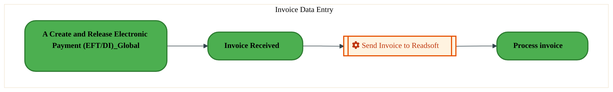
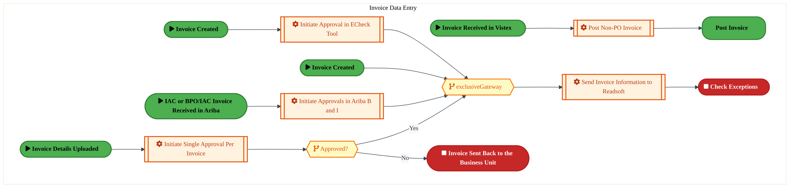

  
  <h1 style="font-size:36px; margin-top:24px;">PM-150 — Enable Payment</h1>
  <h2 style="font-size:24px;">Architecture Document (TOGAF BDAT)</h2>
  
Procure To Pay (PTP) Tower 
  Capability PM-150 · PM Procure Materials and Services (Direct and Indirect)

  
IAO Program · Release 3 
  Generated: March 2026 
  Sajiv Francis

  
IAO Architecture Pipeline — Intel Confidential

Page 1<a href="#toc">↑ Back to TOC</a>PM-150 — Enable Payment

## Table of Contents

1. [Executive Summary](#1-executive-summary)
2. [Business Context & Objectives](#2-business-context--objectives)
   - 2.1 [Classification](#21-classification)
   - 2.2 [Business Drivers](#22-business-drivers)
   - 2.3 [Success Criteria](#23-success-criteria)
   - 2.4 [Companion Documents](#24-companion-documents)
3. [Business Architecture (TOGAF "B")](#3-business-architecture-togaf-b)
   - 3.1 [Business Process Overview](#31-business-process-overview)
   - 3.2 [Business Process Diagrams](#32-business-process-diagrams)
   - 3.3 [Business Roles & Responsibilities](#33-business-roles--responsibilities)
4. [Data Architecture (TOGAF "D")](#4-data-architecture-togaf-d)
   - 4.1 [Data Entities & Ownership](#41-data-entities--ownership)
   - 4.2 [Data Flow Diagrams](#42-data-flow-diagrams)
   - 4.3 [Data Lineage](#43-data-lineage)
   - 4.4 [RICEFW Data Objects](#44-ricefw-data-objects)
   - 4.5 [Data Governance & Quality](#45-data-governance--quality)
5. [Application Architecture (TOGAF "A")](#5-application-architecture-togaf-a)
   - 5.1 [Current-State Application Landscape](#51-current-state--current-state-application-landscape)
   - 5.2 [Future-State Application Landscape](#52-future-state--future-state-application-landscape)
   - 5.3 [Change Impact Summary](#53-change-impact-summary)
   - 5.4 [Component Overview](#54-component-overview)
   - 5.5 [RICEFW Inventory](#55-ricefw-inventory)
   - 5.6 [Integration Patterns](#56-integration-patterns)
6. [Technology Architecture (TOGAF "T")](#6-technology-architecture-togaf-t)
   - 6.1 [Platform & Infrastructure](#61-platform--infrastructure)
   - 6.2 [SAP Development Object Status](#62-sap-development-object-status)
   - 6.3 [NFRs & Design Principles](#63-nfrs--design-principles)
   - 6.4 [Security & Governance](#64-security--governance)
7. [Project Context](#7-project-context)
   - 7.1 [Project Roadmap & Go-Live Plan](#71-project-roadmap--go-live-plan)
   - 7.2 [RAID Log](#72-raid-log)
   - 7.3 [Recommendations & Next Steps](#73-recommendations--next-steps)

Page 2<a href="#toc">↑ Back to TOC</a>PM-150 — Enable Payment

## 1. Executive Summary

This Architecture Document defines the **Business, Data, Application, and Technology** (BDAT) architecture for **PM-150 Enable Payment** within the IAO program. It includes 12 BPMN process diagram(s) in Section 3.
| Dimension | Value |
|-----------|-------|
| **Tower** | Procure To Pay (PTP) |
| **Process Group** | PM Procure Materials and Services (Direct and Indirect) |
| **Capability** | PM-150 - Enable Payment |
| **Release** | Release 3 |
| **Total Systems** | 0 |
| **System Status** | 0 Deployed, 0 Developing, 0 EOL, 0 Pending IAPM |
| **RICEFW Objects** | 26 Interfaces, 21 Enhancements |
**Change Summary**: 0 new flow chains, 0 removed, 0 modified, 0 unchanged between Current-State and Future-State states.

> All system nodes in architecture diagrams are **IAPM-linked** — click any node to open its IAPM page. Diagrams require `securityLevel: 'loose'` for click events.

Page 3<a href="#toc">↑ Back to TOC</a>PM-150 — Enable Payment

## 2. Business Context & Objectives

### 2.1 Classification

| Level | Value |
|-------|-------|
| **L0 Tower** | Procure To Pay |
| **L1 Process** | PM Procure Materials and Services (Direct and Indirect) |
| **L2 Capability** | PM-150 - Enable Payment |

### 2.2 Business Drivers

| # | Driver | Description | Strategic Alignment | Priority |
|---|--------|-------------|---------------------|----------|
| 1 | Procurement Process Standardization | Standardize procurement processes across direct, indirect, and services on S/4 HANA + Ariba | IDM 2.0 Procurement Excellence | High |
| 2 | Supplier Collaboration Enhancement | Enable digital supplier collaboration for consignment, subcontracting, and quality management | Supplier Ecosystem | High |
| 3 | Payment Automation | Automate invoice verification, three-way matching, and payment execution | Finance Efficiency | Medium |
| 4 | PM-150 Process Migration | Migrate Enable Payment business processes and 0 integrated systems from legacy to S/4 HANA target architecture | IDM 2.0 Procurement | High |

Page 4<a href="#toc">↑ Back to TOC</a>PM-150 — Enable Payment

### 2.3 Success Criteria

| Metric | Target | Measure | Baseline | Owner |
|--------|--------|---------|----------|-------|
| PO Cycle Time | < 24 hours | Requisition approval to PO dispatch to supplier | 48 hours (current) | Procurement Lead |
| Invoice Automation Rate | > 80% | Invoices processed without manual intervention (touchless) | 45% (current) | AP Manager |
| Supplier On-Time Delivery | > 95% | Supplier adherence to confirmed delivery date | 89% (current) | Supplier Management |
| PM-150 Migration Completeness | 100% flow chains validated | All 0 flow chains verified in target state | 0% (pre-migration) | Tower Architect |

### 2.4 Companion Documents

| Document | Description |
|----------|-------------|
| **Business Architecture** | Included in this document (Section 3) — process flows from BPMN diagrams |
| **This Document** | Full BDAT Architecture — Business + Data + Application + Technology |

Page 5<a href="#toc">↑ Back to TOC</a>PM-150 — Enable Payment

## 3. Business Architecture (TOGAF "B")

### 3.1 Business Process Overview

This capability includes **12 business process(es)** modeled in BPMN 2.0, covering the end-to-end workflow for PM-150 Enable Payment.

| # | Step ID | Process Name | Lanes | Tasks | Gateways |
|---|---------|--------------|-------|-------|----------|
| 1 | PM-150-010_Match_P.O._and_Goods_Receipt_Notice_(3_Way_Match) | PM-150-010_Match_P.O._and_Goods_Receipt_Notice_(3_Way_Match) | Invoice Resolution Team | 3 | 4 |
| 2 | PM-150-020_Process_Touchless_Invoice_Receipt | PM-150-020_Process_Touchless_Invoice_Receipt | Accounts Payable Accountant | 3 | 2 |
| 3 | PM-150-030_Receive_Invoice_from_Vendor | PM-150-030_Receive_Invoice_from_Vendor | Invoice Data Entry | 1 | 0 |
| 4 | PM-150-060_Process_Non-PO_Invoice | PM-150-060_Process_Non-PO_Invoice | Invoice Data Entry | 5 | 2 |
| 5 | PM-150-080_Match_Receipt_of_Goods_and_Services_to_Invoice_(2-way_match) | PM-150-080_Match_Receipt_of_Goods_and_Services_to_Invoice_(2-way_match) | Invoice Resolution Team | 3 | 5 |
| 6 | PM-150-090_Receive_Procurement_Card_Invoice | PM-150-090_Receive_Procurement_Card_Invoice | Procurement Agent | 4 | 1 |
| 7 | PM-150-100_Process_Procurement_Card_Invoice | PM-150-100_Process_Procurement_Card_Invoice | Procurement Agent | 4 | 1 |
| 8 | PM-150-130_Notify_Appropriate_Party | PM-150-130_Notify_Appropriate_Party | Payment Processor | 5 | 0 |
| 9 | PM-150-160_Propose_Vendor_Payment | PM-150-160_Propose_Vendor_Payment | Payment Processor | 6 | 4 |
| 10 | PM-150-170_Identify_Optimum_Timing_for_Payment | PM-150-170_Identify_Optimum_Timing_for_Payment | Accounts Payable Accountant | 7 | 4 |
| 11 | PM-150-200_Update_Financial_Records | PM-150-200_Update_Financial_Records | Payment Processor | 3 | 1 |
| 12 | PM-150_Enable_Payment | PM-150_Enable_Payment | Accounts Payable Accountant | 1 | 5 |

### 3.2 Business Process Diagrams

Page 6<a href="#toc">↑ Back to TOC</a>PM-150 — Enable Payment

#### BUSINESS ARCHITECTURE — 3.2.1 PM-150-010_Match_P.O._and_Goods_Receipt_Notice_(3_Way_Match) — PM-150-010_Match_P.O._and_Goods_Receipt_Notice_(3_Way_Match)

**Swim Lanes**: Invoice Resolution Team | **Tasks**: 3 | **Gateways**: 4

> **Legend**: ● Start · ● End · User Task · Service Task · ◇ Gateway · Sub-Process

<a href="https://mermaid.live/edit#pako:eNqlVdlu4zYU_RVCQeAWkFGtlqOHFt5UDDAppnFmgsG4DzR1ZbOhRIGkErse_3vJaLHlcR6K6sHwPTzn3EXS1cEiPAUrtm5vD7SgKkaHgdpCDoMYDdZYwsBGNfAFC4rXDOTAcDJeqCX9543mBuXO0AyW4JyyvUGXsOGAPn-w0UQLmY0kLuRQgqDZwB6UguZY7GeccWHYNzDOnOwtW3M05SIFcSI4TuSSUEsZLeAE-1EQBYnRSSC8SHumWZiNMzI4muIYfyVbLNRb-ZWEe7x7oqna6jjDTILmbFXOPuI1MNOjEpXBSCVe2mFQafIUemDLEhNabDQeOBoSuHg-QaFzPKLj7e2q6JKix_mqQPoiDEs5hwxJpeHFi0IZZSy-CWaTJHRsqQR_hvjGW0Rz37OJ6STWrTu2Ge7wFehmq-I1Z2lDHb6aHmKv3NliF3uOLfb69yIXFOkp02zkjb1xl2kauTN31mbKsux_ZdJzFY9YPje5Fn7iJfMulxuOwpnzo1_b5jyIJu7lnEC8UAJnpkmS-IvTqBaj0HXeN50m_siZXZhusIJXvD8Z3s2CzjAJo8SN3jWs811WWa0_CU5aQ38RJmFnGE3dZOK9axhM3GDcVKh9NgKXW_SheOG6bfQAkrNKUV6gR8B5zTJX4X5bWRmOMzw0Q0efQGRc5OjPCheKqj2aMk6e0ROsyZ4wWFl_nWm9vvYB_gaiupxTrIWKo2VVloyC6Gv9b52Y8E2X10dPeqD3WJGt5p8Lgp86Qck05wEI0BcwXDCbQWr-z2f88MSXipdoxvO8KijR9PRsLqZkM5Z-oedGI-1j7gpIiR55RbbM_Ds56DJK1W8u0pK2vpaYCZ6jL_od4heTGB8Op0mkMFzrNUC2aFLs0ZxKIqDU8R79gu6pzM1gfltZx-OZwd11A9gRVkldwu_1Y3qhcp3rMh-9tndAT4SYtrOKXeZ03f-aVHde_yl8NBz-qvtuwqgO75rwrg79Jgz6p24dus2bU3h1HLbHzfmoiccm_L6yvoJ-PL7r8wv8D17DLe46l4IfThqJd_bqmrLaldWDveuwf76OeidBt9B7cNjs3h44us6NrsPjdlv10LurqO71Kuy2sGVbOYgc09SKD9bbd11_-1PIcMWUdbQtXCm-3BfEit--f1ZVplo5p1ivpbwGj_8CjLKaag==" title="Edit in Mermaid Live">&#9998; Edit in Mermaid Live</a>

#### BUSINESS ARCHITECTURE — 3.2.2 PM-150-020_Process_Touchless_Invoice_Receipt — PM-150-020_Process_Touchless_Invoice_Receipt

**Swim Lanes**: Accounts Payable Accountant | **Tasks**: 3 | **Gateways**: 2

```mermaid
%%{init: {'theme': 'base', 'themeVariables': {'fontSize': '14px', 'fontFamily': 'Segoe UI, Arial, sans-serif','primaryColor': '#e8f0fe', 'primaryBorderColor': '#0071c5','lineColor': '#37474F', 'secondaryColor': '#f5f8fc'}, 'flowchart': {'useMaxWidth': false, 'htmlLabels': true, 'curve': 'basis', 'nodeSpacing': 40, 'rankSpacing': 50}} }%%
flowchart TD
    classDef startEvt fill:#4CAF50,stroke:#2E7D32,color:#000,font-weight:bold,stroke-width:2px,rx:20,ry:20
    classDef endEvt fill:#C62828,stroke:#B71C1C,color:#fff,font-weight:bold,stroke-width:2px,rx:20,ry:20
    classDef userTask fill:#E3F2FD,stroke:#1565C0,stroke-width:2px,color:#0D47A1
    classDef serviceTask fill:#FFF3E0,stroke:#E65100,stroke-width:2px,color:#BF360C
    classDef gateway fill:#FFF9C4,stroke:#F57F17,stroke-width:2px,color:#E65100
    classDef subProc fill:#F3E5F5,stroke:#7B1FA2,stroke-width:2px,color:#4A148C
    subgraph Accounts Payable Accountant
        n1["fa:fa-user Process Invoice Manually"]
        n2[["fa:fa-cog Execute Touchless Invoice Processing"]]
        n3[["fa:fa-cog Post Invoice Receipt"]]
        n4["Identify Optimum Timing for payment"]
        n5["Exception Handling"]
        n6{{"fa:fa-code-branch Execution Type?"}}
        n7{{"fa:fa-code-branch exclusiveGateway"}}
    end
    n2 --> n7
    n3 --> n4
    n1 --> n7
    n7 --> n3
    n6 -->|"Stop"| n1
    n6 -->|"Auto Post"| n2
    n5 --> n6
    class n1 userTask
    class n2 serviceTask
    class n3 serviceTask
    class n4 startEvt
    class n5 startEvt
    class n6 gateway
    class n7 gateway
```

> **Legend**: ● Start · ● End · User Task · Service Task · ◇ Gateway · Sub-Process

<a href="https://mermaid.live/edit#pako:eNqlVV2P6jYQ_StWVitegpRPQvPQigXSrtSrrgptHy59MM4YrHXsyHZYUi7_vTYJn7371Dwg5sycc2ZGdnLwiCzBy73n5wMTzOToMDBbqGCQo8Eaaxj4qAP-xIrhNQc9cDVUCrNg_5zKwqTeuzKHFbhivHXoAjYS0B-vPppYIveRxkIPNShGB_6gVqzCqp1KLpWrfoIxDejJrU-9SFWCuhYEQRaS1FI5E3CF4yzJksLxNBApyjtRmtIxJYOja47LD7LFypzabzR8wfu_WGm2NqaYa7A1W1PxX_EauJvRqMZhpFG78zKYdj7CLmxRY8LExuJJYCGFxfsVSoPjER2fn1fiYoqWs5VA9iEcaz0DirSx8HxnEGWc50_JdFKkga-Nku-QP0XzbBZHPnGT5Hb0wHfLHX4A22xNvpa87EuHH26GPKr3vtrnUeCr1v4-eIEor07TUTSOxhenlyychtOzE6X0fznZvaol1u-91zwuomJ28QrTUToN_qt3HnOWZJPwcU-gdozAjWhRFPH8uqr5KA2Dz0VfingUTB9EN9jAB26vgj9Mk4tgkWZFmH0q2Pk9dtms35QkZ8F4nhbpRTB7CYtJ9KlgMgmTcd-h1dkoXG_RhBDZCKPRG27drTsDWJiu0j0i_LryKM4pHrrFI9cCaI1exU7anaEvWDSY83bl_X1Dir5eWERu0HwPpDGAlrIhW35L7-XsobYCtwrxvcKb1OZC-h0IsNo8MBJLeC1BGEZb9FttWNVUaMkqq42oVKjGbWWz942mljTfE7DlUqBfsCh518tNzehwuLZSwnBtryLZ9kM52rKt4aeVdzzekLLvk2BPeKPZDn7ujseVZS9Q90dEaDj80Sr0YdyFSR-G99msC-M-HLnw28pbGFmvvG-2_CExaYw8bfOUjfps2qmMbo6cczpftTs4ur0vd5n400xyeRfdwen34dH58tyh2Rn1fK8CVWFWevnBO3047MelBIobbryj72E746IVxMtPL1ivqUvLnDFsz33Vgcd_AbT2G-M=" title="Edit in Mermaid Live">&#9998; Edit in Mermaid Live</a>

Page 7<a href="#toc">↑ Back to TOC</a>PM-150 — Enable Payment

#### BUSINESS ARCHITECTURE — 3.2.3 PM-150-030_Receive_Invoice_from_Vendor — PM-150-030_Receive_Invoice_from_Vendor

**Swim Lanes**: Invoice Data Entry | **Tasks**: 1 | **Gateways**: 0

> **Legend**: ● Start · ● End · User Task · Service Task · ◇ Gateway · Sub-Process

<a href="https://mermaid.live/edit#pako:eNqlVNuO2jAU_BUrK5RWCmquhOahEptLtVIrrZZt-7BUlUmOwVrHRra5FfHvdQiES7tPzQPiTObMzDlJvLNKUYGVWL3ejnKqE7Sz9RxqsBNkT7EC20Et8B1LiqcMlN1wiOB6TH8faF642DS0BitwTdm2QccwE4C-PThoZBqZgxTmqq9AUmI79kLSGsttKpiQDfsOhsQlB7fjrXshK5BnguvGXhmZVkY5nOEgDuOwaPoUlIJXV6IkIkNS2vsmHBPrco6lPsRfKviKNz9opeemJpgpMJy5rtkXPAXWzKjlssHKpVydlkFV48PNwsYLXFI-M3joGkhi_nqGIne_R_teb8I7U_ScTTgyV8mwUhkQpLSB85VGhDKW3IXpqIhcR2kpXiG58_M4C3ynbCZJzOiu0yy3vwY6m-tkKlh1pPbXzQyJv9g4cpP4riO35vfGC3h1dkoH_tAfdk73sZd66cmJEPJfTmav8hmr16NXHhR-kXVeXjSIUvdvvdOYWRiPvNs9gVzREi5Ei6II8vOq8kHkuW-L3hfBwE1vRGdYwxpvz4If07ATLKK48OI3BVu_25TL6aMU5UkwyKMi6gTje68Y-W8KhiMvHB4TGp2ZxIs5euArYcZGGdYY5VzLbUtoLu69vEwsghOC-6WYobF5vl2DFugJcKUE0RPr58-LLt80NSFBKURbtmFcEAJDGKFUgtkOwkbzCRiYIwDlDEoTntMSPeJtDVyjd3nx_CF7eP_rMxNTzK6FQiN0yvMEJdAVVB3DhG3_cA_1-59MrmMZtGV4LMO2vHwfmpaL9-Hqjt99UVdw8G847GDLsWqQNaaVleysw0lnTsMKCF4ybe0dCy-1GG95aSWHE8FaLiqzn4xi86DqFtz_AUugr48=" title="Edit in Mermaid Live">&#9998; Edit in Mermaid Live</a>

Page 8<a href="#toc">↑ Back to TOC</a>PM-150 — Enable Payment

#### BUSINESS ARCHITECTURE — 3.2.4 PM-150-060_Process_Non-PO_Invoice — PM-150-060_Process_Non-PO_Invoice

**Swim Lanes**: Invoice Data Entry | **Tasks**: 5 | **Gateways**: 2

> **Legend**: ● Start · ● End · User Task · Service Task · ◇ Gateway · Sub-Process

<a href="https://mermaid.live/edit#pako:eNqlVm2P2jgQ_itWVivupKDmlbD5cCcI5LRSr0Vl21NV-sEkE7DWxJFtWDjKfz-bJARSotPp8gFlnpl5npmxsXM0EpaCERqPj0eSExmiY0-uYQO9EPWWWEDPRCXwBXOClxRET8dkLJdz8vc5zPaKvQ7TWIw3hB40OocVA_T52UQjlUhNJHAu-gI4yXpmr-Bkg_khYpRxHf0Aw8zKzmqVa8x4CrwJsKzATnyVSkkODewGXuDFOk9AwvL0hjTzs2GW9E66OMrekjXm8lz-VsCfeP8XSeVa2RmmAlTMWm7oe7wEqnuUfKuxZMt39TCI0Dq5Gti8wAnJVwr3LAVxnL82kG-dTuj0-LjIL6LoZbLIkXoSioWYQIaEVPB0J1FGKA0fvGgU-5YpJGevED4402DiOmaiOwlV65aph9t_A7Jay3DJaFqF9t90D6FT7E2-Dx3L5Af129KCPG2UooEzdIYXpXFgR3ZUK2VZ9r-U1Fz5CxavldbUjZ14ctGy_YEfWT_z1W1OvGBkt-cEfEcSuCKN49idNqOaDnzb6iYdx-7AilqkKyzhDR8awqfIuxDGfhDbQSdhqdeucruccZbUhO7Uj_0LYTC245HTSeiNbG9YVah4VhwXa_Sc75hqG02wxGiaS34oA_ST29--LYwMhxnuJ2ylYokkqiM0V_uPAhoVBWc7TNEMeE20ML5_v2JwbhnmaodcJJ_zjPENloTlSDL0CXAqWCZbDO4tw4wJiT6wvD_72CHpdRRdVysQyfVRscRojLCup0Xg_wuBzp9Ga0he0QtjtJU9-OWSXVC19JcBg8REiX8uKMMppCrt16u0oCMt4qC029HD_xT91BH9CRIgO0h1Q1-IkLBvJdpWO3MUIcbRePbxnX69R3SebJvHbniEZAUqpzfdJ1Do5RfteKcVXwup_SPRGKtctWHUbYHGW6FOaaHGqlapzeIqkvN-aTbKtds7Hpt1TqG_VKdrsq6WGdLfF8bpdB3v34-HfUJVFTv4o_yzN2lqs5cv-QD1-78pisq0K9Or7KfSdmu3p-0fC-MrqMn80NKVx6sSa9v2S8Cp7KDlH5Z2bfrtdKsE6jrcyv9TIR9YWUet41SB14eobuvqEL3xOJ0et9PjdXr8Ts_gct3dwMF9eHgffroPq2Hdx-3q3rtFnbuo28Hh1VfFLezXsGEaG1CHJUmN8Gicv5PUt1QKGd5SaZxMA28lmx_yxAjP3xPGtkhV5oRgdcxvSvD0D3Po-iw=" title="Edit in Mermaid Live">&#9998; Edit in Mermaid Live</a>

Page 9<a href="#toc">↑ Back to TOC</a>PM-150 — Enable Payment

#### BUSINESS ARCHITECTURE — 3.2.5 PM-150-080_Match_Receipt_of_Goods_and_Services_to_Invoice_(2-way_match) — PM-150-080_Match_Receipt_of_Goods_and_Services_to_Invoice_(2-way_match)

**Swim Lanes**: Invoice Resolution Team | **Tasks**: 3 | **Gateways**: 5

> **Legend**: ● Start · ● End · User Task · Service Task · ◇ Gateway · Sub-Process

<a href="https://mermaid.live/edit#pako:eNqlVluPozYY_SsWo1G2EkhcQ8LDVpkkVCu11Wgy3apq-uDAR-Idgqltcmk2_712wCSwGa2q8hDlO5xzvoux4WQkNAUjMh4fT6QgIkKngdjAFgYRGqwwh4GJauAzZgSvcuADxcloIRbknwvN8cuDoiksxluSHxW6gDUF9NsnE02kMDcRxwW3ODCSDcxBycgWs-OU5pQp9gOMMju7ZGtuPVGWArsSbDt0kkBKc1LAFfZCP_RjpeOQ0CLtmGZBNsqSwVkVl9N9ssFMXMqvOPyCD7-TVGxknOGcg-RsxDb_Ga8gVz0KViksqdhOD4NwlaeQA1uUOCHFWuK-LSGGi7crFNjnMzo_Pi6LNil6nS0LJK8kx5zPIENcSHi-EygjeR49-NNJHNgmF4y-QfTgzsOZ55qJ6iSSrdumGq61B7LeiGhF87ShWnvVQ-SWB5MdItc22VH-9nJBkV4zTYfuyB21mZ5CZ-pMdaYsy_5XJjlX9or5W5Nr7sVuPGtzOcEwmNrf-uk2Z344cfpzArYjCdyYxnHsza-jmg8Dx37f9Cn2hva0Z7rGAvb4eDUcT_3WMA7C2AnfNazz9ausVs-MJtrQmwdx0BqGT048cd819CeOP2oqlD5rhssN-lTsqGwbvQCneSUILdAr4G3NUlfh_Lk0Mhxl2FJDR5OyZHSHc6lIgOwgXRp_3bDdLlvbL6AQaIWTNyQoWlRlmRNgXaXXVb7AjsAerY5o8oxUz8A5ZUo-AwFsKzen5FiCkfVa0qlSfIFEdE39D60rF7T8bj0_3GiDnvaZcqENetShZDbzaFNkjG7RZ7klaK_R8HTSvupMtFZyVyeb62B1f1itxo9L43y-EY_ui1_g7wpkeRm9WSGr-QvpdTyQ9h3H9x3hkOQVlw39VD_DPZVjv1dIuyQv8aSfy3H-azI5v_pPMUSW9VFZNHGo4q9L4w_gS-OrnEyDjxpc9365qUVubeI3oVOH457lr_Qi0rDXZLa1ym54-omTXFffayzDJh7XYdArTi_GRet966uHWBd_e1apovXp14Hd-7B3H_abw7oDBvfAYfsK6cChPtw66OguOr6Lynbvwo6GDdPYyp2ASWpEJ-PycSA_IFLIcJUL42wauBJ0cSwSI7q8RI2qTKVyRrA827Y1eP4XhkCxYQ==" title="Edit in Mermaid Live">&#9998; Edit in Mermaid Live</a>

Page 10<a href="#toc">↑ Back to TOC</a>PM-150 — Enable Payment

#### BUSINESS ARCHITECTURE — 3.2.6 PM-150-090_Receive_Procurement_Card_Invoice — PM-150-090_Receive_Procurement_Card_Invoice

**Swim Lanes**: Procurement Agent | **Tasks**: 4 | **Gateways**: 1

> **Legend**: ● Start · ● End · User Task · Service Task · ◇ Gateway · Sub-Process

<a href="https://mermaid.live/edit#pako:eNqlVU2P2kgQ_Sstj0ZkJaP4E4MPKzEGZ0fKrEYhyR7CHhq7DK1p2qS7PQNB_PetxsZgljmFg0W9qvfqw93lvZWVOVixdX-_Z4LpmOx7egVr6MWkt6AKejapge9UMrrgoHompiiFnrFfxzA32GxNmMFSumZ8Z9AZLEsg3x5tMkYit4miQvUVSFb07N5GsjWVu6TkpTTRdzAsnOKYrXE9lDIHeQ5wnMjNQqRyJuAM-1EQBanhKchKkXdEi7AYFlnvYIrj5Vu2olIfy68UPNHtPyzXK7QLyhVgzEqv-We6AG561LIyWFbJ19MwmDJ5BA5stqEZE0vEAwchScXLGQqdw4Ec7u_nok1Kvk7mguAv41SpCRREaYSnr5oUjPP4LkjGaejYSsvyBeI7bxpNfM_OTCcxtu7YZrj9N2DLlY4XJc-b0P6b6SH2NltbbmPPseUOn1e5QOTnTMnAG3rDNtND5CZucspUFMVvZcK5yq9UvTS5pn7qpZM2lxsOwsT5v96pzUkQjd3rOYF8ZRlciKZp6k_Po5oOQtd5X_Qh9QdOciW6pBre6O4sOEqCVjANo9SN3hWs811XWS2eZZmdBP1pmIatYPTgpmPvXcFg7AbDpkLUWUq6WRGjVkm8dkKT8RKftd_8hPtjbhU0LmjfjJs85uhmxY58gZ8VqzmKjDmePTyPHaWEypx8U3QJ88pznMXc-vdC1-vqPlcSz67CO6xu6XS5fpc7rvSqlLgfSPKc1Gn_wqMEsssKfrS0rFySJyqwNPLcPxJO-RVyLknhh5a04fgSHzWsyd8AOeREl2QBLdPU-McFc4DEtqsnPANmMSlCRU5m9TFT3foiQ6C7Y88zjYT6n3kdnbghxk2F2Y6kCe_6R-j_9PljUiqcHXpxQrMN3kp8TZmuKMdBXc3Tdfb782hy6C9wx2QrAtuMV4q9wqf6CM-tw6GmoVz9R4Sk3_8TJRrTrU2_Mb3G65zcTg0EjR3UZtSYUW2OGnNUm8Mr8qCx_dr0Lq6HKeC0Fjqwdxv2b8PB5SboeMJ2l3bgwW04ug0Pb8Oj2zC23awQy7bWINeU5Va8t44fSvyY5lDQimvrYFu00uVsJzIrPn5QrGqTI3PCKN7zdQ0e_gO2SmJS" title="Edit in Mermaid Live">&#9998; Edit in Mermaid Live</a>

```mermaid
%%{init: {'theme': 'base', 'themeVariables': {'fontSize': '14px', 'fontFamily': 'Segoe UI, Arial, sans-serif','primaryColor': '#e8f0fe', 'primaryBorderColor': '#0071c5','lineColor': '#37474F', 'secondaryColor': '#f5f8fc'}, 'flowchart': {'useMaxWidth': false, 'htmlLabels': true, 'curve': 'basis', 'nodeSpacing': 40, 'rankSpacing': 50}} }%%
flowchart TD
    classDef startEvt fill:#4CAF50,stroke:#2E7D32,color:#000,font-weight:bold,stroke-width:2px,rx:20,ry:20
    classDef endEvt fill:#C62828,stroke:#B71C1C,color:#fff,font-weight:bold,stroke-width:2px,rx:20,ry:20
    classDef userTask fill:#E3F2FD,stroke:#1565C0,stroke-width:2px,color:#0D47A1
    classDef serviceTask fill:#FFF3E0,stroke:#E65100,stroke-width:2px,color:#BF360C
    classDef gateway fill:#FFF9C4,stroke:#F57F17,stroke-width:2px,color:#E65100
    classDef subProc fill:#F3E5F5,stroke:#7B1FA2,stroke-width:2px,color:#4A148C
    subgraph Procurement Agent
        n1["fa:fa-user Identify Requirements Allowing Procurement Card Usage​"]
        n2["fa:fa-user Purchase Using Procurement Card"]
        n3["fa:fa-user Authorize CPC Card Holder"]
        n4[["fa:fa-cog Manage P-Card Purchases"]]
        n5(["fa:fa-play Item Needed to be Purchased"])
        n6["Purchase Materials and Services"]
        n7["Payment Statement Sent"]
        n8["Enable Payment"]
        n9["GL/Cost Center Spends Actualized"]
        n10{{"fa:fa-code-branch exclusiveGateway"}}
    end
    n5 --> n1
    n1 --> n3
    n2 --> n10
    n10 --> n4
    n4 --> n7
    n7 --> n9
    n9 --> n8
    n10 --> n6
    n3 --> n2
    class n1 userTask
    class n2 userTask
    class n3 userTask
    class n4 serviceTask
    class n5 startEvt
    class n6 startEvt
    class n7 startEvt
    class n8 startEvt
    class n9 startEvt
    class n10 gateway
```

#### BUSINESS ARCHITECTURE — 3.2.7 PM-150-100_Process_Procurement_Card_Invoice — PM-150-100_Process_Procurement_Card_Invoice

**Swim Lanes**: Procurement Agent | **Tasks**: 4 | **Gateways**: 1

> **Legend**: ● Start · ● End · User Task · Service Task · ◇ Gateway · Sub-Process

<a href="https://mermaid.live/edit#pako:eNqlVU2P2kgQ_Sstj0ZkJaP4E4MPKzEGZ0fKrEYhyR7CHhq7DK1p2qS7PQNB_PetxsZgljmFg0W9qvfqw93lvZWVOVixdX-_Z4LpmOx7egVr6MWkt6AKejapge9UMrrgoHompiiFnrFfxzA32GxNmMFSumZ8Z9AZLEsg3x5tMkYit4miQvUVSFb07N5GsjWVu6TkpTTRdzAsnOKYrXE9lDIHeQ5wnMjNQqRyJuAM-1EQBanhKchKkXdEi7AYFlnvYIrj5Vu2olIfy68UPNHtPyzXK7QLyhVgzEqv-We6AG561LIyWFbJ19MwmDJ5BA5stqEZE0vEAwchScXLGQqdw4Ec7u_nok1Kvk7mguAv41SpCRREaYSnr5oUjPP4LkjGaejYSsvyBeI7bxpNfM_OTCcxtu7YZrj9N2DLlY4XJc-b0P6b6SH2NltbbmPPseUOn1e5QOTnTMnAG3rDNtND5CZucspUFMVvZcK5yq9UvTS5pn7qpZM2lxsOwsT5v96pzUkQjd3rOYF8ZRlciKZp6k_Po5oOQtd5X_Qh9QdOciW6pBre6O4sOEqCVjANo9SN3hWs811XWS2eZZmdBP1pmIatYPTgpmPvXcFg7AbDpkLUWUq6WRGjVkm8dkKT8RKftd_8hPtjbhU0LmjfjJs85uhmxY58gZ8VqzmKjDmePTyPHaWEypx8U3QJ88pznMXc-vdC1-vqPlcSz67CO6xu6XS5fpc7rvSqlLgfSPKc1Gn_wqMEsssKfrS0rFySJyqwNPLcPxJO-RVyLknhh5a04fgSHzWsyd8AOeREl2QBLdPU-McFc4DEtqsnPANmMSlCRU5m9TFT3foiQ6C7Y88zjYT6n3kdnbghxk2F2Y6kCe_6R-j_9PljUiqcHXpxQrMN3kp8TZmuKMdBXc3Tdfb782hy6C9wx2QrAtuMV4q9wqf6CM-tw6GmoVz9R4Sk3_8TJRrTrU2_Mb3G65zcTg0EjR3UZtSYUW2OGnNUm8Mr8qCx_dr0Lq6HKeC0Fjqwdxv2b8PB5SboeMJ2l3bgwW04ug0Pb8Oj2zC23awQy7bWINeU5Va8t44fSvyY5lDQimvrYFu00uVsJzIrPn5QrGqTI3PCKN7zdQ0e_gO2SmJS" title="Edit in Mermaid Live">&#9998; Edit in Mermaid Live</a>

Page 11<a href="#toc">↑ Back to TOC</a>PM-150 — Enable Payment

#### BUSINESS ARCHITECTURE — 3.2.8 PM-150-130_Notify_Appropriate_Party — PM-150-130_Notify_Appropriate_Party

**Swim Lanes**: Payment Processor | **Tasks**: 5 | **Gateways**: 0

```mermaid
%%{init: {'theme': 'base', 'themeVariables': {'fontSize': '14px', 'fontFamily': 'Segoe UI, Arial, sans-serif','primaryColor': '#e8f0fe', 'primaryBorderColor': '#0071c5','lineColor': '#37474F', 'secondaryColor': '#f5f8fc'}, 'flowchart': {'useMaxWidth': false, 'htmlLabels': true, 'curve': 'basis', 'nodeSpacing': 40, 'rankSpacing': 50}} }%%
flowchart TD
    classDef startEvt fill:#4CAF50,stroke:#2E7D32,color:#000,font-weight:bold,stroke-width:2px,rx:20,ry:20
    classDef endEvt fill:#C62828,stroke:#B71C1C,color:#fff,font-weight:bold,stroke-width:2px,rx:20,ry:20
    classDef userTask fill:#E3F2FD,stroke:#1565C0,stroke-width:2px,color:#0D47A1
    classDef serviceTask fill:#FFF3E0,stroke:#E65100,stroke-width:2px,color:#BF360C
    classDef gateway fill:#FFF9C4,stroke:#F57F17,stroke-width:2px,color:#E65100
    classDef subProc fill:#F3E5F5,stroke:#7B1FA2,stroke-width:2px,color:#4A148C
    subgraph Payment Processor
        n1["Gather Approvals in APM"]
        n2[["fa:fa-cog Call Standard Events"]]
        n3[["fa:fa-cog Transfer MBC Data to Bank"]]
        n4[["fa:fa-cog Stop Generation of Payment Advise"]]
        n5["Send File for Remittance Advice"]
        n6(["fa:fa-stop Remittance Advice Sent"])
        n7["Payment Program Run completed"]
        n8["Landing Page - PM-150-180 Create and Release Electronic Payment (EFT/DI)"]
    end
    n8 --> n2
    n1 --> n3
    n3 --> n5
    n5 --> n6
    n7 --> n1
    n2 --> n4
    n4 --> n7
    class n2 serviceTask
    class n3 serviceTask
    class n4 serviceTask
    class n6 endEvt
    class n7 startEvt
    class n8 startEvt
```

> **Legend**: ● Start · ● End · User Task · Service Task · ◇ Gateway · Sub-Process

<a href="https://mermaid.live/edit#pako:eNqlVU1v2zgQ_SuEgsAtIGH1aXl1WMCWraJAAwR1dnto9kBLI5sIRQok7cQb-L_v0FLkj8Kn6mB4Hue9NzMiqXenlBU4mXN__84EMxl5H5kNNDDKyGhFNYxc0gH_UMXoioMe2ZxaCrNk_x3Tgrh9s2kWK2jD-N6iS1hLIH9_dckUidwlmgrtaVCsHrmjVrGGqn0uuVQ2-w4mtV8f3fqlmVQVqFOC76dBmSCVMwEnOErjNC4sT0MpRXUhWif1pC5HB1scl6_lhipzLH-r4YG-_WCV2WBcU64Bczam4d_oCrjt0aitxcqt2n0Mg2nrI3Bgy5aWTKwRj32EFBUvJyjxDwdyuL9_FoMpeZo_C4JPyanWc6iJNggvdobUjPPsLs6nReK72ij5AtlduEjnUeiWtpMMW_ddO1zvFdh6Y7KV5FWf6r3aHrKwfXPVWxb6rtrj75UXiOrklI_DSTgZnGZpkAf5h1Nd17_lhHNVT1S_9F6LqAiL-eAVJOMk93_V-2hzHqfT4HpOoHashDPRoiiixWlUi3ES-LdFZ0U09vMr0TU18Er3J8E_83gQLJK0CNKbgp3fdZXb1aOS5YdgtEiKZBBMZ0ExDW8KxtMgnvQVos5a0XZDHum-AWGIVQWtperW7SOCn8_OF4qHUpFp2yq5w-1LmCDTx4dn59-zxPAnZtY0q6lXyjXJKedkaag9JBVZ7FBfI-GcEV0ynnBj6xp9HmY5mVNDiZFkhpv9ihZf0pZGtuQLCFDUMCmIrId-ptWOabiiJ8he4iYlBeNAaqnId2iYwUpLODJKuGxs_Gnw09brl3SCcgY5n89IKXLOxopzbsj3rSClbFoOBqpLjwmmf8NZ4ZnG6tdAPPL44AWJ7wUTn-QKcA8RXEdzDnhRkgWHEl-xYOXQ7adF8fTH_OvnQRmb7P6ICfG8v_AV9WHQhVEfRl2Y9GHSheM-TLuwPyoi7MK4D-MuTM-2qM05O0gXK9HNlfjmyri_Ui7AdLjTLuDJADuu04BqKKuc7N05flTww1NBTbfcOAfXoVsjl3tROtnx8nW2bYVDnjNq31UHHv4HiN4ckQ==" title="Edit in Mermaid Live">&#9998; Edit in Mermaid Live</a>

#### BUSINESS ARCHITECTURE — 3.2.9 PM-150-160_Propose_Vendor_Payment — PM-150-160_Propose_Vendor_Payment

**Swim Lanes**: Payment Processor | **Tasks**: 6 | **Gateways**: 4

```mermaid
%%{init: {'theme': 'base', 'themeVariables': {'fontSize': '14px', 'fontFamily': 'Segoe UI, Arial, sans-serif','primaryColor': '#e8f0fe', 'primaryBorderColor': '#0071c5','lineColor': '#37474F', 'secondaryColor': '#f5f8fc'}, 'flowchart': {'useMaxWidth': false, 'htmlLabels': true, 'curve': 'basis', 'nodeSpacing': 40, 'rankSpacing': 50}} }%%
flowchart TD
    classDef startEvt fill:#4CAF50,stroke:#2E7D32,color:#000,font-weight:bold,stroke-width:2px,rx:20,ry:20
    classDef endEvt fill:#C62828,stroke:#B71C1C,color:#fff,font-weight:bold,stroke-width:2px,rx:20,ry:20
    classDef userTask fill:#E3F2FD,stroke:#1565C0,stroke-width:2px,color:#0D47A1
    classDef serviceTask fill:#FFF3E0,stroke:#E65100,stroke-width:2px,color:#BF360C
    classDef gateway fill:#FFF9C4,stroke:#F57F17,stroke-width:2px,color:#E65100
    classDef subProc fill:#F3E5F5,stroke:#7B1FA2,stroke-width:2px,color:#4A148C
    subgraph Payment Processor
        n1["Initiate Payment Process"]
        n2["Input Parameters Details for Payment"]
        n3["Execute Manual Payment Proposal"]
        n4["Review Payment Proposal"]
        n5["Involve Processor to Clear the Concerns"]
        n6[["fa:fa-cog Execute Scheduled Payment Proposal"]]
        n7["Create and Release Electronic Payment (EFT/EDI)"]
        n8["Identify Optimum Timing for Payment"]
        n9{{"fa:fa-code-branch Type?"}}
        n10{{"fa:fa-code-branch Errors Found?"}}
        n11{{"fa:fa-code-branch exclusiveGateway"}}
        n12{{"fa:fa-code-branch exclusiveGateway"}}
    end
    n8 --> n9
    n1 --> n2
    n2 --> n3
    n3 --> n12
    n9 -->|"Manual"| n1
    n4 --> n10
    n10 -->|"Yes"| n5
    n9 -->|"Automatic"| n6
    n5 --> n11
    n10 -->|"No"| n11
    n12 --> n4
    n6 --> n12
    n11 --> n7
    class n6 serviceTask
    class n7 startEvt
    class n8 startEvt
    class n9 gateway
    class n10 gateway
    class n11 gateway
    class n12 gateway
```

> **Legend**: ● Start · ● End · User Task · Service Task · ◇ Gateway · Sub-Process

<a href="https://mermaid.live/edit#pako:eNqlVWuPozYU_SsWo1FaiahAIGT40CpDoBppt11tpq2qTT845pJYY2xkmzyazX-vCZAHm1FVlQ9R7rnnnPsAzMEiIgMrsh4fD5RTHaHDQK-hgEGEBkusYGCjBvgdS4qXDNSg5uSC6zn9-0Rz_XJX02osxQVl-xqdw0oA-u3FRlMjZDZSmKuhAknzgT0oJS2w3MeCCVmzH2CSO_mpWpt6FjIDeSE4TuiSwEgZ5XCBR6Ef-mmtU0AEz25M8yCf5GRwrJtjYkvWWOpT-5WCj3j3B8302sQ5ZgoMZ60L9gEvgdUzalnVGKnkplsGVXUdbhY2LzGhfGVw3zGQxPztAgXO8YiOj48Lfi6KXmcLjsxFGFZqBjlS2sDJRqOcMhY9-PE0DRxbaSneIHrwknA28mxSTxKZ0R27Xu5wC3S11tFSsKylDrf1DJFX7my5izzHlnvz26sFPLtUisfexJucKz2HbuzGXaU8z_9XJbNX-YrVW1srGaVeOjvXcoNxEDvf-nVjzvxw6vb3BHJDCVyZpmk6Si6rSsaB67xv-pyOxk7cM11hDVu8vxg-xf7ZMA3C1A3fNWzq9buslp-kIJ3hKAnS4GwYPrvp1HvX0J-6_qTt0PisJC7X6BPeF8A1ql1BKSGbfH1x98vCejHvKjVT9IkL668rpndilpVJY4kL0CAVmoHGlCmUC9mpb1Ujo0p2QCpj_xHzCrPrKqVQmN0KfCP4DBsK238hBqd-NoJt4DIZ0gLFDLD5swYUC05A8t4g4y9GmeMox0MiVqjrbk7WkFUMsnt1r_WhkccS6oVhnqHPYOopQAkDYu4Kp-Rs8F2Svv6QzF6-v21gUneeGQLN9-jXUtOiKtArLcwb__4inw6HS9cZDJfmnCBr9Lov4aeFdTxe31PnPjeRUph7loqKZ99o3Psa2BFWKbqBn5vHvC_z_qvMnB_NHz5Bw-GPZrA2dJvQa0OvCUdtOGpCt0s_1fHXhdU8Uwvrq8m1Kb-lOp2x03L_BHUiBj2PaaVFgTUlp-y4zQatjdu3-UU05c6JtlW_jce9Vt12svDqPa9ZV6fRTSY8n-c38OQ-_NQdQDeoafYu7N6HvQ62bKsAWWCaWdHBOn2rzfc8gxxXTFtH28JmV_M9J1Z0-qZZVZkZ5Yxic9QUDXj8B8r-iS0=" title="Edit in Mermaid Live">&#9998; Edit in Mermaid Live</a>

Page 12<a href="#toc">↑ Back to TOC</a>PM-150 — Enable Payment

#### BUSINESS ARCHITECTURE — 3.2.10 PM-150-170_Identify_Optimum_Timing_for_Payment — PM-150-170_Identify_Optimum_Timing_for_Payment

**Swim Lanes**: Accounts Payable Accountant | **Tasks**: 7 | **Gateways**: 4

```mermaid
%%{init: {'theme': 'base', 'themeVariables': {'fontSize': '14px', 'fontFamily': 'Segoe UI, Arial, sans-serif','primaryColor': '#e8f0fe', 'primaryBorderColor': '#0071c5','lineColor': '#37474F', 'secondaryColor': '#f5f8fc'}, 'flowchart': {'useMaxWidth': false, 'htmlLabels': true, 'curve': 'basis', 'nodeSpacing': 40, 'rankSpacing': 50}} }%%
flowchart TD
    classDef startEvt fill:#4CAF50,stroke:#2E7D32,color:#000,font-weight:bold,stroke-width:2px,rx:20,ry:20
    classDef endEvt fill:#C62828,stroke:#B71C1C,color:#fff,font-weight:bold,stroke-width:2px,rx:20,ry:20
    classDef userTask fill:#E3F2FD,stroke:#1565C0,stroke-width:2px,color:#0D47A1
    classDef serviceTask fill:#FFF3E0,stroke:#E65100,stroke-width:2px,color:#BF360C
    classDef gateway fill:#FFF9C4,stroke:#F57F17,stroke-width:2px,color:#E65100
    classDef subProc fill:#F3E5F5,stroke:#7B1FA2,stroke-width:2px,color:#4A148C
    subgraph Accounts Payable Accountant
        n1["Receive Base Line Date and Payment Terms"]
        n2["Block Invoice for Instalment Payment"]
        n3["Block Invoice for Custom Declaration Sheet"]
        n4["Block Invoice for Additional Documents"]
        n5["Unblock the Invoice - Manually or Automatically"]
        n6["fa:fa-user Block Invoice Manually"]
        n7[["fa:fa-cog Calculate Net Due Date"]]
        n8["Propose Vendor Payment"]
        n9["Process Invoice"]
        n10{{"fa:fa-code-branch Invoice Block needed or not ?"}}
        n11{{"fa:fa-code-branch exclusiveGateway"}}
        n12{{"fa:fa-code-branch Types of Block?"}}
        n13{{"fa:fa-code-branch exclusiveGateway"}}
    end
    n9 --> n1
    n1 --> n7
    n10 -->|"Yes"| n12
    n4 --> n13
    n6 --> n13
    n10 -->|"No"| n11
    n11 --> n8
    n13 --> n5
    n5 --> n11
    n7 --> n10
    n2 --> n13
    n3 --> n13
    n12 -->|"Custom Declaration Sheet"| n3
    n12 -->|"Additional Documents"| n4
    n12 -->|"Instalment Payment"| n2
    n12 -->|"Manual Payment Block"| n6
    class n6 userTask
    class n7 serviceTask
    class n8 startEvt
    class n9 startEvt
    class n10 gateway
    class n11 gateway
    class n12 gateway
    class n13 gateway
```

> **Legend**: ● Start · ● End · User Task · Service Task · ◇ Gateway · Sub-Process

<a href="https://mermaid.live/edit#pako:eNqlVl2P2jgU_StWRiNegpRPwuShFSRkVamtqmXa1arsg3EciMbYyE4YKOW_7zX5gGQyD6vNA-Ke3HPO9Y19k7NBREqN0Hh8POc8L0J0HhVbuqOjEI3WWNGRiSrgB5Y5XjOqRjonE7xY5r-uaba3P-o0jSV4l7OTRpd0Iyj6_slEMyAyEynM1VhRmWcjc7SX-Q7LUySYkDr7gU4zK7u61bfmQqZU3hIsK7CJD1SWc3qD3cALvETzFCWCpx3RzM-mGRlddHFMvJItlsW1_FLRL_j4V54WW4gzzBSFnG2xY5_xmjK9xkKWGiOlPDTNyJX24dCw5R6TnG8A9yyAJOYvN8i3Lhd0eXxc8dYUPccrjuAiDCsV0wypAuDFoUBZzlj44EWzxLdMVUjxQsMHZxHErmMSvZIQlm6ZurnjV5pvtkW4FiytU8eveg2hsz-a8hg6lilP8Nvzojy9OUUTZ-pMW6d5YEd21DhlWfa_nKCv8hmrl9pr4SZOErdetj_xI-utXrPM2Atmdr9PVB5yQu9EkyRxF7dWLSa-bb0vOk_ciRX1RDe4oK_4dBN8irxWMPGDxA7eFaz8-lWW629SkEbQXfiJ3woGczuZOe8KejPbm9YVgs5G4v0WzQgRJS8U-oZP-tQ1AOZFlakvbv9cGX9SQvMDRXM4rOgznA0Uw-oQ5qnm7iiHzUflTq2Mf-6YDjDnTJAX9IkfBDQYZULCf9iW7MqpuV2WO8iKSlWIHYoptEPiIhccLbeU9rjeIHeWprlmYIZiQUpt2avUB953vr4yYRC17DH6gnmJGTshrVNCCeBNNNAVmIBAhsMMj_XuRN0aGo0uJfjZcojYoAgzUjLd1a-0QHFZtRgo95wpUGAP7AU8hh9w4qCowR4-VXmEKtVU0U2wrfP55p7S8RrGC9m2JVcL4JSmNNVL56JAH1fG5XKvYQ9r0CNhpYLt8kd1Avo0Z5j2fNpThURWeb8xc_-rGbSn-sOf0Hj8ASTq0K7CoAktHf9eGX9T2BW_dYH1Ha_muXU86cUt86uoiK1DbTFtYreK_Tr2a6EmP6jj-sRzp2fk9o2d2vj9UwHlvMkePgeQ6fUzh84o5Dn9vGpntzPg-uSumZO72aUb18zsDhzcD97OnWn76urAT8MwPId62HZhexh2hmG3gQ3T2MEww3lqhGfj-l0C3y4pzXDJCuNiGhjmwPLEiRFe399GuU-BGecYxuquAi__AuYv0tQ=" title="Edit in Mermaid Live">&#9998; Edit in Mermaid Live</a>

#### BUSINESS ARCHITECTURE — 3.2.11 PM-150-200_Update_Financial_Records — PM-150-200_Update_Financial_Records

**Swim Lanes**: Payment Processor | **Tasks**: 3 | **Gateways**: 1

```mermaid
%%{init: {'theme': 'base', 'themeVariables': {'fontSize': '14px', 'fontFamily': 'Segoe UI, Arial, sans-serif','primaryColor': '#e8f0fe', 'primaryBorderColor': '#0071c5','lineColor': '#37474F', 'secondaryColor': '#f5f8fc'}, 'flowchart': {'useMaxWidth': false, 'htmlLabels': true, 'curve': 'basis', 'nodeSpacing': 40, 'rankSpacing': 50}} }%%
flowchart TD
    classDef startEvt fill:#4CAF50,stroke:#2E7D32,color:#000,font-weight:bold,stroke-width:2px,rx:20,ry:20
    classDef endEvt fill:#C62828,stroke:#B71C1C,color:#fff,font-weight:bold,stroke-width:2px,rx:20,ry:20
    classDef userTask fill:#E3F2FD,stroke:#1565C0,stroke-width:2px,color:#0D47A1
    classDef serviceTask fill:#FFF3E0,stroke:#E65100,stroke-width:2px,color:#BF360C
    classDef gateway fill:#FFF9C4,stroke:#F57F17,stroke-width:2px,color:#E65100
    classDef subProc fill:#F3E5F5,stroke:#7B1FA2,stroke-width:2px,color:#4A148C
    subgraph Payment Processor
        n1[["fa:fa-cog Payment Sent to Bank Via MBC"]]
        n2[["fa:fa-cog Update Status in Manage Bank Messages App"]]
        n3[["fa:fa-cog Receive Acknowledgement File from Bank Via MBC"]]
        n4(["fa:fa-stop Payment Status Reconciled"])
        n5["B Record Corrections - For Bank Rejections"]
        n6["A Record Corrections - APM"]
        n7{{"fa:fa-code-branch exclusiveGateway"}}
    end
    n1 --> n3
    n3 --> n2
    n2 --> n4
    n5 --> n7
    n6 --> n7
    n7 --> n1
    class n1 serviceTask
    class n2 serviceTask
    class n3 serviceTask
    class n4 endEvt
    class n5 startEvt
    class n6 startEvt
    class n7 gateway
```

> **Legend**: ● Start · ● End · User Task · Service Task · ◇ Gateway · Sub-Process

<a href="https://mermaid.live/edit#pako:eNqlVduO2jAQ_RUrqxWtFKRcCc1DpRBIValIq6WXh9IH40zA3cSObGeBIv69NgnXlr40D1HmeM45MyPb2VmE52DF1uPjjjKqYrTrqRVU0ItRb4El9GzUAl-xoHhRguyZnIIzNaO_DmluUG9MmsEyXNFya9AZLDmgLx9tlGhiaSOJmexLELTo2b1a0AqLbcpLLkz2AwwLpzi4dUsjLnIQ5wTHiVwSampJGZxhPwqiIDM8CYSz_Eq0CIthQXp7U1zJ12SFhTqU30iY4s03mquVjgtcStA5K1WVn_ACStOjEo3BSCNej8Og0vgwPbBZjQllS40HjoYEZi9nKHT2e7R_fJyzkyn6PJ4zpB9SYinHUCCpNDx5VaigZRk_BGmShY4tleAvED94k2jsezYxncS6dcc2w-2vgS5XKl7wMu9S-2vTQ-zVG1tsYs-xxVa_b7yA5WendOANveHJaRS5qZsenYqi-C8nPVfxGcuXzmviZ142Pnm54SBMnT_1jm2Ogyhxb-cE4pUSuBDNssyfnEc1GYSuc190lPkDJ70RXWIFa7w9C75Lg5NgFkaZG90VbP1uq2wWT4KTo6A_CbPwJBiN3Czx7goGiRsMuwq1zlLgeoWe8LYCppBRBSm5aNfNw9zv3-dWgeMC9wlfnlJn5qU4GunNiL5SjKajdG79-HHB9K6ZX-pcDwLNFFaNRJShKWZ4Ca3CVNvqQKKkrm9k_GuZZyBAXwEl5IXxdQn5Eg4FZbQEVAhe_auk4M1JSypen7tpi3o2h5pooVzz3l7wQk0bHZZFjlIuBBBFOZOojzIuWsdn-NmhmnzBHWhu8ndu8jS9zo12u3OvOfQX-qyTFYINKRupu_7QbqW5td-3LH3Y2g_mon7_vZ5WF_pt6HWh14ZBF4ZtGHXh4DqM2vDycBj9i8NxteLdXfHvrgTdNXEFhqd76goe_B2OjgfLsq0KRIVpbsU76_D70L-YHArclMra2xZuFJ9tGbHiwzVrNYedOKZY7_6qBfe_ARcQGl8=" title="Edit in Mermaid Live">&#9998; Edit in Mermaid Live</a>

Page 13<a href="#toc">↑ Back to TOC</a>PM-150 — Enable Payment

#### BUSINESS ARCHITECTURE — 3.2.12 PM-150_Enable_Payment — PM-150_Enable_Payment

**Swim Lanes**: Accounts Payable Accountant | **Tasks**: 1 | **Gateways**: 5

```mermaid
%%{init: {'theme': 'base', 'themeVariables': {'fontSize': '14px', 'fontFamily': 'Segoe UI, Arial, sans-serif','primaryColor': '#e8f0fe', 'primaryBorderColor': '#0071c5','lineColor': '#37474F', 'secondaryColor': '#f5f8fc'}, 'flowchart': {'useMaxWidth': false, 'htmlLabels': true, 'curve': 'basis', 'nodeSpacing': 40, 'rankSpacing': 50}} }%%
flowchart TD
    classDef startEvt fill:#4CAF50,stroke:#2E7D32,color:#000,font-weight:bold,stroke-width:2px,rx:20,ry:20
    classDef endEvt fill:#C62828,stroke:#B71C1C,color:#fff,font-weight:bold,stroke-width:2px,rx:20,ry:20
    classDef userTask fill:#E3F2FD,stroke:#1565C0,stroke-width:2px,color:#0D47A1
    classDef serviceTask fill:#FFF3E0,stroke:#E65100,stroke-width:2px,color:#BF360C
    classDef gateway fill:#FFF9C4,stroke:#F57F17,stroke-width:2px,color:#E65100
    classDef subProc fill:#F3E5F5,stroke:#7B1FA2,stroke-width:2px,color:#4A148C
    subgraph Accounts Payable Accountant
        n1["Validate Invoice"]
        n2(["fa:fa-play Invoice Submitted/Provided by Supplier or Internal BU"])
        n3(["fa:fa-stop Financial Records Updated"])
        n4{{"fa:fa-code-branch PO Based?"}}
        n5{{"fa:fa-code-branch GR based Check Box?"}}
        n6{{"fa:fa-code-branch exclusiveGateway"}}
        n7{{"fa:fa-code-branch Validation Errors?"}}
        n8{{"fa:fa-code-branch exclusiveGateway"}}
        n9[["fa:fa-folder-open Process Invoice"]]
        n10[["fa:fa-folder-open Record Corrections"]]
        n11[["fa:fa-folder-open Process Non-PO Invoice"]]
        n12[["fa:fa-folder-open Match Receipt of Goods and Services to Invoice (2-way match)"]]
        n13[["fa:fa-folder-open Match P.O. and Goods Receipt Notice (3 Way Match)"]]
        n14[["fa:fa-folder-open Identify Optimum Timing for Payment"]]
        n15[["fa:fa-folder-open Propose Vendor Payment"]]
        n16[["fa:fa-folder-open Create and Release Electronic Payment (EFT/EDI)"]]
        n17[["fa:fa-folder-open Notify Appropriate Party"]]
        n18[["fa:fa-folder-open Update Financial Records"]]
        n19[["fa:fa-folder-open Receive Invoice from Vendor"]]
        n20[["fa:fa-folder-open Resolve Discrepancies/ Exception Handling"]]
        n21[["fa:fa-folder-open Process Touchless Invoice Receipt"]]
        n22[["fa:fa-folder-open Process Touchless Invoice Receipt"]]
    end
    n9 --> n5
    n12 --> n6
    n13 --> n6
    n4 -->|"Yes"| n9
    n4 -->|"No"| n11
    n14 --> n15
    n15 --> n16
    n17 --> n10
    n16 --> n17
    n10 --> n18
    n18 --> n3
    n19 --> n1
    n2 --> n19
    n1 --> n7
    n20 --> n8
    n21 --> n8
    n8 --> n4
    n11 --> n6
    n7 -->|"Yes"| n20
    n7 -->|"No"| n21
    n6 --> n22
    n22 --> n14
    n5 -->|"No"| n12
    n5 -->|"Yes"| n13
    class n2 startEvt
    class n3 endEvt
    class n4 gateway
    class n5 gateway
    class n6 gateway
    class n7 gateway
    class n8 gateway
    class n9 subProc
    class n10 subProc
    class n11 subProc
    class n12 subProc
    class n13 subProc
    class n14 subProc
    class n15 subProc
    class n16 subProc
    class n17 subProc
    class n18 subProc
    class n19 subProc
    class n20 subProc
    class n21 subProc
    class n22 subProc
```

> **Legend**: ● Start · ● End · User Task · Service Task · ◇ Gateway · Sub-Process

<a href="https://mermaid.live/edit#pako:eNqlV9tu2zgQ_RVCReAUsBtdLccPu_BN3QCbNmjSFItmH2iJiolIpEDSib2p_32HluiLQneBrR8M82jOOZwhh6JfnZRnxBk6Z2evlFE1RK8dtSAl6QxRZ44l6XRRDdxjQfG8ILKjY3LO1C39ZxvmhdVKh2kswSUt1hq9JY-coK9XXTQCYtFFEjPZk0TQvNPtVIKWWKwnvOBCR78jg9zNt27NozEXGRH7ANeNvTQCakEZ2cNBHMZhonmSpJxlR6J5lA_ytLPRkyv4S7rAQm2nv5TkGq--0UwtYJzjQhKIWaiy-BPPSaFzVGKpsXQpnk0xqNQ-DAp2W-GUskfAQxcggdnTHorczQZtzs4e2M4U3U0fGIJPWmAppyRHUgE8e1Yop0UxfBdORknkdqUS_IkM3_mzeBr43VRnMoTU3a4ubu-F0MeFGs55kTWhvRedw9CvVl2xGvpuV6zhu-VFWLZ3mvT9gT_YOY1jb-JNjFOe57_kBHUVd1g-NV6zIPGT6c7Li_rRxH2rZ9KchvHIa9eJiGeakgPRJEmC2b5Us37kuadFx0nQdyct0UesyAte7wUvJ-FOMInixItPCtZ-7Vku5zeCp0YwmEVJtBOMx14y8k8KhiMvHDQzBJ1HgasFGqUpXzIl0Q1e664zAGaqjtQf5n1_cO5xQTPIB12xZw6VenD-PojwzyEkx8Mc96oCMm6C0O1yXlKlSHYB836mGcnQfA1oVRWUCMQFRCoiGC7Q-CtIvj_QDPaaUvEKJZRhlkKPoy_QgiKT6GulZ5S1eOHrq-HpQ6c3h7ZJF-jmMxrDQZP9_uBsNgfhkT384xekz6UMTRYkfUJjvmoT-3YiWaXFUtJn8rFe_RYrtrOa8lLO0EwILmTbbfC_3C6_72qYQ48R0eMVYUhvIiLlwVoeLqbn2ll12dGEC0FSPVXZJno_t_vEWQ-W4YSrbydfYwV5gjehlUI8Rx85h7XHLEO3ddNKpPhux537Pd1ypWa9b1sEP7O4-fD5w1a2NjCOn7ja6gboG-heW3VDu-5VRpii-Rp9rhQtlyW6oyWc3SiHfQ8NV8LTtlJ0soIVlwTdwxl7mty3kyeC6MbVqX0hBYFdjWYFrKDgjKZGC53PkruL2fTqTXKxXVXXBVIbVRXMDV694HAD75p1mz6w0-vefdvUbfrlyb1IYNfvlj0XvGyq01LwT-5myQtQmFKZClLpWRB5gWarlFTbPvwDCgaXgMe23n9s8ju-TBfFQXeZndTW8X9ZB9Ktf7BL1Ov9BmdZM_T8etw34-B4HOrhjwfnLwL1_gH0Fv6Jb2HPM_yw5ns7g6gBdg5xA7gG6DdAbAC3AQYGGNRAYMZNEsa0ycEzk_PqsdHzGz0j53vH40Y9NGzvuARxqwTmjrF70NTAN9Np8vF942fmZxyiVvH8Fm6cvODgra7TNHe0IzhorlNHYGiuFEdoZEX7VjS2ogMremnuG0corKMV9uywb4cDOxza4cgO9-1wbIcHdtiepW_P0rdn6e-ydLpOSUSJaeYMX53tPxr415ORHC8L5Wy6Dl4qfrtmqTPc3vyd5fYcnFIMF7KyBjf_AijyIhc=" title="Edit in Mermaid Live">&#9998; Edit in Mermaid Live</a>

Page 14<a href="#toc">↑ Back to TOC</a>PM-150 — Enable Payment

### 3.3 Business Roles & Responsibilities

| Role / Lane | Processes Involved | Description |
|------------|-------------------|-------------|
| Invoice Resolution Team | PM-150-010_Match_P.O._and_Goods_Receipt_Notice_(3_Way_Match), PM-150-080_Match_Receipt_of_Goods_and_Services_to_Invoice_(2-way_match),  | |
| Accounts Payable Accountant | PM-150-020_Process_Touchless_Invoice_Receipt, PM-150-170_Identify_Optimum_Timing_for_Payment, PM-150_Enable_Payment | |
| Invoice Data Entry | PM-150-030_Receive_Invoice_from_Vendor, PM-150-060_Process_Non-PO_Invoice,  | |
| Procurement Agent | PM-150-090_Receive_Procurement_Card_Invoice, PM-150-100_Process_Procurement_Card_Invoice,  | |
| Payment Processor | PM-150-130_Notify_Appropriate_Party, PM-150-160_Propose_Vendor_Payment, PM-150-200_Update_Financial_Records,  | |

Page 15<a href="#toc">↑ Back to TOC</a>PM-150 — Enable Payment

## 4. Data Architecture (TOGAF "D")

### 4.1 Data Entities & Ownership

The following data entities are derived from the system integration flows for PM-150. Tower architects should validate ownership and classification.

| # | Data Entity | Source System | Target System | Data Owner | Classification | Volume | Master/Transaction |
|---|-------------|---------------|---------------|------------|----------------|--------|-------------------|

Page 16<a href="#toc">↑ Back to TOC</a>PM-150 — Enable Payment

### 4.2 Data Flow Diagrams

> **DATA ARCHITECTURE** — Database-to-database data flows. Applications (blue) sit above their hosting databases (green cylinders). Thick arrows show data movement between databases.

### 4.3 Data Lineage

Data lineage traces the origin and transformation path of key data objects across integrated systems.

| # | Source System | Source Schema/Object | Target System | Target Schema/Object | Transformation |
|---|-------------|---------------------|---------------|---------------------|---------------|

> *Lineage detail will be refined when tower architects validate source/target schema object mappings.*

### 4.4 RICEFW Data Objects

Reports and Conversions for this capability will be populated from the Smartsheet Object Tracker via automated API extraction.

| Object ID | Type | Description | Status | Source | Target | Complexity |
|-----------|------|-------------|--------|--------|--------|-----------|
| PM-150-R001 | Report | Enable Payment operational report | Planned | SAP S/4HANA | Analytics | Medium |
| PM-150-C001 | Conversion | Legacy data migration for Enable Payment | Planned | Legacy ERP | SAP S/4HANA | High |

> *Pending: Smartsheet API integration to auto-populate live RICEFW data (see Build Requirements).*

### 4.5 Data Governance & Quality

| Concern | Approach |
|---------|----------|
| Data Ownership | Per-entity owners listed in Section 3.1 |
| Data Classification | Financial data classified as Intel Confidential |
| Data Retention | Per Intel corporate retention policies |
| Data Quality | Validated at source; reconciliation at target |

Page 17<a href="#toc">↑ Back to TOC</a>PM-150 — Enable Payment

## 5. Application Architecture (TOGAF "A")

### 5.1 Current-State — Current-State Application Landscape

#### Overview

The Current-State architecture represents the **current / legacy** landscape for PM-150.

#### Current-State Flow Narrative

*(No current-state flows defined.)*

### 5.2 Future-State — Future-State Application Landscape

#### Overview

The Future-State architecture represents the **target** landscape for PM-150.

#### Future-State Flow Narrative

*(No future-state flows defined.)*

### 5.3 Change Impact Summary

| Change Type | Flow Chain | Detail |
|-------------|-----------|--------|

**Totals**: 0 new - 0 removed - 0 modified - 0 unchanged

### 5.4 Component Overview

#### System Inventory

| System | IAPM ID | Status |
|--------|---------|--------|

Page 18<a href="#toc">↑ Back to TOC</a>PM-150 — Enable Payment

### 5.5 RICEFW Inventory

| Object ID | Type | Description | Status | Source → Target | Middleware | Complexity |
|-----------|------|-------------|--------|----------------|-----------|-----------|
| PTPI1657 | Interface | Interface to send Invoice PAID Status from CFIN to IP | 10. Object Complete |  | NA | 03.Medium |
| PTPI1533 | Interface | Pay@accept – Inbound Interface to fetch the values from FCE ODS to SAP S/4 HA... | 10. Object Complete |  | APIGEE | 03.Medium |
| PTPI1428_IP | Interface | Setting Up Inbound Interface from SPT tool/GTT(Global Trade and Tax) system t... | 10. Object Complete |  → S/4 | APIGEE | 04.Low |
| PTPI1428_IF | Interface | Setting Up Inbound Interface from SPT tool/GTT(Global Trade and Tax) system t... | 10. Object Complete |  → S/4 | APIGEE | 03.Medium |
| PTPI0822_IP | Interface | Ariba Invoice Integration through (CIG - Cloud Integration Gateway (Currently... | 10. Object Complete | SAP Ariba Network → S/4 | NA | 03.Medium |
| PTPI0822_IF | Interface | Ariba Invoice Integration through (CIG - Cloud Integration Gateway (Currently... | 10. Object Complete | SAP Ariba Network → S/4 | NA | 04.Low |
| PTPI0821_IP | Interface | Invoice Status Update from SAP S/4 to Ariba Network through CIG - Cloud Integ... | 10. Object Complete | S/4 → SAP Ariba Network | NA | 03.Medium |
| PTPI0821_IF | Interface | Invoice Status Update from SAP S/4 to Ariba Network through CIG - Cloud Integ... | 10. Object Complete | S/4 → SAP Ariba Network | NA | 04.Low |
| PTPI0820_IP | Interface | Carbon Copy Invoice Integration from SAP S/4 to Ariba Network | 10. Object Complete | S/4 → SAP Ariba Network | NA | 03.Medium |
| PTPI0820_IF | Interface | Carbon Copy Invoice Integration from SAP S/4 to Ariba Network | 10. Object Complete | S/4 → SAP Ariba Network | NA | 04.Low |
| PTPI0819_IP | Interface | Intel B2B – XML (3C7) Notify of Self Billing Invoice – Interface to send noti... | 10. Object Complete | S/4 → OpenText | MULESOFT | 03.Medium |
| PTPI0819_IF | Interface | Intel B2B – XML (3C7) Notify of Self Billing Invoice – Interface to send noti... | 10. Object Complete | S/4 → OpenText | MULESOFT | 04.Low |
| PTPI0710_IP | Interface | S4 Manual Invoice Release Blocking functionality requires connection with GTT... | 10. Object Complete | S/4 → GTT (Custom Tracker) | NA | 03.Medium |
| PTPI0710_IF | Interface | S4 Manual Invoice Release Blocking functionality requires connection with GTT... | 10. Object Complete | S/4 → GTT (Custom Tracker) | NA | 04.Low |
| PTPI0692_IP | Interface | Custom program to send configurations from S4 system to Illumis | 10. Object Complete | S/4 → Accounts Payable Recovery Tool | SFT | 03.Medium |
| PTPI0692_IF | Interface | Custom program to send configurations from S4 system to Illumis | 10. Object Complete | S/4 → Accounts Payable Recovery Tool | SFT | 04.Low |
| PTPI0691_IP | Interface | Custom program to send the supplier master data from S4 system to Illumis. | 10. Object Complete | S/4 → Accounts Payable Recovery Tool | SFT | 03.Medium |
| PTPI0691_IF | Interface | Custom program to send the supplier master data from S4 system to Illumis. | 10. Object Complete | S/4 → Accounts Payable Recovery Tool | SFT | 04.Low |
| PTPI0685 | Interface | Custom program to send the Transactions (Invoices) from IF system to Illumis | 10. Object Complete | S/4 → Accounts Payable Recovery Tool | SFT | 03.Medium |
| PTPI0470 | Interface | Payment Proposal after invoice posted from SAP S/4 HANA CFIN to Ariba | 10. Object Complete | S/4 → SAP Ariba Network | NA | 03.Medium |
| PTPI0469 | Interface | Payment Remittance after payment posted from CFIN to IP/IF and from IP/IF to ... | 10. Object Complete | S/4 → SAP Ariba Network | NA | 03.Medium |
| PTPI0468 | Interface | Payment Status after payment is cancelled / Void from CFIN to IP / IF and Fro... | 10. Object Complete | S/4 → SAP Ariba Network | NA | 02.High |
| PTPI0466_IP | Interface | Payment Remittance after payment posted from CFIN to IP/IF for Readsoft | 10. Object Complete | S/4 → Readsoft | NA | 03.Medium |
| PTPI0466_IF | Interface | Payment Remittance after payment posted from CFIN to IP/IF for Readsoft | 10. Object Complete | S/4 → Readsoft | NA | 04.Low |
| PTPI0388_IP | Interface | Custom program to send the Purchase order from SAP S4 system to Illumis | 10. Object Complete | S/4 → Accounts Payable Recovery Tool | SFT | 02.High |
| PTPI0388_IF | Interface | Custom program to send the Purchase order from SAP S4 system to Illumis | 10. Object Complete | S/4 → Accounts Payable Recovery Tool | SFT | 03.Medium |
| PTPE1687 | Enhancement | Automate Warranty Credit Memo Posting | 10. Object Complete |  | NA | 03.Medium |
| PTPE1656 | Enhancement | Enhancement to Update Invoice PAID Status from CFIN to IF & IP ARIBA Standard... | 10. Object Complete |  | NA | 03.Medium |
| PTPE1606_IP | Enhancement | Custom enhancement to edit the posted accounting document for Payment Term, B... | 10. Object Complete |  | NA | 03.Medium |
| PTPE1606_IF | Enhancement | Custom enhancement to edit the posted accounting document for Payment Term, B... | 10. Object Complete |  | NA | 04.Low |
| PTPE1606_CFIN | Enhancement | Custom enhancement to edit the posted accounting document for Payment Term, B... | 10. Object Complete |  | NA | 03.Medium |
| PTPE1440_IP | Enhancement | Custom program to generate a PDF printout of SAP self-billing invoices (ERS/C... | 10. Object Complete |  | NA | 03.Medium |
| PTPE1440_IF | Enhancement | Custom program to generate a PDF printout of SAP self-billing invoices (ERS/C... | 10. Object Complete |  | NA | 04.Low |
| PTPE1422_IP | Enhancement | Enhancement to Update Invoice PAID Status from CFIN to IF & IP ARIBA Standard... | 10. Object Complete |  | NA | 03.Medium |
| PTPE1422_IF | Enhancement | Enhancement to Update Invoice PAID Status from CFIN to IF & IP ARIBA Standard... | 10. Object Complete |  | NA | 04.Low |
| PTPE1139_IP | Enhancement | Custom Enhancements for Payment Proposal, payment remittance, payment status,... | 10. Object Complete |  | NA | 04.Low |
| PTPE1139_IF | Enhancement | Custom Enhancements for Payment Proposal, payment remittance, payment status,... | 10. Object Complete |  | NA | 04.Low |
| PTPE1139_CFIN | Enhancement | Custom Enhancements for Payment Proposal, payment remittance, payment status,... | 10. Object Complete |  | NA | 03.Medium |
| PTPE0732 | Enhancement | Pay@Accept Custom Program to release the invoice - SAP S/4 HANA IP and IF | 10. Object Complete |  | NA | 03.Medium |
| PTPE0471 | Enhancement | Review the auto reversal of payment documents, Reset clearing of invoice and ... | 99. Rejected/Cancelled/On Hold | NA → NA | NA | 02.High |
| PTPE0371_IP | Enhancement | Standard BTE for Manage Supplier Line items to add the PO and Supplier name -... | 10. Object Complete | NA → NA | NA | 04.Low |
| PTPE0371_IF | Enhancement | Standard BTE for Manage Supplier Line items to add the PO and Supplier name -... | 10. Object Complete | NA → NA | NA | 04.Low |
| PTPE0371_CFIN | Enhancement | Standard BTE for Manage Supplier Line items to add the PO and Supplier name -... | 10. Object Complete | NA → NA | NA | 03.Medium |
| PTPE0318_IP | Enhancement | Custom program to block the vendor invoice based on the different business sc... | 10. Object Complete | NA → NA | NA | 04.Low |
| PTPE0318_IF | Enhancement | Custom program to block the vendor invoice based on the different business sc... | 10. Object Complete | NA → NA | NA | 03.Medium |
| PTPE0241_IP | Enhancement | Payment Term Mass change functionality in FBL1N Vendor Line item report | 10. Object Complete | NA → NA | NA | 03.Medium |
| PTPE0241_IF | Enhancement | Payment Term Mass change functionality in FBL1N Vendor Line item report | 10. Object Complete | NA → NA | NA | 04.Low |

**Summary**: 26 Interfaces, 21 Enhancements

Page 19<a href="#toc">↑ Back to TOC</a>PM-150 — Enable Payment

### 5.6 Integration Patterns

Integration patterns identified from the system flow analysis for PM-150:

| # | Pattern | Flow Chain | Middleware | Protocol | Auth |
|---|---------|-----------|-----------|----------|------|

> *Integration pattern details will be refined when tower architects validate middleware assignments.*

Page 20<a href="#toc">↑ Back to TOC</a>PM-150 — Enable Payment

## 6. Technology Architecture (TOGAF "T")

### 6.1 Platform & Infrastructure

> **TECHNOLOGY / PLATFORM ARCHITECTURE** — Platforms (green) host applications (blue). Thick arrows show platform-to-platform integration flows.

#### Platform Inventory

Platform landscape inferred from integrated systems for PM-150:

| # | Platform | Type | Systems Using | Environment |
|---|----------|------|--------------|-------------|
| 1 | SAP S/4HANA | On-Premise (HEC) | SAP S/4 modules | DEV, QAS, PRD |
| 2 | SAP BTP (Integration Suite) | Cloud / PaaS | CPI, API Management | DEV, QAS, PRD |
| 3 | MuleSoft Anypoint | Cloud / iPaaS | API-led integrations | DEV, QAS, PRD |

> *Platform assignments will be validated when tower architects populate technology platform columns.*

Page 21<a href="#toc">↑ Back to TOC</a>PM-150 — Enable Payment

### 6.2 SAP Development Object Status

**Capability RICEFW Status** (47 objects)
*Data source: Smartsheet Object Tracker (cached 2026-03-26)*

| Status | Count | % |
|--------|------:|----:|
| 10. Object Complete | 46 | 97.9% |
| 99. Rejected/Cancelled/On Hold | 1 | 2.1% |
| **Total** | **47** | **100%** |

**RICEFW by Type:**

| Type | Count |
|------|------:|
| Interface (I) | 26 |
| Enhancement (E) | 21 |
| **Total** | **47** |

**Technical Complexity:**

| Complexity | Count |
|------------|------:|
| 02.High | 3 |
| 03.Medium | 26 |
| 04.Low | 18 |

**Tower Context:** PTP has 378 total RICEFW objects (367 complete, 11 active/other)

### 6.3 NFRs & Design Principles

| Category | Requirement | Target / SLA | Priority |
|----------|-------------|-------------|----------|
| Performance | Order/transaction processing within interactive SLA | < 3 seconds for online transactions | High |
| Availability | Business-critical systems available during extended hours | 99.9% (06:00-22:00 all time zones) | High |
| Scalability | Support seasonal and promotional volume spikes | Handle 2x baseline transaction volume | Medium |
| Recoverability | Customer-facing systems recover within business impact window | RPO < 30 min, RTO < 2 hours | High |
| Data Volume | Support transactional data growth from business expansion | 10M+ documents/year | Medium |
| Latency | Near-real-time integration for order status updates | < 30 seconds for status propagation | Medium |
| Concurrency | Support global user base across business functions | 300+ concurrent users | Medium |

### 6.4 Security & Governance

| Concern | Approach | Standard / Policy | Owner |
|---------|----------|--------------------|-------|
| Authentication | Single Sign-On (SSO) via Intel corporate Azure AD identity | Intel IT Security Policy - Identity Management | IT Security |
| Authorization | Role-based access control (RBAC) with SAP authorization objects | Intel SAP Security Standards - Role Design | SAP Security Team |
| Data Classification | All financial/operational data classified per Intel Data Classification Standard | Intel Data Classification Policy | Data Governance |
| Data Encryption (at rest) | AES-256 encryption for SAP HANA database and file storage | Intel Encryption Standard | Infrastructure Security |
| Data Encryption (in transit) | TLS 1.3 for all system-to-system and user-to-system communication | Intel Network Security Policy | Network Engineering |
| Network Segmentation | SAP systems in dedicated network zones with firewall controls | Intel Network Architecture Standard | Network Security |
| API Security | OAuth 2.0 / certificate-based authentication for all API integrations | Intel API Security Guidelines | Integration Architecture |
| Audit Logging | Comprehensive audit trail for all data changes and user actions (SAP Security Audit Log) | SOX Compliance / Intel Audit Policy | Internal Audit |
| Certificate Management | Automated certificate lifecycle management for system-to-system trust | Intel PKI Standard | Certificate Authority Team |
| Compliance | SOX controls, export control (EAR/ITAR) screening, data privacy (GDPR) | Intel Corporate Compliance Framework | Compliance Office |

Page 22<a href="#toc">↑ Back to TOC</a>PM-150 — Enable Payment

## 7. Project Context

### 7.1 Project Roadmap & Go-Live Plan

*46 objects with timeline data (source: Object Tracker)*

| ID | Description | FS | TDD | Build | FUT | Status |
|----|-------------|----|-----|-------|-----|--------|
| PTPI1657 | Interface to send Invoice PAID Status from CFIN to IP | Aug-25 (100%) | Nov-25 (100%) | Nov-25 (100%) | Dec-25 (100%) | 4. Completed |
| PTPI1533 | Pay@accept – Inbound Interface to fetch the values from FCE ODS to SAP S/4 HANA IF | Sep-25 (100%) | Oct-25 (100%) | Oct-25 (100%) | Nov-25 (100%) | 1. On Track |
| PTPI1428_IP | Setting Up Inbound Interface from SPT tool/GTT(Global Trade and Tax) system to S/4 IF and IP Systems | Jun-25 (100%) | Aug-25 (100%) | Aug-25 (100%) | Nov-25 (100%) | 1. On Track |
| PTPI1428_IF | Setting Up Inbound Interface from SPT tool/GTT(Global Trade and Tax) system to S/4 IF and IP Systems | Jun-25 (100%) | Aug-25 (100%) | Aug-25 (100%) | Nov-25 (100%) | 1. On Track |
| PTPI0822_IP | Ariba Invoice Integration through (CIG - Cloud Integration Gateway (Currently – Managed Gateway for Spend & Network – Buyer)] | Feb-25 (100%) | Apr-25 (100%) | Apr-25 (100%) | Nov-25 (100%) | 1. On Track |
| PTPI0822_IF | Ariba Invoice Integration through (CIG - Cloud Integration Gateway (Currently – Managed Gateway for Spend & Network – Buyer)] | Feb-25 (100%) | Apr-25 (100%) | Apr-25 (100%) | Nov-25 (100%) | 1. On Track |
| PTPI0821_IP | Invoice Status Update from SAP S/4 to Ariba Network through CIG - Cloud Integration Gateway (Currently – Managed Gateway for Spend& Network – Buyer) | Mar-25 (100%) | May-25 (100%) | May-25 (100%) | Dec-25 (100%) | 1. On Track |
| PTPI0821_IF | Invoice Status Update from SAP S/4 to Ariba Network through CIG - Cloud Integration Gateway (Currently – Managed Gateway for Spend& Network – Buyer) | Mar-25 (100%) | May-25 (100%) | May-25 (100%) | Dec-25 (100%) | 1. On Track |
| PTPI0820_IP | Carbon Copy Invoice Integration from SAP S/4 to Ariba Network | Mar-25 (100%) | Aug-25 (100%) | Aug-25 (100%) | Nov-25 (100%) | 1. On Track |
| PTPI0820_IF | Carbon Copy Invoice Integration from SAP S/4 to Ariba Network | Mar-25 (100%) | Aug-25 (100%) | Aug-25 (100%) | Nov-25 (100%) | 1. On Track |
| PTPI0819_IP | Intel B2B – XML (3C7) Notify of Self Billing Invoice – Interface to send notification of Self-Billing Invoice (3C7) data to Supplier from EDW | Dec-24 (100%) | May-25 (100%) | May-25 (100%) | Oct-25 (100%) |  |
| PTPI0819_IF | Intel B2B – XML (3C7) Notify of Self Billing Invoice – Interface to send notification of Self-Billing Invoice (3C7) data to Supplier from EDW | Dec-24 (100%) | May-25 (100%) | May-25 (100%) | Oct-25 (100%) |  |
| PTPI0710_IP | S4 Manual Invoice Release Blocking functionality requires connection with GTT – Custom Tracker (.NET in-House Solution) | Apr-25 (100%) | Aug-25 (100%) | Aug-25 (100%) | Oct-25 (100%) |  |
| PTPI0710_IF | S4 Manual Invoice Release Blocking functionality requires connection with GTT – Custom Tracker (.NET in-House Solution) | Apr-25 (100%) | Aug-25 (100%) | Aug-25 (100%) | Oct-25 (100%) |  |
| PTPI0692_IP | Custom program to send configurations from S4 system to Illumis | Dec-24 (100%) | Apr-25 (100%) | Apr-25 (100%) | Sep-25 (100%) |  |
| PTPI0692_IF | Custom program to send configurations from S4 system to Illumis | Dec-24 (100%) | May-25 (100%) | May-25 (100%) | Sep-25 (100%) | 5. Not Dispositioned |
| PTPI0691_IP | Custom program to send the supplier master data from S4 system to Illumis. | Dec-24 (100%) | Apr-25 (100%) | Apr-25 (100%) | Sep-25 (100%) |  |
| PTPI0691_IF | Custom program to send the supplier master data from S4 system to Illumis. | Dec-24 (100%) | May-25 (100%) | May-25 (100%) | Sep-25 (100%) |  |
| PTPI0685 | Custom program to send the Transactions (Invoices) from IF system to Illumis | Aug-25 (100%) | Aug-25 (100%) | Aug-25 (100%) | Jan-26 (100%) | 4. Completed |
| PTPI0470 | Payment Proposal after invoice posted from SAP S/4 HANA CFIN to Ariba | Nov-25 (100%) | Dec-25 (100%) | Dec-25 (100%) | Nov-25 (100%) | 1. On Track |
| PTPI0469 | Payment Remittance after payment posted from CFIN to IP/IF and from IP/IF to Ariba | Sep-24 (100%) | Apr-25 (100%) | Apr-25 (100%) | Dec-25 (100%) | 1. On Track |
| PTPI0468 | Payment Status after payment is cancelled / Void from CFIN to IP / IF and From IP / IF to Ariba | Sep-24 (100%) | Apr-25 (100%) | Apr-25 (100%) | Jan-26 (100%) | 1. On Track |
| PTPI0466_IP | Payment Remittance after payment posted from CFIN to IP/IF for Readsoft | Oct-24 (100%) | Jul-25 (100%) | Jul-25 (100%) | Nov-25 (100%) | 1. On Track |
| PTPI0466_IF | Payment Remittance after payment posted from CFIN to IP/IF for Readsoft | Oct-24 (100%) | Jul-25 (100%) | Jul-25 (100%) | Nov-25 (100%) | 1. On Track |
| PTPI0388_IP | Custom program to send the Purchase order from SAP S4 system to Illumis | Oct-24 (100%) | Apr-25 (100%) | Apr-25 (100%) | Sep-25 (100%) |  |
| PTPI0388_IF | Custom program to send the Purchase order from SAP S4 system to Illumis | Oct-24 (100%) | Apr-25 (100%) | Apr-25 (100%) | Sep-25 (100%) |  |
| PTPE1687 | Automate Warranty Credit Memo Posting | Dec-25 (100%) | Feb-26 (100%) | Feb-26 (100%) | Mar-26 (100%) | 1. On Track |
| PTPE1656 | Enhancement to Update Invoice PAID Status from CFIN to IF & IP ARIBA Standard Tables | Aug-25 (100%) | Nov-25 (100%) | Nov-25 (100%) | Dec-25 (100%) | 4. Completed |
| PTPE1606_IP | Custom enhancement to edit the posted accounting document for Payment Term, Baseline date, and Withholding tax fields. | Oct-25 (100%) | Nov-25 (100%) | Nov-25 (100%) | Dec-25 (100%) | 4. Completed |
| PTPE1606_IF | Custom enhancement to edit the posted accounting document for Payment Term, Baseline date, and Withholding tax fields. | Oct-25 (100%) | Nov-25 (100%) | Nov-25 (100%) | Dec-25 (100%) | 4. Completed |

*... and 16 more objects (see full Object Tracker)*

### 7.2 RAID Log

*Live data from Smartsheet Master RAID Log — extracted 2026-03-26*

**Mapped sub-tower(s):** 6.7 PTP - Enable Payments

**RAID Summary:** 32 open items (0 capability-specific, 32 tower-level), 324 closed

| Severity | Capability | Tower-Wide | Total Open |
|----------|----------:|-----------:|-----------:|
| P1 - High | 0 | 3 | 3 |
| P2 - Medium | 0 | 24 | 24 |
| P3 - Low | 0 | 4 | 4 |
| **Total** | **0** | **32** | **32** |

**Other PTP Tower RAID Items** (32 open):

| RAID ID | Type | Severity | Title | Status | Assigned To | Due Date |
|---------|------|----------|-------|--------|-------------|----------|
| 03591 | Risk | P1 - High | R3 E2E scenario execution | In Progress | Test Management | 2026-04-03 |
| 03681 | Risk | P1 - High | ITC Execution: Planning run availability - Prerequisite for ... | In Progress | E2E | 2026-03-27 |
| 03757 | Risk | P1 - High | IF Planning data not available in ITC1 until W4, leaving too... | In Progress | FTS IF | 2026-04-03 |
| 03234 | Action | P2 - Medium | Process code information missing from PTP | Not Started | PTP | 2025-12-12 |
| 03236 | Action | P2 - Medium | Assessment of IQC Solution mapping within Current QM Design ... | In Progress | PTP | 2026-03-27 |
| 03355 | Risk | P2 - Medium | PTP ECA OSAT Predictive Tool Test Self-Service Query View cr... | In Progress | FTS IP | 2026-04-03 |
| 03718 | Risk | P2 - Medium | Storage Location Logic for Non-MMID Parts. | In Progress | PTP | 2026-03-27 |
| 03729 | Action | P2 - Medium | AN and CC invoices are fetching wrong tax codes and posting ... | In Progress | FPR | 2026-03-23 |
| 03540 | Issue | P2 - Medium | FPR Tower help required for GR/IR Clearing document and Data... | To Be Reviewed | PTP | 2026-02-11 |
| 03542 | Action | P2 - Medium | T042A table data in IF & IP | In Progress |  | 2026-02-13 |
| 03548 | Risk | P2 - Medium | IAPMID 1532 SIC-Supplier Hub MRP data needs not aligned | In Progress | B-Apps | 2026-04-03 |
| 03625 | Risk | P2 - Medium | Item/ BOM MC1 delta load | In Progress | Cutover | 2026-04-10 |
| 03628 | Risk | P2 - Medium | R3 Returns Rework Process Causing Finance Double Counting in... | In Progress | E2E | 2026-03-27 |
| 03641 | Risk | P2 - Medium | Inventory Item Detailed Report | In Progress | Analytics (Reporting) | 2026-03-27 |
| 03461 | Risk | P2 - Medium | PTP ECA DCM Process Changes and impacts to delivered self se... | In Progress | PTP | 2026-03-27 |
| 03462 | Risk | P2 - Medium | PTP ECA Demand Analytics dependency on MP PRF & RTF | In Progress | FTS IP | 2026-04-03 |
| 02173 | Risk | P2 - Medium | LE Restructuring : Jan 1 ‘26 EE+Asset changes reduced to Mal... | In Progress | Legal Entity | 2025-09-30 |
| 03501 | Risk | P2 - Medium | PTPI0473 - DCR Interface from PDH to S/4 - Track development... | In Progress | B-Apps | 2026-03-27 |
| 03733 | Risk | P2 - Medium | FTS IP string cases upload to JIRA | Not Started | PTP | 2026-03-13 |
| 03735 | Issue | P2 - Medium | Box CPU Supplier Moduslink Queries | In Progress | FTS IP | 2026-03-21 |
| 03736 | Action | P2 - Medium | Golden Data/Test Data Readiness | In Progress | Master Data | 2026-04-22 |
| 03743 | Issue | P2 - Medium | FD-Share with Entitlements -  Interface File Paths for MC1 | Roadblock / At Risk | PMO | 2026-03-20 |
| 03749 | Action | P2 - Medium | Logistics Data Intake and Creation Process Definition | In Progress | Test Management | 2026-03-27 |
| 03756 | Risk | P2 - Medium | LE101-1001 Operation Support Ownership for SIMS/Tester Front... | In Progress | E2E | 2026-04-24 |
| 03758 | Action | P2 - Medium | IMR Repair Order Creation Ownership | In Progress | PTP |  |
| 03765 | Risk | P2 - Medium | Net Price issue for ZIC STO creation | Not Started | PTP | 2026-03-27 |
| 03768 | Risk | P2 - Medium | E2Open interface smoke testing | In Progress | Cutover | 2026-04-03 |
| 03317 | Risk | P3 - Low | BPMG – E2E L3/L4 flow standards | In Progress | Business Process Mgmt | 2026-05-29 |
| 03373 | Risk | P3 - Low | incoterm location id value to be used for import requisition... | In Progress | PTP | 2026-05-01 |
| 03525 | Issue | P3 - Low | Vendor determination in PDH for 2DN PR's & STR's. | Not Started | FTS IP | 2026-03-06 |
| | | | *... and 2 more tower-level items* | | | |

### 7.3 Recommendations & Next Steps

| # | Category | Recommendation | Priority | Owner | Target Date | Status |
|---|----------|---------------|----------|-------|-------------|--------|
| 1 | Architecture | Complete extended flow attributes (Data Entity, Integration Pattern, Tech Platform) in Flows tab for full BDAT coverage | High | Tower Architect | 2026-Q2 | Open |
| 2 | Data | Define data ownership and classification for all 0 flow chains to satisfy Data Architecture (TOGAF D) requirements | Medium | Data Architect | 2026-Q3 | Open |
| 3 | Testing | Develop integration test scenarios covering all 0 flow chains for FUT/SIT readiness | High | Test Lead | 2026-Q3 | Open |
| 4 | Business Architecture | Review and validate Business Architecture process steps against latest Signavio/BIC process models | Medium | Business Analyst | 2026-Q2 | Open |
| 5 | Security | Complete security review for API integrations and data flows per Intel Security Architecture standards | Medium | Security Architect | 2026-Q3 | Open |

---
*PM-150 — Architecture Document (TOGAF BDAT) · Procure To Pay · Generated: March 2026*

