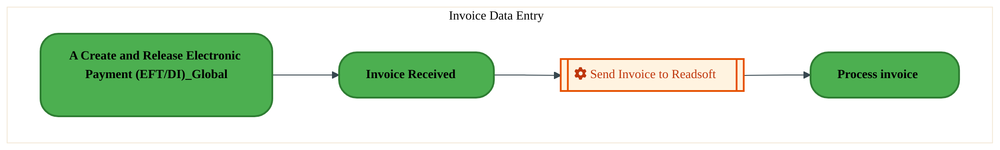

  <img src="data:image/svg+xml;base64,PHN2ZyB4bWxucz0iaHR0cDovL3d3dy53My5vcmcvMjAwMC9zdmciIHZpZXdCb3g9IjAgMCA4MDAgNDgwIiB3aWR0aD0iODAwIiBoZWlnaHQ9IjQ4MCI+DQogIDxkZWZzPg0KICAgIDxsaW5lYXJHcmFkaWVudCBpZD0iYmciIHgxPSIwJSIgeTE9IjAlIiB4Mj0iMTAwJSIgeTI9IjEwMCUiPg0KICAgICAgPHN0b3Agb2Zmc2V0PSIwJSIgc3R5bGU9InN0b3AtY29sb3I6IzAwNzFjNTtzdG9wLW9wYWNpdHk6MSIvPg0KICAgICAgPHN0b3Agb2Zmc2V0PSIxMDAlIiBzdHlsZT0ic3RvcC1jb2xvcjojMDBhZWVmO3N0b3Atb3BhY2l0eToxIi8+DQogICAgPC9saW5lYXJHcmFkaWVudD4NCiAgICA8bGluZWFyR3JhZGllbnQgaWQ9ImFjY2VudCIgeDE9IjAlIiB5MT0iMCUiIHgyPSIwJSIgeTI9IjEwMCUiPg0KICAgICAgPHN0b3Agb2Zmc2V0PSIwJSIgc3R5bGU9InN0b3AtY29sb3I6I2ZmZmZmZjtzdG9wLW9wYWNpdHk6MC4xNSIvPg0KICAgICAgPHN0b3Agb2Zmc2V0PSIxMDAlIiBzdHlsZT0ic3RvcC1jb2xvcjojZmZmZmZmO3N0b3Atb3BhY2l0eTowLjAyIi8+DQogICAgPC9saW5lYXJHcmFkaWVudD4NCiAgICA8cGF0dGVybiBpZD0iZ3JpZCIgd2lkdGg9IjQwIiBoZWlnaHQ9IjQwIiBwYXR0ZXJuVW5pdHM9InVzZXJTcGFjZU9uVXNlIj4NCiAgICAgIDxwYXRoIGQ9Ik0gNDAgMCBMIDAgMCAwIDQwIiBmaWxsPSJub25lIiBzdHJva2U9InJnYmEoMjU1LDI1NSwyNTUsMC4wNykiIHN0cm9rZS13aWR0aD0iMC41Ii8+DQogICAgPC9wYXR0ZXJuPg0KICA8L2RlZnM+DQoNCiAgPCEtLSBCYWNrZ3JvdW5kIC0tPg0KICA8cmVjdCB3aWR0aD0iODAwIiBoZWlnaHQ9IjQ4MCIgZmlsbD0idXJsKCNiZykiIHJ4PSI4Ii8+DQogIDxyZWN0IHdpZHRoPSI4MDAiIGhlaWdodD0iNDgwIiBmaWxsPSJ1cmwoI2dyaWQpIiByeD0iOCIvPg0KICA8cmVjdCB3aWR0aD0iODAwIiBoZWlnaHQ9IjQ4MCIgZmlsbD0idXJsKCNhY2NlbnQpIiByeD0iOCIvPg0KDQogIDwhLS0gRGVjb3JhdGl2ZSBjaXJjdWl0L2FyY2hpdGVjdHVyZSBsaW5lcyAtLT4NCiAgPGcgc3Ryb2tlPSJyZ2JhKDI1NSwyNTUsMjU1LDAuMTIpIiBzdHJva2Utd2lkdGg9IjEuNSIgZmlsbD0ibm9uZSI+DQogICAgPHBhdGggZD0iTSAwIDEwMCBMIDEyMCAxMDAgTCAxNjAgMTQwIEwgMjgwIDE0MCIvPg0KICAgIDxwYXRoIGQ9Ik0gMCAyNjAgTCA4MCAyNjAgTCAxMjAgMjIwIEwgMjAwIDIyMCBMIDI0MCAyNjAgTCAzNjAgMjYwIi8+DQogICAgPHBhdGggZD0iTSA1MjAgMTAwIEwgNjAwIDEwMCBMIDY0MCA2MCBMIDgwMCA2MCIvPg0KICAgIDxwYXRoIGQ9Ik0gNDQwIDM0MCBMIDU2MCAzNDAgTCA2MDAgMzAwIEwgNzIwIDMwMCBMIDc2MCAzNDAgTCA4MDAgMzQwIi8+DQogICAgPHBhdGggZD0iTSA2MDAgNDAwIEwgNjgwIDQwMCBMIDcyMCA0NDAiLz4NCiAgICA8cGF0aCBkPSJNIDAgNDAwIEwgNDAgNDAwIEwgODAgMzYwIi8+DQogICAgPHBhdGggZD0iTSAyMDAgNDIwIEwgMzIwIDQyMCBMIDM2MCAzODAgTCA0ODAgMzgwIi8+DQogICAgPHBhdGggZD0iTSA2NTAgNDQwIEwgNzUwIDQ0MCBMIDgwMCA0ODAiLz4NCiAgPC9nPg0KDQogIDwhLS0gRGVjb3JhdGl2ZSBub2RlcyAtLT4NCiAgPGcgZmlsbD0icmdiYSgyNTUsMjU1LDI1NSwwLjE4KSI+DQogICAgPGNpcmNsZSBjeD0iMTIwIiBjeT0iMTAwIiByPSI0Ii8+DQogICAgPGNpcmNsZSBjeD0iMjgwIiBjeT0iMTQwIiByPSI0Ii8+DQogICAgPGNpcmNsZSBjeD0iMjAwIiBjeT0iMjIwIiByPSI0Ii8+DQogICAgPGNpcmNsZSBjeD0iMzYwIiBjeT0iMjYwIiByPSI0Ii8+DQogICAgPGNpcmNsZSBjeD0iNjAwIiBjeT0iMTAwIiByPSI0Ii8+DQogICAgPGNpcmNsZSBjeD0iNzIwIiBjeT0iMzAwIiByPSI0Ii8+DQogICAgPGNpcmNsZSBjeD0iNTYwIiBjeT0iMzQwIiByPSI0Ii8+DQogICAgPGNpcmNsZSBjeD0iODAiIGN5PSIzNjAiIHI9IjQiLz4NCiAgICA8Y2lyY2xlIGN4PSI0ODAiIGN5PSIzODAiIHI9IjQiLz4NCiAgICA8Y2lyY2xlIGN4PSIzMjAiIGN5PSI0MjAiIHI9IjQiLz4NCiAgPC9nPg0KDQogIDwhLS0gVE9HQUYgQkRBVCBib3hlcyAtLT4NCiAgPGcgZm9udC1mYW1pbHk9IlNlZ29lIFVJLCBBcmlhbCwgc2Fucy1zZXJpZiIgZm9udC1zaXplPSIxNCIgZm9udC13ZWlnaHQ9IjYwMCI+DQogICAgPCEtLSBCIC0tPg0KICAgIDxyZWN0IHg9IjE1MCIgeT0iMTQwIiB3aWR0aD0iMTIwIiBoZWlnaHQ9IjQwIiByeD0iNSIgZmlsbD0icmdiYSgyNTUsMjU1LDI1NSwwLjE4KSIgc3Ryb2tlPSJyZ2JhKDI1NSwyNTUsMjU1LDAuMykiIHN0cm9rZS13aWR0aD0iMSIvPg0KICAgIDx0ZXh0IHg9IjIxMCIgeT0iMTY1IiB0ZXh0LWFuY2hvcj0ibWlkZGxlIiBmaWxsPSIjZmZmIj5CdXNpbmVzczwvdGV4dD4NCiAgICA8IS0tIEQgLS0+DQogICAgPHJlY3QgeD0iMjkwIiB5PSIxNDAiIHdpZHRoPSIxMjAiIGhlaWdodD0iNDAiIHJ4PSI1IiBmaWxsPSJyZ2JhKDI1NSwyNTUsMjU1LDAuMTgpIiBzdHJva2U9InJnYmEoMjU1LDI1NSwyNTUsMC4zKSIgc3Ryb2tlLXdpZHRoPSIxIi8+DQogICAgPHRleHQgeD0iMzUwIiB5PSIxNjUiIHRleHQtYW5jaG9yPSJtaWRkbGUiIGZpbGw9IiNmZmYiPkRhdGE8L3RleHQ+DQogICAgPCEtLSBBIC0tPg0KICAgIDxyZWN0IHg9IjQzMCIgeT0iMTQwIiB3aWR0aD0iMTIwIiBoZWlnaHQ9IjQwIiByeD0iNSIgZmlsbD0icmdiYSgyNTUsMjU1LDI1NSwwLjE4KSIgc3Ryb2tlPSJyZ2JhKDI1NSwyNTUsMjU1LDAuMykiIHN0cm9rZS13aWR0aD0iMSIvPg0KICAgIDx0ZXh0IHg9IjQ5MCIgeT0iMTY1IiB0ZXh0LWFuY2hvcj0ibWlkZGxlIiBmaWxsPSIjZmZmIj5BcHBsaWNhdGlvbjwvdGV4dD4NCiAgICA8IS0tIFQgLS0+DQogICAgPHJlY3QgeD0iNTcwIiB5PSIxNDAiIHdpZHRoPSIxMjAiIGhlaWdodD0iNDAiIHJ4PSI1IiBmaWxsPSJyZ2JhKDI1NSwyNTUsMjU1LDAuMTgpIiBzdHJva2U9InJnYmEoMjU1LDI1NSwyNTUsMC4zKSIgc3Ryb2tlLXdpZHRoPSIxIi8+DQogICAgPHRleHQgeD0iNjMwIiB5PSIxNjUiIHRleHQtYW5jaG9yPSJtaWRkbGUiIGZpbGw9IiNmZmYiPlRlY2hub2xvZ3k8L3RleHQ+DQogIDwvZz4NCg0KICA8IS0tIENvbm5lY3RpbmcgbGluZXMgYmV0d2VlbiBCREFUIGJveGVzIC0tPg0KICA8ZyBzdHJva2U9InJnYmEoMjU1LDI1NSwyNTUsMC4yNSkiIHN0cm9rZS13aWR0aD0iMSI+DQogICAgPGxpbmUgeDE9IjI3MCIgeTE9IjE2MCIgeDI9IjI5MCIgeTI9IjE2MCIvPg0KICAgIDxsaW5lIHgxPSI0MTAiIHkxPSIxNjAiIHgyPSI0MzAiIHkyPSIxNjAiLz4NCiAgICA8bGluZSB4MT0iNTUwIiB5MT0iMTYwIiB4Mj0iNTcwIiB5Mj0iMTYwIi8+DQogIDwvZz4NCg0KICA8IS0tIE1haW4gdGl0bGUgLS0+DQogIDx0ZXh0IHg9IjQwMCIgeT0iMjYwIiB0ZXh0LWFuY2hvcj0ibWlkZGxlIiBmb250LWZhbWlseT0iU2Vnb2UgVUksIEFyaWFsLCBzYW5zLXNlcmlmIiBmb250LXNpemU9IjM2IiBmb250LXdlaWdodD0iNzAwIiBmaWxsPSIjZmZmZmZmIiBsZXR0ZXItc3BhY2luZz0iMSI+DQogICAgSUFPIEFyY2hpdGVjdHVyZQ0KICA8L3RleHQ+DQogIDx0ZXh0IHg9IjQwMCIgeT0iMzAwIiB0ZXh0LWFuY2hvcj0ibWlkZGxlIiBmb250LWZhbWlseT0iU2Vnb2UgVUksIEFyaWFsLCBzYW5zLXNlcmlmIiBmb250LXNpemU9IjE4IiBmb250LXdlaWdodD0iNDAwIiBmaWxsPSJyZ2JhKDI1NSwyNTUsMjU1LDAuOCkiIGxldHRlci1zcGFjaW5nPSIyIj4NCiAgICBUT0dBRiBCREFUIMK3IElBTyBQcm9ncmFtIMK3IElETSAyLjANCiAgPC90ZXh0Pg0KDQogIDwhLS0gQm90dG9tIGFjY2VudCBiYXIgLS0+DQogIDxyZWN0IHg9IjI4MCIgeT0iMzQwIiB3aWR0aD0iMjQwIiBoZWlnaHQ9IjMiIHJ4PSIxLjUiIGZpbGw9InJnYmEoMjU1LDI1NSwyNTUsMC40KSIvPg0KDQogIDwhLS0gSW50ZWwgdGV4dCAtLT4NCiAgPHRleHQgeD0iNDAwIiB5PSIzODAiIHRleHQtYW5jaG9yPSJtaWRkbGUiIGZvbnQtZmFtaWx5PSJTZWdvZSBVSSwgQXJpYWwsIHNhbnMtc2VyaWYiIGZvbnQtc2l6ZT0iMTMiIGZpbGw9InJnYmEoMjU1LDI1NSwyNTUsMC41KSIgbGV0dGVyLXNwYWNpbmc9IjMiPg0KICAgIElOVEVMIENPTkZJREVOVElBTA0KICA8L3RleHQ+DQo8L3N2Zz4NCg==" alt="IAO Architecture" style="width:100%; border-radius:8px;" />
  <h1 style="font-size:36px; margin-top:24px;">PM-150 — Enable Payment</h1>
  <h2 style="font-size:24px;">Architecture Document (TOGAF BDAT)</h2>
  
Procure To Pay (PTP) Tower 
  Capability PM-150 · PM Procure Materials and Services (Direct and Indirect)

  
IAO Program · R1 – R5 
  Generated: April 2026 
  Sajiv Francis

  
IAO Architecture Pipeline — Intel Confidential

Page 1<a href="#toc">↑ Back to TOC</a>PM-150 — Enable Payment

## Table of Contents

<nav class="toc">
<ol>
  <li><a href="#1-executive-summary">1. Executive Summary</a></li>
  <li><a href="#2-business-context-objectives">2. Business Context &amp; Objectives</a>
    <ul>
      <li><a href="#21-classification">2.1 Classification</a></li>
      <li><a href="#22-business-drivers">2.2 Business Drivers</a></li>
      <li><a href="#23-success-criteria">2.3 Success Criteria</a></li>
      <li><a href="#24-companion-documents">2.4 Companion Documents</a></li>
    </ul>
  </li>
  <li><a href="#3-business-architecture-togaf-b">3. Business Architecture (TOGAF &ldquo;B&rdquo;)</a>
    <ul>
      <li><a href="#31-business-process-overview">3.1 Business Process Overview</a></li>
      <li><a href="#32-business-process-diagrams">3.2 Business Process Diagrams</a></li>
      <li><a href="#33-business-roles-responsibilities">3.3 Business Roles &amp; Responsibilities</a></li>
    </ul>
  </li>
  <li><a href="#4-data-architecture-togaf-d">4. Data Architecture (TOGAF &ldquo;D&rdquo;)</a>
    <ul>
      <li><a href="#41-data-entities-ownership">4.1 Data Entities &amp; Ownership</a></li>
      <li><a href="#42-data-flow-diagrams">4.2 Data Flow Diagrams</a></li>
      <li><a href="#43-data-lineage">4.3 Data Lineage</a></li>
      <li><a href="#44-ricefw-data-objects">4.4 RICEFW Data Objects</a></li>
      <li><a href="#45-data-governance-quality">4.5 Data Governance &amp; Quality</a></li>
    </ul>
  </li>
  <li><a href="#5-application-architecture-togaf-a">5. Application Architecture (TOGAF &ldquo;A&rdquo;)</a>
    <ul>
      <li><a href="#54-component-overview">5.4 Component Overview</a></li>
      <li><a href="#55-ricefw-inventory">5.5 RICEFW Inventory</a>
        <ul>
          <li><a href="#551-eca-dependencies">5.5.1 ECA Dependencies</a></li>
          <li><a href="#552-boundary-application-dependencies">5.5.2 Boundary Application Dependencies</a></li>
        </ul>
      </li>
      <li><a href="#56-integration-patterns">5.6 Integration Patterns</a></li>
    </ul>
  </li>
  <li><a href="#6-technology-architecture-togaf-t">6. Technology Architecture (TOGAF &ldquo;T&rdquo;)</a>
    <ul>
      <li><a href="#61-platform-infrastructure">6.1 Platform &amp; Infrastructure</a></li>
      <li><a href="#62-sap-development-object-status">6.2 SAP Development Object Status</a></li>
      <li><a href="#63-nfrs-design-principles">6.3 NFRs &amp; Design Principles</a></li>
      <li><a href="#64-security-governance">6.4 Security &amp; Governance</a></li>
    </ul>
  </li>
  <li><a href="#7-project-context">7. Project Context</a>
    <ul>
      <li><a href="#71-project-roadmap-go-live-plan">7.1 Project Roadmap &amp; Go-Live Plan</a></li>
      <li><a href="#72-raid-log">7.2 RAID Log</a></li>
      <li><a href="#73-recommendations-next-steps">7.3 Recommendations &amp; Next Steps</a></li>
    </ul>
  </li>
</ol>
</nav>

Page 2<a href="#toc">↑ Back to TOC</a>PM-150 — Enable Payment

## 1. Executive Summary

This Architecture Document defines the **Business, Data, Application, and Technology** (BDAT) architecture for **PM-150 Enable Payment** within the IAO program. It includes 12 BPMN process diagram(s) in Section 3.

| Dimension | Value |
|-----------|-------|
| **Tower** | Procure To Pay (PTP) |
| **Process Group** | PM Procure Materials and Services (Direct and Indirect) |
| **Capability** | PM-150 - Enable Payment |
| **Release** | R1 – R5 |
| **Total Systems** | 0 |
| **System Status** | 0 Deployed, 0 Developing, 0 EOL, 0 Pending IAPM |
| **RICEFW Objects** | 26 Interfaces, 21 Enhancements |

> All system nodes in architecture diagrams are **IAPM-linked** — click any node to open its IAPM page. Diagrams require `securityLevel: 'loose'` for click events.

Page 3<a href="#toc">↑ Back to TOC</a>PM-150 — Enable Payment

## 2. Business Context & Objectives

### 2.1 Classification

| Level | Value |
|-------|-------|
| **L0 Tower** | Procure To Pay |
| **L1 Process** | PM Procure Materials and Services (Direct and Indirect) |
| **L2 Capability** | PM-150 - Enable Payment |

### 2.2 Business Drivers

| # | Driver | Description | Strategic Alignment | Priority |
|---|--------|-------------|---------------------|----------|
| 1 | Procurement Process Standardization | Standardize procurement processes across direct, indirect, and services on S/4 HANA + Ariba | IDM 2.0 Procurement Excellence | High |
| 2 | Supplier Collaboration Enhancement | Enable digital supplier collaboration for consignment, subcontracting, and quality management | Supplier Ecosystem | High |
| 3 | Payment Automation | Automate invoice verification, three-way matching, and payment execution | Finance Efficiency | Medium |
| 4 | PM-150 Process Migration | Migrate Enable Payment business processes and 0 integrated systems from legacy to S/4 HANA target architecture | IDM 2.0 Procurement | High |

Page 4<a href="#toc">↑ Back to TOC</a>PM-150 — Enable Payment

### 2.3 Success Criteria

| Metric | Target | Measure | Baseline | Owner |
|--------|--------|---------|----------|-------|
| PO Cycle Time | < 24 hours | Requisition approval to PO dispatch to supplier | 48 hours (current) | Procurement Lead |
| Invoice Automation Rate | > 80% | Invoices processed without manual intervention (touchless) | 45% (current) | AP Manager |
| Supplier On-Time Delivery | > 95% | Supplier adherence to confirmed delivery date | 89% (current) | Supplier Management |
| PM-150 Migration Completeness | 100% flow chains validated | All 0 flow chains verified in target state | 0% (pre-migration) | Tower Architect |

### 2.4 Companion Documents

| Document | Description |
|----------|-------------|
| **Business Architecture** | Included in this document (Section 3) — process flows from BPMN diagrams |
| **This Document** | Full BDAT Architecture — Business + Data + Application + Technology |

Page 5<a href="#toc">↑ Back to TOC</a>PM-150 — Enable Payment

## 3. Business Architecture (TOGAF "B")

### 3.1 Business Process Overview

This capability includes **12 business process(es)** modeled in BPMN 2.0, covering the end-to-end workflow for PM-150 Enable Payment.

| # | Step ID | Process Name | Lanes | Tasks | Gateways |
|---|---------|--------------|-------|-------|----------|
| 1 | PM-150-010_Match_P.O._and_Goods_Receipt_Notice_(3_Way_Match) | PM-150-010_Match_P.O._and_Goods_Receipt_Notice_(3_Way_Match) | Invoice Resolution Team | 3 | 4 |
| 2 | PM-150-020_Process_Touchless_Invoice_Receipt | PM-150-020_Process_Touchless_Invoice_Receipt | Accounts Payable Accountant | 3 | 2 |
| 3 | PM-150-030_Receive_Invoice_from_Vendor | PM-150-030_Receive_Invoice_from_Vendor | Invoice Data Entry | 1 | 0 |
| 4 | PM-150-060_Process_Non-PO_Invoice | PM-150-060_Process_Non-PO_Invoice | Invoice Data Entry | 5 | 2 |
| 5 | PM-150-080_Match_Receipt_of_Goods_and_Services_to_Invoice_(2-way_match) | PM-150-080_Match_Receipt_of_Goods_and_Services_to_Invoice_(2-way_match) | Invoice Resolution Team | 3 | 5 |
| 6 | PM-150-090_Receive_Procurement_Card_Invoice | PM-150-090_Receive_Procurement_Card_Invoice | Procurement Agent | 4 | 1 |
| 7 | PM-150-100_Process_Procurement_Card_Invoice | PM-150-100_Process_Procurement_Card_Invoice | Procurement Agent | 4 | 1 |
| 8 | PM-150-130_Notify_Appropriate_Party | PM-150-130_Notify_Appropriate_Party | Payment Processor | 5 | 0 |
| 9 | PM-150-160_Propose_Vendor_Payment | PM-150-160_Propose_Vendor_Payment | Payment Processor | 6 | 4 |
| 10 | PM-150-170_Identify_Optimum_Timing_for_Payment | PM-150-170_Identify_Optimum_Timing_for_Payment | Accounts Payable Accountant | 7 | 4 |
| 11 | PM-150-200_Update_Financial_Records | PM-150-200_Update_Financial_Records | Payment Processor | 3 | 1 |
| 12 | PM-150_Enable_Payment | PM-150_Enable_Payment | Accounts Payable Accountant | 1 | 5 |

Page 6<a href="#toc">↑ Back to TOC</a>PM-150 — Enable Payment

### 3.2 Business Process Diagrams

#### BUSINESS ARCHITECTURE — 3.2.1 PM-150-010_Match_P.O._and_Goods_Receipt_Notice_(3_Way_Match) — PM-150-010_Match_P.O._and_Goods_Receipt_Notice_(3_Way_Match)

**Swim Lanes**: Invoice Resolution Team | **Tasks**: 3 | **Gateways**: 4

```mermaid
%%{init: {'theme': 'base', 'themeVariables': {'fontSize': '14px', 'fontFamily': 'Segoe UI, Arial, sans-serif','primaryColor': '#e8f0fe', 'primaryBorderColor': '#0071c5','lineColor': '#37474F', 'secondaryColor': '#f5f8fc'}, 'flowchart': {'useMaxWidth': false, 'htmlLabels': true, 'curve': 'basis', 'nodeSpacing': 40, 'rankSpacing': 50}} }%%
flowchart TD
    classDef startEvt fill:#4CAF50,stroke:#2E7D32,color:#000,font-weight:bold,stroke-width:2px,rx:20,ry:20
    classDef endEvt fill:#C62828,stroke:#B71C1C,color:#fff,font-weight:bold,stroke-width:2px,rx:20,ry:20
    classDef userTask fill:#E3F2FD,stroke:#1565C0,stroke-width:2px,color:#0D47A1
    classDef serviceTask fill:#FFF3E0,stroke:#E65100,stroke-width:2px,color:#BF360C
    classDef gateway fill:#FFF9C4,stroke:#F57F17,stroke-width:2px,color:#E65100
    classDef subProc fill:#F3E5F5,stroke:#7B1FA2,stroke-width:2px,color:#4A148C
    subgraph lane_0["Invoice Resolution Team"]
        n1["fa:fa-user Perform Quantity Block Webcycle"]
        n2["fa:fa-user Reject Invoice Back to Supplier"]
        n3[["fa:fa-cog Perform 3 Way Match"]]
        n4(["fa:fa-play Receive Materials"])
        n5(["fa:fa-stop Communicated Invoice Rejection to Supplier"])
        n6["Process Touchless Invoice Receipt"]
        n7["Receive Invoice from Vendor"]
        n8{{"fa:fa-code-branch Any Discrepancy / Mismatch?"}}
        n9{{"fa:fa-code-branch exclusiveGateway"}}
        n10{{"fa:fa-code-branch 3 way Match Successful?"}}
        n11{{"fa:fa-code-branch exclusiveGateway"}}
    end
    n3 --> n8
    n7 --> n9
    n9 --> n3
    n4 --> n9
    n1 --> n10
    n2 --> n5
    n11 --> n6
    n8 -->|"Yes"| n1
    n8 -->|"No"| n11
    n10 -->|"Yes"| n11
    n10 -->|"No"| n2
    class n1 userTask
    class n2 userTask
    class n3 serviceTask
    class n4 startEvt
    class n5 endEvt
    class n6 startEvt
    class n7 startEvt
    class n8 gateway
    class n9 gateway
    class n10 gateway
    class n11 gateway
```

> **Legend**: ● Start · ● End · User Task · Service Task · ◇ Gateway · Sub-Process

<a href="https://mermaid.live/view#pako:eNqlVttu4zYU_BVCQeAWkFFdLUcPLXxTsUBTbJPsBsW6KGjqyGZDkQJJJXG9_vclI8m2vM5DUT8YOsOZORdJx945ROTgpM719Y5yqlO0G-gNlDBI0WCFFQxc1ACfsaR4xUANLKcQXN_Tf99oflS9WprFMlxStrXoPawFoE8fXDQxQuYihbkaKpC0GLiDStISy-1MMCEt-wrGhVe8ZWuPpkLmII8Ez0t8EhspoxyOcJhESZRZnQIieN4zLeJiXJDB3hbHxAvZYKnfyq8V3OLXR5rrjYkLzBQYzkaX7De8AmZ71LK2GKnlczcMqmwebgZ2X2FC-drgkWcgifnTEYq9_R7tr6-X_JAUPcyXHJkPYVipORRIaQMvnjUqKGPpVTSbZLHnKi3FE6RXwSKZh4FLbCepad1z7XCHL0DXG52uBMtb6vDF9pAG1asrX9PAc-XWfJ_lAp4fM81GwTgYHzJNE3_mz7pMRVH8r0xmrvIBq6c21yLMgmx-yOXHo3jmfe_XtTmPkol_PieQz5TAiWmWZeHiOKrFKPa9902nWTjyZmema6zhBW-Phjez6GCYxUnmJ-8aNvnOq6xXH6UgnWG4iLP4YJhM_WwSvGsYTfxo3FZofNYSVxvEMIe_vS9L5wN_FqZ_dAdKsFpTwdED4HLp_NUo7If7hljgtMBDewPQR5CFkCX6o8ZcU71FUybIE3qEFdkSBn1t0NfewT9ANOrSTrERaoHu66piFGRfG345iIlYH_KG6NEM9xZrsjH8U0H0w0FQMcO5AwL0GSwX7JZQhv_jCT8-8pUWFZqJsqw5JYaeo-NobMl2Mv1CT41GxsfeIVAKPYiabJi9OjqYMirdby4xkq6-jlhIUaLP5n0SZ5MY73bHSeQwXJmVQDZowrdoThWRUJl4i35Ct1SVdjC_LJ39_sTg5rIBvBJWK1PCr80je6byvcuyEL10d8BMhNi2i5qd5_T9_5rUdN5c8BANhz-bvtswacKbNrxpwrANo_6p34R--xbxoInj7rg9H7Xx2IZfl86fYB6Pr-b8DP9dNHCH-9654LuTVhKcvMa2rG599eDgMhyerqbeSXRY7j04bvdwDxxd5iaX4XG3uXrozUXU9HoR9jvYcZ0SZIlp7qQ75-033vwPyKHANdPO3nVwrcX9lhMnffstdOoqN8o5xWZFlQ24_wZ-bJ5N" title="View full diagram">&#128065; View Diagram</a>

#### BUSINESS ARCHITECTURE — 3.2.2 PM-150-020_Process_Touchless_Invoice_Receipt — PM-150-020_Process_Touchless_Invoice_Receipt

**Swim Lanes**: Accounts Payable Accountant | **Tasks**: 3 | **Gateways**: 2

```mermaid
%%{init: {'theme': 'base', 'themeVariables': {'fontSize': '14px', 'fontFamily': 'Segoe UI, Arial, sans-serif','primaryColor': '#e8f0fe', 'primaryBorderColor': '#0071c5','lineColor': '#37474F', 'secondaryColor': '#f5f8fc'}, 'flowchart': {'useMaxWidth': false, 'htmlLabels': true, 'curve': 'basis', 'nodeSpacing': 40, 'rankSpacing': 50}} }%%
flowchart TD
    classDef startEvt fill:#4CAF50,stroke:#2E7D32,color:#000,font-weight:bold,stroke-width:2px,rx:20,ry:20
    classDef endEvt fill:#C62828,stroke:#B71C1C,color:#fff,font-weight:bold,stroke-width:2px,rx:20,ry:20
    classDef userTask fill:#E3F2FD,stroke:#1565C0,stroke-width:2px,color:#0D47A1
    classDef serviceTask fill:#FFF3E0,stroke:#E65100,stroke-width:2px,color:#BF360C
    classDef gateway fill:#FFF9C4,stroke:#F57F17,stroke-width:2px,color:#E65100
    classDef subProc fill:#F3E5F5,stroke:#7B1FA2,stroke-width:2px,color:#4A148C
    subgraph Accounts Payable Accountant
        n1["fa:fa-user Process Invoice Manually"]
        n2[["fa:fa-cog Execute Touchless Invoice Processing"]]
        n3[["fa:fa-cog Post Invoice Receipt"]]
        n4["Identify Optimum Timing for payment"]
        n5["Exception Handling"]
        n6{{"fa:fa-code-branch Execution Type?"}}
        n7{{"fa:fa-code-branch exclusiveGateway"}}
    end
    n2 --> n7
    n3 --> n4
    n1 --> n7
    n7 --> n3
    n6 -->|"Stop"| n1
    n6 -->|"Auto Post"| n2
    n5 --> n6
    class n1 userTask
    class n2 serviceTask
    class n3 serviceTask
    class n4 startEvt
    class n5 startEvt
    class n6 gateway
    class n7 gateway
```

> **Legend**: ● Start · ● End · User Task · Service Task · ◇ Gateway · Sub-Process

<a href="https://mermaid.live/view#pako:eNqlVdtu4zYQ_RVCQeAXGdDVcvXQwrGtNkAXG9Te7cO6KGhqaBOhSIGkEqte_3tJS75281Q9CJozc85cxJH2HpEleLn3-Lhngpkc7QdmCxUMcjRYYw0DH3XAV6wYXnPQAxdDpTAL9s8xLEzqnQtzWIErxluHLmAjAX159tHEErmPNBZ6qEExOvAHtWIVVu1Ucqlc9AOMaUCP2XrXk1QlqEtAEGQhSS2VMwEXOM6SLCkcTwORorwRpSkdUzI4uOK4fCdbrMyx_EbDJ7z7k5Vma22KuQYbszUV_x2vgbsejWocRhr1dhoG0y6PsANb1JgwsbF4ElhIYfF6gdLgcECHx8eVOCdFy9lKIHsRjrWeAUXaWHj-ZhBlnOcPyXRSpIGvjZKvkD9E82wWRz5xneS29cB3wx2-A9tsTb6WvOxDh--uhzyqd77a5VHgq9be73KBKC-ZpqNoHI3PmZ6ycBpOT5kopf8rk52rWmL92ueax0VUzM65wnSUToP_6p3anCXZJLyfE6g3RuBKtCiKeH4Z1XyUhsHHok9FPAqmd6IbbOAdtxfBn6bJWbBIsyLMPhTs8t1X2axflCQnwXieFulZMHsKi0n0oWAyCZNxX6HV2ShcbxHHAv4Ovq28CSGyEUajF9y69UM9gIVZeX91LHeJ0AZTnFM8dC8BuXJAa_Qs3qSdH_qERYM5b29J0bczi8gNmu-ANAbQUjZky6_pvZw94FbgWiG-VXiR2pxJfwABVps7RmIJzyUIw2iLPteGVU2Flqyy2ohKhWrcVnDfXWpJ8x0BGy4F-g2Lkne1XMWM9vtLKSUM13YtybZvytGWbQ2_rLzD4YqU_ZgEO8Ibzd7g1-6oXFh2mboHEaHh8Ger0JtxZya9Gd56s86Me3PkzO8rb2FkvfK-2_A7x6Qx8jjNozfqvWmnMro6fi7Tae1u4Oh6d2488Yee5PxduoHTH8Oj0yLdoNkJ9XyvAlVhVnr53jv-ROyPpgSKG268g-9h2-OiFcTLjx9br6lLy5wxbHeg6sDDv1p_H8Y=" title="View full diagram">&#128065; View Diagram</a>

Page 7<a href="#toc">↑ Back to TOC</a>PM-150 — Enable Payment

#### BUSINESS ARCHITECTURE — 3.2.3 PM-150-030_Receive_Invoice_from_Vendor — PM-150-030_Receive_Invoice_from_Vendor

**Swim Lanes**: Invoice Data Entry | **Tasks**: 1 | **Gateways**: 0

> **Legend**: ● Start · ● End · User Task · Service Task · ◇ Gateway · Sub-Process

<a href="https://mermaid.live/view#pako:eNqlVNuK2zAQ_RXhJbgFh_oap34oZH0pCy0sm237sClFsUeJWFkKknJryL9XjhPn0u5T_WA8R2fOmRnJ2lmlqMBKrF5vRznVCdrZeg412Amyp1iB7aAW-I4lxVMGym44RHA9pr8PNC9cbBpagxW4pmzboGOYCUDfHhw0MonMQQpz1VcgKbEdeyFpjeU2FUzIhn0HQ-KSg9tx6V7ICuSZ4LqxV0YmlVEOZziIwzgsmjwFpeDVlSiJyJCU9r4pjol1OcdSH8pfKviKNz9opecmJpgpMJy5rtkXPAXW9KjlssHKpVydhkFV48PNwMYLXFI-M3joGkhi_nqGIne_R_teb8I7U_ScTTgyT8mwUhkQpLSB85VGhDKW3IXpqIhcR2kpXiG58_M4C3ynbDpJTOuu0wy3vwY6m-tkKlh1pPbXTQ-Jv9g4cpP4riO35n3jBbw6O6UDf-gPO6f72Eu99ORECPkvJzNX-YzV69ErDwq_yDovLxpEqfu33qnNLIxH3u2cQK5oCReiRVEE-XlU-SDy3LdF74tg4KY3ojOsYY23Z8GPadgJFlFcePGbgq3fbZXL6aMU5UkwyKMi6gTje68Y-W8KhiMvHB4rNDoziRdzxDCHX-7LxHrgK2H6RxnWGOVcy-3E-tmSm4d7L4ZEcEJwvxQzNDZ7jU45WqAnwJUSRJukyyzfJDUFg1KItuxr2cAQRiiVYCaFsNF8AgbmOkA5g9I0wmmJHvG2Bq7Ru7x4_pA9vP_1mYkpZtdC4UUPT1ACXUHVMUyx7Qf3UL__ydR1DIM2DI9h2IaXZ6NJuTgbVyt-93ddwcG_4bCDLceqQdaYVlaysw63nrkZKyB4ybS1dyy81GK85aWVHG4Ha7mozHwyis2m1S24_wPXVrNy" title="View full diagram">&#128065; View Diagram</a>

Page 8<a href="#toc">↑ Back to TOC</a>PM-150 — Enable Payment

#### BUSINESS ARCHITECTURE — 3.2.4 PM-150-060_Process_Non-PO_Invoice — PM-150-060_Process_Non-PO_Invoice

**Swim Lanes**: Invoice Data Entry | **Tasks**: 5 | **Gateways**: 2

> **Legend**: ● Start · ● End · User Task · Service Task · ◇ Gateway · Sub-Process

<a href="https://mermaid.live/view#pako:eNqlVmuP4jYU_StWViNaKah5EiYfWkEg1Ujb3dEyu1W1VJVJbsCaEEe2YaAs_73XJOGRJaqq5gPknnvuuY84dg5GwlMwQuPh4cAKpkJy6KkVrKEXkt6CSuiZpAK-UMHoIgfZ05yMF2rG_j7RbK_caZrGYrpm-V6jM1hyIJ-fTDLCwNwkkhayL0GwrGf2SsHWVOwjnnOh2e9gmFnZKVvtGnORgrgQLCuwEx9Dc1bABXYDL_BiHSch4UV6I5r52TBLekddXM7fkhUV6lT-RsJvdPc7S9UK7YzmEpCzUuv8PV1ArntUYqOxZCO2zTCY1HkKHNispAkrloh7FkKCFq8XyLeOR3J8eJgX56TkZTIvCF5JTqWcQEakQni6VSRjeR6-86JR7FumVIK_QvjOmQYT1zET3UmIrVumHm7_DdhypcIFz9Oa2n_TPYROuTPFLnQsU-zxt5ULivSSKRo4Q2d4zjQO7MiOmkxZlv2vTDhX8ULla51r6sZOPDnnsv2BH1nf6zVtTrxgZLfnBGLLErgSjePYnV5GNR34ttUtOo7dgRW1RJdUwRvdXwQfI-8sGPtBbAedglW-dpWbxbPgSSPoTv3YPwsGYzseOZ2C3sj2hnWFqLMUtFyRnBbwl_V1bjwVW479kwlVlEwLJfZz48-KrK_C_oqkjIYZ7Sd8SZ7wHWbYHZnhWsyBjMpS8C3NyTMIUmuhwLWCc6sww9XSMPE_42JNFeMFUZx8AppKnqmWgnur8MylIh940X_-2JHS6yi6qVYSVuhtY0HJmFBdT0vA_xcBHT-NVpC8khfO81b04IdzdJnjMjjPGBRlmPxzmXOaQophP16FBR1hkQDM3WYP_xP7sYP9CRJgW0h1Q1-YVLBrBdpWO3IUES7I-PnjT_r2ntBpsm0d-6IjFS9JNb3pLoFSP37Z5jstfpMI148iY4qxuGDw5CDjjcQdW-JY8Sm1VVwUOa2Xy0K5dnuHw-U5p9Bf4E6brOrHDOkvc-N4vOb79_mwS3KsYgu_Vi_-JQwXe3VTDEi__zNK1KZdm15tP1a227g9bX-bG38ATuabTl17vDqwsW2_ApzaDlr-YWU3pt8OtyqgqcOt_d8V8oFXdTR5nJp4vaHqtq421BuP0-lxOz1ep8fv9AzOR98NHNyHh_fhx_swDus-btdn4C3q3EXdDg2vOTZuYb-BDdNYA26WLDXCg3H6ZsLvqhQyusmVcTQNulF8ti8SIzx9WxibMsXICaO45a8r8PgPfZf-Dw==" title="View full diagram">&#128065; View Diagram</a>

Page 9<a href="#toc">↑ Back to TOC</a>PM-150 — Enable Payment

#### BUSINESS ARCHITECTURE — 3.2.5 PM-150-080_Match_Receipt_of_Goods_and_Services_to_Invoice_(2-way_match) — PM-150-080_Match_Receipt_of_Goods_and_Services_to_Invoice_(2-way_match)

**Swim Lanes**: Invoice Resolution Team | **Tasks**: 3 | **Gateways**: 5

```mermaid
%%{init: {'theme': 'base', 'themeVariables': {'fontSize': '14px', 'fontFamily': 'Segoe UI, Arial, sans-serif','primaryColor': '#e8f0fe', 'primaryBorderColor': '#0071c5','lineColor': '#37474F', 'secondaryColor': '#f5f8fc'}, 'flowchart': {'useMaxWidth': false, 'htmlLabels': true, 'curve': 'basis', 'nodeSpacing': 40, 'rankSpacing': 50}} }%%
flowchart TD
    classDef startEvt fill:#4CAF50,stroke:#2E7D32,color:#000,font-weight:bold,stroke-width:2px,rx:20,ry:20
    classDef endEvt fill:#C62828,stroke:#B71C1C,color:#fff,font-weight:bold,stroke-width:2px,rx:20,ry:20
    classDef userTask fill:#E3F2FD,stroke:#1565C0,stroke-width:2px,color:#0D47A1
    classDef serviceTask fill:#FFF3E0,stroke:#E65100,stroke-width:2px,color:#BF360C
    classDef gateway fill:#FFF9C4,stroke:#F57F17,stroke-width:2px,color:#E65100
    classDef subProc fill:#F3E5F5,stroke:#7B1FA2,stroke-width:2px,color:#4A148C
    subgraph lane_0["Invoice Resolution Team"]
        n1["fa:fa-user Approval Received"]
        n2["fa:fa-user Invoice Sent back to Supplier"]
        n3["fa:fa-user Review by AP Processor to Determine Re-trigger or Reject"]
        n4(["fa:fa-stop Invoice Sent back to Supplier"])
        n5(["fa:fa-stop Post Invoice"])
        n6["Receive Invoice from Vendor"]
        n7{{"fa:fa-code-branch Approval Determination?"}}
        n8{{"fa:fa-code-branch Request for Approval - Approved or Rejected?"}}
        n9{{"fa:fa-code-branch exclusiveGateway"}}
        n10{{"fa:fa-code-branch Re-trigger RFA?"}}
        n11{{"fa:fa-code-branch exclusiveGateway"}}
    end
    n6 --> n11
    n7 -->|"Yes"| n8
    n8 -->|"Approved"| n1
    n2 --> n4
    n1 --> n9
    n7 -->|"No"| n9
    n3 --> n10
    n10 -->|"Reject"| n2
    n11 --> n7
    n9 --> n5
    n8 -->|"Rejected"| n3
    n10 -->|"Re-trigger"| n11
    class n1 userTask
    class n2 userTask
    class n3 userTask
    class n4 endEvt
    class n5 endEvt
    class n6 startEvt
    class n7 gateway
    class n8 gateway
    class n9 gateway
    class n10 gateway
    class n11 gateway
```

> **Legend**: ● Start · ● End · User Task · Service Task · ◇ Gateway · Sub-Process

<a href="https://mermaid.live/view#pako:eNqlVluP4jYU_itWRiNaKUi5EshDKwZItVK3Gg3TXa1KVZnkBNwxcWo7XMry32uTGEiWUVU1Dwh_-S7nHCeGo5WyDKzYenw8koLIGB17cg0b6MWot8QCejaqgU-YE7ykIHqak7NCzsnfZ5oblHtN01iCN4QeNDqHFQP06wcbjZWQ2kjgQvQFcJL37F7JyQbzw4RRxjX7AYa5k5_TmltPjGfArwTHidw0VFJKCrjCfhREQaJ1AlJWZC3TPMyHedo76eIo26VrzOW5_ErAR7z_TDK5VuscUwGKs5Yb-jNeAtU9Sl5pLK341gyDCJ1TqIHNS5ySYqXwwFEQx8XbFQqd0wmdHh8XxSUUvU4XBVJXSrEQU8iRkAqebSXKCaXxQzAZJ6FjC8nZG8QP3iya-p6d6k5i1bpj6-H2d0BWaxkvGc0aan-ne4i9cm_zfew5Nj-oz04WFNk1aTLwht7wkvQUuRN3YpLyPP9fSWqu_BWLtyZr5ideMr1kueEgnDjf-pk2p0E0drtzAr4lKdyYJkniz66jmg1C13nf9CnxB86kY7rCEnb4cDUcTYKLYRJGiRu9a1jndausls-cpcbQn4VJeDGMntxk7L1rGIzdYNhUqHxWHJdrRHEBfzi_LawPxZap_tELCEYrSViBXgFvFtbvtUJfhauIOY5z3NcbgMZlydkWUyVKgWwha7O9NtskzKGQaInTNyQZmldlSQnwttJvK19gS2CHlgc0fka6fxCCcS2fggS-US-q4vQlJ6uVojOt-BNS2TYNvru4CsnKf63n-xtt2NE-MyGNQYc6UMxmHpeInLMN-qReD9ZpNDoeja8-H_tL9Yan6-tgTX9Yb8iPC-t0uhEP74tf4K8KVHk5u9mhfvMVsut4IOs6ju47wj6llVAN_VQ_zx2V67xXyGVLXpJxN8t1_2uYml_9pRigfv8HbdGsI73-urC-gFhYX9VkGnzY4Kb3800j8mqToFm69XLUsfyFnUUG9ptkx6ichmeeOMX1zL3GMmrWo3oZdoozm3HW-t_6miHWxd-eW7pocxK2YO8-7N-Hg-bgboHhPXBw-TlpwZE56Fro8C46uouqdu_CroEt29qoNwGTzIqP1vmPgvozkUGOKyqtk23hSrL5oUit-PyDalVlppRTgtU5t6nB0z-EOLVE" title="View full diagram">&#128065; View Diagram</a>

Page 10<a href="#toc">↑ Back to TOC</a>PM-150 — Enable Payment

#### BUSINESS ARCHITECTURE — 3.2.6 PM-150-090_Receive_Procurement_Card_Invoice — PM-150-090_Receive_Procurement_Card_Invoice

**Swim Lanes**: Procurement Agent | **Tasks**: 4 | **Gateways**: 1

> **Legend**: ● Start · ● End · User Task · Service Task · ◇ Gateway · Sub-Process

<a href="https://mermaid.live/view#pako:eNqlVV2P2jgU_StWRiN2paDNJ4E8VGIC6Y7UqUZLu_tQqsokN2CNcVjbmYFF_Pe9JiEQyjw1D1Hu8T3nfsS-3ltZmYMVW_f3eyaYjsm-p1ewhl5MeguqoGeTGvibSkYXHFTP-BSl0DP239HNDTZb42awlK4Z3xl0BssSyNdHm4yRyG2iqFB9BZIVPbu3kWxN5S4peSmN9x0MC6c4RmuWHkqZgzw7OE7kZiFSORNwhv0oiILU8BRkpcg7okVYDIusdzDJ8fItW1Gpj-lXCp7o9h-W6xXaBeUK0Gel1_wTXQA3NWpZGSyr5OupGUyZOAIbNtvQjIkl4oGDkKTi5QyFzuFADvf3c9EGJV8mc0HwyThVagIFURrh6asmBeM8vguScRo6ttKyfIH4zptGE9-zM1NJjKU7tmlu_w3YcqXjRcnzxrX_ZmqIvc3WltvYc2y5w_dVLBD5OVIy8IbesI30ELmJm5wiFUXxS5Gwr_ILVS9NrKmfeumkjeWGgzBxftY7lTkJorF73SeQryyDC9E0Tf3puVXTQeg674s-pP7ASa5El1TDG92dBUdJ0AqmYZS60buCdbzrLKvFsyyzk6A_DdOwFYwe3HTsvSsYjN1g2GSIOktJNyvCqYAfzre5ZWQriedPaDJe4ntufa99zSNcdCloXNC-aT15zNGDFTvyF_xbsZqmyJjjPsS9SS7FEipz8lXRJcwrz3EWXV2vq_tcSdzHCs-zuqXT5fpd7rjSq1LirCDJc1KH_RO3FcguK_jW0rJySZ6owNTIc_9IOMVXyLkkhb-1pA3HH_qoYU0-A-SQE12SBbRMk-PvF8yB6e2pqifcD2ZIKUJFTmb1llPd_CJDoLtjzTONhPrrpz8yRL-pMJOSNO7d9RGuf_z0R1Iq7B2uYodmGzyh-JsyXVGOjbrqp-vs9-fW5NBf4LzJVgS2Ga8Ue4WP9XaeW4dDTUO5-kOEpN__gBKN6dam35hes-qclp0aCBo7qM2oMaPaHDXmqDaHV-RBY_u16V0cFZPAaUR0YO827N-Gg8up0FkJ27nagQe34eg2PLwNj27DWHYzTizbWoNcU5Zb8d46Xpp4seZQ0Ipr62BbtNLlbCcyKz5eLla1yZE5YRTP_LoGD_8D_l1mNQ==" title="View full diagram">&#128065; View Diagram</a>

#### BUSINESS ARCHITECTURE — 3.2.7 PM-150-100_Process_Procurement_Card_Invoice — PM-150-100_Process_Procurement_Card_Invoice

**Swim Lanes**: Procurement Agent | **Tasks**: 4 | **Gateways**: 1

> **Legend**: ● Start · ● End · User Task · Service Task · ◇ Gateway · Sub-Process

<a href="https://mermaid.live/view#pako:eNqlVV2P2jgU_StWRiN2paDNJ4E8VGIC6Y7UqUZLu_tQqsokN2CNcVjbmYFF_Pe9JiEQyjw1D1Hu8T3nfsS-3ltZmYMVW_f3eyaYjsm-p1ewhl5MeguqoGeTGvibSkYXHFTP-BSl0DP239HNDTZb42awlK4Z3xl0BssSyNdHm4yRyG2iqFB9BZIVPbu3kWxN5S4peSmN9x0MC6c4RmuWHkqZgzw7OE7kZiFSORNwhv0oiILU8BRkpcg7okVYDIusdzDJ8fItW1Gpj-lXCp7o9h-W6xXaBeUK0Gel1_wTXQA3NWpZGSyr5OupGUyZOAIbNtvQjIkl4oGDkKTi5QyFzuFADvf3c9EGJV8mc0HwyThVagIFURrh6asmBeM8vguScRo6ttKyfIH4zptGE9-zM1NJjKU7tmlu_w3YcqXjRcnzxrX_ZmqIvc3WltvYc2y5w_dVLBD5OVIy8IbesI30ELmJm5wiFUXxS5Gwr_ILVS9NrKmfeumkjeWGgzBxftY7lTkJorF73SeQryyDC9E0Tf3puVXTQeg674s-pP7ASa5El1TDG92dBUdJ0AqmYZS60buCdbzrLKvFsyyzk6A_DdOwFYwe3HTsvSsYjN1g2GSIOktJNyvCqYAfzre5ZWQriedPaDJe4ntufa99zSNcdCloXNC-aT15zNGDFTvyF_xbsZqmyJjjPsS9SS7FEipz8lXRJcwrz3EWXV2vq_tcSdzHCs-zuqXT5fpd7rjSq1LirCDJc1KH_RO3FcguK_jW0rJySZ6owNTIc_9IOMVXyLkkhb-1pA3HH_qoYU0-A-SQE12SBbRMk-PvF8yB6e2pqifcD2ZIKUJFTmb1llPd_CJDoLtjzTONhPrrpz8yRL-pMJOSNO7d9RGuf_z0R1Iq7B2uYodmGzyh-JsyXVGOjbrqp-vs9-fW5NBf4LzJVgS2Ga8Ue4WP9XaeW4dDTUO5-kOEpN__gBKN6dam35hes-qclp0aCBo7qM2oMaPaHDXmqDaHV-RBY_u16V0cFZPAaUR0YO827N-Gg8up0FkJ27nagQe34eg2PLwNj27DWHYzTizbWoNcU5Zb8d46Xpp4seZQ0Ipr62BbtNLlbCcyKz5eLla1yZE5YRTP_LoGD_8D_l1mNQ==" title="View full diagram">&#128065; View Diagram</a>

Page 11<a href="#toc">↑ Back to TOC</a>PM-150 — Enable Payment

#### BUSINESS ARCHITECTURE — 3.2.8 PM-150-130_Notify_Appropriate_Party — PM-150-130_Notify_Appropriate_Party

**Swim Lanes**: Payment Processor | **Tasks**: 5 | **Gateways**: 0

> **Legend**: ● Start · ● End · User Task · Service Task · ◇ Gateway · Sub-Process

<a href="https://mermaid.live/view#pako:eNqlVd1v4jgQ_1esVBW7UtDlk3B5OAkCWa20laqld_ewPZ3cZAxWHTuyDS1b8b_fhIRAWPF0eUDM-PcxM7GdD6dQJTipc3__wSW3KfkY2Q1UMErJ6IUaGLmkTfxFNacvAsyowTAl7Yr_PML8qH5vYE0upxUX-ya7grUC8udXl8yQKFxiqDRjA5qzkTuqNa-o3mdKKN2g72DKPHZ065bmSpegzwDPS_wiRqrgEs7pMImSKG94Bgoly4Eoi9mUFaNDU5xQb8WGanssf2vggb7_zUu7wZhRYQAxG1uJb_QFRNOj1dsmV2z17jQMbhofiQNb1bTgco35yMOUpvL1nIq9w4Ec7u-fZW9KnhbPkuBTCGrMAhgxFtPLnSWMC5HeRdksjz3XWK1eIb0LlskiDNyi6STF1j23Ge74Dfh6Y9MXJcoOOn5rekiD-t3V72nguXqPv1deIMuzUzYJpsG0d5onfuZnJyfG2P9ywrnqJ2peO69lmAf5ovfy40mceb_qndpcRMnMv54T6B0v4EI0z_NweR7VchL73m3ReR5OvOxKdE0tvNH9WfD3LOoF8zjJ_eSmYOt3XeX25VGr4iQYLuM87gWTuZ_PgpuC0cyPpl2FqLPWtN4QQSX86_14dh7pvgJpSSMPxij97PzTYptH-gj5QvGAajKra612uJUJl2T2-DAEBj8QyWjK6LhQa5JRIcjK0ubAlGS5QwuDhEtGOGQ84SY3DH0e5hlZUEuJVWSOG_-KFg1pK6tq8gUkaGq5kkQxcmppVu64gSt6jOwVbliScwGEKU2-Q8UtVlrAkVHAsLHJp97PNF6_wAnKWeR8viAlw8nizCvyfStJoapagIVy6DFF-DecFZ5vrH4NZEweH8Z-7I39qUcyDbifCK6juQC8NMlSQIGvW_Ki7_bTMn_6bfH1c6-MTbZ_5JSMx3_gK-pCvw3DLgzbMO7CuA0nXZi0YXdsZNCGURdGbZhcbNcGc3GoBivhzZXo5sqku14GyaS_3wbpaZ92XKcCXVFeOumHc_zA4EeoBEa3wjoH16Fbq1Z7WTjp8SJ2tnWJQ15w2ryrNnn4D5kZIHQ=" title="View full diagram">&#128065; View Diagram</a>

#### BUSINESS ARCHITECTURE — 3.2.9 PM-150-160_Propose_Vendor_Payment — PM-150-160_Propose_Vendor_Payment

**Swim Lanes**: Payment Processor | **Tasks**: 6 | **Gateways**: 4

```mermaid
%%{init: {'theme': 'base', 'themeVariables': {'fontSize': '14px', 'fontFamily': 'Segoe UI, Arial, sans-serif','primaryColor': '#e8f0fe', 'primaryBorderColor': '#0071c5','lineColor': '#37474F', 'secondaryColor': '#f5f8fc'}, 'flowchart': {'useMaxWidth': false, 'htmlLabels': true, 'curve': 'basis', 'nodeSpacing': 40, 'rankSpacing': 50}} }%%
flowchart TD
    classDef startEvt fill:#4CAF50,stroke:#2E7D32,color:#000,font-weight:bold,stroke-width:2px,rx:20,ry:20
    classDef endEvt fill:#C62828,stroke:#B71C1C,color:#fff,font-weight:bold,stroke-width:2px,rx:20,ry:20
    classDef userTask fill:#E3F2FD,stroke:#1565C0,stroke-width:2px,color:#0D47A1
    classDef serviceTask fill:#FFF3E0,stroke:#E65100,stroke-width:2px,color:#BF360C
    classDef gateway fill:#FFF9C4,stroke:#F57F17,stroke-width:2px,color:#E65100
    classDef subProc fill:#F3E5F5,stroke:#7B1FA2,stroke-width:2px,color:#4A148C
    subgraph Payment Processor
        n1["Initiate Payment Process"]
        n2["Input Parameters Details for Payment"]
        n3["Execute Manual Payment Proposal"]
        n4["Review Payment Proposal"]
        n5["Involve Processor to Clear the Concerns"]
        n6[["fa:fa-cog Execute Scheduled Payment Proposal"]]
        n7["Create and Release Electronic Payment (EFT/EDI)"]
        n8["Identify Optimum Timing for Payment"]
        n9{{"fa:fa-code-branch Type?"}}
        n10{{"fa:fa-code-branch Errors Found?"}}
        n11{{"fa:fa-code-branch exclusiveGateway"}}
        n12{{"fa:fa-code-branch exclusiveGateway"}}
    end
    n8 --> n9
    n1 --> n2
    n2 --> n3
    n3 --> n12
    n9 -->|"Manual"| n1
    n4 --> n10
    n10 -->|"Yes"| n5
    n9 -->|"Automatic"| n6
    n5 --> n11
    n10 -->|"No"| n11
    n12 --> n4
    n6 --> n12
    n11 --> n7
    class n6 serviceTask
    class n7 startEvt
    class n8 startEvt
    class n9 gateway
    class n10 gateway
    class n11 gateway
    class n12 gateway
```

> **Legend**: ● Start · ● End · User Task · Service Task · ◇ Gateway · Sub-Process

<a href="https://mermaid.live/view#pako:eNqlVWuPozYU_SsWo1FaiahAIGT40CpDoBqp264201bVpqocc0msMTayTR7N5r_XBMiDzaiqyoco99xzzn0A5mARkYEVWY-PB8qpjtBhoNdQwCBCgyVWMLBRA_yGJcVLBmpQc3LB9Zz-faK5frmraTWW4oKyfY3OYSUA_fpio6kRMhspzNVQgaT5wB6UkhZY7mPBhKzZDzDJnfxUrU09C5mBvBAcJ3RJYKSMcrjAo9AP_bTWKSCCZzemeZBPcjI41s0xsSVrLPWp_UrBB7z7nWZ6beIcMwWGs9YF-wkvgdUzalnVGKnkplsGVXUdbhY2LzGhfGVw3zGQxPztAgXO8YiOj48Lfi6KXmcLjsxFGFZqBjlS2sDJRqOcMhY9-PE0DRxbaSneIHrwknA28mxSTxKZ0R27Xu5wC3S11tFSsKylDrf1DJFX7my5izzHlnvz26sFPLtUisfexJucKz2HbuzGXaU8z_9XJbNX-YrVW1srGaVeOjvXcoNxEDtf-3Vjzvxw6vb3BHJDCVyZpmk6Si6rSsaB67xv-pyOxk7cM11hDVu8vxg-xf7ZMA3C1A3fNWzq9buslh-lIJ3hKAnS4GwYPrvp1HvX0J-6_qTt0PisJC7XiGEOfzmfF9ZHvC-Aa1Tbg1JCLqw_G259cddQXsx7S81EqMe9ZXonZlmZNJa4AA1SoRloTJlCuZCd-lY1MqpkB6Qy9h8wrzC7rlIKhdmtwDeCT7ChsP0XYnDqZyPYBi7DIS1QzACbP2tAseAEJO8NMv5slDmOcjwkYoW67uZkDVnFILtX91ofGnksoV4Y5hn6BKaeApQwIOYOcUrOBt8k6et3yezl29sGJnXnmSHQfI9-KTUtqgK90sK8_e8v8ulwuHSdwXBpzgyyRq_7En5YWMfj9T117nMTKYW5Z6moePaVxr2vgR1hlaIb-LF55Psy77_KzFnS_OETNBx-bwZrQ7cJvTb0mnDUhqMmdLv0Ux1_WVjNM7Wwvphcm_JbqtMZOy33D1AnYtDzmFZaFFhTcsqO22zQ2rh9m59FU-6caFv123jca9VtJwuv3vmadXUy3WTC89l-A0_uw0_dYXSDmmbvwu592Otgy7YKkAWmmRUdrNN323zbM8hxxbR1tC1sdjXfc2JFp--bVZWZUc4oNsdO0YDHfwAQuI0Q" title="View full diagram">&#128065; View Diagram</a>

Page 12<a href="#toc">↑ Back to TOC</a>PM-150 — Enable Payment

#### BUSINESS ARCHITECTURE — 3.2.10 PM-150-170_Identify_Optimum_Timing_for_Payment — PM-150-170_Identify_Optimum_Timing_for_Payment

**Swim Lanes**: Accounts Payable Accountant | **Tasks**: 7 | **Gateways**: 4

```mermaid
%%{init: {'theme': 'base', 'themeVariables': {'fontSize': '14px', 'fontFamily': 'Segoe UI, Arial, sans-serif','primaryColor': '#e8f0fe', 'primaryBorderColor': '#0071c5','lineColor': '#37474F', 'secondaryColor': '#f5f8fc'}, 'flowchart': {'useMaxWidth': false, 'htmlLabels': true, 'curve': 'basis', 'nodeSpacing': 40, 'rankSpacing': 50}} }%%
flowchart TD
    classDef startEvt fill:#4CAF50,stroke:#2E7D32,color:#000,font-weight:bold,stroke-width:2px,rx:20,ry:20
    classDef endEvt fill:#C62828,stroke:#B71C1C,color:#fff,font-weight:bold,stroke-width:2px,rx:20,ry:20
    classDef userTask fill:#E3F2FD,stroke:#1565C0,stroke-width:2px,color:#0D47A1
    classDef serviceTask fill:#FFF3E0,stroke:#E65100,stroke-width:2px,color:#BF360C
    classDef gateway fill:#FFF9C4,stroke:#F57F17,stroke-width:2px,color:#E65100
    classDef subProc fill:#F3E5F5,stroke:#7B1FA2,stroke-width:2px,color:#4A148C
    subgraph Accounts Payable Accountant
        n1["Receive Base Line Date and Payment Terms"]
        n2["Block Invoice for Instalment Payment"]
        n3["Block Invoice for Custom Declaration Sheet"]
        n4["Block Invoice for Additional Documents"]
        n5["Unblock the Invoice - Manually or Automatically"]
        n6["fa:fa-user Block Invoice Manually"]
        n7[["fa:fa-cog Calculate Net Due Date"]]
        n8["Propose Vendor Payment"]
        n9["Process Invoice"]
        n10{{"fa:fa-code-branch Invoice Block needed or not ?"}}
        n11{{"fa:fa-code-branch exclusiveGateway"}}
        n12{{"fa:fa-code-branch Types of Block?"}}
        n13{{"fa:fa-code-branch exclusiveGateway"}}
    end
    n9 --> n1
    n1 --> n7
    n10 -->|"Yes"| n12
    n4 --> n13
    n6 --> n13
    n10 -->|"No"| n11
    n11 --> n8
    n13 --> n5
    n5 --> n11
    n7 --> n10
    n2 --> n13
    n3 --> n13
    n12 -->|"Custom Declaration Sheet"| n3
    n12 -->|"Additional Documents"| n4
    n12 -->|"Instalment Payment"| n2
    n12 -->|"Manual Payment Block"| n6
    class n6 userTask
    class n7 serviceTask
    class n8 startEvt
    class n9 startEvt
    class n10 gateway
    class n11 gateway
    class n12 gateway
    class n13 gateway
```

> **Legend**: ● Start · ● End · User Task · Service Task · ◇ Gateway · Sub-Process

<a href="https://mermaid.live/view#pako:eNqlVtuO4jgQ_RUrrRYvQcqV0HmYFbesRpoZjZaeWY2G1co4FYja2MhOaFiGf98yuQBp-mG1eUDUSZ1zyhW7kqPFZApWbD0-HnORFzE59oo1bKAXk96SaujZpAK-U5XTJQfdMzmZFMU8_-ec5gbbvUkzWEI3OT8YdA4rCeTbR5uMkMhtoqnQfQ0qz3p2b6vyDVWHieRSmewHGGZOdnarb42lSkFdEhwnclmIVJ4LuMB-FERBYngamBTpjWgWZsOM9U6mOC5f2Zqq4lx-qeEz3f-Zp8Ua44xyDZizLjb8E10CN2ssVGkwVqpd04xcGx-BDZtvKcvFCvHAQUhR8XKBQud0IqfHx4VoTcnzdCEIXoxTraeQEV0gPNsVJMs5jx-CySgJHVsXSr5A_ODNoqnv2cysJMalO7Zpbv8V8tW6iJeSp3Vq_9WsIfa2e1vtY8-x1QF_O14g0ovTZOANvWHrNI7ciTtpnLIs-19O2Ff1TPVL7TXzEy-Ztl5uOAgnzlu9ZpnTIBq53T6B2uUMrkSTJPFnl1bNBqHrvC86TvyBM-mIrmgBr_RwEXyaBK1gEkaJG70rWPl1qyyXX5VkjaA_C5OwFYzGbjLy3hUMRm4wrCtEnZWi2zXhVMDfzs-FNWJMlqLQ5Cs9mONHaoCKYmH9VbHMJVxM_gMY5DsgYzy45BOeEzLFlRIqUkPfgMCNCGqjb5keMsdcshfyUewkNptkUuF_3KL8zKm5tyz_LmtS6kJuyBSwNYoWuRRkvgbocIO73FGa5oZBOZlKVhrLTqUh8r6J5ZmJQ6ll98lnKkrK-YEYnRJLQG9mgFuBAQpkNM5o3-xUcltDo3FLiX62HCZXZEI5K7np6hcoyLSsWoyUa84QKbgfthIfw3c8fVjU3R4-VXkMtG6q6DxU53i8uKfQX-KoYeu25GoBAiCF1CxdyIL8trBOp2sN974G7BkvNW6X36vT0KV592nPhy1oIrPK-42Z_1_NsD3VH_FE-v0PKFGHbhVGTeiY-NfC-gG4K36ZAus7Qc3z63jQiVvmF1kRW4faYtjEfhWHdRzWQk1-VMf16Rdex8jvGnu18funAst5k33_HGBm0M28d0Yxz-vmVTu7nQHnJ3fOHFzNMdO4Zn7fwNH1EL65M2xfYzfw030Yn0M9eG9h9z7s3Yf9BrZsa4PDjOapFR-t8zcKfsekkNGSF9bJtijOgflBMCs-v8utcpsic5pTHLGbCjz9C8N81rc=" title="View full diagram">&#128065; View Diagram</a>

#### BUSINESS ARCHITECTURE — 3.2.11 PM-150-200_Update_Financial_Records — PM-150-200_Update_Financial_Records

**Swim Lanes**: Payment Processor | **Tasks**: 3 | **Gateways**: 1

> **Legend**: ● Start · ● End · User Task · Service Task · ◇ Gateway · Sub-Process

<a href="https://mermaid.live/view#pako:eNqlVV2vmzgQ_SsWV1fpSkTiM2R5qERIWK20ka5u2u5DU60cMyTuBRvZ5ibZKP997UA-SJt9KQ-IOZ5zzsyIgYNFeA5WbD0_HyijKkaHgdpABYMYDVZYwsBGLfAFC4pXJciBySk4Uwv67ynNDeqdSTNYhita7g26gDUH9PlPGyWaWNpIYiaHEgQtBvagFrTCYp_ykguT_QTjwilObt3RhIscxDXBcSKXhJpaUgZX2I-CKMgMTwLhLO-JFmExLsjgaIor-ZZssFCn8hsJc7z7m-Zqo-MClxJ0zkZV5V94BaXpUYnGYKQR7-dhUGl8mB7YosaEsrXGA0dDArO3KxQ6xyM6Pj8v2cUUfZouGdIXKbGUUyiQVBqevStU0LKMn4I0yULHlkrwN4ifvFk09T2bmE5i3bpjm-EOt0DXGxWveJl3qcOt6SH26p0tdrHn2GKv73dewPKrUzryxt744jSJ3NRNz05FUfySk56r-ITlW-c18zMvm1683HAUps6Peuc2p0GUuPdzAvFOCdyIZlnmz66jmo1C13ksOsn8kZPeia6xgi3eXwV_T4OLYBZGmRs9FGz97qtsVi-Ck7OgPwuz8CIYTdws8R4KBokbjLsKtc5a4HqDSszgH-fr0nrB-wqYQkYepORiaX1rc83F3K86p8BxgYeEr9E5e2FuiqOJfjHRF4rRfJJq4i3T6zM_17keCloorBqJKENzzPAaWoW5dtaBREld38n4fZlXIEDfASXkjfFtCfkaTgVltARUCF79X0nBh4uWVLy-dtMW9WoWnGihXPN-u-GFmjY5HYscpVwIIIpyJtEQZVy0jq_wvUP7AxxpbvJzbvIy7-dGh8O11xyGK733ZINgR8pG6q7_aF-rpXU8tiy9eO0Dc9Fw-FFPqwv9NvS60GvDoAvDNoy6cNQPoza8XRSjf7MovRPv4Yn_8CToPhk9MLx8s3rw6OdwdF4yy7YqEBWmuRUfrNOvRP9ucihwUyrraFu4UXyxZ8SKT59cqzm9iVOK9SZULXj8D9G6HkI=" title="View full diagram">&#128065; View Diagram</a>

Page 13<a href="#toc">↑ Back to TOC</a>PM-150 — Enable Payment

#### BUSINESS ARCHITECTURE — 3.2.12 PM-150_Enable_Payment — PM-150_Enable_Payment

**Swim Lanes**: Accounts Payable Accountant | **Tasks**: 1 | **Gateways**: 5

> **Legend**: ● Start · ● End · User Task · Service Task · ◇ Gateway · Sub-Process

<a href="https://mermaid.live/view#pako:eNqlV2tv2zYU_SuEgsApYDd6Wo4_bPBLbYAlDZq0xdAMAy1RMRGJFEg6sZf6v-_SEu1YoTtg9QfDPL7nHN5LXop6cVKeEWfonJ6-UEbVEL101IKUpDNEnTmWpNNFNfAVC4rnBZEdHZNzpm7pP9swL6xWOkxjCS5psdboLXngBH257KIREIsukpjJniSC5p1upxK0xGI94QUXOvqEDHI337o1f425yIjYB7hu7KURUAvKyB4O4jAOE82TJOUsOxDNo3yQp52NnlzBn9MFFmo7_aUkV3j1jWZqAeMcF5JAzEKVxR94TgqdoxJLjaVL8WSKQaX2YVCw2wqnlD0AHroACcwe91DkbjZoc3p6z3am6G56zxB80gJLOSU5kgrg2ZNCOS2K4Uk4GSWR25VK8EcyPPFn8TTwu6nOZAipu11d3N4zoQ8LNZzzImtCe886h6FfrbpiNfTdrljDd8uLsGzvNOn7A3-wcxrH3sSbGKc8z3_JCeoq7rB8bLxmQeIn052XF_WjiftWz6Q5DeOR164TEU80Ja9EkyQJZvtSzfqR5x4XHSdB3520RB-wIs94vRe8mIQ7wSSKEy8-Klj7tWe5nN8InhrBYBYl0U4wHnvJyD8qGI68cNDMEHQeBK4WqMCM_O1-v3dGacqXTEl0g9e6_VADYKbunb9qlv4wD4K_4oJmkBu6ZE8cqnYY4Z9BSI6HOe5VBWTfBKHb5bykSpHsHHJ4ohnJ0HwNaFUVlAjEBUQqIhgu0PgLSL57pRnsNaXiFUoowyyFfkefoR1FJtGXSs8oa_HClxfD0wdQbw4tlC7QzSc0hkMn-_3e2WxehUf28A-fkT6jMjRZkPQRjfmqTezbiWSVFktJn8iHeie0WLGd1ZSXcoZmQnAh226D_-V28X1Xwxz6jYgerwhDekMRKV-t5cFyu3ZWXXY04UKQVE9Vtonez-2uOevBMhxx9e3kK6wgT_AmtFKI5-gD57D2mGXotm5giRTf7bgzv6fbr9Ssd22L4GcWN-8_vd_K1gbG8ZqrrW6AvoHulVU3tOteZoQpmq_Rp0rRclmiO1rCOY5y2PfQcyXZNtqBUnS0ghWXBH2F8_Y4uW8nTwTRjatT-0wKArsazQpYQcEZTY0WOpsld-ez6eWb5GK7qq4LpDaqKpgbPIbB4QaeO-s2fWCn1737tqnb9Iuje5HArt8tey542VSnpeAf3c2SF6AwpTIVpNKzIPIczVYpqbZ9-BEKBheCh7bef2zyO75MF8Wr7jI7qa3j_7IOpFv_YBeo1_sNzrJm6Pn1uG_GweE41MMf986fBOr9A-gt_JpvYc8z_LDmezuDqAF2DnEDuAboN0BsALcBBgYY1EBgxk0SxrTJwTOT8-qx0fMbPSPne4fjRj00bO-wBHGrBOa-sfujqYFvptPk4_vGz8zPOESt4vkt3Dh5wasnvE7T3NcO4KC5Wh2AobleHKCRFe1b0diKDqzohbl7HKCwjlbYs8O-HQ7scGiHIzvct8OxHR7YYXuWvj1L356lv8vS6TolESWmmTN8cbZvN_AGlJEcLwvlbLoOXip-u2apM9y-BTjL7Tk4pRguZ2UNbv4FdJ0l-g==" title="View full diagram">&#128065; View Diagram</a>

Page 14<a href="#toc">↑ Back to TOC</a>PM-150 — Enable Payment

### 3.3 Business Roles & Responsibilities

| Role / Lane | Processes Involved | Description |
|------------|-------------------|-------------|
| Invoice Resolution Team | PM-150-010_Match_P.O._and_Goods_Receipt_Notice_(3_Way_Match), PM-150-080_Match_Receipt_of_Goods_and_Services_to_Invoice_(2-way_match),  | |
| Accounts Payable Accountant | PM-150-020_Process_Touchless_Invoice_Receipt, PM-150-170_Identify_Optimum_Timing_for_Payment, PM-150_Enable_Payment | |
| Invoice Data Entry | PM-150-030_Receive_Invoice_from_Vendor, PM-150-060_Process_Non-PO_Invoice,  | |
| Procurement Agent | PM-150-090_Receive_Procurement_Card_Invoice, PM-150-100_Process_Procurement_Card_Invoice,  | |
| Payment Processor | PM-150-130_Notify_Appropriate_Party, PM-150-160_Propose_Vendor_Payment, PM-150-200_Update_Financial_Records,  | |

Page 15<a href="#toc">↑ Back to TOC</a>PM-150 — Enable Payment

## 4. Data Architecture (TOGAF "D")

### 4.1 Data Flows — Source to Target

*Data flows with DB platform details will be populated when tower architects complete the extended flow template columns (42-47) via the Input Portal.*

### 4.2 Data Flow Diagrams

> **DATA ARCHITECTURE** — Database-to-database data flows. Applications (blue) sit above their hosting databases (green cylinders). Thick arrows show data movement between databases.

### 4.3 Data Lineage

*Data lineage (source schema/object → target schema/object mappings) will be populated when tower architects provide validated schema details via the Input Portal.*

### 4.4 RICEFW Data Objects

*RICEFW data objects (Reports and Conversions) will be auto-populated from the Smartsheet Object Tracker when matched to this capability.*

### 4.5 Data Governance & Quality

| Concern | Approach |
|---------|----------|
| Data Ownership | Per-entity owners listed in Section 3.1 |
| Data Classification | Financial data classified as Intel Confidential |
| Data Retention | Per Intel corporate retention policies |
| Data Quality | Validated at source; reconciliation at target |

Page 16<a href="#toc">↑ Back to TOC</a>PM-150 — Enable Payment

## 5. Application Architecture (TOGAF "A")

### 5.4 Component Overview

#### System Inventory

| System | IAPM ID | Status |
|--------|---------|--------|

### 5.5 RICEFW Inventory

| Object ID | Type | Description | Status | Source → Target | Middleware | Boundary App | Interface Approach | Complexity |
|-----------|------|-------------|--------|----------------|-----------|-------------|-------------------|-----------|
| PTPI1657 | Interface | Interface to send Invoice PAID Status from CFIN to IP | 10. Object Complete |  | NA | NA |  | 03.Medium |
| PTPI1533 | Interface | Pay@accept – Inbound Interface to fetch the values from FCE ODS to SAP S/4 HA... | 10. Object Complete |  | APIGEE | FCE Operational Data Services - METS Smart Order Management |  | 03.Medium |
| PTPI1428_IP | Interface | Setting Up Inbound Interface from SPT tool/GTT(Global Trade and Tax) system t... | 10. Object Complete |  → S/4 | APIGEE | Customs Tracker |  | 04.Low |
| PTPI1428_IF | Interface | Setting Up Inbound Interface from SPT tool/GTT(Global Trade and Tax) system t... | 10. Object Complete |  → S/4 | APIGEE | Customs Tracker |  | 03.Medium |
| PTPI0822_IP | Interface | Ariba Invoice Integration through (CIG - Cloud Integration Gateway (Currently... | 10. Object Complete | SAP Ariba Network → S/4 | NA | SAP Ariba Network |  | 03.Medium |
| PTPI0822_IF | Interface | Ariba Invoice Integration through (CIG - Cloud Integration Gateway (Currently... | 10. Object Complete | SAP Ariba Network → S/4 | NA | SAP Ariba Network |  | 04.Low |
| PTPI0821_IP | Interface | Invoice Status Update from SAP S/4 to Ariba Network through CIG - Cloud Integ... | 10. Object Complete | S/4 → SAP Ariba Network | NA | SAP Ariba Network |  | 03.Medium |
| PTPI0821_IF | Interface | Invoice Status Update from SAP S/4 to Ariba Network through CIG - Cloud Integ... | 10. Object Complete | S/4 → SAP Ariba Network | NA | SAP Ariba Network |  | 04.Low |
| PTPI0820_IP | Interface | Carbon Copy Invoice Integration from SAP S/4 to Ariba Network | 10. Object Complete | S/4 → SAP Ariba Network | NA | SAP Ariba Network |  | 03.Medium |
| PTPI0820_IF | Interface | Carbon Copy Invoice Integration from SAP S/4 to Ariba Network | 10. Object Complete | S/4 → SAP Ariba Network | NA | SAP Ariba Network |  | 04.Low |
| PTPI0819_IP | Interface | Intel B2B – XML (3C7) Notify of Self Billing Invoice – Interface to send noti... | 10. Object Complete | S/4 → OpenText | MULESOFT | OpenText |  | 03.Medium |
| PTPI0819_IF | Interface | Intel B2B – XML (3C7) Notify of Self Billing Invoice – Interface to send noti... | 10. Object Complete | S/4 → OpenText | MULESOFT | OpenText |  | 04.Low |
| PTPI0710_IP | Interface | S4 Manual Invoice Release Blocking functionality requires connection with GTT... | 10. Object Complete | S/4 → GTT (Custom Tracker) | NA | SAP ECC - Accounts Payable; Customs Tracker |  | 03.Medium |
| PTPI0710_IF | Interface | S4 Manual Invoice Release Blocking functionality requires connection with GTT... | 10. Object Complete | S/4 → GTT (Custom Tracker) | NA | SAP ECC - Accounts Payable; Customs Tracker |  | 04.Low |
| PTPI0692_IP | Interface | Custom program to send configurations from S4 system to Illumis | 10. Object Complete | S/4 → Accounts Payable Recovery Tool | SFT | Accounts Payable Recoveries (APR) |  | 03.Medium |
| PTPI0692_IF | Interface | Custom program to send configurations from S4 system to Illumis | 10. Object Complete | S/4 → Accounts Payable Recovery Tool | SFT | Accounts Payable Recoveries (APR) |  | 04.Low |
| PTPI0691_IP | Interface | Custom program to send the supplier master data from S4 system to Illumis. | 10. Object Complete | S/4 → Accounts Payable Recovery Tool | SFT | Accounts Payable Recoveries (APR) |  | 03.Medium |
| PTPI0691_IF | Interface | Custom program to send the supplier master data from S4 system to Illumis. | 10. Object Complete | S/4 → Accounts Payable Recovery Tool | SFT | Accounts Payable Recoveries (APR) |  | 04.Low |
| PTPI0685 | Interface | Custom program to send the Transactions (Invoices) from IF system to Illumis | 10. Object Complete | S/4 → Accounts Payable Recovery Tool | SFT | Accounts Payable Recoveries (APR) |  | 03.Medium |
| PTPI0470 | Interface | Payment Proposal after invoice posted from SAP S/4 HANA CFIN to Ariba | 10. Object Complete | S/4 → SAP Ariba Network | NA | SAP Ariba Network; SAP Ariba Invoicing |  | 03.Medium |
| PTPI0469 | Interface | Payment Remittance after payment posted from CFIN to IP/IF and from IP/IF to ... | 10. Object Complete | S/4 → SAP Ariba Network | NA | SAP Ariba Network; SAP Ariba Invoicing |  | 03.Medium |
| PTPI0468 | Interface | Payment Status after payment is cancelled / Void from CFIN to IP / IF and Fro... | 10. Object Complete | S/4 → SAP Ariba Network | NA | SAP Ariba Network; SAP Ariba Invoicing |  | 02.High |
| PTPI0466_IP | Interface | Payment Remittance after payment posted from CFIN to IP/IF for Readsoft | 10. Object Complete | S/4 → Readsoft | NA | Readsoft - WorkCycle; Readsoft - Process Director Accounts Payable IP |  | 03.Medium |
| PTPI0466_IF | Interface | Payment Remittance after payment posted from CFIN to IP/IF for Readsoft | 10. Object Complete | S/4 → Readsoft | NA | Readsoft - WorkCycle; Readsoft - Process Director Accounts Payable IF |  | 04.Low |
| PTPI0388_IP | Interface | Custom program to send the Purchase order from SAP S4 system to Illumis | 10. Object Complete | S/4 → Accounts Payable Recovery Tool | SFT | Accounts Payable Recoveries (APR) |  | 02.High |
| PTPI0388_IF | Interface | Custom program to send the Purchase order from SAP S4 system to Illumis | 10. Object Complete | S/4 → Accounts Payable Recovery Tool | SFT | Accounts Payable Recoveries (APR) |  | 03.Medium |
| PTPE1687 | Enhancement | Automate Warranty Credit Memo Posting | 10. Object Complete |  | NA |  |  | 03.Medium |
| PTPE1656 | Enhancement | Enhancement to Update Invoice PAID Status from CFIN to IF & IP ARIBA Standard... | 10. Object Complete |  | NA |  |  | 03.Medium |
| PTPE1606_IP | Enhancement | Custom enhancement to edit the posted accounting document for Payment Term, B... | 10. Object Complete |  | NA |  |  | 03.Medium |
| PTPE1606_IF | Enhancement | Custom enhancement to edit the posted accounting document for Payment Term, B... | 10. Object Complete |  | NA |  |  | 04.Low |
| PTPE1606_CFIN | Enhancement | Custom enhancement to edit the posted accounting document for Payment Term, B... | 10. Object Complete |  | NA |  |  | 03.Medium |
| PTPE1440_IP | Enhancement | Custom program to generate a PDF printout of SAP self-billing invoices (ERS/C... | 10. Object Complete |  | NA |  |  | 03.Medium |
| PTPE1440_IF | Enhancement | Custom program to generate a PDF printout of SAP self-billing invoices (ERS/C... | 10. Object Complete |  | NA |  |  | 04.Low |
| PTPE1422_IP | Enhancement | Enhancement to Update Invoice PAID Status from CFIN to IF & IP ARIBA Standard... | 10. Object Complete |  | NA |  |  | 03.Medium |
| PTPE1422_IF | Enhancement | Enhancement to Update Invoice PAID Status from CFIN to IF & IP ARIBA Standard... | 10. Object Complete |  | NA |  |  | 04.Low |
| PTPE1139_IP | Enhancement | Custom Enhancements for Payment Proposal, payment remittance, payment status,... | 10. Object Complete |  | NA |  |  | 04.Low |
| PTPE1139_IF | Enhancement | Custom Enhancements for Payment Proposal, payment remittance, payment status,... | 10. Object Complete |  | NA |  |  | 04.Low |
| PTPE1139_CFIN | Enhancement | Custom Enhancements for Payment Proposal, payment remittance, payment status,... | 10. Object Complete |  | NA |  |  | 03.Medium |
| PTPE0732 | Enhancement | Pay@Accept Custom Program to release the invoice - SAP S/4 HANA IP and IF | 10. Object Complete |  | NA |  |  | 03.Medium |
| PTPE0471 | Enhancement | Review the auto reversal of payment documents, Reset clearing of invoice and ... | 99. Rejected/Cancelled/On Hold | NA → NA | NA |  |  | 02.High |
| PTPE0371_IP | Enhancement | Standard BTE for Manage Supplier Line items to add the PO and Supplier name -... | 10. Object Complete | NA → NA | NA |  |  | 04.Low |
| PTPE0371_IF | Enhancement | Standard BTE for Manage Supplier Line items to add the PO and Supplier name -... | 10. Object Complete | NA → NA | NA |  |  | 04.Low |
| PTPE0371_CFIN | Enhancement | Standard BTE for Manage Supplier Line items to add the PO and Supplier name -... | 10. Object Complete | NA → NA | NA |  |  | 03.Medium |
| PTPE0318_IP | Enhancement | Custom program to block the vendor invoice based on the different business sc... | 10. Object Complete | NA → NA | NA | NA |  | 04.Low |
| PTPE0318_IF | Enhancement | Custom program to block the vendor invoice based on the different business sc... | 10. Object Complete | NA → NA | NA | NA |  | 03.Medium |
| PTPE0241_IP | Enhancement | Payment Term Mass change functionality in FBL1N Vendor Line item report | 10. Object Complete | NA → NA | NA |  |  | 03.Medium |
| PTPE0241_IF | Enhancement | Payment Term Mass change functionality in FBL1N Vendor Line item report | 10. Object Complete | NA → NA | NA |  |  | 04.Low |

**Summary**: 26 Interfaces, 21 Enhancements

#### 5.5.2 Boundary Application Dependencies

The following RICEFW objects integrate with **boundary applications** (external systems outside the S/4 HANA core):

| RICEFW Object ID | Description | Boundary Application | IAPM ID | Source → Target |
|-------------------|------------|---------------------|---------|----------------|
| PTPI1533 | Pay@accept – Inbound Interface to fetch the values from FCE ODS to SAP S/4 HA... | FCE Operational Data Services - METS Smart Order Management | 25285.0 |  |
| PTPI1428_IP | Setting Up Inbound Interface from SPT tool/GTT(Global Trade and Tax) system t... | Customs Tracker | 42860.0 |  → S/4 |
| PTPI1428_IF | Setting Up Inbound Interface from SPT tool/GTT(Global Trade and Tax) system t... | Customs Tracker | 42860.0 |  → S/4 |
| PTPI0822_IP | Ariba Invoice Integration through (CIG - Cloud Integration Gateway (Currently... | SAP Ariba Network | 15206.0 | SAP Ariba Network → S/4 |
| PTPI0822_IF | Ariba Invoice Integration through (CIG - Cloud Integration Gateway (Currently... | SAP Ariba Network | 15206.0 | SAP Ariba Network → S/4 |
| PTPI0821_IP | Invoice Status Update from SAP S/4 to Ariba Network through CIG - Cloud Integ... | SAP Ariba Network | 15206.0 | S/4 → SAP Ariba Network |
| PTPI0821_IF | Invoice Status Update from SAP S/4 to Ariba Network through CIG - Cloud Integ... | SAP Ariba Network | 15206.0 | S/4 → SAP Ariba Network |
| PTPI0820_IP | Carbon Copy Invoice Integration from SAP S/4 to Ariba Network | SAP Ariba Network | 15206.0 | S/4 → SAP Ariba Network |
| PTPI0820_IF | Carbon Copy Invoice Integration from SAP S/4 to Ariba Network | SAP Ariba Network | 15206.0 | S/4 → SAP Ariba Network |
| PTPI0819_IP | Intel B2B – XML (3C7) Notify of Self Billing Invoice – Interface to send noti... | OpenText | 12842.0 | S/4 → OpenText |
| PTPI0819_IF | Intel B2B – XML (3C7) Notify of Self Billing Invoice – Interface to send noti... | OpenText | 12842.0 | S/4 → OpenText |
| PTPI0710_IP | S4 Manual Invoice Release Blocking functionality requires connection with GTT... | SAP ECC - Accounts Payable; Customs Tracker | 10451; 42860 | S/4 → GTT (Custom Tracker) |
| PTPI0710_IF | S4 Manual Invoice Release Blocking functionality requires connection with GTT... | SAP ECC - Accounts Payable; Customs Tracker | 10451; 42860 | S/4 → GTT (Custom Tracker) |
| PTPI0692_IP | Custom program to send configurations from S4 system to Illumis | Accounts Payable Recoveries (APR) | 23042.0 | S/4 → Accounts Payable Recovery Tool |
| PTPI0692_IF | Custom program to send configurations from S4 system to Illumis | Accounts Payable Recoveries (APR) | 23042.0 | S/4 → Accounts Payable Recovery Tool |
| PTPI0691_IP | Custom program to send the supplier master data from S4 system to Illumis. | Accounts Payable Recoveries (APR) | 23042.0 | S/4 → Accounts Payable Recovery Tool |
| PTPI0691_IF | Custom program to send the supplier master data from S4 system to Illumis. | Accounts Payable Recoveries (APR) | 23042.0 | S/4 → Accounts Payable Recovery Tool |
| PTPI0685 | Custom program to send the Transactions (Invoices) from IF system to Illumis | Accounts Payable Recoveries (APR) | 23042.0 | S/4 → Accounts Payable Recovery Tool |
| PTPI0470 | Payment Proposal after invoice posted from SAP S/4 HANA CFIN to Ariba | SAP Ariba Network; SAP Ariba Invoicing | 15206; 18292 | S/4 → SAP Ariba Network |
| PTPI0469 | Payment Remittance after payment posted from CFIN to IP/IF and from IP/IF to ... | SAP Ariba Network; SAP Ariba Invoicing | 15206; 18292 | S/4 → SAP Ariba Network |
| PTPI0468 | Payment Status after payment is cancelled / Void from CFIN to IP / IF and Fro... | SAP Ariba Network; SAP Ariba Invoicing | 15206; 18292 | S/4 → SAP Ariba Network |
| PTPI0466_IP | Payment Remittance after payment posted from CFIN to IP/IF for Readsoft | Readsoft - WorkCycle; Readsoft - Process Director Accounts Payable IP | 6878; 64229 | S/4 → Readsoft |
| PTPI0466_IF | Payment Remittance after payment posted from CFIN to IP/IF for Readsoft | Readsoft - WorkCycle; Readsoft - Process Director Accounts Payable IF | 6878; 64228 | S/4 → Readsoft |
| PTPI0388_IP | Custom program to send the Purchase order from SAP S4 system to Illumis | Accounts Payable Recoveries (APR) | 23042.0 | S/4 → Accounts Payable Recovery Tool |
| PTPI0388_IF | Custom program to send the Purchase order from SAP S4 system to Illumis | Accounts Payable Recoveries (APR) | 23042.0 | S/4 → Accounts Payable Recovery Tool |

Page 17<a href="#toc">↑ Back to TOC</a>PM-150 — Enable Payment

### 5.6 Integration Patterns

*Integration patterns will be populated when tower architects provide validated middleware and protocol details via the extended flow template.*

## 6. Technology Architecture (TOGAF "T")

### 6.1 Platform & Infrastructure

> **TECHNOLOGY / PLATFORM ARCHITECTURE** — Platforms (green) host applications (blue). Thick arrows show platform-to-platform integration flows.

#### Platform Inventory

*Platform inventory will be populated when tower architects provide validated technology platform details via the extended flow template.*

### 6.2 SAP Development Object Status

| Metric | DEV | QAS | PRD |
|--------|-----|-----|-----|
| Transport Requests | — | — | — |
| Custom Code Objects | — | — | — |
| CDS Views | — | — | — |
| Fiori Apps | — | — | — |
| BAdIs / Enhancements | — | — | — |

### 6.3 NFRs & Design Principles

| Category | Requirement | Target / SLA | Priority |
|----------|-------------|-------------|----------|
| Performance | Order/transaction processing within interactive SLA | < 3 seconds for online transactions | High |
| Availability | Business-critical systems available during extended hours | 99.9% (06:00-22:00 all time zones) | High |
| Scalability | Support seasonal and promotional volume spikes | Handle 2x baseline transaction volume | Medium |
| Recoverability | Customer-facing systems recover within business impact window | RPO < 30 min, RTO < 2 hours | High |
| Data Volume | Support transactional data growth from business expansion | 10M+ documents/year | Medium |
| Latency | Near-real-time integration for order status updates | < 30 seconds for status propagation | Medium |
| Concurrency | Support global user base across business functions | 300+ concurrent users | Medium |

### 6.4 Security & Governance

| Concern | Approach | Standard / Policy | Owner |
|---------|----------|--------------------|-------|
| Authentication | Single Sign-On (SSO) via Intel corporate Azure AD identity | Intel IT Security Policy - Identity Management | IT Security |
| Authorization | Role-based access control (RBAC) with SAP authorization objects | Intel SAP Security Standards - Role Design | SAP Security Team |
| Data Classification | All financial/operational data classified per Intel Data Classification Standard | Intel Data Classification Policy | Data Governance |
| Data Encryption (at rest) | AES-256 encryption for SAP HANA database and file storage | Intel Encryption Standard | Infrastructure Security |
| Data Encryption (in transit) | TLS 1.3 for all system-to-system and user-to-system communication | Intel Network Security Policy | Network Engineering |
| Network Segmentation | SAP systems in dedicated network zones with firewall controls | Intel Network Architecture Standard | Network Security |
| API Security | OAuth 2.0 / certificate-based authentication for all API integrations | Intel API Security Guidelines | Integration Architecture |
| Audit Logging | Comprehensive audit trail for all data changes and user actions (SAP Security Audit Log) | SOX Compliance / Intel Audit Policy | Internal Audit |
| Certificate Management | Automated certificate lifecycle management for system-to-system trust | Intel PKI Standard | Certificate Authority Team |
| Compliance | SOX controls, export control (EAR/ITAR) screening, data privacy (GDPR) | Intel Corporate Compliance Framework | Compliance Office |

Page 18<a href="#toc">↑ Back to TOC</a>PM-150 — Enable Payment

## 7. Project Context

### 7.1 Project Roadmap & Go-Live Plan

| ID | Description | FS | TDD | Build | FUT | Status |
|----|-------------|----|-----|-------|-----|--------|
| PTPI1657 | Interface to send Invoice PAID Status from CFIN to IP | 2025-08-08 00:00:00 (100%) | 2025-11-05 00:00:00 (100%) | 2025-11-05 00:00:00 (100%) | 2025-12-03 00:00:00 (100%) | 4. Completed |
| PTPI1533 | Pay@accept – Inbound Interface to fetch the values from FCE ODS to SAP S/4 HA... | 2025-09-08 00:00:00 (100%) | 2025-10-03 00:00:00 (100%) | 2025-10-03 00:00:00 (100%) | 2025-11-05 00:00:00 (100%) | 1. On Track |
| PTPI1428_IP | Setting Up Inbound Interface from SPT tool/GTT(Global Trade and Tax) system t... | 2025-06-11 00:00:00 (100%) | 2025-08-08 00:00:00 (100%) | 2025-08-08 00:00:00 (100%) | 2025-11-05 00:00:00 (100%) | 1. On Track |
| PTPI1428_IF | Setting Up Inbound Interface from SPT tool/GTT(Global Trade and Tax) system t... | 2025-06-11 00:00:00 (100%) | 2025-08-08 00:00:00 (100%) | 2025-08-08 00:00:00 (100%) | 2025-11-05 00:00:00 (100%) | 1. On Track |
| PTPI0822_IP | Ariba Invoice Integration through (CIG - Cloud Integration Gateway (Currently... | 2025-02-21 00:00:00 (100%) | 2025-04-11 00:00:00 (100%) | 2025-04-11 00:00:00 (100%) | 2025-11-05 00:00:00 (100%) | 1. On Track |
| PTPI0822_IF | Ariba Invoice Integration through (CIG - Cloud Integration Gateway (Currently... | 2025-02-21 00:00:00 (100%) | 2025-04-02 00:00:00 (100%) | 2025-04-02 00:00:00 (100%) | 2025-11-05 00:00:00 (100%) | 1. On Track |
| PTPI0821_IP | Invoice Status Update from SAP S/4 to Ariba Network through CIG - Cloud Integ... | 2025-03-15 00:00:00 (100%) | 2025-05-15 00:00:00 (100%) | 2025-05-15 00:00:00 (100%) | 2025-12-03 00:00:00 (100%) | 1. On Track |
| PTPI0821_IF | Invoice Status Update from SAP S/4 to Ariba Network through CIG - Cloud Integ... | 2025-03-15 00:00:00 (100%) | 2025-05-15 00:00:00 (100%) | 2025-05-15 00:00:00 (100%) | 2025-12-03 00:00:00 (100%) | 1. On Track |
| PTPI0820_IP | Carbon Copy Invoice Integration from SAP S/4 to Ariba Network | 2025-03-21 00:00:00 (100%) | 2025-08-13 00:00:00 (100%) | 2025-08-13 00:00:00 (100%) | 2025-11-05 00:00:00 (100%) | 1. On Track |
| PTPI0820_IF | Carbon Copy Invoice Integration from SAP S/4 to Ariba Network | 2025-03-21 00:00:00 (100%) | 2025-08-13 00:00:00 (100%) | 2025-08-13 00:00:00 (100%) | 2025-11-05 00:00:00 (100%) | 1. On Track |
| PTPI0819_IP | Intel B2B – XML (3C7) Notify of Self Billing Invoice – Interface to send noti... | 2024-12-13 00:00:00 (100%) | 2025-05-02 00:00:00 (100%) | 2025-05-02 00:00:00 (100%) | 2025-10-09 00:00:00 (100%) |  |
| PTPI0819_IF | Intel B2B – XML (3C7) Notify of Self Billing Invoice – Interface to send noti... | 2024-12-13 00:00:00 (100%) | 2025-05-02 00:00:00 (100%) | 2025-05-02 00:00:00 (100%) | 2025-10-09 00:00:00 (100%) |  |
| PTPI0710_IP | S4 Manual Invoice Release Blocking functionality requires connection with GTT... | 2025-04-18 00:00:00 (100%) | 2025-08-08 00:00:00 (100%) | 2025-08-08 00:00:00 (100%) | 2025-10-09 00:00:00 (100%) |  |
| PTPI0710_IF | S4 Manual Invoice Release Blocking functionality requires connection with GTT... | 2025-04-18 00:00:00 (100%) | 2025-08-08 00:00:00 (100%) | 2025-08-08 00:00:00 (100%) | 2025-10-09 00:00:00 (100%) |  |
| PTPI0692_IP | Custom program to send configurations from S4 system to Illumis | 2024-12-20 00:00:00 (100%) | 2025-04-25 00:00:00 (100%) | 2025-04-25 00:00:00 (100%) | 2025-09-10 00:00:00 (100%) |  |
| PTPI0692_IF | Custom program to send configurations from S4 system to Illumis | 2024-12-20 00:00:00 (100%) | 2025-05-02 00:00:00 (100%) | 2025-05-02 00:00:00 (100%) | 2025-09-10 00:00:00 (100%) | 5. Not Dispositioned |
| PTPI0691_IP | Custom program to send the supplier master data from S4 system to Illumis. | 2024-12-20 00:00:00 (100%) | 2025-04-25 00:00:00 (100%) | 2025-04-25 00:00:00 (100%) | 2025-09-10 00:00:00 (100%) |  |
| PTPI0691_IF | Custom program to send the supplier master data from S4 system to Illumis. | 2024-12-20 00:00:00 (100%) | 2025-05-02 00:00:00 (100%) | 2025-05-02 00:00:00 (100%) | 2025-09-10 00:00:00 (100%) |  |
| PTPI0685 | Custom program to send the Transactions (Invoices) from IF system to Illumis | 2025-08-08 00:00:00 (100%) | 2025-08-08 00:00:00 (100%) | 2025-08-08 00:00:00 (100%) | 2026-01-07 00:00:00 (100%) | 4. Completed |
| PTPI0470 | Payment Proposal after invoice posted from SAP S/4 HANA CFIN to Ariba | 2025-11-05 00:00:00 (100%) | 2025-12-03 00:00:00 (100%) | 2025-12-03 00:00:00 (100%) | 2025-11-05 00:00:00 (100%) | 1. On Track |

*... and 27 more objects (see full Object Tracker)*

Page 19<a href="#toc">↑ Back to TOC</a>PM-150 — Enable Payment

### 7.2 RAID Log

*RAID items will be auto-populated from the Smartsheet RAID log when matched to this capability.*

### 7.3 Recommendations & Next Steps

| # | Category | Recommendation | Priority | Owner | Target Date | Status |
|---|----------|---------------|----------|-------|-------------|--------|
| 1 | Architecture | Complete extended flow attributes (Data Entity, Integration Pattern, Tech Platform) in Flows tab for full BDAT coverage | High | Tower Architect | 2026-Q2 | Open |
| 2 | Data | Define data ownership and classification for all 0 flow chains to satisfy Data Architecture (TOGAF D) requirements | Medium | Data Architect | 2026-Q3 | Open |
| 3 | Testing | Develop integration test scenarios covering all 0 flow chains for FUT/SIT readiness | High | Test Lead | 2026-Q3 | Open |
| 4 | Business Architecture | Review and validate Business Architecture process steps against latest Signavio/BIC process models | Medium | Business Analyst | 2026-Q2 | Open |
| 5 | Security | Complete security review for API integrations and data flows per Intel Security Architecture standards | Medium | Security Architect | 2026-Q3 | Open |

---
*PM-150 — Architecture Document (TOGAF BDAT) · Procure To Pay · Generated: April 2026*

Page 20<a href="#toc">↑ Back to TOC</a>PM-150 — Enable Payment

